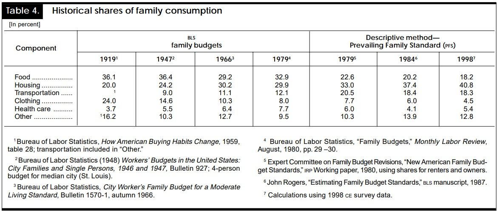
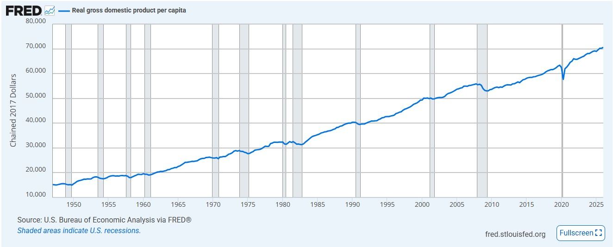

# Chapter 1: Key Insights to Think Like an Economist {#key-insights-to-think-like-an-economist}

> These basic principles of economics apply around the world and have applied over thousands of years of recorded history. They apply in many very different kinds of economies— capitalist, socialist, feudal, or whatever— and among a wide variety of peoples, cultures, and governments. Policies which led to rising price levels under Alexander the Great have led to rising price levels in America, thousands of years later. Rent control laws have led to a very similar set of consequences in Cairo, Hong Kong, Stockholm, Melbourne, and New York. So have similar agricultural policies in India and in the European Union countries.\
> — Thomas Sowell, *Basic Economics*, page 1

## 1.1 Thinking Like an Economist: The Importance of Incentives

One of the most important ideas in economics is that **people respond to incentives**. An *incentive* is anything that induces a person to act, such as the prospect of a reward or the fear of a penalty. Prices, wages, taxes, profits, and regulations all create incentives that shape individual decisions. For example, a higher wage may encourage a worker to supply more labor, while higher taxes on a good may discourage consumers from purchasing it. Similarly, the possibility of earning profits motivates firms to innovate and expand production, while the risk of losses encourages them to control costs and operate efficiently.

Incentives can be either positive (rewards) or negative (penalties), and both play a crucial role in guiding behavior. A student may study harder to earn a high grade (a positive incentive) or to avoid failing a course (a negative incentive). Governments also rely on incentives when designing public policy. Taxes, subsidies, and regulations are all intended to influence behavior by changing the costs and benefits of particular actions. Because individuals weigh the expected benefits and costs of their choices, even relatively small changes in incentives can produce surprisingly large changes in behavior.

The importance of incentives becomes even clearer when we consider the concept of **scarcity**. Scarcity refers to the fundamental economic problem that society has limited resources but unlimited wants. Time, income, labor, natural resources, and productive capacity are all finite, while human desires for goods and services are effectively unlimited. Because resources are scarce, individuals, businesses, and governments must continually make choices about how to allocate them. Every choice involves a trade-off, and incentives influence which alternative is ultimately selected. Understanding scarcity and incentives is therefore essential for understanding economic decision-making. One **definition of economics** is that it is the study of satisfying society’s unlimited wants with scarce resources.

### 1.1.1 Adam Smith and Self-Interest

The importance of incentives can be traced back to Adam Smith’s *An Inquiry into the Nature and Causes of the Wealth of Nations* (1776). Smith argued that individuals pursuing their own self-interest frequently promote the welfare of society, even when that is not their intention. He famously observed,

> "It is not from the benevolence of the butcher, the brewer, or the baker that we expect our dinner, but from their regard to their own interest."

Rather than relying on kindness or generosity, markets encourage individuals to produce goods and services because doing so benefits themselves. A baker earns income by producing bread that consumers value, while consumers benefit by purchasing the bread. Under competitive market conditions, prices and profits create incentives that guide resources toward their most valuable uses. Smith referred to this process metaphorically as the *invisible hand*.

::: realworld
**Economics in the Real World**

Every morning, thousands of people stop at coffee shops before work or class. The barista serves coffee because doing so earns a wage, the coffee shop operates because it hopes to earn a profit, and the coffee farmer grows coffee because selling beans provides income. None of these individuals are motivated primarily by helping you start your day. Yet their pursuit of self-interest results in millions of consumers receiving a product they value. This is one of Adam Smith’s central insights: properly functioning markets coordinate the decisions of countless individuals through incentives.
:::

### 1.1.2 Milton Friedman and the Power of Incentives

Nearly two centuries after Adam Smith, Milton Friedman further developed the idea that incentives are central to understanding economic behavior. Friedman argued that economists should evaluate policies based not on their intentions, but on the incentives they create and the behavior they encourage.

Consider a government program designed to assist low-income households. If benefits are reduced sharply each time a recipient earns additional income, individuals may have less incentive to work additional hours because much of the extra income is offset by lower benefits. Although the policy was created with good intentions, the incentives it creates may produce unintended consequences.

Friedman believed that competitive markets are generally effective because they reward businesses that satisfy consumers while encouraging inefficient firms to improve or exit the market. Profits and losses serve as signals that continually guide resources toward their most productive uses.

Friedman’s belief illustrates the difference between positve and normative economics. **Positive economics** examines economic questions about what *is*, what *was*, or what *will be*. Positive statements describe economic relationships that can, at least in principle, be evaluated using evidence. For example, “An increase in the minimum wage reduces employment under certain market conditions” is a positive claim because data and economic analysis can be used to evaluate whether it is true. **Normative economics**, in contrast, examines questions about what *ought to be*. Normative statements involve value judgments about which outcomes or policies are desirable. For example, “The government should increase the minimum wage” is a normative claim because deciding whether the policy *should* be adopted requires judgments about goals and tradeoffs. Economics is especially useful for evaluating the positive consequences of different choices, but economic analysis alone cannot determine which normative goals society ought to pursue.

::: misconception
**Common Misconception**

Many people believe that economists assume individuals are selfish. This is not what economists mean by *self-interest*. People often care deeply about their families, friends, communities, and charitable causes. Economists simply recognize that individuals make choices based on what they value. Those values may include generosity, volunteer work, or helping others. The important point is that incentives influence behavior regardless of a person’s motivations.
:::

::::: {#fig:smith_friedman .source-figure latex-placement="h!" source-number="1.1"}
::: minipage
 **Adam Smith (1723–1790)**
:::

::: minipage
 **Milton Friedman (1912–2006)**
:::

**Figure 1.1.** **Two influential thinkers on incentives.** Adam Smith, often regarded as the father of modern economics, emphasized how self-interest and market incentives can promote social welfare through the “invisible hand.” Milton Friedman, a leading twentieth-century economist, highlighted the central role of incentives in shaping behavior and argued that public policy should be evaluated based on the incentives it creates and their consequences. Photograph source: *Wikipedia*
:::::

::: {.aifiguredescription figure-id="fig:smith_friedman"}
**Figure description: `fig:smith_friedman`**

This is a paired portrait figure, not a graph. The left panel is an engraved profile portrait labeled **Adam Smith (1723–1790)**. The right panel is a seated photographic portrait of a man wearing glasses and holding papers, labeled **Milton Friedman (1912–2006)**. The supplied caption identifies the two economists; the image descriptions use those supplied identities.

The caption connects Smith with self-interest, market incentives, and the “invisible hand,” and Friedman with incentives, behavior, and evaluating the consequences of public policy. The surrounding section explains that self-interest can include concern for others and that incentives can produce unintended consequences. For tutoring, connect the portraits to those ideas rather than treating appearance as evidence about either economist's views.

There are no axes, quantitative observations, movements, or shaded economic regions. The portraits identify thinkers; they do not test or prove the economic claims in the caption. The original caption attributes the images to Wikipedia.
:::

### 1.1.3 Unintended Consequences

Because incentives influence behavior, policies and decisions often produce outcomes that were never intended. Economists therefore ask not only whether a policy sounds desirable, but also how people are likely to respond to it.

For example, rent control policies are often intended to make housing more affordable. However, if landlords earn lower returns from renting apartments, they may have less incentive to maintain existing properties or construct new housing. Over time, this can contribute to housing shortages or lower housing quality. Likewise, generous insurance coverage may reduce the incentive to avoid risky behavior, a phenomenon known as *moral hazard*.

Economists recognize that people adapt to changing incentives, which is why policies should always be evaluated according to both their intended and unintended effects.

::: thinkingeconomist
**Thinking Like an Economist**

Suppose your university announces that students who attend every class during the semester will receive an additional five percentage points on their final course grade.

- What incentive has the university created?

- How do you think student behavior will change?

- Can you identify any unintended consequences of this policy?

Think through your answers before discussing them with classmates or using a generative AI tool.
:::

::: researchbox
**From the Research**

**The Effects of Rent Control Expansion on Tenants, Landlords, and Inequality: Evidence from San Francisco**

“Using a 1994 law change, we exploit quasi-experimental variation in the assignment of rent control in San Francisco to study its impacts on tenants and landlords. Leveraging new data tracking individuals’ migration, we find rent control limits renters’ mobility by 20 percent and lowers displacement from San Francisco. Landlords treated by rent control reduce rental housing supplies by 15 percent by selling to owner-occupants and redeveloping buildings. Thus, while rent control prevents displacement of incumbent renters in the short run, the lost rental housing supply likely drove up market rents in the long run, ultimately undermining the goals of the law.”

*Diamond, Rebecca, Tim McQuade, and Franklin Qian. 2019. "The Effects of Rent Control Expansion on Tenants, Landlords, and Inequality: Evidence from San Francisco." American Economic Review 109 (9): 3365–94.*
:::

::: keytakeaways
**Key Takeaways**

- Incentives are factors that encourage or discourage particular actions.

- Individuals respond to changes in benefits and costs when making decisions.

- Scarcity requires people to make choices because resources are limited.

- Adam Smith argued that self-interest, guided by market incentives, can promote social welfare.

- Milton Friedman emphasized evaluating policies according to the incentives they create rather than their intentions.

- Economists pay close attention to unintended consequences because people adjust their behavior when incentives change.
:::

::: ailab
**AI Economics Lab**

Use a generative AI tool as your virtual teaching assistant to deepen your understanding of incentives. Before asking the AI for an explanation, answer each question yourself.

1.  **Explore:** Ask the AI to generate five examples of incentives from everyday life. Classify each as a positive or negative incentive and explain how it influences behavior.

2.  **Reason:** Ask the AI to describe a government policy that changes people’s incentives. Before reading its explanation, predict how individuals will respond. Compare your reasoning with the AI’s and identify any important differences.

3.  **Evaluate:** Ask the AI to explain Adam Smith’s idea of the invisible hand and Milton Friedman’s views on incentives. Evaluate whether the AI accurately distinguishes between the two economists’ contributions. If necessary, revise the explanation using ideas from this section.

4.  **Extend:** Ask the AI to invent a new public policy that changes incentives related to education, health, or the environment. Identify one intended consequence and at least two possible unintended consequences. Explain whether you believe the policy would achieve its objective.
:::

## 1.2 All Decisions Have Benefits — and Costs

Every day, individuals, businesses, and governments make decisions. Some choices are relatively simple, such as deciding what to eat for lunch or whether to study for another hour before an exam. Other decisions are much more significant, such as choosing a college, purchasing a home, or deciding whether a government should build a new highway. Although these decisions differ greatly in importance, they all have one thing in common: every choice involves both benefits and costs.

The benefits of a decision are often easy to recognize. A student who studies for an exam expects to earn a higher grade. A business that purchases new equipment expects to increase productivity and profits. Consumers buy goods and services because they expect those purchases to improve their well-being.

The costs of a decision, however, are often less obvious. Many people think of cost only as the amount of money paid for something. Economists take a much broader view. Every decision requires giving up an alternative, and that sacrifice is often more important than the money spent.

### 1.2.1 Opportunity Cost

Economists define the **opportunity cost** of a decision as the value of the next-best alternative that must be given up when a choice is made. Because resources are scarce, choosing one option necessarily means giving up another.

Suppose you have a free Saturday afternoon. You could study for your economics exam, work an extra shift at your part-time job, attend a football game with friends, or simply relax at home. If you choose to study, the opportunity cost is not the hours spent reading your textbook. Instead, it is the value of the next-best alternative you gave up. If attending the football game was your preferred alternative, then the enjoyment of the game represents the opportunity cost of studying.

This example illustrates an important point: opportunity cost is determined by the value of the *next-best* alternative, not by the value of every alternative that was available. Economists focus on the single best option that was sacrificed because it represents the true trade-off associated with a decision.

Opportunity cost is also subjective. Two people can face the same decision but have very different opportunity costs because they value alternatives differently. A student who earns \$25 per hour at a part-time job sacrifices more income by attending class than a student who does not work. Likewise, a graduating senior preparing for graduate school may value studying much more highly than a first-year student. Opportunity costs depend on individual preferences, circumstances, and available alternatives.

::: examplebox
**Example**

Suppose Taylor has \$40 and three options for spending the evening:

- Attend a concert for \$40

- Have dinner with friends for \$25

- Watch a movie at home for free

Taylor chooses to attend the concert.

The opportunity cost is *not* the \$40 ticket. The opportunity cost is the value of the next-best alternative—having dinner with friends. The \$40 is an explicit monetary cost, but the opportunity cost is the forgone value of the alternative Taylor would have chosen if the concert had not been available.
:::

### 1.2.2 Monetary and Non-Monetary Costs

Many important decisions involve costs that cannot be measured in dollars.

Imagine you receive free tickets to a professional baseball game. Since the tickets cost nothing, many people would conclude that attending the game is free. An economist would disagree. By attending the game, you give up several hours that could have been spent working, studying, spending time with family, or relaxing. Although the tickets are free, your time is not.

In fact, some of the most valuable opportunity costs involve resources that have no market price. Time with loved ones, personal health, leisure, sleep, and educational opportunities all have tremendous value despite not being bought and sold in markets.

This broader definition of cost helps explain why economists often reach different conclusions than non-economists. While accountants primarily record explicit monetary costs, economists are concerned with the full value of the alternatives that are sacrificed.

::: realworld
**Economics in the Real World**

Many universities encourage students to graduate in four years. The tuition for taking an additional semester is an obvious monetary cost. However, the opportunity cost of delaying graduation is often much larger. Graduating one semester later may postpone full-time employment, delay earning a professional salary, and reduce lifetime earnings. Economists therefore consider both the explicit costs of tuition and the value of the opportunities that are postponed.
:::

::: misconception
**Common Misconception**

Students often believe that opportunity cost is simply the amount of money spent on a purchase.

Opportunity cost is much broader. It is the value of the best alternative that must be given up. Sometimes that alternative involves money, but it may also involve time, leisure, education, relationships, or other valuable opportunities.
:::

::: thinkingeconomist
**Thinking Like an Economist**

You receive two free tickets to a concert on Friday night. At the same time, your employer offers you the opportunity to work an extra shift that pays \$150.

- Is attending the concert really "free"?

- What is the opportunity cost of attending the concert?

- Would your answer change if you valued the concert more than the \$150 in wages? Why?

Explain your reasoning before discussing the scenario with a classmate or using a generative AI tool.
:::

::: researchbox
**From the Research**

**Opportunity Costs:** Check out the blog available from the St. Louis Federal Reserve Bank at <https://www.stlouisfed.org/open-vault/2020/january/real-life-examples-opportunity-cost> to see numerous examples of opportunity costs in action.
:::

::: keytakeaways
**Key Takeaways**

- Every decision involves both benefits and costs.

- Opportunity cost is the value of the next-best alternative that is given up.

- Opportunity cost includes both monetary and non-monetary costs.

- Opportunity costs differ across individuals because people value alternatives differently.

- Economists evaluate decisions by considering all relevant trade-offs, not just explicit monetary costs.
:::

::: ailab
**AI Economics Lab**

Use a generative AI tool as your virtual teaching assistant to strengthen your understanding of opportunity cost. Before consulting the AI, answer each question independently.

1.  **Explore:** Ask the AI to generate five everyday decisions involving opportunity cost. For each scenario, identify the next-best alternative before viewing the AI’s explanation.

    “‘

2.  **Reason:** Ask the AI to create three examples in which the most important opportunity cost is not monetary but instead involves time, relationships, leisure, or education. Explain why these non-monetary costs are economically important.

3.  **Evaluate:** Ask the AI to generate a complex scenario involving a consumer, a business, or a government. Determine the opportunity cost yourself, then compare your reasoning with the AI’s. Did the AI correctly identify the next-best alternative? Did it overlook any important trade-offs?

4.  **Extend:** Ask the AI to modify one of the scenarios by changing the available alternatives or the decision-maker’s preferences. Explain how the opportunity cost changes and why different individuals might make different choices when faced with the same decision. “‘
:::

## 1.3 Individuals Are Rational Actors

Every day, people make thousands of decisions. Some are simple, such as choosing what to eat for breakfast, while others are much more significant, such as selecting a college major, accepting a job offer, or purchasing a home. Although these decisions vary in importance, economists generally begin with a simple assumption: individuals are **rational actors**. This assumption provides a useful framework for understanding and predicting economic behavior.

The word *rational* is often misunderstood. In everyday conversation, calling someone “rational” may suggest that they always make perfect decisions or never make mistakes. Economists mean something much more specific. A rational individual is someone who systematically compares the expected benefits and expected costs of available alternatives and chooses the option that best advances his or her objectives.

Importantly, economists do not assume that everyone has the same objectives because everyone has different **tastes and preferences**. One person may seek to maximize income, while another values leisure, family, or charitable giving more highly. Rationality does not imply selfishness, greed, or perfection. It simply means that people attempt to make choices that are consistent with their own preferences given the information and resources available to them.

### 1.3.1 Rational Does Not Mean Perfect

Real people make mistakes. They forget appointments, overspend, procrastinate, and occasionally make decisions they later regret. None of these behaviors contradict the idea of rationality in economics.

Economists recognize that individuals make decisions with limited information and under conditions of uncertainty. A student deciding whether to major in economics cannot know with certainty what the job market will look like four years from now. An entrepreneur opening a new business cannot know whether customers will embrace the product. Rational decision-makers use the best information available at the time, recognizing that outcomes are uncertain.

This distinction is important. Economists evaluate decisions based on the information available when the decision was made, not based on information that becomes available afterward. A good decision can produce a poor outcome simply because of bad luck, while a poor decision may occasionally produce a good outcome by chance.

Moreover, individuals learn over time and tend to make even better decisions over time. For instance, have you ever gone to a new restaurant only to determine that the food is not good and very expensive? You probably were not very happy with your experience. Although you did not actually optimize your well-being by choosing the restaurant the first time, you do improve your ability to optimize your well-being by learning that you do not enjoy the restaurant and then choosing a different restaurant the next weekend.

::: examplebox
**Example**

Imagine that Jordan has two job offers.

The first job pays \$55,000 per year and offers excellent health insurance, retirement benefits, and opportunities for advancement.

The second job pays \$60,000 per year but offers no benefits and little opportunity for career growth.

Jordan carefully compares salary, benefits, commuting time, workplace culture, and long-term career prospects before accepting the first offer.

Although Jordan chooses the lower salary, an economist would still describe the decision as rational because it reflects Jordan’s preferences and considers all relevant benefits and costs rather than focusing on salary alone.

Which of these two would you choose? There is no wrong answer to this question because it comes down to your tastes and preferences. However, the fact that you have considered all of the relevant details of the job makes you rational.
:::

### 1.3.2 Marginal Thinking

Economists also recognize that rational individuals rarely make “all-or-nothing” decisions. Instead, they compare the additional benefits and additional costs associated with small changes in their behavior. This process is known as **marginal thinking**.

The word *marginal* means ‘additional’’ or ‘incremental.’’ Rather than asking whether studying is worthwhile in general, a student asks whether studying one additional hour is worthwhile. Rather than deciding whether to hire workers, a business asks whether hiring one more employee will increase profits. Harvard economist Larry Summers once described this phenomenon by pointing out that, while the first lesson of economics is that people always would like more, the second lesson is that one person can only stomach two Big Macs at one time.

This way of thinking helps explain many everyday decisions. A runner training for a marathon may decide that one additional mile of practice is worthwhile, but five additional miles may not be. Likewise, a restaurant owner may determine that serving ten additional customers each evening is profitable, while remaining open for two extra hours is not.

Economists therefore conclude that rational individuals continue an activity as long as the additional benefit exceeds the additional cost. When the additional cost becomes greater than the additional benefit, it is rational to stop.

::: definitionbox
**Definition**

**Marginal thinking** is the process of comparing the additional (marginal) benefits of an action with its additional (marginal) costs. Rational decision-makers choose to continue an activity as long as the marginal benefit exceeds the marginal cost.
:::

### 1.3.3 The Rational Actor Model

The rational actor model is one of the most important building blocks in economics. By assuming that individuals respond systematically to incentives and compare benefits with costs, economists can develop models that explain consumer behavior, business decisions, and government policy.

Like all models, the rational actor model is a simplification of reality. It does not claim that people are perfect decision-makers or that they never act emotionally. Instead, it provides a useful starting point for understanding behavior. Even then, the rational actor model remains an essential benchmark against which economists compare actual behavior. Moreover, by assuming people are rational, you can make *powerful* predictions about their behaviors and how those behaviors culminate in good, or bad, outcomes for society at large.

::: realworld
**Economics in the Real World**

Many grocery stores offer loyalty cards that provide discounts on frequently purchased items. These programs are based on the assumption that consumers respond to incentives and make rational comparisons between prices. If using a loyalty card reduces the cost of groceries, many shoppers will choose to sign up and shop more at the store because the expected benefits exceed the small amount of time required to enroll. Businesses use similar reasoning when designing pricing strategies, reward programs, and promotional discounts.
:::

::: misconception
**Common Misconception**

A common misconception is that rational people never make mistakes or always make the “best” decision.

Economists do not assume that individuals are perfect. Instead, they assume that people attempt to make the best decision they can given their preferences, the information available, and the constraints they face. Good decisions can sometimes produce bad outcomes, just as poor decisions can occasionally produce good outcomes.
:::

::: thinkingeconomist
**Thinking Like an Economist**

Imagine that you have already studied for three hours for tomorrow’s economics exam. You are considering whether to study for one more hour or watch a movie with friends.

- What are the marginal benefits of studying for one additional hour?

- What are the marginal costs?

- How would a rational decision-maker approach this choice?

- Could two students reasonably make different decisions? Explain why.

Answer these questions before discussing them with classmates or consulting a generative AI tool.
:::

::: researchbox
**From the Research**

**Dolphins are Deep Thinkers:** The article “Why dolphins are deep thinkers” (<https://www.theguardian.com/science/2003/jul/03/research.science>) is a story about how dolphin trainers created a bad incentive scheme. In essence, the dolphins would be compensated in fish for helping to keep the aquarium free of litter and seagulls. However, the dolphins acted rationally to maximize their allotment of fish — at the expense of the cleanliness of the aquarium! The article is a cautionary tale that incentives can lead to good outcomes with good institutions and bad outcomes with bad institutions. Read the article to see how this worked.
:::

::: keytakeaways
**Key Takeaways**

- Economists assume that individuals are rational actors who compare expected benefits and expected costs.

- Rationality does not imply selfishness, perfection, or identical preferences.

- Decisions are made using the best information available, even when outcomes are uncertain.

- Rational individuals think at the margin by comparing additional benefits with additional costs.

- The rational actor model is a simplified framework that helps economists explain and predict behavior.
:::

::: ailab
**AI Economics Lab**

Use a generative AI tool as your virtual teaching assistant to explore the rational actor model. Before asking the AI for assistance, answer each question independently.

1.  **Explore:** Ask the AI to generate five everyday decisions that illustrate rational decision-making. For each example, identify the benefits, costs, and incentives influencing the decision.

2.  **Reason:** Ask the AI to create three scenarios in which two rational individuals make different choices even though they face the same situation. Explain why both decisions could be considered rational.

3.  **Evaluate:** Ask the AI to explain the difference between being rational and being perfect. Critique the explanation. Did the AI accurately distinguish between rational decision-making and flawless decision-making? If not, revise its explanation using concepts from this section.

4.  **Extend:** Ask the AI to describe a real-world situation in which emotions, limited information, or uncertainty might influence a person’s decision. Explain how an economist could still use the rational actor model as a useful starting point for analyzing that behavior.
:::

## 1.4 Good Institutions Create Good Outcomes

So far, this chapter has emphasized that people respond to incentives, face opportunity costs, and make choices by comparing benefits and costs. But incentives do not appear out of nowhere. They are shaped by the environment in which people make decisions. Economists call this environment the economy’s **institutions**.

Institutions are the formal and informal rules that structure human interaction. They include laws, property rights, courts, contracts, social norms, political systems, business regulations, and expectations about trust and fairness. These rules influence what people are allowed to do, what they are rewarded for doing, and what they are discouraged from doing.

The basic idea is simple but powerful: **good institutions create good incentives, and good incentives tend to produce better economic outcomes**. When institutions reward productive behavior, people are more likely to invest, work, innovate, trade, and cooperate. When institutions reward corruption, favoritism, theft, or political influence, resources are often wasted and economic progress slows.

::: definitionbox
**Definition**

**Institutions** are the formal and informal rules that shape economic, political, and social behavior.

Formal institutions include written laws, constitutions, property rights, courts, tax systems, and regulations. Informal institutions include customs, norms, trust, culture, and expectations about acceptable behavior.
:::

### 1.4.1 Institutions Shape Incentives

Institutions matter because they determine the incentives people face. Consider the importance of property rights. A **property right** is the legal ability to own, use, sell, or transfer something of value. If individuals believe that they can keep the rewards from their effort, they have a stronger incentive to work, save, invest, and innovate. A farmer is more likely to improve land if she expects to benefit from future harvests. A business owner is more likely to purchase new equipment if he expects to keep the profits generated by that investment.

By contrast, weak property rights reduce the incentive to invest. If people fear that their land, business, income, or ideas can be taken away without fair process, they are less likely to devote time and resources to long-term projects. Instead, they may focus on short-term survival, political connections, or protecting what they already have.

Property rights do not necessarily have to involve physical property. One of the most important forms of property rights is the patent, which protects the creators of intellectual property from the theft of their ideas or inventions. For instance, if anyone could copy the iPhone and sell it for a lower price than Apple, Apple would not have had an incentive to spend an estimated \$150 million researching and developing the first iPhone. Therefore, the iPhone would have never been invented. Alan Greenspan in his book *Capitalism in America* argues strongly that about the importance of the protection of intellectual property rights in the United States (the Constitution explicitly provides authorization to Congress to enact laws for the protection of intellectual property rights) as a key reason for the sustained economic growth of the country.

Institutions also influence trust. Markets require people to exchange with others they may not know personally. When contracts are enforced, courts are reliable, and fraud is punished, people are more willing to engage in trade. A customer can buy from a business, a bank can lend to a borrower, and a firm can hire a worker because each party expects the rules of the exchange to be respected.

::: examplebox
**Example**

Imagine two towns that are identical in population, resources, and location.

In Town A, property rights are secure, contracts are enforced, and local officials apply the law fairly. Entrepreneurs who start businesses can expect to keep their profits if they serve customers well.

In Town B, property rights are uncertain, contracts are often ignored, and officials sometimes demand favors before granting permits. Entrepreneurs must spend time protecting themselves instead of improving their products.

Over time, Town A is likely to attract more investment, create more jobs, and experience stronger economic growth. The difference is not the people themselves but the institutions that shape their incentives.

See the outcome of actual examples just like this in this section’s “Economics in the Real World.” These examples show the economic destitution caused by poor economic institutions implemented with non-capitalist economies such as socialism and communism.
:::

### 1.4.2 Formal and Informal Institutions

Some institutions are formal. These are written rules created and enforced by governments or organizations. Examples include tax laws, business licenses, banking regulations, court systems, and rules governing elections. Formal institutions are important because they define what is legal, how disputes are resolved, and how economic activity is organized.

Other institutions are informal. These include trust, social norms, habits, traditions, and expectations. Informal institutions can be just as important as formal laws. For example, a society in which people generally keep promises, respect contracts, and deal honestly with strangers can support economic exchange more easily than a society in which people expect dishonesty or corruption.

Formal and informal institutions often reinforce one another. A well-functioning legal system may strengthen trust, while widespread trust may make laws easier to enforce. But the opposite can also occur. If people expect corruption, they may begin to act corruptly themselves, making formal rules less effective.

### 1.4.3 Institutions and Macroeconomic Performance

Institutions are especially important in macroeconomics because they affect the performance of the entire economy. Countries with strong institutions tend to provide better incentives for saving, investment, entrepreneurship, education, and technological progress. These activities are central to long-run economic growth.

Good institutions do not guarantee prosperity, and weak institutions do not explain every economic problem. Geography, natural resources, history, education, technology, and global conditions also matter. But institutions influence how effectively a society uses its resources. Two countries may have similar natural resources but very different economic outcomes if one has institutions that encourage productive activity while the other has institutions that encourage corruption or conflict.

Look at the section “Economics in the Real World.” When you consider the cases of East and West Germany or North and South Korea, keep in mind that in both cases the countries started as one country and split into a communist side (East Germany and North Korea) as well as a capitalist side (West Germany and South Korea). Despite sharing similar resources, cultures, languages, and religions, as well as starting with similar levels of economic well-being, the communist countries quickly diverged to become far worse off than their capitalist counterparts.

::: realworld
**Economics in the Real World**

**East and West Germany** West Germany (today referred to simply as Germany after the two countries reunited in the early 1990s) is home to some of the greatest car manufacturers in the world, including Volkswagon, Porsche, Mercedes-Benz, Audi, and BMW. These cars are popular all over the world and are known for their affordability (in the case of Volkswagon, at least) and quality.

East Germany, a communist country and member of the USSR founded as a result of World War II, manufactured the Trabant. The *only* car manufactured in East Germany was the Trabant. It was a four-door sedan made of recycled plastics created as by-products from other manufacturing that occurred in East Germany. It had a two-stroke engine, similar to a modern lawn mower, and had emmisions far higher than modern European standards would allow for. The old joke was the you would smell a Trabant before you would see it coming. East Germans could wait for **years** on a waiting list to be able to get a Trabant (assuming they were actually able to ever get on the list, a true feat in itself).

Why was the disparity in car manufacturing so great between West and East Germany? The answer is simple. In West Germany, competitive markets force manufacturers to build cars that people want to buy at price points they can afford. In East Germany, a lack of competition never forced Trabants to be improved or delivered in a timely manner. In fact, the lack of competition reinforced the Trabant as a terrible automobile.
:::

::::: {#fig:Porsche_Trabant .source-figure latex-placement="h!" source-number="1.2"}
::: minipage
 **Porsche 911**
:::

::: minipage
 **Trabant**
:::

**Figure 1.2.** Photograph source: *The Porsche Newsroom and Wikipedia*
:::::

::: {.aifiguredescription figure-id="fig:Porsche_Trabant"}
**Figure description: `fig:Porsche_Trabant`**

Two photographs are paired. The left panel, labeled **Porsche 911**, shows a dark sports coupe on a paved road with mountains in the background. The right panel, labeled **Trabant**, shows a pale compact car displayed indoors. The photographs are identified by the author's labels, and their original relative order is retained.

The surrounding example contrasts competitive automobile production in West Germany with the East German Trabant and connects the contrast to incentives, competition, product improvement, and waiting times. The images give visual context to the example; they contain no axes, prices, production statistics, measured quality comparisons, or waiting-time data.

A tutor should distinguish the visible contrast between two selected cars from the historical and causal claims made in the prose. The photos alone do not establish how much of any difference was caused by an economic system, and the pictured models are not a controlled comparison. The original caption credits The Porsche Newsroom and Wikipedia.
:::

::: realworld
**Economics in the Real World**

**North and South Korea** Look at the nearby photo of the Korean Peninsula at night (Figure [1.3](#fig:Korea){reference-type="ref" reference="fig:Korea"} taken by NASA. The very bright “island” in the bottom right of the photo is South Korea. The light area in the upper half left of the photo is China. The dark area between the two areas of light is North Korea. The country is not visible (or hardly visible) because there are no lights on in the country due to a lack of economic progress sufficient to generate the amount of electricity necessary to run lights at night.

At the time North and South Korea split in the 1950s, both countries had similarly low levels of economic development. However, South Korea, which embraced capitalism, has experienced tremendous economic progress and is considered a “growth miracle” by many economists. On the other hand, North Korea, which embraced communism, has not enjoyed the same level of economic growth, if any at all, since the 1950s. The countries serve as a kind of natural laboratory to see the importance of good economic institutions and the humanitarian disasters caused by bad economic institutions.
:::

::: {#fig:Korea .source-figure source-number="1.3"}

**Figure 1.3.** Photograph source: *NASA*
:::

::: {.aifiguredescription figure-id="fig:Korea"}
**Figure description: `fig:Korea`**

This is an oblique nighttime photograph of the Korean Peninsula from space. Following the locations identified in the surrounding text, the bright concentration of lights in the lower-right portion is South Korea, the illuminated land toward the upper left is China, and the much darker region between them is North Korea. Some isolated lights remain visible in the darker region. Earth's curved horizon and a greenish atmospheric band cross the upper part of the image; part of spacecraft equipment is visible near the top.

There are no plotted axes, political boundary lines, numerical brightness scale, dates, income observations, or economic-growth series on the image. Read the spatial contrast in visible lighting, not the dark region as literally empty or entirely without electricity.

The author uses this image in a discussion of economic institutions and the divergent development of North and South Korea. A tutor can ask how incentives and institutions might affect investment and productive capacity while distinguishing the photograph from a causal estimate. Nighttime illumination is not a direct measurement of GDP per person or welfare, and the image alone cannot establish the cause of the contrast. The original caption credits NASA.
:::

::: misconception
**Common Misconception**

A common misconception is that “good institutions” simply means “less government.”

Economists do not define good institutions by the size of government alone. Good institutions are those that create productive incentives, protect rights, enforce rules fairly, limit corruption, and allow people to participate in economic life. In some cases, this requires government to step back. In other cases, it requires government to enforce contracts, provide public goods, regulate harmful behavior, or maintain a stable legal system.
:::

::: thinkingeconomist
**Thinking Like an Economist**

Suppose two students want to sell used textbooks on campus.

At University A, there is a clear online marketplace, payment rules are secure, and students who cheat buyers are banned from the platform.

At University B, there is no organized marketplace, payments are risky, and students have little protection if a seller takes their money without delivering the book.

- How do the institutions differ between the two universities?

- How would these differences affect students’ willingness to buy and sell used textbooks?

- What incentives are created by the rules at University A?

- What might happen to trade at University B?

Use this example to explain why institutions matter for economic outcomes.
:::

::: researchbox
**From the Research**

Incentives can often go awry. When a set of incentives leads to someone changing their behavior for the worse, we refer to it as **moral hazard**. Requiring insurance for automobiles has provided a moral hazard. In fact, the National Bureau of Economic Research has summarized an academic working paper here <https://www.nber.org/digest/nov03/auto-insurance-and-traffic-fatalities?page=1&perPage=50>. They state “No-fault limits on driver liability in an accident, by diminishing the possibility of being sued, increase fatalities by about 10 percent.”
:::

::: keytakeaways
**Key Takeaways**

- Institutions are the formal and informal rules that shape human behavior.

- Institutions matter because they influence incentives.

- Strong property rights, reliable contracts, fair legal systems, and trust encourage investment, trade, and innovation.

- Weak institutions can discourage productive activity and encourage corruption, short-term thinking, or rent-seeking.

- Good institutions are not defined simply by the size of government; they are defined by whether they create incentives for productive economic behavior.

- Institutions play an important role in explaining long-run macroeconomic performance.
:::

::: ailab
**AI Economics Lab**

Use a generative AI tool as your virtual teaching assistant to explore how institutions shape economic outcomes. Before asking the AI for assistance, answer each question independently.

1.  **Explore:** Ask the AI to generate five examples of institutions that affect economic behavior. Classify each as a formal institution or an informal institution. Then explain what incentive each institution creates

2.  **Reason:** Ask the AI to describe two communities that are similar in resources but different in institutions. Before reading the AI’s full explanation, predict which community would likely experience stronger economic growth and explain why.

3.  **Evaluate:** Ask the AI to explain the statement, “Good institutions create good outcomes.” Critique the response. Did the AI focus on incentives, property rights, contracts, trust, and rule enforcement? Did it oversimplify the issue by assuming that institutions are the only thing that matters?

4.  **Extend:** Ask the AI to design an institutional reform that could improve economic activity in a city, university, or country. Identify the incentives the reform would create, one possible benefit, and one possible unintended consequence.
:::

## 1.5 Economic Growth Matters {#sec:economic_growth_matters}

Macroeconomics is partly the study of why some societies become wealthier over time while others remain poor. Few questions are more important. Economic growth affects the jobs people can find, the wages they earn, the goods and services they can afford, the quality of public services, and the opportunities available to future generations.

At its most basic level, **economic growth** means that an economy becomes able to produce more goods and services over time. A growing economy can produce more food, housing, medical care, education, transportation, entertainment, and technology. Growth does not eliminate scarcity, but it makes scarcity less severe by expanding the set of choices available to individuals and society.

Economic growth matters because higher production makes higher living standards possible. In a poor economy, even basic needs may be difficult to meet. In a richer economy, more people can access education, health care, safe housing, reliable transportation, and leisure. Growth also gives governments more resources to fund public goods such as roads, schools, courts, national defense, and scientific research.

Take a minute to look at Table 4, shown in Figure [1.4](#fig:Family-Budgets){reference-type="ref" reference="fig:Family Budgets"}. The figure shows the share of a typical family’s budget spent on different categories of items. The trend is that, as the United States’s economy has grown in the last century, the share of a family’s budget devoted to basic items has tended to decline. As the share of the budget spend on things like food and clothing have declined, more income is available for spending on things people want, instead of just the things they need. One important caveat is that the expenditure on housing has increased along with the expenditure on transportation. Housing has improved over the last century with larger homes furnished with better appliances and features, such as air conditioning, pools, garages, more bedrooms, etc. The increase in housing quality helps to explain the increase in spending on housing. Transportation is also dramatically different from 1919, when only the richest Americans could afford a car. Therefore, the increase in expenditure on transportation reflects the heavy usage of automobiles in American society today compared to early time periods. Moreover, the proliferation of automobiles throughout American society actually is a powerful consequence of the economic growth the US has experienced in the last 100 years.

::: {#fig:Family-Budgets .source-figure source-label="fig:Family Budgets" source-number="1.4"}

**Figure 1.4.** Source: *A century of family budgets in the United States; Johnson, Rodgers, and Tan, 2001. Bureau of Labor Statistics*
:::

::: {.aifiguredescription figure-id="fig:Family-Budgets"}
**Figure description: `fig:Family Budgets`**

The image is a scanned table, headed **“Table 4. Historical shares of family consumption”**, with values **in percent**. Its six rows are Food, Housing, Transportation, Clothing, Health care, and Other. It has two groups of columns: **BLS family budgets** (1919, 1947, 1966, 1979), followed by **Descriptive method—Prevailing Family Standard (PFS)** (1979, 1984, 1998). The two 1979 columns use different methods and must not be merged.

The values printed in the image are transcribed below. “Included in Other” explains a source footnote; it is not a numeric zero.

  ------------------------------------------------------------------------------------------------------
  Component                   BLS 1919   BLS 1947   BLS 1966   BLS 1979   PFS 1979   PFS 1984   PFS 1998
  ---------------- ------------------- ---------- ---------- ---------- ---------- ---------- ----------
  Food                            36.1       36.4       29.2       32.9       22.6       20.2       18.2

  Housing                         20.0       24.2       30.2       29.9       33.0       37.4       40.8

  Transportation     Included in Other        9.0       11.1       12.1       20.5       18.4       18.3

  Clothing                        24.0       14.6       10.3        8.0        7.7        6.0        4.5

  Health care                      3.7        5.5        6.4        7.7        6.0        4.1        5.4

  Other                           16.2       10.3       12.7        9.5       10.3       13.9       12.8
  ------------------------------------------------------------------------------------------------------

The image's column footnotes identify: (1) BLS, *How American Buying Habits Change*, 1959, table 28, with transportation included in Other; (2) BLS (1948), *Workers' Budgets in the United States: City Families and Single Persons, 1946 and 1947*, Bulletin 927, a four-person urban family, city of St. Louis; (3) BLS, *City Worker's Family Budget for a Moderate Living Standard*, Bulletin 1570-1, autumn 1966; (4) BLS, “Family Budgets,” *Monthly Labor Review*, August 1980, pp. 29–30; (5) Expert Committee on Family Budget Revisions, “New American Budget Standards,” IRP Working Paper, 1980, using renter and owner shares; (6) John Rogers, “Estimating Family Budget Standards,” BLS manuscript, 1987; (7) calculations using 1998 CE survey data. These are transcriptions of the supplied image, not newly verified bibliography records. The chapter caption separately credits Johnson, Rodgers, and Tan (2001), Bureau of Labor Statistics.

The surrounding prose uses changes in budget shares to discuss economic growth and changes in the quality and availability of housing, clothing, and transportation. Lower spending shares need not mean lower absolute spending or lower consumption, and a higher housing share does not by itself measure a decline in living standards. Methods and reference households differ across these columns; the image is not a uniform annual time series or a causal estimate.
:::

::: definitionbox
**Definition**

**Economic growth** is a sustained increase in an economy’s ability to produce goods and services over time.

Economists usually measure economic growth using changes in **real gross domestic product**, or **real GDP**, which adjusts the value of production for changes in prices.
:::

### 1.5.1 Real GDP and Living Standards

To understand economic growth, economists often begin with **gross domestic product (GDP)**. GDP measures the total market value of all final goods and services produced within a country during a specific period of time. We will study GDP more carefully in a later chapter, but for now the key idea is that GDP provides a broad measure of economic production.

However, economists are usually not interested in whether production rises simply because prices increase. If every price in the economy doubled, measured spending would rise, but people would not necessarily have more goods and services. For this reason, economists focus on **real GDP**, which adjusts for inflation. Real GDP measures production in a way that separates changes in actual output from changes in prices.

Economists also pay close attention to **real GDP per capita**, which is real GDP divided by the population. This measure gives a rough estimate of average real production per person. If real GDP grows but population grows just as quickly, average living standards may not rise. For living standards to improve on average, real GDP must grow faster than population.

::: definitionbox
**Definition**

**Real GDP per capita** is real GDP divided by population.

It is often used as a rough measure of average material living standards because it shows how much real output is produced per person.
:::

Real GDP per capita is useful, but it is not perfect. It is an average, which means it does not tell us how income is distributed. A country may have high real GDP per capita while many people remain poor. It also does not fully measure non-market activities, environmental quality, leisure, health, family life, or personal freedom. Still, real GDP per capita is one of the most important indicators economists use to compare living standards across countries and over time.

Look at Figure [1.5](#fig:GDPperCapUSA){reference-type="ref" reference="fig:GDPperCapUSA"}. It shows just how much better off in economic terms Americans are today compared to 1947.

::: {#fig:GDPperCapUSA .source-figure source-number="1.5"}

**Figure 1.5.** Real GDP per Capita in the United States (1947 — 2026)\
Source: *Federal Reserve Economic Data*
:::

::: {.aifiguredescription figure-id="fig:GDPperCapUSA"}
**Figure description: `fig:GDPperCapUSA`**

This FRED time-series chart is labeled **Real gross domestic product per capita**. The horizontal axis is calendar time, with printed ticks from 1950 to 2025; the chapter caption specifies 1947–2026. The vertical axis is **Chained 2017 Dollars**, with ticks from 10,000 to 80,000. One blue line rises from roughly 14,000 near the left edge to roughly 70,000 near the right edge. These endpoint values are visual approximations, not extracted data.

The long-run upward trend is interrupted by recessions and slowdowns. Visible declines include the period around 2008–2009 and a particularly sharp fall and rebound around 2020. Gray vertical bands indicate U.S. recessions, as the image's note states. The source printed inside the image is the U.S. Bureau of Economic Analysis via FRED; the chapter caption credits Federal Reserve Economic Data.

The surrounding section connects sustained growth in real output per person with living standards and explains why small growth differences compound over time. This chart plots the **level** of real GDP per capita, not its growth rate; a rising level need not imply an accelerating growth rate. Dollar values are inflation-adjusted using the chart's stated base convention. Per-capita GDP is an average, not each person's income, a distributional measure, or a complete measure of welfare. The picture does not isolate the causes of growth. Use the preserved image/caption date range rather than treating the last point as a live observation.
:::

### 1.5.2 Small Growth Differences Become Large Over Time

One reason economic growth matters so much is that growth compounds. **Compound growth** means that growth builds on previous growth. When an economy grows this year, next year’s growth begins from a larger base. Over long periods of time, even small differences in growth rates can produce enormous differences in living standards.

Suppose two economies begin with real GDP per capita of \$50,000. Economy A grows at 1% per year, while Economy B grows at 3% per year. At first, the difference may not seem large. But after 30 years, the gap becomes dramatic.

::: examplebox
**Example**

Suppose real GDP per capita begins at \$50,000.

If the economy grows at 1% per year for 30 years:

$\$50{,}000 \times (1.01)^{30} \approx \$67{,}400$

If the economy grows at 3% per year for 30 years:

$\$50{,}000 \times (1.03)^{30} \approx \$121{,}400$

The difference between 1% and 3% annual growth may appear small in a single year, but over a generation it produces very different living standards.
:::

Economists often use the **Rule of 70** to estimate how long it takes a growing variable to double. The rule states:

$\mathrm{Years\ to\ double} \approx \frac{70}{\mathrm{annual\ growth\ rate}}$

Using this rule, an economy growing at 2% per year doubles roughly every 35 years. An economy growing at 4% per year doubles roughly every 17.5 years. This is why economists care so much about long-run growth rates. A small increase in the annual growth rate can have a large effect on future generations.

### 1.5.3 The Sources of Economic Growth

Economic growth does not happen automatically. It depends on an economy’s ability to use resources more productively over time. Economists often emphasize several major sources of growth.

First, growth can occur when an economy accumulates more **physical capital**. Physical capital includes tools, machines, factories, roads, computers, and other produced goods used to make additional goods and services. When workers have better equipment, they can usually produce more.

Second, growth depends on **human capital**. Human capital refers to the knowledge, skills, education, training, and health of workers. A more educated and healthier workforce is generally more productive.

Third, growth depends on **technology**. Technology is not computers or machines. It is the new ideas, improved production methods, better organization, and scientific discoveries that drive economic output. Technological progress allows society to produce more output from the same amount of labor and capital.

Fourth, as we saw in Section [1.5](#sec:economic_growth_matters){reference-type="ref" reference="sec:economic_growth_matters"}, institutions matter. Secure property rights, reliable courts, honest government, stable money, competitive markets, and social trust all influence whether people have incentives to invest, innovate, and cooperate.

::: definitionbox
**Definition**

**Productivity** is the amount of output produced per unit of input, such as output per worker or output per hour worked.

In the long run, rising productivity is the main source of higher living standards.
:::

### 1.5.4 Growth Requires Trade-Offs

Economic growth creates benefits, but achieving growth often requires trade-offs. A society that wants faster growth may need to devote more resources to investment, education, research, infrastructure, and technological development. Those resources could have been used for current consumption instead.

For example, a government that spends more on roads, schools, or scientific research may have fewer resources available for other programs today. A student who spends time building skills may give up leisure in the present to improve future opportunities. A business that invests in new equipment may sacrifice short-run profits in order to become more productive later.

These trade-offs do not mean growth is always worth every cost. Economists recognize that growth can involve environmental costs, unequal benefits, disrupted communities, or pressure on workers. The point is not that more output is always better in every circumstance. The point is that economic growth expands society’s possibilities, and understanding its benefits and costs is essential for good decision-making.

::: realworld
**Economics in the Real World**

Consider a small business that invests in new technology to help workers produce more efficiently. At first, the investment may be costly. The business must purchase equipment, train employees, and adjust its operations. In the short run, profits may even fall.

Over time, however, the new technology may allow each worker to produce more output per hour. If productivity rises, the business can serve more customers, reduce costs, raise wages, or lower prices. This small example illustrates a broader macroeconomic principle: sustained improvements in productivity are central to rising living standards.
:::

::: misconception
**Common Misconception**

A common misconception is that economic growth simply means “more money” or “higher prices.”

Economists are interested in *real* growth: an increase in the actual goods and services an economy can produce. If measured GDP rises only because prices are higher, people are not necessarily better off. True economic growth means the economy’s productive capacity has increased. Indeed, many people accuse economists of simply trying to pursue market value, even at the expense of people. However, this is simply not the case. Economists worry about market value specifically because it measures how well off people are.
:::

::: thinkingeconomist
**Thinking Like an Economist**

Suppose two countries have the same real GDP per capita today. Country A grows at 1% per year, while Country B grows at 3% per year.

- Which country will likely have higher living standards after one generation?

- Why does compound growth make small differences in growth rates important?

- What kinds of investments or institutions might help Country A grow faster?

- Is faster growth always better? What possible costs should economists consider?

Use this example to explain why long-run economic growth is one of the central topics in macroeconomics.
:::

::: researchbox
**From the Research**

Often times people will argue that the benefits of economic growth are concentrated among the rich and powerful in an economy. The Dallas Fed published a very interesting paper arguing against this idea. They showed the prices of different goods and services based on how many hours a typical manufacturing worker would have to work to afford a particular good or service. Almost universally, the time cost of goods and services in the United States have dramatically declined in the last 100 years. The report is available here: <https://fraser.stlouisfed.org/title/annual-report-federal-reserve-bank-dallas-475/1997-annual-report-596521>.
:::

::: keytakeaways
**Key Takeaways**

- Economic growth is a sustained increase in an economy’s ability to produce goods and services over time.

- Economists focus on real GDP because it adjusts for changes in prices.

- Real GDP per capita is a useful, though imperfect, measure of average material living standards.

- Growth compounds, so small differences in annual growth rates can create large differences over long periods.

- Long-run growth depends heavily on productivity, physical capital, human capital, technology, and institutions.

- Growth matters because it expands society’s choices, but it can also involve trade-offs.
:::

::: ailab
**AI Economics Lab**

Use a generative AI tool as your virtual teaching assistant to deepen your understanding of economic growth. Before asking the AI for assistance, answer each question independently.

1.  **Explore:** Ask the AI to generate five examples of changes that could increase a country’s long-run economic growth. Classify each example as related primarily to physical capital, human capital, technology, productivity, or institutions.

2.  **Reason:** Ask the AI to create a simple comparison between two economies with different growth rates. Before reading the AI’s explanation, predict how compound growth will affect living standards over time. Then compare your reasoning with the AI’s response.

3.  **Evaluate:** Ask the AI to explain why economists focus on real GDP per capita rather than nominal GDP. Critique the response. Did the AI clearly distinguish between higher prices and higher production? Did it mention any limitations of GDP per capita as a measure of well-being?

4.  **Extend:** Ask the AI to propose one policy that might increase long-run economic growth. Identify the incentives created by the policy, the opportunity costs involved, and one possible unintended consequence.
:::

## 1.6 Trade Improves Outcomes {#sec:trade_improves_outcomes}

Few ideas in economics are more important than the idea that **trade can make people better off**. Trade allows individuals, businesses, regions, and countries to specialize in the activities they do relatively well and exchange for the goods and services others produce. Without trade, each person would have to produce nearly everything they consume. With trade, people can focus on particular tasks, become more productive, and enjoy a wider variety of goods and services.

Trade is not limited to international commerce. It occurs whenever people exchange goods, services, labor, time, or knowledge. A student who pays someone to repair a laptop is engaging in trade. A worker who sells labor services to an employer is engaging in trade. A business that purchases raw materials from another firm is engaging in trade. A country that imports coffee and exports airplanes is also engaging in trade.

The key insight is that voluntary trade usually occurs because both sides expect to benefit. A buyer values the good more than the money given up, while a seller values the money more than the good sold. If both sides participate voluntarily, the exchange reveals that each expects to be better off as a result because both parties are economically rational.

::: definitionbox
**Definition**

**Trade** is the voluntary exchange of goods, services, or resources between individuals, businesses, regions, or countries.

Trade improves outcomes by allowing people to specialize, increase productivity, and consume goods and services they might not be able to produce efficiently on their own.
:::

### 1.6.1 Specialization and the Division of Labor

One reason trade improves outcomes is that it encourages **specialization**. Specialization occurs when individuals, firms, or countries concentrate on producing a narrower range of goods or services. By specializing, people often become more skilled, efficient, and productive.

Adam Smith emphasized the importance of specialization in *The Wealth of Nations*. He argued that the division of labor allows workers to become highly productive by focusing on specific tasks. Instead of each worker trying to produce an entire product from start to finish, production can be divided into smaller steps. Workers become better at their tasks, firms can use specialized tools, and total output rises.

This idea applies far beyond factories. Doctors specialize in medicine, electricians specialize in wiring, teachers specialize in education, and software developers specialize in programming. Because people specialize, society can produce far more than it could if everyone tried to do everything alone. Indeed, if you had to grow your own food, sew your own clothes, build or find your own shelter, would you have much time to build your own iPhone? We get more and better products as a result of specialization.

Specialization, however, creates interdependence. If you specialize in teaching economics, you depend on others to grow food, build houses, repair cars, design computers, and provide medical care. Trade is what makes specialization possible. Without trade, specialization would be risky because people would not be able to obtain the many goods and services they no longer produce themselves.

### 1.6.2 Absolute Advantage and Comparative Advantage

Economists distinguish between two related but different ideas: **absolute advantage** and **comparative advantage**.

A person or country has an absolute advantage in producing a good if it can produce that good using fewer resources than another person or country. For example, if one worker can produce more pizzas per hour than another worker, the first worker has an absolute advantage in pizza production.

But trade does not require each person to be the best at something. The deeper reason trade creates gains is **comparative advantage**. A person or country has a comparative advantage in producing a good if it can produce that good at a lower opportunity cost than someone else. Comparative advantage focuses not on who is more productive in absolute terms, but on what each person gives up to produce one good instead of another.

::: definitionbox
**Definition**

**Absolute advantage** exists when a person, firm, or country can produce a good using fewer resources than another producer.

**Comparative advantage** exists when a person, firm, or country can produce a good at a lower opportunity cost than another producer.
:::

Comparative advantage is one of the most powerful ideas in economics because it shows why trade can benefit both sides even when one side is more productive at everything. What matters is not simply who can produce more. What matters is what each producer gives up when choosing one activity over another.

:::: examplebox
**Example**

Suppose Alex and Jordan can each spend one hour producing either economics study guides or meals.

::: center
            Study Guides per Hour   Meals per Hour
  -------- ----------------------- ----------------
  Alex                4                   2
  Jordan              1                   1
:::

Alex has an absolute advantage in producing both study guides and meals because Alex can produce more of each in one hour. But comparative advantage depends on opportunity cost.

For Alex:

- Producing 4 study guides requires giving up 2 meals.

- So 1 study guide costs Alex $\frac{1}{2}$ meal.

- Producing 2 meals requires giving up 4 study guides.

- So 1 meal costs Alex 2 study guides.

For Jordan:

- Producing 1 study guide requires giving up 1 meal.

- So 1 study guide costs Jordan 1 meal.

- Producing 1 meal requires giving up 1 study guide.

- So 1 meal costs Jordan 1 study guide.

Alex has the comparative advantage in producing study guides because Alex gives up only $\frac{1}{2}$ meal per study guide, while Jordan gives up 1 meal. Jordan has the comparative advantage in producing meals because Jordan gives up only 1 study guide per meal, while Alex gives up 2 study guides.

If Alex specializes more in study guides and Jordan specializes more in meals, total production can increase. Through trade, both can consume more than they could by trying to produce everything alone.
::::

### 1.6.3 Trade Is Not a Zero-Sum Game

A **zero-sum game** is a situation in which one person’s gain must be another person’s loss. Many people mistakenly think trade works this way. If one country imports more goods, they assume another country must be winning while the importing country is losing. Economists usually see trade differently.

In voluntary trade, both sides can gain because they value goods differently and face different opportunity costs. When you buy lunch from a restaurant, the restaurant receives money it values more than the meal, while you receive a meal you value more than the money. Both sides gain from the exchange.

This does not mean every person is helped equally by every form of trade. Trade can create winners and losers within a society. For example, international trade may lower prices for consumers and create opportunities for exporters, while also increasing competition for some domestic workers and firms. Economists therefore distinguish between the overall gains from trade and the distribution of those gains.

### 1.6.4 Trade and Macroeconomic Performance

Trade is central to macroeconomics because it affects production, employment, prices, growth, and living standards. Countries that trade can access larger markets, import goods they do not produce efficiently, and benefit from foreign technology and investment. Trade also allows firms to sell to more customers, expand production, and take advantage of economies of scale.

Consumers benefit from trade through lower prices and greater variety. A modern grocery store, smartphone, automobile, or hospital contains goods, parts, ideas, and services from many places. Without trade, many of these products would be more expensive, less advanced, or unavailable.

At the same time, trade can expose workers and firms to global competition. Some industries expand, while others contract. This is one reason trade policy often creates political debate. Economists generally emphasize the benefits of trade, but they also study how trade affects different groups and how public policy can respond to adjustment costs.

::: realworld
**Economics in the Real World**

Consider the smartphone. No single person, firm, or country produces every part of a smartphone from scratch. The design, software, microchips, glass, rare earth minerals, assembly, shipping, marketing, and retail services often involve workers and firms across many countries.

This global specialization allows smartphones to be produced at lower cost and with more advanced features than would likely be possible if each country tried to produce every component on its own. Consumers benefit from access to technology that reflects the knowledge, resources, and skills of people around the world.
:::

::: misconception
**Common Misconception**

A common misconception is that trade benefits one side only if the other side loses.

Voluntary trade usually occurs because both sides expect to gain. The buyer gives up money because the good or service is worth more to them than the money. The seller gives up the good or service because the payment is worth more to them. Trade can create overall gains even though those gains may not be distributed equally across all people.
:::

::: thinkingeconomist
**Thinking Like an Economist**

Suppose you are very good at both cooking and cleaning, while your roommate is slower at both tasks. You can clean the apartment in one hour or cook dinner in one hour. Your roommate can clean the apartment in three hours or cook dinner in two hours.

- Who has the absolute advantage in cleaning?

- Who has the absolute advantage in cooking?

- What is your opportunity cost of cooking dinner?

- What is your roommate’s opportunity cost of cooking dinner?

- Is there a way for both of you to benefit from specialization and trade, even if one person is better at both tasks?

Use the concepts of opportunity cost and comparative advantage to explain your answer.
:::

::: researchbox
**From the Research**

A misnomer of the Great Depression is that Herbert Hoover practiced *laissez-faire* economics, in which the government left the economy alone to simply correct itself. However, in reality, the government was very involved in the economy, resulting in increasing the length and severity of the Great Depression. The biggest intrusion may have been the passage of the Hawley-Smoot Tariff Act. The tariffs were passed to protect domestic business, but led to a collapse in global trade. The collapse in trade plunged the economy, which was recovering from the effects of Black Tuesday, into a severe recession, which we now refer to as the “Great Depression.”
:::

::: keytakeaways
**Key Takeaways**

- Trade is the voluntary exchange of goods, services, or resources.

- Trade improves outcomes by allowing individuals, firms, and countries to specialize.

- Absolute advantage means producing a good using fewer resources than another producer.

- Comparative advantage means producing a good at a lower opportunity cost than another producer.

- Trade can benefit both sides even when one side has an absolute advantage in everything.

- Trade is not always equally beneficial for every person; it can create adjustment costs for some workers, firms, or communities.

- In macroeconomics, trade affects growth, prices, employment, productivity, and living standards.
:::

::: ailab
**AI Economics Lab**

Use a generative AI tool as your virtual teaching assistant to deepen your understanding of trade, specialization, and comparative advantage. Before asking the AI for assistance, answer each question independently.

1.  **Explore:** Ask the AI to generate five examples of trade from everyday life. For each example, identify what each side gives up, what each side receives, and why both sides might expect to benefit.

2.  **Reason:** Ask the AI to create a simple comparative advantage problem involving two people and two tasks. Solve the problem yourself before reading the AI’s answer. Identify who has the comparative advantage in each task and explain your reasoning using opportunity cost.

3.  **Evaluate:** Ask the AI to explain the difference between absolute advantage and comparative advantage. Critique the explanation. Did the AI clearly explain why trade can benefit both sides even when one side is better at producing everything?

4.  **Extend:** Ask the AI to describe a real-world trade policy debate, such as tariffs, import restrictions, or free trade agreements. Identify the possible benefits, costs, incentives, and unintended consequences. Then explain how the idea of comparative advantage helps clarify the debate.
:::

## Chapter Summary {#chapter-summary .unnumbered}

This chapter introduced economics as a way of thinking about choices, incentives, trade-offs, and outcomes. Economists begin with the idea that resources are scarce, which means individuals, businesses, and governments cannot have everything they want. Because scarcity forces choices, every decision involves costs as well as benefits.

Section 1.1 emphasized that **people respond to incentives**. Prices, wages, taxes, subsidies, profits, grades, rules, and penalties all influence behavior by changing the benefits and costs people face. Adam Smith showed how self-interest, when guided by markets and competition, can promote broader social welfare. Milton Friedman emphasized that policies should be judged not only by their intentions, but also by the incentives they create and the behavior they produce.

Section 1.2 introduced **opportunity cost**, one of the most important concepts in economics. The opportunity cost of a decision is the value of the next-best alternative that must be given up. Opportunity costs may involve money, but they also include time, leisure, relationships, health, education, and other valuable opportunities.

Section 1.3 explained that economists often model individuals as **rational actors**. This does not mean people are perfect or selfish. It means people generally try to make choices that best advance their own goals, given their preferences, constraints, and available information. Rational decision-makers often use **marginal thinking**, comparing the additional benefits and additional costs of a choice.

Section 1.4 introduced the role of **institutions**. Institutions are the formal and informal rules that shape behavior. Property rights, courts, laws, contracts, trust, and social norms all affect incentives. Good institutions encourage productive behavior such as investment, innovation, trade, and cooperation. Weak institutions can encourage corruption, short-term thinking, and wasted resources.

Section 1.5 explained why **economic growth** matters. Economic growth expands society’s ability to produce goods and services, making higher living standards possible. Economists often measure growth using real GDP and real GDP per capita. Because growth compounds over time, even small differences in annual growth rates can produce large differences in living standards across generations.

Section 1.6 emphasized that **trade improves outcomes**. Trade allows people, firms, regions, and countries to specialize according to comparative advantage. By focusing on activities with lower opportunity costs and trading with others, society can produce and consume more than it could without exchange. Trade can create broad gains, though those gains may not be distributed equally.

Together, these ideas form the foundation for thinking like an economist. Economists ask what incentives people face, what trade-offs they must make, how institutions shape behavior, and how individual choices combine to produce broader economic outcomes.

## Key Terms {#key-terms .unnumbered}

Absolute advantage

: The ability of a person, firm, or country to produce a good or service using fewer resources than another producer.

Comparative advantage

: The ability of a person, firm, or country to produce a good or service at a lower opportunity cost than another producer.

Compound growth

: Growth that builds on previous growth, causing small differences in growth rates to become large over long periods of time.

Economic growth

: A sustained increase in an economy’s ability to produce goods and services over time.

Formal institutions

: Written rules such as laws, constitutions, regulations, courts, tax systems, and property rights.

Gross domestic product (GDP)

: The total market value of all final goods and services produced within a country during a specific period of time.

Human capital

: The knowledge, skills, education, training, and health that make workers more productive.

Incentive

: Anything that encourages or discourages a person from taking a particular action.

Informal institutions

: Unwritten rules such as customs, norms, trust, culture, and expectations about acceptable behavior.

Institutions

: The formal and informal rules that shape economic, political, and social behavior.

Marginal benefit

: The additional benefit gained from one more unit of an activity.

Marginal cost

: The additional cost incurred from one more unit of an activity.

Marginal thinking

: The process of comparing additional benefits with additional costs when making decisions.

Opportunity cost

: The value of the next-best alternative that must be given up when a choice is made.

Physical capital

: Produced goods such as tools, machines, buildings, roads, and equipment used to produce other goods and services.

Productivity

: The amount of output produced per unit of input, such as output per worker or output per hour worked.

Property rights

: The legal ability to own, use, sell, or transfer something of value.

Rational actor

: A decision-maker who compares expected benefits and expected costs and chooses the option that best advances their objectives.

Real GDP

: GDP adjusted for changes in prices.

Real GDP per capita

: Real GDP divided by population; often used as a rough measure of average material living standards.

Rule of 70

: A shortcut for estimating how long it takes a growing variable to double: years to double is approximately 70 divided by the annual growth rate.

Scarcity

: The fundamental economic problem that resources are limited while human wants are effectively unlimited.

Specialization

: The concentration of effort on a particular task, occupation, product, or activity.

Technology

: The knowledge, methods, tools, and ideas used to produce goods and services.

Trade

: The voluntary exchange of goods, services, or resources.

Zero-sum game

: A situation in which one person’s gain must be another person’s loss.

## Concept Check {#concept-check .unnumbered}

Answer the following questions in your own words. These questions are designed to check your understanding of the main concepts from the chapter.

::: {.bold-list-markers source-label-style="[label=\\textbf{\\arabic*.}]"}
1.  What does it mean to say that people respond to incentives?

2.  Give one example of a positive incentive and one example of a negative incentive.

3.  Why did Adam Smith believe that self-interest could sometimes promote the welfare of society?

4.  How did Milton Friedman suggest economists should evaluate public policies?

5.  Define scarcity. Why does scarcity make economics necessary?

6.  What is opportunity cost?

7.  Why is opportunity cost not always the same as the amount of money spent?

8.  Suppose you spend three hours watching a movie instead of working at a job that pays \$18 per hour. What is one monetary opportunity cost of watching the movie? What is one possible non-monetary benefit?

9.  What does it mean for individuals to be rational actors?

10. Why does rationality not mean perfection?

11. Explain marginal thinking using an example from your own life.

12. Suppose an additional hour of studying raises your expected exam grade by 4 points, but it requires giving up an hour of sleep. How would an economist think about whether studying the extra hour is worthwhile?

13. What are institutions?

14. Give two examples of formal institutions and two examples of informal institutions.

15. Why are secure property rights important for investment and economic growth?

16. What is economic growth?

17. Why do economists focus on real GDP rather than nominal GDP when measuring economic growth?

18. What is real GDP per capita, and why is it useful?

19. Use the Rule of 70 to estimate how long it takes an economy growing at 2% per year to double.

20. What is productivity, and why does it matter for long-run living standards?

21. How does trade allow people to benefit from specialization?

22. What is the difference between absolute advantage and comparative advantage?

23. Can two people benefit from trade even if one person is better at producing everything? Explain.

24. Why is trade not necessarily a zero-sum game?

25. Identify one way trade can create overall benefits and one way trade can create adjustment costs.
:::

## Problems and Applications {#problems-and-applications .unnumbered}

::: {.bold-list-markers source-label-style="[label=\\textbf{\\arabic*.}]"}
1.  **Incentives and behavior.** A university wants to increase attendance in large lecture classes. It considers two policies:

    a.  Students receive extra credit for attending at least 90% of classes.

    b.  Students lose points from their final grade for missing more than three classes.

    What incentives does each policy create? How might student behavior change? What unintended consequences might result?

2.  **Opportunity cost.** Maria has Saturday afternoon free. She can work for five hours at \$20 per hour, attend a family event, study for an exam, or relax at home. She chooses to study. Explain why the opportunity cost of studying is not necessarily \$100. What additional information would you need to identify her true opportunity cost?

3.  **Monetary and non-monetary costs.** Suppose a city offers free public concerts downtown. Explain why attending a “free” concert still has an opportunity cost. Include both monetary and non-monetary considerations.

4.  **Rational choice.** Devon chooses a job paying \$48,000 per year over another job paying \$55,000 per year because the lower-paying job offers better health insurance, a shorter commute, and more flexible hours. Explain why this choice can still be rational.

5.  **Marginal thinking.** A coffee shop is deciding whether to stay open one additional hour each evening. During that hour, it expects to earn \$120 in additional revenue and incur \$85 in additional labor, electricity, and supply costs.

    a.  What is the marginal benefit of staying open?

    b.  What is the marginal cost?

    c.  Should the coffee shop stay open for the extra hour? Explain.

6.  **Institutions.** Two countries have similar natural resources and populations. In Country A, courts enforce contracts reliably and property rights are secure. In Country B, corruption is common and contracts are difficult to enforce. Which country is likely to experience more investment? Explain using incentives.

7.  **Economic growth.** Suppose real GDP per capita in an economy is \$40,000 and grows at 2% per year.

    a.  Use the Rule of 70 to estimate how long it will take real GDP per capita to double.

    b.  Why does this matter for living standards?

8.  **Sources of growth.** Classify each of the following as primarily an example of physical capital, human capital, technology, productivity, or institutions:

    a.  A new highway system reduces shipping times.

    b.  More students complete college degrees.

    c.  A new software system allows workers to process orders faster.

    d.  A court system begins enforcing contracts more consistently.

    e.  A factory produces more output per worker than before.

9.  **Comparative advantage.** Riley and Casey can each spend one hour producing either sandwiches or posters.

    ::: center
               Sandwiches per Hour   Posters per Hour
      ------- --------------------- ------------------
      Riley             6                   3
      Casey             2                   2
    :::

    a.  Who has the absolute advantage in producing sandwiches?

    b.  Who has the absolute advantage in producing posters?

    c.  What is Riley’s opportunity cost of producing one sandwich?

    d.  What is Casey’s opportunity cost of producing one sandwich?

    e.  Who has the comparative advantage in producing sandwiches?

    f.  Who has the comparative advantage in producing posters?

    g.  How could Riley and Casey benefit from specialization and trade?

10. **Trade-offs in public policy.** A government wants to increase economic growth by spending more on infrastructure and education. What are the possible benefits of this policy? What are the opportunity costs? What incentives might the policy create?
:::

## Thinking Like an Economist {#thinking-like-an-economist .unnumbered}

Use the following questions to practice applying economic reasoning. Strong answers should use concepts from multiple sections of the chapter.

:::: thinkingeconomist
**Thinking Like an Economist**

::: {.bold-list-markers source-label-style="[label=\\textbf{\\arabic*.}]"}
1.  **The hidden cost of “free.”** Think of something you recently received or used for free. Was it truly free from an economist’s perspective? Identify the opportunity cost involved.

2.  **Policy intentions versus incentives.** Choose a policy at your school, workplace, or local government. What behavior is the policy trying to encourage or discourage? What incentives does it create? Can you identify any unintended consequences?

3.  **Rational but different.** Describe a situation in which two people face the same choice but make different decisions. Explain how both choices could be rational if the two people have different preferences, constraints, or information.

4.  **Institutions in everyday life.** Identify one formal rule and one informal norm that affect behavior on your campus. How do these institutions shape incentives?

5.  **Growth and the future.** Why might a society choose to sacrifice some current consumption in order to increase future economic growth? Give one example involving education, infrastructure, technology, or health.

6.  **Trade in your life.** Identify three examples of trade you participated in this week. For each example, explain why both sides expected to benefit.
:::
::::

## Economics in the Real World {#economics-in-the-real-world .unnumbered}

::: realworld
**Economics in the Real World**

**Case Study: Remote Work and Economic Decision-Making**

The rise of remote work provides a useful example of many concepts from this chapter. For workers, remote work changes incentives by reducing commuting time and increasing flexibility. For firms, it may reduce the need for office space while expanding the pool of potential employees. For cities, it can change demand for public transportation, restaurants, housing, and downtown office buildings.

Remote work also involves opportunity costs. A worker who stays home may save time and money on commuting but may give up face-to-face interaction with coworkers. A firm that allows remote work may reduce office expenses but may find it harder to build workplace culture or train new employees.

Institutions matter as well. Employment contracts, tax rules, internet infrastructure, workplace norms, and management practices all shape whether remote work succeeds. Trade is also involved: workers sell labor services to firms, while firms purchase those services in exchange for wages and benefits.

**Questions for Discussion**

a.  What incentives make remote work attractive to some workers?

b.  What are the opportunity costs of remote work for workers and firms?

c.  How might institutions affect whether remote work is successful?

d.  Can remote work contribute to economic growth? Explain.

e.  Who might benefit from remote work, and who might be harmed by it?
:::

## Data Exploration {#data-exploration .unnumbered}

:::: dataexploration
**Data Exploration**

**Exploring Economic Growth with Real Data**

In this activity, you will examine real economic data and connect it to the chapter’s discussion of growth and living standards.

::: {.bold-list-markers source-label-style="[label=\\textbf{\\arabic*.}]"}
1.  Go to a reputable economic data source such as FRED, the World Bank, or the Bureau of Economic Analysis.

2.  Find data on real GDP per capita for two countries over a long period of time.

3.  Create a simple table showing real GDP per capita for each country at two points in time, such as the earliest year available and the most recent year available.

4.  Answer the following questions:

    a.  Which country had higher real GDP per capita at the beginning of the period?

    b.  Which country had higher real GDP per capita at the end of the period?

    c.  Which country experienced faster growth?

    d.  What factors from this chapter might help explain the difference?

5.  Use a generative AI tool as a data assistant. Ask it to help you interpret the pattern you observe. Then evaluate its answer. Did the AI explain the role of productivity, institutions, human capital, technology, or trade? Did it make claims that would require additional evidence?

6.  Write a short paragraph explaining what the data suggest about why economic growth matters.
:::
::::

## Policy Debate {#policy-debate .unnumbered}

::: policydebate
**Policy Debate**

**Debate Question: Should governments use industrial policy to promote economic growth?**

Industrial policy refers to government efforts to support particular industries, technologies, or sectors of the economy. Examples might include subsidies for semiconductor production, tax credits for renewable energy, support for manufacturing, or public investment in research and development.

**Argument in Favor**

Supporters argue that industrial policy can help correct market failures, support innovation, strengthen national security, create high-paying jobs, and encourage long-run economic growth. They may argue that some industries are so important for future productivity that governments should actively support them.

**Argument Against**

Critics argue that industrial policy can distort incentives, encourage lobbying, waste taxpayer money, protect inefficient firms, and allow political considerations to replace market signals. They may argue that governments often lack the information needed to choose successful industries.

**Questions for Analysis**

a.  What incentives does industrial policy create for firms?

b.  What are the possible opportunity costs of using public funds to support specific industries?

c.  How might good institutions improve the effectiveness of industrial policy?

d.  What unintended consequences might occur?

e.  How could industrial policy affect trade?

f.  Based on the concepts from this chapter, what conditions would make industrial policy more likely to succeed?

**Your Task**

Write a short response evaluating both sides of the debate. Your answer should use at least four concepts from this chapter, such as incentives, opportunity cost, rational choice, institutions, economic growth, productivity, trade, or comparative advantage.
:::

## Chapter 1 AI Economics Lab {#chapter-1-ai-economics-lab .unnumbered}

:::: ailab
**AI Economics Lab**

Use a generative AI tool as your virtual teaching assistant to review Chapter 1. Upload the chapter or paste in the relevant sections if your AI tool allows it. Your goal is not to have the AI give you answers, but to use it to test and improve your economic reasoning.

::: {.bold-list-markers source-label-style="[label=\\textbf{\\arabic*.}]"}
1.  **Explore: Build a concept map.** Ask the AI to create a concept map connecting the major ideas in Chapter 1: incentives, scarcity, opportunity cost, rational actors, marginal thinking, institutions, economic growth, trade, specialization, and comparative advantage. Review the map and identify at least two connections the AI made well and one connection you would improve.

2.  **Reason: Explain before asking.** Choose three key terms from the chapter and explain each in your own words before asking the AI for feedback. Ask the AI whether your explanation is accurate, complete, and appropriate for an introductory economics student. Revise your explanations based on the feedback.

3.  **Evaluate: Test the AI’s reasoning.** Ask the AI the following question: “Can a person make a rational decision that turns out badly? Explain using opportunity cost and uncertainty.” Critique the AI’s answer. Did it distinguish between the quality of the decision and the outcome? Did it use economic reasoning correctly?

4.  **Apply: Create a realistic scenario.** Ask the AI to generate a realistic scenario involving a student, a business, or a government facing a difficult trade-off. Identify the incentives, opportunity costs, institutions, and possible unintended consequences in the scenario. Then explain what a rational decision-maker might do.

5.  **Calculate: Practice with growth and trade.** Ask the AI to create:

    a.  one Rule of 70 problem,

    b.  one opportunity cost problem, and

    c.  one comparative advantage problem.

    Solve each problem before looking at the AI’s solution. If the AI’s answer is wrong or incomplete, correct it.

6.  **Extend: Connect economics to your life.** Ask the AI to interview you about a real decision you recently made. Have it identify the incentives, opportunity costs, and trade-offs involved. Then write a brief reflection explaining whether the AI’s analysis helped you see the decision differently.

7.  **Final reflection.** After completing this lab, write one paragraph answering the following question: How does thinking like an economist change the way you understand everyday choices?

8.  **Practice.** Ask the AI to create multiple choice questions for you based on this chapter to use as a practice tool when you study.
:::
::::
