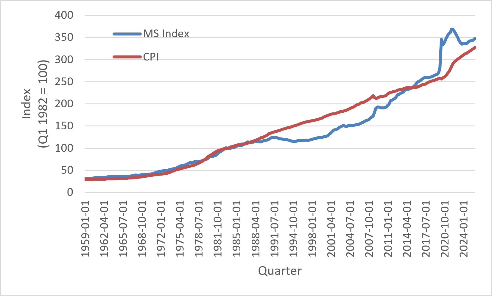

# Chapter 3: Inflation — A Rising Money Supply Lifts All Prices {#inflation-a-rising-money-supply-lifts-all-prices}

> Inflation is always and everywhere a monetary phenomenon.\
> — Milton Friedman

## 3.1 What Is Inflation? {#sec:what_is_inflation}

Imagine that you walk into your favorite coffee shop and discover that the price of a cup of coffee has increased from \$4 to \$5. Has inflation occurred?

Most people would answer "yes." After all, the price is higher than it was yesterday. Economists, however, would be more cautious. A higher price for one good does not necessarily mean the economy is experiencing inflation. To understand inflation, we must distinguish between a change in the price of a particular good and a change in the overall purchasing power of money.

Suppose that only the price of coffee rises because a poor harvest reduced the supply of coffee beans. Other prices in the economy remain unchanged. Consumers may choose to buy less coffee or switch to tea, but the purchasing power of money has changed very little. Now imagine a different situation in which the prices of coffee, gasoline, rent, groceries, clothing, restaurant meals, movie tickets, and thousands of other goods and services all rise over time. In this case, the purchasing power of money has declined. Each dollar now buys fewer goods and services than it did before. This is inflation.

::: definitionbox
**Definition**

**Inflation** is a sustained increase in the overall price level of goods and services in an economy over time.

Equivalently, inflation is a sustained decline in the purchasing power of money.
:::

Notice that this definition contains two important ideas. First, inflation refers to the *overall* price level rather than the price of a single good or service. Second, inflation is *sustained*. A one-time increase in prices is not the same thing as an ongoing inflationary process.

### 3.1.1 Inflation and Purchasing Power

The easiest way to understand inflation is to think about the purchasing power of money.

The purchasing power of money refers to the quantity of goods and services that a given amount of money can buy. When inflation occurs, each dollar buys fewer goods and services than it did previously. In other words, it is not that goods suddenly become more valuable—it is that money becomes less valuable relative to those goods.

Suppose you have a \$20 bill.

If lunch costs \$10, your \$20 buys two lunches.

If inflation causes the price of lunch to rise to \$20, your \$20 now buys only one lunch.

Nothing about the paper bill has changed. It is still the same \$20 bill. What has changed is its purchasing power.

Economists therefore often describe inflation as a decline in the value of money rather than simply an increase in prices. These are two ways of describing the same phenomenon.

::: examplebox
**Example**

Suppose a student receives a weekly allowance of \$50.

At the beginning of the year:

- A movie ticket costs \$10.

- The allowance buys five movie tickets.

One year later:

- A movie ticket costs \$12.50.

- The allowance buys only four movie tickets.

The student’s allowance has not changed, but its purchasing power has fallen. Inflation has reduced the amount of goods and services that the same amount of money can purchase.
:::

### 3.1.2 Inflation Is Not the Same as Higher Prices

One of the most common misconceptions about inflation is that any increase in prices is inflation. This is incorrect.

Prices change constantly in a market economy. Some prices rise while others fall. New technologies make some products cheaper. Weather events make some agricultural products more expensive. Consumer preferences shift, changing the prices of countless goods and services.

These changes are examples of changes in **relative prices**. Relative prices help allocate scarce resources by signaling changes in supply and demand. They are an essential part of a well-functioning market economy.

Inflation is different. Inflation occurs when the purchasing power of money declines so that prices across much of the economy rise together over time.

For example, suppose a drought reduces the supply of oranges. Orange prices rise, but the prices of most other goods remain unchanged. Consumers may purchase fewer oranges and substitute other fruits instead. This is a change in a relative price, not inflation.

Now suppose that, over several years, the prices of oranges, apples, gasoline, rent, medical care, college tuition, clothing, restaurant meals, and thousands of other goods all rise persistently. This broad increase in prices reflects inflation because the purchasing power of money has declined.

Understanding this distinction is one of the most important ideas in macroeconomics.

### 3.1.3 Inflation, Deflation, and Disinflation

Economists use several related terms to describe changes in the overall price level.

**Inflation** means the overall price level is increasing.

**Deflation** means the overall price level is decreasing. During deflation, the purchasing power of money increases because each dollar can buy more goods and services than before.

**Disinflation** means that inflation is slowing. Prices are still rising, but they are rising at a slower rate than before.

For example:

::: center
  Year      Inflation Rate
  -------- ----------------
  Year 1          8%
  Year 2          5%
  Year 3          3%
:::

Prices continue to rise each year, but the rate of increase is falling. This is disinflation, not deflation.

By contrast, if the inflation rate were (-2%), the economy would be experiencing deflation because the overall price level would be falling.

::: definitionbox
**Definition**

**Deflation** is a sustained decrease in the overall price level.

**Disinflation** is a reduction in the inflation rate. Prices continue to rise, but more slowly than before.
:::

### 3.1.4 Why Economists Care About Inflation

Inflation affects nearly every economic decision.

Workers negotiate wages partly because they expect prices to change over time. Businesses consider inflation when deciding how much to charge for their products. Lenders and borrowers must think about inflation when agreeing on interest rates. Governments monitor inflation when designing monetary and fiscal policies. Investors consider inflation when deciding where to save and invest their money.

If inflation is low and predictable, households and businesses can plan for the future with greater confidence. When inflation becomes high or unpredictable, planning becomes more difficult. Individuals may spend more time protecting themselves from rising prices instead of focusing on productive economic activity.

For these reasons, understanding inflation is one of the central goals of macroeconomics.

::: realworld
**Economics in the Real World**

Imagine receiving a \$1,000 birthday gift from your grandparents. You place the money in a drawer and forget about it for ten years.

Ten years later, the money is still there. You still have exactly \$1,000.

But can you buy the same amount of goods and services as you could ten years earlier?

Probably not. If prices have risen over those ten years, your \$1,000 has lost purchasing power. The number of dollars has not changed, but what those dollars can buy has declined. This illustrates why economists often say that inflation reduces the value of money.
:::

::: misconception
**Common Misconception**

A common misconception is that inflation simply means “prices are rising.”

Economists define inflation much more carefully. Inflation is a sustained increase in the *overall* price level caused by a decline in the purchasing power of money. A higher price for gasoline, eggs, or housing does not necessarily mean inflation has occurred. Individual prices change all the time because supply and demand change. Inflation refers to a broad, economy-wide increase in prices over time.
:::

::: thinkingeconomist
**Thinking Like an Economist**

Suppose gasoline prices increase by 25

- Has inflation necessarily occurred?

- What additional information would you need before concluding that the economy is experiencing inflation?

- Why is it important to distinguish between a change in one price and a change in the overall price level?

- How does thinking about the purchasing power of money help answer these questions?

Answer these questions before discussing them with classmates or using a generative AI tool.
:::

::: researchbox
**From the Research**

The central bank for the United States, the Federal Reserve, has a dual mandate to keep employment full and prices stable. The dual mandate is considered to mean keep inflation and unemployment low. The “Fed,” as the Federal Reserve is commonly referred to, has a target for inflation of 2%. Many students are surprised to learn that the Fed does not try for no inflation. However, a modest amount of inflation, such as 2% is okay with the Fed because inflation will “wash out” due to changes in spending patterns, increases in quality, and other factors explained in Section [3.2](#sec:measuring_inflation){reference-type="ref" reference="sec:measuring_inflation"}.
:::

::: keytakeaways
**Key Takeaways**

- Inflation is a sustained increase in the overall price level.

- Inflation is equivalent to a sustained decline in the purchasing power of money.

- A higher price for a single good or service is not necessarily inflation.

- Changes in individual prices are changes in relative prices and occur regularly in market economies.

- Deflation is a sustained decrease in the overall price level.

- Disinflation means that inflation continues but at a slower rate.

- Economists focus on the purchasing power of money because it provides a clearer understanding of what inflation really means.
:::

::: ailab
**AI Economics Lab**

Use a generative AI tool as your virtual teaching assistant to strengthen your understanding of inflation. Before asking the AI for assistance, answer each question independently.

1.  **Explore:** Ask the AI to generate five examples of price changes. For each example, decide whether it represents a change in a relative price or evidence of inflation. Explain your reasoning before asking the AI for feedback.

2.  **Reason:** Ask the AI to describe three situations in which the purchasing power of money changes. Explain whether each example represents inflation, deflation, or neither.

3.  **Evaluate:** Ask the AI to explain why economists say inflation is a decline in the purchasing power of money rather than simply “higher prices.” Critique the explanation. Did the AI clearly distinguish between changes in individual prices and changes in the overall price level?

4.  **Apply:** Ask the AI to create a scenario in which gasoline prices rise sharply but inflation remains low. Explain why the economy can experience one without necessarily experiencing the other.

5.  **Extend:** Ask the AI to describe how inflation affects households, businesses, lenders, borrowers, and governments. Identify one example for each group and explain how declining purchasing power influences economic decision-making.
:::

## 3.2 Measuring Inflation {#sec:measuring_inflation}

In the previous section, we learned that inflation is a sustained increase in the overall price level, or equivalently, a sustained decline in the purchasing power of money. This definition naturally raises an important question:

> *How do economists measure the overall price level?*

Answering this question is more difficult than it might first appear. Every day, millions of transactions take place involving thousands of different goods and services. The prices of gasoline, groceries, rent, clothing, restaurant meals, airline tickets, medical care, and college tuition are all changing, often at different rates. Some prices increase, some decrease, and others remain unchanged.

Suppose the price of gasoline rises by 15%, while the price of televisions falls by 10%. Has inflation occurred?

The answer is not obvious. Looking at the price of only one or two goods tells us very little about what is happening to the purchasing power of money. Instead, economists need a way to summarize price movements across the entire economy.

Imagine walking through a grocery store with a shopping cart. Your cart contains bread, milk, eggs, fruit, meat, cereal, and vegetables. If the price of one item increases, your total grocery bill may not change very much. But if the prices of nearly everything in the cart increase, your total bill will almost certainly be higher.

Economists apply the same idea to the economy as a whole. Rather than tracking the price of a single product, they follow the cost of purchasing a representative collection of goods and services that households typically buy. By observing how the total cost of that collection changes over time, economists can estimate changes in the overall price level.

This representative collection is called a **market basket**.

::: definitionbox
**Definition**

A **market basket** is a representative collection of goods and services purchased by a typical household.

Economists compare the cost of purchasing the same market basket over time to measure changes in the overall price level.
:::

Notice that the market basket does not include every good and service produced in the economy. Instead, it is designed to represent the spending patterns of the average household. If the cost of purchasing the same basket increases over time, this suggests that the purchasing power of money has fallen.

### 3.2.1 The Consumer Price Index

The most widely used measure of the overall price level is the **Consumer Price Index**, usually abbreviated as the **CPI**. The CPI is constructed by the Bureau of Labor Statistics (BLS), which regularly collects prices on tens of thousands of goods and services purchased by households throughout the United States.

The BLS begins by determining what a typical household buys. Through large national surveys, it estimates how households allocate their spending among categories such as food, housing, transportation, clothing, recreation, education, medical care, and many other goods and services. These spending patterns determine the composition of the market basket.

Each month, the BLS collects prices for the items in the basket from thousands of retail stores, service providers, landlords, hospitals, and other businesses across the country. It then compares the current cost of purchasing the basket with its cost during a selected base period.

If the basket costs more than it did previously, the CPI rises. If the basket costs less, the CPI falls. In this way, the CPI provides a summary measure of changes in consumer prices over time.

::: definitionbox
**Definition**

The **Consumer Price Index (CPI)** measures the weighted average price of a representative market basket of goods and services purchased by households relative to the price of the same basket during a base period.

Economists use changes in the CPI to measure inflation. The weights in the CPI are based on the proportion of a typical household budget spent on a particular item. Therefore, important items such as rent are weighted more heavily than belts.
:::

The CPI is reported as an *index*, not as a dollar amount. An index compares prices in one period with prices during a chosen base period. By convention, the base period is assigned a value of 100.

Suppose the cost of the market basket is exactly the same as it was during the base period. The CPI equals 100.

If the basket becomes 10% more expensive than it was in the base period, the CPI equals 110.

If the basket becomes 25% more expensive, the CPI equals 125.

Likewise, if the basket becomes 5% less expensive than during the base period, the CPI equals 95.

Because the CPI is an index rather than a dollar amount, economists can easily compare prices across different years without worrying about the actual cost of the basket.

Although the CPI is the most commonly reported measure of inflation, it is important to remember what it is measuring. The CPI does not measure the price of every good or service in the economy. Nor does it measure the cost of living for every individual household. Instead, it estimates how the prices paid by the *average* household change over time.

### 3.2.2 Comparing the CPI, GDP Deflator, and Producer Price Index

The Consumer Price Index is the most widely reported measure of inflation, but it is not the only price index economists use. Different price indexes are designed to answer different questions. Three of the most important are the **Consumer Price Index (CPI)**, the **GDP Deflator**, and the **Producer Price Index (PPI)**.

Although all three measure changes in prices, they differ in what prices they include, who purchases the goods and services, and how the market basket is constructed.

#### The Consumer Price Index (CPI) {#the-consumer-price-index-cpi .unnumbered}

As we have seen, the CPI measures the cost of purchasing a representative market basket of goods and services consumed by households. The basket is designed to reflect the spending patterns of a typical consumer and includes items such as food, housing, transportation, clothing, medical care, education, and recreation.

The CPI answers the following question:

> *How much has the cost of maintaining a typical household’s standard of living changed over time?*

Because the CPI focuses on household purchases, it is the measure most commonly used when discussing the cost of living, wage adjustments, Social Security payments, and inflation experienced by consumers.

#### The GDP Deflator {#the-gdp-deflator .unnumbered}

The **GDP Deflator** measures the prices of *all* final goods and services produced domestically. Unlike the CPI, which follows a fixed market basket purchased by consumers, the GDP Deflator automatically adjusts as production changes over time.

Recall from Chapter 4 that the GDP Deflator is calculated as

$$GDP\ Deflator =
\frac{Nominal\ GDP}{Real\ GDP}
\times 100.$$

Because it is based on GDP, the GDP Deflator includes goods and services purchased by households, businesses, governments, and foreign buyers, provided they are produced within the country.

It therefore answers a different question:

> *How have the prices of all domestically produced final goods and services changed over time?*

One important consequence is that imported goods affect the CPI but do not directly affect the GDP Deflator. For example, if the price of imported smartphones increases, consumers pay higher prices, so the CPI increases. However, because those smartphones were produced outside the country, they are not included in GDP and therefore do not directly affect the GDP Deflator.

Likewise, prices of domestically produced capital equipment purchased by businesses are included in the GDP Deflator but are not part of the CPI because households do not typically purchase industrial machinery.

#### The Producer Price Index (PPI) {#the-producer-price-index-ppi .unnumbered}

The **Producer Price Index (PPI)** measures changes in the prices received by producers for the goods and services they sell. Rather than focusing on consumers, the PPI looks at prices earlier in the production process.

For example, the PPI tracks prices received by:

- farmers selling wheat,

- steel producers selling steel,

- oil companies selling crude petroleum,

- manufacturers selling automobiles,

- wholesalers selling products to retailers.

The PPI answers the question:

> *How are prices changing for businesses producing goods and services?*

Because producers often experience cost increases before consumers do, economists sometimes view the PPI as an indicator of future inflationary pressures. For example, if steel producers begin charging significantly higher prices, automobile manufacturers may eventually face higher production costs. If those higher costs are passed on to consumers, automobile prices may later increase, contributing to higher CPI inflation.

However, this relationship is not automatic. Businesses do not always pass higher costs on to consumers. Competitive pressures, productivity improvements, or lower profit margins may absorb some or all of the increase.

#### Comparing the Three Price Indexes {#comparing-the-three-price-indexes .unnumbered}

Although the CPI, GDP Deflator, and PPI all measure price changes, each serves a different purpose.

  Price Index                  Measures                                                       Primary Purpose
  ---------------------------- -------------------------------------------------------------- ---------------------------------------------------------------------------------------------------------------------------
  Consumer Price Index (CPI)   Prices paid by households for a representative market basket   Measures changes in the cost of living for the typical consumer.
  GDP Deflator                 Prices of all final goods and services produced domestically   Measures changes in the overall price level for domestic production.
  Producer Price Index (PPI)   Prices received by producers                                   Measures price changes earlier in the production process and may provide information about future inflationary pressures.

  : **Table 3.1.** Comparing Major Price Indexes {#tab:price_indexes source-number="3.1"}

No single price index is “better” than the others. Instead, each provides different information.

The CPI is most useful when economists want to understand how inflation affects households.

The GDP Deflator is most useful when studying overall economic production because it covers everything included in GDP.

The PPI is useful for understanding cost pressures facing businesses and for analyzing price changes earlier in the production process.

By examining all three indexes together, economists gain a more complete picture of inflation throughout the economy.

::: examplebox
**Example**

Suppose the price of imported coffee rises sharply while the prices of most domestically produced goods remain unchanged.

The increase in imported coffee prices would likely raise the CPI because households purchase coffee.

The GDP Deflator, however, would be affected very little because imported coffee is not produced domestically and therefore is not included in GDP.

Now suppose instead that the price of domestically produced industrial machinery rises. That increase would affect the GDP Deflator because the machinery is part of domestic production, but it would have little effect on the CPI because households generally do not purchase industrial equipment.

This example illustrates why different price indexes can move differently even during the same period.
:::

### 3.2.3 Limitations of Price Indexes

Price indexes such as the Consumer Price Index (CPI), the GDP Deflator, and the Producer Price Index (PPI) are among the most important tools used by economists. They provide valuable information about changes in prices and allow economists to measure inflation over time. However, like all economic statistics, they are estimates rather than perfect measures of reality.

No single price index can capture the experiences of every household or business. People’s spending habits differ, new products are introduced, existing products improve in quality, and consumers adjust their purchases as relative prices change. These factors create several important limitations that economists must keep in mind when interpreting measures of inflation.

#### A Representative Household Is Not Every Household {#a-representative-household-is-not-every-household .unnumbered}

The Consumer Price Index is based on the spending patterns of a *typical* household. In reality, no household is truly typical.

A retired couple may spend a much larger share of its income on health care than a college student. A family with young children may spend heavily on childcare and education, while a single professional may spend much more on travel and entertainment.

Because households purchase different combinations of goods and services, they may experience different rates of inflation even when the national CPI reports a single inflation rate.

For example, suppose gasoline prices rise sharply while food and housing prices remain relatively stable. A family that commutes long distances every day may experience a much larger increase in its cost of living than a family that rarely drives.

The CPI therefore measures the inflation experienced by the average household—not by every household.

#### Substitution Bias {#substitution-bias .unnumbered}

One limitation of the CPI is known as **substitution bias**. The CPI measures the cost of purchasing a fixed market basket. In reality, however, consumers often change what they buy when relative prices change.

Suppose the price of beef rises substantially while the price of chicken remains unchanged. Many households may respond by purchasing more chicken and less beef. Their actual cost of maintaining a similar standard of living may therefore increase by less than the CPI suggests.

Because the CPI follows a predetermined basket, it does not immediately account for these substitutions. As a result, it may somewhat overstate increases in the cost of living.

#### New Goods {#new-goods .unnumbered}

Markets continually introduce new products. Smartphones, streaming services, electric vehicles, wearable technology, and countless other products did not exist—or were very different—a generation ago.

New goods often improve consumers’ well-being by providing more choices, better quality, or lower prices. However, a fixed market basket cannot immediately include products that did not previously exist.

As a result, the CPI may temporarily miss some of the benefits that consumers receive from innovation until the market basket is updated.

#### Quality Improvements {#quality-improvements .unnumbered}

Many products improve over time.

A laptop purchased today is much more powerful than one purchased ten years ago. Automobiles often become safer and more fuel efficient. Medical treatments become more effective. Household appliances consume less energy.

When the price of a product increases, part of that increase may simply reflect higher quality rather than inflation.

Suppose a smartphone costs \$1,000 today instead of \$800 five years ago. At first glance, the price appears to have increased by 25%. But today’s smartphone may include a faster processor, a better camera, more storage, longer battery life, and new software features.

Economists therefore face the difficult task of separating price increases caused by inflation from price increases caused by improvements in quality.

Government statistical agencies devote substantial effort to making these quality adjustments, but they are not always straightforward.

#### Changing Spending Patterns {#changing-spending-patterns .unnumbered}

Consumer preferences evolve over time.

Households today spend differently than households did twenty or thirty years ago. New technologies, changing lifestyles, demographic shifts, and economic conditions continually alter spending patterns.

For this reason, the Bureau of Labor Statistics periodically updates the CPI market basket to better reflect current consumer behavior. Without these updates, the CPI would become less representative of the average household.

Even with regular updates, however, no market basket can perfectly reflect the purchasing decisions of millions of different households.

### Interpreting Inflation Measures Carefully {#interpreting-inflation-measures-carefully .unnumbered}

These limitations do not mean that price indexes are unreliable. On the contrary, the CPI, GDP Deflator, and PPI are among the most carefully constructed economic statistics available.

Instead, these limitations remind us that inflation measures are estimates designed to summarize the behavior of a very large and diverse economy. Like averages discussed in Chapter 4, they provide valuable information but should not be interpreted too literally.

Economists therefore often examine multiple price indexes together and consider additional information before drawing conclusions about inflationary pressures in the economy.

::: realworld
**Economics in the Real World**

The U.S. Bureau of Labor Statistics (BLS) publishes the Consumer Price Index each month, and the announcement is closely watched by households, businesses, financial markets, and policymakers. If the CPI rises more rapidly than expected, workers may seek higher wages to maintain their purchasing power, businesses may reconsider future pricing decisions, investors may change their expectations about interest rates, and the Federal Reserve may respond by tightening monetary policy.

At the same time, economists rarely rely on the CPI alone. They also examine the GDP Deflator and the Producer Price Index (PPI). If producer prices begin rising rapidly while consumer prices remain relatively stable, economists may investigate whether higher production costs are likely to be passed on to consumers in the future. By studying several price indexes together, economists gain a more complete picture of inflation throughout the economy.
:::

::: misconception
**Common Misconception**

Several common misconceptions arise when interpreting price indexes.

- **Misconception 1: Inflation is measured by tracking the price of one important good.** Inflation measures changes in the overall price level, not changes in the price of gasoline, eggs, housing, or any other single product.

- **Misconception 2: The Consumer Price Index measures everyone’s inflation rate.** The CPI measures changes in the cost of purchasing a representative market basket for the average household. Individual households may experience different rates of inflation because they purchase different combinations of goods and services.

- **Misconception 3: The CPI, GDP Deflator, and PPI measure the same thing.** Each price index answers a different question. The CPI focuses on consumer purchases, the GDP Deflator measures prices of all domestically produced final goods and services, and the PPI measures prices received by producers.

- **Misconception 4: Price indexes are perfect measures of inflation.** Every price index has limitations. Consumer substitution, new products, quality improvements, and changing spending patterns all make inflation difficult to measure precisely.
:::

::: thinkingeconomist
**Thinking Like an Economist**

Suppose the following events occur during the same year:

- The price of imported smartphones increases by 20

- The price of domestically produced industrial machinery increases by 15

- The price of gasoline remains unchanged.

- Many consumers begin purchasing more streaming services and fewer DVDs.

Consider the following questions:

1.  Which of these changes would most directly affect the Consumer Price Index? Explain why.

2.  Which would most directly affect the GDP Deflator? Why?

3.  Which price changes might first appear in the Producer Price Index?

4.  How might substitution by consumers make the measured increase in the CPI different from the actual change in some households’ cost of living?

5.  Why is it useful for economists to examine several price indexes instead of relying on only one?

Answer these questions before discussing them with classmates or using a generative AI tool.
:::

::: researchbox
**From the Research**

There are numerous ways to measure inflation and they do not perfectly mirror each other. If someone adjusts wages for inflation using the CPI, the GDP Deflator, or the PPI, the results may be significantly different. When examining claims about prices after inflation, called real prices, it is important to understand which measure of inflation was used. You should also be aware that even using the most appropriate measure of inflation may still provide incorrect results.
:::

::: keytakeaways
**Key Takeaways**

- Economists measure inflation using price indexes because tracking individual prices does not reveal changes in the overall price level.

- The Consumer Price Index (CPI) measures the cost of purchasing a representative market basket of goods and services consumed by households.

- The CPI is the most commonly reported measure of consumer inflation in the United States.

- The GDP Deflator measures prices for all final goods and services produced domestically and therefore differs from the CPI.

- The Producer Price Index (PPI) measures prices received by producers and can provide information about inflationary pressures earlier in the production process.

- Different price indexes answer different economic questions, so economists often examine all three together.

- Price indexes are estimates rather than perfect measures because consumers substitute among goods, new products are introduced, product quality changes over time, and household spending patterns differ.

- Individual households may experience inflation rates that differ from the national CPI because they purchase different combinations of goods and services.
:::

::: ailab
**AI Economics Lab**

Use a generative AI tool as your virtual teaching assistant to deepen your understanding of how economists measure inflation. Before asking the AI for assistance, answer each question independently.

1.  **Explore:** Ask the AI to construct a simple market basket containing five consumer goods. Assign reasonable prices in two different years and calculate the Consumer Price Index for each year. Then calculate the inflation rate and compare your work with the AI’s solution.

2.  **Reason:** Ask the AI to describe three different price changes—one that would primarily affect the CPI, one that would primarily affect the GDP Deflator, and one that would primarily affect the Producer Price Index. Explain why each index responds differently.

3.  **Evaluate:** Ask the AI to explain the difference between the CPI, GDP Deflator, and PPI to a student taking macroeconomics for the first time. Critique its explanation. Did it clearly identify what each index measures, who the prices apply to, and why economists use multiple price indexes?

4.  **Apply:** Ask the AI to create an example showing substitution bias. Explain why consumers change their purchasing decisions when relative prices change and how this affects measured inflation.

5.  **Extend:** Ask the AI to compare how inflation might differ for a college student, a retired couple, and a family with young children. Explain why the CPI may not perfectly measure the inflation experienced by each household.

6.  **Reflect:** Write a short paragraph explaining why economists use several different price indexes rather than relying on a single measure of inflation. In your answer, discuss the strengths and limitations of the CPI, GDP Deflator, and PPI.
:::

## 3.3 The Quantity Theory of Money {#sec:quantity_theory_money}

One of the most important relationships in macroeconomics is the **Equation of Exchange**. This equation summarizes the relationship between the money supply, spending in the economy, the overall price level, and real economic output.

The Equation of Exchange is written as

$$MV = PY$$

This equation is the foundation of the Quantity Theory of Money, which we will develop more fully in the next section. For now, our goal is simply to understand what each variable represents and how to use the equation.

::: definitionbox
**Definition**

The **Equation of Exchange** is

$$MV = PY$$

where

- M = Money supply

- V = Velocity of money

- P = Price level

- Y = Real output (real GDP)
:::

Notice that the left-hand side of the equation and the right-hand side measure the same thing from different perspectives.

The left-hand side, (MV), measures the total amount of spending in the economy.

The right-hand side, (PY), measures the dollar value of all final goods and services produced. Since (P) is the average price level and (Y) is real output, their product is **nominal GDP**.

Therefore,

$$MV = Nominal\ GDP$$

The Equation of Exchange tells us that total spending in the economy equals the total value of production.

### 3.3.1 Understanding the Variables

Each variable in the equation has a specific meaning.

#### Money Supply (M) {#money-supply-m .unnumbered}

The variable M represents the quantity of money available in the economy. Depending on the context, economists may measure the money supply using different definitions such as M1 or M2, we will address the definitions of the money supply formally in Chapter 10. Throughout this chapter, we simply think of M as the total amount of money available for spending.

#### Velocity of Money (V) {#velocity-of-money-v .unnumbered}

The variable V represents the **velocity of money**. Velocity measures the average number of times each dollar is used to purchase final goods and services during a given period.

For example, if the average dollar is spent five times during a year, then

$$V = 5.$$

A higher velocity means that money circulates through the economy more rapidly.

::: definitionbox
**Definition**

**Velocity of money** is the average number of times each dollar is used to purchase final goods and services during a given period.
:::

#### Price Level (P) {#price-level-p .unnumbered}

The variable P represents the overall price level in the economy. Rather than measuring the price of a single good, P summarizes prices across many goods and services using measures such as the Consumer Price Index or the GDP Deflator.

#### Real Output (Y) {#real-output-y .unnumbered}

The variable Y represents real output, or real GDP. It measures the quantity of final goods and services produced after removing the effects of inflation.

Unlike PY, which measures production in current dollars, Y measures real production.

### 3.3.2 The Equation of Exchange in Growth Rates

Although the Equation of Exchange is written as

$$MV = PY,$$

macroeconomists often use a slightly different version that focuses on the percentage change of each variable over time. Expressing the equation in growth rates makes it much easier to analyze inflation and economic growth.

The growth-rate form of the Equation of Exchange is

$$\%\Delta M + \%\Delta V \ = \  \%\Delta P + \%\Delta Y.$$

This equation says that the growth rate of the money supply plus the growth rate of velocity equals the inflation rate plus the growth rate of real output.

::: definitionbox
**Definition**

The growth-rate form of the Equation of Exchange is $$\%\Delta M + \%\Delta V \ = \  \%\Delta P + \%\Delta Y.$$ where

- $\%\Delta M$ = growth rate of the money supply

- $\%\Delta V$ = growth rate of the velocity of money

- $\%\Delta P$ = inflation rate

- $\%\Delta Y$ = growth rate of real GDP
:::

Notice that each variable is now measured as a percentage change rather than as a level. This allows economists to study how changes in money, velocity, prices, and production are related over time.

Throughout the remainder of this chapter, we will primarily use this growth-rate version because it makes the relationship between money growth and inflation much easier to understand.

### 3.3.3 Examples

Suppose an economy experiences the following changes during one year:

- Money supply grows by 6%.

- Velocity of money does not change.

- Real GDP grows by 2%.

Using the growth-rate form of the Equation of Exchange, $$\%\Delta M + \%\Delta V \ = \  \%\Delta P + \%\Delta Y.$$ substitute the known values:

$$6\% + 0\% \ = \ \%\Delta P + 2\%$$

Now solve for the inflation rate:

$$\%\Delta P \ = 6\% - 2\% = 4\%.$$

The economy therefore experiences an inflation rate of 4%.

Suppose the inflation rate is 5%, real GDP grows by 3%, and the velocity of money decreases by 1%.

What must have been the growth rate of the money supply?

Using $$\%\Delta M + \%\Delta V \ = \  \%\Delta P + \%\Delta Y.$$ substitute the known values: $$\%\Delta M+(-1\%) \ = \ 5\%+3\%.$$

Simplifying,

$$\%\Delta M-1\%=8\%.$$

Therefore, $$\%\Delta M=9\%.$$

The money supply must have increased by 9%.

In the next section, we will use this simple relationship to explain one of the most important ideas in macroeconomics: why Milton Friedman argued that inflation is “always and everywhere a monetary phenomenon.” Rather than simply memorizing that statement, you will use the Equation of Exchange to understand the economic logic behind it.

::: realworld
**Economics in the Real World**

Economists, central banks, and financial analysts regularly examine the growth rates of the money supply, real GDP, and inflation. While they may disagree about the short-run effects of monetary policy, they often begin with the same accounting relationship:

$$\%\Delta M + \%\Delta V \ = \  \%\Delta P + \%\Delta Y.$$

This equation provides a useful framework for organizing information about the economy. For example, if economists observe rapid money growth and stable real GDP growth, they naturally ask whether inflation is likely to increase. Likewise, if inflation falls unexpectedly, they may investigate whether money growth, velocity, or real output changed. Although the Equation of Exchange does not by itself explain why these variables change, it provides a consistent way to think about their relationship.
:::

::: misconception
**Common Misconception**

Several common misconceptions arise when students first encounter the Equation of Exchange.

- **Misconception 1: The Equation of Exchange is itself a theory of inflation.** The equation is an accounting identity. By itself, it does not explain why inflation occurs. The economic interpretation comes from the Quantity Theory of Money, which we develop in the next section.

- **Misconception 2: The variable $P$ represents the price of a single good.** The variable $P$ represents the overall price level in the economy, not the price of gasoline, pizza, or any other individual product.

- **Misconception 3: The variable $Y$ is nominal GDP.** The variable $Y$ represents *real* GDP. Nominal GDP is equal to $PY$.

- **Misconception 4: The growth-rate version is a different equation.** It is simply another way of expressing the same relationship. The growth-rate form is especially useful because it directly connects money growth, inflation, and real GDP growth.
:::

::: thinkingeconomist
**Thinking Like an Economist**

Suppose an economy experiences the following changes over one year:

- Money supply increases by 8

- Velocity of money decreases by 2

- Real GDP increases by 3

Using the growth-rate form of the Equation of Exchange,

$$\%\Delta M + \%\Delta V \ = \  \%\Delta P + \%\Delta Y.$$

answer the following questions.

1.  What is the inflation rate?

2.  Which variable had the largest positive contribution to nominal spending?

3.  How did the decline in velocity affect inflation?

4.  If velocity had remained constant instead, how would your answer change?

Solve the problem yourself before discussing it with classmates or using a generative AI tool.
:::

::: keytakeaways
**Key Takeaways**

- The Equation of Exchange is MV = PY.

- M is the money supply, V is the velocity of money, P is the overall price level, and Y is real GDP.

- The product PY is nominal GDP.

- Economists often use the growth-rate form of the Equation of Exchange: $$\%\Delta M + \%\Delta V \ = \  \%\Delta P + \%\Delta Y.$$

- The growth-rate form relates money growth, changes in velocity, inflation, and real GDP growth.

- The Equation of Exchange is an accounting identity. The economic interpretation of the equation is provided by the Quantity Theory of Money, which is developed in the next section.
:::

::: ailab
**AI Economics Lab**

Use a generative AI tool as your virtual teaching assistant to practice using the Equation of Exchange. Before asking the AI for assistance, solve each problem yourself.

1.  **Explore:** Ask the AI to generate five practice problems using the growth-rate form of the Equation of Exchange. Each problem should have one missing variable. Solve the problems before asking the AI to check your answers.

2.  **Reason:** Ask the AI to explain the economic meaning of each variable M, V, Y, and P in one sentence. Compare its explanations with the definitions in this section and identify any inaccuracies or missing details.

3.  **Evaluate:** Ask the AI to explain why PY represents nominal GDP rather than real GDP. Critique the explanation. Did the AI clearly distinguish between the price level, real output, and nominal output?

4.  **Apply:** Ask the AI to generate a table containing money growth, velocity growth, and real GDP growth for six hypothetical economies. Calculate the inflation rate for each economy before checking the AI’s answers.

5.  **Extend:** Ask the AI to create a scenario in which two economies have the same money supply growth but different inflation rates. Explain how differences in velocity growth or real GDP growth could account for the different outcomes.

6.  **Reflect:** Write a short paragraph explaining why economists often prefer the growth-rate form of the Equation of Exchange when discussing inflation rather than the level form MV = PY.
:::

## 3.4 Inflation Is Always and Everywhere a Monetary Phenomenon {#sec:monetary_phenomenon}

In the previous section, we introduced the Equation of Exchange and showed that it can be written in terms of growth rates as $$\%\Delta M + \%\Delta V \ = \  \%\Delta P + \%\Delta Y.$$ This equation relates four important macroeconomic variables:

- the growth rate of the money supply,

- the growth rate of the velocity of money,

- the inflation rate, and

- the growth rate of real GDP.

By itself, this equation is simply an accounting identity. It tells us that total spending in the economy must equal the value of total production, but it does not explain why inflation occurs.

To understand inflation, economists must make one additional observation about how these variables behave over time.

One of the most influential economists of the twentieth century, **Milton Friedman**, argued that over long periods of time, inflation is primarily determined by the growth of the money supply. He summarized this idea with one of the most famous statements in economics:

> *“Inflation is always and everywhere a monetary phenomenon.”*

At first glance, this statement may seem surprising. Prices change for many reasons. Weather affects food prices. Wars disrupt energy markets. New technologies lower the prices of some products while increasing demand for others. How, then, could Friedman argue that inflation is fundamentally monetary?

The answer begins by examining the role of the velocity of money.

### 3.4.1 Assuming Velocity Is Relatively Stable

Recall that the variable V represents the **velocity of money**—the average number of times each dollar is used to purchase final goods and services during a given period.

In reality, velocity does change from year to year. Changes in payment technologies, interest rates, financial innovation, consumer confidence, and banking behavior can all influence how rapidly money circulates through the economy.

However, economists have found that over long periods of time, changes in velocity are generally much smaller than changes in the money supply or the price level. While velocity may fluctuate in the short run, it tends to be relatively stable over longer horizons.

For this reason, economists often make a simplifying assumption:

$$\%\Delta V \approx 0.$$

This assumption does *not* mean that velocity never changes. Instead, it means that changes in velocity are small enough that they are unlikely to be the primary source of sustained inflation over many years.

Making this assumption greatly simplifies the Equation of Exchange and allows us to focus on the relationship between money growth, real economic growth, and inflation.

::: definitionbox
**Definition**

A common simplifying assumption in the Quantity Theory of Money is that the growth rate of the velocity of money is approximately zero over long periods:

$$\%\Delta V \approx 0.$$

This assumption allows economists to focus on how changes in the money supply affect inflation and real economic activity.
:::

### 3.4.2 Deriving the Quantity Theory of Money

Begin with the growth-rate form of the Equation of Exchange:

$$\%\Delta M + \%\Delta V \ = \  \%\Delta P + \%\Delta Y.$$

If velocity is approximately constant, then

$$\%\Delta V \approx 0.$$

Substituting this assumption into the Equation of Exchange gives

$$\%\Delta M \ = \ \%\Delta P + \%\Delta Y.$$

Since the growth rate of the price level is simply the inflation rate, we can rewrite the equation as

$$\%\Delta M \ = \ Inflation + Real\ GDP\ Growth.$$

This relationship is the heart of the Quantity Theory of Money.

It tells us that the growth rate of the money supply must ultimately be reflected in one of two places:

1.  higher real production, or

2.  higher prices.

If the economy is capable of producing more goods and services, some of the increase in the money supply can support greater real output. But if the money supply grows faster than the economy’s ability to produce goods and services, the remaining increase must appear as inflation. Further, it is often said that “inflation is caused by too many dollars chasing too few goods.” The relationship between $\%\Delta M$ and $\%\Delta P + \%\Delta Y$ when $\%\Delta M$ increases faster than $\%\Delta Y$ perfectly follows this statement as well.

This insight provides the foundation for understanding why economists often describe persistent inflation as a monetary phenomenon.

::: {#fig:QTMUSA .source-figure source-number="3.1"}

**Figure 3.1.** **The Quantity Theory of Money in the United States (Q1 1959 — Q1 2026)**\
Source: *Federal Reserve Economic Data.* The time series plot shown above display the relationship between an indexed value of the money supply, calculated as $\frac{Money}{Real Output}$ and the CPI. Both values are equal to 100 in the first quarter of 1980. The graphs are strikingly similar and have an observed correlation of over 95%. The graph shows strong evidence for the argument of Milton Friedman: “inflation is always and everywhere a monetary phenomenon.”
:::

::: {.aifiguredescription figure-id="fig:QTMUSA"}
**Figure description: `fig:QTMUSA`**

This two-line time-series chart has horizontal axis **Quarter**, with dates starting at 1959-01-01 and printed ticks through 2024-01-01; the caption gives Q1 1959–Q1 2026. The vertical axis is **Index (Q1 1982 = 100)**, with ticks from 0 to 400. The legend identifies the blue line as **MS Index** and the red line as **CPI**. The caption defines the indexed money measure as money divided by real output.

Both lines increase substantially over the displayed decades. They are close together near index 100 around the early 1980s. The blue series remains below the red series for much of the 1990s and 2000s, catches up later, then rises sharply around 2020, peaks above 350, falls toward the low 330s, and turns upward again. The red series rises more steadily and ends above 300. These are descriptions and approximate readings of the image, not a reconstructed dataset.

The author uses the co-movement in discussing the quantity theory of money and claims a correlation above 95% in the caption. The numerical correlation has not been independently recalculated. The image alone does not establish causation, identify money-supply shocks, or show that velocity is constant; a common upward trend also matters when interpreting a levels correlation.

**Source discrepancy retained:** the plotted vertical-axis label says **Q1 1982 = 100**, whereas the caption says both indexes equal 100 in **Q1 1980**. The figure and caption are preserved without choosing or silently correcting the base date. A tutor should recognize the inconsistency and avoid constructing a question that assumes one date is settled. The original caption credits Federal Reserve Economic Data.
:::

::: definitionbox
**Definition**

Under the assumption that the velocity of money is approximately constant,

$$\%\Delta M \ = \ Inflation + Real\ GDP\ Growth.$$

This equation states that money supply growth is ultimately reflected in some combination of higher real output and higher inflation.
:::

Notice that this equation does not yet tell us how much of money growth becomes inflation or how much becomes real economic growth. That depends on how rapidly the economy is able to expand its production of goods and services.

In the remainder of this section, we will use this simple relationship to examine several economies with different rates of money growth and real GDP growth. By working through these examples, you will see why Friedman concluded that persistent inflation occurs whenever the money supply grows faster than the economy’s productive capacity.

### 3.4.3 Historical Evidence: Hyperinflation and the Money Supply

Economic theories are valuable only if they help explain what we observe in the real world. One of the strongest pieces of evidence supporting the Quantity Theory of Money comes from episodes of **hyperinflation**. Hyperinflation refers to an extremely rapid increase in the overall price level, often exceeding 50% per month. During these episodes, money loses its purchasing power so quickly that people rush to spend it almost immediately after receiving it.

Although every historical episode has its own political and economic circumstances, hyperinflations share one striking characteristic: governments financed large and persistent budget deficits by creating enormous quantities of new money. As the money supply expanded far more rapidly than the production of goods and services, prices rose dramatically.

#### Germany: The Weimar Hyperinflation {#germany-the-weimar-hyperinflation .unnumbered}

One of the best-known examples occurred in Germany following the First World War. The German government faced enormous financial obligations, including war debts and reparations imposed by the Treaty of Versailles. Rather than raising enough taxes or borrowing sufficient funds, the government increasingly financed its spending by printing money.

As the quantity of money expanded, prices began rising rapidly. By 1923, inflation had become hyperinflation. Prices sometimes doubled within a matter of days. Workers were often paid several times each day so they could spend their wages before prices increased again. Savings accumulated over a lifetime became nearly worthless, and many ordinary transactions became extremely difficult because money was losing value so quickly.

Although the immediate causes of Germany’s fiscal problems were unique to the postwar period, the mechanism behind the hyperinflation was straightforward. The supply of money grew far more rapidly than the economy’s ability to produce goods and services, causing the purchasing power of money to collapse.

#### Zimbabwe {#zimbabwe .unnumbered}

Zimbabwe experienced another dramatic hyperinflation during the 2000s. Political instability, declining agricultural production, and falling economic output placed severe pressure on government finances. Rather than reducing spending or raising sufficient tax revenue, the government increasingly relied on its central bank to finance expenditures by creating new money.

As confidence in the currency deteriorated, the government responded by printing even more money. This only accelerated inflation. Prices began rising at astonishing rates, eventually reaching billions of percent per year according to many estimates. Currency notes with denominations of millions, billions, and even trillions of Zimbabwean dollars were issued, yet they often purchased only a few everyday items.

Eventually, the Zimbabwean dollar became essentially unusable, and the country abandoned its currency in favor of foreign currencies for many transactions.

#### Venezuela {#venezuela .unnumbered}

More recently, Venezuela experienced a prolonged period of extremely high inflation beginning in the middle of the 2010s. The country faced declining oil revenues, falling economic production, and large government budget deficits. Rather than financing these deficits through taxation or sustainable borrowing, the government increasingly relied on monetary expansion.

As the money supply grew rapidly while real output declined, prices accelerated dramatically. The purchasing power of the Venezuelan bolívar fell sharply, making it increasingly difficult for households to purchase basic necessities. Many people sought to hold foreign currencies or other assets instead of domestic money because they expected the bolívar to continue losing value.

Unlike Germany and Zimbabwe, Venezuela’s inflation developed over several years rather than exploding almost overnight. Nevertheless, the underlying pattern was similar: persistent growth in the money supply greatly exceeded growth in real output.

### What These Episodes Have in Common {#what-these-episodes-have-in-common .unnumbered}

Germany, Zimbabwe, and Venezuela differed in many important respects. They occurred in different centuries, on different continents, under different political systems, and in response to different economic crises.

Yet all three episodes shared a common pattern.

1.  Governments experienced severe fiscal problems.

2.  Governments financed spending by creating large amounts of new money.

3.  The money supply grew much faster than real economic output.

4.  The purchasing power of money declined dramatically.

5.  Prices rose rapidly throughout the economy.

These episodes do not suggest that every increase in the money supply immediately produces hyperinflation. Modern central banks routinely increase the money supply to accommodate normal economic growth and changes in the demand for money.

The important lesson is different. When the money supply persistently grows much faster than an economy’s ability to produce goods and services, the historical record shows that sustained inflation—and in extreme cases, hyperinflation—has almost always followed.

For Milton Friedman, these historical experiences provided compelling evidence for his famous conclusion that inflation is fundamentally a monetary phenomenon. While wars, natural disasters, supply disruptions, and political instability can all affect individual prices or temporarily influence inflation, none of these factors alone can explain the sustained, economy-wide increases in prices observed during episodes of hyperinflation. In each case, rapid monetary expansion was the common element.

::: definitionbox
**Definition**

**Gresham’s Law** states that *‘bad money drives out good money.’’* When two forms of money are accepted at the same face value but one is perceived to have greater intrinsic or future value, people tend to spend the ‘bad’’ money and hoard the “good” money. During periods of high inflation or currency instability, individuals often stop using the rapidly depreciating currency as a store of value and instead save or transact using more stable forms of money, such as foreign currencies, gold, or other assets.
:::

::: realworld
**Economics in the Real World**

The historical experiences of Germany in the 1920s, Zimbabwe in the 2000s, and Venezuela in the 2010s illustrate an important lesson in macroeconomics. Although each country faced different political, social, and economic challenges, all three experienced one common pattern: the money supply grew dramatically faster than the production of goods and services.

Economists continue to debate many aspects of monetary policy, including how rapidly the money supply should grow and how central banks should respond to recessions. However, there is broad agreement that the extreme inflation experienced during episodes of hyperinflation cannot be understood without examining rapid and persistent monetary expansion.

For this reason, central banks throughout the world devote considerable attention to maintaining price stability. While moderate inflation may occur for many reasons over short periods, history demonstrates that prolonged, high inflation has consistently been associated with excessive growth in the money supply.
:::

::: misconception
**Common Misconception**

Several common misconceptions arise when students first learn the Quantity Theory of Money.

- **Misconception 1: Every increase in the money supply immediately causes inflation.** If real GDP also increases, some of the additional money can support greater production rather than higher prices. The Quantity Theory explains long-run relationships, not necessarily short-run fluctuations.

- **Misconception 2: Velocity must always be exactly constant.** Velocity changes over time. The Quantity Theory assumes that changes in velocity are relatively small over long periods, making money growth the dominant determinant of sustained inflation.

- **Misconception 3: Inflation and money growth are unrelated because many other events affect prices.** Wars, droughts, supply disruptions, and technological change all influence individual prices. However, sustained increases in the overall price level require persistent growth in the money supply relative to real output.

- **Misconception 4: Hyperinflation occurs simply because governments print large amounts of money.** Printing money is the mechanism, but governments typically resort to monetary expansion because they face severe fiscal problems and cannot finance spending through taxation or borrowing alone.
:::

::: thinkingeconomist
**Thinking Like an Economist**

Suppose an economy experiences the following changes for several consecutive years:

- Money supply grows by 10% each year.

- Velocity of money remains approximately constant.

- Real GDP grows by 2% each year.

Using the Quantity Theory of Money, answer the following questions.

1.  Approximately what inflation rate would you expect each year?

2.  Why doesn’t all of the money supply growth become inflation?

3.  Suppose real GDP growth unexpectedly increases to 5%. What happens to the inflation rate if money growth remains unchanged?

4.  If the central bank wishes to reduce inflation to 2% while real GDP continues growing at 2%, approximately how rapidly should the money supply grow?

Answer these questions before discussing them with classmates or using a generative AI tool.
:::

::: researchbox
**From the Research**

Milton Friedman argues very persuasively that “inflation is always and everywhere a monetary phenomenon” in this video: <https://www.youtube.com/watch?v=NgSqZKx0mNI&t=292s>. Skip forward to 4:45 for the beginning of the discussion. The relevant scene ends at 10:32.
:::

::: keytakeaways
**Key Takeaways**

- Milton Friedman argued that “inflation is always and everywhere a monetary phenomenon.”

- Assuming the velocity of money is approximately constant, the Quantity Theory of Money implies: $$\%\Delta M \ = \ \%\Delta P + \%\Delta Y.$$

- If the money supply grows faster than real GDP over a sustained period, the difference appears primarily as inflation.

- Growth in real output allows some money growth to occur without generating inflation.

- Historical episodes of hyperinflation in Germany, Zimbabwe, and Venezuela all involved rapid monetary expansion that greatly exceeded growth in real output.

- The Quantity Theory explains persistent, economy-wide inflation rather than temporary changes in individual prices.
:::

::: ailab
**AI Economics Lab**

Use a generative AI tool as your virtual teaching assistant to deepen your understanding of the Quantity Theory of Money. Before asking the AI for assistance, solve each problem yourself.

1.  **Explore:** Ask the AI to generate five practice problems using the Quantity Theory relationship $$\%\Delta M \ = \ \%\Delta P + \%\Delta Y.$$ Solve each problem before asking the AI to check your work.

2.  **Reason:** Ask the AI to explain why economists often assume that the velocity of money is approximately constant over long periods. Compare its explanation with the discussion in this section. Did the AI clearly distinguish between short-run fluctuations and long-run trends?

3.  **Evaluate:** Ask the AI to explain Milton Friedman’s statement that “inflation is always and everywhere a monetary phenomenon.” Critique the explanation. Did the AI distinguish between temporary changes in relative prices and persistent increases in the overall price level?

4.  **Apply:** Ask the AI to create a hypothetical economy experiencing rapid money growth. Use the Quantity Theory to estimate the inflation rate under different assumptions about real GDP growth. Explain how changes in production affect inflation.

5.  **Historical Analysis:** Ask the AI to summarize one historical episode of hyperinflation, such as Germany, Zimbabwe, or Venezuela. Compare its explanation with the discussion in this chapter. Did the AI correctly identify excessive monetary expansion as the common element?

6.  **Reflect:** Write a short paragraph explaining why the Quantity Theory of Money is considered a long-run theory of inflation rather than a complete explanation of every short-run movement in prices.
:::

## 3.5 Common Misconceptions About Inflation {#sec:inflation_misconceptions}

By now, we have developed a simple but powerful explanation of inflation. The Quantity Theory of Money shows that when the money supply grows persistently faster than an economy’s ability to produce goods and services, the purchasing power of money declines and the overall price level rises.

Despite this straightforward relationship, inflation is one of the most misunderstood topics in economics. News reports, political debates, and everyday conversations often attribute inflation to many different causes. Some of these explanations contain an element of truth, while others confuse changes in individual prices with sustained inflation.

The purpose of this section is to examine several common misconceptions and evaluate them using the economic principles developed in this chapter.

### 3.5.1 Misconception 1: Inflation Is Caused by Greedy Businesses

A common claim is that inflation occurs because businesses become greedier and decide to charge higher prices.

At first glance, this explanation may seem reasonable. If firms raise prices, consumers must pay more, so prices increase.

The problem with this explanation is that it does not answer a fundamental question:

> *Why didn’t businesses raise all of their prices last year? Or five years ago?*

Businesses have always preferred higher profits. The desire to earn profits is not new, nor does it suddenly appear during periods of inflation.

In competitive markets, firms cannot simply charge any price they wish. Consumers must have enough purchasing power to pay those higher prices. If one restaurant suddenly doubles its prices while competitors do not, many customers will simply eat somewhere else.

For prices throughout the economy to continue rising year after year, consumers must have sufficient money to purchase goods and services at those higher prices. This is why economists distinguish between a firm’s desire to raise prices and the economy’s ability to sustain higher overall prices.

Greed may influence the pricing decisions of individual firms, but it does not explain why the overall purchasing power of money declines across an entire economy.

Moreover, if firms decided to be altruistic and decline to raise prices when there is more money in the economy, the inflation rate would *still increase* because entrepreneurial individuals would use their larger supply of dollar bills to buy large stocks of goods to resell at higher prices. This is possible because many other individuals will now have more dollar bills in their pockets as a result of the increase in the money supply. This is a simple application of the fact that consumers drive higher prices, not businesses.

### 3.5.2 Misconception 2: Inflation Is Caused by Rising Oil Prices

Oil prices affect many industries because petroleum is used to produce gasoline, diesel fuel, plastics, fertilizers, and countless other products.

When oil prices rise sharply, transportation becomes more expensive, shipping costs increase, and some goods become more costly to produce.

These effects are real.

However, higher oil prices alone cannot explain persistent inflation.

Suppose oil prices double while the money supply remains unchanged. Consumers now spend more of their income on gasoline and energy, leaving less income available to purchase other goods and services. Some prices may rise, while others may fall as consumer spending shifts.

The result is primarily a change in *relative prices*, not necessarily a sustained increase in the overall price level.

Oil shocks can temporarily increase measured inflation, but they do not explain why prices continue rising year after year.

### 3.5.3 Misconception 3: Supply Shortages Cause Inflation

Supply disruptions became a common topic during the COVID-19 pandemic. Shortages of computer chips, automobiles, building materials, and shipping capacity contributed to higher prices for many products.

These shortages certainly affected individual markets.

But shortages alone do not create persistent inflation.

If the supply of automobiles falls, automobile prices rise. Consumers may postpone purchases or spend less on other goods. Resources are reallocated throughout the economy as relative prices change.

Without sustained monetary expansion, supply shortages redistribute spending rather than continually increasing the overall price level.

This distinction is one of the most important lessons in macroeconomics:

> Supply shocks change relative prices.
>
> Persistent inflation changes the purchasing power of money.

### 3.5.4 Misconception 4: Printing Money Makes Society Richer

Suppose the government printed enough money to give every household an additional \$100,000.

Would society become richer?

The answer is no.

Printing additional money creates more dollars, but it does not create more houses, automobiles, computers, food, factories, machinery, or workers.

Real wealth comes from producing goods and services.

Money is simply the medium used to exchange them.

If the quantity of money increases while the quantity of goods and services remains unchanged, households have more dollars chasing the same amount of production. As we have seen through the Quantity Theory of Money, the likely result is a higher price level rather than greater real wealth.

This misconception is particularly pernicious, as evidenced by the fact New York State sent “inflation relief checks” for \$300 to taxpayers in 2025. (INCLUDE PHOTO OF THE CHECK HERE)

### 3.5.5 Misconception 5: Inflation Is Good Because Prices Are Higher

Some people assume that rising prices automatically make society wealthier because businesses receive more revenue.

This reasoning confuses nominal values with real values.

Suppose every price and every wage doubled overnight.

Would society have twice as many houses?

Twice as much food?

Twice as many doctors?

Twice as many automobiles?

Of course not.

Everyone would receive more dollars, but each dollar would purchase less.

Real production—and therefore real wealth—would be unchanged.

Economists therefore distinguish carefully between nominal increases in prices and real increases in production. Inflation changes the value of money, not the economy’s productive capacity.

::: realworld
**Economics in the Real World**

Look at the graph in Figure [3.1](#fig:QTMUSA){reference-type="ref" reference="fig:QTMUSA"}, which displays the relationship between the price level (CPI) and the amount of money in the economy per dollar of real output (MS Index). Look at the relationship between the explosion of the money supply and the subsequent increase in the price level as a result of policies implemented to try to combat COVID-19. The Federal Reserve argued during the beginning of the inflationary period that supply disruptions were simply causing transitory inflation. Why does this graph refute that argument?
:::

::: misconception
**Common Misconception**

Perhaps the most important misconception about inflation is believing that any event that raises some prices must also cause inflation.

Economists distinguish carefully between changes in *relative prices* and changes in the *overall price level*. Oil prices, food shortages, technological change, taxes, and consumer preferences continually change relative prices. Persistent inflation, however, requires a sustained decline in the purchasing power of money.

This distinction is one of the central ideas of modern macroeconomics.
:::

::: thinkingeconomist
**Thinking Like an Economist**

For each of the following events, determine whether it is most likely to change a relative price or create persistent inflation. Explain your reasoning.

1.  A drought reduces the supply of wheat.

2.  A new technology dramatically lowers the cost of producing televisions.

3.  A hurricane damages oil refineries along the Gulf Coast.

4.  The money supply grows by 12% each year while real GDP grows by only 2%.

5.  A temporary shortage of computer chips reduces automobile production.

For each example, identify whether the event changes the purchasing power of money or simply changes the price of a particular good or service.
:::

::: researchbox
**From the Research**

The rise in inflation which occurred after the onset of the COVID-19 pandemic was the worst inflation seen in the United States since the 1970s. Numerous explanations were brought forward to explain the inflation, from a transitory supply disruptions due to COVID to simple greed by companies. However, looking at the time-series plot in Figure [3.1](#fig:QTMUSA){reference-type="ref" reference="fig:QTMUSA"} provides a very simple explanation for the inflation. In the aftermath of COVID-19, the federal government and the Federal Reserve enacted policies which dramatically increased the money supply. Inflation followed. As the money supply came back down to its long-run trendline, the inflation rate has come back down, as well. However, the inflation rate has yet to return to the Fed target of 2%.
:::

::: keytakeaways
**Key Takeaways**

- Individual price increases are not the same as sustained inflation.

- Greed, supply shortages, and higher oil prices can change relative prices but do not by themselves explain persistent inflation.

- Printing money creates more money, not more real wealth.

- Inflation changes the purchasing power of money rather than the economy’s productive capacity.

- The Quantity Theory of Money explains why sustained inflation occurs when money supply growth persistently exceeds real GDP growth.
:::

::: ailab
**AI Economics Lab**

Use a generative AI tool as your virtual teaching assistant to evaluate common explanations for inflation. Before asking the AI for assistance, decide whether you agree or disagree with each statement and explain your reasoning.

1.  **Explore:** Ask the AI to list five commonly cited causes of inflation from news articles or social media. Classify each explanation as a change in a relative price or a potential explanation for sustained inflation.

2.  **Reason:** Ask the AI to explain why higher oil prices, supply shortages, and corporate pricing decisions differ from sustained monetary inflation. Compare the AI’s explanation with the Quantity Theory of Money developed in this chapter.

3.  **Evaluate:** Ask the AI whether “printing money makes society richer.” Critique the response. Did the AI clearly distinguish between nominal wealth and real wealth?

4.  **Apply:** Ask the AI to invent a realistic economic scenario involving a supply shock, a monetary expansion, and changes in real GDP. Identify which changes affect relative prices and which contribute to persistent inflation.

5.  **Reflect:** Choose one misconception from this section and write a paragraph explaining why it is appealing, why it is incomplete, and how the Quantity Theory of Money provides a more comprehensive explanation.
:::

## 3.6 The Costs of Inflation {#sec:costs_of_inflation}

Inflation is a sustained increase in the overall price level, or equivalently, a sustained decline in the purchasing power of money. But why should we care if prices are rising? The answer is more subtle than simply saying that “things cost more.”

If all prices and incomes increased at exactly the same rate, and everyone knew in advance precisely how much inflation would occur, many of the effects of inflation would be relatively small. A worker whose wage doubled while every price also doubled would have twice as many dollars but approximately the same purchasing power.

The most important costs of inflation arise because inflation complicates economic decisions, changes relative prices, interacts with contracts written in dollars, and is often difficult to predict. These problems become especially significant when inflation is high, volatile, or unexpected.

### 3.6.1 Menu Costs

Inflation forces businesses to change prices more frequently. Changing a price may sound inexpensive, but businesses can incur real costs when they update prices. Historically, restaurants had to print new menus whenever prices changed significantly. Economists therefore refer to these expenses as **menu costs**.

::: definitionbox
**Definition**

**Menu costs** are the resources businesses use to change and communicate prices when inflation causes prices to be adjusted more frequently.
:::

Modern menu costs extend far beyond printing physical menus. Businesses may need to:

- update websites and computer systems,

- change price labels,

- revise catalogs,

- renegotiate contracts,

- notify customers,

- reconsider pricing strategies.

Each individual adjustment may be inexpensive, but repeated across millions of businesses, these costs consume resources that could otherwise be used productively. The higher and more unpredictable inflation becomes, the more frequently businesses may need to reconsider their prices.

### 3.6.2 Price Confusion

One of the most important functions of prices is to communicate information. Recall that a price tells consumers and producers something about the relative scarcity and value of a good. Inflation makes these signals more difficult to interpret.

Suppose the price of a restaurant meal rises by 8%. Does this mean:

- consumers have become more willing to pay for restaurant meals,

- food has become relatively scarce,

- labor costs in restaurants have increased,

- or the overall price level has simply increased by approximately 8%?

During periods of stable prices, changes in individual prices provide relatively clear information about changes in particular markets. During periods of rapid inflation, businesses and consumers must distinguish between changes in **relative prices** and changes in the **overall price level**.

::: definitionbox
**Definition**

**Price confusion** occurs when inflation makes it more difficult for consumers and producers to determine whether a price has changed because of conditions in a particular market or because the overall price level is changing.
:::

This confusion can lead to mistakes. Businesses may incorrectly interpret higher nominal prices as evidence of stronger demand and expand production when the relative demand for their product has not actually increased. Consumers may similarly have difficulty determining whether one product has genuinely become more expensive relative to alternatives. Inflation therefore reduces the informational clarity of the price system.

### 3.6.3 Money Illusion

Inflation can also make it difficult to distinguish between nominal and real changes. This problem is called **money illusion**.

::: definitionbox
**Definition**

**Money illusion** is the tendency to focus on nominal dollar values rather than their real purchasing power.
:::

Suppose your salary increases from: $$\$50{,}000$$ to: $$\$52{,}500.$$ Your nominal wage increased by: $$5\%.$$ You might initially conclude that you are better off. But suppose inflation was: $$7\%.$$ Prices increased faster than your income. Your purchasing power actually declined. Approximately: $$Real\ Wage\ Growth
\approx
Nominal\ Wage\ Growth-Inflation.$$ Therefore: $$Real\ Wage\ Growth
\approx
5\%-7\%
=
-2\%.$$ Your paycheck contains more dollars, but those dollars purchase fewer goods and services than before.

Money illusion can affect discussions of wages, investment returns, profits, and many other economic variables. Whenever inflation is present, economists distinguish carefully between **nominal** and **real** values.

### 3.6.4 Inflation Redistributes Wealth

Unexpected inflation can create winners and losers even when total real resources in the economy have not changed. One of the clearest examples involves borrowers and lenders.

Suppose you borrow: $$\$100{,}000$$ at a fixed interest rate of: $$4\%.$$ The loan contract specifies repayment in dollars. What matters for the lender, however, is not simply how many dollars are repaid. What matters is the purchasing power of those dollars.

Suppose both borrower and lender expected inflation of 2%, but inflation unexpectedly rises to 8%. The dollars used to repay the loan are now worth less than expected. The borrower benefits because the debt is repaid with dollars having lower purchasing power. The lender loses because the money received purchases fewer goods and services than anticipated.

::: modelbox
**Key Economic Model**

Unexpected inflation redistributes wealth between borrowers and lenders.

When inflation is unexpectedly high: $$Borrowers\ Gain$$ and: $$Lenders\ Lose.$$

When inflation is unexpectedly low: $$Borrowers\ Lose$$ and: $$Lenders\ Gain.$$

The important issue is the difference between *expected* and *actual* inflation.
:::

This distinction is important because anticipated inflation can often be incorporated into interest rates and contracts. If lenders expect high inflation, they can demand higher nominal interest rates as compensation. Unexpected inflation is more disruptive because existing contracts were negotiated using different expectations.

### 3.6.5 The Real Interest Rate

The relationship between inflation, borrowers, and lenders can be understood using the real interest rate. Approximately: $$Real\ Interest\ Rate
=
Nominal\ Interest\ Rate
-
Inflation.$$

Suppose a lender receives a nominal interest rate of: $$6\%.$$ If inflation is: $$2\%,$$ the approximate real return is: $$6\%-2\%=4\%.$$ But if inflation unexpectedly becomes: $$7\%,$$ the real return becomes approximately: $$6\%-7\%=-1\%.$$ The lender receives more dollars than were originally lent but loses purchasing power. This is why unexpected inflation can create substantial transfers of real wealth.

### 3.6.6 Inflation Inertia

Once inflation becomes established, it can become difficult to reduce quickly. Workers and businesses form expectations about future inflation and incorporate those expectations into contracts. Suppose inflation has remained near 8% for several years. Workers may reasonably expect prices to continue increasing rapidly and therefore negotiate wage increases of approximately 8%. Businesses anticipate higher wage and input costs and incorporate those increases into their pricing decisions. Inflation expectations can therefore become embedded in economic behavior. Economists sometimes refer to this persistence as **inflation inertia**.

::: definitionbox
**Definition**

**Inflation inertia** is the tendency for an established inflation rate to persist because households, workers, and businesses incorporate expected inflation into wages, prices, and contracts.
:::

Inflation inertia does not mean expectations create inflation independently of monetary conditions. Rather, expectations influence how quickly wages and prices adjust when policymakers attempt to reduce inflation. If workers expect 8% inflation, wage contracts may continue reflecting those expectations even after monetary conditions begin changing. This can make reducing inflation economically painful in the short run.

### 3.6.7 Why Stopping Inflation Can Be Painful

Suppose an economy has experienced high inflation for several years. Workers expect high inflation. Businesses expect their costs to continue increasing. Contracts have been negotiated around those expectations.

Now suppose monetary authorities reduce money growth in an attempt to lower inflation. Nominal spending growth slows. However, wages and other production costs may not immediately adjust because they were negotiated under expectations of higher inflation. Businesses can therefore experience slower revenue growth while their costs remain elevated. They may respond by:

- reducing production,

- reducing hiring,

- cutting worker hours,

- laying off employees.

The economy may experience slower real GDP growth and higher unemployment while inflation expectations gradually adjust downward.

::: modelbox
**Key Economic Model**

When high inflation has become embedded in expectations: $$Expected\ Inflation\uparrow$$ can produce: $$Wage\ and\ Cost\ Growth\uparrow.$$ Reducing inflation may then require slower nominal spending growth. Before wages and expectations fully adjust, the economy may experience: $$Real\ GDP\ Growth\downarrow$$ and: $$Unemployment\uparrow.$$

Reducing established inflation can therefore impose significant short-run economic costs.
:::

This creates an important lesson for monetary policy. Preventing high inflation from becoming established can be considerably less costly than eliminating it after households and businesses have incorporated high inflation into their expectations.

### 3.6.8 Predictable Inflation Versus Unexpected Inflation

Many of the costs discussed in this section depend on whether inflation is predictable. If everyone knows that inflation will be exactly 2%:

- workers can incorporate it into wage negotiations,

- lenders can incorporate it into interest rates,

- businesses can anticipate changes in costs,

- households can make better long-term plans.

Inflation still creates some costs, including menu costs and complications involving nominal prices. But unexpected and volatile inflation creates substantially greater problems.

This is one reason economists and central banks place considerable value on **price stability**: keeping inflation sufficiently low and predictable that it does not significantly interfere with economic decision-making.

::: realworld
**Economics in the Real World**

Consider a household choosing between keeping money in a savings account and purchasing a long-term bond.

If inflation is low and predictable, the household can make a reasonable estimate of the purchasing power those investments will provide in the future.

If inflation fluctuates unpredictably between 2%, 8%, and 15%, the calculation becomes much more difficult.

The same uncertainty affects businesses deciding whether to construct factories, lenders deciding what interest rates to charge, and workers negotiating long-term contracts.

High and unpredictable inflation therefore creates uncertainty that can interfere with decisions extending many years into the future.
:::

::: misconception
**Common Misconception**

A common misconception is that the primary cost of inflation is simply that “everything becomes more expensive.”

If prices and incomes increased together at exactly the same predictable rate, purchasing power would not necessarily decline for everyone.

The deeper costs arise because inflation distorts information, creates confusion between nominal and real values, redistributes wealth when inflation differs from expectations, and can become embedded in wages and contracts.

Another misconception is that reducing inflation is always painless. Once high inflation becomes incorporated into expectations, lowering inflation can temporarily reduce real economic growth and increase unemployment while wages and contracts adjust.
:::

::: thinkingeconomist
**Thinking Like an Economist**

Consider the following situations:

1.  Your salary rises by 6%, but inflation is 8%.

2.  You borrow \$200,000 at a fixed interest rate and inflation turns out to be much higher than expected.

3.  A restaurant must change its posted prices every month because inflation is high.

4.  A business sees its product price rise by 10% but does not know whether demand for its particular product increased or whether the overall price level increased.

5.  Workers negotiate 8% wage increases because they expect the previous year’s high inflation to continue.

For each situation:

a.  Identify the inflation cost being illustrated.

b.  Explain who bears the cost.

c.  Determine whether expected or unexpected inflation is especially important.

Develop your answers before discussing them with classmates or using a generative AI tool.
:::

::: researchbox
**From the Research**

The tendency for interest rates to follow inflation rates is called the Fisher Effect, named after economist Irving Fisher. The Fisher Effect is stated by $i = r +\pi^e$. In words, the Fisher Effect says that the nominal interest rate is equal to the real rate of interest plus the expectation for inflation. For instance, a bank may want to buy a mortgage from you (lend you money for a house). The bank decides that you are low risk and therefore asks for a real interest rate of 2% to compensate for the risk that you may not repay the loan. However, the bank also believes that inflation will equal 3% during the period the mortgage covers (typically 10-30 years). Therefore, on the mortgage paperwork, the banks states that the nominal interest you owe is 5%.
:::

::: keytakeaways
**Key Takeaways**

- Inflation creates costs beyond simply increasing nominal prices.

- Menu costs arise because businesses must devote resources to changing prices.

- Price confusion makes it more difficult to distinguish changes in relative prices from changes in the overall price level.

- Money illusion occurs when people focus on nominal values rather than real purchasing power.

- Unexpected inflation redistributes wealth between borrowers and lenders.

- Unexpectedly high inflation tends to benefit fixed-rate borrowers and harm fixed-rate lenders.

- The approximate real interest rate is: $$Real\ Interest\ Rate
      =
      Nominal\ Interest\ Rate
      -
      Inflation.$$

- Inflation inertia occurs when inflation expectations become incorporated into wages, prices, and contracts.

- Reducing established inflation can temporarily lower real GDP growth and increase unemployment.

- Low and predictable inflation is generally less disruptive than high, volatile, and unexpected inflation.
:::

::: ailab
**AI Economics Lab**

Use a generative AI tool as your virtual teaching assistant to deepen your understanding of the costs of inflation. Develop your own reasoning before asking the AI for assistance.

1.  **Classify:** Ask the AI to generate ten situations involving inflation. Classify each as primarily illustrating menu costs, price confusion, money illusion, wealth redistribution, or inflation inertia before checking the AI’s answers.

2.  **Calculate:** Ask the AI to generate five examples containing a nominal wage growth rate and an inflation rate. Calculate approximate real wage growth yourself before asking the AI to check your work.

3.  **Borrowers and Lenders:** Ask the AI to create three fixed-rate loan scenarios in which actual inflation differs from expected inflation. Determine whether the borrower or lender benefits before reading the AI’s explanation.

4.  **Evaluate:** Ask the AI whether “inflation hurts everyone equally.” Critique the response. A strong answer should discuss borrowers, lenders, nominal contracts, and differences between expected and unexpected inflation.

5.  **Reason:** Ask the AI to explain why reducing inflation from 10% to 2% might temporarily increase unemployment. Evaluate whether it correctly discusses inflation expectations and slowly adjusting wages rather than claiming that lower inflation is inherently harmful.

6.  **Reflect:** Explain in your own words why preventing persistent high inflation may be less costly than allowing high inflation to become embedded in expectations and then attempting to eliminate it.
:::

## Chapter Summary {#chapter-summary .unnumbered}

Inflation is one of the most important topics in macroeconomics because it affects every household, business, and government. Inflation changes the purchasing power of money, influences wages and interest rates, affects investment decisions, and plays a central role in monetary policy. Understanding why inflation occurs begins with understanding what inflation actually is.

Section 3.1 defined **inflation** as a sustained increase in the overall price level, or equivalently, a sustained decline in the purchasing power of money. This distinction is important because inflation refers to changes in the prices of goods and services throughout the economy rather than changes in the price of a single product. Rising gasoline prices, higher housing costs, or temporary food shortages may change individual prices without producing sustained inflation.

Section 3.2 explained how economists measure inflation using price indexes. The **Consumer Price Index (CPI)** measures the cost of purchasing a representative market basket of goods and services consumed by households. The CPI is the most commonly reported measure of inflation because it reflects changes in the prices consumers pay. The chapter also introduced the **GDP Deflator**, which measures prices for all final goods and services produced domestically, and the **Producer Price Index (PPI)**, which measures prices received by producers. Although each index measures inflation differently, together they provide a more complete picture of price changes throughout the economy.

The chapter also discussed the limitations of price indexes. Because households purchase different goods and services, no single price index perfectly represents everyone’s experience with inflation. Economists must also account for substitution between goods, improvements in product quality, the introduction of new products, and changing spending patterns. As a result, price indexes should be viewed as carefully constructed estimates rather than perfect measures of changes in the cost of living.

Section 3.3 introduced the **Quantity Theory of Money** through the Equation of Exchange:

$$MV = PY.$$

Students learned that the equation is often written in growth-rate form:

$$\%\Delta M + \%\Delta V = \%\Delta P + \%\Delta Y.$$

This equation relates growth in the money supply, changes in the velocity of money, inflation, and real GDP growth. At this stage, the focus was on understanding the variables and learning how to solve simple problems using the equation.

Section 3.4 provided the economic interpretation of the Equation of Exchange. Assuming that the velocity of money is relatively stable over long periods, the Quantity Theory simplifies to

$$\%\Delta M = Inflation + Real\ GDP\ Growth.$$

This relationship explains why persistent inflation occurs when the money supply grows faster than the economy’s ability to produce goods and services. If real GDP grows, some money growth can support additional production. However, when money growth consistently exceeds real GDP growth, the remaining increase appears as inflation.

Historical episodes of hyperinflation provide powerful evidence supporting this conclusion. Germany during the Weimar Republic, Zimbabwe during the 2000s, and Venezuela during the 2010s all experienced rapid and persistent monetary expansion alongside dramatic increases in the overall price level. Although each country faced different political and economic circumstances, excessive money growth was the common factor associated with sustained hyperinflation.

The chapter concluded by examining several common misconceptions about inflation. Businesses have always sought profits, oil prices have always fluctuated, and supply shortages have occurred throughout history. While these factors can affect individual prices and temporarily influence measured inflation, they do not explain sustained increases in the overall price level. Persistent inflation requires persistent growth in the money supply relative to the production of goods and services.

The central lesson of this chapter is that inflation is fundamentally about the value of money. Individual prices may change for many reasons, but when the purchasing power of money declines across the economy over an extended period, the result is sustained inflation.

## Key Terms {#key-terms .unnumbered}

Base period

: The reference period against which a price index is compared.

Consumer Price Index (CPI)

: A measure of the average price of a representative market basket of goods and services purchased by households.

Cost of living

: The amount of money required to purchase a given standard of living.

Deflation

: A sustained decrease in the overall price level.

Disinflation

: A reduction in the inflation rate; prices continue to rise but at a slower rate.

Equation of Exchange

: The relationship

  $$MV=PY,$$

  which connects money, spending, prices, and real output.

Expected inflation

: The inflation rate households, workers, businesses, borrowers, and lenders anticipate when making economic decisions and entering contracts.

GDP Deflator

: A measure of the overall price level calculated as

  $$\frac{Nominal\ GDP}{Real\ GDP}\times100.$$

Growth-rate form of the Equation of Exchange

: The relationship

  $$\%\Delta M+\%\Delta V
  =
  \%\Delta P+\%\Delta Y.$$

Hyperinflation

: An extremely rapid and sustained increase in the overall price level.

Inflation

: A sustained increase in the overall price level or a sustained decline in the purchasing power of money.

Inflation inertia

: The tendency for an established inflation rate to persist because households, workers, and businesses incorporate expected inflation into wages, prices, and contracts.

Inflation rate

: The percentage change in a price index over time.

Market basket

: A representative collection of goods and services purchased by a typical household.

Menu costs

: The resources businesses use to change and communicate prices when inflation causes prices to be adjusted more frequently.

Money illusion

: The tendency to focus on nominal dollar values rather than their real purchasing power.

Money supply ($M$)

: The quantity of money available in the economy.

Nominal interest rate

: The stated interest rate on a loan or financial asset before adjusting for inflation.

Overall price level

: A measure of average prices throughout the economy.

Price confusion

: The difficulty consumers and producers face in determining whether a price has changed because of conditions in a particular market or because the overall price level is changing.

Producer Price Index (PPI)

: A measure of prices received by producers for the goods and services they sell.

Purchasing power

: The quantity of goods and services that money can buy.

Quantity Theory of Money

: The theory that sustained inflation results when the money supply grows faster than real output over long periods.

Real GDP growth

: The percentage increase in real output over time.

Real interest rate

: The nominal interest rate adjusted for inflation. Approximately,

  $$Real\ Interest\ Rate
  =
  Nominal\ Interest\ Rate
  -
  Inflation.$$

Relative price

: The price of one good or service compared with another.

Substitution bias

: The tendency for consumers to substitute toward relatively cheaper goods when prices change.

Unexpected inflation

: The difference between the inflation rate that actually occurs and the inflation rate people anticipated when making economic decisions or entering contracts.

Velocity of money ($V$)

: The average number of times each dollar is used to purchase final goods and services during a given period.

## Concept Check {#concept-check .unnumbered}

Answer the following questions in your own words.

::: {.bold-list-markers source-label-style="[label=\\textbf{\\arabic*.}]"}
1.  Define inflation.

2.  Why is inflation often described as a decline in the purchasing power of money?

3.  Explain the difference between inflation and a change in the price of a single good.

4.  What is deflation?

5.  What is disinflation?

6.  Why do economists use price indexes instead of tracking the price of a single product?

7.  What is a market basket?

8.  What does the Consumer Price Index measure?

9.  Why might two households experience different inflation rates even when the CPI reports a single national inflation rate?

10. Explain the difference between the CPI and the GDP Deflator.

11. What does the Producer Price Index measure?

12. Why might producer prices change before consumer prices?

13. What is substitution bias?

14. Why do improvements in product quality make inflation difficult to measure?

15. Write the Equation of Exchange.

16. Define each variable in

    $$MV=PY.$$

17. Why is $PY$ equal to nominal GDP?

18. Write the growth-rate form of the Equation of Exchange.

19. Under the Quantity Theory of Money, what simplifying assumption is commonly made about the velocity of money?

20. Using that assumption, derive the simplified Quantity Theory relationship.

21. If the money supply grows by 8% and real GDP grows by 3%, approximately what inflation rate would the Quantity Theory predict?

22. Why does growth in real GDP reduce inflation for a given rate of money growth?

23. Briefly explain Milton Friedman’s statement that inflation is “always and everywhere a monetary phenomenon.”

24. What common feature did Germany, Zimbabwe, and Venezuela share during their episodes of hyperinflation?

25. Why do economists distinguish between changes in relative prices and changes in the overall price level?

26. Why is printing money not the same as creating real wealth?

27. Why doesn’t corporate greed, by itself, explain sustained inflation?

28. Why can supply shortages raise some prices without necessarily causing persistent inflation?

29. Explain why the Quantity Theory of Money is considered a long-run theory of inflation.

30. Why should economists interpret price indexes carefully rather than treating them as perfect measures of inflation?

31. What are menu costs, and why do they tend to increase when inflation is high or unpredictable?

32. What is price confusion?

33. Why does inflation make it more difficult for businesses to distinguish changes in relative prices from changes in the overall price level?

34. Define money illusion.

35. Suppose your nominal wage increases by 5% while inflation is 7%. Approximately what happens to your real wage?

36. Why can receiving a higher nominal wage fail to make a worker better off?

37. Explain the difference between a nominal interest rate and a real interest rate.

38. Suppose a lender earns a nominal interest rate of 6% while inflation is 2%. What is the approximate real interest rate?

39. Suppose inflation unexpectedly rises to 8% while the interest rate on an existing fixed-rate loan remains 5%. Does the borrower or lender benefit from the unexpected inflation? Explain.

40. Why does unexpectedly high inflation generally redistribute wealth from lenders toward fixed-rate borrowers?

41. What happens to borrowers and lenders when inflation is unexpectedly lower than anticipated?

42. Why is expected inflation generally less disruptive to borrowers and lenders than unexpected inflation?

43. What is inflation inertia?

44. How can expected inflation become incorporated into wages and other contracts?

45. Why can inflation remain difficult to reduce once households and businesses begin expecting it to continue?

46. Why might reducing an established high inflation rate temporarily reduce real GDP growth?

47. Why might unemployment increase while policymakers attempt to reduce an established high inflation rate?

48. Why may preventing persistent high inflation be less costly than allowing it to become embedded in expectations and then attempting to eliminate it?

49. Why is low and predictable inflation generally less disruptive than high, volatile, and unexpected inflation?

50. Summarize the major economic costs of inflation discussed in this chapter.
:::

## Problems and Applications {#problems-and-applications .unnumbered}

::: {.bold-list-markers source-label-style="[label=\\textbf{\\arabic*.}]"}
1.  **Inflation or Relative Prices?**

    For each of the following events, determine whether it primarily represents a change in a relative price or evidence of inflation. Explain your reasoning.

    a.  A drought causes the price of oranges to increase by 30%.

    b.  The price of crude oil doubles after a geopolitical conflict.

    c.  Prices for most goods and services rise steadily by 6% over several years.

    d.  A technological breakthrough cuts the price of televisions in half.

2.  **Purchasing Power**

    Suppose you keep \$5,000 in cash under your mattress for ten years.

    a.  If inflation averages 4% per year, what happens to the purchasing power of your money?

    b.  Why is inflation often described as a “hidden tax” on holding money?

3.  **Comparing Price Indexes**

    For each of the following events, indicate whether it would most directly affect the CPI, GDP Deflator, PPI, or more than one of these indexes.

    a.  A large increase in imported coffee prices.

    b.  A rise in the price of domestically produced industrial machinery.

    c.  Steel producers increase the prices charged to automobile manufacturers.

    d.  Apartment rents increase throughout the country.

    Explain your answers.

4.  **Interpreting Inflation**

    Suppose the CPI rises from 140 to 147 over one year.

    a.  Calculate the inflation rate.

    b.  What does this number tell us?

    c.  What does it *not* tell us?

5.  **Growth-Rate Formula**

    Suppose

    - Money supply growth = 9%

    - Velocity growth = 1%

    - Real GDP growth = 4%

    Using the growth-rate form of the Equation of Exchange, calculate the inflation rate.

6.  **Another Growth-Rate Problem**

    Suppose inflation is 3%, real GDP growth is 2%, and velocity declines by 1%.

    What money supply growth is implied by the Quantity Theory of Money?

7.  **Money Growth and Inflation**

    Suppose two economies both experience money supply growth of 8%.

    Economy A experiences real GDP growth of 2%.

    Economy B experiences real GDP growth of 6%.

    a.  Which economy experiences more inflation?

    b.  Explain why.

8.  **Historical Evidence**

    Choose one of the following historical episodes:

    - Germany (1923)

    - Zimbabwe (2007–2008)

    - Venezuela (2010s)

    Write a short paragraph explaining

    a.  what happened to the money supply,

    b.  what happened to prices,

    c.  how the episode supports the Quantity Theory of Money.

9.  **Money Is Not Wealth**

    Suppose the government prints enough money to give every household an additional \$50,000.

    Using ideas from this chapter, explain why society does not necessarily become wealthier.

10. **Supply Shocks**

    A hurricane destroys several oil refineries, causing gasoline prices to increase sharply.

    Using the concepts developed in this chapter,

    a.  explain why gasoline prices rise,

    b.  explain why this does not necessarily create persistent inflation,

    c.  explain what additional condition would be required for sustained inflation.

11. **Evaluating Claims**

    For each statement, indicate whether it is generally true or false. Explain your reasoning.

    a.  Every increase in prices is inflation.

    b.  Inflation reduces the purchasing power of money.

    c.  The CPI measures every household’s inflation rate.

    d.  Printing money creates more real wealth.

    e.  The GDP Deflator and CPI always measure the same inflation rate.

12. **Applying the Quantity Theory**

    Suppose an economy experiences

    - money supply growth of 12%,

    - velocity growth of 0%,

    - real GDP growth of 3%.

    a.  Calculate the inflation rate.

    b.  If policymakers wanted inflation to fall to 2% while real GDP growth remained at 3%, approximately what money supply growth would be consistent with that goal?
:::

## Thinking Like an Economist {#thinking-like-an-economist .unnumbered}

:::: thinkingeconomist
**Thinking Like an Economist**

Economists often hear explanations for inflation that sound plausible but are incomplete. Use the concepts from this chapter to evaluate the following situations.

::: {.bold-list-markers source-label-style="[label=\\textbf{\\arabic*.}]"}
1.  A television news program reports that inflation is occurring because egg prices increased dramatically after an outbreak of bird flu. How would an economist respond?

2.  A friend argues that businesses could eliminate inflation simply by refusing to raise prices. Do you agree? Explain.

3.  Suppose a country’s money supply grows by 15% every year while real GDP grows by only 2%. What do you expect will happen to inflation over time? Explain using the Quantity Theory of Money.

4.  Imagine that you are the governor of a central bank. Which statistic would you monitor more closely when making monetary policy decisions: the price of gasoline, the Consumer Price Index, or money supply growth? Defend your answer.

5.  Why do economists distinguish between temporary inflation caused by a supply shock and sustained inflation caused by excessive money growth? Why is this distinction important for policymakers?

6.  Milton Friedman argued that inflation is "always and everywhere a monetary phenomenon." After completing this chapter, explain what you think he meant by this statement. Do not simply repeat the quote—use the concepts developed throughout the chapter.
:::
::::

## Economics in the Real World {#economics-in-the-real-world .unnumbered}

::: realworld
**Economics in the Real World**

**Case Study: Inflation After the COVID-19 Pandemic**

Following the COVID-19 pandemic, many countries experienced the highest inflation rates in several decades. Economists offered a variety of explanations.

Some emphasized supply-chain disruptions that reduced the availability of automobiles, computer chips, and shipping services. Others pointed to rapid increases in energy prices or labor shortages. Still others argued that large increases in government spending and rapid growth in the money supply played an important role.

Most economists agree that these factors interacted. Supply disruptions reduced production of some goods, while expansionary fiscal and monetary policies increased overall spending in the economy. The result was a sustained increase in the overall price level.

This episode illustrates an important lesson from this chapter. Individual events may influence specific prices, but sustained inflation requires examining the interaction between aggregate demand, aggregate supply, and the quantity of money.

**Questions for Discussion**

a.  Which factors discussed above primarily changed relative prices?

b.  Which factors affected aggregate spending?

c.  Which factors are consistent with the Quantity Theory of Money?

d.  Why is it difficult to attribute inflation to a single cause?

e.  If you were advising a central bank, what information would you monitor before deciding how to respond?
:::

## Data Exploration {#data-exploration .unnumbered}

:::: dataexploration
**Data Exploration**

**Exploring Inflation Using Real Economic Data**

Inflation is measured using data collected by government statistical agencies. In this activity, you will examine real inflation data and interpret what it tells us about the purchasing power of money.

**Part A: Consumer Price Index**

::: {.bold-list-markers source-label-style="[label=\\textbf{\\arabic*.}]"}
1.  Visit the Bureau of Labor Statistics (<https://www.bls.gov>) or the Federal Reserve Economic Data (FRED) website.

2.  Find annual data for the Consumer Price Index (CPI) covering at least the last 15 years.

3.  Record the CPI values in a table.

4.  Calculate the inflation rate for each year using

    $$Inflation\ Rate=
    \frac{CPI_{new}-CPI_{old}}
    {CPI_{old}}
    \times100.$$

5.  Identify

    - the year with the highest inflation,

    - the year with the lowest inflation,

    - any years with unusually rapid changes.
:::

**Part B: Comparing Inflation Measures**

Using FRED or another reliable data source, locate

- the Consumer Price Index,

- the GDP Deflator,

- the Producer Price Index.

Compare how these three measures behaved over the same time period.

Answer the following questions.

a.  Which index appears to fluctuate the most?

b.  Did the three measures always move together?

c.  Can you identify a period when producer prices changed much more rapidly than consumer prices?

d.  Why might that occur?

**Part C: AI Data Analysis**

Use a generative AI tool as your research assistant.

Upload your completed table or summarize the data.

Ask the AI to explain

- why inflation changed during the period,

- whether the changes appear temporary or persistent,

- whether the Quantity Theory of Money provides a convincing explanation.

Then critically evaluate the AI’s response.

Did it

- distinguish between relative price changes and sustained inflation?

- correctly identify the role of money growth?

- confuse temporary supply shocks with long-run inflation?

Finally, write one paragraph explaining what you learned from the data.
::::

## Policy Debate {#policy-debate .unnumbered}

:::: policydebate
**Policy Debate**

**Debate Question**

::: center
*Should central banks tolerate higher inflation in order to promote economic growth and employment?*
:::

Inflation creates costs for households and businesses by reducing the purchasing power of money and making long-term planning more difficult. However, reducing inflation often requires slowing the growth of spending in the economy, which can temporarily reduce production and employment.

Economists therefore debate how aggressively central banks should fight inflation.

**Position A: Low Inflation Should Be the Highest Priority**

Supporters argue that

- stable prices encourage long-term investment,

- low inflation protects household purchasing power,

- predictable prices improve economic planning,

- history shows that persistent inflation eventually harms economic growth.

From this perspective, allowing inflation to remain elevated creates larger problems in the future.

**Position B: Fighting Inflation Too Aggressively Can Be Costly**

Others argue that

- reducing inflation too quickly may increase unemployment,

- higher interest rates can slow investment,

- temporary inflation caused by supply disruptions may disappear without aggressive policy,

- policymakers should balance inflation with employment and economic growth.

**Questions for Analysis**

a.  Why does inflation reduce the purchasing power of money?

b.  How does the Quantity Theory of Money inform this debate?

c.  When might higher inflation be considered temporary?

d.  Under what circumstances should policymakers focus primarily on reducing inflation?

e.  What are the opportunity costs of reducing inflation rapidly?

**Your Task**

Write a one-page policy brief.

Support your position using ideas from this chapter, including

- purchasing power,

- inflation measurement,

- the Quantity Theory of Money,

- historical episodes of hyperinflation,

- long-run versus short-run effects.
::::

## Chapter 3 AI Economics Lab {#chapter-3-ai-economics-lab .unnumbered}

:::: ailab
**AI Economics Lab**

Use a generative AI tool as your virtual teaching assistant to review Chapter 3. Your goal is not simply to obtain answers, but to strengthen your understanding by evaluating, correcting, and extending the AI’s responses.

::: {.bold-list-markers source-label-style="[label=\\textbf{\\arabic*.}]"}
1.  **Explore: Build an Inflation Concept Map**

    Ask the AI to construct a concept map connecting

    - inflation,

    - purchasing power,

    - CPI,

    - GDP Deflator,

    - PPI,

    - money supply,

    - velocity,

    - real GDP,

    - Quantity Theory of Money,

    - hyperinflation.

    Review the map.

    Identify at least three relationships you think are particularly important and one relationship that should be improved.

2.  **Reason: Inflation Measurement**

    Ask the AI to create a new market basket using five consumer goods.

    Assign prices for two different years.

    Calculate

    - the CPI,

    - the inflation rate.

    Complete the calculations yourself before checking the AI’s work.

3.  **Evaluate: Price Indexes**

    Ask the AI to explain the differences among

    - CPI,

    - GDP Deflator,

    - Producer Price Index.

    Evaluate its explanation.

    Did it clearly explain

    - who purchases the goods,

    - what prices are measured,

    - why economists use multiple indexes?

    If not, rewrite the explanation yourself.

4.  **Apply: Quantity Theory**

    Ask the AI to generate five problems using

    $$\%\Delta M+\%\Delta V = \%\Delta P+\%\Delta Y.$$

    Each problem should require solving for a different unknown.

    Solve every problem before looking at the AI’s solution.

    If the AI makes an error, identify it and explain the correct reasoning.

5.  **Historical Analysis**

    Choose one historical episode:

    - Germany,

    - Zimbabwe,

    - Venezuela.

    Ask the AI to summarize

    - the political situation,

    - money growth,

    - inflation,

    - economic consequences.

    Evaluate whether the AI correctly connected the historical evidence to the Quantity Theory of Money.

6.  **Challenge the AI**

    Ask the AI:

    > “Can persistent inflation occur without sustained money supply growth? Defend your answer using modern macroeconomic theory.”

    Carefully critique the response.

    Did the AI

    - distinguish between temporary price shocks and sustained inflation?

    - correctly use the Equation of Exchange?

    - explain the assumptions behind the Quantity Theory?

    - provide evidence rather than unsupported assertions?

    Write a one-page evaluation of the AI’s answer.

7.  **Reflection**

    After completing this chapter, answer the following question in your own words.

    > *Why did Milton Friedman conclude that inflation is “always and everywhere a monetary phenomenon”?*

    Your answer should explain

    - what inflation is,

    - how it is measured,

    - how the Equation of Exchange is used,

    - why money growth matters,

    - and why many common explanations of inflation are incomplete.

    Do not ask the AI to write this paragraph for you. Instead, write it yourself and then use the AI to critique your explanation.

8.  **Practice** Ask the AI to create multiple choice questions for you based on this chapter to use as a practice tool when you study.
:::
::::
