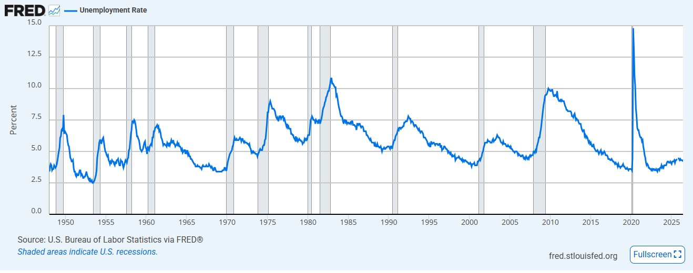

# Chapter 4: Unemployment, the Labor Force, and the Economy {#unemployment-the-labor-force-and-the-economy}

> When your brother-in-law is unemployed, its a recession. When you’re unemployed, its a depression. When Jimmy Carter is unemployed, it’s a recovery.\
> — Ronald Reagan

## 4.1 Defining the Labor Force {#sec:defining_labor_force}

One of the most closely watched indicators of the health of an economy is the labor market. News reports frequently discuss how many people are working, how many are unemployed, and whether the labor force is growing or shrinking. Before economists can measure unemployment, however, they must first answer a more basic question:

> *Who is actually part of the labor force?*

The answer is not as obvious as it may seem. Not every adult is considered part of the labor force. For example, a retired person who has no interest in working is not counted. A full-time college student who is not looking for a job is not counted. Likewise, a stay-at-home parent who has chosen not to seek employment is not counted.

Economists therefore begin by dividing the adult population into three mutually exclusive groups:

1.  People who are employed.

2.  People who are unemployed but actively looking for work.

3.  People who are not in the labor force.

Understanding these three categories is the first step toward measuring employment and unemployment.

### 4.1.1 Who Is Employed?

A person is considered **employed** if they performed paid work during the survey’s reference week or temporarily had a job but did not work because of vacation, illness, parental leave, or another temporary absence.

Employment includes much more than traditional full-time jobs. Individuals working part-time, operating their own businesses, or working as independent contractors are also considered employed.

For example, each of the following people would be classified as employed:

- a teacher working full time,

- a college student working ten hours each week,

- a self-employed electrician,

- a rideshare driver,

- a worker on paid vacation.

Notice that the definition depends on whether a person has a job—not on how many hours they work or how much income they earn.

::: definitionbox
**Definition**

An individual is **employed** if they have a job or business, whether full-time or part-time, or if they are temporarily absent from their job during the survey period.
:::

### 4.1.2 Who Is Unemployed?

A person is considered **unemployed** if all three of the following conditions are met:

1.  The person does not currently have a job.

2.  The person is available to begin working.

3.  The person has actively searched for work within the recent past.

The third condition is particularly important. A person who does not have a job but is not actively searching for one is *not* counted as unemployed.

For example, someone who recently submitted job applications and attended interviews would be classified as unemployed. In contrast, someone who stopped looking for work several months ago because they believed no jobs were available would not be counted as unemployed.

This distinction sometimes surprises students, but it reflects the idea that the labor force includes only those who are either working or actively trying to work.

::: definitionbox
**Definition**

An individual is **unemployed** if they do not have a job, are available for work, and have actively searched for employment.
:::

### 4.1.3 Who Is Not in the Labor Force?

Everyone else belongs to a third category: people who are **not in the labor force**.

This group includes individuals who are neither employed nor actively seeking employment.

Examples include:

- retirees,

- full-time students who are not looking for work,

- stay-at-home parents,

- individuals unable to work because of long-term illness or disability,

- people who simply choose not to work.

It is important to recognize that not being in the labor force does *not* imply laziness or lack of contribution to society. Many people outside the labor force perform valuable activities such as raising children, caring for elderly family members, volunteering, or pursuing education.

### 4.1.4 The Labor Force

The **labor force** consists of everyone who is either employed or unemployed.

In other words,

$$Labor\ Force \ = \ Employed + Unemployed.$$

The labor force excludes everyone who is not actively participating in the labor market.

::: definitionbox
**Definition**

The **labor force** is the sum of employed and unemployed individuals.

$$Labor\ Force \ = \ Employed + Unemployed.$$
:::

### 4.1.5 Calculating the Labor Force Participation Rate

Knowing the size of the labor force is useful, but economists often want to know what fraction of the adult population is participating in the labor market.

This measure is called the **labor force participation rate**.

The labor force participation rate is calculated as

$$Labor\ Force\ Participation\ Rate \ = \ \frac{Labor\ Force} {Adult\ Population}\times100\%,$$ or $$Labor\ Force\ Participation\ Rate \ = \ \frac{Employed + Unemployed} {Adult\ Population}\times100\%.$$

The labor force participation rate tells us what percentage of adults are either working or actively seeking work.

::: definitionbox
**Definition**

The **Labor Force Participation Rate (LFPR)** measures the percentage of the adult population participating in the labor market.

$$Labor\ Force\ Participation\ Rate \ = \ \frac{Labor\ Force} {Adult\ Population}\times100\%,$$ or $$Labor\ Force\ Participation\ Rate \ = \ \frac{Employed + Unemployed} {Adult\ Population}\times100\%.$$
:::

### 4.1.6 Worked Example

Suppose a small economy has the following adult population.

  Category               Number of People
  -------------------- ------------------
  Employed                            650
  Unemployed                           50
  Not in Labor Force                  300
  Adult Population                  1,000

  : **Table 4.1.** Adult Population in a Simple Economy {#tab:lf_example source-number="4.1"}

The labor force is

$$Labor\ Force \ = \ 650+50=700.$$

The labor force participation rate is therefore

$$LFPR \ =  \ \frac{700}{1,000}\times100\% \ = \ 70\%.$$

This means that 70% of the adult population is participating in the labor market, while the remaining 30% is not in the labor force.

Notice that this calculation tells us nothing about unemployment. It simply measures how many adults are participating in the labor market. In the next section, we will use this same example to calculate the unemployment rate.

::: realworld
**Economics in the Real World**

Labor force participation changes over time as society changes. For example, labor force participation increased dramatically in the United States during the second half of the twentieth century as more women entered the workforce. More recently, aging populations have reduced labor force participation in many developed countries, including the United States, as large numbers of workers retire.

Economists pay close attention to changes in labor force participation because they affect an economy’s productive capacity, tax revenues, and long-run economic growth.
:::

::: misconception
**Common Misconception**

A common misconception is that everyone without a job is unemployed.

This is not correct.

A person is counted as unemployed only if they are actively looking for work. Individuals who have retired, returned to school, chosen to stay home with children, or stopped searching for work are not counted as unemployed. Instead, they are classified as *not in the labor force*.
:::

::: thinkingeconomist
**Thinking Like an Economist**

Suppose a town has an adult population of 20,000 people.

Of these adults,

- 12,000 have jobs,

- 800 are actively looking for work,

- 7,200 are retired, attending school full time, caring for family members, or otherwise not seeking employment.

Answer the following questions.

1.  What is the size of the labor force?

2.  What is the labor force participation rate?

3.  Why are the 7,200 adults not counted as unemployed?

Solve the problem before discussing it with classmates or using a generative AI tool.
:::

::: researchbox
**From the Research**

Nobel Laureate Claudia Golden along with her colleagues Marianne Bertrand and Lawrence Katz have documented that recent graduates of high-level MBA programs are very similar in their labor force participation and compensation. However, after the birth of children, women in the sample were more likely to exit the workforce for a period of time or to decrease their number of hours worked per week. The changes in labor force participation culminate in the formation of a gender wage gap among the workers. This paper highlights one aspect of the importance of the labor force participation decision for workers. Bertrand, Marianne, Claudia Goldin, and Lawrence F. Katz. 2010. "Dynamics of the Gender Gap for Young Professionals in the Financial and Corporate Sectors." *American Economic Journal: Applied Economics* 2 (3): 228–55.
:::

::: keytakeaways
**Key Takeaways**

- The adult population can be divided into employed, unemployed, and people not in the labor force.

- The labor force consists of everyone who is employed or actively looking for work.

- People who are retired, attending school full time, or otherwise not seeking employment are not counted as part of the labor force.

- The labor force is calculated as: $$Labor\ Force = Employed + Unemployed.$$

- The labor force participation rate measures the percentage of the adult population participating in the labor market: $$Labor\ Force\ Participation\ Rate \ = \ \frac{Labor\ Force} {Adult\ Population}\times100\%,$$ or $$Labor\ Force\ Participation\ Rate \ = \ \frac{Employed + Unemployed} {Adult\ Population}\times100\%.$$

- The labor force participation rate measures labor market participation, not unemployment.
:::

::: ailab
**AI Economics Lab**

Use a generative AI tool as your virtual teaching assistant to strengthen your understanding of the labor force. Before asking the AI for assistance, answer each question independently.

1.  **Explore:** Ask the AI to generate five hypothetical adults with different employment situations. Classify each person as employed, unemployed, or not in the labor force before checking the AI’s answers.

2.  **Reason:** Ask the AI to create three labor market tables similar to Table [4.1](#tab:lf_example){reference-type="ref" reference="tab:lf_example"}. Calculate the labor force and labor force participation rate for each example before asking the AI to verify your calculations.

3.  **Evaluate:** Ask the AI to explain the difference between being unemployed and being out of the labor force. Critique the explanation. Did the AI correctly emphasize the requirement that an unemployed person must be actively seeking work?

4.  **Apply:** Ask the AI to describe how the labor force participation rate might change if a large number of retirees returned to work or if more young adults enrolled in college full time. Explain why these changes would affect the labor force participation rate.

5.  **Reflect:** In your own words, explain why economists measure the labor force participation rate separately from the unemployment rate.
:::

## 4.2 Defining Unemployment {#sec:defining_unemployment}

In the previous section, we learned how economists divide the adult population into three groups: employed, unemployed, and not in the labor force. We also learned that the labor force consists only of people who are either employed or actively seeking employment.

Now we are ready to answer one of the most important questions in macroeconomics:

> *How many people in the labor force are unable to find a job?*

The answer is summarized by the **unemployment rate**, one of the most widely reported economic statistics in the world. Governments, businesses, investors, and households closely monitor the unemployment rate because it provides valuable information about the health of the labor market.

Before learning how to calculate the unemployment rate, however, we must first understand exactly who is considered unemployed.

### 4.2.1 Who Counts as Unemployed?

Recall from the previous section that a person is classified as unemployed only if all three of the following conditions are satisfied:

1.  The person does not currently have a job.

2.  The person is available to begin working.

3.  The person has actively searched for work.

The third requirement is especially important. Simply being without a job does not automatically make someone unemployed.

For example, consider the following individuals.

- Emma recently graduated from college and has submitted several job applications. She is available to begin working immediately.

- Carlos retired last year and has no interest in returning to work.

- Sophia is taking time off to care for her young children and is not currently looking for employment.

- Michael lost his job six months ago but recently stopped searching because he believes there are no jobs available.

Of these four individuals, only Emma is counted as unemployed. Carlos and Sophia are not in the labor force because they are not seeking employment. Michael also is not counted as unemployed because he is no longer actively searching for work.

These distinctions may seem surprising, but they ensure that the unemployment rate measures people who are actively participating in the labor market.

### 4.2.2 Calculating the Unemployment Rate

The unemployment rate measures the percentage of the labor force that is unemployed. Notice that the denominator is *not* the adult population. Instead, it is the labor force. The unemployment rate is calculated as

$$Unemployment\ Rate \ = \ \frac{Unemployed}{Labor\ Force}\times100\%.$$

::: definitionbox
**Definition**

The **unemployment rate** measures the percentage of the labor force that is unemployed.

$$Unemployment\ Rate \ = \ \frac{Unemployed}{Labor\ Force}\times100\%.$$
:::

This formula is easy to remember once you recognize that unemployment is a labor market concept. The unemployment rate asks:

> *Of the people who are participating in the labor market, what percentage cannot find a job?*

People who are not participating in the labor market are not included in this calculation.

### 4.2.3 Worked Example

Consider the same economy introduced in Section [4.1](#sec:defining_labor_force){reference-type="ref" reference="sec:defining_labor_force"}.

  Category               Number of People
  -------------------- ------------------
  Employed                            650
  Unemployed                           50
  Not in Labor Force                  300
  Adult Population                  1,000
  Labor Force                         700

  : **Table 4.2.** Labor Market in a Simple Economy {#tab:ue_example source-number="4.2"}

The unemployment rate is

$$Unemployment\ Rate \ = \ \frac{50}{700}\times100\%.$$

Therefore,

$$Unemployment\ Rate \ = \ 7.1\%.$$

This means that approximately 7 out of every 100 people participating in the labor market are unemployed.

Notice that the 300 individuals who are not in the labor force are excluded from the calculation.

### 4.2.4 A Common Mistake

Students often make the same mistake when calculating the unemployment rate.

Suppose someone incorrectly divides the number of unemployed people by the adult population instead of the labor force.

Using the data from Table [4.2](#tab:ue_example){reference-type="ref" reference="tab:ue_example"},

$$\frac{50}{1,000}\times100 \ = \ 5\%.$$

This answer is incorrect because it includes people who are not participating in the labor market.

The unemployment rate is designed to measure the fraction of *labor force participants* who are unable to find work. People who have retired, returned to school, chosen to stay home with children, or otherwise decided not to work are not searching for employment and therefore are not part of the unemployment calculation.

Whenever you calculate the unemployment rate, ask yourself one question:

> *Am I dividing by the labor force or by the population?*

If you divide by the adult population, your answer will almost certainly be incorrect.

### 4.2.5 Labor Force Participation and Unemployment

The labor force participation rate and the unemployment rate measure two different aspects of the labor market. The labor force participation rate tells us what percentage of adults are participating in the labor market. The unemployment rate tells us what percentage of labor force participants do not currently have jobs. Because they measure different things, these two statistics can move in different directions.

For example, suppose many discouraged workers stop searching for jobs. They leave the labor force and are no longer counted as unemployed. As a result,

- the labor force participation rate decreases,

- the unemployment rate may also decrease.

At first glance, a falling unemployment rate appears to be good news. But in this case, the decline occurred because people stopped looking for work rather than because more people found jobs.

Economists therefore often examine both measures together when evaluating the labor market.

::: realworld
**Economics in the Real World**

Every month, newspapers report the unemployment rate as one of the most important indicators of the economy.

Suppose the unemployment rate falls from 5.0% to 4.5%.

This sounds like good news—and often it is.

However, economists immediately ask a second question:

> *Did more people find jobs, or did fewer people participate in the labor force?*

By examining both the unemployment rate and the labor force participation rate together, economists can better understand what is actually happening in the labor market.
:::

::: misconception
**Common Misconception**

A common misconception is that everyone without a job is counted as unemployed.

This is not true.

Only individuals who do not have a job, are available for work, and are actively searching for employment are classified as unemployed.

People who are retired, attending school full time, caring for family members, or have stopped looking for work are not counted as unemployed. They are classified as *not in the labor force*.

Another common mistake is dividing the number of unemployed people by the adult population instead of the labor force. The unemployment rate always uses the labor force as the denominator.
:::

:::: thinkingeconomist
**Thinking Like an Economist**

Consider the following labor market.

::: center
  Category               Number of People
  -------------------- ------------------
  Employed                          8,400
  Unemployed                          600
  Not in Labor Force                3,000
  Adult Population                 12,000
:::

Answer the following questions.

1.  What is the labor force?

2.  What is the labor force participation rate?

3.  What is the unemployment rate?

4.  Suppose 200 unemployed workers stop searching for jobs. What happens to the labor force participation rate?

5.  What happens to the unemployment rate?

6.  Does this necessarily mean the labor market improved? Explain.

Solve the problem before discussing it with classmates or using a generative AI tool.
::::

::: keytakeaways
**Key Takeaways**

- The unemployment rate measures the percentage of the labor force that is unemployed.

- A person is unemployed only if they do not have a job, are available for work, and are actively seeking employment.

- The unemployment rate is calculated as $$Unemployment\ Rate
  =
  \frac{Unemployed}
  {Labor\ Force}
  \times100.$$

- The unemployment rate uses the labor force—not the adult population—as its denominator.

- The labor force participation rate and the unemployment rate measure different aspects of the labor market and should often be interpreted together.

- A declining unemployment rate does not always indicate an improving labor market if people are leaving the labor force rather than finding jobs.
:::

::: ailab
**AI Economics Lab**

Use a generative AI tool as your virtual teaching assistant to strengthen your understanding of unemployment. Before asking the AI for assistance, answer each question independently.

1.  **Explore:** Ask the AI to generate five hypothetical adults with different employment situations. Determine whether each person is employed, unemployed, or not in the labor force before checking the AI’s answers.

2.  **Reason:** Ask the AI to generate three labor market tables containing the number of employed, unemployed, and people not in the labor force. Calculate the labor force, labor force participation rate, and unemployment rate before asking the AI to verify your calculations.

3.  **Evaluate:** Ask the AI to explain why the unemployment rate uses the labor force rather than the adult population as the denominator. Critique the explanation. Did the AI clearly explain the purpose of the unemployment rate?

4.  **Apply:** Ask the AI to create a scenario in which the unemployment rate falls even though no one finds a job. Explain why this can happen and whether the labor market has actually improved.

5.  **Reflect:** In your own words, explain why economists examine both the unemployment rate and the labor force participation rate when evaluating the health of the labor market.
:::

## 4.3 Measuring Employment and Unemployment {#sec:measuring_unemployment}

In the previous two sections, we learned how economists define the labor force and calculate the unemployment rate. These definitions seem straightforward, but they raise an important practical question:

> *How do economists actually know how many people are employed or unemployed?*

After all, the United States has a population of more than 300 million people. It would be impossible to ask every individual each month whether they have a job or are looking for one.

Instead, economists use statistical sampling. Much like political polls estimate the outcome of an election by surveying only a small portion of voters, labor market statistics are estimated by surveying a representative sample of households.

The responsibility for collecting these data belongs primarily to the **Bureau of Labor Statistics (BLS)**, a federal agency within the U.S. Department of Labor.

::: {#fig:Unemployment .source-figure source-number="4.1"}

**Figure 4.1.** **The Unemployment Rate in the United States (Jan. 1948 — June 2026)**\
Source: *Federal Reserve Economic Data.* The time series plot shown above displays the unemployment rate, measured in percentage points each month, from January, 1948 through June, 2026.
:::

::: {.aifiguredescription figure-id="fig:Unemployment"}
**Figure description: `fig:Unemployment`**

This FRED time-series chart shows a single blue line labeled **Unemployment Rate**. Calendar time is on the horizontal axis, with labeled years from 1950 to 2025; the chapter caption states January 1948–June 2026. The vertical axis is **Percent**, running from 0 to 15. Gray vertical bands indicate U.S. recessions. The source printed inside the image is the U.S. Bureau of Labor Statistics via FRED.

Unemployment fluctuates rather than following the sustained upward trend seen in the GDP-per-capita figure. Prominent peaks occur around the early 1980s (a little above 10%), 2009–2010 (around 10%), and 2020 (close to 15%). After the abrupt 2020 spike, the rate falls back toward its earlier low range; the right edge is around 4%. These are approximate visual readings, not exact monthly observations.

The figure introduces the chapter's measurement discussion and provides context for cyclical changes. The rate uses unemployed people as a share of the labor force; it is not the share of the whole population without a job. The vertical axis measures a percentage **level**. The caption's phrase “measured in percentage points each month” is retained, but a change from 4% to 5% would be one percentage point, not a displayed monthly growth series. Recession shading indicates timing and does not alone identify the cause or size of an unemployment response. The static image is not a live labor-market update.
:::

### 4.3.1 The Current Population Survey

The unemployment rate and labor force participation rate are estimated using the **Current Population Survey (CPS)**.

Each month, the Bureau of Labor Statistics and the U.S. Census Bureau survey approximately 60,000 households across the United States. The households are selected to represent the nation’s population with respect to geography, age, race, gender, education, and many other characteristics.

Interviewers ask a series of standardized questions about each adult in the household. Based on the responses, every individual is classified as:

- employed,

- unemployed, or

- not in the labor force.

Because the survey uses consistent definitions every month, economists can compare labor market conditions over time.

::: definitionbox
**Definition**

The **Current Population Survey (CPS)** is a monthly survey of approximately 60,000 U.S. households conducted by the Bureau of Labor Statistics and the U.S. Census Bureau.

The survey provides the data used to estimate the unemployment rate, labor force participation rate, and other labor market statistics.
:::

### 4.3.2 How the Survey Classifies Individuals

The survey asks questions about each person’s employment situation during a specific **reference week**, usually the week containing the 12th day of the month.

Some of the questions include:

- Did you work for pay during the reference week?

- If you did not work, did you actively search for a job?

- Are you currently available to begin working?

- Were you temporarily absent from a job because of vacation, illness, or another reason?

The answers determine how each individual is classified.

For example:

- Someone working 10 hours per week is counted as employed.

- Someone temporarily on vacation from work is counted as employed.

- Someone without a job who submitted applications during the previous four weeks is counted as unemployed.

- Someone who stopped looking for work several months ago is not counted as unemployed.

Although these definitions may sometimes seem counterintuitive, they ensure that labor market statistics are measured consistently from month to month.

### 4.3.3 The Household Survey and the Establishment Survey

Each month, the Bureau of Labor Statistics actually releases information from two separate surveys.

The first is the **Current Population Survey (Household Survey)**, which we have already discussed. This survey measures people. It provides estimates of:

- employment,

- unemployment,

- labor force participation,

- demographic characteristics of workers.

The second is the **Current Employment Statistics Survey**, often called the **Establishment Survey**. Rather than surveying households, it surveys approximately 122,000 businesses and government agencies covering more than 600,000 individual worksites.

The Establishment Survey measures jobs rather than people.

It provides information about:

- total payroll employment,

- hours worked,

- average hourly earnings,

- employment by industry.

Because the two surveys measure different things, their results are not always identical. For example, a person working two jobs appears once in the Household Survey but twice in the Establishment Survey because two separate jobs are counted. Likewise, self-employed workers are included in the Household Survey but generally excluded from the Establishment Survey.

                            Household Survey                                             Establishment Survey
  ------------------------- ------------------------------------------------------------ --------------------------------------------
  Who is surveyed?          Households                                                   Businesses and government agencies
  Measures                  People                                                       Jobs
  Reports                   Unemployment, labor force participation, employment status   Payroll employment, hours worked, earnings
  Includes self-employed?   Yes                                                          Generally no
  Counts multiple jobs?     No                                                           Yes

  : **Table 4.3.** Comparing the Two Major Labor Market Surveys {#tab:household_establishment source-number="4.3"}

Together, these two surveys provide a comprehensive picture of the U.S. labor market.

### 4.3.4 Sampling and Statistical Error

Because the unemployment rate is estimated from a sample rather than a complete census, every monthly estimate contains a small amount of sampling error. This does not mean the estimates are unreliable. Instead, it means that the reported unemployment rate is the best statistical estimate based on the available information.

For this reason, economists usually focus on broader trends rather than small month-to-month changes. For example, an increase in the unemployment rate from 4.0% to 4.1% may not represent a meaningful deterioration in the labor market. However, an increase from 4.0% to 6.5% over several months almost certainly reflects important economic changes. Economists therefore interpret labor market data using both statistical evidence and economic judgment.

### 4.3.5 Why These Statistics Matter

The unemployment rate and labor force participation rate are among the first economic statistics released each month because they provide valuable information about the overall health of the economy. Businesses use labor market data when deciding whether to expand production or hire additional workers. Financial markets react because employment influences consumer spending, business investment, and interest rates. The Federal Reserve closely monitors labor market conditions when making monetary policy decisions. Households also pay attention because employment opportunities influence wages, career decisions, and confidence about the future. Although no single statistic perfectly summarizes the labor market, employment and unemployment data provide one of the clearest pictures of current economic conditions.

::: realworld
**Economics in the Real World**

On the first Friday of nearly every month, financial markets closely watch the release of the U.S. Employment Situation Report from the Bureau of Labor Statistics.

Within minutes of its release, stock prices, bond yields, and exchange rates often change as investors interpret the new information.

The report includes far more than just the unemployment rate. It also contains information on payroll employment, average hourly earnings, labor force participation, hours worked, and employment across different industries.

Because employment influences consumer spending, inflation, and future economic growth, these reports are among the most closely watched economic releases in the world.
:::

::: misconception
**Common Misconception**

A common misconception is that the government counts every unemployed person each month.

In reality, the unemployment rate is an estimate based on a carefully designed statistical survey of approximately 60,000 households. Like political polling, the survey uses a representative sample to estimate conditions for the entire country.

Another misconception is that the monthly jobs report and the unemployment rate come from the same survey. They do not. The unemployment rate comes from the Household Survey, while payroll employment comes from the Establishment Survey.
:::

::: thinkingeconomist
**Thinking Like an Economist**

Suppose the Bureau of Labor Statistics reports that payroll employment increased by 200,000 jobs during the month, but the unemployment rate also increased slightly.

1.  Is this necessarily a contradiction?

2.  Why might the Household Survey and the Establishment Survey tell slightly different stories?

3.  Can the unemployment rate increase even when more jobs are created? Explain.

4.  Why should economists avoid drawing conclusions from a single month’s data?

Answer these questions before discussing them with classmates or using a generative AI tool.
:::

::: researchbox
**From the Research**

The time-series plot in Figure [4.1](#fig:Unemployment){reference-type="ref" reference="fig:Unemployment"} shows the unemployment rate for more than three-quarters of a century in the United States. The unemployment rate is calculated monthly using the CPS discussed in 4.3.1. There are at least two interesting features of this graph. First, the unemployment rate increases quickly during recessions (shown by gray bars on the graph) and declines slowly after the recession has ended. Economists refer to the unemployment rate as *counter-cyclical* because the unemployment rate increases when the economic growth rate decreases and decreases when the economic growth rate increases. Second, there is no obvious and consistent trend in the unemployment rate despite the large increase of women entering the labor force, the rapid expansion of automation, and the advent of computers and AI in the workplace. Despite concerns over job loss due to physical capital that have been prevalent since Karl Marx’s time in the 1800s, there simply has not been a large decline in employment. In fact, more people are employed in the United States today than in the 1950s.
:::

::: keytakeaways
**Key Takeaways**

- The Bureau of Labor Statistics measures employment and unemployment using the Current Population Survey.

- Approximately 60,000 households are surveyed each month.

- The Household Survey measures people and is used to calculate the unemployment rate and labor force participation rate.

- The Establishment Survey measures jobs and reports payroll employment, hours worked, and wages.

- Because the two surveys measure different things, they do not always produce identical results.

- Labor market statistics are estimates based on representative samples rather than complete counts of the population.

- Economists focus on long-term trends rather than small month-to-month fluctuations when interpreting labor market data.
:::

::: ailab
**AI Economics Lab**

Use a generative AI tool as your virtual teaching assistant to strengthen your understanding of how employment statistics are measured. Before asking the AI for assistance, answer each question independently.

1.  **Explore:** Ask the AI to explain the difference between the Household Survey and the Establishment Survey. Compare its explanation with Table [4.3](#tab:household_establishment){reference-type="ref" reference="tab:household_establishment"}. Did it correctly distinguish between measuring people and measuring jobs?

2.  **Reason:** Ask the AI to generate five hypothetical individuals with different employment situations. Classify each person using the same rules employed by the Current Population Survey before checking the AI’s answers.

3.  **Evaluate:** Ask the AI why the unemployment rate is based on a sample rather than surveying every adult in the country. Critique its explanation. Did it discuss statistical sampling and sampling error?

4.  **Apply:** Locate the most recent Employment Situation Report published by the Bureau of Labor Statistics. Ask the AI to help interpret the report. Then evaluate whether the AI accurately explains the difference between payroll employment and the unemployment rate.

5.  **Reflect:** Write a short paragraph explaining why economists rely on both the Household Survey and the Establishment Survey when evaluating the health of the labor market.
:::

## 4.4 Types of Unemployment {#sec:types_of_unemployment}

In the previous sections, we learned how economists define the labor force, calculate the labor force participation rate, and calculate the unemployment rate. These statistics provide useful information about the labor market, but they do not tell the entire story.

For example, suppose the unemployment rate is 4%. Does this mean the labor market is healthy? Not necessarily. The answer depends on *why* people are unemployed and whether workers are fully utilizing their skills and abilities.

Economists therefore distinguish among several different types of unemployment. Each type has different causes, different consequences, and different policy implications.

### 4.4.1 Frictional Unemployment

**Frictional unemployment** is short-term unemployment that occurs because workers are moving between jobs or entering the labor force. This type of unemployment is a normal feature of a healthy economy. Every day, people graduate from college, relocate to a new city, leave one employer for another, or search for jobs that better match their skills and interests.

For example,

- a recent college graduate searching for a first full-time job,

- an accountant moving to another state,

- a software engineer voluntarily leaving one company to accept a better position,

are all examples of frictional unemployment.

Although these individuals are unemployed, they are actively searching for work and are expected to find employment relatively quickly.

::: definitionbox
**Definition**

**Frictional unemployment** is short-term unemployment that occurs because workers are changing jobs, entering the labor force, or searching for employment that better matches their skills.
:::

### 4.4.2 Structural Unemployment

**Structural unemployment** occurs when workers’ skills no longer match the needs of employers. Unlike frictional unemployment, structural unemployment is not simply a matter of finding the next job. Instead, the structure of the economy has changed. Technological progress, automation, international trade, changing consumer preferences, or the decline of particular industries may reduce demand for certain occupations while increasing demand for others.

For example,

- a coal miner whose local mine permanently closes,

- a factory worker displaced by automation,

- a travel agent whose job disappears because customers book trips online,

may all experience structural unemployment.

Finding new employment often requires retraining, additional education, relocation, or developing new skills.

::: definitionbox
**Definition**

**Structural unemployment** occurs when workers’ skills, education, or location no longer match available job opportunities.
:::

### 4.4.3 Cyclical Unemployment

**Cyclical unemployment** is unemployment caused by downturns in the business cycle. During recessions, businesses often experience declining sales. As production falls, firms reduce hiring or lay off workers. These workers become unemployed not because their skills have become obsolete, but because overall demand for goods and services has declined. As the economy recovers, cyclical unemployment typically falls as firms increase production and begin hiring again.

For example, during a recession.

- restaurants may reduce staff,

- construction companies may postpone projects,

- retailers may hire fewer seasonal workers,

- manufacturers may temporarily close production lines.

These workers may return to employment as economic conditions improve.

::: definitionbox
**Definition**

**Cyclical unemployment** is unemployment caused by declines in overall economic activity during recessions.
:::

### 4.4.4 Underemployment

The unemployment rate tells us how many people are without jobs, but it does not tell us whether workers are using their skills effectively. Some individuals have jobs but are still not fully employed. Economists refer to this situation as **underemployment**. Underemployment occurs when workers are employed but are unable to fully utilize their education, skills, experience, or desired number of work hours.

There are several forms of underemployment. First, a worker may have a part-time job while wanting full-time employment. Second, a worker may possess education or specialized training that is not being used in their current occupation.

For example, imagine an individual with a master’s degree in economics who cannot find employment as an economist and instead works as a grocery store clerk. This person is employed and therefore is *not* counted as unemployed. However, the worker’s education and skills are being significantly underutilized. Similarly, an experienced engineer working as a delivery driver or a licensed teacher working as a restaurant server would also be considered underemployed. Although these individuals contribute to production, they are not working in positions that fully utilize their human capital.

::: definitionbox
**Definition**

**Underemployment** occurs when individuals are employed but are not fully utilizing their skills, education, experience, or desired number of work hours.
:::

Because underemployment is not reflected in the unemployment rate, economists often examine additional labor market statistics to understand how effectively workers are being utilized.

### 4.4.5 Employment Is Not the Same as Economic Success

One limitation of the unemployment rate is that it classifies people very simply. An individual either has a job or does not. The unemployment rate does not distinguish between:

- a full-time physician,

- a part-time grocery clerk,

- a highly trained engineer working outside their profession,

- someone working one hour during the survey week.

All of these individuals are counted as employed.

For this reason, economists often supplement the unemployment rate with broader measures of labor market conditions, including underemployment, labor force participation, hours worked, and wage growth.

### 4.4.6 Multiple Job Holders

Another important limitation of the unemployment rate involves workers who hold multiple jobs. Suppose Sarah works as a high school teacher during the day and as a waitress on weekends. How many employed people does Sarah represent? The answer is one. The unemployment rate measures *people*, not jobs.

Whether Sarah has one job, two jobs, or three jobs, she is still classified as one employed individual. This is one reason the Household Survey and the Establishment Survey sometimes report different information. The Household Survey counts people. The Establishment Survey counts jobs. As a result, if many workers take second jobs, payroll employment reported by the Establishment Survey may increase while the unemployment rate remains unchanged.

::: examplebox
**Example**

Suppose an economy initially has:

- 1,000 employed people

- 50 unemployed people

The unemployment rate is

$$\frac{50}{1,050}\times100\% \ = \ 4.8\%.$$

Now suppose 100 employed workers each take a second part-time job. The number of jobs in the economy increases by 100.

However,

- employed people remain 1,000,

- unemployed people remain 50,

- the unemployment rate remains 4.8%.

The labor market has more jobs, but the unemployment rate does not change because no additional people became employed.
:::

Understanding this distinction helps explain why economists often examine several labor market indicators together rather than relying exclusively on the unemployment rate.

::: realworld
**Economics in the Real World**

Following major recessions, many workers eventually find employment but not necessarily in occupations that match their education or previous experience. During the Great Recession of 2007–2009, for example, many construction workers, financial professionals, and recent college graduates accepted jobs outside their preferred occupations while searching for better opportunities.

Although these individuals were counted as employed, many economists argued that the unemployment rate alone understated the weakness of the labor market because it did not capture widespread underemployment.
:::

::: misconception
**Common Misconception**

A common misconception is that the unemployment rate measures how well the labor market is performing.

The unemployment rate measures only the percentage of the labor force without jobs who are actively seeking work.

It does not measure:

- whether workers have multiple jobs,

- whether workers are employed part time but desire full-time work,

- whether workers are employed in occupations matching their education and skills,

- whether workers are earning wages consistent with their qualifications.

For this reason, economists often analyze underemployment, labor force participation, payroll employment, wages, and hours worked alongside the unemployment rate.
:::

::: thinkingeconomist
**Thinking Like an Economist**

Classify each of the following individuals.

For each person, identify

1.  whether they are employed, unemployed, or not in the labor force,

2.  whether they are frictionally, structurally, or cyclically unemployed (if applicable),

3.  whether they are underemployed.

- A recent economics graduate searching for a first full-time job.

- A factory worker permanently displaced by automation.

- A hotel employee laid off during a recession.

- A Ph.D. economist working as a grocery store clerk because no economist positions are available.

- A high school teacher who also works weekends as a restaurant server.

Explain your reasoning before discussing your answers with classmates or using a generative AI tool.
:::

::: researchbox
**From the Research**

The generosity of unemployment insurance, payments made to workers who are unemployed, increased during the Great Recession. Shan Jiang documents that the increases in unemployment insurance benefits resulted in longer unemployment spells, thereby increasing the rate of unemployment due to structural and frictional unemployment. Jiang, Shan, "Effects of the Duration and Benefit Level of Unemployment Insurance during the Great Recession: Evidence from Kentucky Administrative Data" (2016). *All Dissertations.* 1617. <https://open.clemson.edu/all_dissertations/1617>
:::

::: keytakeaways
**Key Takeaways**

- Frictional unemployment occurs when workers are temporarily between jobs.

- Structural unemployment occurs when workers’ skills no longer match available jobs.

- Cyclical unemployment occurs during economic downturns.

- Underemployment occurs when workers are employed but are not fully utilizing their skills or desired work hours.

- Highly educated workers employed in jobs requiring much less training are considered underemployed, not unemployed.

- The unemployment rate counts people, not jobs.

- A worker holding multiple jobs is still counted as one employed individual.

- Because the unemployment rate has important limitations, economists examine additional labor market statistics to gain a more complete understanding of labor market conditions.
:::

::: ailab
**AI Economics Lab**

Use a generative AI tool as your virtual teaching assistant to deepen your understanding of the different types of unemployment. Before asking the AI for assistance, answer each question independently.

1.  **Explore:** Ask the AI to generate eight hypothetical workers. Classify each as frictionally unemployed, structurally unemployed, cyclically unemployed, underemployed, employed, or not in the labor force before checking the AI’s answers.

2.  **Reason:** Ask the AI to create three examples of underemployment. Explain why each worker is considered employed even though they are not fully utilizing their human capital.

3.  **Evaluate:** Ask the AI to explain why a worker holding two jobs does not reduce the unemployment rate. Critique the explanation. Did the AI correctly distinguish between people and jobs?

4.  **Apply:** Ask the AI to describe how a recession affects frictional, structural, and cyclical unemployment differently. Evaluate whether the AI correctly identifies the primary cause of each type.

5.  **Reflect:** In your own words, explain why economists look beyond the unemployment rate when evaluating the health of the labor market.
:::

## 4.5 The Costs of Unemployment {#sec:costs_of_unemployment}

In the previous section, we learned that unemployment takes many forms. Some unemployment, such as frictional unemployment, is a normal part of a healthy labor market. Other forms, particularly cyclical unemployment during recessions, can create significant hardship for workers and their families.

Economists care deeply about unemployment because it represents more than just a number reported each month by the Bureau of Labor Statistics. Behind every unemployed worker is a person whose income, career, family, and future opportunities may be affected. At the same time, widespread unemployment reduces the economy’s ability to produce goods and services, lowering living standards for society as a whole. For these reasons, unemployment imposes both **private costs** on individuals and **social costs** on the economy.

### 4.5.1 The Personal Cost of Losing a Job

For most households, labor income is the primary source of financial security. When an individual loses a job, the most immediate consequence is a loss of income. Without regular earnings, families may struggle to pay for necessities such as housing, food, transportation, healthcare, and education. Although unemployment insurance and personal savings may provide temporary assistance, these resources are often limited.

For many workers, unemployment also means delaying important life decisions. Purchasing a home, starting a family, or saving for retirement may all become more difficult when income is uncertain. The financial costs of unemployment can therefore extend well beyond the loss of a paycheck.

### 4.5.2 The Human Cost of Unemployment

The effects of unemployment are not purely financial. Many people derive a sense of purpose, identity, accomplishment, and social interaction from their work. Losing a job can therefore affect emotional well-being as well as economic well-being.

Researchers have consistently found that prolonged unemployment is associated with higher levels of stress, anxiety, depression, and lower overall life satisfaction. Financial uncertainty often places additional strain on marriages, families, and personal relationships.

These effects help explain why economists view unemployment as more than simply a reduction in income. Employment contributes to both economic security and personal well-being.

::: examplebox
**Example**

Suppose two workers each lose jobs paying \$60,000 per year.

Worker A quickly finds another position after three weeks.

Worker B remains unemployed for twelve months.

Although both workers experienced unemployment, the long-term consequences are likely to be very different. Worker B may exhaust savings, accumulate debt, postpone retirement contributions, lose valuable work experience, and experience significantly greater emotional stress.

This example illustrates why economists pay attention not only to the unemployment rate but also to the duration of unemployment.
:::

### 4.5.3 Skill Depreciation and Future Earnings

One of the most important long-run costs of unemployment is the loss of human capital. Skills improve through regular use and experience. When workers remain unemployed for extended periods, some of their knowledge and skills may become outdated. This is particularly true in industries experiencing rapid technological change.

Employers may also become reluctant to hire workers who have been unemployed for long periods, even if those workers possess valuable experience. As a result, extended unemployment may reduce future earnings and career opportunities. Economists sometimes describe this as **skill depreciation**. The longer unemployment lasts, the more difficult it may become to return to previous levels of employment and income.

::: definitionbox
**Definition**

**Skill depreciation** refers to the decline in a worker’s knowledge, skills, or employability resulting from an extended period without work.
:::

### 4.5.4 The Cost to Society

Unemployment also creates important costs for society as a whole. When workers who are willing and able to produce goods and services remain unemployed, valuable resources are left idle. Factories may operate below capacity, businesses produce less output, and the economy’s standard of living falls below its potential. Every unemployed worker represents production that could have occurred but did not. For this reason, economists often describe unemployment as a loss of potential output.

Lower production also means lower incomes throughout the economy. Businesses earn less revenue, governments collect less tax revenue, and households have fewer resources available for consumption and saving. At the same time, governments often increase spending on unemployment insurance, income assistance, job training programs, and other forms of social support. Consequently, unemployment affects both sides of the government budget:

- tax revenues tend to decline,

- government expenditures often increase.

This combination can contribute to larger government budget deficits during recessions.

### 4.5.5 Long-Term Unemployment

Economists are particularly concerned about **long-term unemployment**, which refers to individuals who remain unemployed for extended periods.

The longer someone remains unemployed, the greater the likelihood that they experience:

- financial hardship,

- depletion of savings,

- loss of professional skills,

- reduced future earnings,

- increased emotional stress.

Long-term unemployment can also make finding a new job more difficult. Employers may prefer applicants with more recent work experience, and workers may lose professional networks or confidence after many months without employment. For these reasons, economists often pay attention not only to the unemployment rate itself but also to how long workers remain unemployed.

::: realworld
**Economics in the Real World**

During the Great Recession of 2007–2009, millions of workers lost their jobs as businesses reduced production and hiring. Many remained unemployed for months or even years.

Research showed that workers experiencing long-term unemployment often suffered lasting consequences. Some accepted lower-paying jobs than they previously held, while others permanently left occupations in which they had developed specialized skills. Many households depleted retirement savings, delayed major purchases, or accumulated debt while searching for work.

This experience illustrates why economists view unemployment as more than simply a temporary interruption in employment. Extended unemployment can affect workers’ financial security and career opportunities for many years.
:::

::: misconception
**Common Misconception**

A common misconception is that unemployment matters only because unemployed workers lose income. Income loss is certainly important, but unemployment has many additional costs. Workers may lose valuable job skills, delay career advancement, experience emotional stress, postpone important life decisions, and earn lower incomes even after returning to work. Society also bears costs through lower production, lower tax revenues, and higher government expenditures.

For these reasons, economists consider unemployment to be both an individual problem and a macroeconomic problem.
:::

::: thinkingeconomist
**Thinking Like an Economist**

Suppose two economies each have an unemployment rate of 5%.

In Economy A, most unemployed workers find new jobs within one month.

In Economy B, many unemployed workers remain unemployed for more than one year.

1.  Which economy is likely experiencing greater personal hardship?

2.  Which economy is likely losing more potential output?

3.  Which economy is likely experiencing more skill depreciation?

4.  Why might economists view these two labor markets very differently even though their unemployment rates are identical?

Answer these questions before discussing them with classmates or using a generative AI tool.
:::

::: researchbox
**From the Research**

The US Department of Health and Human Services has documented the negative consequences for an individual’s health due to being unemployed. “Unemployment can also have negative health consequences. Those who are unemployed report feelings of depression, anxiety, low self-esteem, demoralization, worry, and physical pain. Unemployed individuals tend to suffer more from stress-related illnesses such as high blood pressure, stroke, heart attack, heart disease, and arthritis. In addition, experiences such as perceived job insecurity, downsizing or workplace closure, and underemployment also have implications for physical and mental health.” You can view the entire report on employment and health here: <https://odphp.health.gov/healthypeople/priority-areas/social-determinants-health/literature-summaries/employment>
:::

::: keytakeaways
**Key Takeaways**

- Unemployment creates both private costs for individuals and social costs for the economy.

- Losing a job often results in lower income, financial uncertainty, and delayed life decisions.

- Unemployment may also reduce emotional well-being and increase stress for workers and their families.

- Extended unemployment can lead to skill depreciation and lower future earnings.

- Society bears costs through lower production, lower tax revenue, and higher government spending.

- Long-term unemployment is particularly costly because its effects often persist even after workers return to employment.

- Economists monitor unemployment closely because it affects both individual well-being and the overall performance of the economy.
:::

::: ailab
**AI Economics Lab**

Use a generative AI tool as your virtual teaching assistant to deepen your understanding of the costs of unemployment. Before asking the AI for assistance, answer each question independently.

1.  **Explore:** Ask the AI to identify five ways unemployment affects individuals beyond the loss of income. Compare the AI’s list with the ideas discussed in this section.

2.  **Reason:** Ask the AI to describe how unemployment affects households, businesses, and governments differently. Explain why each group experiences different economic costs.

3.  **Evaluate:** Ask the AI to explain why long-term unemployment is generally more harmful than short-term unemployment. Critique the explanation. Did the AI discuss skill depreciation, future earnings, and emotional well-being?

4.  **Apply:** Ask the AI to create two hypothetical economies with the same unemployment rate but different durations of unemployment. Compare the likely economic and social outcomes in each economy.

5.  **Reflect:** In your own words, explain why economists view unemployment as more than simply a labor market statistic. Your answer should distinguish between the personal costs of unemployment and the broader costs to society.
:::

## Chapter Summary {#chapter-summary .unnumbered}

The labor market is one of the most important parts of the economy because it determines how individuals earn income and how society uses one of its most valuable resources: human effort. This chapter introduced how economists define, measure, and analyze employment and unemployment.

Section 4.1 introduced the concept of the **labor force**. Economists divide the adult population into three groups: employed individuals, unemployed individuals, and individuals who are not in the labor force. The labor force consists only of people who are either employed or actively searching for employment.

The chapter introduced the **labor force participation rate**, which measures the percentage of the adult population participating in the labor market:

$$Labor\ Force\ Participation\ Rate
=
\frac{Labor\ Force}{Adult\ Population}
\times100.$$

This measure is important because changes in participation can affect the size and productive capacity of the economy. A rising participation rate means that more adults are working or looking for work, while a declining participation rate may reflect retirement, education decisions, demographic changes, or workers leaving the labor market.

Section 4.2 defined unemployment and introduced the **unemployment rate**. A person is counted as unemployed only if they do not have a job, are available for work, and are actively searching for employment.

The unemployment rate is calculated as:

$$Unemployment\ Rate
=
\frac{Unemployed}{Labor\ Force}
\times100.$$

The chapter emphasized that the unemployment rate does not measure the percentage of the population without jobs. Instead, it measures the percentage of labor force participants who are actively searching for work but cannot find employment.

Section 4.3 explained how the United States measures employment and unemployment. The Bureau of Labor Statistics (BLS) uses the **Current Population Survey (CPS)**, a monthly survey of approximately 60,000 households, to estimate employment, unemployment, and labor force participation.

The chapter also introduced the distinction between the two major labor market surveys:

- The **Household Survey**, which measures people and provides the unemployment rate and labor force participation rate.

- The **Establishment Survey**, which measures jobs and provides payroll employment, wages, and hours worked.

Because these surveys measure different things, they may sometimes produce different results. Economists therefore examine multiple indicators when evaluating labor market conditions.

Section 4.4 explained that unemployment is not a single phenomenon. Economists distinguish among several types of unemployment.

**Frictional unemployment** occurs when workers are temporarily between jobs or searching for positions that better match their skills.

**Structural unemployment** occurs when workers’ skills no longer match available jobs due to changes in technology, consumer preferences, globalization, or industry conditions.

**Cyclical unemployment** occurs during economic downturns when falling demand causes businesses to reduce production and employment.

The section also introduced **underemployment**. Underemployment occurs when individuals have jobs but are not fully utilizing their skills, education, experience, or desired work hours. For example, an economist working as a grocery clerk is employed according to official statistics but may be underemployed because their specialized training is not being used.

The chapter also explained that the unemployment rate counts people rather than jobs. A person with multiple jobs is still counted as one employed person. Therefore, increases in the number of jobs do not necessarily reduce the unemployment rate unless additional people become employed.

Section 4.5 examined the costs of unemployment. Although unemployment is measured as a percentage, behind every unemployed worker is an individual experiencing real economic consequences.

For individuals, unemployment can result in:

- lost income,

- financial stress,

- delayed life decisions,

- reduced career opportunities,

- skill depreciation.

For society, unemployment creates broader costs:

- lower production,

- reduced tax revenue,

- increased government spending,

- wasted human resources.

The chapter emphasized that long-term unemployment is particularly damaging because workers may lose skills, professional connections, and future earning potential.

The central lesson of this chapter is that unemployment statistics provide important information about the economy, but they must be interpreted carefully. The unemployment rate, labor force participation rate, underemployment, job creation, and duration of unemployment all provide different perspectives on the health of the labor market.

## Key Terms {#key-terms .unnumbered}

Adult population

: The population eligible to participate in the labor market, generally individuals age 16 and older.

Bureau of Labor Statistics (BLS)

: The government agency responsible for collecting and publishing major U.S. labor market statistics.

Current Employment Statistics Survey

: The BLS survey of businesses and government agencies used to measure payroll employment, wages, and hours worked.

Current Population Survey (CPS)

: The monthly household survey used to estimate employment, unemployment, and labor force participation.

Cyclical unemployment

: Unemployment caused by declines in overall economic activity during recessions.

Discouraged worker

: A person who wants a job but has stopped actively searching because they believe suitable jobs are unavailable.

Employed

: An individual who has a job or is temporarily absent from a job.

Establishment Survey

: A survey of businesses used to measure jobs rather than individual workers.

Frictional unemployment

: Short-term unemployment caused by workers changing jobs, entering the labor force, or searching for better employment opportunities.

Labor force

: The sum of employed and unemployed individuals.

Labor force participation rate

: The percentage of the adult population participating in the labor market.

Long-term unemployment

: A situation in which individuals remain unemployed for an extended period of time.

Not in the labor force

: Individuals who are neither employed nor actively searching for employment.

Structural unemployment

: Unemployment caused by a mismatch between workers’ skills and available jobs.

Underemployment

: A situation in which individuals are employed but are not fully utilizing their skills, education, experience, or desired work hours.

Unemployed

: Individuals who do not have a job, are available for work, and are actively searching for employment.

Unemployment rate

: The percentage of the labor force that is unemployed.

  $$Unemployment\ Rate
  =
  \frac{Unemployed}{Labor\ Force}
  \times100$$

Skill depreciation

: The decline in a worker’s skills or employability resulting from an extended period without work.

## Concept Check {#concept-check .unnumbered}

Answer the following questions in your own words.

::: {.bold-list-markers source-label-style="[label=\\textbf{\\arabic*.}]"}
1.  What are the three categories used to classify the adult population in labor market statistics?

2.  What is the difference between being unemployed and being out of the labor force?

3.  Define the labor force.

4.  Write the formula for the labor force participation rate.

5.  Why are retirees generally not counted as unemployed?

6.  Why must an unemployed person be actively searching for work?

7.  Write the formula for the unemployment rate.

8.  Why does the unemployment rate use the labor force as the denominator rather than the adult population?

9.  Suppose a person loses a job but stops searching for work. How does this affect their classification?

10. Can the unemployment rate fall even if no additional people find jobs? Explain.

11. What is the purpose of the Current Population Survey?

12. Why does the BLS survey households rather than every person in the country?

13. What is the difference between the Household Survey and the Establishment Survey?

14. Why might payroll employment and the unemployment rate sometimes move in different directions?

15. Define frictional unemployment.

16. Why is some frictional unemployment considered normal in a healthy economy?

17. Define structural unemployment.

18. Give an example of a worker experiencing structural unemployment.

19. Define cyclical unemployment.

20. Why does cyclical unemployment increase during recessions?

21. What is underemployment?

22. Why is an economist working as a grocery clerk considered employed but possibly underemployed?

23. Does a person with two jobs count as two employed people? Explain.

24. Why might the unemployment rate fail to capture all weaknesses in the labor market?

25. What are some personal costs of unemployment?

26. Why is long-term unemployment especially harmful?

27. How does unemployment create costs for society as a whole?

28. Why do economists examine more than one labor market statistic when evaluating economic conditions?
:::

“‘latex

## Problems and Applications {#problems-and-applications .unnumbered}

::: {.bold-list-markers source-label-style="[label=\\textbf{\\arabic*.}]"}
1.  **Classifying the Population**

    Classify each individual as employed, unemployed, or not in the labor force.

    a.  A college student who attends classes full time and is not looking for work.

    b.  A worker who was temporarily absent from their job because of illness.

    c.  A person who lost their job last month and has submitted several applications.

    d.  A retired person who does not want to work.

    e.  A person who has not worked for six months and has stopped searching because they believe no jobs are available.

    Explain the reasoning behind each classification.

2.  **Calculating the Labor Force**

    Suppose an economy has the following adult population:

    ::: center
      Category               Number of People
      -------------------- ------------------
      Employed                          7,500
      Unemployed                          500
      Not in Labor Force                2,000
    :::

    a.  Calculate the labor force.

    b.  Calculate the labor force participation rate.

    c.  Explain what the participation rate tells us about this economy.

3.  **Calculating the Unemployment Rate**

    Using the information from Problem 2:

    a.  Calculate the unemployment rate.

    b.  Explain why the denominator is the labor force rather than the adult population.

    c.  Suppose 200 unemployed workers stop looking for jobs. What happens to the unemployment rate?

4.  **Labor Force Participation and Demographics**

    Suppose a country experiences a large increase in retirement among older workers.

    a.  How would this affect the labor force?

    b.  How would this affect the labor force participation rate?

    c.  Would this necessarily increase the unemployment rate? Explain.

5.  **The Two Labor Surveys**

    For each statistic, identify whether it comes primarily from the Household Survey or the Establishment Survey.

    a.  The unemployment rate.

    b.  Total payroll employment.

    c.  Labor force participation rate.

    d.  Average hourly earnings.

    e.  The number of employed people.

    Explain why the two surveys may produce different results.

6.  **Frictional, Structural, or Cyclical?**

    Classify each situation.

    a.  A recent graduate spends three months searching for a first full-time job.

    b.  A factory worker loses a job because the company adopts new automated technology.

    c.  A hotel employee is laid off during a recession.

    d.  A nurse moves to another state and searches for a new position.

    e.  A newspaper printer loses a job because consumers increasingly read digital news.

7.  **Underemployment**

    For each individual, determine whether they are unemployed, employed, or underemployed.

    a.  A person with a master’s degree in economics working as a grocery clerk because economist positions are unavailable.

    b.  A person working 20 hours per week who wants a full-time position but cannot find one.

    c.  A person working full time as an accountant in a position matching their education.

    d.  A person with an engineering degree who chooses to work part time at a bookstore because they prefer the lifestyle.

    Explain why underemployment is different from unemployment.

8.  **Multiple Jobs**

    Suppose an economy has:

    - 5,000 employed people,

    - 500 unemployed people.

    a.  Calculate the unemployment rate.

    b.  Suppose 1,000 employed people each take a second job. What happens to the unemployment rate?

    c.  Why does the number of jobs increase while the unemployment rate remains unchanged?

9.  **The Cost of Unemployment**

    Two workers lose their jobs.

    Worker A finds a new job after two weeks.

    Worker B remains unemployed for eighteen months.

    a.  Which worker is likely to experience greater financial costs?

    b.  Which worker is more likely to experience skill depreciation?

    c.  Why might Worker B have lower future earnings even after finding a new job?

10. **Interpreting Labor Market Data**

    Suppose the following changes occur:

    - The unemployment rate falls from 6% to 5%.

    - The labor force participation rate also falls.

    a.  Does the lower unemployment rate necessarily mean the labor market improved?

    b.  What additional information would you want before drawing a conclusion?

11. **A Complete Labor Market Analysis**

    Consider the following economy:

    ::: center
      Category               Number of People
      -------------------- ------------------
      Adult Population                 20,000
      Employed                         12,000
      Unemployed                        1,000
      Not in Labor Force                7,000
    :::

    Calculate:

    a.  Labor force.

    b.  Labor force participation rate.

    c.  Unemployment rate.

    d.  The number of people not participating in the labor market.

12. **Evaluating Labor Market Health**

    Two economies have the same unemployment rate.

    Economy A:

    - Most unemployed workers find jobs within one month.

    Economy B:

    - Many unemployed workers remain unemployed for more than a year.

    Which economy likely has greater labor market problems? Explain.
:::

## Thinking Like an Economist {#thinking-like-an-economist .unnumbered}

:::: thinkingeconomist
**Thinking Like an Economist**

Use economic reasoning rather than simply recalling definitions.

::: {.bold-list-markers source-label-style="[label=\\textbf{\\arabic*.}]"}
1.  **The Missing Workers**

    Suppose an economy experiences a recession. Many unemployed workers become discouraged and stop searching for jobs.

    a.  What happens to the unemployment rate?

    b.  What happens to the labor force participation rate?

    c.  Why might the unemployment rate give an incomplete picture of the labor market?

2.  **The College Graduate Problem**

    Imagine two economics graduates.

    Graduate A finds a job as an economic analyst after graduation.

    Graduate B cannot find an economics position and works as a grocery clerk.

    a.  Are both graduates employed?

    b.  Is either graduate unemployed?

    c.  Is either graduate underemployed?

    d.  Why might the unemployment rate fail to capture the difference between these two situations?

3.  **The Multiple Job Puzzle**

    Suppose a worker takes a second job.

    a.  Does the unemployment rate change?

    b.  Does the number of jobs in the economy change?

    c.  Why do economists distinguish between counting people and counting jobs?

4.  **The Value of Work**

    Economists often emphasize that unemployment has costs beyond lost income.

    Identify three ways unemployment can affect an individual’s:

    - financial situation,

    - skills,

    - psychological well-being.

    Why might these costs become larger as unemployment lasts longer?

5.  **The Ideal Unemployment Rate**

    A policymaker argues:

    > "The goal of economic policy should be to reduce unemployment to zero."

    Do you agree?

    Explain why some unemployment is unavoidable in a dynamic economy where people change jobs, enter the labor force, and search for better opportunities.

6.  **Measuring What Matters**

    Suppose the unemployment rate falls, but:

    - labor force participation falls,

    - average hours worked decline,

    - underemployment increases.

    Would you conclude that the labor market improved? Explain your answer.
:::
::::

## Economics in the Real World {#economics-in-the-real-world .unnumbered}

::: realworld
**Economics in the Real World**

**Case Study: The Changing Nature of Work**

The labor market has changed dramatically over the past several decades. Technology, globalization, demographic changes, and shifting consumer preferences have transformed the types of jobs available and the skills employers demand. For some workers, these changes have created new opportunities. Technology has created entire industries involving software development, data analysis, online commerce, and digital services. For other workers, economic change has created challenges. Jobs that once provided stable employment may disappear because of automation, international competition, or changing consumer behavior.

This process illustrates why structural unemployment exists. A worker may be willing to work and actively searching for employment but still struggle to find a job if their skills no longer match employer needs.

At the same time, employment statistics may not capture the entire experience of workers. A displaced manufacturing worker who accepts a lower-paying service job is counted as employed, but may experience underemployment because their previous skills are no longer being fully utilized.

**Questions for Discussion**

a.  Why does technological change create both opportunities and challenges?

b.  How is structural unemployment different from cyclical unemployment?

c.  Why might the unemployment rate underestimate economic hardship among some workers?

d.  What policies could help workers adapt to structural changes in the economy?

e.  Should governments focus more on protecting existing jobs or helping workers transition to new opportunities? Explain.
:::

## Data Exploration {#data-exploration .unnumbered}

:::: dataexploration
**Data Exploration**

**Exploring the U.S. Labor Market Using Real Data**

Employment and unemployment statistics are among the most closely followed economic indicators. In this activity, you will use real labor market data to examine how economists measure employment conditions.

### Part A: Examining the Unemployment Rate {#part-a-examining-the-unemployment-rate .unnumbered}

::: {.bold-list-markers source-label-style="[label=\\textbf{\\arabic*.}]"}
1.  Visit the Bureau of Labor Statistics website or the Federal Reserve Economic Data (FRED) database.

2.  Find annual data for:

    - unemployment rate,

    - labor force participation rate,

    - total employment,

    - payroll employment.

3.  Choose a period of at least 15 years.

4.  Create a table showing how these labor market indicators changed over time.

5.  Identify:

    a.  the year with the highest unemployment rate,

    b.  the year with the lowest unemployment rate,

    c.  any major changes in labor force participation,

    d.  any periods that appear to represent recessions or recoveries.
:::

### Part B: Interpreting Labor Market Conditions {#part-b-interpreting-labor-market-conditions .unnumbered}

Using the data you collected, answer the following questions:

a.  Did the unemployment rate always move in the same direction as employment?

b.  Can employment increase while unemployment also increases? Explain how this could occur.

c.  Did the labor force participation rate change significantly during your period?

d.  What factors might explain changes in labor force participation?

e.  Does the unemployment rate alone provide a complete picture of labor market health? Why or why not?

### Part C: Examining Underemployment {#part-c-examining-underemployment .unnumbered}

The unemployment rate does not capture every weakness in the labor market.

Research additional labor market measures such as:

- part-time workers who want full-time employment,

- long-term unemployment,

- wage growth,

- average weekly hours worked.

Answer the following:

a.  Did underemployment increase or decrease during your chosen period?

b.  Was there a period when unemployment was falling but other labor market indicators remained weak?

c.  Why might economists examine multiple measures rather than relying only on the unemployment rate?

### Part D: AI Data Analysis {#part-d-ai-data-analysis .unnumbered}

Use a generative AI tool as your research assistant.

Provide the AI with your data table and ask it:

> “Analyze the health of this labor market using the unemployment rate, labor force participation rate, employment growth, and underemployment indicators.”

Then critically evaluate the AI’s response.

Did the AI:

- distinguish between unemployment and labor force participation?

- recognize that the unemployment rate has limitations?

- consider underemployment and job quality?

- avoid making conclusions based on a single statistic?

Write a short summary explaining what the data reveal about the labor market.
::::

## Policy Debate {#policy-debate .unnumbered}

:::: policydebate
**Policy Debate**

**Debate Question**

::: center
*Should government policy focus primarily on reducing unemployment or increasing worker opportunities?*
:::

Reducing unemployment is one of the most common goals of economic policy. However, the labor market is complex. A low unemployment rate does not necessarily mean every worker has a high-quality job, is using their skills effectively, or has access to strong career opportunities.

Policymakers must consider not only how many people have jobs but also the types of jobs available and whether workers can successfully adapt to economic change.

### Argument A: Government Should Focus on Reducing Unemployment {#argument-a-government-should-focus-on-reducing-unemployment .unnumbered}

Supporters argue that unemployment creates significant costs for individuals and society.

They emphasize that:

- unemployed workers lose income,

- families experience financial stress,

- the economy loses potential production,

- government tax revenue declines,

- social spending often increases.

From this perspective, policies that encourage hiring and economic growth should be a priority.

Examples include:

- reducing barriers to hiring,

- supporting economic growth,

- encouraging business investment,

- providing temporary assistance during recessions.

### Argument B: Government Should Focus on Worker Adaptation {#argument-b-government-should-focus-on-worker-adaptation .unnumbered}

Others argue that reducing unemployment alone is not enough. They emphasize that economic change is unavoidable and that workers need opportunities to adapt. From this perspective, policy should focus on:

- education and workforce training,

- helping workers transition between industries,

- improving job matching,

- supporting geographic mobility.

Supporters argue that structural unemployment cannot be solved simply by creating more jobs. Workers need opportunities to gain the skills demanded by a changing economy.

### Questions for Analysis {#questions-for-analysis .unnumbered}

a.  Why is unemployment costly to individuals?

b.  Why does structural unemployment require different policies than cyclical unemployment?

c.  Why might a low unemployment rate still hide labor market problems?

d.  Should policymakers focus more on creating jobs or improving worker skills?

e.  How should policymakers balance helping unemployed workers with encouraging workers to adapt to economic change?

**Your Task**

Write a policy recommendation.

Your response should:

- define the labor market problem you are addressing,

- identify the type of unemployment involved,

- explain the costs of the problem,

- propose a policy response,

- discuss one possible unintended consequence.
::::

## Chapter 4 AI Economics Lab {#chapter-4-ai-economics-lab .unnumbered}

:::: ailab
**AI Economics Lab**

Use a generative AI tool as your virtual teaching assistant to review Chapter 4. Your goal is not simply to receive answers, but to test and improve your understanding of labor market concepts.

::: {.bold-list-markers source-label-style="[label=\\textbf{\\arabic*.}]"}
1.  **Explore: Build a Labor Market Classifier**

    Ask the AI to generate ten hypothetical individuals with different employment situations.

    For each person, classify them as:

    - employed,

    - unemployed,

    - not in the labor force,

    - underemployed.

    Explain your reasoning before comparing your answers with the AI’s.

2.  **Reason: Calculate Labor Market Statistics**

    Ask the AI to create five hypothetical economies with:

    - adult population,

    - employed workers,

    - unemployed workers,

    - people not in the labor force.

    For each economy calculate:

    - labor force,

    - labor force participation rate,

    - unemployment rate.

    Check your calculations against the AI’s response.

3.  **Evaluate: Challenge the Unemployment Rate**

    Ask the AI:

    > “Is the unemployment rate the best measure of labor market health?”

    Critique the response.

    Did the AI discuss:

    - labor force participation,

    - underemployment,

    - job quality,

    - duration of unemployment,

    - multiple job holders?

    Revise the AI’s response if necessary.

4.  **Apply: Analyze a Recession**

    Ask the AI to create a fictional recession scenario.

    Identify:

    - whether unemployment is cyclical, structural, or frictional,

    - how workers are affected,

    - what policies might help.

    Explain whether you agree with the AI’s classification.

5.  **Extend: Compare Two Economies**

    Ask the AI to create two economies with identical unemployment rates but different labor market conditions.

    For example:

    - one economy with short-term unemployment,

    - one economy with widespread long-term unemployment and underemployment.

    Explain why the economies may have very different levels of economic hardship despite having the same unemployment rate.

6.  **Reflect:**

    Write a paragraph answering:

    > *Why is the unemployment rate useful but incomplete as a measure of labor market health?*

    Your answer should incorporate concepts from every section of this chapter.

7.  **Practice** Ask the AI to create multiple choice questions for you based on this chapter to use as a practice tool when you study.
:::
::::
