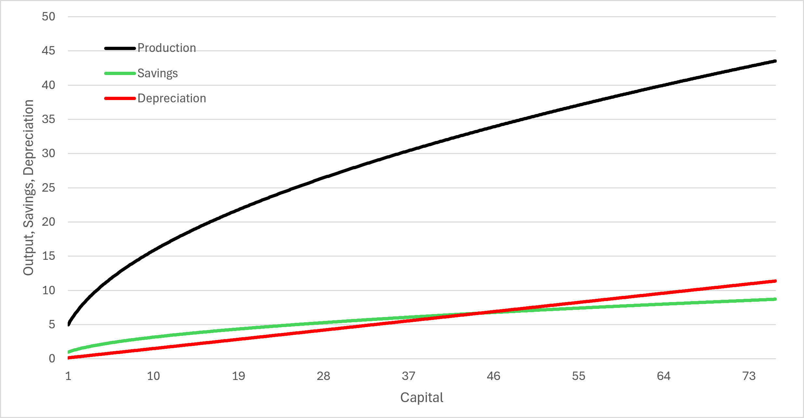

# Chapter 5: Long-Run Economic Growth {#long-run-economic-growth}

> If God had meant there to be more than two factors of production, He would have made it easier for us to draw three-dimensional diagrams.\
> — Robert Solow

## 5.1 The Production Function: How Economies Produce Goods and Services {#sec:production_function}

In Chapter 4, we introduced gross domestic product as a measure of the value of goods and services produced in an economy. In Chapter 5, we move from measuring economic growth to explaining it.

One of the most important questions in macroeconomics is:

> *Why are some economies able to produce more goods and services than others?*

The answer begins with understanding how economies transform resources into output.

Economists describe this relationship using a **production function**. A production function shows how an economy combines inputs to produce goods and services. The inputs used in production are often called **factors of production**.

The Solow Model focuses on three primary factors:

- Physical capital,

- Labor,

- Productivity.

These factors determine how much output an economy can produce.

::: modelbox
**Key Economic Model**

The Solow Model begins with the production function:

$$Y=AF(K,L)$$

where:

- $Y$ = output (real GDP),

- $A$ = productivity or technology,

- $K$ = physical capital,

- $L$ = labor.

The production function describes how an economy transforms inputs into output.
:::

### 5.1.1 Physical Capital

The variable $K$ represents **physical capital**. Physical capital includes the tools, machines, buildings, infrastructure, and equipment used to produce goods and services. Examples of physical capital include:

- factory equipment,

- computers,

- transportation networks,

- agricultural machinery,

- office buildings,

- power plants.

Physical capital is different from financial capital. Financial capital refers to money, stocks, bonds, and other financial assets. Financial capital can help businesses purchase resources, but it does not directly produce goods and services. Physical capital, by contrast, directly contributes to production.

A factory worker with advanced machinery can generally produce more output than the same worker using outdated tools. A farmer using a tractor can produce more food than a farmer using only hand tools. A software engineer with a powerful computer can often complete more work than one using limited technology.

Capital increases productivity because it allows workers to produce more output with the same amount of labor.

::: definitionbox
**Definition**

**Physical capital** is the collection of tools, machines, buildings, infrastructure, and equipment used to produce goods and services. Physical capital increases productivity by allowing workers to produce more output.
:::

### 5.1.2 Labor

The variable $L$ represents **labor**, or the human effort used in production.

Labor includes:

- the number of workers,

- the hours workers spend producing goods and services,

- the skills and effort workers contribute.

An economy with more workers generally has the ability to produce more output than an economy with fewer workers. However, the number of workers alone does not determine economic success. The quality of labor also matters. A highly educated and skilled workforce can often produce more output than a workforce with fewer skills.

This is why economists distinguish between labor and **human capital**. Human capital refers to the knowledge, skills, education, and experience that make workers more productive.

Although the Solow Model can include human capital, this chapter will focus primarily on physical capital accumulation. We will return to the deeper causes of productivity and economic success in Chapter 8.

::: definitionbox
**Definition**

**Human capital** refers to the knowledge, skills, education, and experience that make workers more productive.
:::

### 5.1.3 Productivity and the $A$ Term

The variable $A$ represents **productivity**, sometimes called technology or total factor productivity. Productivity measures how efficiently an economy transforms inputs into output.

Two economies may have the same amount of capital and labor but produce very different amounts of output if one economy uses those resources more effectively. For example, imagine two factories with identical numbers of workers and identical machines. If one factory uses better production methods, better organization, improved software, or superior management practices, it may produce more output than the other factory.

The difference is captured by the $A$ term.

::: definitionbox
**Definition**

**Productivity ($A$)** measures how efficiently an economy uses its inputs to produce goods and services.

Higher productivity means that the same amount of capital and labor can produce more output.
:::

Productivity includes many factors:

- technological knowledge,

- production techniques,

- organization and management,

- education and worker skills,

- institutions that encourage productive activity.

In this chapter, we treat $A$ as a given feature of an economy. Our focus is understanding how capital accumulation affects long-run growth. However, an important question remains:

> *Why do some economies have higher productivity than others?*

The answer depends heavily on the institutions that shape incentives, investment, innovation, and cooperation. We will examine the role of institutions in creating productivity and economic growth in Chapter 8.

### 5.1.4 The Importance of Capital Accumulation

Capital does not appear automatically. Economies must devote resources toward producing new capital.

For example:

- A business must invest profits into new equipment.

- A government must invest in infrastructure.

- A society must save resources that can be used for future production.

When an economy accumulates capital, workers become more productive, and output increases. However, the relationship between capital and output is not unlimited. More capital increases production, but each additional unit of capital usually provides a smaller increase in output than the previous unit. This idea is known as **diminishing marginal productivity of capital**.

### 5.1.5 Diminishing Marginal Productivity of Capital

Suppose a farmer begins with no tractors. Adding the first tractor may dramatically increase production because the farmer can complete tasks that were previously impossible. Adding a second tractor increases production further, but the increase may be smaller because many important tasks are already being completed. Adding a third tractor helps even less. Eventually, the farmer may have more tractors than can be effectively used.

This does not mean additional capital is harmful. It means that the additional benefit of each new unit of capital becomes smaller as the amount of capital increases.

::: definitionbox
**Definition**

The **diminishing marginal productivity of capital** means that each additional unit of capital increases output by a smaller amount than the previous unit of capital, holding other inputs constant.
:::

:::: examplebox
**Example**

Consider a small factory.

::: center
  Number of Machines    Total Output   Additional Output
  -------------------- -------------- -------------------
  0                         100                –
  1                         180               80
  2                         240               60
  3                         285               45
  4                         315               30
:::

The first machine increases output by 80 units.

The second machine increases output by 60 additional units.

The third machine increases output by 45 additional units.

The fourth machine increases output by 30 additional units.

Output continues to rise, but the additional benefit of each machine becomes smaller. This is diminishing marginal productivity.
::::

Diminishing marginal productivity is one of the most important ideas in the Solow Model because it explains why capital accumulation alone cannot generate unlimited economic growth. A country with very little capital can often grow rapidly by investing in additional capital. A country that already has a large amount of capital will experience smaller gains from additional investment. This idea will become central when we analyze why economies eventually approach a steady state.

### 5.1.6 Putting the Production Function Together

The production function tells us that output depends on three fundamental factors:

$$Y=AF(K,L).$$

An economy can increase output by:

1.  increasing capital,

2.  increasing labor,

3.  improving productivity.

However, these sources of growth do not have identical effects. Increasing capital can raise output, but diminishing marginal productivity means the benefits become smaller over time. Increasing productivity is different. Improvements in technology, knowledge, and institutions can allow an economy to produce more output with the same amount of capital and labor. This distinction will be essential throughout this chapter.

::: realworld
**Economics in the Real World**

Consider the difference between two farms.

Farm A has many workers and expensive machinery but uses outdated production methods.

Farm B has the same number of workers and similar machinery but uses advanced technology, improved organization, and better farming techniques.

Farm B may produce significantly more output despite having similar inputs.

The difference is captured by the productivity term $A$. Capital and labor matter, but how effectively an economy uses those resources is equally important.
:::

::: misconception
**Common Misconception**

A common misconception is that economic growth occurs simply because countries accumulate more machines and buildings.

Capital accumulation is important, but it is not the entire story. Because capital has diminishing marginal productivity, simply adding more machines eventually produces smaller increases in output.

Long-run economic growth depends heavily on productivity growth—the ability to produce more output with the same resources. The institutions that create productivity growth will be the focus of Chapter 8.
:::

::: thinkingeconomist
**Thinking Like an Economist**

Consider two economies with the following characteristics:

- Economy A has twice as much physical capital as Economy B.

- Economy B uses its capital much more efficiently because of better technology and organization.

Answer the following questions:

1.  Which economy would you expect to produce more output?

2.  Why might more capital not guarantee higher production?

3.  Which part of the production function captures differences in efficiency?

4.  What types of institutions might help increase $A$?

Answer these questions before discussing them with classmates or using a generative AI tool.
:::

::: researchbox
**From the Research**

Henry Ford caused a tremendous change in the productivity of his plants by rearranging the capital and labor he already employed into the moving assembly line. By using the moving assembly line, Ford was able to build a Model-T in roughly two to two-and-a-half hours. A remarkable decrease from the 12 hours a Model-T originally took to produce. As the production of Model-Ts exploded, the price dramatically came down and enabled working-class and middle-class Americans to afford an automobile for the first time.
:::

::: keytakeaways
**Key Takeaways**

- The production function describes how an economy transforms inputs into output.

- The Solow Model uses: $$Y=AF(K,L).$$

- Physical capital includes machines, buildings, infrastructure, and tools used in production.

- Labor represents the human effort used to produce goods and services.

- Productivity ($A$) measures how efficiently an economy uses capital and labor.

- Chapter 7 focuses on capital accumulation, while Chapter 8 explains how institutions influence productivity.

- Capital increases output, but capital has diminishing marginal productivity.

- Diminishing marginal productivity means that each additional unit of capital creates a smaller increase in output than the previous unit.
:::

::: ailab
**AI Economics Lab**

Use a generative AI tool as your virtual teaching assistant to deepen your understanding of the production function. Before asking the AI for assistance, answer each question independently.

1.  **Explore:** Ask the AI to create five examples of physical capital. For each example, explain how it increases worker productivity.

2.  **Reason:** Ask the AI to explain the difference between physical capital, financial capital, and human capital. Compare its explanation with the definitions from this section.

3.  **Evaluate:** Ask the AI to explain diminishing marginal productivity of capital. Critique the response. Did it clearly explain why output increases but additional output decreases?

4.  **Apply:** Ask the AI to create two economies with identical amounts of capital and labor but different productivity levels. Explain why their outputs differ.

5.  **Extend:** Ask the AI why institutions might affect the $A$ term in the production function. Evaluate the response and identify which ideas should be saved for Chapter 8.

6.  **Reflect:** Explain in your own words why accumulating more capital can increase economic growth but cannot explain unlimited growth by itself.
:::

## 5.2 Capital Accumulation: Savings and Depreciation {#sec:capital_accumulation}

In the previous section, we introduced the production function and explained why physical capital is important for economic growth. Machines, factories, infrastructure, and equipment allow workers to produce more goods and services.

However, capital does not remain constant. Machines wear out, buildings deteriorate, and equipment becomes outdated. At the same time, economies invest in new capital that increases productive capacity.

The key question is therefore:

> *How does an economy’s capital stock change over time?*

The Solow Model answers this question by focusing on two forces:

1.  Investment, which increases the capital stock.

2.  Depreciation, which reduces the capital stock.

The change in an economy’s capital stock depends on the difference between these two forces.

::: modelbox
**Key Economic Model**

The Solow Model describes capital accumulation as:

$$\Delta K = Investment - Depreciation$$

Investment adds new capital to the economy.

Depreciation removes capital as existing capital wears out or becomes obsolete.
:::

### 5.2.1 Savings Creates Investment

Where does investment come from?

In the Solow Model, investment comes from savings.

When households save part of their income, those resources become available for investment in physical capital. Businesses can use these resources to purchase machines, construct buildings, and expand production.

The model assumes that a constant fraction of output is saved and invested.

This fraction is represented by the savings rate:

$$s.$$

If an economy produces $Y$ units of output and saves a fraction $s$, then investment is:

$$Investment=sY.$$

For example, if an economy produces \$1 trillion in output and saves 20% of that output, investment equals:

$$Investment=0.20(\$1\text{ trillion})$$

$$Investment=\$200\text{ billion}.$$

The remaining 80% of output is consumed.

::: definitionbox
**Definition**

The **savings rate** ($s$) is the fraction of output that is saved and invested rather than consumed.

Investment is calculated as:

$$Investment=sY.$$
:::

The savings rate is important because it determines how quickly an economy accumulates capital. A higher savings rate means more resources are devoted to investment and capital accumulation.

However, as we learned in Section [5.1](#sec:production_function){reference-type="ref" reference="sec:production_function"}, capital has diminishing marginal productivity. Therefore, more investment does not produce constant increases in output forever.

### 5.2.2 Depreciation Reduces the Capital Stock

Capital is not permanent. Machines break down. Buildings require maintenance. Computers become outdated. Roads deteriorate. Economists refer to this process as **depreciation**. Depreciation reduces the economy’s capital stock over time. The amount of depreciation depends on:

- the amount of existing capital,

- the depreciation rate.

The depreciation rate is represented by:

$$\delta.$$

If an economy has capital stock $K$, depreciation is:

$$Depreciation=\delta K.$$

For example, suppose an economy has \$500 billion worth of capital and a depreciation rate of 5%.

Then:

$$Depreciation=0.05(\$500\text{ billion})$$

$$Depreciation=\$25\text{ billion}.$$

This means the economy must invest \$25 billion just to replace capital that wore out.

::: definitionbox
**Definition**

**Depreciation** is the reduction in the capital stock caused by wear, damage, or obsolescence.

Depreciation is calculated as:

$$Depreciation=\delta K.$$
:::

### 5.2.3 The Capital Accumulation Equation

Combining investment and depreciation gives us the central equation of capital accumulation:

$$\Delta K=sY-\delta K.$$

This equation tells us how the capital stock changes.

If:

$$sY>\delta K,$$

investment is greater than depreciation, and capital increases.

If:

$$sY<\delta K,$$

depreciation is greater than investment, and capital decreases.

If:

$$sY=\delta K,$$

investment exactly replaces depreciated capital, and the capital stock remains constant.

::: modelbox
**Key Economic Model**

The Solow capital accumulation equation is:

$$\Delta K=sY-\delta K$$

where:

- $sY$ = investment created by savings,

- $\delta K$ = depreciation,

- $\Delta K$ = change in the capital stock.
:::

### 5.2.4 Worked Example: Capital Growth

Consider an economy with:

$$K=100$$

$$Y=200$$

$$s=0.25$$

and

$$\delta=0.10.$$

First, calculate investment.

$$Investment=sY$$

$$Investment=0.25(200)$$

$$Investment=50.$$

The economy creates 50 units of new capital.

Next, calculate depreciation.

$$Depreciation=\delta K$$

$$Depreciation=0.10(100)$$

$$Depreciation=10.$$

Therefore, the change in capital is:

$$\Delta K=50-10$$

$$\Delta K=40.$$

The capital stock increases by 40 units.

::: examplebox
**Example**

For this economy:

$$Investment=50$$

$$Depreciation=10$$

Therefore:

$$\Delta K=40.$$

Because investment exceeds depreciation, the economy accumulates additional capital.
:::

### 5.2.5 Why Growth Slows as Capital Increases

Now consider what happens when the economy already has a large amount of capital.

Suppose the same economy now has:

$$K=500$$

and

$$Y=600.$$

The savings rate and depreciation rate remain unchanged:

$$s=0.25$$

$$\delta=0.10.$$

Investment is:

$$Investment=0.25(600)$$

$$Investment=150.$$

Depreciation is:

$$Depreciation=0.10(500)$$

$$Depreciation=50.$$

Capital growth is:

$$\Delta K=150-50$$

$$\Delta K=100.$$

Capital still grows, but the economy is closer to a point where depreciation becomes increasingly important.

As capital increases, two things happen:

1.  More capital must be replaced because there is more capital to maintain.

2.  Each additional unit of capital produces less additional output because of diminishing marginal productivity.

These forces eventually push the economy toward a point where investment only replaces depreciation. That point is called the **steady state**, which we will analyze in section 7.3.

### 5.2.6 The Role of Savings

The savings rate plays an important role in determining how much capital an economy accumulates.

A higher savings rate means:

$$s\uparrow$$

which causes:

$$Investment\uparrow$$

and therefore:

$$K\uparrow.$$

However, a higher savings rate does not create unlimited economic growth. Because capital has diminishing marginal productivity, each additional unit of capital creates smaller gains in output. Eventually, the economy reaches a new steady state with a higher level of output but no permanent increase in the growth rate.

This distinction is crucial:

> A higher savings rate can increase the level of output, but it cannot create permanent growth by itself.

::: realworld
**Economics in the Real World**

Countries often encourage saving and investment because capital accumulation increases productivity. Businesses invest in factories, computers, equipment, and research because these investments allow workers to produce more.

However, investment decisions must also account for depreciation. A company that purchases new machinery must eventually replace or upgrade that equipment. Similarly, governments must continually maintain infrastructure such as roads, bridges, and public utilities.

Economic growth requires not only creating new capital but also maintaining the capital that already exists.
:::

::: misconception
**Common Misconception**

A common misconception is that more investment automatically creates unlimited economic growth.

Investment does increase the capital stock and raise output. However, capital has diminishing marginal productivity. As an economy accumulates more capital, each additional unit contributes less additional output.

For this reason, higher savings and investment can increase an economy’s level of output but cannot explain unlimited long-run growth by themselves.
:::

::: thinkingeconomist
**Thinking Like an Economist**

Consider two economies.

Economy A saves 10% of output.

Economy B saves 40% of output.

Both economies have the same technology, population, and depreciation rate.

1.  Which economy will accumulate more capital?

2.  Which economy will have higher output in the long run?

3.  Why does the higher savings rate not guarantee permanently faster growth?

4.  What concept from Section 7.1 explains why growth eventually slows?

Answer these questions before discussing them with classmates or using a generative AI tool.
:::

::: researchbox
**From the Research**

View the value of Real GDP for South Korea on the FRED website available at this link: <https://fred.stlouisfed.org/series/NGDPRSAXDCKRQ#>. Click edit graph and then change the units to percent change from year ago. Notice how the economy of South Korea originally grew very quickly (close to 10-15 percentage points per year) and then grew more moderately over time until now it grows at the rate of about 3 percentage points per year. This is consistent with the diminishing returns to capital accumulation identified in the Solow Model.
:::

::: keytakeaways
**Key Takeaways**

- Capital accumulation depends on investment and depreciation.

- In the Solow Model, investment comes from savings: $$Investment=sY.$$

- Depreciation reduces the capital stock: $$Depreciation=\delta K.$$

- The change in capital is: $$\Delta K=sY-\delta K.$$

- Capital increases when investment exceeds depreciation.

- Capital decreases when depreciation exceeds investment.

- A higher savings rate increases capital accumulation, but diminishing marginal productivity prevents unlimited growth.

- The economy eventually approaches a steady state where investment equals depreciation.
:::

::: ailab
**AI Economics Lab**

Use a generative AI tool as your virtual teaching assistant to practice the Solow capital accumulation model. Before asking the AI for assistance, solve each problem independently.

1.  **Explore:** Ask the AI to create five economies with different values of $K$, $Y$, $s$, and $\delta$. Calculate investment, depreciation, and $\Delta K$ before checking the AI’s answers.

2.  **Reason:** Ask the AI to explain why savings increases capital accumulation but cannot create unlimited economic growth. Compare the explanation with diminishing marginal productivity from Section 7.1.

3.  **Evaluate:** Ask the AI to explain the difference between financial capital and physical capital. Critique the response. Did it explain why the Solow Model focuses on physical capital?

4.  **Apply:** Ask the AI to create two economies with identical savings rates but different depreciation rates. Explain how depreciation affects long-run capital accumulation.

5.  **Extend:** Ask the AI what would happen if a country suddenly experienced a large increase in investment. Explain why output might grow quickly at first but eventually slow down.
:::

## 5.3 The Steady State: Why Economic Growth Slows {#sec:steady_state}

In the previous section, we learned that capital accumulation depends on two forces:

1.  Investment, which adds new capital.

2.  Depreciation, which removes existing capital.

An economy grows when investment exceeds depreciation. However, the Solow Model makes an important prediction:

> *An economy cannot grow forever simply by accumulating more capital.*

The reason is diminishing marginal productivity. As an economy accumulates more capital, each additional unit of capital produces a smaller increase in output. Eventually, investment is only large enough to replace capital that wears out. At this point, the economy reaches its **steady state**.

::: definitionbox
**Definition**

The **steady state** is the level of capital where investment exactly equals depreciation.

At the steady state:

$$Investment=Depreciation$$

The capital stock remains constant because new investment only replaces worn-out capital.
:::

The steady state does not mean the economy is poor or inactive. It means that, without technological progress or productivity improvements, capital accumulation alone no longer increases output per worker.

### 5.3.1 The Simplified Solow Model

To understand the steady state, we simplify the production function introduced in Section [5.1](#sec:production_function){reference-type="ref" reference="sec:production_function"}.

Recall that the production function is:

$$Y=AF(K,L).$$

For this section, we assume:

- productivity is constant,

- the number of workers is constant,

- capital is the only changing input.

We therefore write the production function as:

$$y=\sqrt{k}$$

where:

- $y$ = output per worker,

- $k$ = capital per worker.

This function captures diminishing marginal productivity. As capital per worker increases, output per worker increases, but at a decreasing rate.

::: modelbox
**Key Economic Model**

The simplified Solow production function is:

$$y=\sqrt{k}$$

This means that output per worker depends on capital per worker.

Because the square root function increases at a decreasing rate, it captures diminishing marginal productivity of capital.
:::

For example:

$$k=25$$

produces:

$$y=\sqrt{25}=5.$$

Increasing capital to:

$$k=100$$

produces:

$$y=\sqrt{100}=10.$$

Capital increased by 75 units, but output only increased by 5 units. This is diminishing marginal productivity: more capital increases output, but each additional unit of capital provides a smaller benefit.

### 5.3.2 Investment in the Solow Model

Investment depends on savings.

If the savings rate is $s$, then investment is:

$$i=sy.$$

Since:

$$y=\sqrt{k},$$

we can substitute:

$$i=s\sqrt{k}.$$

Investment increases as capital increases because more capital produces more output, creating more savings and investment. However, because output increases at a decreasing rate, investment also increases at a decreasing rate.

::: definitionbox
**Definition**

In the simplified Solow Model, investment is:

$$i=s\sqrt{k}$$

where:

- $i$ = investment per worker,

- $s$ = savings rate,

- $k$ = capital per worker.
:::

### 5.3.3 Depreciation in the Solow Model

Depreciation works differently from investment. While investment increases at a decreasing rate, depreciation increases at a constant rate. If the depreciation rate is:

$$\delta,$$

then:

$$d=\delta k.$$

As an economy has more capital, there is simply more capital that must be maintained and replaced.

For example, if the depreciation rate is 10%:

$$k=100$$

creates:

$$d=10.$$

But:

$$k=500$$

creates:

$$d=50.$$

More capital means more depreciation.

::: definitionbox
**Definition**

In the simplified Solow Model, depreciation is:

$$d=\delta k$$

where:

- $d$ = depreciation per worker,

- $\delta$ = depreciation rate,

- $k$ = capital per worker.
:::

### 5.3.4 Finding the Steady State

The steady state occurs when investment exactly equals depreciation: $$Investment=Depreciation.$$ Using our equations: $$s\sqrt{k}=\delta k.$$ At this point, the economy is replacing exactly the amount of capital that wears out. The following model illustrates this relationship.

::: modelbox
**Key Economic Model**

**The Solow Steady State**

$$Investment=s\sqrt{k}$$

$$Depreciation=\delta k$$

The steady state occurs where:

$$s\sqrt{k^*}=\delta k^*$$

where $k^*$ represents the steady-state level of capital per worker.
:::

### 5.3.5 Graphical Intuition

The Solow Model can be understood by comparing investment and depreciation.

- Investment begins above depreciation when capital is low.

- Depreciation eventually catches up as capital increases.

- The intersection represents the steady state.

$$k<k^*$$ When capital is below the steady state: $$Investment>Depreciation.$$ The economy accumulates capital: $$k\uparrow$$ and output rises. $$k>k^*$$ When capital is above the steady state: $$Depreciation>Investment.$$ The capital stock declines: $$k\downarrow$$ until the economy returns to the steady state.

Examine the model presented in Figure [5.1](#fig:Solow){reference-type="ref" reference="fig:Solow"}. The figure displays the output (black), savings (green), and depreciation (red) for a simplified economy defined by $y = 5\sqrt{k}, s = 0.2, \delta=0.15$. You can visually see the diminishing marginal productivity of capital because the slope of the output and savings curves becomes flatter as capital is added to the economy (as seen on the horizontal axis). However, depreciation increases linearly with capital. Therefore, as capital increases, the amount capital increases by (as shown by the difference between the savings and depreciation lines) decreases. Therefore, as the economy approaches the steady state (shown by the intersection of the savings and depreciation lines) the economy grows at a slower rate, driven by the decline in additions to capital and the diminishing marginal productivity of the increases to capital.

::: {#fig:Solow .source-figure latex-placement="h!" source-number="5.1"}

**Figure 5.1.** The Solow Model for $y = 5\sqrt{k}, s = 0.2, \delta=0.15$
:::

::: {.aifiguredescription figure-id="fig:Solow"}
**Figure description: `fig:Solow`**

The horizontal axis is **Capital**, beginning at 1, with labeled ticks through 73 and curves continuing slightly farther. The vertical axis is **Output, Savings, Depreciation**, with labeled ticks from 0 to 50. There are three curves: a black concave **Production** curve, a lower green concave **Savings** curve, and a straight upward-sloping red **Depreciation** line. No equilibrium marker, arrows, or shaded region is drawn.

The caption specifies $y=5\sqrt{k}$, $s=0.2$, and $\delta=0.15$. For that plotted example, savings/investment is $sy=\sqrt{k}$ and depreciation is $\delta k=0.15k$. The green and red curves intersect at approximately $k=44.4$, with investment and depreciation about 6.67. These values follow from the printed equations and agree with the visible crossing near 44; they are not labels printed on the graph. At the crossing, black production remains higher, at approximately 33.3.

To the left of the positive crossing, green savings exceeds red depreciation, so the section's capital-accumulation model implies rising capital. To the right, depreciation exceeds savings, so capital declines. The narrowing gap as capital approaches the crossing illustrates slowing accumulation. The flattening black and green curves show diminishing marginal productivity, while depreciation rises linearly.

Keep the numerical cases separate: much of the preceding explanation uses $y=\sqrt{k}$, while the plotted figure uses $y=5\sqrt{k}$; the following worked example uses $s=0.50$ and $\delta=0.10$ and reaches $k=25$. The author did not use one calibration throughout. Do not infer permanent growth from capital accumulation alone, and do not treat the graph as observed country data. The steady-state interpretation holds the section's other assumptions fixed.
:::

::: examplebox
**Example**

Suppose an economy has:

$$s=0.50$$

and

$$\delta=0.10.$$

Investment is:

$$i=0.50\sqrt{k}$$

and depreciation is:

$$d=0.10k.$$

At low levels of capital:

$$k=25$$

investment is:

$$i=0.50(5)=2.5.$$

Depreciation is:

$$d=0.10(25)=2.5.$$

The economy is at the steady state because:

$$i=d.$$
:::

### 5.3.6 Why Growth Slows as Economies Develop

The Solow Model explains an important pattern observed around the world:

> Poor economies often grow faster than rich economies.

This does not mean poor countries automatically become rich. Instead, it means that economies with very little capital often have large opportunities for productive investment. A worker in a poor economy may become dramatically more productive after receiving basic tools, machinery, or infrastructure.

However, as capital accumulates:

- additional machines become less valuable,

- investment produces smaller gains,

- growth slows.

This is called **convergence** or **catching-up growth**. Countries that are below their steady state tend to grow rapidly as they accumulate capital. Countries near their steady state grow more slowly.

::: definitionbox
**Definition**

**Convergence** or **catching-up growth** is the idea that economies with lower levels of capital per worker can grow faster than economies with higher levels of capital per worker, assuming similar savings rates, technology, and institutions.
:::

However, convergence is not automatic. A poor country with weak institutions, limited property rights, corruption, or poor incentives may fail to accumulate capital or improve productivity. This is why Chapter 8 will examine the institutions that influence productivity and long-run economic success.

::: realworld
**Economics in the Real World**

South Korea provides a useful example of convergence. In the middle of the twentieth century, South Korea was much poorer than many developed countries. Through investment in education, infrastructure, technology, and productive institutions, South Korea rapidly accumulated capital and increased productivity.

However, its growth rate has slowed as the country has become wealthier. This is exactly what the Solow Model predicts: as an economy approaches its steady state, additional capital produces smaller gains than before.
:::

::: misconception
**Common Misconception**

A common misconception is that a country can become permanently rich simply by saving and investing more.

Saving and investment are important because they increase capital. However, capital has diminishing marginal productivity. Eventually, additional capital produces smaller increases in output, and the economy approaches a steady state.

Long-run increases in living standards require more than capital accumulation. They require productivity growth, which depends heavily on technology, knowledge, and institutions.
:::

::: thinkingeconomist
**Thinking Like an Economist**

Consider two economies.

Economy A has very little capital per worker.

Economy B already has a large amount of capital per worker.

Both economies increase their savings rates by the same amount.

1.  Which economy will likely experience faster growth initially?

2.  Why does diminishing marginal productivity explain this difference?

3.  Will either economy experience permanent increases in growth from a higher savings rate?

4.  What other factors could allow an economy to continue increasing living standards after reaching its steady state?

Answer these questions before discussing them with classmates or using a generative AI tool.
:::

::: researchbox
**From the Research**

Increasing the savings rate in an economy comes at the cost of foregone consumption. For instance, increasing the savings rate by 1 percentage point must imply a decrease of consumption of 1 percentage point. Therefore, a higher savings rate will lead to more output, but not necessarily more consumption. In intermediate macroeconomics, students can solve for the “golden rule” savings rate, which maximizes the value of consumption at the steady state.
:::

::: keytakeaways
**Key Takeaways**

- The Solow Model explains long-run economic growth through capital accumulation and productivity.

- The simplified production function is: $$y=\sqrt{k}.$$

- Investment increases capital: $$i=s\sqrt{k}.$$

- Depreciation reduces capital: $$d=\delta k.$$

- The steady state occurs when: $$Investment=Depreciation.$$

- Economies grow rapidly when they are below their steady state because investment exceeds depreciation.

- Growth slows as economies approach the steady state because of diminishing marginal productivity.

- Higher savings increases the level of output but does not create permanent growth by itself.

- Long-run improvements in living standards require productivity growth.
:::

::: ailab
**AI Economics Lab**

Use a generative AI tool as your virtual teaching assistant to deepen your understanding of the Solow Model steady state.

1.  **Explore:** Ask the AI to explain the Solow Model using the production function: $$y=\sqrt{k}.$$ Compare its explanation with the discussion in this section.

2.  **Reason:** Ask the AI to generate several values of $k$, $i$, and $d$. Identify whether each economy is below, above, or at the steady state.

3.  **Evaluate:** Ask the AI why growth slows as economies become richer. Critique the explanation. Did it discuss diminishing marginal productivity?

4.  **Apply:** Ask the AI to compare two countries with different starting levels of capital. Explain why the poorer country might grow faster initially.

5.  **Extend:** Ask the AI how institutions might affect whether a country converges toward a higher steady state. Identify which parts of the answer belong in Chapter 8.
:::

## 5.4 The Limits of Capital Accumulation: Why Foreign Aid Alone Cannot Create Growth {#sec:foreign_aid}

In the previous section, we used the Solow Model to explain why economies grow rapidly when they have little capital and why growth slows as economies approach their steady state.

This insight leads to an important question:

> *If poor countries lack capital, why not simply give them more capital?*

This question is central to debates about foreign aid and economic development. Many people argue that poor countries remain poor because they lack machines, factories, infrastructure, and other forms of capital. Therefore, providing additional capital should allow these economies to become richer.

The Solow Model provides an important insight:

> *Capital accumulation can increase output, but it cannot create permanent economic growth by itself.*

Foreign aid can help an economy move closer to a higher level of output, but it does not automatically increase productivity or permanently shift an economy’s growth path.

### 5.4.1 Capital Accumulation Moves an Economy Toward a New Steady State

Recall the simplified Solow Model:

$$y=\sqrt{k}.$$

Output per worker depends on capital per worker. If an economy receives additional capital, then: $$k\uparrow$$ which causes: $$y\uparrow.$$ In the short run, additional capital increases production.

For example, imagine a poor country receives new agricultural equipment. Farmers can produce more food. Factories receive new machinery. Workers become more productive. Output increases. However, because capital has diminishing marginal productivity, each additional unit of capital produces smaller gains than the previous unit. The economy moves along the same production function. It does not create a new production function.

::: modelbox
**Key Economic Model**

In the Solow Model:

$$More \,  capital \rightarrow higher \, output$$

but:

$$More \,  capital \not\rightarrow higher \, output$$

Capital accumulation moves an economy toward a steady state, while productivity growth shifts the entire production function upward.
:::

### 5.4.2 Understanding Foreign Aid Through the Solow Model

Suppose a country begins with a low level of capital per worker: $$k_1.$$ Because the country has little capital, the marginal benefit of additional capital is large. New investment generates significant increases in output. Now suppose the country receives foreign aid in the form of machines, infrastructure, or equipment. The capital stock increases: $$k_1 \rightarrow k_2.$$ As shown in Figure [5.1](#fig:Solow){reference-type="ref" reference="fig:Solow"}, the economy moves to the right along the production function. Output increases: $$y_1 \rightarrow y_2.$$ The country becomes richer. However, the economy has not changed the underlying relationship between capital and output. The production function remains the same: $$y=\sqrt{k}.$$ Because of diminishing marginal productivity, the additional output created by future capital accumulation becomes smaller. Eventually, the economy reaches the steady state. At that point: $$Investment=Depreciation.$$ The economy is richer than before, but growth slows.

::: examplebox
**Example**

Imagine two countries with identical production functions.

Country A has:

$$k=25.$$

Country B has:

$$k=100.$$

Using:

$$y=\sqrt{k},$$

Country A produces:

$$y=\sqrt{25}=5.$$

Country B produces:

$$y=\sqrt{100}=10.$$

Country B is richer because it has more capital.

However, moving from:

$$k=25$$

to:

$$k=50$$

creates a larger improvement than moving from:

$$k=100$$

to:

$$k=125.$$

The reason is diminishing marginal productivity.
:::

### 5.4.3 Why Foreign Aid May Fail to Create Long-Run Growth

The Solow Model does not imply that foreign aid is always ineffective. Capital can clearly improve living standards, especially in the short-run. The problem is that capital alone does not determine long-run economic success.

For foreign aid to create lasting improvements, it must be combined with factors that increase productivity, including:

- effective institutions,

- secure property rights,

- incentives for investment,

- education and human capital,

- technological progress,

- efficient markets.

Without these conditions, additional capital may not be maintained or used effectively.

For example, a country may receive advanced agricultural equipment. If farmers lack secure property rights, they may have little incentive to invest in maintaining the equipment. If infrastructure is poorly managed, roads and electricity systems may deteriorate. If corruption prevents resources from reaching productive uses, the benefits of aid may be limited. The issue is not that capital is unimportant. The issue is that capital requires a productive environment. We will discuss the ideas presented here in detail in Chapter 8.

### 5.4.4 How Foreign Aid Can Reduce Long-Run Growth

In some cases, foreign aid can unintentionally reduce economic growth. This may occur if aid:

- reduces incentives for domestic saving,

- encourages dependence on external resources,

- supports inefficient industries,

- increases corruption,

- weakens market institutions.

For example, suppose a government receives enough foreign assistance that it no longer needs to develop a strong domestic tax system. Over time, this may weaken the government’s ability to provide effective public services or create incentives for economic activity. Similarly, if foreign aid replaces domestic investment rather than adding to it, the savings rate may decline.

Recall the capital accumulation equation: $$\Delta K=sY-\delta K.$$ If foreign aid reduces domestic savings: $$s\downarrow,$$ then investment falls: $$sY\downarrow.$$ If investment becomes smaller than depreciation: $$sY<\delta K,$$ the capital stock can actually decline. In this situation, an economy can move backward rather than forward.

::: definitionbox
**Definition**

Foreign aid can increase economic growth when it increases productive capacity and improves incentives.

However, aid that reduces domestic investment, weakens institutions, or creates dependence may reduce long-run economic performance.
:::

### 5.4.5 The Difference Between Capital and Productivity

The central lesson of the Solow Model is that capital accumulation and productivity growth are different sources of economic improvement. Capital accumulation: $$K\uparrow$$ moves an economy along the existing production function. Productivity growth: $$A\uparrow$$ shifts the entire production function upward.

A country can become richer by accumulating capital, but sustained increases in living standards require continual improvements in productivity. This explains why some countries have achieved extraordinary long-run growth while others have struggled despite receiving large amounts of capital.

The question becomes:

> *What determines productivity?*

The answer involves institutions, incentives, property rights, education, innovation, and economic organization. These ideas will be the focus of Chapter 8.

::: realworld
**Economics in the Real World**

Foreign aid has produced both successes and failures around the world.

Aid has helped fund vaccination programs, infrastructure projects, education initiatives, and emergency relief efforts. These programs can generate substantial benefits.

However, economists have also observed that large amounts of aid do not automatically produce sustained economic growth. Countries that successfully develop usually combine investment with strong institutions, productive incentives, education, and technological progress.

The Solow Model helps explain why: capital can raise output, but productivity determines whether an economy can continue growing over time.
:::

::: misconception
**Common Misconception**

A common misconception is that poor countries are poor simply because they lack capital.

Capital shortages are certainly part of the explanation, but they are not the entire story.

If capital alone created permanent growth, countries could become wealthy simply by receiving machines, buildings, and infrastructure. The Solow Model shows why this does not happen. Because capital has diminishing marginal productivity, additional capital eventually produces smaller gains.

Long-run prosperity depends on productivity growth, which requires the institutions and incentives that encourage innovation, investment, and efficient resource use.
:::

::: thinkingeconomist
**Thinking Like an Economist**

Suppose two countries receive identical amounts of foreign aid in the form of new factories and machinery.

Country A has:

- secure property rights,

- reliable courts,

- low corruption,

- strong incentives for entrepreneurship.

Country B has:

- weak institutions,

- high corruption,

- uncertain property rights,

- weak incentives for investment.

Answer the following:

1.  Which country is more likely to experience lasting benefits from the aid?

2.  Why does the same amount of capital produce different outcomes?

3.  Which part of the production function captures this difference?

4.  What topics from Chapter 8 will help explain this difference?

Answer these questions before discussing them with classmates or using a generative AI tool.
:::

::: researchbox
**From the Research**

Another problem with foreign aid is that it is difficult to identify which projects should be funded to make a significant impact in an economy. For instance, projects that are highly valuable seem like obvious targets for funding by the US government (or IMF, World Bank, UNESCO, etc.). However, highly valuable projects would be funded by their home governments regardless of the implementation of foreign aid. After all, the projects are highly valuable! Therefore, foreign aid often leads to a shift in the funding of projects by home governments from those that are highly valuable to those that are less so. Therefore, the net impact of foreign aid is lower than it would have been otherwise.
:::

::: keytakeaways
**Key Takeaways**

- Capital accumulation increases output but does not create permanent economic growth by itself.

- Foreign aid can increase living standards by increasing capital, but its effects may diminish over time.

- The Solow Model predicts that additional capital moves an economy toward a higher steady state.

- Diminishing marginal productivity means that additional capital creates smaller increases in output as capital accumulates.

- Long-run growth requires productivity improvements, not just more capital.

- Productivity depends on technology, knowledge, incentives, and institutions.

- Foreign aid can reduce growth if it weakens incentives, discourages domestic investment, or creates dependence.
:::

::: ailab
**AI Economics Lab**

Use a generative AI tool as your virtual teaching assistant to explore the limits of capital accumulation.

1.  **Explore:** Ask the AI to explain why giving a country more machines increases output but does not guarantee permanent economic growth. Compare its explanation with the Solow Model.

2.  **Reason:** Ask the AI to create two countries that receive identical foreign aid but experience different outcomes. Identify how institutions and incentives affect the results.

3.  **Evaluate:** Ask the AI whether foreign aid always helps poor countries. Critique the response using diminishing marginal productivity and the Solow Model.

4.  **Apply:** Ask the AI to describe a country that successfully combined investment with productivity growth. Identify which factors increased $A$ in the production function.

5.  **Extend:** Ask the AI how institutions could shift an economy’s production function upward. Identify which ideas belong to Chapter 8.
:::

## Chapter Summary {#chapter-summary .unnumbered}

Economic growth is one of the most important topics in macroeconomics because it determines how living standards change over time. Small differences in economic growth rates can create enormous differences in prosperity across generations. This chapter introduced the Solow Model, one of the most influential frameworks economists use to understand why economies grow and why growth eventually slows.

Section 5.1 introduced the production function, which describes how economies transform inputs into output. The Solow Model begins with:

$$Y=AF(K,L)$$

where output depends on physical capital, labor, and productivity.

The chapter emphasized three important factors of production. **Physical capital** includes machines, buildings, infrastructure, and equipment used to produce goods and services. Capital increases worker productivity by allowing workers to produce more output. **Labor** represents the human effort used in production. The number of workers matters, but the skills, education, and experience of workers also influence productivity. **Productivity ($A$)** measures how efficiently an economy transforms inputs into output. Productivity captures factors such as technology, production methods, knowledge, and organizational efficiency.

A central insight of the chapter is that capital accumulation alone cannot explain unlimited economic growth. Physical capital has **diminishing marginal productivity**. As an economy accumulates more capital, each additional unit of capital produces a smaller increase in output than previous units.

Section 5.2 examined how an economy’s capital stock changes over time. Capital accumulation depends on two forces:

1.  Investment, which creates new capital.

2.  Depreciation, which reduces existing capital.

In the Solow Model, savings creates investment: $$Investment=sY$$ where $s$ represents the savings rate. Depreciation reduces the capital stock: $$Depreciation=\delta K$$ where $\delta$ represents the depreciation rate. Combining these two forces gives the capital accumulation equation: $$\Delta K=sY-\delta K.$$

Capital increases when investment exceeds depreciation. Capital decreases when depreciation exceeds investment.

The section emphasized that a higher savings rate increases capital accumulation and raises output. However, because capital has diminishing marginal productivity, higher savings cannot create permanent increases in the growth rate. Instead, it raises the level of output that an economy can sustain.

Section 5.3 introduced the steady state, the central concept of the Solow Model. To simplify the analysis, the chapter used the per-worker production function: $$y=\sqrt{k}.$$ In this model:

- $y$ represents output per worker,

- $k$ represents capital per worker.

Investment is: $$i=s\sqrt{k}$$ and depreciation is: $$d=\delta k.$$ The steady state occurs where investment exactly equals depreciation: $$Investment=Depreciation.$$ At this point, the economy is replacing exactly the capital that wears out. Capital per worker remains constant, and without productivity growth, output per worker also stops increasing.

The Solow Model explains why economies often experience rapid growth when they are poor but slower growth when they become wealthy. Economies with little capital have large opportunities for productive investment. As capital accumulates, diminishing marginal productivity reduces the gains from additional investment. This process is known as convergence.

However, convergence is not automatic. Poor countries do not necessarily catch up to rich countries. Differences in institutions, incentives, technology, education, and productivity can cause countries to follow very different growth paths.

Section 5.4 examined the limits of capital accumulation by analyzing foreign aid. A common argument is that poor countries remain poor because they lack capital, so providing additional capital should generate economic development.

The Solow Model provides a more nuanced explanation. Additional capital increases output, but it does not permanently increase economic growth. Foreign aid can move an economy toward a higher level of output by increasing capital per worker, but because of diminishing marginal productivity, the effects eventually decline.

The chapter emphasized the difference between capital accumulation and productivity growth.

Capital accumulation: $$K\uparrow$$ moves an economy along the existing production function. Productivity growth: $$A\uparrow$$ shifts the production function upward and allows sustained increases in living standards.

This distinction explains why some countries achieve long-run prosperity while others struggle despite receiving large amounts of capital. The institutions that encourage productivity growth—including property rights, reliable legal systems, incentives for innovation, and effective governance—will be the focus of Chapter 6.

The central lesson of this chapter is:

> *Capital accumulation can make an economy richer, but productivity growth is what allows an economy to continue becoming richer over time.*

## Key Terms {#key-terms .unnumbered}

Capital accumulation

: The process of increasing the economy’s stock of physical capital through investment.

Capital per worker ($k$)

: The amount of physical capital available for each worker.

Convergence

: The idea that poorer economies can grow faster than richer economies when they have similar savings rates, technology, and institutions.

Depreciation

: The decline in the capital stock caused by wear, damage, or obsolescence.

Depreciation rate ($\delta$)

: The percentage of the capital stock that wears out during a period.

Diminishing marginal productivity of capital

: The idea that each additional unit of capital produces a smaller increase in output than the previous unit.

Foreign aid

: Resources transferred from one country or organization to another to support economic development or humanitarian goals.

Human capital

: The knowledge, skills, education, and experience that increase worker productivity.

Investment

: Spending that creates new physical capital.

Labor ($L$)

: Human effort used in the production of goods and services.

Physical capital ($K$)

: Machines, buildings, infrastructure, and equipment used to produce goods and services.

Production function

: A relationship describing how inputs are transformed into output.

  $$Y=AF(K,L)$$

Productivity ($A$)

: The efficiency with which an economy uses inputs to produce output.

Savings rate ($s$)

: The fraction of output saved and invested rather than consumed.

Solow Model

: A model of economic growth that explains output changes through capital accumulation, depreciation, labor, and productivity.

Stable state

: The level of capital where investment equals depreciation and the capital stock remains constant.

Steady state

: The level of capital where investment exactly replaces depreciation.

  $$Investment=Depreciation$$

Technology

: The knowledge, methods, and techniques used to produce goods and services.

Output per worker ($y$)

: The amount of production generated by each worker.

## Concept Check {#concept-check .unnumbered}

Answer the following questions in your own words.

::: {.bold-list-markers source-label-style="[label=\\textbf{\\arabic*.}]"}
1.  What question does the Solow Model attempt to answer?

2.  Write the production function used in the Solow Model.

3.  What are the three major components of the production function?

4.  What is physical capital?

5.  How does physical capital increase worker productivity?

6.  What is the difference between physical capital and financial capital?

7.  What does the productivity term $A$ represent?

8.  Why is productivity important for long-run economic growth?

9.  Why does the Solow Model include productivity separately from capital and labor?

10. Explain diminishing marginal productivity of capital.

11. Why does the first machine added to a factory usually create a larger increase in output than the tenth machine?

12. What is the relationship between savings and investment in the Solow Model?

13. Write the equation for investment.

14. Write the equation for depreciation.

15. What factors determine how quickly capital accumulates?

16. Write the capital accumulation equation.

17. Under what conditions does the capital stock increase?

18. Under what conditions does the capital stock decrease?

19. Define the steady state.

20. What happens to capital when an economy is below its steady state?

21. What happens to capital when an economy is above its steady state?

22. Why does economic growth slow as an economy approaches its steady state?

23. Explain why poorer economies can sometimes grow faster than richer economies.

24. Why is convergence not automatic?

25. Why does a higher savings rate increase output but not create permanent growth?

26. How does foreign aid increase output in the short run?

27. Why might foreign aid fail to create long-run economic growth?

28. What is the difference between capital accumulation and productivity growth?

29. Why is productivity growth necessary for sustained increases in living standards?

30. Why will institutions become important for explaining long-run growth?
:::

“‘latex

## Problems and Applications {#problems-and-applications .unnumbered}

::: {.bold-list-markers source-label-style="[label=\\textbf{\\arabic*.}]"}
1.  **Identifying Factors of Production**

    For each example, identify whether it primarily represents physical capital, labor, or productivity ($A$).

    a.  A new robotic system allows factory workers to produce twice as many products per hour.

    b.  A company purchases additional delivery trucks.

    c.  A country increases the number of workers participating in the economy.

    d.  A new software system improves how efficiently businesses organize production.

    e.  A university graduate gains additional skills through education.

    Explain your reasoning.

2.  **The Production Function**

    Suppose a simplified economy follows the production function:

    $$y=\sqrt{k}.$$

    Calculate output per worker for each level of capital per worker.

    ::: center
       Capital per Worker ($k$)   Output per Worker ($y$)
      -------------------------- -------------------------
                  1              
                  4              
                  9              
                  16             
                  25             
                 100             
    :::

    a.  What happens to output as capital increases?

    b.  Does output increase at a constant rate?

    c.  How does this demonstrate diminishing marginal productivity?

3.  **Diminishing Marginal Productivity**

    A factory adds machines over time.

    ::: center
       Machines   Total Output   Additional Output
      ---------- -------------- -------------------
          0           100                –
          1           180               80
          2           240               60
          3           285               45
          4           315               30
    :::

    a.  Does adding machines increase output?

    b.  Does each additional machine create the same increase in output?

    c.  What economic concept explains this pattern?

4.  **Capital Accumulation**

    Suppose an economy has:

    $$Y=500$$

    $$s=0.20$$

    $$K=1,000$$

    and

    $$\delta=0.05.$$

    a.  Calculate investment.

    b.  Calculate depreciation.

    c.  Calculate the change in capital:

        $$\Delta K=sY-\delta K.$$

    d.  Is the economy accumulating or losing capital?

5.  **A Declining Capital Stock**

    Suppose an economy has:

    $$Y=400$$

    $$s=0.10$$

    $$K=2,000$$

    and

    $$\delta=0.10.$$

    a.  Calculate investment.

    b.  Calculate depreciation.

    c.  Calculate $\Delta K$.

    d.  Explain why the capital stock changes.

6.  **Finding the Steady State Intuitively**

    Consider an economy where:

    $$i=s\sqrt{k}$$

    and

    $$d=\delta k.$$

    Suppose:

    $$s=0.50$$

    and

    $$\delta=0.10.$$

    a.  Write the investment equation.

    b.  Write the depreciation equation.

    c.  Explain why the economy grows when capital is below the steady state.

    d.  Explain why capital falls when the economy is above the steady state.

7.  **Steady State Calculation**

    Using the same economy from Problem 6, solve for the steady-state level of capital.

    The steady state occurs when:

    $$s\sqrt{k}=\delta k.$$

    a.  Substitute the values of $s$ and $\delta$.

    b.  Solve for $k^*$.

    c.  Calculate output per worker at the steady state.

8.  **Savings Rates and Growth**

    Two economies have identical production functions and depreciation rates.

    Economy A:

    $$s=10\%$$

    Economy B:

    $$s=40\%.$$

    a.  Which economy will have more capital per worker in the steady state?

    b.  Which economy will have higher output per worker?

    c.  Will Economy B grow permanently faster? Explain.

9.  **Convergence**

    Country A has very little capital per worker.

    Country B already has a large amount of capital per worker.

    Both countries have the same technology, savings rate, and institutions.

    a.  Which country will likely grow faster initially?

    b.  Why?

    c.  Will Country A necessarily become richer than Country B? Explain.

10. **Foreign Aid and Capital**

    Suppose a poor country receives a large amount of foreign aid in the form of factories and machines.

    a.  What happens to capital per worker in the short run?

    b.  What happens to output per worker?

    c.  Why does the country not experience permanently higher growth?

    d.  What additional factors could allow the country to continue growing?

11. **Capital Versus Productivity**

    Two countries have the same amount of capital and labor.

    Country A produces twice as much output as Country B.

    a.  Which part of the production function explains the difference?

    b.  Give three possible reasons why Country A has higher productivity.

    c.  Why are these factors important for long-run growth?

12. **Negative Effects of Foreign Aid**

    Explain how foreign aid could unintentionally reduce long-run economic growth.

    Your answer should discuss:

    - incentives,

    - domestic saving,

    - institutions,

    - productivity.
:::

## Thinking Like an Economist {#thinking-like-an-economist .unnumbered}

:::: thinkingeconomist
**Thinking Like an Economist**

Use the Solow Model to reason through the following questions.

::: {.bold-list-markers source-label-style="[label=\\textbf{\\arabic*.}]"}
1.  **The Machine Question**

    A policymaker argues:

    > "If we want to become a rich country, we should simply purchase more machines."

    Evaluate this argument using diminishing marginal productivity.

2.  **Two Countries**

    Country A and Country B both receive the same amount of foreign aid.

    Country A has strong institutions.

    Country B has weak institutions.

    a.  Which country is more likely to experience lasting growth?

    b.  Why does the same amount of capital produce different outcomes?

    c.  Which part of the production function captures this difference?

3.  **The Steady State**

    A student says:

    > "If an economy reaches the steady state, the economy stops producing anything new."

    Explain why this statement is incorrect.

4.  **Growth and Poverty**

    A poor country grows at 8% per year while a rich country grows at 2% per year.

    a.  Why might the poor country grow faster?

    b.  What assumptions must be true for convergence to occur?

    c.  Why might convergence fail?

5.  **Saving More**

    Suppose a country increases its savings rate from 10% to 30%.

    a.  What happens to investment?

    b.  What happens to the steady-state level of capital?

    c.  Why does this not create permanent economic growth?

6.  **The Ultimate Source of Growth**

    The Solow Model shows that capital accumulation eventually slows.

    Explain why productivity growth is ultimately necessary for continued increases in living standards.
:::
::::

## Economics in the Real World {#economics-in-the-real-world .unnumbered}

::: realworld
**Economics in the Real World**

**Case Study: Why Some Countries Grow Faster Than Others**

Around the world, countries have experienced dramatically different economic outcomes. Some countries have transformed from low-income economies into wealthy nations within a few generations, while others have struggled to achieve sustained growth.

The Solow Model provides one explanation for these differences.

Countries with low levels of capital often have opportunities for rapid growth because additional investment creates large increases in productivity. Roads, factories, machines, and infrastructure can dramatically increase production.

However, capital accumulation alone is not enough. As countries become richer, the benefits from additional capital become smaller because of diminishing marginal productivity.

At this point, continued growth depends increasingly on productivity improvements. Countries that develop better technologies, improve education, encourage innovation, and create strong institutions are better able to increase the $A$ term in the production function.

For example, South Korea experienced rapid growth during the second half of the twentieth century by combining investment with education, technological advancement, and institutional development. Investment increased capital, but productivity growth allowed the economy to continue improving.

In contrast, some countries have received large amounts of foreign assistance but failed to achieve sustained growth because capital accumulation occurred without corresponding improvements in productivity and institutions.

**Questions for Discussion**

a.  Why does capital accumulation initially create rapid growth in poor countries?

b.  Why does growth slow as economies become richer?

c.  Why can foreign aid increase output without creating permanent growth?

d.  What factors increase the productivity term $A$?

e.  Why will institutions become central to understanding economic growth?
:::

## Data Exploration {#data-exploration .unnumbered}

:::: dataexploration
**Data Exploration**

**Exploring Economic Growth and Capital Accumulation**

The Solow Model provides a framework for understanding why some economies grow faster than others. In this activity, you will examine real economic data and consider how capital accumulation and productivity influence long-run economic performance.

### Part A: Comparing Economic Growth Across Countries {#part-a-comparing-economic-growth-across-countries .unnumbered}

::: {.bold-list-markers source-label-style="[label=\\textbf{\\arabic*.}]"}
1.  Select two countries with different levels of economic development.

2.  Using a reliable data source such as the World Bank, International Monetary Fund, or Federal Reserve Economic Data (FRED), collect information on:

    - real GDP per capita,

    - GDP growth rate,

    - investment as a percentage of GDP,

    - education measures,

    - productivity measures if available.

3.  Compare the two countries over a period of at least 20 years.
:::

Answer the following questions:

a.  Which country started with a lower level of output per person?

b.  Which country experienced faster growth?

c.  Did the poorer country appear to converge toward the richer country?

d.  What evidence suggests that capital accumulation contributed to growth?

e.  What evidence suggests that productivity improvements contributed to growth?

### Part B: Examining the Solow Model {#part-b-examining-the-solow-model .unnumbered}

Using the concepts from this chapter, explain the following:

a.  If a country has very little capital, why might additional investment create large increases in output?

b.  Why might the same amount of investment create smaller gains in a wealthy country?

c.  How does diminishing marginal productivity explain differences in growth rates?

d.  Why does investment alone not guarantee permanent economic growth?

### Part C: AI-Assisted Growth Analysis {#part-c-ai-assisted-growth-analysis .unnumbered}

Use a generative AI tool as your research assistant.

Provide the AI with your country data and ask:

> “Analyze the economic growth experience of these countries using the Solow Model. Discuss the roles of capital accumulation, diminishing returns, and productivity growth.”

Critically evaluate the response.

Did the AI:

- correctly explain the role of capital accumulation?

- recognize diminishing marginal productivity?

- distinguish between capital growth and productivity growth?

- avoid claiming that investment alone creates unlimited growth?

Write a short paragraph explaining your own interpretation of the data.
::::

## Policy Debate {#policy-debate .unnumbered}

:::: policydebate
**Policy Debate**

**Debate Question**

::: center
*Should wealthy countries provide large amounts of foreign aid to promote economic development?*
:::

Foreign aid is one of the most debated topics in international economics. Supporters argue that wealthy countries have both an economic and moral interest in helping poorer countries develop. Critics argue that aid may fail to create lasting growth and may sometimes weaken incentives for domestic investment and institutional development.

The Solow Model provides a useful framework for analyzing this debate.

### Argument A: Foreign Aid Can Promote Growth {#argument-a-foreign-aid-can-promote-growth .unnumbered}

Supporters argue that poor countries often lack the capital needed for development.

Foreign aid can provide:

- infrastructure,

- medical resources,

- education programs,

- productive equipment,

- technology.

By increasing capital per worker, aid can move an economy closer to a higher level of output.

Supporters also argue that aid can help countries develop the foundation for future productivity growth.

### Argument B: Foreign Aid May Not Create Long-Run Growth {#argument-b-foreign-aid-may-not-create-long-run-growth .unnumbered}

Critics argue that capital accumulation alone cannot create permanent economic growth.

They emphasize that:

- capital has diminishing marginal productivity,

- aid may reduce incentives for domestic saving,

- corruption may reduce the effectiveness of aid,

- governments may become dependent on external resources,

- productivity growth requires strong institutions.

From this perspective, the focus should be on creating the institutions and incentives that allow countries to develop their own productive capacity.

### Questions for Analysis {#questions-for-analysis .unnumbered}

a.  Why does foreign aid increase output in the short run?

b.  Why might foreign aid fail to create permanent economic growth?

c.  What role does diminishing marginal productivity play in evaluating aid?

d.  Why might institutions determine whether foreign aid is successful?

e.  Should foreign aid focus more on providing capital or improving institutions? Explain.

**Your Task**

Write a policy recommendation answering the following question:

> *How should foreign aid be designed to maximize long-run economic growth?*

Your answer should incorporate:

- the Solow Model,

- capital accumulation,

- diminishing marginal productivity,

- productivity growth,

- institutions.
::::

## Chapter 5 AI Economics Lab {#chapter-5-ai-economics-lab .unnumbered}

:::: ailab
**AI Economics Lab**

Use a generative AI tool as your virtual teaching assistant to review Chapter 5. Your goal is not simply to obtain answers, but to test and improve your understanding of the Solow Model.

::: {.bold-list-markers source-label-style="[label=\\textbf{\\arabic*.}]"}
1.  **Explore: Build the Solow Model**

    Ask the AI:

    > “Explain the Solow Model using the production function $y=\sqrt{k}$.”

    Evaluate the explanation.

    Did it correctly explain:

    - capital per worker,

    - diminishing marginal productivity,

    - investment,

    - depreciation,

    - the steady state?

2.  **Calculate: Find the Steady State**

    Ask the AI to generate several Solow Model problems using:

    $$i=s\sqrt{k}$$

    and

    $$d=\delta k.$$

    Solve each problem yourself before checking the AI’s answers.

    If the AI makes an error, identify and explain the mistake.

3.  **Evaluate: Capital Versus Growth**

    Ask the AI:

    > “Can a country become permanently rich simply by accumulating more capital?”

    Critique the response using diminishing marginal productivity and the steady-state concept.

4.  **Apply: Foreign Aid Analysis**

    Ask the AI to create two countries receiving identical foreign aid.

    Country A should have strong institutions.

    Country B should have weak institutions.

    Explain why the outcomes may differ using the production function:

    $$Y=AF(K,L).$$

5.  **Challenge the AI**

    Ask:

    > “Why do some countries remain poor despite receiving large amounts of foreign aid?”

    Evaluate whether the AI includes:

    - diminishing returns to capital,

    - incentives,

    - institutions,

    - productivity growth.

6.  **Reflect**

    Write a paragraph answering:

    > *Why is productivity growth, rather than capital accumulation alone, the ultimate source of long-run increases in living standards?*

    Your answer should connect the ideas from Chapters 1, 4, and 7.

7.  **Practice** Ask the AI to create multiple choice questions for you based on this chapter to use as a practice tool when you study.
:::
::::
