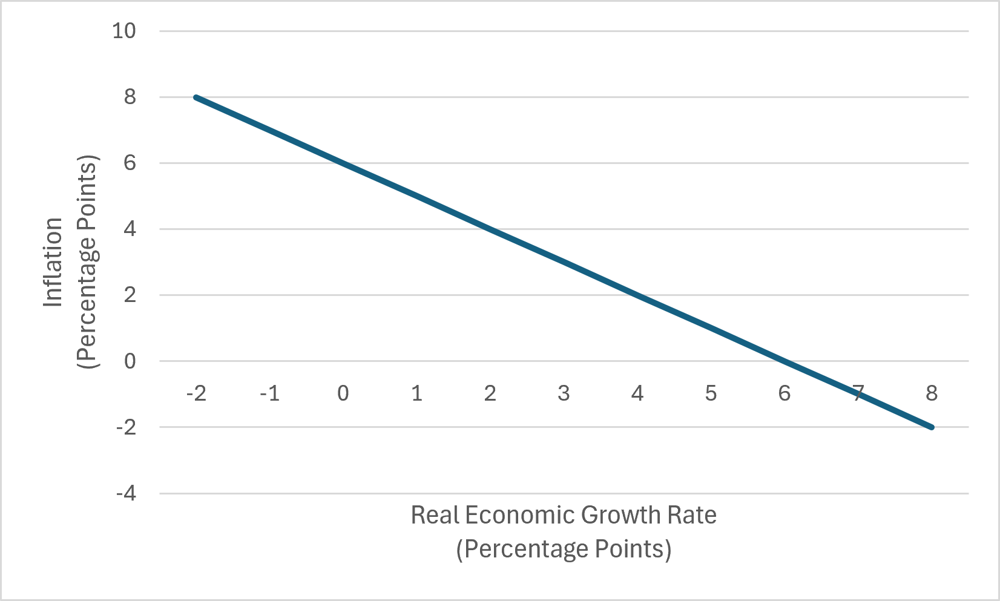
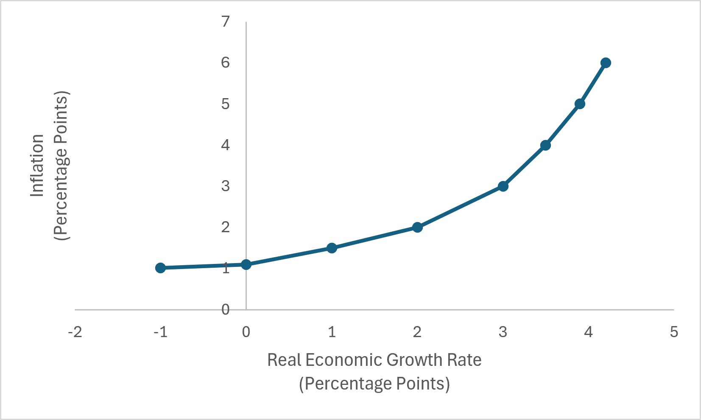
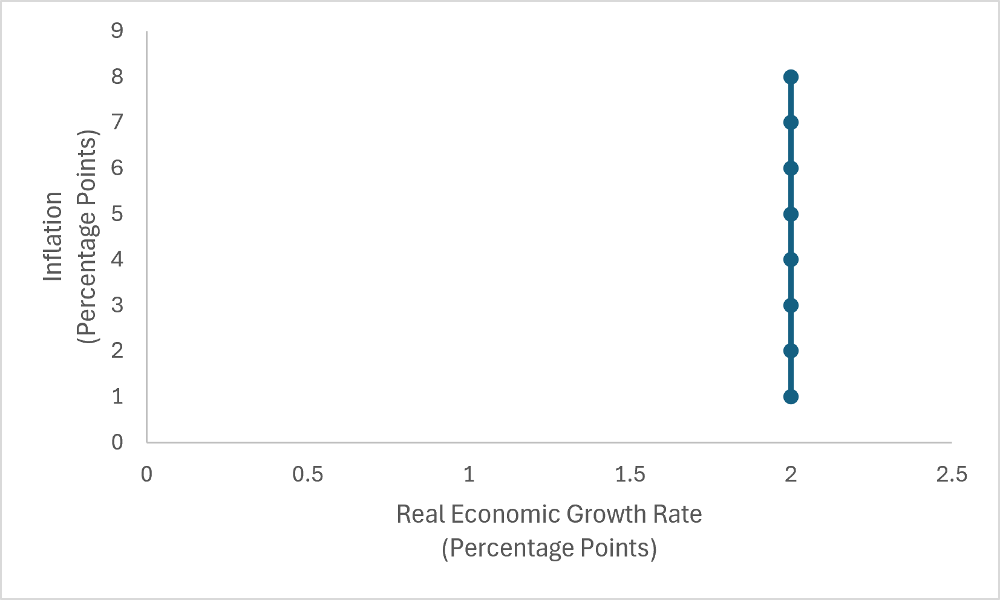

# Chapter 7: The Economy in the Short-Run {#the-economy-in-the-short-run}

> In one sense, we are all Keynesians now; in another, nobody is any longer a Keynesian.\
> — Milton Friedman

## 7.1 From Individual Markets to the Macroeconomy {#sec:ad_as_introduction}

In microeconomics, supply and demand help us understand the price and quantity of a particular good or service. We can use supply and demand to analyze the market for gasoline, coffee, automobiles, housing, or nearly any other individual product.

Macroeconomics asks a different set of questions. Instead of asking:

> *What determines the price and quantity of gasoline?*

we might ask:

> *What determines the total amount of goods and services produced throughout the economy?*

Instead of studying the price of one product, we study the **overall price level**. Instead of studying the quantity of one product, we study **real GDP**. Economists use the **Aggregate Demand–Aggregate Supply Model**, usually abbreviated the **AD–AS Model**, to organize these relationships.

::: definitionbox
**Definition**

The **Aggregate Demand–Aggregate Supply (AD–AS) Model** is a macroeconomic model used to explain the relationship between the economy’s overall price level and its production of real goods and services.

The model contains three primary components:

- Aggregate Demand ($AD$),

- Short-Run Aggregate Supply ($SRAS$),

- Long-Run Aggregate Supply ($LRAS$).
:::

The AD-AS Model will allow us to analyze short-run and long-run macroeconomic equilibrium.

Before introducing them individually, however, we must understand exactly what the axes of the AD–AS model measure.

### 7.1.1 The Horizontal Axis: Growth in Real GDP

The horizontal axis of the AD–AS model measures **growth in real GDP**, represented by $\% \Delta Y$.

Recall from Chapter 4 that real GDP measures the value of final goods and services produced within an economy after adjusting for changes in the price level. Thus: $$Y=Real\ GDP$$ and $$\% \Delta Y= \% \Delta Real\ GDP.$$

When we move to the right along the horizontal axis, the economy is producing more real goods and services at a faster rate. When we move to the left, the economy is producing more real goods and services at a lower rate, or the economy is producing fewer real goods and services when the growth rate is negative.

::: definitionbox
**Definition**

In the AD–AS model, the horizontal axis measures: $$\% \Delta Y= \% \Delta Real\ GDP.$$

Real GDP represents the economy’s total real production of final goods and services.
:::

This is fundamentally different from the horizontal axis of an ordinary supply-and-demand graph. In a market for pizza, the horizontal axis might measure the number of pizzas produced. In the AD–AS model, the horizontal axis represents the combined real output of the entire economy. It includes the production of:

- food,

- automobiles,

- housing services,

- medical care,

- computers,

- education,

- transportation,

- entertainment,

- and millions of other final goods and services.

The AD–AS model therefore does not measure a physical quantity such as “10 million units.” Instead, it uses real GDP to combine many different types of production into a single measure of growth.

### 7.1.2 The Vertical Axis: The Price Level

The vertical axis measures the economy’s change **overall price level** or **inflation**, represented by $\% \Delta P$. Thus: $$P=Price\ Level.$$ and $$\%\Delta P\ = \ Inflation.$$

The inflation rate summarizes the average change in the level of prices across the economy. It can be measured using a price index such as the Consumer Price Index or GDP Deflator introduced in Chapter 5.

::: definitionbox
**Definition**

In the AD–AS model, the vertical axis measures: $$\%\Delta P\ = \ Inflation.$$

The inflation rate summarizes the average change in the level of prices across the economy rather than measuring the change in the price of one particular good or service.
:::

### 7.1.3 AD–AS Is Not Ordinary Supply and Demand

The AD–AS model may look similar to a traditional supply-and-demand graph, but the two models answer different questions.

Consider the comparison:

::: center
                    Supply and Demand                AD–AS
  ----------------- -------------------------------- ----------------------------------
  Market            One particular good or service   Entire economy
  Horizontal Axis   Quantity of a particular good    Growth in Real GDP
  Vertical Axis     Price of a particular good       Inflation
  Demand            Demand for one product           Aggregate demand for real output
  Supply            Supply of one product            Aggregate supply of real output
:::

Students should therefore resist the temptation to interpret AD and AS exactly like ordinary demand and supply curves. They look similar, but the economic reasoning behind them is different.

::: misconception
**Common Misconception**

A common misconception is that aggregate demand is simply the demand curve from microeconomics applied to a larger market.

It is not.

An ordinary demand curve describes the relationship between the price of one product and the quantity demanded of that product, holding other prices constant.

Aggregate demand describes the relationship between the *overall price level* and the total quantity of real goods and services demanded throughout the economy.

Similarly, aggregate supply describes economy-wide production rather than the supply of one particular product.
:::

### 7.1.4 The Three Curves

The complete AD–AS model contains three curves.

#### Aggregate Demand {#aggregate-demand .unnumbered}

The **Aggregate Demand** curve represents the total quantity of domestically produced final goods and services that households, businesses, governments, and foreign buyers wish to purchase at different price levels. We represent aggregate demand as: $$AD.$$ The aggregate demand curve slopes downward. We will explain why in Section 9.2.

#### Short-Run Aggregate Supply {#short-run-aggregate-supply .unnumbered}

The **Short-Run Aggregate Supply** curve represents the quantity of real output firms are willing to produce at different price levels when some production costs, particularly wages, have not yet fully adjusted. We represent short-run aggregate supply as: $$SRAS.$$ The SRAS curve slopes upward. We will explain why in Section 9.3.

#### Long-Run Aggregate Supply {#long-run-aggregate-supply .unnumbered}

The **Long-Run Aggregate Supply** curve represents the economy’s productive capacity when wages and other input prices have fully adjusted. We represent long-run aggregate supply as: $$LRAS.$$ The LRAS curve is vertical at the economy’s potential level of output. We will develop this idea in Section 9.4 and connect it directly to the Solow Model from Chapter 7.

::: modelbox
**Key Economic Model**

The AD–AS Model contains three relationships:

$$AD$$

represents economy-wide demand.

$$SRAS$$

represents economy-wide production in the short run.

$$LRAS$$

represents the economy’s long-run productive capacity.

Together, these curves determine the economy’s price level and real GDP in the short run and long run.
:::

### 7.1.5 Short Run Versus Long Run

One of the most important features of the AD–AS model is the distinction between the **short run** and the **long run**. In everyday conversation, these phrases refer to particular amounts of time. A few months might seem like the short run, while several years might seem like the long run.

Economists use the terms somewhat differently. The distinction depends on whether prices and production costs have had time to adjust. In the **short run**, some input prices—particularly wages—may adjust slowly. In the **long run**, wages and other production costs have had sufficient time to adjust to economic conditions.

::: definitionbox
**Definition**

In the AD–AS model:

- The **short run** is a period during which some input prices, particularly wages, have not fully adjusted to economic conditions.

- The **long run** is a period in which wages and other input prices have had sufficient time to adjust.

The distinction is based on economic adjustment rather than a fixed number of months or years.
:::

This distinction will explain why the economy can temporarily produce more or less than its long-run productive capacity.

### 7.1.6 Potential Growth

The long-run growth capacity of the economy is called **the Solow Rate** or the **potential growth rate**. We represent the Solow Rate as: $$\% \Delta Y^*.$$ The Solow Rate is the amount the economy grows when labor and capital are being used at normal long-run levels.

::: definitionbox
**Definition**

**The Solow Rate** ($\% \Delta Y^*$) the amount the economy grows when labor and capital are being used at normal long-run levels.
:::

The Solow Rate does not mean the absolute maximum amount an economy could physically grow. Factories could operate around the clock. Workers could work extremely long hours. Machines could be used without sufficient maintenance. Such production might temporarily increase real growth, but it would not be sustainable. The Solow Rate instead represents the economy’s normal growth capacity.

Chapter 7 helps us understand what determines it. Recall the production function: $$Y=AF(K,L).$$ The economy’s productive capacity depends on:

- physical capital $K$,

- labor $L$,

- productivity $A$.

Chapter 8 then explained how institutions can influence productivity. These ideas now become part of the AD–AS model.

::: modelbox
**Key Economic Model**

The Solow Rate is determined by the economy’s productive capacity: $$Y^*=AF(K,L)$$ and $$\% \Delta Y^*= \% \Delta AF(K,L)$$ Therefore, long-run economic growth occurs when the economy increases: $$K,\quad L,\quad \text{or}\quad A.$$ These changes increase potential output and shift the economy’s long-run productive capacity.
:::

### 7.1.7 What the AD–AS Model Will Allow Us to Explain

Once the three curves are combined, the AD–AS model will allow us to distinguish among several important economic situations.

The economy may grow at exactly its potential output:

$$\% \Delta Y=\% \Delta Y^*.$$ It may temporarily grow less than potential: $$\% \Delta Y< \% \Delta Y^*.$$ Or it may temporarily grow more than potential: $$\% \Delta Y>\% \Delta Y^*.$$ These situations will eventually allow us to understand:

- recessions,

- economic expansions,

- changes in the price level,

- short-run fluctuations in real GDP,

- the economy’s return toward long-run equilibrium.

For now, however, our goal is simply to understand the structure of the model. We will introduce each curve individually before combining them.

::: realworld
**Economics in the Real World**

Economic news frequently reports that the economy is “running below capacity,” “overheating,” or “returning to potential.”

These statements refer to the relationship between actual real GDP and the economy’s long-run productive capacity.

If actual production is substantially below potential output, factories, workers, and other resources may be underutilized.

If production temporarily rises above its sustainable level, businesses may have difficulty finding workers and productive resources, creating pressure on wages and other production costs.

The AD–AS model gives economists a common framework for organizing these economy-wide conditions.
:::

::: misconception
**Common Misconception**

A common misconception is that potential output means the maximum amount an economy could possibly produce.

Potential output instead represents the level of production that can be *sustained* under normal economic conditions.

An economy can temporarily produce above potential by using workers and capital unusually intensively. However, such production creates pressures that eventually cause the economy to adjust.

Another common mistake is to interpret the vertical axis of the AD–AS model as the inflation rate. The vertical axis measures the *price level*. Inflation is the percentage change in that price level over time.
:::

::: thinkingeconomist
**Thinking Like an Economist**

Consider the following economic changes:

1.  The price of gasoline rises by 30%.

2.  The overall price level rises by 5%.

3.  Real GDP increases from \$20 trillion to \$21 trillion.

4.  A technological improvement increases the economy’s productive capacity.

For each change, answer:

a.  Does it directly affect the horizontal axis, vertical axis, or neither axis of an AD–AS graph?

b.  Is the change describing one market or the entire economy?

c.  Which concepts from Chapters 3, 4, 5, or 6 help you interpret the change?

Answer the questions yourself before discussing them with classmates or using a generative AI tool.
:::

::: researchbox
**From the Research**

In the United States, the economic growth rate has averaged just over 3% per year since the end of World War II. A simple assumption then is to set $g^*$ at 3% per year.
:::

::: keytakeaways
**Key Takeaways**

- The AD–AS model describes the relationship between the economy’s overall price level and real GDP.

- The horizontal axis measures real GDP ($Y$).

- The vertical axis measures the overall price level ($P$).

- AD–AS is not simply an ordinary supply-and-demand graph applied to a larger market.

- Aggregate Demand ($AD$) represents economy-wide demand for real output.

- Short-Run Aggregate Supply ($SRAS$) represents economy-wide production when some input prices have not fully adjusted.

- Long-Run Aggregate Supply ($LRAS$) represents the economy’s long-run productive capacity.

- Potential output ($Y^*$) is the sustainable level of real GDP determined by capital, labor, and productivity.

- The short-run and long-run distinction depends on whether wages and other input prices have adjusted, not on a fixed amount of calendar time.

- The AD–AS model will allow us to analyze short-run and long-run macroeconomic equilibrium before applying the model to monetary and fiscal policy in later chapters.
:::

::: ailab
**AI Economics Lab**

Use a generative AI tool as your virtual teaching assistant to become comfortable with the structure of the AD–AS model. Develop your own answer before asking the AI for assistance.

1.  **Compare:** Ask the AI to compare an ordinary supply-and-demand graph with an AD–AS graph. Check whether it correctly distinguishes the variables on both axes.

2.  **Classify:** Ask the AI to generate ten economic changes. Determine whether each describes the price of an individual good, the overall price level, the quantity of an individual good, or real GDP before checking the AI’s classification.

3.  **Evaluate:** Ask the AI to explain the difference between the short run and long run in the AD–AS model. Critique the response. Did it incorrectly define the distinction using a specific number of months or years?

4.  **Connect:** Ask the AI to explain how $$Y=AF(K,L)$$ from Chapter 7 relates to potential output $Y^*$ in the AD–AS model.

5.  **Challenge:** Ask the AI whether an economy can temporarily produce more than potential output. Evaluate whether it correctly distinguishes sustainable productive capacity from the absolute physical maximum an economy could produce.

6.  **Reflect:** Explain in your own words why economists need a model like AD–AS in addition to the ordinary supply-and-demand model used in microeconomics.
:::

## 7.2 Aggregate Demand {#sec:aggregate_demand}

In the previous section, we introduced the Aggregate Demand–Aggregate Supply Model. We now introduce the first curve in the model: **Aggregate Demand**.

Aggregate demand describes the relationship between inflation and the growth of real spending on domestically produced final goods and services.

::: definitionbox
**Definition**

**Aggregate Demand ($AD$)** represents the relationship between the inflation rate and the growth rate of real GDP demanded by households, businesses, governments, and foreign buyers.

In the growth-rate AD–AS model:

- the horizontal axis measures real GDP growth, $\%\Delta Y$,

- the vertical axis measures inflation, $\%\Delta P$.
:::

The aggregate demand curve slopes downward. This means that, holding other relevant factors constant: $$Inflation\uparrow
\quad\Longrightarrow\quad
Real\ GDP\ Growth\downarrow.$$ Likewise: $$Inflation\downarrow
\quad\Longrightarrow\quad
Real\ GDP\ Growth\uparrow.$$ To understand why this relationship exists, we can return to an equation introduced in Chapter 5.

### 7.2.1 Returning to the Quantity Theory of Money

Recall the growth-rate form of the Equation of Exchange: $$\%\Delta M+\%\Delta V
=
\%\Delta P+\%\Delta Y.$$ where:

- $\%\Delta M$ = growth rate of the money supply,

- $\%\Delta V$ = growth rate of the velocity of money,

- $\%\Delta P$ = inflation rate,

- $\%\Delta Y$ = growth rate of real GDP.

The left-hand side represents the growth of nominal spending: $$\%\Delta M+\%\Delta V.$$ The right-hand side divides that spending growth between:

- growth in prices,

- growth in real production.

Suppose, for the moment, that money growth and velocity growth are fixed. Then total nominal spending growth is fixed. If more of that spending growth appears as inflation, less can appear as real GDP growth.

This gives us the downward-sloping aggregate demand curve: $$\%\Delta P = \%\Delta M+\%\Delta V - \%\Delta Y.$$

::: modelbox
**Key Economic Model**

The growth-rate Aggregate Demand curve follows from:

$$\%\Delta M+\%\Delta V
=
\%\Delta P+\%\Delta Y,$$ which results in: $$\%\Delta P = \%\Delta M+\%\Delta V - \%\Delta Y.$$

Holding nominal spending growth constant: $$\%\Delta P\uparrow
\quad\Longrightarrow\quad
\%\Delta Y\downarrow.$$

Higher inflation is associated with lower real GDP growth along a given Aggregate Demand curve. This creates the downward slope of $AD$.
:::

Figure [7.1](#fig:ADCurve){reference-type="ref" reference="fig:ADCurve"} shows the aggregate demand curve. Notice that as the inflation rate decreases on the Y-axis that the growth rate of the economy increases, as shown by the X-axis. At an economic growth rate of 0%, the inflation rate is 6%. Therefore, the level of spending growth in the economy is 6%.

::: {#fig:ADCurve .source-figure source-number="7.1"}

**Figure 7.1.** The Aggregate Demand Curve
:::

::: {.aifiguredescription figure-id="fig:ADCurve"}
**Figure description: `fig:ADCurve`**

The horizontal axis is **Real Economic Growth Rate (Percentage Points)**, with labeled ticks from −2 to 8. The vertical axis is **Inflation (Percentage Points)**, with labeled ticks from −4 to 10. A single straight dark-blue line slopes downward from approximately (−2, 8) to (8, −2). It crosses the vertical axis at inflation 6 and the horizontal axis at real growth 6. The caption identifies it as the Aggregate Demand curve; no separate AD text label, arrow, or shaded area is printed on the line.

In this chapter's **growth-rate** AD–AS model, the example holds nominal spending growth at 6%, so the displayed combinations satisfy inflation plus real GDP growth equal to 6%. For example, real growth 2% pairs with inflation 4%, and real growth 4% pairs with inflation 2%. Movement along the same curve changes that allocation while keeping total spending growth fixed.

The graph is not the conventional price-level/real-output-level AD diagram, and it does not plot demand for one good. Do not substitute a price level for inflation or an output level for growth. No supply curve or equilibrium intersection is shown. A change in nominal spending growth would require a different AD curve, but a shifted curve is not drawn here. The line is a constructed model illustration, not an estimated relationship from time-series data.
:::

### 7.2.2 A Numerical Example

Suppose the money supply grows by 6% and velocity does not change. Then: $$\%\Delta M=6\%$$ and: $$\%\Delta V=0\%.$$ The Equation of Exchange becomes: $$6\%=\%\Delta P+\%\Delta Y.$$

Now consider several possible combinations of inflation and real GDP growth.

::: center
   Nominal Spending Growth   Inflation   Real GDP Growth
  ------------------------- ----------- -----------------
             6%                 0%             6%
             6%                 1%             5%
             6%                 2%             4%
             6%                 3%             3%
             6%                 4%             2%
             6%                 5%             1%
             6%                 6%             0%
:::

Every row satisfies: $$6\%=Inflation+Real\ GDP\ Growth.$$

As inflation increases, real GDP growth decreases. These combinations trace out a downward-sloping Aggregate Demand curve.

::: examplebox
**Example**

Suppose nominal spending grows by 8%. If inflation is: $$3\%,$$ then real GDP growth is: $$8\%-3\%=5\%.$$ If inflation instead rises to: $$6\%,$$ while nominal spending growth remains 8%, real GDP growth must fall to: $$8\%-6\%=2\%.$$ The economy moves upward and to the left along its Aggregate Demand curve.
:::

### 7.2.3 What Determines Aggregate Spending?

The Quantity Theory of Money gives us one way to understand Aggregate Demand. The expenditure approach to GDP gives us another.

Recall from Chapter 4: $$Y=C+I+G+NX,$$ where:

- $C$ = consumption,

- $I$ = investment,

- $G$ = government purchases,

- $NX$ = net exports.

Aggregate Demand therefore reflects spending by four broad groups:

1.  households,

2.  businesses,

3.  governments,

4.  foreign buyers.

Changes in the growth of this spending can shift the Aggregate Demand curve.

For example, if households become more willing to spend, consumption growth may increase. If businesses become more optimistic about future profitability, investment growth may increase. If government purchases grow more rapidly, aggregate spending may increase. If foreign demand for domestic goods increases, net exports may increase. These changes affect Aggregate Demand because they alter the growth of total spending in the economy.

### 7.2.4 Movements Along Aggregate Demand

It is essential to distinguish between a **movement along** the Aggregate Demand curve and a **shift** of the curve. A movement along the AD curve occurs when the inflation rate changes while the underlying growth of nominal spending remains constant.

Suppose again: $$\%\Delta M+\%\Delta V=6\%.$$ If inflation rises from 2% to 4%, real GDP growth falls from: $$4\%$$ to: $$2\%.$$

The economy has moved along the same Aggregate Demand curve.

::: definitionbox
**Definition**

A **movement along the Aggregate Demand curve** occurs when inflation changes while the underlying growth rate of nominal spending remains unchanged.

Along a given AD curve: $$Inflation\uparrow
\Rightarrow
Real\ GDP\ Growth\downarrow.$$ $$Inflation\downarrow
\Rightarrow
Real\ GDP\ Growth\uparrow.$$
:::

### 7.2.5 Shifts in Aggregate Demand

The Aggregate Demand curve shifts when the growth rate of nominal spending changes. Return to: $$\%\Delta M+\%\Delta V
=
\%\Delta P+\%\Delta Y.$$ Suppose nominal spending initially grows at: $$6\%.$$ At an inflation rate of 2%, real GDP growth is: $$4\%.$$ Now suppose nominal spending growth increases to: $$9\%.$$ At the same 2% inflation rate, real GDP growth can now equal: $$7\%.$$ The Aggregate Demand curve has shifted to the right.

::: modelbox
**Key Economic Model**

An increase in nominal spending growth shifts Aggregate Demand to the right: $$Nominal\ Spending\ Growth\uparrow$$ $$AD\rightarrow.$$ A decrease in nominal spending growth shifts Aggregate Demand to the left: $$Nominal\ Spending\ Growth\downarrow$$ $$AD\leftarrow.$$
:::

The distinction is important. A change in inflation produces a movement *along* AD. A change in the underlying growth of aggregate spending shifts the entire AD curve.

### 7.2.6 What Can Shift Aggregate Demand?

Several economic changes can alter the growth of aggregate spending. These include changes in:

- money growth,

- velocity,

- household consumption,

- business investment,

- government purchases,

- net exports.

For now, we will simply identify these as potential sources of Aggregate Demand shifts. We will postpone detailed analysis of two especially important causes. In Chapter 10, we will examine how **monetary policy** affects Aggregate Demand. In Chapter 11, we will examine how **fiscal policy** affects Aggregate Demand. For Chapter 9, our goal is simply to understand what an Aggregate Demand shift means.

### 7.2.7 An Increase in Aggregate Demand

Suppose households, businesses, governments, and foreign buyers collectively increase the growth of their spending.

Aggregate Demand shifts to the right: $$AD_1\rightarrow AD_2.$$ At any given inflation rate, the growth rate of real GDP demanded is now higher. For example: $$AD_1:
\quad
6\%=Inflation+Real\ GDP\ Growth.$$ At 2% inflation: $$Real\ GDP\ Growth=4\%.$$ Now suppose spending growth rises to 9%: $$AD_2:
\quad
9\%=Inflation+Real\ GDP\ Growth.$$ At the same 2% inflation rate: $$Real\ GDP\ Growth=7\%.$$ This is a rightward shift of Aggregate Demand.

### 7.2.8 A Decrease in Aggregate Demand

The opposite occurs when nominal spending growth decreases. Suppose nominal spending growth falls from: $$6\%$$ to: $$3\%.$$ At 2% inflation, real GDP growth falls from: $$4\%$$ to: $$1\%.$$ The Aggregate Demand curve shifts to the left: $$AD_1\leftarrow AD_2.$$ At every inflation rate, the growth rate of real GDP demanded is now lower.

### 7.2.9 Aggregate Demand Is About Growth

Because we are using the growth-rate AD–AS model, it is important to interpret Aggregate Demand correctly. A rightward shift of AD does not simply mean that households are purchasing “more stuff” in an absolute sense. It means that **aggregate nominal spending is growing more rapidly**. Likewise, a leftward shift does not necessarily mean total spending is falling. It may simply mean that spending is growing more slowly. For example:

- Spending growth falling from 8% to 4% shifts AD left.

- Spending growth increasing from 4% to 8% shifts AD right.

In both cases, total spending may still be increasing. The difference is the growth rate. This distinction will become extremely important when we analyze monetary and fiscal policy.

::: realworld
**Economics in the Real World**

Households and businesses constantly change their spending plans.

During periods of optimism, households may increase consumption while businesses expand investment. During periods of uncertainty, households may increase saving and businesses may postpone investment projects.

These decisions can change the growth of aggregate spending.

Economists therefore monitor indicators such as consumer spending, business investment, government purchases, exports, imports, money growth, and financial conditions when evaluating Aggregate Demand.

The AD curve provides a way to summarize how these many spending decisions relate to inflation and real GDP growth.
:::

::: misconception
**Common Misconception**

A common misconception is that a rightward shift in Aggregate Demand means that the economy must immediately experience higher inflation.

A shift in AD changes the combinations of inflation and real GDP growth consistent with aggregate spending.

The actual effect on inflation and real GDP growth depends on Aggregate Supply.

We therefore cannot determine the final macroeconomic outcome from Aggregate Demand alone.

Another common mistake is confusing a movement along AD with a shift of AD.

A change in inflation causes movement along a given Aggregate Demand curve.

A change in the growth of nominal spending shifts the Aggregate Demand curve.
:::

::: thinkingeconomist
**Thinking Like an Economist**

Suppose nominal spending growth is initially 7%.

1.  If inflation is 2%, what real GDP growth rate is consistent with the Aggregate Demand relationship?

2.  If inflation rises to 4% while nominal spending growth remains 7%, what happens to real GDP growth?

3.  Is this a movement along AD or a shift of AD?

4.  Now suppose nominal spending growth increases from 7% to 10%. At 4% inflation, what real GDP growth rate is now consistent with AD?

5.  Is this a movement or a shift?

6.  Why can we not determine the economy’s actual inflation and real GDP growth rates until we introduce Aggregate Supply?

Solve the problem before discussing it with classmates or using a generative AI tool.
:::

::: keytakeaways
**Key Takeaways**

- In the growth-rate AD–AS model, the horizontal axis measures real GDP growth and the vertical axis measures inflation.

- Aggregate Demand describes the relationship between inflation and real GDP growth demanded throughout the economy.

- The Aggregate Demand curve slopes downward.

- The downward slope can be understood using: $$\%\Delta M+\%\Delta V
      =
      \%\Delta P+\%\Delta Y.$$

- Holding nominal spending growth constant, higher inflation corresponds to lower real GDP growth.

- Aggregate spending can also be understood through: $$Y=C+I+G+NX.$$

- A change in inflation causes movement along a given AD curve.

- A change in nominal spending growth shifts the AD curve.

- Faster nominal spending growth shifts AD to the right.

- Slower nominal spending growth shifts AD to the left.

- The final effects of an AD shift on inflation and real GDP growth cannot be determined until Aggregate Supply is introduced.
:::

::: ailab
**AI Economics Lab**

Use a generative AI tool as your virtual teaching assistant to strengthen your understanding of Aggregate Demand. Solve and explain each problem yourself before asking the AI for assistance.

1.  **Explore:** Ask the AI to generate five combinations of inflation and real GDP growth consistent with nominal spending growth of 8%. Verify every combination using the Equation of Exchange.

2.  **Reason:** Ask the AI to explain why the growth-rate Aggregate Demand curve slopes downward using: $$\%\Delta M+\%\Delta V
        =
        \%\Delta P+\%\Delta Y.$$ Critique whether the explanation correctly holds nominal spending growth constant.

3.  **Classify:** Ask the AI to generate ten Aggregate Demand scenarios. Determine whether each produces movement along AD, a rightward shift, or a leftward shift before checking the AI’s answers.

4.  **Connect:** Ask the AI to explain how: $$C+I+G+NX$$ relates to Aggregate Demand. Identify which component of spending changes in each example it provides.

5.  **Challenge:** Ask the AI whether a rightward shift of AD necessarily produces higher inflation. Evaluate the answer. A strong response should explain why Aggregate Supply must be considered before determining the equilibrium outcome.

6.  **Reflect:** Explain in your own words the difference between moving along an Aggregate Demand curve and shifting the entire curve.
:::

## 7.3 Short-Run Aggregate Supply {#sec:short_run_aggregate_supply}

In Section [7.2](#sec:aggregate_demand){reference-type="ref" reference="sec:aggregate_demand"}, we introduced Aggregate Demand and explained the combinations of inflation and real GDP growth consistent with different rates of nominal spending growth. Aggregate Demand, however, tells us only how much real output buyers wish to purchase.

To determine what actually happens to inflation and real GDP growth, we must also understand the production side of the economy. We begin with **Short-Run Aggregate Supply**, or $SRAS$.

Short-Run Aggregate Supply describes the relationship between inflation and real GDP growth when some production costs—especially wages—have not yet fully adjusted to changing economic conditions.

::: definitionbox
**Definition**

**Short-Run Aggregate Supply ($SRAS$)** describes the relationship between the inflation rate and the growth rate of real GDP that firms are willing to produce in the short run.

In the growth-rate AD–AS model:

- the horizontal axis measures real GDP growth, $\%\Delta Y$,

- the vertical axis measures inflation, $\%\Delta P$.

The Short-Run Aggregate Supply curve slopes upward.
:::

An upward-sloping SRAS curve means: $$Inflation\uparrow
\quad\Longrightarrow\quad
Real\ GDP\ Growth\uparrow$$ along a given SRAS curve. Likewise: $$Inflation\downarrow
\quad\Longrightarrow\quad
Real\ GDP\ Growth\downarrow.$$ The key to understanding this relationship is recognizing that output prices can sometimes change more rapidly than the costs firms pay to produce their goods and services.

### 7.3.1 Why Short-Run Aggregate Supply Slopes Upward

Consider a business that sells its output for a price $P$. The business must also pay production costs, including:

- wages,

- rent,

- raw materials,

- energy,

- interest expenses,

- other input costs.

Suppose the prices businesses receive for their products begin rising more rapidly. If wages and other input costs immediately rise at exactly the same rate, the firm’s profitability does not necessarily change. But in the short run, some production costs adjust slowly.

Wages are particularly important. Workers and firms frequently establish wages through contracts, annual salary agreements, or other arrangements that remain in place for some period of time. If output prices rise more rapidly than wages, firms temporarily receive higher prices relative to their labor costs. Production becomes more profitable. Firms therefore have incentives to:

- increase production,

- increase worker hours,

- hire additional workers,

- use existing capital more intensively.

Real GDP growth increases.

Figure [7.2](#fig:SRAS){reference-type="ref" reference="fig:SRAS"} displays the Short-Run Aggregate Supply curve. The curve is positively sloped for all of the stated reasons above. However, in addition to the positive slope, the slope gets progressively steeper as inflation increases. This means that inflation alone cannot drive unlimited amounts of economic growth, even in the short-run. Moreover, when inflation expectations are too high, firms may quickly adjust production schedules and the economic growth rate may be substantially decreased. This phenomenon is the reason why some economists worry that disinflation may impose costs on the economy, although evidence on this phenomenon is mixed.

::: {#fig:SRAS .source-figure latex-placement="h!" source-number="7.2"}

**Figure 7.2.** The Short-Run Aggregate Supply Curve
:::

::: {.aifiguredescription figure-id="fig:SRAS"}
**Figure description: `fig:SRAS`**

The horizontal axis is **Real Economic Growth Rate (Percentage Points)**, with ticks from −2 to 5. The vertical axis is **Inflation (Percentage Points)**, with ticks from 0 to 7. A dark-blue curve with circular markers slopes upward and becomes progressively steeper. Approximate plotted pairs (real growth, inflation) are (−1, 1), (0, 1.1), (1, 1.5), (2, 2), (3, 3), (3.5, 4), (3.9, 5), and (4.2, 6). The latter horizontal coordinates are approximate visual readings, not source data. No fitted formula, shifted curve, arrows, or shaded regions are supplied.

The caption identifies the curve as Short-Run Aggregate Supply. The surrounding prose explains its upward slope using temporarily sticky wages and other production costs: higher inflation can temporarily increase production profitability and real growth. Its increasing steepness illustrates that inflation alone cannot produce unlimited growth even in the short run.

This is the chapter's inflation/real-growth-rate model, not a price-level/output-level supply diagram. The figure shows movement along a given short-run curve, not a separately drawn change in expectations or a supply shock. It contains no AD intersection and therefore does not by itself determine an equilibrium. Do not infer a permanent long-run growth effect, an exact empirical response, or an algebraic SRAS equation from the shape.
:::

::: modelbox
**Key Economic Model**

The upward slope of Short-Run Aggregate Supply follows from temporarily sticky production costs. If inflation rises faster than wages and other input costs: $$Inflation\uparrow$$ $$Real\ Production\ Becomes\ More\ Profitable$$ $$Real\ GDP\ Growth\uparrow.$$ This creates the upward-sloping $SRAS$ curve.
:::

### 7.3.2 Sticky Wages

A price is described as **sticky** when it adjusts slowly to changing economic conditions. Wages are one of the most important sticky prices in the economy.

::: definitionbox
**Definition**

**Sticky wages** are wages that adjust slowly to changes in economic conditions. Wages may be sticky because of:

- employment contracts,

- annual salary negotiations,

- collective bargaining agreements,

- workplace norms,

- the costs of repeatedly renegotiating compensation.
:::

Suppose workers agree at the beginning of the year to wage growth of 3%. Now suppose inflation unexpectedly rises to 6%. Firms’ selling prices may increase faster than their wage costs. For some firms, production becomes temporarily more profitable. They respond by expanding production. The important word is *temporarily*. Workers will eventually recognize that prices are rising faster than their wages. When contracts are renegotiated, workers will seek higher wages to restore their purchasing power. The firm’s costs then begin catching up with the higher price level. This is one reason the relationship represented by SRAS is a *short-run* relationship.

### 7.3.3 Expected Inflation

Workers and businesses do not negotiate wages without thinking about future prices. Their expectations about inflation therefore matter.

Suppose workers expect inflation to be: $$2\%.$$ They may negotiate wage increases consistent with approximately 2% inflation. If actual inflation unexpectedly rises to: $$5\%,$$ firms may initially experience faster growth in selling prices than in wages. Production becomes more profitable, and firms increase output growth. But suppose workers had expected 5% inflation from the beginning. They would likely have negotiated higher wages before production decisions were made. The same 5% inflation rate would then provide much less reason for firms to expand real production. This means that Short-Run Aggregate Supply depends not only on actual inflation but also on **expected inflation**.

::: definitionbox
**Definition**

**Expected inflation** is the inflation rate households, workers, and businesses anticipate when making economic decisions.

Differences between actual and expected inflation can temporarily affect firms’ production incentives.
:::

A useful way to think about SRAS is:

> *Unexpected changes in inflation can temporarily change real economic growth because some production costs were established using earlier expectations.*

### 7.3.4 A Numerical Example

Suppose workers and businesses expect inflation of 2%. Wage contracts are established accordingly. Now consider several possible actual inflation rates.

::: center
   Expected Inflation   Actual Inflation             Short-Run Effect
  -------------------- ------------------ ---------------------------------------
           2%                  0%            Production incentives weaken more
           2%                  1%              Production incentives weaken
           2%                  2%                  Expectations are met
           2%                  3%            Production incentives strengthen
           2%                  5%          Production incentives strengthen more
:::

When actual inflation exceeds expected inflation, firms may temporarily experience higher output prices relative to predetermined costs. Real GDP growth increases. When actual inflation falls below expectations, firms may experience weaker selling-price growth relative to previously negotiated costs. Real GDP growth decreases. These relationships help produce the upward-sloping SRAS curve.

### 7.3.5 Movements Along Short-Run Aggregate Supply

As with Aggregate Demand, we must distinguish between movement along a curve and a shift of the entire curve. A **movement along SRAS** occurs when actual inflation changes while the underlying determinants of Short-Run Aggregate Supply remain unchanged. For example, suppose expected inflation remains 2%. If actual inflation rises from: $$2\%$$ to: $$4\%,$$ firms may increase real production growth. The economy moves upward and to the right along the existing SRAS curve.

::: definitionbox
**Definition**

A **movement along the Short-Run Aggregate Supply curve** occurs when actual inflation changes while expected inflation, input-market conditions, and other determinants of SRAS remain unchanged. Along a given SRAS curve: $$Inflation\uparrow
\Rightarrow
Real\ GDP\ Growth\uparrow.$$
:::

### 7.3.6 Shifts in Short-Run Aggregate Supply

The entire SRAS curve shifts when firms’ production costs or inflation expectations change independently of current inflation. Several factors can shift SRAS:

- expected inflation,

- wage growth,

- energy prices,

- raw-material costs,

- taxes or regulations affecting production costs,

- temporary changes in productivity,

- supply disruptions.

A favorable change in production conditions shifts SRAS to the right. An unfavorable change shifts SRAS to the left.

::: modelbox
**Key Economic Model**

When production becomes less costly or more productive: $$SRAS\rightarrow.$$ At a given inflation rate, real GDP can grow more rapidly. When production becomes more costly or less productive: $$SRAS\leftarrow.$$ At a given inflation rate, real GDP growth is lower.
:::

### 7.3.7 Expected Inflation and SRAS

Expected inflation is particularly important because it affects wage negotiations and other contracts.

Suppose expected inflation increases. Workers anticipate that prices will rise more rapidly and negotiate faster wage growth. Businesses may also negotiate contracts with suppliers that incorporate higher expected costs. At any given actual inflation rate, firms now face faster-growing production costs. SRAS shifts to the left. Thus: $$Expected\ Inflation\uparrow$$ causes: $$SRAS\leftarrow.$$ The opposite occurs if expected inflation falls: $$Expected\ Inflation\downarrow$$ causes: $$SRAS\rightarrow.$$ This relationship will become important when we examine how the economy returns to long-run equilibrium.

### 7.3.8 Supply Shocks

Short-Run Aggregate Supply can also shift because of a **supply shock**.

::: definitionbox
**Definition**

A **supply shock** is an unexpected event that significantly changes firms’ production costs or productive capacity in the short run.
:::

Examples include:

- a sudden increase in oil prices,

- a major natural disaster,

- a disruption to important supply chains,

- a sudden shortage of an important input,

- an unusually favorable harvest.

Suppose oil prices suddenly increase. Energy and transportation costs rise for many businesses. At any given inflation rate, production becomes less profitable. SRAS shifts left: $$SRAS\leftarrow.$$

A favorable supply shock produces the opposite effect. If energy prices fall sharply or a temporary productivity improvement lowers production costs: $$SRAS\rightarrow.$$

### 7.3.9 Supply Shocks and Inflation

The discussion of supply shocks connects directly to Chapter 5.

Suppose an oil shock shifts SRAS to the left. When we eventually combine SRAS with Aggregate Demand, the economy may temporarily experience:

- higher inflation,

- lower real GDP growth.

This does not contradict the Quantity Theory of Money.

Chapter 5 distinguished between temporary movements in inflation caused by changes in relative prices and persistent monetary inflation. A supply shock can temporarily increase the measured inflation rate. But a one-time supply disruption cannot generate permanently accelerating inflation unless aggregate spending conditions also allow the higher rate of price growth to continue. This distinction will remain important throughout our analysis of AD–AS.

### 7.3.10 Short-Run Growth Can Differ from Long-Run Growth

The SRAS curve allows real GDP growth to temporarily differ from the economy’s sustainable long-run growth rate. For example, firms may temporarily:

- add overtime shifts,

- operate factories for longer hours,

- postpone maintenance,

- hire workers unusually rapidly.

These actions can increase real GDP growth in the short run.

But they do not necessarily increase the economy’s long-run productive capacity. That distinction will be the focus of Section 9.4. Long-run economic growth depends on the factors studied in Chapters 7 and 8: $$K,\quad L,\quad A.$$ Short-run production can fluctuate around that long-run growth path because prices, wages, expectations, and production costs do not adjust instantaneously.

::: realworld
**Economics in the Real World**

Suppose inflation unexpectedly increases while many workers are operating under annual wage contracts.

Businesses may initially receive higher prices for their products while their wage costs remain largely unchanged. Some firms respond by expanding production and hiring additional workers.

Eventually, workers recognize that their purchasing power has fallen and seek higher wages. Businesses then face higher costs, reducing the temporary profitability created by the unexpected inflation.

This adjustment process illustrates why inflation can affect real production in the short run even though sustained long-run growth ultimately depends on capital, labor, and productivity.
:::

::: misconception
**Common Misconception**

A common misconception is that higher inflation permanently causes faster economic growth.

The upward-sloping SRAS curve describes a short-run relationship. Unexpected inflation can temporarily increase production when selling prices rise faster than wages and other input costs.

But workers and businesses eventually adjust their expectations and contracts.

Long-run growth cannot be permanently increased simply by generating more inflation.

Another common mistake is to assume that every increase in production costs represents sustained inflation. Higher oil prices or other supply shocks can temporarily raise inflation while reducing real GDP growth, but persistent inflation requires a continuing explanation for sustained growth in the overall price level.
:::

::: thinkingeconomist
**Thinking Like an Economist**

Suppose workers and firms expect inflation of 2%.

Now consider the following situations:

1.  Actual inflation unexpectedly rises to 5%.

2.  Expected inflation rises from 2% to 5% before wage contracts are negotiated.

3.  A major oil disruption sharply increases transportation costs.

4.  A temporary technological improvement lowers production costs.

For each situation:

a.  Is this a movement along SRAS or a shift of SRAS?

b.  If SRAS shifts, does it shift left or right?

c.  What happens to firms’ production incentives?

d.  Is the change necessarily permanent?

Develop your answers before discussing them with classmates or using a generative AI tool.
:::

::: keytakeaways
**Key Takeaways**

- Short-Run Aggregate Supply describes the relationship between inflation and real GDP growth in the short run.

- The SRAS curve slopes upward.

- Sticky wages and other slowly adjusting production costs help explain the upward slope of SRAS.

- When actual inflation exceeds expected inflation, production can become temporarily more profitable and real GDP growth can increase.

- Expected inflation influences wage negotiations and therefore the position of the SRAS curve.

- A change in actual inflation produces movement along SRAS when other determinants remain unchanged.

- Changes in expected inflation, input costs, or temporary productivity conditions can shift SRAS.

- Higher expected inflation shifts SRAS left; lower expected inflation shifts SRAS right.

- Adverse supply shocks shift SRAS left, while favorable supply shocks shift SRAS right.

- Supply shocks can temporarily affect inflation without explaining sustained long-run monetary inflation.

- Long-run economic growth ultimately depends on capital, labor, and productivity rather than permanently higher inflation.
:::

::: ailab
**AI Economics Lab**

Use a generative AI tool as your virtual teaching assistant to strengthen your understanding of Short-Run Aggregate Supply. Develop your own reasoning before asking the AI for assistance.

1.  **Explain:** Ask the AI to explain why SRAS slopes upward using sticky wages. Evaluate whether it clearly distinguishes actual inflation from expected inflation.

2.  **Classify:** Ask the AI to generate ten scenarios involving SRAS. Determine whether each represents movement along SRAS, a leftward shift, or a rightward shift before checking the AI’s answers.

3.  **Reason:** Ask the AI what happens when actual inflation is 6% but workers negotiated wages expecting only 2% inflation. Explain the firm’s short-run incentive yourself before evaluating the AI’s response.

4.  **Apply:** Ask the AI to create one adverse and one favorable supply shock. Trace how each affects firms’ production costs and the SRAS curve.

5.  **Connect:** Ask the AI whether an oil-price shock disproves the argument from Chapter 5 that persistent inflation is monetary. Critique the answer carefully by distinguishing temporary inflation movements from sustained inflation.

6.  **Reflect:** Explain in your own words why the upward-sloping SRAS curve does not imply that an economy can achieve permanently faster real economic growth simply by creating more inflation.
:::

## 7.4 Long-Run Aggregate Supply {#sec:long_run_aggregate_supply}

In the previous section, we learned that real GDP growth can temporarily rise above or fall below its normal long-run rate. Sticky wages, unexpected inflation, and temporary changes in production costs can cause firms to change production in the short run. These short-run fluctuations raise an important question:

> *What determines how rapidly an economy can grow over the long run?*

The answer comes from Chapters 7 and 8. Chapter 7 introduced the production function: $$Y=AF(K,L),$$ and Chapter 8 explained why institutions can influence productivity $A$. These same ideas determine the economy’s **long-run growth rate**. In the AD–AS model, the **Long-Run Aggregate Supply** curve represents the economy’s sustainable rate of real GDP growth.

::: definitionbox
**Definition**

**Long-Run Aggregate Supply ($LRAS$)** represents the economy’s sustainable long-run rate of real GDP growth. The long-run growth rate is determined by growth in the economy’s productive capacity, including changes in:

- physical capital,

- labor,

- productivity.
:::

Unlike Short-Run Aggregate Supply, LRAS does not describe a temporary relationship between inflation and production. It describes how rapidly the economy can sustainably expand its real productive capacity.

### 7.4.1 Returning to the Production Function

Recall: $$Y=AF(K,L).$$ An economy can produce more real output when: $$K\uparrow,$$ $$L\uparrow,$$ or: $$A\uparrow.$$ Therefore, long-run real GDP growth depends on how rapidly these productive factors increase. We can summarize the idea as: $$Long-Run\ Real\ GDP\ Growth
=
f(Growth\ in\ K,\ Growth\ in\ L,\ Growth\ in\ A).$$

An economy that accumulates productive capital, expands its workforce, and improves productivity can sustain faster real GDP growth. An economy in which these factors grow slowly will have a lower sustainable growth rate.

::: modelbox
**Key Economic Model**

Long-run economic growth is determined by productive capacity: $$Y=AF(K,L).$$ Therefore: $$Growth\ in\ K
+
Growth\ in\ L
+
Growth\ in\ A$$ determine the economy’s sustainable long-run growth rate. Inflation does not determine the economy’s long-run productive capacity.
:::

### 7.4.2 Why LRAS Is Vertical

The Long-Run Aggregate Supply curve is vertical. To understand why, remember the axes of our model. The horizontal axis measures: $$\%\Delta Y=Real\ GDP\ Growth,$$ while the vertical axis measures: $$\%\Delta P=Inflation.$$

Suppose the economy can sustainably grow at: $$3\%$$ per year. Would permanently increasing inflation from 2% to 5% allow the economy to sustainably grow faster than 3%? No. Higher inflation does not automatically create:

- more factories,

- more workers,

- better technology,

- better institutions,

- more productive machines.

The economy’s sustainable real growth rate therefore does not depend on the inflation rate. Whether inflation is: $$1\%,\quad 3\%,\quad 5\%,\quad or \quad 10\%,$$ the economy’s long-run growth rate remains determined by its productive capacity. This is why LRAS is vertical.

::: modelbox
**Key Economic Model**

Suppose the economy’s sustainable long-run real GDP growth rate is:

$$g^*=3\%.$$

Then LRAS is vertical at:

$$\%\Delta Y=3\%.$$

Changing inflation does not permanently change the economy’s sustainable real growth rate. Only changes in productive capacity can move LRAS.
:::

Figure [7.3](#fig:LRAS){reference-type="ref" reference="fig:LRAS"} displays the Long-Run Aggregate Supply curve. As shown, the LRAS curve is vertical because inflation alone is not able to impact the long-run growth rate in the economy.

::: {#fig:LRAS .source-figure source-number="7.3"}

**Figure 7.3.** The Long-Run Aggregate Supply Curve
:::

::: {.aifiguredescription figure-id="fig:LRAS"}
**Figure description: `fig:LRAS`**

The horizontal axis is **Real Economic Growth Rate (Percentage Points)**, with ticks from 0 to 2.5. The vertical axis is **Inflation (Percentage Points)**, with ticks from 0 to 9. A single dark-blue vertical line is drawn at real growth **2**, with circular markers at inflation 1, 2, 3, 4, 5, 6, 7, and 8. The caption identifies this as Long-Run Aggregate Supply. There are no shifted lines, arrows, shaded regions, AD curve, or equilibrium intersection.

The intended lesson is that the sustainable long-run real growth rate is determined by productive capacity rather than by the inflation rate alone. Moving up or down this vertical line changes inflation while leaving the drawn real growth rate at 2%. Changes in the chapter's determinants of productive capacity could shift the line, but no such shift is depicted here.

**Source numerical distinction retained:** the worked example immediately before the figure assumes $g^*=3\%$, while the supplied image is drawn at **2%**. The original prose and image remain unchanged; a tutor should not describe the pictured line as being at 3%. This is a constructed growth-rate model, not an estimate that actual long-run growth must equal 2% in every economy. It should not be confused with an LRAS diagram whose horizontal axis measures the level of real GDP.
:::

### 7.4.3 The Long-Run Growth Rate

We will represent the economy’s sustainable long-run real GDP growth rate, also known as the Solow Rate, as:

$$g^*.$$

::: definitionbox
**Definition**

The **Solow Growth rate** or **long-run growth rate** ($g^*$) is the sustainable rate at which an economy’s real GDP can grow over time based on growth in capital, labor, and productivity.

In the growth-rate AD–AS model, LRAS is vertical at:

$$\%\Delta Y=g^*.$$
:::

Suppose: $$g^*=3\%.$$ If actual real GDP growth is also: $$3\%,$$ the economy is growing at its sustainable long-run rate. If actual growth temporarily rises to: $$5\%,$$ the economy is growing faster than its productive capacity can sustainably expand. If actual growth falls to: $$1\%,$$ the economy is growing more slowly than its long-run capacity. These differences will become important when we combine AD, SRAS, and LRAS.

### 7.4.4 Growth Above the Long-Run Rate

Can an economy temporarily grow faster than $g^*$? Yes.

Suppose the economy’s long-run growth rate is: $$g^*=3\%.$$ During a strong expansion, actual real GDP growth might rise to: $$5\%.$$ Businesses may:

- hire workers rapidly,

- increase overtime,

- operate factories for longer hours,

- use equipment more intensively,

- postpone maintenance.

These actions can temporarily increase real GDP growth. But they do not necessarily increase the rate at which the economy’s underlying productive capacity is expanding. Growth above $g^*$ therefore cannot continue indefinitely unless something also increases the growth of capital, labor, or productivity.

### 7.4.5 Growth Below the Long-Run Rate

The opposite can also occur. Suppose: $$g^*=3\%,$$ but actual real GDP growth falls to: $$0\%.$$ Factories may operate below capacity. Businesses may reduce hiring. Workers may become unemployed. Capital may remain unused. The economy is producing less additional output than its productive capacity would allow. This does not necessarily mean that the economy’s long-run productive potential has disappeared. Instead, actual growth has temporarily fallen below its sustainable rate.

### 7.4.6 What Shifts LRAS?

The LRAS curve shifts only when the economy’s sustainable long-run growth rate changes. Because: $$Y=AF(K,L),$$ anything that changes the long-run growth of capital, labor, or productivity can shift LRAS.

#### Capital Growth {#capital-growth .unnumbered}

Faster accumulation of productive physical capital can increase productive capacity. Examples include greater investment in:

- machinery,

- factories,

- infrastructure,

- productive equipment.

However, Chapter 7 taught us an important limitation: capital has diminishing marginal productivity. Capital accumulation can contribute to growth, but capital accumulation alone cannot permanently generate ever-increasing growth rates.

#### Labor Growth {#labor-growth .unnumbered}

An increase in the productive workforce can increase the economy’s capacity to produce. Long-run labor growth can be affected by:

- population growth,

- immigration,

- labor force participation,

- demographic changes.

A larger productive workforce can allow total real GDP to grow more rapidly. However, increases in the labor force also face diminishing marginal productivity.

#### Productivity Growth {#productivity-growth .unnumbered}

Productivity growth is particularly important. If $$A\uparrow,$$ the economy can produce more output from the same capital and labor. Productivity can improve because of:

- technological innovation,

- improved education and human capital,

- better production methods,

- improved organization,

- institutions that encourage productive activity.

Chapter 8 explained why property rights, competition, prices, economic liberty, and other institutions can affect productivity.

::: modelbox
**Key Economic Model**

LRAS shifts to the right when the sustainable growth rate increases: $$g^*\uparrow
\quad\Longrightarrow\quad
LRAS\rightarrow.$$ Possible causes include faster growth in: $$K,\quad L,\quad A.$$

LRAS shifts left when the economy’s sustainable growth rate decreases: $$g^*\downarrow
\quad\Longrightarrow\quad
LRAS\leftarrow.$$
:::

### 7.4.7 A Shift in LRAS Is Not a Movement Along LRAS

Because LRAS is vertical, changes in inflation do not produce changes in the economy’s sustainable growth rate. Suppose: $$g^*=3\%.$$ If inflation rises from: $$2\%$$ to: $$6\%,$$ the economy does not move to a permanently higher real GDP growth rate. It simply moves to a different inflation rate while the sustainable growth rate remains: $$3\%.$$

For LRAS itself to shift, something must change the growth of productive capacity. For example, suppose a major technological breakthrough permanently increases productivity growth. The sustainable real GDP growth rate might rise from: $$3\%$$ to: $$4\%.$$ LRAS shifts right. The economy is now capable of sustaining faster real GDP growth.

### 7.4.8 Inflation and Long-Run Growth

The vertical LRAS curve illustrates an important principle:

> *An economy cannot permanently increase real economic growth simply by generating more inflation.*

This connects directly to Chapter 5. Recall the Quantity Theory relationship: $$\%\Delta M+\%\Delta V
=
\%\Delta P+\%\Delta Y.$$ Suppose policymakers permanently increase nominal spending growth while the economy’s sustainable real GDP growth remains fixed. In the short run, some of the additional spending growth may temporarily appear as faster real GDP growth. But in the long run: $$\%\Delta Y\rightarrow g^*.$$ The remaining nominal spending growth must increasingly appear as: $$\%\Delta P\uparrow.$$ In other words, permanently faster nominal spending cannot permanently push real GDP growth beyond the rate permitted by capital, labor, and productivity.

### 7.4.9 Short-Run Growth Versus Long-Run Growth

We can now distinguish clearly between SRAS and LRAS.

::: center
                                          SRAS                                            LRAS
  --------------------------------------- ----------------------------------------------- ------------------------------
  Time Horizon                            Short run                                       Long run
  Shape                                   Upward sloping                                  Vertical
  Real Growth Can Respond to Inflation?   Temporarily                                     No permanent effect
  Important Factors                       Sticky wages, expected inflation, input costs   Capital, labor, productivity
  Sustainable?                            Not necessarily                                 Yes
:::

SRAS explains temporary fluctuations in real GDP growth. LRAS explains the sustainable growth rate. The distinction between the two will allow us to understand both short-run and long-run macroeconomic equilibrium.

### 7.4.10 Connecting Chapters 7, 8, and 9

The LRAS curve brings together several major ideas from this textbook. Chapter 7 explained why capital accumulation affects production: $$K\uparrow
\quad\Longrightarrow\quad
Y\uparrow.$$ Chapter 7 also showed why diminishing marginal productivity limits growth from capital accumulation alone. Chapter 8 explained how institutions affect productivity: $$Institutions
\rightarrow
A
\rightarrow
Y.$$ Chapter 9 now incorporates those insights into the AD–AS model. The position of LRAS depends on the economy’s sustainable growth rate, which ultimately comes from growth in: $$K,\quad L,\quad A.$$ Short-run changes in spending can move actual growth away from this rate. But long-run prosperity requires increasing productive capacity.

::: realworld
**Economics in the Real World**

Suppose a country normally experiences real GDP growth of approximately 2.5% per year.

During a recovery from a recession, real GDP might temporarily grow at 5%.

This does not necessarily mean that the economy’s sustainable growth rate has doubled.

Part of the rapid growth may simply represent unemployed workers returning to jobs and underutilized factories returning to normal production.

Once those unused resources have been absorbed, growth will tend to return toward the rate determined by increases in capital, labor, and productivity.

For an economy to sustain permanently faster growth, its productive capacity must itself grow more rapidly.
:::

::: misconception
**Common Misconception**

A common misconception is that rapid real GDP growth always means the economy’s long-run productive capacity is growing rapidly.

An economy recovering from a recession can temporarily experience very high real GDP growth simply because previously unemployed workers and unused capital are returning to production.

Another misconception is that higher inflation can permanently generate higher real economic growth.

The vertical LRAS curve shows why this is incorrect. Long-run real GDP growth depends on capital, labor, and productivity rather than the inflation rate.
:::

::: thinkingeconomist
**Thinking Like an Economist**

Suppose an economy has a sustainable long-run real GDP growth rate of:

$$g^*=3\%.$$

Consider the following situations:

1.  Actual real GDP growth rises temporarily to 5%.

2.  Inflation rises from 2% to 6%.

3.  A technological breakthrough permanently increases productivity growth.

4.  A large increase in labor force participation permanently increases labor growth.

5.  A temporary increase in overtime raises production for one year.

For each situation:

a.  Does the event change actual short-run growth, the sustainable long-run growth rate, or both?

b.  Does LRAS shift?

c.  If LRAS shifts, does it shift left or right?

d.  Which variable from $$Y=AF(K,L)$$ explains the change?

Develop your answers before discussing them with classmates or using a generative AI tool.
:::

::: keytakeaways
**Key Takeaways**

- Long-Run Aggregate Supply represents the economy’s sustainable rate of real GDP growth.

- We represent the sustainable long-run growth rate as $g^*$.

- LRAS is vertical because inflation does not determine the economy’s long-run productive capacity.

- Long-run real GDP growth depends on growth in capital, labor, and productivity.

- Actual real GDP growth can temporarily exceed or fall below $g^*$.

- Growth above $g^*$ cannot continue indefinitely unless productive capacity also begins growing more rapidly.

- Faster sustainable growth in capital, labor, or productivity shifts LRAS to the right.

- Slower sustainable growth shifts LRAS to the left.

- Higher inflation does not shift LRAS.

- Capital accumulation contributes to productive capacity but faces diminishing marginal productivity.

- Productivity growth is especially important for sustained improvements in long-run economic performance.

- The LRAS curve connects the Solow Model and institutions from Chapters 7 and 8 to the AD–AS model.
:::

::: ailab
**AI Economics Lab**

Use a generative AI tool as your virtual teaching assistant to strengthen your understanding of Long-Run Aggregate Supply. Develop your own reasoning before asking the AI for assistance.

1.  **Explain:** Ask the AI why LRAS is vertical in a model with inflation on the vertical axis and real GDP growth on the horizontal axis. Evaluate whether it correctly distinguishes nominal variables from productive capacity.

2.  **Classify:** Ask the AI to generate ten economic changes. Determine whether each shifts LRAS right, shifts LRAS left, or leaves LRAS unchanged before checking the AI’s answers.

3.  **Connect:** Ask the AI to explain how $$Y=AF(K,L)$$ determines the position of LRAS. Identify which variable changes in each example it provides.

4.  **Compare:** Ask the AI to compare an economy growing rapidly because it is recovering from a recession with an economy experiencing permanently faster productivity growth. Explain why only one necessarily represents an increase in $g^*$.

5.  **Challenge:** Ask the AI whether permanently increasing inflation from 2% to 6% can permanently increase real GDP growth. Critique its answer using LRAS and the Quantity Theory of Money.

6.  **Reflect:** Explain in your own words why the policies that increase short-run real GDP growth are not necessarily the same policies that increase long-run economic growth.
:::

## 7.5 Short-Run Macroeconomic Equilibrium {#sec:short_run_equilibrium}

We have now developed the two curves necessary to analyze the economy in the short run. Aggregate Demand describes the relationship between inflation and the growth of real spending: $$AD.$$ Short-Run Aggregate Supply describes the relationship between inflation and real GDP growth when wages and other production costs have not yet fully adjusted: $$SRAS.$$

We can now combine these curves to answer two important questions:

> *What determines the economy’s actual inflation rate?*
>
> *What determines the economy’s actual real GDP growth rate?*

The answer is the intersection of Aggregate Demand and Short-Run Aggregate Supply. This intersection is called the **short-run macroeconomic equilibrium**.

::: definitionbox
**Definition**

**Short-run macroeconomic equilibrium** occurs where Aggregate Demand intersects Short-Run Aggregate Supply:

$$AD=SRAS.$$

At this point, the growth rate of real GDP demanded equals the growth rate of real GDP firms are willing to produce.

The intersection determines:

- the short-run equilibrium inflation rate,

- the short-run equilibrium real GDP growth rate.
:::

### 7.5.1 Finding Short-Run Equilibrium

Recall the axes of our growth-rate AD–AS model. The horizontal axis measures: $$\%\Delta Y=Real\ GDP\ Growth,$$ and the vertical axis measures: $$\%\Delta P=Inflation.$$ Aggregate Demand slopes downward. Short-Run Aggregate Supply slopes upward. The point where the two curves intersect determines the economy’s short-run equilibrium.

Suppose the curves intersect at: $$\%\Delta Y=3\%$$ and: $$\%\Delta P=2\%.$$ The short-run equilibrium therefore consists of: $$Real\ GDP\ Growth=3\%$$ and: $$Inflation=2\%.$$

::: modelbox
**Key Economic Model**

Short-run macroeconomic equilibrium occurs where: $$AD=SRAS.$$ The equilibrium determines two macroeconomic outcomes simultaneously: $$\%\Delta Y_{SR}
=
Short-Run\ Real\ GDP\ Growth$$ and: $$\%\Delta P_{SR}
=
Short-Run\ Inflation.$$ Neither Aggregate Demand nor Short-Run Aggregate Supply alone determines the final outcome.
:::

### 7.5.2 Why the Intersection Is an Equilibrium

Why does the intersection of AD and SRAS represent equilibrium? At any other combination of inflation and real GDP growth, the growth of real spending demanded would differ from the growth of output firms are willing to produce. At the intersection, the two are consistent. The amount of real production businesses are willing to provide matches the amount of real output buyers wish to purchase at that inflation rate. There is therefore no immediate pressure within the short-run model for inflation and real GDP growth to move to another point.

This does not mean the economy must remain there forever. Short-run equilibrium may differ from long-run equilibrium. That distinction will become important in the next section.

::: examplebox
**Example**

Suppose:

$$AD:\quad 8\%=\%\Delta P+\%\Delta Y$$

and:

$$SRAS:\quad \%\Delta P=\%\Delta Y-2\%.$$

Solving the two equations gives:

$$\%\Delta Y=5\%$$

and:

$$\%\Delta P=3\%.$$

The economy’s short-run equilibrium is therefore 5% real GDP growth and 3% inflation.
:::

The numerical example is useful because it reinforces an important principle:

> *Macroeconomic outcomes are determined by the interaction of demand and supply.*

Knowing only Aggregate Demand is not enough. Knowing only Short-Run Aggregate Supply is not enough. We need both.

### 7.5.3 What Happens When Aggregate Demand Shifts?

Suppose the economy begins in short-run equilibrium. Now nominal spending growth increases. Aggregate Demand shifts to the right: $$AD_1\rightarrow AD_2.$$ The SRAS curve has not changed. The new intersection occurs:

- farther to the right,

- higher on the graph.

Therefore: $$Real\ GDP\ Growth\uparrow$$ and: $$Inflation\uparrow.$$

::: modelbox
**Key Economic Model**

In the short run, an increase in Aggregate Demand produces: $$AD\rightarrow$$ which causes: $$Real\ GDP\ Growth\uparrow$$ and: $$Inflation\uparrow.$$

A decrease in Aggregate Demand produces: $$AD\leftarrow$$ which causes: $$Real\ GDP\ Growth\downarrow$$ and: $$Inflation\downarrow.$$
:::

At this stage, we are describing the mechanics of the model. We are not yet asking whether policymakers should deliberately shift Aggregate Demand. That question will be saved for Chapters 8 and 9.

### 7.5.4 What Happens When Short-Run Aggregate Supply Shifts?

Now suppose Aggregate Demand remains unchanged, but production conditions worsen. For example, a major supply disruption raises firms’ costs. SRAS shifts to the left: $$SRAS_1\leftarrow SRAS_2.$$ The new short-run equilibrium occurs:

- farther to the left,

- higher on the graph.

Therefore: $$Real\ GDP\ Growth\downarrow$$ while: $$Inflation\uparrow.$$ This combination is especially difficult because the economy experiences slower real growth and higher inflation simultaneously.

::: definitionbox
**Definition**

**Stagflation** is a situation in which the economy experiences weak or negative real economic growth together with high inflation. An adverse Short-Run Aggregate Supply shock can produce stagflation.
:::

The opposite occurs after a favorable SRAS shift. If production becomes less costly or temporarily more productive: $$SRAS\rightarrow,$$ then: $$Real\ GDP\ Growth\uparrow$$ and: $$Inflation\downarrow.$$

### 7.5.5 Comparing Demand and Supply Shifts

One of the most useful features of the AD–AS model is that inflation alone does not tell us what happened to the economy.

Suppose inflation increases. There are at least two possible explanations.

**Possibility 1: Aggregate Demand increased.** Then: $$Inflation\uparrow$$ and: $$Real\ GDP\ Growth\uparrow.$$ **Possibility 2: Short-Run Aggregate Supply decreased.** Then: $$Inflation\uparrow$$ but: $$Real\ GDP\ Growth\downarrow.$$ The behavior of real GDP growth helps us distinguish the two situations.

::: center
  Change               Inflation   Real GDP Growth
  ------------------- ----------- -----------------
  AD shifts right      Increases      Increases
  AD shifts left       Decreases      Decreases
  SRAS shifts right    Decreases      Increases
  SRAS shifts left     Increases      Decreases
:::

This table is worth understanding rather than memorizing. Ask what changed first. Then follow the model to the new intersection.

### 7.5.6 Equilibrium Does Not Mean Desirable

Economists use the word **equilibrium** in a very specific way. Equilibrium means that the forces represented by the model are consistent with one another. It does not mean that the outcome is necessarily good. For example, an economy could be in short-run equilibrium with: $$Real\ GDP\ Growth=-2\%$$ and: $$Inflation=5\%.$$ This would be an unpleasant economic situation. But it could still be an equilibrium if AD and SRAS intersect at that point.

::: definitionbox
**Definition**

An **economic equilibrium** is a situation in which the forces represented by a model are mutually consistent. Equilibrium does not necessarily mean that the outcome is desirable, efficient, or permanent.
:::

This distinction will become especially important when we compare short-run equilibrium with the economy’s sustainable long-run growth rate.

### 7.5.7 Short-Run Equilibrium and the Long-Run Growth Rate

Recall from Section [7.4](#sec:long_run_aggregate_supply){reference-type="ref" reference="sec:long_run_aggregate_supply"} that the economy has a sustainable long-run growth rate: $$g^*.$$ Short-run equilibrium growth does not necessarily equal $g^*$. The economy could have: $$\%\Delta Y_{SR}<g^*,$$ meaning actual real GDP growth is below its sustainable long-run rate. It could have: $$\%\Delta Y_{SR}>g^*,$$ meaning actual growth is temporarily above its sustainable rate. Or: $$\%\Delta Y_{SR}=g^*.$$ Only the final case is consistent with both short-run and long-run equilibrium. For now, we simply identify these possibilities. In the next section, we will add LRAS to the model and distinguish among:

- long-run equilibrium,

- recessionary conditions,

- inflationary conditions.

::: realworld
**Economics in the Real World**

Suppose economic data show that inflation is rising while real GDP growth is accelerating.

The AD–AS model suggests that an increase in Aggregate Demand could be part of the explanation.

Now suppose inflation is rising while real GDP growth is falling.

That pattern is more consistent with an adverse Short-Run Aggregate Supply shock.

Economists therefore examine inflation and real GDP growth together rather than interpreting either statistic in isolation.

The AD–AS model provides a framework for organizing these combinations of macroeconomic outcomes.
:::

::: misconception
**Common Misconception**

A common misconception is that higher inflation always means Aggregate Demand increased.

Not necessarily.

Inflation can increase because AD shifted right, but it can also increase because SRAS shifted left.

The two cases have very different implications for real GDP growth.

Another misconception is that equilibrium means the economy is performing well.

Short-run equilibrium simply means AD and SRAS intersect. The equilibrium growth rate may be above, below, or equal to the economy’s sustainable long-run growth rate.
:::

::: thinkingeconomist
**Thinking Like an Economist**

For each scenario, determine which curve most likely shifted and predict the direction of the change in short-run equilibrium inflation and real GDP growth.

1.  Nominal spending growth increases.

2.  Households and businesses sharply reduce spending growth.

3.  A major energy shortage raises production costs.

4.  A temporary productivity improvement lowers production costs.

Then answer:

a.  Which scenarios move inflation and real GDP growth in the same direction?

b.  Which move them in opposite directions?

c.  Why does observing inflation alone not tell you which curve shifted?

d.  What additional information would help you identify the source of the change?

Develop your answers before discussing them with classmates or using a generative AI tool.
:::

::: keytakeaways
**Key Takeaways**

- Short-run macroeconomic equilibrium occurs where AD intersects SRAS.

- The short-run equilibrium determines both inflation and real GDP growth.

- Neither AD nor SRAS alone determines the economy’s short-run outcome.

- A rightward AD shift increases both inflation and real GDP growth in the short run.

- A leftward AD shift decreases both inflation and real GDP growth in the short run.

- A rightward SRAS shift increases real GDP growth while reducing inflation.

- A leftward SRAS shift reduces real GDP growth while increasing inflation.

- An adverse SRAS shock can produce stagflation.

- Equilibrium does not necessarily mean that an economic outcome is desirable.

- Short-run equilibrium real GDP growth can be above, below, or equal to the economy’s sustainable long-run growth rate $g^*$.
:::

::: ailab
**AI Economics Lab**

Use a generative AI tool as your virtual teaching assistant to practice finding and interpreting short-run macroeconomic equilibrium. Develop your own answer before asking the AI for assistance.

1.  **Calculate:** Ask the AI to generate three pairs of simple linear AD and SRAS equations using inflation and real GDP growth. Solve for each equilibrium yourself before checking the AI’s calculations.

2.  **Classify:** Ask the AI to generate ten economic events. Determine whether each shifts AD, SRAS, both, or neither before reading the AI’s answer.

3.  **Predict:** For every shift generated by the AI, predict the direction of inflation and real GDP growth before asking it to show the new equilibrium.

4.  **Diagnose:** Ask the AI to create four combinations of changing inflation and real GDP growth. Determine whether each is most consistent with an AD shift or an SRAS shift.

5.  **Challenge:** Ask the AI whether rising inflation proves that Aggregate Demand increased. Critique its response using both AD and SRAS.

6.  **Reflect:** Explain in your own words why economists need both Aggregate Demand and Short-Run Aggregate Supply to determine short-run macroeconomic outcomes.
:::

## 7.6 Long-Run Macroeconomic Equilibrium {#sec:long_run_equilibrium}

In Section [7.5](#sec:short_run_equilibrium){reference-type="ref" reference="sec:short_run_equilibrium"}, we combined Aggregate Demand and Short-Run Aggregate Supply to determine the economy’s short-run inflation rate and real GDP growth rate. But short-run equilibrium does not necessarily mean the economy is growing at a sustainable rate. To determine whether the economy is also in long-run equilibrium, we must add the third curve in the AD–AS model: $$LRAS.$$

Recall from Section [7.4](#sec:long_run_aggregate_supply){reference-type="ref" reference="sec:long_run_aggregate_supply"} that Long-Run Aggregate Supply is vertical at the economy’s sustainable long-run real GDP growth rate: $$g^*.$$ Long-run macroeconomic equilibrium occurs when all three curves intersect at the same point: $$AD=SRAS=LRAS.$$ At this point, actual real GDP growth equals the economy’s sustainable long-run growth rate.

::: definitionbox
**Definition**

**Long-run macroeconomic equilibrium** occurs when: $$AD=SRAS=LRAS.$$ At long-run equilibrium: $$\%\Delta Y=g^*.$$ The economy’s actual real GDP growth rate equals its sustainable long-run growth rate.
:::

The intersection also determines the economy’s equilibrium inflation rate. Thus, long-run equilibrium tells us both:

- how rapidly real GDP is sustainably growing,

- the inflation rate consistent with that equilibrium.

### 7.6.1 The Complete AD–AS Model

We can now put the entire model together. Aggregate Demand slopes downward. Short-Run Aggregate Supply slopes upward. Long-Run Aggregate Supply is vertical at: $$g^*.$$ When all three curves intersect at the same point, the economy is in both short-run and long-run equilibrium.

::: modelbox
**Key Economic Model**

The complete AD–AS model contains: $$AD$$ $$SRAS$$ $$LRAS.$$ Long-run equilibrium occurs where: $$AD=SRAS=LRAS.$$ At this point: $$Real\ GDP\ Growth=g^*.$$ The economy is growing at its sustainable long-run rate.
:::

Suppose: $$g^*=3\%.$$ If AD and SRAS intersect LRAS at: $$\%\Delta Y=3\%$$ and: $$\%\Delta P=2\%,$$ then the economy is in long-run equilibrium with: $$Real\ GDP\ Growth=3\%$$ and: $$Inflation=2\%.$$ Neither the growth rate nor the inflation rate needs to be zero for an economy to be in long-run equilibrium.

### 7.6.2 Long-Run Equilibrium Does Not Mean Zero Inflation

This point deserves special emphasis. An economy can be in long-run equilibrium while experiencing positive inflation.

Suppose: $$g^*=3\%$$ and nominal spending grows at: $$5\%.$$ Using the Quantity Theory relationship: $$\%\Delta M+\%\Delta V
=
\%\Delta P+\%\Delta Y,$$ a long-run equilibrium could have: $$5\%=2\%+3\%.$$ Thus: $$Inflation=2\%$$ and: $$Real\ GDP\ Growth=3\%.$$ The economy is experiencing inflation, but it is still growing at its sustainable long-run rate.

::: misconception
**Common Misconception**

A common misconception is that long-run equilibrium requires zero inflation. It does not. Long-run equilibrium requires: $$\%\Delta Y=g^*.$$ The economy can experience positive inflation while remaining in long-run equilibrium. Inflation is a nominal variable. The sustainable long-run growth rate is determined by the growth of capital, labor, and productivity.
:::

### 7.6.3 When Short-Run Growth Is Below the Long-Run Rate

Now suppose AD and SRAS intersect to the *left* of LRAS. Then: $$\%\Delta Y_{SR}<g^*.$$ Actual real GDP growth is below the economy’s sustainable long-run growth rate. We will call this a **recessionary growth gap**.

::: definitionbox
**Definition**

A **recessionary growth gap** occurs when short-run real GDP growth is below the economy’s sustainable long-run growth rate: $$\%\Delta Y_{SR}<g^*.$$ The economy is growing more slowly than its productive capacity would normally allow.
:::

Suppose: $$g^*=3\%,$$ but short-run equilibrium growth is: $$0\%.$$ The recessionary growth gap is: $$3\%-0\%=3$$ percentage points. The economy is not necessarily producing less than it produced last year if growth remains positive. Instead, it is expanding more slowly than its sustainable long-run rate.

### 7.6.4 A Recession Versus Slow Growth

Students should distinguish carefully between: $$\%\Delta Y<g^*$$ and: $$\%\Delta Y<0.$$

If: $$0<\%\Delta Y<g^*,$$ real GDP is still increasing, but more slowly than its sustainable long-run rate.

If: $$\%\Delta Y<0,$$ real GDP is actually declining. The second situation represents a much more severe contraction.For example, suppose: $$g^*=3\%.$$ If actual growth is: $$1\%,$$ the economy is growing below its long-run rate. But real GDP is still increasing. If actual growth is: $$-2\%,$$ real GDP is shrinking.

Both situations lie to the left of LRAS, but they are not economically identical.

### 7.6.5 When Short-Run Growth Is Above the Long-Run Rate

Now suppose AD and SRAS intersect to the *right* of LRAS. Then: $$\%\Delta Y_{SR}>g^*.$$ Actual real GDP growth exceeds the economy’s sustainable long-run growth rate. We will call this an **inflationary growth gap**.

::: definitionbox
**Definition**

An **inflationary growth gap** occurs when short-run real GDP growth exceeds the economy’s sustainable long-run growth rate: $$\%\Delta Y_{SR}>g^*.$$ The economy is temporarily growing faster than its productive capacity can sustainably expand.
:::

Suppose: $$g^*=3\%,$$ but short-run equilibrium growth is: $$5\%.$$ The inflationary growth gap is: $$5\%-3\%=2$$ percentage points. This does not mean 5% growth is inherently bad.

If productivity growth permanently increased and $g^*$ also rose to 5%, then 5% growth could be sustainable. The problem arises when actual growth exceeds the rate at which productive capacity is expanding.

### 7.6.6 Why Above-Trend Growth Cannot Continue Forever

Suppose the economy’s productive capacity is growing at 3%, but actual real GDP grows at 6% year after year. Businesses would increasingly need to:

- hire workers faster than the labor force expands,

- increase overtime,

- use factories more intensively,

- postpone maintenance,

- compete aggressively for scarce inputs.

These conditions cannot continue indefinitely. Workers become increasingly scarce. Wage growth accelerates. Input costs rise. Businesses eventually face pressure that reduces the growth of real production. Thus: $$\%\Delta Y>g^*$$ can occur temporarily, but it cannot persist indefinitely unless: $$g^*\uparrow.$$

For sustainable faster growth, the economy must increase the growth of: $$K,\quad L,\quad or \quad A.$$

### 7.6.7 Expected Inflation and Long-Run Equilibrium

Recall from Section [7.3](#sec:short_run_aggregate_supply){reference-type="ref" reference="sec:short_run_aggregate_supply"} that SRAS depends partly on expected inflation. At long-run equilibrium, workers and firms are no longer being systematically surprised by inflation.

Suppose inflation is: $$4\%$$ and everyone correctly expects: $$4\%.$$ Workers negotiate wages consistent with 4% inflation. Businesses negotiate contracts knowing that prices and costs are likely to rise at approximately that rate. There is no reason for 4% inflation by itself to push real GDP growth permanently above $g^*$. Thus, in long-run equilibrium: $$Actual\ Inflation=Expected\ Inflation.$$

::: modelbox
**Key Economic Model**

At long-run equilibrium: $$AD=SRAS=LRAS,$$ $$\%\Delta Y=g^*,$$ and: $$Actual\ Inflation=Expected\ Inflation.$$ Once wages, contracts, and expectations have adjusted, inflation does not permanently push real GDP growth away from its sustainable rate.
:::

::: realworld
**Economics in the Real World**

Suppose an economy normally sustains real GDP growth of approximately 2.5% per year.

After a recession, real GDP might grow at 5% as unemployed workers return to jobs and factories increase production.

The 5% growth rate may be welcome, but it does not necessarily mean that the economy can permanently grow at 5%.

Once unused resources have returned to production, growth will tend to move back toward the rate determined by capital, labor, and productivity.

Economists therefore distinguish between rapid growth caused by recovery and rapid growth caused by a permanent increase in productive capacity.
:::

::: misconception
**Common Misconception**

A common misconception is that any real GDP growth rate below $g^*$ means real GDP is falling.

That is incorrect.

If:

$$g^*=3\%$$

and actual growth is:

$$1\%,$$

real GDP is still increasing. It is simply increasing more slowly than its sustainable long-run rate.

Real GDP declines only when:

$$\%\Delta Y<0.$$

Another common misconception is that growth above $g^*$ is automatically evidence that the economy has become permanently more productive. Actual growth can temporarily exceed $g^*$ because workers and capital are being used unusually intensively. Permanent faster growth requires an increase in the economy’s sustainable growth rate itself.
:::

::: thinkingeconomist
**Thinking Like an Economist**

Suppose an economy has:

$$g^*=3\%.$$

Consider the following short-run equilibrium growth rates:

$$-2\%,\quad 1\%,\quad 3\%,\quad 4\%,\quad 6\%.$$

For each growth rate:

1.  Determine whether the economy is below, at, or above its sustainable long-run growth rate.

2.  Determine whether real GDP is increasing or decreasing.

3.  Calculate the size of the growth gap relative to $g^*$.

4.  Explain whether the growth rate could continue indefinitely without a change in $K$, $L$, or $A$.

Develop your answers before discussing them with classmates or using a generative AI tool.
:::

::: keytakeaways
**Key Takeaways**

- Long-run macroeconomic equilibrium occurs where: $$AD=SRAS=LRAS.$$

- At long-run equilibrium: $$\%\Delta Y=g^*.$$

- Long-run equilibrium does not require zero inflation.

- A recessionary growth gap occurs when: $$\%\Delta Y_{SR}<g^*.$$

- An inflationary growth gap occurs when: $$\%\Delta Y_{SR}>g^*.$$

- Growth below $g^*$ does not necessarily mean real GDP is declining.

- Real GDP declines only when its growth rate is negative.

- Actual growth can temporarily exceed $g^*$, but it cannot do so indefinitely unless productive capacity begins growing faster.

- Permanent increases in $g^*$ require faster growth in capital, labor, or productivity.

- At long-run equilibrium, actual inflation equals expected inflation.

- The position of short-run equilibrium relative to LRAS tells us whether the economy is growing below, at, or above its sustainable long-run rate.
:::

::: ailab
**AI Economics Lab**

Use a generative AI tool as your virtual teaching assistant to strengthen your understanding of long-run macroeconomic equilibrium. Develop your own reasoning before asking the AI for assistance.

1.  **Classify:** Give the AI a value for $g^*$ and ask it to generate ten short-run real GDP growth rates. Classify each as a recessionary growth gap, long-run equilibrium, or inflationary growth gap before checking the AI’s answers.

2.  **Distinguish:** Ask the AI to explain the difference between “real GDP is falling” and “real GDP is growing below its sustainable rate.” Critique whether it correctly distinguishes negative growth from below-trend positive growth.

3.  **Explain:** Ask the AI why an economy can be in long-run equilibrium with positive inflation. Evaluate the response using the distinction between nominal variables and real productive capacity.

4.  **Apply:** Ask the AI to create two economies growing at 5%. In one, let $g^*=2\%$; in the other, let $g^*=5\%$. Explain why the same observed growth rate represents very different macroeconomic conditions.

5.  **Connect:** Ask the AI why actual growth cannot remain permanently above $g^*$ unless $K$, $L$, or $A$ begin growing faster. Connect its answer to Chapters 7 and 8.

6.  **Reflect:** Explain in your own words why policymakers need to know the economy’s sustainable long-run growth rate before deciding whether a high or low observed growth rate represents a macroeconomic problem.
:::

## 7.7 Returning to Long-Run Equilibrium {#sec:return_long_run_equilibrium}

In the previous section, we learned that short-run equilibrium does not necessarily occur at the economy’s sustainable long-run growth rate. The economy may experience: $$\%\Delta Y<g^*,$$ or: $$\%\Delta Y>g^*.$$

Neither situation can continue indefinitely. The key reason is that **wages, expectations, and other production costs eventually adjust**. These adjustments shift Short-Run Aggregate Supply and push the economy back toward: $$\%\Delta Y=g^*.$$

::: modelbox
**Key Economic Model**

The central long-run adjustment mechanism is: $$\%\Delta Y\neq g^*$$ $$\Downarrow$$ $$Wages,\ Costs,\ and\ Expectations\ Adjust$$ $$\Downarrow$$ $$SRAS\ Shifts$$ $$\Downarrow$$ $$\%\Delta Y\rightarrow g^*.$$

The economy therefore tends to return toward its sustainable long-run growth rate.
:::

### 7.7.1 When Growth Is Below the Long-Run Rate

Suppose: $$\%\Delta Y<g^*.$$ The economy is growing more slowly than its productive capacity would normally allow. Businesses have less difficulty finding workers. Workers have less bargaining power. Businesses also face weaker pressure from input costs. Over time, wage growth and other production costs tend to slow. Lower cost growth makes production more profitable at any given inflation rate. Therefore: $$SRAS\rightarrow.$$ As SRAS shifts right, real GDP growth increases until: $$\%\Delta Y=g^*.$$

::: modelbox
**Key Economic Model**

When:

$$\%\Delta Y<g^*,$$

weak demand for workers and other resources puts downward pressure on cost growth.

Therefore:

$$Cost\ Growth\downarrow$$

$$SRAS\rightarrow$$

$$Real\ GDP\ Growth\uparrow$$

until:

$$\%\Delta Y=g^*.$$
:::

The intuition is simple:

> *When the economy is growing too slowly relative to its productive capacity, unused resources create downward pressure on production costs, making expansion more attractive.*

### 7.7.2 When Growth Is Above the Long-Run Rate

Now suppose: $$\%\Delta Y>g^*.$$ Businesses are expanding production faster than the economy’s productive capacity is growing. Workers become increasingly difficult to find. Businesses compete for employees. Wage growth accelerates. Other productive resources also become increasingly scarce. Production costs therefore rise more rapidly. As costs increase: $$SRAS\leftarrow.$$ Real GDP growth slows until: $$\%\Delta Y=g^*.$$

::: modelbox
**Key Economic Model**

When:

$$\%\Delta Y>g^*,$$

competition for workers and other scarce resources puts upward pressure on production costs.

Therefore:

$$Cost\ Growth\uparrow$$

$$SRAS\leftarrow$$

$$Real\ GDP\ Growth\downarrow$$

until:

$$\%\Delta Y=g^*.$$
:::

Again, the intuition is straightforward:

> *An economy cannot continually grow faster than its productive capacity without creating increasing pressure on wages and other production costs.*

### 7.7.3 Expectations Adjust Too

Expected inflation reinforces this adjustment.

Suppose inflation unexpectedly rises above what workers anticipated. In the short run, firms may benefit because selling prices rise faster than wages. But workers eventually recognize that prices are rising more rapidly and negotiate faster wage growth. The temporary production incentive disappears. Likewise, if inflation is lower than expected, wage and cost growth eventually adjust downward. Thus: $$Actual\ Inflation
\rightarrow
Expected\ Inflation.$$ At long-run equilibrium: $$Actual\ Inflation=Expected\ Inflation$$ and: $$\%\Delta Y=g^*.$$

### 7.7.4 The Economy Can Self-Correct

The AD–AS model therefore contains a natural **self-correcting mechanism**.

::: definitionbox
**Definition**

The **self-correcting mechanism** is the process through which adjustments in wages, input costs, and inflation expectations shift SRAS and return real GDP growth toward its sustainable long-run rate.
:::

This does not mean adjustment is immediate. Wages and contracts can be slow to change. Workers may remain unemployed during the adjustment. Businesses may operate below capacity for extended periods. The important point is that short-run growth rates above or below $g^*$ create economic pressures that tend to move the economy back toward long-run equilibrium.

### 7.7.5 Why This Matters for Policy

The existence of a self-correcting mechanism creates one of the central questions of macroeconomic policy. If the economy will eventually return to: $$\%\Delta Y=g^*,$$ should policymakers simply wait? Or should they attempt to accelerate the adjustment?

Those questions will motivate the next two chapters. Chapter 10 examines how monetary policy can influence Aggregate Demand. Chapter 11 examines how fiscal policy can influence Aggregate Demand.

Before deciding whether those policies should be used, however, it is important to recognize that the economy possesses its own adjustment mechanism even without policy intervention.

::: realworld
**Economics in the Real World**

During a recession, unemployment typically rises and businesses have greater difficulty raising wages and prices. Over time, slower growth in labor and other production costs can make hiring and production more attractive.

During an unusually strong expansion, the opposite pressures emerge. Businesses compete more aggressively for workers, wages rise more rapidly, and production becomes increasingly costly.

These labor-market pressures are one reason unusually weak or unusually strong growth rates tend not to persist forever.
:::

::: misconception
**Common Misconception**

A common misconception is that self-correction means recessions are harmless.

It does not.

An economy may eventually return to its sustainable growth rate, but the adjustment can take time. During that period, workers may experience unemployment, businesses may fail, and substantial output may be lost.

The existence of self-correction therefore does not by itself answer whether policymakers should intervene. It simply establishes the economic mechanism that pushes the economy back toward long-run equilibrium.
:::

::: thinkingeconomist
**Thinking Like an Economist**

Suppose:

$$g^*=3\%.$$

For each situation, explain the adjustment back toward long-run equilibrium.

1.  Actual real GDP growth is 0%.

2.  Actual real GDP growth is 6%.

For each case, identify what happens to:

- labor-market conditions,

- wage and input-cost growth,

- SRAS,

- real GDP growth.

Focus on the economic intuition rather than memorizing the direction of the curve shift.
:::

::: keytakeaways
**Key Takeaways**

- Short-run real GDP growth can temporarily differ from the sustainable long-run growth rate $g^*$.

- When growth is below $g^*$, weaker labor and input markets put downward pressure on cost growth, shifting SRAS right.

- When growth is above $g^*$, competition for workers and resources increases cost growth, shifting SRAS left.

- Inflation expectations also adjust over time.

- These adjustments tend to return: $$\%\Delta Y\rightarrow g^*.$$

- The economy therefore possesses a self-correcting mechanism.

- Self-correction can take time and does not imply that short-run economic fluctuations are costless.

- The speed and cost of adjustment create the motivation for studying monetary and fiscal policy.
:::

::: ailab
**AI Economics Lab**

Use a generative AI tool as your virtual teaching assistant to test your understanding of long-run adjustment.

1.  **Explain:** Ask the AI why real GDP growth below $g^*$ eventually puts downward pressure on wage growth. Evaluate whether the causal chain makes sense.

2.  **Reverse:** Ask the AI why growth above $g^*$ cannot continue indefinitely. Make sure its answer discusses scarcity of workers and other productive resources.

3.  **Apply:** Give the AI a sustainable growth rate and several actual growth rates. Before reading its response, predict whether SRAS will eventually shift left or right.

4.  **Reflect:** Explain in your own words why the existence of a self-correcting economy does not automatically imply that monetary or fiscal policy should never be used.
:::

## Chapter Summary {#chapter-summary .unnumbered}

The Aggregate Demand–Aggregate Supply Model provides a framework for understanding short-run fluctuations in inflation and real economic growth and for distinguishing those fluctuations from the economy’s sustainable long-run growth rate.

Throughout this textbook, we use a **growth-rate version** of the AD–AS model.

The horizontal axis measures:

$$\%\Delta Y=Real\ GDP\ Growth,$$

while the vertical axis measures:

$$\%\Delta P=Inflation.$$

This convention connects the AD–AS model directly to the concepts developed in Chapters 2, 3, 5, and 6.

Section 7.1 introduced the structure of the AD–AS model and emphasized that it is not simply an ordinary supply-and-demand graph applied to the entire economy.

An ordinary supply-and-demand graph examines the price and quantity of one particular good or service. The AD–AS model examines the inflation rate and growth of real production throughout the entire economy.

The complete model contains three curves:

- Aggregate Demand ($AD$),

- Short-Run Aggregate Supply ($SRAS$),

- Long-Run Aggregate Supply ($LRAS$).

Section 7.2 introduced **Aggregate Demand**. The Aggregate Demand curve describes the relationship between inflation and real GDP growth demanded throughout the economy.

The downward slope of Aggregate Demand can be understood using the growth-rate form of the Equation of Exchange introduced in Chapter 5:

$$\%\Delta M+\%\Delta V
=
\%\Delta P+\%\Delta Y.$$

Holding the growth of nominal spending constant, faster inflation means that less of nominal spending growth can appear as real GDP growth.

Therefore:

$$Inflation\uparrow
\quad\Longrightarrow\quad
Real\ GDP\ Growth\downarrow.$$

The chapter also connected Aggregate Demand to the expenditure approach to GDP:

$$Y=C+I+G+NX.$$

Changes in consumption, investment, government purchases, net exports, money growth, or velocity can change the growth of aggregate spending.

A change in inflation causes a **movement along** a given AD curve.

A change in the underlying growth of nominal spending causes the entire AD curve to **shift**.

Faster nominal spending growth shifts AD to the right:

$$AD\rightarrow,$$

while slower nominal spending growth shifts AD to the left:

$$AD\leftarrow.$$

Section 7.3 introduced **Short-Run Aggregate Supply**. SRAS describes the relationship between inflation and real GDP growth when some production costs, especially wages, have not fully adjusted.

The SRAS curve slopes upward.

If inflation unexpectedly rises faster than wages and other production costs, firms may temporarily experience greater profitability. Businesses respond by increasing production, hiring workers, increasing hours, and using existing capital more intensively.

Thus, along a given SRAS curve:

$$Inflation\uparrow
\quad\Longrightarrow\quad
Real\ GDP\ Growth\uparrow.$$

The chapter emphasized the importance of **sticky wages** and **expected inflation**. Workers and businesses make contracts based partly on what they expect inflation to be. When actual inflation differs from expected inflation, real production can temporarily change.

Changes in actual inflation create movements along SRAS when other conditions remain constant.

Changes in expected inflation, wage growth, input costs, or temporary production conditions shift SRAS.

Higher expected inflation or an adverse supply shock shifts SRAS left:

$$SRAS\leftarrow.$$

Lower expected inflation or favorable production conditions shift SRAS right:

$$SRAS\rightarrow.$$

Section 7.4 introduced **Long-Run Aggregate Supply**. LRAS represents the economy’s sustainable long-run real GDP growth rate, denoted:

$$g^*.$$

The LRAS curve is vertical because inflation does not determine the economy’s long-run productive capacity.

Instead, long-run growth depends on the factors developed in Chapters 7 and 8:

$$Y=AF(K,L).$$

Sustainable economic growth therefore depends on growth in:

- physical capital $K$,

- labor $L$,

- productivity $A$.

Faster sustainable growth in these productive factors can shift LRAS to the right.

Higher inflation by itself does not shift LRAS.

An economy can temporarily grow faster or slower than $g^*$, but it cannot permanently grow faster than its productive capacity unless capital, labor, or productivity also begin growing more rapidly.

Section 7.5 combined AD and SRAS to determine **short-run macroeconomic equilibrium**.

Short-run equilibrium occurs where:

$$AD=SRAS.$$

The intersection simultaneously determines:

- short-run real GDP growth,

- short-run inflation.

A rightward shift of Aggregate Demand increases both real GDP growth and inflation in the short run:

$$AD\rightarrow
\quad\Longrightarrow\quad
\%\Delta Y\uparrow,\quad \%\Delta P\uparrow.$$

A leftward shift of Aggregate Demand reduces both:

$$AD\leftarrow
\quad\Longrightarrow\quad
\%\Delta Y\downarrow,\quad \%\Delta P\downarrow.$$

An adverse SRAS shift produces:

$$SRAS\leftarrow
\quad\Longrightarrow\quad
\%\Delta Y\downarrow,\quad \%\Delta P\uparrow.$$

This combination of weak economic growth and high inflation is known as **stagflation**.

A favorable SRAS shift produces:

$$SRAS\rightarrow
\quad\Longrightarrow\quad
\%\Delta Y\uparrow,\quad \%\Delta P\downarrow.$$

Section 7.6 added LRAS to the model and introduced **long-run macroeconomic equilibrium**.

Long-run equilibrium occurs where:

$$AD=SRAS=LRAS.$$

At this point:

$$\%\Delta Y=g^*.$$

Long-run equilibrium does not require zero inflation. The economy can experience positive inflation while growing at its sustainable long-run rate.

When short-run equilibrium growth is below the sustainable rate:

$$\%\Delta Y<g^*,$$

the economy has a **recessionary growth gap**.

When short-run equilibrium growth exceeds the sustainable rate:

$$\%\Delta Y>g^*,$$

the economy has an **inflationary growth gap**.

The chapter emphasized an important distinction between slow growth and negative growth.

If:

$$0<\%\Delta Y<g^*,$$

real GDP is still increasing, but more slowly than its sustainable rate.

Real GDP actually declines only when:

$$\%\Delta Y<0.$$

Section 7.7 explained the economy’s **self-correcting mechanism**.

When:

$$\%\Delta Y<g^*,$$

weak labor markets and underutilized resources tend to slow wage and input-cost growth.

As production costs adjust:

$$SRAS\rightarrow,$$

causing real GDP growth to move back toward:

$$g^*.$$

When:

$$\%\Delta Y>g^*,$$

businesses compete increasingly for workers and other scarce productive resources. Wage and input-cost growth accelerates.

As production costs rise:

$$SRAS\leftarrow,$$

causing real GDP growth to slow toward:

$$g^*.$$

Inflation expectations also adjust over time.

Thus:

$$\%\Delta Y\rightarrow g^*.$$

The economy possesses a natural mechanism for returning toward long-run equilibrium.

However, self-correction can take time. Workers may experience unemployment, businesses may fail, and output may be lost during the adjustment.

This observation creates the central question for the next two chapters:

> *If the economy eventually self-corrects, should policymakers attempt to make the adjustment occur more quickly?*

Chapter 10 examines this question through monetary policy.

Chapter 11 examines it through fiscal policy.

## Key Terms {#key-terms .unnumbered}

Aggregate Demand ($AD$)

: The relationship between inflation and the growth rate of real GDP demanded by households, businesses, governments, and foreign buyers.

Aggregate Demand–Aggregate Supply Model (AD–AS)

: A macroeconomic model describing the interaction among aggregate spending, short-run production, and long-run productive capacity.

Aggregate Supply

: The economy-wide relationship between inflation and real production.

Expected inflation

: The inflation rate households, workers, and businesses anticipate when making economic decisions.

Growth-rate AD–AS model

: A version of the AD–AS model in which the horizontal axis measures real GDP growth and the vertical axis measures inflation.

Inflationary growth gap

: A situation in which short-run real GDP growth exceeds the sustainable long-run growth rate:

  $$\%\Delta Y>g^*.$$

Long-run growth rate ($g^*$)

: The sustainable rate of real GDP growth determined by growth in capital, labor, and productivity.

Long-Run Aggregate Supply ($LRAS$)

: The vertical curve representing the economy’s sustainable long-run real GDP growth rate.

Long-run macroeconomic equilibrium

: The condition:

  $$AD=SRAS=LRAS,$$

  where:

  $$\%\Delta Y=g^*.$$

Movement along Aggregate Demand

: A change in real GDP growth associated with a change in inflation while nominal spending growth remains unchanged.

Movement along Short-Run Aggregate Supply

: A change in real GDP growth associated with a change in actual inflation while expected inflation and other SRAS determinants remain unchanged.

Nominal spending growth

: The growth of total spending measured in current dollars. Using the Equation of Exchange, it can be represented as:

  $$\%\Delta M+\%\Delta V.$$

Recessionary growth gap

: A situation in which short-run real GDP growth is below the sustainable long-run growth rate:

  $$\%\Delta Y<g^*.$$

Self-correcting mechanism

: The process through which changes in wages, input costs, and inflation expectations shift SRAS and return real GDP growth toward $g^*$.

Short-Run Aggregate Supply ($SRAS$)

: The relationship between inflation and real GDP growth when some production costs have not fully adjusted.

Short-run macroeconomic equilibrium

: The intersection of Aggregate Demand and Short-Run Aggregate Supply:

  $$AD=SRAS.$$

Stagflation

: A combination of weak or negative real economic growth and high inflation.

Sticky wages

: Wages that adjust slowly to changing economic conditions.

Supply shock

: An unexpected event that significantly changes firms’ production costs or productive capacity in the short run.

## Concept Check {#concept-check .unnumbered}

Answer the following questions in your own words.

::: {.bold-list-markers source-label-style="[label=\\textbf{\\arabic*.}]"}
1.  What does the horizontal axis measure in the growth-rate AD–AS model?

2.  What does the vertical axis measure?

3.  Why is the growth-rate AD–AS model different from an ordinary supply-and-demand model?

4.  Name the three curves in the complete AD–AS model.

5.  Define Aggregate Demand.

6.  Why does Aggregate Demand slope downward in the growth-rate model?

7.  Write the growth-rate Equation of Exchange.

8.  Suppose nominal spending grows at 7% and inflation is 3%. What real GDP growth rate is consistent with Aggregate Demand?

9.  If nominal spending growth remains 7% but inflation increases to 5%, what happens to real GDP growth along the AD curve?

10. What causes movement along a given Aggregate Demand curve?

11. What causes the entire Aggregate Demand curve to shift?

12. What happens to AD when nominal spending growth increases?

13. What happens to AD when nominal spending growth decreases?

14. How does

    $$Y=C+I+G+NX$$

    help us understand Aggregate Demand?

15. Define Short-Run Aggregate Supply.

16. Why does SRAS slope upward?

17. What are sticky wages?

18. Why can unexpectedly higher inflation temporarily increase firms’ production incentives?

19. What is expected inflation?

20. Why does the difference between actual and expected inflation matter in the short run?

21. What causes movement along a given SRAS curve?

22. What happens to SRAS when expected inflation increases?

23. What happens to SRAS when expected inflation decreases?

24. Define a supply shock.

25. Give one example of an adverse supply shock.

26. How does an adverse supply shock affect SRAS?

27. Why can an adverse supply shock temporarily increase inflation without explaining sustained monetary inflation?

28. Define Long-Run Aggregate Supply.

29. Why is LRAS vertical?

30. What does $g^*$ represent?

31. What determines $g^*$?

32. How does the production function

    $$Y=AF(K,L)$$

    help explain LRAS?

33. Does permanently higher inflation automatically increase $g^*$? Explain.

34. Give one example of a change that could shift LRAS to the right.

35. What is short-run macroeconomic equilibrium?

36. What two variables are simultaneously determined at the intersection of AD and SRAS?

37. What happens to inflation and real GDP growth when AD shifts right in the short run?

38. What happens when AD shifts left?

39. What happens when SRAS shifts left?

40. What is stagflation?

41. What happens when SRAS shifts right?

42. Why can rising inflation be caused by either an AD shift or an SRAS shift?

43. What additional information would help distinguish between these two possibilities?

44. Define long-run macroeconomic equilibrium.

45. Must inflation equal zero in long-run equilibrium? Explain.

46. What is a recessionary growth gap?

47. What is an inflationary growth gap?

48. Suppose:

    $$g^*=3\%$$

    and actual real GDP growth is:

    $$1\%.$$

    Is real GDP increasing or decreasing? Is the economy growing above or below its sustainable rate?

49. Under what condition is real GDP actually declining?

50. Why can real GDP growth temporarily exceed $g^*$?

51. Why can growth not remain permanently above $g^*$ unless productive capacity begins growing faster?

52. What happens to wage and input-cost growth when the economy grows below $g^*$ for an extended period?

53. How does this affect SRAS?

54. What happens to wage and input-cost growth when the economy grows above $g^*$?

55. How does this affect SRAS?

56. What is the self-correcting mechanism?

57. Why does self-correction not imply that recessions are costless?

58. Why is understanding self-correction important before studying monetary and fiscal policy?
:::

## Problems and Applications {#problems-and-applications .unnumbered}

::: {.bold-list-markers source-label-style="[label=\\textbf{\\arabic*.}]"}
1.  **Reading the AD–AS Axes**

    For each variable, determine whether it belongs on the horizontal axis, vertical axis, or neither axis of the growth-rate AD–AS model.

    a.  Real GDP growth

    b.  Inflation

    c.  The price of gasoline

    d.  Nominal GDP

    e.  The unemployment rate

    f.  The growth rate of the overall price level

2.  **Aggregate Demand and the Equation of Exchange**

    Suppose nominal spending grows at 8%.

    Complete the following table.

    ::: center
       Nominal Spending Growth   Inflation   Real GDP Growth
      ------------------------- ----------- -----------------
                 8%                 0%      
                 8%                 2%      
                 8%                 4%      
                 8%                 6%      
                 8%                 8%      
    :::

    Then answer:

    a.  What relationship do you observe between inflation and real GDP growth?

    b.  Why do these combinations trace out a downward-sloping AD curve?

3.  **Movement Along Aggregate Demand**

    Suppose:

    $$\%\Delta M+\%\Delta V=7\%.$$

    Initially:

    $$Inflation=2\%.$$

    a.  Calculate real GDP growth.

    b.  Suppose inflation increases to 4% while nominal spending growth remains unchanged. Calculate the new real GDP growth rate.

    c.  Is this a movement along AD or a shift of AD?

    d.  In which direction does the economy move on the graph?

4.  **A Shift in Aggregate Demand**

    Suppose nominal spending growth increases from:

    $$6\%$$

    to:

    $$10\%.$$

    Inflation initially remains 2%.

    a.  What real GDP growth rate is consistent with the original AD curve?

    b.  What real GDP growth rate is consistent with the new AD curve?

    c.  Which direction does AD shift?

    d.  Why is this a shift rather than movement along the original curve?

5.  **AD Shifters**

    For each event, determine whether it would most directly tend to shift Aggregate Demand right, shift Aggregate Demand left, or leave AD unchanged, holding other factors constant.

    a.  Household consumption growth increases.

    b.  Businesses sharply reduce investment spending.

    c.  Foreign demand for domestic exports increases.

    d.  Government purchases grow more slowly.

    e.  Nominal spending growth increases.

    Explain your reasoning.

6.  **Sticky Wages and SRAS**

    Suppose workers negotiate wage increases expecting:

    $$2\%$$

    inflation.

    Actual inflation unexpectedly becomes:

    $$6\%.$$

    a.  Why might firms temporarily become more willing to increase production?

    b.  What happens to real GDP growth along SRAS?

    c.  Why is this effect temporary?

    d.  What would you expect workers to do when wages are renegotiated?

7.  **Movement or Shift?**

    For each situation, determine whether it represents movement along SRAS, a leftward SRAS shift, or a rightward SRAS shift.

    a.  Actual inflation rises unexpectedly while expected inflation remains unchanged.

    b.  Expected inflation increases.

    c.  A major decline in energy prices reduces production costs.

    d.  A natural disaster disrupts important supply chains.

    e.  Expected inflation decreases.

8.  **A Supply Shock**

    A major disruption in world oil production sharply increases energy prices.

    Using the AD–AS model:

    a.  Which curve shifts?

    b.  In which direction?

    c.  What happens to short-run real GDP growth?

    d.  What happens to inflation?

    e.  What name is commonly given to the combination of weak growth and high inflation?

9.  **Long-Run Aggregate Supply**

    Suppose an economy has a sustainable real GDP growth rate of:

    $$g^*=2.5\%.$$

    a.  Where is LRAS located on the horizontal axis?

    b.  If inflation rises from 2% to 5%, does LRAS move?

    c.  Why or why not?

    d.  What would have to change for LRAS to shift right?

10. **What Shifts LRAS?**

    For each event, determine whether LRAS shifts right, shifts left, or remains unchanged.

    a.  Productivity growth permanently increases.

    b.  Inflation temporarily rises.

    c.  Labor force growth increases permanently.

    d.  A temporary oil shortage occurs.

    e.  A major institutional reform permanently increases productivity growth.

    f.  The economy experiences one year of unusually high overtime.

11. **Solving Short-Run Equilibrium**

    Suppose Aggregate Demand is:

    $$AD:\quad 10\%=\%\Delta P+\%\Delta Y$$

    and Short-Run Aggregate Supply is:

    $$SRAS:\quad \%\Delta P=\%\Delta Y-2\%.$$

    a.  Solve for the short-run equilibrium real GDP growth rate.

    b.  Solve for the equilibrium inflation rate.

    c.  Suppose $g^*=3\%$. Is the economy growing above, below, or at its sustainable rate?

12. **Another Short-Run Equilibrium**

    Suppose:

    $$AD:\quad 6\%=\%\Delta P+\%\Delta Y$$

    and:

    $$SRAS:\quad \%\Delta P=\%\Delta Y.$$

    a.  Calculate equilibrium real GDP growth.

    b.  Calculate equilibrium inflation.

    c.  If $g^*=3\%$, is the economy also in long-run equilibrium?

13. **Diagnosing a Demand Shift**

    An economy experiences:

    $$Inflation\uparrow$$

    and:

    $$Real\ GDP\ Growth\uparrow.$$

    a.  Is this pattern more consistent with an AD shift or an SRAS shift?

    b.  Which direction did the curve most likely shift?

    c.  Explain using the new short-run equilibrium.

14. **Diagnosing a Supply Shift**

    Another economy experiences:

    $$Inflation\uparrow$$

    while:

    $$Real\ GDP\ Growth\downarrow.$$

    a.  Which curve most likely shifted?

    b.  In which direction?

    c.  Why would looking only at inflation make it difficult to distinguish this case from Problem 13?

15. **The Four Basic Shifts**

    Complete the following table.

    ::: center
      Shift         Inflation   Real GDP Growth
      ------------ ----------- -----------------
      AD Right                 
      AD Left                  
      SRAS Right               
      SRAS Left                
    :::

    Do not memorize the completed table. For each row, draw the relevant curves and explain why the new equilibrium moves in the direction you identify.

16. **Identifying Growth Gaps**

    Suppose:

    $$g^*=3\%.$$

    Classify each observed real GDP growth rate as a recessionary growth gap, long-run equilibrium, or inflationary growth gap.

    a.  $-3\%$

    b.  $0\%$

    c.  $1\%$

    d.  $3\%$

    e.  $4\%$

    f.  $7\%$

17. **Slow Growth Versus Negative Growth**

    Suppose:

    $$g^*=4\%.$$

    Economy A grows at:

    $$2\%.$$

    Economy B grows at:

    $$-2\%.$$

    a.  Are both economies below their sustainable growth rates?

    b.  In which economy is real GDP actually falling?

    c.  Calculate the growth gap for each economy.

    d.  Why is it important to distinguish below-trend growth from negative growth?

18. **Long-Run Equilibrium with Inflation**

    Suppose:

    $$g^*=3\%$$

    and nominal spending grows at:

    $$7\%.$$

    The economy is in long-run equilibrium.

    Assume velocity growth is already included in the 7% nominal spending growth figure.

    a.  What is the long-run real GDP growth rate?

    b.  Using the Equation of Exchange, calculate the equilibrium inflation rate.

    c.  Why does positive inflation not prevent this economy from being in long-run equilibrium?

19. **Self-Correction from Below**

    Suppose:

    $$g^*=3\%$$

    but short-run equilibrium growth is:

    $$0\%.$$

    Assume no policy intervention occurs.

    a.  What would you expect to happen to labor-market conditions?

    b.  What happens to pressure on wage growth?

    c.  What happens to other production-cost growth?

    d.  Which direction does SRAS eventually shift?

    e.  What happens to real GDP growth?

    f.  Where does the adjustment end in the long run?

20. **Self-Correction from Above**

    Suppose:

    $$g^*=3\%$$

    but short-run equilibrium growth is:

    $$6\%.$$

    a.  What happens to competition for workers?

    b.  What happens to wage growth?

    c.  What happens to production costs?

    d.  Which direction does SRAS eventually shift?

    e.  What happens to real GDP growth?

    f.  Where does the economy eventually return?

21. **Expected Inflation and Adjustment**

    Suppose actual inflation unexpectedly rises from 2% to 6%, while workers initially expected 2%.

    a.  Why might real GDP growth increase in the short run?

    b.  What happens when workers begin expecting 6% inflation?

    c.  How do wage negotiations change?

    d.  What happens to SRAS?

    e.  Why does the initial real growth effect disappear in the long run?

22. **Temporary Growth or Permanent Growth?**

    For each event, determine whether it primarily increases short-run real GDP growth, the sustainable long-run growth rate $g^*$, or potentially both.

    a.  Factories temporarily increase overtime.

    b.  Productivity growth permanently increases.

    c.  Labor force growth permanently increases.

    d.  Businesses temporarily use existing machinery more intensively.

    e.  Institutional reforms permanently increase innovation.

23. **Putting the Model Together**

    Suppose an economy initially satisfies:

    $$AD=SRAS=LRAS$$

    with:

    $$g^*=3\%$$

    and:

    $$Inflation=2\%.$$

    Nominal spending growth suddenly increases.

    a.  Which curve shifts initially?

    b.  What happens to short-run real GDP growth?

    c.  What happens to inflation?

    d.  Is the new short-run equilibrium to the left or right of LRAS?

    e.  What happens to wage and input-cost growth over time?

    f.  Which curve adjusts in the long run?

    g.  What happens to real GDP growth eventually?

    Do not discuss whether policymakers should cause or prevent the original change. Focus only on the mechanics of the AD–AS model.
:::

## Thinking Like an Economist {#thinking-like-an-economist .unnumbered}

:::: thinkingeconomist
**Thinking Like an Economist**

Use the AD–AS model to reason through the following questions. Draw a graph whenever it helps organize your thinking.

::: {.bold-list-markers source-label-style="[label=\\textbf{\\arabic*.}]"}
1.  **Inflation Is Not Enough Information**

    Suppose a news report says:

    > “Inflation increased significantly this year.”

    Why is this information alone insufficient to determine what happened to the economy?

    Describe two different AD–AS changes that could produce higher inflation but very different real GDP growth outcomes.

2.  **Is 5% Growth Good?**

    A country reports real GDP growth of 5%.

    A politician describes this as evidence of an extraordinarily healthy economy.

    What additional information would an economist want before reaching that conclusion?

    Explain why the value of:

    $$g^*$$

    matters.

3.  **Is 1% Growth a Recession?**

    Suppose:

    $$g^*=3\%$$

    and actual real GDP growth is:

    $$1\%.$$

    A commentator claims:

    > “The economy is shrinking because growth is below normal.”

    Evaluate the statement.

    Distinguish carefully between:

    $$\%\Delta Y<g^*$$

    and:

    $$\%\Delta Y<0.$$

4.  **The Inflation-Growth Tradeoff**

    Suppose policymakers discover that unexpectedly higher inflation can temporarily increase real GDP growth along SRAS.

    Why can’t they simply generate unexpected inflation every year and permanently maintain growth above $g^*$?

    Use inflation expectations and wage adjustment in your answer.

5.  **The Supply-Shock Problem**

    Suppose an economy experiences an adverse supply shock.

    Inflation rises while real GDP growth falls.

    Why does this situation create a more difficult macroeconomic problem than a simple decline in Aggregate Demand?

    Do not propose a policy response yet. Focus on the economic tradeoff revealed by the model.

6.  **The Meaning of Long-Run Equilibrium**

    Suppose an economy is in long-run equilibrium with:

    $$Real\ GDP\ Growth=3\%$$

    and:

    $$Inflation=4\%.$$

    A student argues:

    > “The economy cannot be in equilibrium because prices are still increasing.”

    Explain the student’s mistake.

7.  **Recovery Versus Growth**

    Economy A grows at 6% because it is recovering from a deep recession.

    Economy B grows at 6% because sustained productivity growth has increased:

    $$g^*$$

    to 6%.

    Why do these identical observed growth rates represent very different economic situations?

8.  **Why Does the Economy Self-Correct?**

    Suppose real GDP growth remains below $g^*$.

    Explain the complete causal chain:

    $$Growth\ Below\ g^*$$

    $$\Downarrow$$

    $$Labor\ Market$$

    $$\Downarrow$$

    $$Wage\ and\ Cost\ Growth$$

    $$\Downarrow$$

    $$SRAS$$

    $$\Downarrow$$

    $$Return\ Toward\ g^*.$$

    Do not simply state that SRAS shifts. Explain *why* it shifts.

9.  **Self-Correction Is Not Costless**

    If the economy eventually returns to $g^*$ on its own, why might economists still care about how long the adjustment takes?

    Connect your answer to the costs of unemployment discussed in Chapter 6.

10. **Preparing for Policy**

    Suppose the economy experiences a recessionary growth gap.

    There are two broad possibilities:

    a.  allow wages, costs, and expectations to adjust naturally,

    b.  attempt to shift Aggregate Demand.

    What information would you want before deciding between these approaches?

    Do not choose a policy yet. Identify the economic questions policymakers would need to answer.
:::
::::

## Economics in the Real World {#economics-in-the-real-world .unnumbered}

::: realworld
**Economics in the Real World**

**Case Study: The 1970s and the Problem of Stagflation**

For much of the period following the Second World War, many economists and policymakers became accustomed to thinking about economic fluctuations primarily in terms of changes in Aggregate Demand.

Weak Aggregate Demand could produce slower economic growth and higher unemployment.

Strong Aggregate Demand could produce faster economic growth and greater inflationary pressure.

During the 1970s, however, the United States and several other advanced economies experienced a particularly difficult combination:

- high inflation,

- weak economic growth,

- elevated unemployment.

This combination became known as **stagflation**.

One important contributor was a series of large energy-price shocks. Oil prices increased dramatically, raising transportation and production costs throughout the economy.

The AD–AS model provides a straightforward way to understand the immediate effect.

Higher energy costs reduce Short-Run Aggregate Supply:

$$SRAS\leftarrow.$$

The resulting short-run equilibrium has:

$$Inflation\uparrow$$

and:

$$Real\ GDP\ Growth\downarrow.$$

This differs from a rightward shift of Aggregate Demand, which would increase both inflation and real GDP growth.

The episode therefore demonstrates why economists cannot diagnose macroeconomic conditions by examining inflation alone.

The source of the disturbance matters.

The experience also reinforces the distinction developed in Chapter 5. A supply shock can increase measured inflation, but a temporary supply shock by itself does not explain why high inflation would remain persistent year after year. Understanding sustained inflation also requires examining monetary conditions and the growth of aggregate spending.

Those issues will become particularly important in Chapter 10 when we examine monetary policy.

**Questions for Discussion**

a.  Which curve shifts after a major increase in energy costs?

b.  In which direction does the curve shift?

c.  What happens to real GDP growth?

d.  What happens to inflation?

e.  Why is this outcome called stagflation?

f.  How would the observed outcome differ from a rightward AD shift?

g.  Why does an adverse supply shock create a difficult situation for policymakers?

h.  Why is a temporary supply shock not necessarily a complete explanation for persistent inflation?
:::

## Data Exploration {#data-exploration .unnumbered}

:::: dataexploration
**Data Exploration**

**Exploring Inflation and Real GDP Growth with the AD–AS Model**

The AD–AS model provides a framework for interpreting combinations of inflation and real GDP growth. In this activity, you will use real economic data to identify periods that appear consistent with changes in Aggregate Demand, Short-Run Aggregate Supply, and the economy’s long-run growth rate.

The purpose of this exercise is not to assume that every historical episode can be explained by a single curve shift. Real economies experience many changes simultaneously. Instead, use the AD–AS model as an organizing framework for interpreting the data.

### Part A: Collecting the Data {#part-a-collecting-the-data .unnumbered}

Using a reliable source such as the Bureau of Economic Analysis, Bureau of Labor Statistics, or Federal Reserve Economic Data (FRED), collect annual U.S. data covering at least 25 years for:

- real GDP growth,

- inflation.

Create a table containing both variables for each year.

Then identify:

a.  the year with the highest real GDP growth,

b.  the year with the lowest real GDP growth,

c.  the year with the highest inflation,

d.  the year with the lowest inflation.

### Part B: Looking for AD–AS Patterns {#part-b-looking-for-adas-patterns .unnumbered}

Using your data, identify at least one period corresponding to each of the following patterns:

::: center
  Pattern    Inflation   Real GDP Growth
  --------- ----------- -----------------
  1           Rising         Rising
  2           Falling        Falling
  3           Rising         Falling
  4           Falling        Rising
:::

For each period:

a.  Determine whether the pattern is more consistent with an AD shift or an SRAS shift.

b.  Identify the likely direction of the shift.

c.  Research what major economic events occurred during the period.

d.  Determine whether the historical evidence supports your initial AD–AS interpretation.

Remember that several curves can shift at the same time. If the data do not fit a simple one-curve explanation, explain why.

### Part C: Growth Relative to the Long Run {#part-c-growth-relative-to-the-long-run .unnumbered}

Estimate the average real GDP growth rate over your entire sample.

Use this average only as a rough approximation of:

$$g^*.$$

Then classify each year as having real GDP growth:

$$\%\Delta Y<g^*,$$

$$\%\Delta Y=g^*,$$

or:

$$\%\Delta Y>g^*.$$

Answer:

a.  How often was real GDP growth below your estimate of $g^*$?

b.  How often was growth above it?

c.  Did unusually high growth rates tend to occur after periods of unusually weak growth?

d.  Why might rapid growth following a recession represent recovery rather than a permanent increase in $g^*$?

e.  What limitations arise from using a historical average as an estimate of the sustainable growth rate?

### Part D: AI-Assisted AD–AS Analysis {#part-d-ai-assisted-adas-analysis .unnumbered}

Provide your table to a generative AI tool and ask:

> “Using a growth-rate AD–AS model with inflation on the vertical axis and real GDP growth on the horizontal axis, identify periods that appear consistent with Aggregate Demand shifts, Short-Run Aggregate Supply shifts, and movements away from the sustainable long-run growth rate.”

Critically evaluate the response.

Did the AI:

- use the correct axes?

- distinguish AD shifts from SRAS shifts?

- distinguish slow growth from negative growth?

- avoid treating your estimate of $g^*$ as perfectly known?

- recognize that multiple curves may shift simultaneously?

- distinguish temporary recovery growth from permanent increases in productive capacity?

Write a short conclusion explaining what the AD–AS model helps you understand about the data and what the model cannot determine by itself.
::::

## Policy Debate {#policy-debate .unnumbered}

:::: policydebate
**Policy Debate**

**Debate Question**

::: center
*If an economy will eventually self-correct, should policymakers intervene during a recessionary growth gap?*
:::

Chapter 9 established that the economy possesses a self-correcting mechanism.

When:

$$\%\Delta Y<g^*,$$

weak labor markets tend to reduce wage and input-cost growth.

Over time:

$$SRAS\rightarrow,$$

and real GDP growth returns toward:

$$g^*.$$

This creates an important policy debate.

Should policymakers allow the adjustment to occur naturally, or should they attempt to accelerate the return to long-run equilibrium?

At this stage, you have not yet studied the specific monetary and fiscal tools available to policymakers. Therefore, focus on the economic tradeoffs rather than proposing particular policies.

### Position A: Allow the Economy to Self-Correct {#position-a-allow-the-economy-to-self-correct .unnumbered}

One argument emphasizes that the economy already possesses a mechanism for returning toward long-run equilibrium.

Supporters of this position might argue that:

- wages and production costs eventually adjust,

- policymakers may have incomplete information,

- $g^*$ cannot be observed perfectly,

- policy may arrive after the economy has already begun recovering,

- attempts to increase Aggregate Demand could create excessive inflation.

From this perspective, poorly timed intervention could make economic fluctuations worse rather than better.

### Position B: Accelerate the Adjustment {#position-b-accelerate-the-adjustment .unnumbered}

The alternative argument emphasizes that self-correction may take considerable time.

During a prolonged recessionary growth gap:

- workers may remain unemployed,

- households may lose income,

- businesses may fail,

- workers may experience skill depreciation,

- valuable productive resources may remain unused.

These costs connect directly to the unemployment discussion in Chapter 6.

Supporters of intervention may therefore argue that policymakers should attempt to reduce the time required for the economy to return toward:

$$g^*.$$

### Questions for Analysis {#questions-for-analysis .unnumbered}

a.  Why does the economy eventually self-correct?

b.  Why might self-correction take a long time?

c.  What costs occur while the economy is growing below $g^*$?

d.  Why is estimating $g^*$ important for policymakers?

e.  What could happen if policymakers incorrectly believe the economy is below $g^*$ when it is actually already at its sustainable rate?

f.  Why could attempts to increase Aggregate Demand create inflationary pressure?

g.  What information would policymakers need before deciding whether intervention is appropriate?

**Your Task**

Write a short position paper addressing:

> *Should policymakers attempt to accelerate the economy’s return to long-run equilibrium, or should they generally allow the self-correcting mechanism to operate?*

Do not focus yet on specific monetary or fiscal policy tools.

Instead, discuss:

- the self-correcting mechanism,

- the costs of unemployment,

- uncertainty about $g^*$,

- the possibility of policy mistakes,

- the tradeoff between faster adjustment and inflation risk.

You will revisit this question after studying monetary policy in Chapter 10 and fiscal policy in Chapter 11.
::::

## Chapter 7 AI Economics Lab {#chapter-7-ai-economics-lab .unnumbered}

:::: ailab
**AI Economics Lab**

Use a generative AI tool as your virtual teaching assistant to review the complete AD–AS model. Your goal is not simply to obtain answers. Use the AI to generate problems, challenge your reasoning, and identify mistakes in your understanding.

Throughout this activity, remember that this textbook uses:

$$Vertical\ Axis=Inflation$$

and:

$$Horizontal\ Axis=Real\ GDP\ Growth.$$

::: {.bold-list-markers source-label-style="[label=\\textbf{\\arabic*.}]"}
1.  **Build the Model**

    Ask the AI to explain the three curves:

    $$AD,\qquad SRAS,\qquad LRAS.$$

    Before reading its answer, write down:

    - the slope of each curve,

    - what each curve represents,

    - what causes movement along each curve,

    - what causes each curve to shift.

    Correct any differences between your answer and the AI’s response.

2.  **Catch the Wrong Model**

    Ask the AI:

    > “Explain the AD–AS model.”

    Do not initially remind it that this textbook uses growth rates.

    Check whether the AI defaults to a conventional AD–AS model with the price level and level of real GDP on the axes.

    If it does, explain why that is not the version used in this textbook and ask it to redo the analysis using:

    $$\%\Delta P$$

    and:

    $$\%\Delta Y.$$

    This exercise is designed to remind you that generative AI may use a different version of an economic model unless you clearly specify your assumptions.

3.  **Generate AD Problems**

    Ask the AI to generate five problems using:

    $$\%\Delta M+\%\Delta V
    =
    \%\Delta P+\%\Delta Y.$$

    Each problem should require you to calculate either inflation, real GDP growth, or nominal spending growth.

    Solve every problem yourself before checking the AI’s answer.

4.  **Movement or Shift?**

    Ask the AI to generate ten scenarios involving Aggregate Demand.

    For each scenario, classify it as:

    - movement along AD,

    - AD shift right,

    - AD shift left.

    Require yourself to explain *why* before checking the AI’s classification.

5.  **Master SRAS**

    Ask the AI to generate ten scenarios involving:

    - actual inflation,

    - expected inflation,

    - wage growth,

    - energy prices,

    - supply disruptions,

    - temporary productivity changes.

    Classify each as:

    - movement along SRAS,

    - SRAS shift right,

    - SRAS shift left.

    Then identify the economic mechanism behind your answer.

6.  **Diagnose the Economy**

    Ask the AI to generate eight hypothetical economies using only the direction of change in:

    - inflation,

    - real GDP growth.

    For each economy, determine whether the change is most consistent with:

    - AD shifting right,

    - AD shifting left,

    - SRAS shifting right,

    - SRAS shifting left.

    Then ask the AI whether more than one explanation could fit the evidence.

7.  **Find the Equilibrium**

    Ask the AI to generate five pairs of simple linear AD and SRAS equations.

    For example:

    $$AD:\quad 8\%=\%\Delta P+\%\Delta Y$$

    and:

    $$SRAS:\quad \%\Delta P=\%\Delta Y-2\%.$$

    Solve for equilibrium inflation and real GDP growth yourself.

    Then compare your calculations with the AI.

8.  **Add LRAS**

    For each equilibrium from the previous exercise, ask the AI to provide a hypothetical value for:

    $$g^*.$$

    Classify each economy as:

    - recessionary growth gap,

    - long-run equilibrium,

    - inflationary growth gap.

    Do not let the AI classify the economy until you have made your own decision.

9.  **Challenge the Meaning of Growth**

    Ask the AI to compare these economies:

    $$g^*=3\%.$$

    Economy A:

    $$\%\Delta Y=-2\%.$$

    Economy B:

    $$\%\Delta Y=1\%.$$

    Economy C:

    $$\%\Delta Y=3\%.$$

    Economy D:

    $$\%\Delta Y=6\%.$$

    Explain yourself:

    - which economy is shrinking,

    - which is growing below its sustainable rate,

    - which is in long-run equilibrium,

    - which is growing above its sustainable rate.

    Then evaluate the AI’s explanation.

10. **Explain Self-Correction**

    Ask the AI to explain how an economy returns to long-run equilibrium from:

    a.  a recessionary growth gap,

    b.  an inflationary growth gap.

    Do not accept an answer that merely says “SRAS shifts.”

    Require the explanation to include:

    - labor-market conditions,

    - wage growth,

    - input-cost growth,

    - expected inflation,

    - SRAS,

    - the return toward $g^*$.

11. **Temporary Versus Permanent Growth**

    Ask the AI to create six examples of faster real GDP growth.

    For each example, determine whether the change represents:

    - temporary short-run growth,

    - recovery from a recession,

    - a permanent increase in $g^*$.

    For a permanent increase in $g^*$, identify which part of:

    $$Y=AF(K,L)$$

    changed.

12. **Challenge the AI on Inflation**

    Ask:

    > “If higher inflation can increase real GDP growth along SRAS, why not permanently create more inflation to achieve permanently faster economic growth?”

    Evaluate the answer.

    A strong response should discuss:

    - expected inflation,

    - wage adjustment,

    - the vertical LRAS curve,

    - the sustainable growth rate $g^*$.

13. **Policy Preview**

    Tell the AI:

    > “The economy has a recessionary growth gap. Give me the strongest argument for allowing the economy to self-correct and the strongest argument for policymakers attempting to accelerate the adjustment. Do not recommend a policy.”

    Evaluate both arguments.

    Which assumptions determine which argument is stronger?

    Save your answer. You will revisit it after Chapters 10 and 11.

14. **Final Reflection**

    Without using AI, answer:

    > *How does the AD–AS model connect inflation, real GDP growth, and the economy’s sustainable long-run growth rate?*

    Your answer should incorporate:

    - Aggregate Demand,

    - the Equation of Exchange,

    - Short-Run Aggregate Supply,

    - sticky wages,

    - expected inflation,

    - Long-Run Aggregate Supply,

    - $g^*$,

    - recessionary and inflationary growth gaps,

    - the self-correcting mechanism.

    After completing your answer, provide it to the AI and ask:

    > “Critique my economic reasoning. Identify any incorrect curve shifts, confused causal relationships, or places where I have mixed the conventional level-based AD–AS model with the growth-rate model used in my textbook. Do not rewrite my answer.”

    Revise your work only when you find the AI’s criticism economically convincing.

15. **Practice** Ask the AI to create multiple choice questions for you based on this chapter to use as a practice tool when you study.
:::
::::
