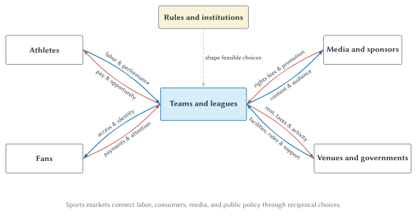
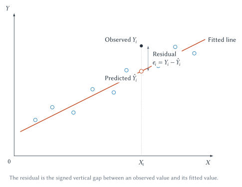
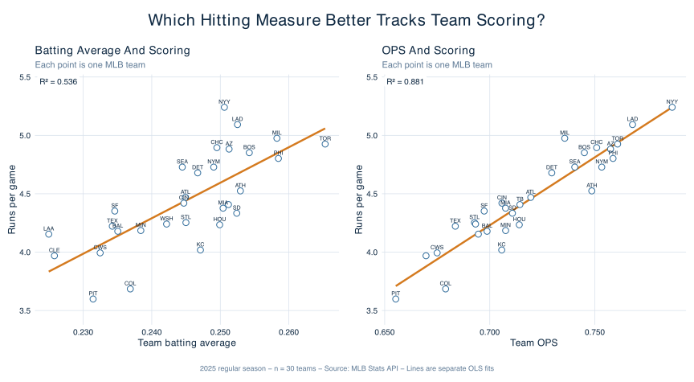
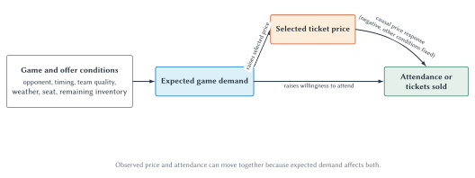

# Introduction to Sports Economics

When the Los Angeles Dodgers signed Shohei Ohtani to a ten-year, $700 million contract, it was easy to ask whether any athlete could possibly be “worth” that much. But *worth it* is not yet an economic question. Worth it to whom? Measured by wins, ticket demand, media attention, sponsorships, long-run brand value, or profit? Compared with signing which other players—or keeping the money available for later? And how should we treat a contract that deferred $680 million until after its ten-year playing term?[^ohtani-contract]

Those questions move us from a headline to economics. The headline supplies a number. Economics asks about the decision maker, objective, constraints, alternatives, timing, incentives, and evidence. It also asks for a **counterfactual**: what would likely have happened if the Dodgers had made a different choice?

The same method applies throughout sports. Did a stadium create local economic growth, or did it move spending from one part of the region to another? Does a salary cap improve competitive balance? Does lowering a ticket price cause attendance to rise? Does a statistic predict performance, and is prediction the same as causation? Sports economics supplies a disciplined way to investigate these questions.

## Learning Goals

After reading this chapter, you should be able to:

- define sports economics as applied microeconomics
- identify the main economic decision makers in sports and the constraints they face
- explain how incentives, models, institutions, counterfactuals, and evidence fit together
- distinguish an economic question from a factual, accounting, or prediction question
- explain why sports provide an unusually visible setting for economic analysis
- recognize the difference between association, prediction, and causation
- improve an AI explanation by specifying the audience, context, task, and constraints
- use an uploaded chapter as the source for AI-generated tutoring and practice
- if completing the optional appendix, interpret a scatterplot, regression slope, fitted value, residual, $R^2$, and confidence interval
- if completing the optional appendix, reproduce a small sports-data analysis with Codex and R while checking the generated work

## What Is Sports Economics?

**Sports economics is the application of economic reasoning and evidence to decisions made by athletes, fans, teams, leagues, media companies, sponsors, venues, and governments.** It studies sports, but its subject is broader than sports business or sports trivia. It asks the same questions economists ask in other settings:

- How do people choose when time, money, talent, and other resources are limited?
- How do prices and rules change behavior?
- How do firms with market power choose prices and products?
- How are workers paid, and how do restrictions affect their bargaining power?
- How do organizations cooperate when they also compete?
- When does a private decision affect people outside the transaction?
- How can data help distinguish a plausible story from a supported conclusion?

::: quickconcept
**Applied Microeconomics**

Applied microeconomics uses economic models and data to explain decisions by individuals, firms, teams, leagues, and institutions. The goal is not to make sports fit a diagram. It is to use a model when it clarifies an actual choice or mechanism.
:::

Microeconomics begins with individual decision makers and the institutions connecting them. A fan chooses whether to attend, watch, buy merchandise, or spend time elsewhere. An athlete chooses among contracts, training, risk, and career opportunities. A team decides how to assemble a roster, price tickets, sell media content, and invest in facilities. A league writes rules that shape competition among teams whose products depend on one another. Governments make decisions about taxes, land, regulation, public funding, gambling, health, and education.

These choices are connected. A rule governing player movement affects bargaining power, team payrolls, and possibly competitive balance. A media agreement affects league revenue, broadcast access, scheduling, and the value of audience attention. A stadium decision affects fans, taxpayers, nearby residents, workers, and businesses. Sports economics studies both the individual choices and the institutional system in which they occur.

<div id="fig:ch01-sports-economics-map">



**Figure 1.1: The sports-economics system.** Teams and leagues connect labor, consumer, media, and public-policy decisions. Each relationship includes flows in both directions and is shaped by rules and institutions.

</div>

::: aifiguredescription
**Figure description: `fig:ch01-sports-economics-map`**

The diagram places Teams and leagues in a central blue box. Four surrounding boxes identify Athletes, Fans, Media and sponsors, and Venues and governments. A small gold box labeled Rules and institutions sits immediately above the center and connects to it. Athletes exchange labor and performance for compensation and opportunity. Fans exchange payments and attention for tickets, viewing, identity, and entertainment. Media firms and sponsors exchange rights payments and promotion for sports content and audience access. Venues and governments exchange facilities, services, rules, taxes, and possible public support with teams and leagues. Arrows run in both directions because each relationship involves reciprocal choices rather than a one-way gift. The diagram is a conceptual map, not an accounting statement. It does not imply that teams and leagues share one objective, that all public support is beneficial, or that every flow is a competitive market transaction.
:::

## Why Sports Are A Useful Economic Laboratory

Sports make many economic relationships unusually visible. League rules are published. Player movement and compensation receive extensive coverage. Games produce repeated outcomes. Attendance, prices, television audiences, standings, and performance statistics can often be measured. Rules sometimes change at identifiable dates, and teams face similar problems under different institutions.

That visibility creates strong teaching examples and valuable research settings. In many industries, it is difficult to observe a worker's output, the exact rules connecting competing firms, or repeated competition under stable conditions. Sports provide imperfect but unusually rich measures of all three.

The Super Bowl illustrates the value of attention. The game is free to viewers with the relevant broadcast access, yet advertisers compete intensely for limited commercial time. NBCUniversal reported that advertising inventory for Super Bowl LX sold out early, and the broadcast later averaged 125.6 million viewers across its measured platforms.[^super-bowl-attention] The economic product sold to advertisers was not football itself. It was access to a massive audience at a particular moment.

Salary caps illustrate institutions and constraints. A roster is not simply a list of the best available players. Teams must choose positions, contract lengths, present and future payroll commitments, injury risks, and replacement options under league rules. Changing the rules can change bargaining, timing, and roster construction even when the athletes' physical abilities remain the same.

Sports are not automatically perfect experiments. A visible event can still have many causes. Teams raise prices for games they already expect to be popular. Successful teams may attract more fans and earn more revenue, but greater revenue may also help teams acquire talent. Cities that host major events differ from cities that do not. Measurement makes analysis possible; it does not eliminate the need for careful reasoning.

::: warning
**A Laboratory Is Not Automatically An Experiment**

Sports produce abundant data and clearly defined rules, but a comparison becomes a credible experiment only when the research design supports the causal claim. A large dataset cannot by itself separate cause from selection, reverse causality, or omitted factors.
:::

## The Economist's Method

Economics is not a collection of conclusions about whether owners, players, fans, or governments are good or bad. It is a method for analyzing choices and consequences. Six ideas will recur throughout this book.

### Constraints And Trade-Offs

Every decision maker faces constraints. A student has limited income and time. A team has a limited roster, schedule, and budget. A stadium has a fixed number of seats on game day. A broadcaster has limited programming time. A city cannot spend the same dollar on a stadium, school, road, and tax reduction simultaneously.

A constraint creates a trade-off. Choosing one option means giving up another. Economists call the value of the best forgone alternative the **opportunity cost**. Chapter 2 develops this logic and connects it to demand and supply. For now, the important habit is to ask what alternative disappears when a choice is made.

The Ohtani contract provides an example. The relevant cost to the Dodgers was not merely the dollars written in the contract. It also included the alternative players, financial flexibility, and future commitments associated with a different roster plan. Deferral changed the timing of payments and the competitive-balance-tax calculation; it did not make the commitment costless.

### Incentives And Behavioral Response

An **incentive** is a change in the expected benefit or cost of an action. Ticket prices affect the cost of attending. Bonuses affect the payoff to measured performance. Draft rules affect the value of winning and losing at different points in a season. Transfer restrictions affect the alternatives available to athletes and teams.

People respond to incentives, but that statement is not a claim that everyone responds identically or perfectly. Fans differ in loyalty and income. Athletes differ in preferences, health, and career stage. Organizations may have several objectives. Rules may be misunderstood or difficult to enforce. The economic task is to identify the likely margin of adjustment and then examine the evidence.

### Models

A **model** is a deliberate simplification. A demand curve holds many conditions fixed so we can isolate how quantity demanded changes with price. A competitive-market model asks what happens when buyers and sellers take price as given. A game-theory model focuses on how one decision maker's best choice depends on another's response.

All models omit details. That is their purpose, but it is also their danger. A model is useful when the omitted details do not overturn the mechanism we are studying. A stadium-capacity model can clarify scarcity for one game. It would be a poor complete model of a team's long-run stadium, seating, and pricing decisions.

A good user of economics can do three things: state the model's assumptions, follow its logic, and recognize where the real institution requires an extension.

### Institutions

**Institutions** are the formal and informal rules that organize interaction. Salary caps, drafts, free agency, transfer windows, revenue sharing, playoff formats, eligibility rules, broadcasting agreements, ticket-resale restrictions, and collective bargaining all shape the choices people can make.

The institutional detail is often the economic mechanism. Suppose a league caps one ticket price. The effect depends on who receives the low-price tickets and whether they can be resold. Suppose player rights move from teams to players. The effect on talent allocation may differ from the effect on who receives the income. A rule's name is not enough; we must trace how it changes feasible choices and bargaining positions.

### Counterfactuals

Imagine that a city builds a new stadium and restaurant spending near the venue rises. Did the stadium create the spending? We cannot answer by comparing the new spending with zero. Some customers would have spent money at other restaurants, in other neighborhoods, or on other entertainment. The relevant comparison is what would likely have occurred without the stadium.

::: quickconcept
**Counterfactual**

A counterfactual is what would likely have happened under a different choice, policy, or set of conditions. Economic and causal claims compare what happened with this relevant alternative—not with zero and not with an imagined perfect outcome.
:::

Counterfactuals can be difficult because we observe the path that occurred, not every path that could have occurred. Economists therefore look for useful comparison groups, changes in rules, controlled variation, or models that make the alternative explicit. Even when a precise causal estimate is impossible, stating the counterfactual improves the question.

### Evidence

Evidence must match the claim. A contract document can establish payment terms. An attendance series can describe what happened. A fan survey can measure reported preferences. A regression can summarize a relationship after accounting for measured variables. A well-designed experiment or natural experiment may support a causal conclusion.

These sources are not interchangeable. A team executive's explanation can document the organization's stated rationale, but it does not prove the policy produced the claimed effect. A correlation can be useful for prediction without revealing causation. A model can clarify a mechanism without proving its empirical importance.

A disciplined economic argument identifies which parts are:

- **theoretical:** what follows from stated assumptions
- **descriptive:** what the data show in a defined sample
- **predictive:** what information helps forecast an outcome
- **causal:** what would change if one factor were changed while the relevant alternatives were held fixed

## The Economic Questions Behind Sports Headlines

The rest of this book develops specific models, but most sports-economic questions fit into a few recurring families.

### Prices, Products, And Attention

Why do ticket prices vary across seats and games? Why can a smaller stadium support higher prices for some events? Why is a short Super Bowl advertisement so valuable? Why do leagues sell media rights in large packages?

These are questions about demand, scarcity, product design, market power, and the value of attention. Chapters 2 through 5 build the main tools. The central lesson is that a visible price is an outcome of choices and constraints, not simply a markup placed on an accounting cost.

### Labor, Rosters, And Bargaining

Why do teams pay some athletes far more than others? How do free agency, drafts, salary caps, transfer rules, and unions affect compensation and movement? When does a performance statistic measure an athlete's contribution, and when does it reflect teammates, role, or opportunity?

These are questions about productivity, labor demand, bargaining power, restrictions on competition, and measurement. The athlete is a worker, but sports labor markets have unusually visible contracts and unusually detailed rules.

### Competition And Cooperation

Teams want to defeat one another, yet they also need opponents, common rules, officials, schedules, and a credible championship. A league is therefore neither an ordinary single firm nor a collection of completely independent competitors.

That joint production creates questions about revenue sharing, competitive balance, league governance, collusion, and antitrust. Strategic interaction matters because a rule that benefits one team can change the choices of every other team.

### Policy And Public Claims

Should a city subsidize a stadium? Should sports gambling face special regulation? What external costs and benefits accompany major events? How should college sports balance education, compensation, and competition? Do participation programs create public-health benefits?

Policy analysis requires more than adding visible spending. It asks how behavior changes, who receives the benefits, who bears the costs, what alternatives are displaced, and what evidence supports the claimed effect. Chapters 3, 9, 12, 13, 14, and 17 return repeatedly to those questions.

### Data, Prediction, And Decisions

Teams and fans have always used information, but the cost of analyzing it has fallen dramatically. A student can now begin with a plain-language question, ask an AI coding agent to inspect a dataset and write a script, run the analysis, and preserve the data, code, figure, and results for review.

That change makes statistical tools more accessible. It does not make judgment obsolete. A polished chart can use the wrong variable. A regression can answer the wrong question. Generated code can contain an error. A predictive relationship can be described as causal without justification. Chapter 15 examines analytics and organizational adoption in depth. The optional appendix to this chapter supplies the basic vocabulary needed to read empirical evidence throughout the book.

## Using AI To Learn Economics

An AI assistant can explain the same idea at different levels, generate practice questions, respond to a student's attempt, and connect an unfamiliar concept to a familiar sport. The quality of that interaction depends partly on how clearly the task is specified.

Compare these requests:

> Explain sports economics.

and

> Explain sports economics to a first-year college student who follows baseball but has never taken economics. Use Shohei Ohtani's Dodgers contract to illustrate constraints, opportunity cost, incentives, and a counterfactual. Distinguish facts from economic interpretation, avoid unexplained jargon, and keep the explanation under 250 words.

The first request invites a generic definition. The second identifies an audience, example, concepts, evidence boundary, and length. It does not guarantee a correct answer, but it makes the output easier to evaluate.

::: sideline
**Using AI To Explain A Concept**

A useful learning prompt normally specifies:

1. **Source:** Which chapter, notes, or data should the answer use?
2. **Audience:** What does the learner already know?
3. **Task:** Explain, compare, quiz, diagnose, or create an example?
4. **Constraints:** Desired length, difficulty, notation, and format.
5. **Verification:** Which facts, calculations, or assumptions should be checked?

Then continue the conversation. Ask what part of the explanation is an observed fact, what part is an economic model, and what evidence would change the conclusion.
:::

This book is designed to be uploaded chapter by chapter. The downloadable Markdown contains the visible text plus hidden figure descriptions and tutoring guidance. Those hidden descriptions help an AI tutor reason about diagrams even when it cannot see the rendered SVG. They are not substitutes for inspecting the actual figure, and they do not appear in the normal HTML presentation.

::: studyandlearn
**Use The Chapter As An AI Tutor**

Upload this chapter's Markdown and begin with:

> Tutor me on Chapter 1 using only the uploaded chapter. First ask whether I want a concise explanation, conceptual practice, counterfactual practice, or the optional regression appendix. Ask one question at a time and wait for my answer. If I am wrong, give one hint before explaining. Identify whether each claim is theoretical, descriptive, predictive, or causal.

The phrase “using only the uploaded chapter” gives the tutor a source boundary. If you want outside examples, ask for them separately and require links and dates.
:::

::: aitutor
**AI tutoring protocol: Chapter 1**

When a student asks for practice based on this chapter:

1. Ask whether the student wants the main chapter or the optional regression appendix.
2. For the main chapter, offer definitions, economic-question classification, counterfactuals, institutions, incentives, and evidence types.
3. For the appendix, offer data anatomy, scatterplot reading, coefficient units, predictions and residuals, $R^2$, uncertainty, association versus causation, or the Codex-plus-R workflow.
4. Ask one question at a time and wait for an attempt.
5. If the answer is incorrect, give one targeted hint before showing the answer.
6. Require the student to identify the decision maker, objective, constraint, counterfactual, and relevant evidence when analyzing a sports claim.
7. Do not invent a current contract, league rule, price, audience, or research finding. Use the chapter's dated examples or clearly label a generated example as hypothetical.

For regression practice, use these verified anchors from the 2025 MLB team sample: 30 observations; batting-average effect per 0.010 equals 0.304 runs per game with $R^2=0.536$; OPS effect per 0.010 equals 0.116 runs per game with $R^2=0.881$. Do not compare the two coefficient magnitudes as though the predictor scales were identical. Do not describe either coefficient as causal. When generating a new numerical exercise, supply every required value and verify the arithmetic before asking the question.
:::

## Big Picture

Sports economics begins by changing the questions we ask.

Instead of asking only how much a contract pays, ask what the parties were trying to accomplish, what alternatives they faced, and how timing and rules changed the bargain. Instead of assuming a stadium created every dollar spent nearby, ask what would have happened otherwise. Instead of treating a high ticket price as proof of high cost, trace demand, scarcity, market power, and product design. Instead of treating a correlation as a cause, identify the counterfactual and the factors that may affect both variables.

The recurring method is:

1. Identify the decision maker and objective.
2. Identify the relevant constraints and alternatives.
3. Trace the incentive and likely behavioral response.
4. Specify the institution and rules.
5. State the relevant counterfactual.
6. Match the evidence to the claim.

Chapter 2 turns this method into the demand-and-supply toolkit. Later chapters apply it to policy, ticketing, media, league behavior, competitive balance, stadiums, labor, college sports, gambling, mega-events, analytics, fandom, and participation.

## Review Questions

1. What makes sports economics a branch of applied microeconomics?
2. Why can sports be a useful laboratory without every sports comparison being an experiment?
3. Identify three constraints faced by a professional team and three faced by a fan.
4. What is an incentive? Why does “people respond to incentives” not imply that everyone responds identically?
5. What is a model, and why can simplification be both useful and dangerous?
6. Give four examples of sports institutions.
7. Define a counterfactual in plain language.
8. Distinguish theoretical, descriptive, predictive, and causal claims.
9. Why is “Was Ohtani worth $700 million?” incomplete as an economic question?
10. What information should a strong AI-learning prompt provide?

## Applications

1. A team signs a veteran player and wins five more games the following season. State the causal claim someone might make. Then identify at least three alternative explanations and the relevant counterfactual.
2. A city reports $200 million of spending near a newly opened stadium. Explain why $200 million is not automatically the stadium's economic impact.
3. A league changes a draft rule. Identify the decision makers whose incentives might change and one behavioral response for each.
4. A broadcaster pays a large amount for media rights. Identify the products or services flowing in both directions between the league, broadcaster, advertisers, and viewers.
5. Rewrite the question “Are salary caps good?” as two answerable economic questions with specified objectives and evidence.
6. Ask an AI assistant to explain one concept from this chapter using a sport you follow. Then revise the prompt to add an audience, source boundary, format, and verification requirement. Compare the two answers.

## Optional Appendix: A Practical Introduction To Regression With Sports Data

You may have completed one or two statistics courses and remember very little. That is common. This appendix starts from the beginning and focuses on interpretation rather than derivation. Its goal is to help you read empirical claims, reproduce one small analysis, and recognize what a regression does not prove.

If your course omits the appendix, the main chapters still stand on their own. If you complete it, later empirical sections will be easier to evaluate.

### Start With The Data

A dataset is an organized collection of observations and variables. In the 2025 Major League Baseball team dataset used here, each row is one team and each column records a characteristic of that team's regular season.

<div id="tab:ch01-data-anatomy">

| Term | Meaning in this dataset | Question to ask |
| --- | --- | --- |
| Observation | One MLB team in the 2025 regular season | What does one row represent? |
| Variable | A recorded characteristic such as runs, games, batting average, or OPS | What does the column measure? |
| Outcome | Runs scored per game | What are we trying to describe or predict? |
| Predictor | Batting average or OPS | Which variable is used to explain variation in the outcome? |
| Unit | Runs per game or a proportion-based batting measure | What does a one-unit or 0.010 change mean? |
| Missing value | An observation for which a required value is unavailable | Is the value absent, or is it actually zero? |

**Table 1.1: Data anatomy.** Interpretation begins by defining rows, columns, and units before running a model.

</div>

Here are three rows from the bundled dataset, rounded for display:

| Team | Runs per game | Batting average | OPS |
| --- | ---: | ---: | ---: |
| Arizona Diamondbacks | 4.883 | 0.251 | 0.757 |
| Boston Red Sox | 4.852 | 0.254 | 0.745 |
| Colorado Rockies | 3.685 | 0.237 | 0.679 |

The complete dataset contains all 30 teams. Runs per game equals total runs divided by games played. Batting average equals hits divided by at-bats. OPS adds on-base percentage and slugging percentage. The analysis script calculates batting average and OPS from official component totals and checks them against MLB's rounded published measures.[^mlb-data]

Before modeling, inspect the data:

- Are there 30 unique teams?
- Does each team have 162 games?
- Are required values missing?
- Are batting measures in plausible ranges?
- Do calculated values reconcile with the source?
- Are the units consistent across observations?

This step is not clerical busywork. If one row represents a player while another represents a team, or runs means total runs in one file and runs per game in another, a perfectly executed regression will answer a meaningless question.

### Describe Before You Model

The **mean** is the sum of the observations divided by the number of observations. It describes the center of a variable. The **standard deviation** describes how dispersed observations are around their mean. Neither tells the whole story. Two variables can have the same mean and standard deviation but very different shapes or unusual observations.

When the question involves two quantitative variables, begin with a **scatterplot**. Each point represents one observation. Its horizontal position records the predictor; its vertical position records the outcome.

Read the plot before looking at a regression table:

1. **Direction:** Do larger values of the predictor tend to accompany larger or smaller outcomes?
2. **Strength:** Do the points cluster closely around a pattern or scatter widely?
3. **Shape:** Is a straight-line summary plausible, or does the relationship curve?
4. **Unusual observations:** Are there teams far from the main pattern?
5. **Range:** Does the figure support conclusions outside the observed values?

### A Line Through The Points

A simple linear regression summarizes the average linear relationship between an outcome $Y$ and a predictor $X$:

$$
Y_i=\beta_0+\beta_1X_i+u_i.
$$

The subscript $i$ identifies an observation—in this case, a team. The terms have distinct jobs:

- $Y_i$ is the observed outcome.
- $X_i$ is the observed predictor.
- $\beta_0$ is the intercept.
- $\beta_1$ is the slope.
- $u_i$ collects the difference between the line and the observed outcome, along with influences omitted from this simple equation.

The fitted regression uses estimated values, usually written $b_0$ and $b_1$ or $\hat\beta_0$ and $\hat\beta_1$:

$$
\hat Y_i=b_0+b_1X_i.
$$

The **slope** is the predicted change in $Y$ associated with a one-unit increase in $X$. Units matter. If $Y$ is runs per game and $X$ is batting average, the raw coefficient describes a full 1.000 increase in batting average—far outside the relevant range. Reporting the effect for a 0.010 increase makes the result interpretable.

The **intercept** is the predicted value of $Y$ when $X=0$. It is needed to position the line, but it may have no useful substantive interpretation when zero lies far outside the observed data. A model can be useful even when its intercept is not a realistic sports scenario.

### Predicted Values And Residuals

The fitted value $\hat Y_i$ is the outcome predicted by the line for observation $i$. The **residual** is the vertical difference between the observed and fitted values:

$$
e_i=Y_i-\hat Y_i.
$$

A positive residual means the observed outcome lies above the line. A negative residual means it lies below. Residuals show what the model misses for individual observations; they are not proof that the observation or model is “wrong.”

<div id="fig:ch01-prediction-and-residual">



**Figure 1.2: An observed value, prediction, and residual.** At the selected value of $X_i$, the fitted line supplies $\hat Y_i$. The observed point is $Y_i$, and the residual is the signed vertical gap $Y_i-\hat Y_i$.

</div>

::: aifiguredescription
**Figure description: `fig:ch01-prediction-and-residual`**

The figure places a generic predictor $X$ on the horizontal axis and outcome $Y$ on the vertical axis. Several blue points form an upward pattern, and an orange fitted line crosses the plot. At a selected horizontal value $X_i$, a dashed vertical guide reaches the fitted line at a hollow point labeled Predicted value, $\hat Y_i$. Directly above it, a filled point labeled Observed value, $Y_i$, represents the actual outcome. A vertical double-headed bracket between the two points is labeled Residual, $e_i=Y_i-\hat Y_i$. Because the observed point is above the line, this illustrated residual is positive. The geometry is an exact illustration of the stated fitted line and selected coordinates, but the points are hypothetical. The figure does not imply that residuals are always positive, that the fitted line is causal, or that observations away from the line should be discarded.
:::

### The 2025 MLB Comparison

For decades, batting average was one of baseball's dominant measures of hitting. It records hits per at-bat, but it omits walks and does not distinguish a single from an extra-base hit. OPS combines on-base percentage and slugging percentage, so it captures more ways a hitter reaches base and more of the power associated with advancing runners and scoring.

We can ask a narrow descriptive question: across MLB teams in the 2025 regular season, which measure had the stronger linear relationship with runs scored per game?

<div id="fig:ch01-runs-vs-ba-ops-2025">



**Figure 1.3: Runs per game, batting average, and OPS in 2025.** Each point is one MLB team. Both relationships slope upward, but the OPS model fits the cross-team scoring variation much more closely in this sample.

</div>

::: aifiguredescription
**Figure description: `fig:ch01-runs-vs-ba-ops-2025`**

Two aligned scatterplots use the same vertical axis, team runs per game, and the same 30 MLB teams from the completed 2025 regular season. The left panel places team batting average on the horizontal axis. Its blue open points show a positive but dispersed relationship with runs per game, and the orange ordinary-least-squares line has $R^2=0.536$. The right panel places team OPS on the horizontal axis. Its points cluster more closely around a positive fitted line, which has $R^2=0.881$. Team abbreviations identify observations. The comparison uses official MLB component totals and calculated batting measures reconciled with MLB's rounded values. A 0.010 increase in batting average is associated with 0.304 additional runs per game; a 0.010 increase in OPS is associated with 0.116 additional runs per game. The coefficient magnitudes should not be compared directly because the predictors use different scales. The figure shows descriptive cross-team associations, not causal effects, and does not reproduce the full historical Moneyball argument.
:::

The numerical results are:

<div id="tab:ch01-regression-results">

| Predictor | Associated change in runs per game for a 0.010 increase | 95% confidence interval | $R^2$ | Teams |
| --- | ---: | ---: | ---: | ---: |
| Batting average | 0.304 | 0.195 to 0.414 | 0.536 | 30 |
| OPS | 0.116 | 0.100 to 0.133 | 0.881 | 30 |

**Table 1.2: Predicting team runs per game, MLB 2025.** Separate ordinary-least-squares regressions use the same 30-team sample. The slopes use different predictor scales; compare fit rather than raw coefficient size.

</div>

The batting-average result says that teams with a batting average 0.010 higher were predicted to score about 0.304 additional runs per game, on average, in this sample. The OPS result says that teams with OPS 0.010 higher were predicted to score about 0.116 additional runs per game.

It would be a mistake to say 0.304 is “larger” and therefore batting average matters more. A 0.010 change represents different movement relative to the observed distributions of BA and OPS. Coefficient comparisons require attention to scale. The clearer introductory comparison is $R^2$ and the scatterplots.

### Interpreting $R^2$

$R^2$ measures how much of the observed variation in the outcome is accounted for by the fitted regression in the sample. An $R^2$ of 0.536 means the batting-average line accounts for about 53.6 percent of the cross-team variation in runs per game. The OPS line accounts for about 88.1 percent.

A higher $R^2$ does not prove that a model is correct, causal, or useful for every decision. It can rise when irrelevant variables are added. A model can fit historical data and predict poorly in a new season. A low $R^2$ does not make a causal estimate unimportant when the outcome is naturally noisy. Here, with the same outcome, sample, and model form, the large difference supports the limited statement that OPS had the stronger linear fit with team scoring in 2025.

<div id="tab:ch01-reading-output">

| Term | Plain-language interpretation | Common mistake |
| --- | --- | --- |
| Intercept | Predicted outcome when every predictor equals zero | Giving it a sports meaning when zero is outside the data |
| Slope | Associated change in the outcome for a stated change in the predictor | Omitting units or calling association causation |
| Fitted value | Outcome predicted by the regression for one observation | Treating it as the observed outcome |
| Residual | Observed outcome minus fitted value | Treating every large residual as bad data |
| $R^2$ | Share of sample outcome variation accounted for by the fitted model | Treating fit as proof of causation or model correctness |
| Confidence interval | Range reflecting sampling uncertainty under the model's assumptions | Treating the endpoints as certain boundaries |

**Table 1.3: Reading regression output.** Every statistic should be translated into the variables, units, sample, and limits of the analysis.

</div>

### Estimates Are Uncertain

The fitted slope is an estimate based on a sample and a model. Another season would produce somewhat different teams, performances, and estimates. A **standard error** summarizes the estimated sampling uncertainty surrounding a coefficient. A **confidence interval** uses that uncertainty to report a range of values compatible with the data and assumptions of the model.

For batting average, the estimated effect per 0.010 is 0.304 runs per game, with a 95 percent confidence interval from about 0.195 to 0.414. For OPS, the corresponding estimate is 0.116, with an interval from about 0.100 to 0.133.

The interval is not a magic truth detector. It does not capture omitted-variable bias, measurement error, an inappropriate model, or the difference between association and causation. It addresses one kind of uncertainty under stated assumptions.

### Multiple Regression: Holding Measured Factors Fixed

A simple regression uses one predictor. A **multiple regression** adds others:

$$
Y_i=\beta_0+\beta_1X_{1i}+\beta_2X_{2i}+\cdots+u_i.
$$

The coefficient on $X_1$ is interpreted as the associated change in $Y$ for a change in $X_1$, **holding the included predictors fixed**. The word *included* matters. A regression cannot hold an unmeasured or omitted factor fixed merely because we want it to.

Suppose we regress game attendance on ticket price. High-demand games often have higher prices because teams anticipate a rivalry, a strong opponent, favorable timing, scarce inventory, or unusual interest. Those same conditions can increase attendance. A simple comparison may therefore show higher prices accompanying higher attendance even though raising the price for an otherwise identical offer would reduce quantity demanded.

<div id="fig:ch01-attendance-price-confounding">



**Figure 1.4: Why price and attendance can move together.** Expected game demand influences both the price selected and attendance. The raw association between price and attendance therefore mixes the causal price response with demand conditions.

</div>

::: aifiguredescription
**Figure description: `fig:ch01-attendance-price-confounding`**

The causal diagram has four boxes. Opponent, timing, team quality, weather, seat characteristics, and remaining inventory feed into Expected game demand. Expected game demand has arrows to Selected ticket price and to Attendance or tickets sold. A separate arrow runs from Selected ticket price to Attendance or tickets sold and is labeled Causal price response. The intended sign of that own-price effect is negative, holding the product and other demand conditions fixed. The arrows from expected demand to price and attendance show confounding: popular games can have both higher selected prices and higher observed attendance. The diagram is schematic and does not identify the size of any effect. Attendance and tickets sold are grouped only to state the general identification problem; an empirical analysis must choose and define one outcome because turnstile attendance and tickets sold can differ.
:::

Multiple regression can account for measured conditions such as opponent, day, seat section, team performance, or weather. It cannot guarantee that all relevant demand conditions were measured correctly. Better evidence might also come from a controlled promotion, a narrowly targeted price experiment, or a rule change that creates plausibly independent variation.

Two other problems deserve names:

- **Omitted-variable bias:** an excluded factor affects both the predictor and outcome, distorting the estimated relationship.
- **Reverse causality:** the proposed outcome also affects the proposed predictor. Expected attendance can influence the price a team chooses, not only the other way around.

### Prediction, Association, And Causation

These goals overlap but are not identical.

- **Association:** Which variables move together in the observed data?
- **Prediction:** Which information helps forecast an outcome for new observations?
- **Causation:** What would happen to the outcome if we changed one factor relative to a relevant counterfactual?

OPS can be a better predictor of team scoring than batting average without the simple regression revealing the causal effect of mechanically changing OPS. OPS is constructed from events—reaching base and accumulating total bases—that are closely connected to scoring. Team quality, lineup composition, ballparks, strategy, and other factors also matter. The regression is useful because its descriptive question is clear and its causal claims are modest.

### Codex Plus R: From A Question To A Reproducible Analysis

R is a free statistical programming environment. A few years ago, using R required a student to know enough commands to import data, fit models, produce figures, and debug the inevitable mistakes. With an AI coding agent, a student can now begin from a plain-language specification and ask it to create and run the code.

That does not mean a student can safely request “analyze this” and accept whatever appears. The student still owns the question, definitions, source choice, model, interpretation, and verification.

::: sideline
**What Changed Between Editions?**

A few years ago, I would have treated this as an Excel project. For this edition, I told Codex the question I wanted to answer: find official 2025 MLB team data, compare runs per game with batting average and OPS, run the regressions in R, and produce a readable figure.

Codex located the data, wrote and ran the R script, checked the 30-team dataset, and generated the table and chart. I did not have to know the R commands in advance. But I still had to decide what question mattered, examine the source, check the variables and units, inspect the graph, and decide what the results did—and did not—show.

The important change is not that statistical knowledge has become unnecessary. It is that the cost of turning a well-specified question into a reproducible analysis has fallen dramatically.
:::

::: warning
**Generated Analysis Still Requires Judgment**

Codex can help inspect data, write and run R code, explain an error, and preserve the results. It cannot make an ambiguous question precise without assumptions, guarantee that a source is appropriate, detect every data problem, or turn an observational regression into a causal design. Always inspect the inputs, code, graph, units, output, and interpretation.
:::

The repository for this chapter preserves:

- the cached official data
- a data dictionary defining every column
- the R script that retrieves or reuses the data
- the fitted model results
- the figure in SVG, PDF, and PNG formats
- session information recording software versions
- an automated test that checks the sample and reported results

This artifact chain allows someone else to inspect and rerun the work. Reproducibility does not guarantee a good question or causal design, but it makes errors easier to find and corrections easier to verify.

### A Guided Lab

If you have the chapter repository, open the project and give Codex this prompt:

> Inspect `data/ch01/mlb-team-batting-2025.csv` and its data dictionary. Confirm the number of teams, uniqueness of team identifiers, season, games played, missing values, variable units, and plausible ranges. Do not change the source file. Then inspect `scripts/ch01-build-regression-example.R`. Explain in plain language how it calculates batting average, OPS, and runs per game; how it reconciles calculated measures with MLB's rounded values; and how it fits separate regressions of runs per game on batting average and OPS. Run the offline script and `tests/ch01-regression-example.R`. Report the coefficient for a 0.010 change, 95% confidence interval, $R^2$, and sample size for each model. Check that the table matches the figure. Explain what the results show, what they do not establish, and save any proposed changes separately rather than overwriting the source.

Notice what the prompt specifies: files, checks, variables, models, units, outputs, causal limits, and a non-destructive workflow.

The central R commands are short:

```r
team_data <- read.csv("data/ch01/mlb-team-batting-2025.csv")
model_ba <- lm(runs_per_game ~ batting_average, data = team_data)
model_ops <- lm(runs_per_game ~ ops, data = team_data)
summary(model_ba)
summary(model_ops)
```

You do not need to memorize these commands to understand the results. You should be able to explain what each model treats as the outcome, what it treats as the predictor, what one observation represents, and why the results are descriptive.

### Appendix Review And Practice

1. In the MLB dataset, what does one observation represent?
2. Distinguish an outcome from a predictor.
3. What four features should you inspect in a scatterplot before reading regression output?
4. Interpret a regression slope in words and units.
5. Why might the intercept lack a useful sports interpretation?
6. If a team's observed runs per game is 4.8 and its fitted value is 4.5, calculate and interpret the residual.
7. What does $R^2=0.881$ mean in the OPS regression? What does it not mean?
8. Why should the BA and OPS coefficient magnitudes not be compared directly?
9. Explain in plain language what a confidence interval adds to a point estimate.
10. Why can higher ticket prices be positively associated with attendance even if the causal price response is negative?
11. Distinguish omitted-variable bias from reverse causality.
12. Give one question for which prediction is sufficient and one that requires a causal estimate.
13. List five checks a student should perform before accepting AI-generated statistical analysis.
14. Reproduce the bundled analysis, save the output, and ask an AI assistant to identify one result that is descriptive, one step that is computational, and one claim that would require a stronger causal design.

## Source Notes

[^ohtani-contract]: Sarah Wexler, “$700M Stunner: Ohtani to Dodgers on Biggest Deal in Sports History,” MLB.com, December 12, 2023, <https://www.mlb.com/dodgers/news/shohei-ohtani-contract-with-dodgers>; Anthony Castrovince, “Explaining the Unprecedented Deferrals in Ohtani's Dodgers Deal,” MLB.com, December 12, 2023, <https://www.mlb.com/news/shohei-ohtani-dodgers-deal-deferrals-explained>, accessed August 12, 2026. MLB reported a ten-year, $700 million agreement and $680 million in deferred compensation beginning after the playing term. The chapter uses the contract to frame objectives, constraints, timing, and counterfactuals; it does not estimate the contract's profitability.

[^super-bowl-attention]: NBCUniversal, “NBCUniversal Sells Out of Milan Cortina 2026 Olympic Winter Games With One Month to Go,” January 6, 2026, <https://www.nbcsports.com/pressbox/press-releases/nbcuniversal-sells-out-of-milan-cortina-2026-olympic-winter-games-with-one-month-to-go>; NBC Sports, “Super Bowl LX Is Second Most-Watched All-Time With 125.6 Million Viewers,” updated February 19, 2026, <https://www.nbcsports.com/pressbox/press-releases/super-bowl-lx-is-second-most-watched-all-time-with-nearly-125-million-viewers-peaking-at-all-time-u-s-record-137-8-million-viewers-across-nbc-peacock-and-telemundo>, accessed August 12, 2026. These company sources support the sold-out advertising inventory and reported cross-platform audience. They do not establish any individual advertisement's causal return.

[^mlb-data]: Major League Baseball Stats API, 2025 team season hitting statistics, <https://statsapi.mlb.com/api/v1/teams/stats?stats=season&group=hitting&season=2025&sportIds=1>; Major League Baseball, “2025 MLB Team Hitting Statistics,” <https://www.mlb.com/stats/team/ops/2025>, accessed August 2, 2026. The bundled script uses official component totals, checks the 30-team structure, reconciles calculated BA and OPS with MLB's rounded measures, and reproduces every reported coefficient and figure. The regressions are descriptive team-level comparisons.
