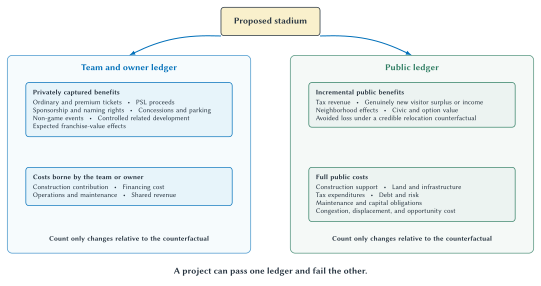
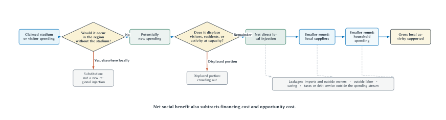
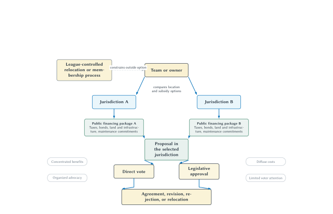

# The Economics of Sports Stadiums

The Buffalo Bills opened a new stadium in 2026 with fewer seats than the building it replaced. At first, that can sound backward. If tickets are valuable, why not build more seats?

The answer begins with a distinction that runs through this chapter: a modern stadium is not designed simply to hold the largest possible crowd. It is designed to create a portfolio of ordinary seats, club seats, suites, sponsorship opportunities, concessions, parking, events, and experiences. A smaller building can have better sightlines, wider concourses, more premium inventory, stronger scarcity, and much more revenue even when fewer people fit inside.

That private business case is important. It is also different from the public case for helping to pay for the building.

New Highmark Stadium cost a reported $2.1 billion. New York State and Erie County contributed a fixed $850 million toward construction, with additional public obligations extending beyond that headline. The Kansas City Chiefs are planning a $3 billion domed stadium in Kansas backed by a public stadium commitment capped at $1.8 billion, plus possible support for related development.[^bills-chiefs-financing] These are among the largest stadium agreements in American sports.

Supporters point to jobs, visitors, tax revenue, civic pride, development, and the risk that a team will leave. Critics point to substitution, leakages, opportunity cost, tax burdens, bargaining power, and decades of economic research finding limited metropolitan gains. Both sides sometimes use the same word—“benefit”—for completely different things.

This chapter develops a disciplined way to sort them out. The key is to keep three questions separate:

1. Why can a new stadium be valuable to the team and its owners?
2. What changes for the local economy and its residents relative to a realistic alternative?
3. How are the costs, risks, and benefits divided through financing and political bargaining?

The economic answer is not that every stadium is good or every subsidy is bad. It is that private revenue, gross economic activity, fiscal revenue, civic value, and net social benefit are different objects. A serious analysis identifies each one, measures it against the right counterfactual, and asks who receives it.

## Learning Goals

After reading this chapter, you should be able to:

- explain why a team can prefer a smaller stadium with more valuable inventory
- distinguish the owner's private stadium ledger from the public ledger
- identify construction grants, tax-exempt bonds, tax abatements, land, infrastructure, maintenance, and operating support as different forms of public assistance
- distinguish new regional spending from locally shifted spending
- explain substitution, crowding out, leakages, indirect effects, and induced effects without multiplier algebra
- distinguish gross economic activity, fiscal effects, and net social benefit
- interpret current empirical evidence on metropolitan outcomes, nearby businesses, property values, and civic value
- explain why stadium construction cost does not mechanically determine ticket prices
- explain how premium inventory and league revenue-sharing rules can affect private stadium incentives
- apply tax-incidence logic to sales, hotel, rental-car, and other stadium taxes
- explain the limited Ramsey-tax intuition behind taxing relatively less responsive bases
- use rent seeking, rational ignorance, logrolling, and public choice carefully
- explain how civic value and relocation threats enter a benefit-cost and bargaining analysis
- compare the completed Bills project with the prospective Chiefs agreement without treating budgets, costs, commitments, and caps as equivalent

## A Stadium Creates Two Different Ledgers

Suppose a team proposes a new stadium. Its owners compare expected private benefits with the costs they will bear. A government should compare incremental public benefits with the full public cost and opportunity cost. The two ledgers overlap, but they are not the same.

The **team and owner ledger** can include:

- ordinary ticket revenue
- club-seat and luxury-suite revenue
- personal seat license proceeds
- sponsorship and naming rights
- concessions and parking retained by the team
- concerts and other non-game events
- revenue from related development the owner controls
- expected effects on franchise value

The team side also includes its construction contribution, financing costs, operating and maintenance obligations, and any revenue shared with other teams.

The **public ledger** can include:

- incremental tax revenue
- genuinely new visitor spending or income retained in the region
- neighborhood effects and externalities
- useful infrastructure or development that would not otherwise occur
- civic pride, identity, and the option to attend in the future
- the avoided loss of those benefits if a credible relocation is the counterfactual

The public costs can include construction support, land, roads and utilities, tax exemptions, debt risk, maintenance, future capital improvements, congestion, displacement, and the value of the best alternative use of those resources.

::: quickconcept
**Use One Counterfactual For Both Ledgers**

Every benefit and cost must be measured relative to the same realistic alternative. If the alternative is renovating the existing stadium, compare the new stadium with renovation. If the alternative is team relocation, include both the resources saved and the civic value lost. Do not compare the proposal with “nothing” on one side of the ledger and with an expensive alternative on the other.
:::

A project can pass the private ledger and fail the public ledger. That is not a contradiction. The owner may capture premium revenue, sponsorship, development income, and franchise-value gains while taxpayers bear costs whose benefits are dispersed or small.

The reverse is possible in principle. A project could create public space, transportation improvements, or neighborhood benefits that the team cannot capture. But that possibility is not evidence that a particular proposal does so. Each claimed spillover needs its own mechanism and evidence.

::: warning
**A Transfer Is Not Automatically A Net Benefit**

A tax payment received by the government is revenue to the public budget, but it is also paid by someone. A subsidy received by the team is a benefit to the team, but it is a cost to the public. Benefit-cost analysis does not add both sides of the same transfer as if new resources appeared.
:::

The ledger is also incremental. A $400 million highway interchange is not an Olympic or stadium benefit merely because officials place it in the same press release. If the interchange would have been built anyway, the stadium may change its timing or design, but it did not create the full value. Likewise, a road built only to serve a stadium is not free simply because drivers use it on non-game days.

**Figure 10.1: One stadium, two incremental ledgers.** Owners evaluate privately captured revenue, control, obligations, and asset value. Governments must evaluate a different combination of fiscal effects, opportunity cost, external effects, risk, and nonmarket civic value. A project can pass one ledger and fail the other.

::: aifiguredescription
**Figure description: fig:ch10-private-public-ledger**

The schematic begins with a single node labeled “Proposed stadium” and sends arrows to two side-by-side panels. The left panel, “Team and owner ledger,” contains privately captured benefits—ordinary and premium ticket revenue, PSL proceeds, sponsorship and naming rights, concessions and parking, non-game events, related development where controlled, and expected franchise-value effects. Its cost box contains the team construction contribution, financing cost, operating and maintenance obligations, and revenue shared under applicable league rules. The right panel, “Public ledger,” contains incremental tax revenue, genuinely new visitor surplus or income, neighborhood effects, civic and option value, and avoided loss when credible relocation is the counterfactual. Its cost box contains construction support, land and infrastructure, tax expenditures, debt and risk, maintenance and capital obligations, congestion, displacement, and opportunity cost. Both panels end with the same rule: count only changes relative to the counterfactual. A note below says that a project can pass one ledger and fail the other. The figure is schematic and assigns no universal dollar value or sign. Public tax revenue is not automatically net social benefit, civic value is not regional GDP, and the two ledgers must use the same counterfactual.
:::

## Why A Smaller Stadium Can Make More Money

Fans often judge a stadium by capacity. Teams judge it by what the building allows them to sell.

An ordinary seat sells admission to a game. A club seat may bundle admission with a lounge, food, service, parking, or a long-term commitment. A suite can bundle private space, hospitality, client entertainment, and status. A personal seat license can collect an up-front payment for the right to buy season tickets. Sponsorship inventory can include gates, clubs, digital displays, concourses, practice facilities, and branded experiences.

The stadium therefore creates a set of products with different buyers and different willingness to pay.

| Revenue channel | What a new venue can change | Main demand or capacity question | Sharing or control question |
| --- | --- | --- | --- |
| Ordinary tickets | sightlines, comfort, scarcity, schedule inventory | How many seats can be sold at each price? | How much gate revenue is shared? |
| Club seats and suites | hospitality, privacy, service, status | Is there enough business and high-income demand? | Which component is ordinary ticket revenue and which is locally retained premium revenue? |
| Personal seat licenses | up-front access rights | Will buyers pay today for future purchase priority? | Who receives proceeds and how are they applied to construction? |
| Sponsorship and naming | more branded spaces and media exposure | How valuable is the audience to sponsors? | Is the contract controlled locally? |
| Concessions and parking | higher spending and better capture | Will better service raise spending rather than merely prices? | Who operates and retains the margin? |
| Non-game events | concerts, college games, tournaments, conventions | Can the building attract dates that would otherwise go elsewhere? | Who receives rent, concessions, and event income? |
| Related development | retail, lodging, offices, housing, entertainment | Does the project create new demand or rearrange activity? | Does the team control the land or development rights? |

The private optimum is not maximum capacity. Adding the last 10,000 low-demand seats can be expensive and may reduce scarcity without adding enough ticket revenue. The optimum is also not maximum revenue per attendee. A team could increase revenue per attendee by eliminating most inexpensive seats, but lose profitable volume, atmosphere, sponsorship reach, and future fans.

The relevant objective is the best expected combination of revenue, cost, demand, fan experience, risk, and long-run team value.

New Highmark Stadium makes the point clearly. The completed building has about 60,000 seats, substantially fewer than the old stadium, but it offers inventory and amenities the old building could not. The Bills reported more than $262 million in gross PSL revenue, sold-out club inventory, and sold-out suite and loge inventory before opening.[^bills-premium] The team did not need a larger bowl to create more privately valuable capacity. It needed a different mix of capacity.

The Cowboys offer an earlier version of the same strategy. Before their new stadium opened in 2009, reports projected roughly $90 million in additional annual revenue from premium seating, sponsorship, and other stadium channels.[^dallas-revenue] The exact projection should not be confused with an audited profit result. Its importance is conceptual: a new venue can change the composition and control of revenue, not just the number of tickets.

## Cost Does Not Set The Ticket Price

When a team spends billions on a stadium, people understandably say ticket prices rose “to pay for it.” That language usually confuses a financial use of revenue with the economic cause of the price.

The profit-maximizing ticket price depends on demand, capacity, marginal revenue, and marginal cost. The stadium's construction bill is largely a fixed cost once the building exists. Charging more for an empty seat does not recover the cost if buyers will not pay.

A new stadium can nevertheless cause higher prices through demand:

- fans may value comfort, sightlines, food, technology, and weather protection
- novelty can increase early demand
- a smaller capacity can make tickets scarcer
- new club and suite products can identify buyers with higher willingness to pay
- a competitive team or major event schedule can increase interest

The Bills' 2026 prices therefore need not be described as a cost pass-through. The newer product, novelty, premium options, and smaller building change demand and scarcity. The team charges more because buyers are willing to pay more and because the available inventory changed.

The same reasoning applies to payroll. When the Lakers signed Shaquille O'Neal in 1996, a ticket-price increase would not have been economically caused by a bookkeeping need to “pay Shaq.” A superstar can raise expected quality, attention, and willingness to pay. The team raises price because demand permits it. The contract and the price can be related through demand without cost mechanically setting price.

::: keypoint
**Expense Does Not Create Willingness To Pay**

A new stadium, superstar contract, or renovation can increase ticket demand by improving the product. The team may use the resulting revenue to cover its expense. But the ability to charge a higher price comes from demand and scarcity, not from the existence of a large bill.
:::

This distinction matters for public policy. A team may honestly say it needs new revenue to make a project financially attractive. That does not prove that consumers will supply the revenue or that taxpayers receive a comparable benefit.

## The Stadium Lifecycle And Economic Obsolescence

Stadiums do not become obsolete only because concrete cracks or roofs leak. They can become economically obsolete when newer venues create revenue products the older building cannot match.

A useful lifecycle has three stages.

During the **honeymoon period**, fans are curious about the new building, demand can rise, and sponsors and premium buyers receive a new product. Empirical work finds novelty effects, but their size and duration differ by sport. Coates and Humphreys found substantial and persistent attendance effects in baseball and basketball and much smaller effects in football; later work continues to refine those estimates.[^stadium-novelty]

During the **mature period**, novelty fades. The building can remain functional and popular, but its concourses, technology, clubs, suites, sponsorship spaces, and surrounding development are compared with newer venues. A decline in relative revenue opportunity can matter even when attendance remains strong.

During the **renovation-or-replacement period**, the team compares a major upgrade with a new facility. A venue only twenty-five or thirty years old can face replacement pressure because the economically relevant capital is not just seats and concrete. It includes the layout needed to sell modern hospitality, sponsorship, media, food, events, and development.

The Georgia Dome illustrates the short cycle: it opened in 1992 and was replaced by Mercedes-Benz Stadium in 2017. Fenway Park and Wrigley Field illustrate another path. Historic value and location supported continued use, while extensive renovations created modern premium and service capacity inside old structures.

::: quickconcept
**Economic Obsolescence**

A stadium is economically obsolete when its design no longer supports the products, costs, or revenue opportunities a team seeks—even if the building can still host games safely. Economic obsolescence can create pressure for renovation or replacement before physical failure.
:::

The lifecycle creates a public-finance warning. A government can still be paying debt or maintenance from one venue when the team begins seeking the next round of upgrades. A long-lived public obligation paired with a shorter private revenue cycle is a risky contract design.

It also limits the “honeymoon” argument. A temporary increase in attendance and prices is part of the owner's private return. It does not establish a permanent regional benefit large enough to cover the subsidy.

## What Counts As Public Assistance?

“The subsidy is $850 million” sounds precise. It may be only one line of the agreement.

Stadium assistance can take several forms:

- an up-front construction grant
- proceeds from public bonds
- below-market land or site preparation
- roads, utilities, transit, parking, and environmental work
- property, sales, or income tax exemptions
- tax-exempt bond financing that lowers borrowing cost
- operating or maintenance payments
- future capital-improvement funds
- guarantees against cost overruns or operating losses
- dedicated taxes or public revenue streams
- rights to surrounding development

These items should not be collapsed into one nominal sum without defining the measurement. A $20 million annual payment for thirty years is not directly comparable with a $600 million payment today. A conditional bond cap is not money already borrowed and spent. A tax exemption is not the same as a cash grant, but it still has a public cost.

Dedicated revenue creates another common confusion. Officials may say a package uses “no new taxes” because it captures future sales-tax growth, lottery revenue, sports-wagering revenue, or an existing hotel tax. The statement can be legally or politically meaningful. Economically, the revenue still has an opportunity cost. If it goes to stadium debt, it cannot simultaneously finance schools, tax relief, transit, reserves, or some other public purpose.

::: quickconcept
**Opportunity Cost**

The opportunity cost of a stadium subsidy is the value of the best alternative use of the public money, land, borrowing capacity, staff time, and political attention. The relevant comparison is not the stadium versus leaving cash in a vault; it is the stadium versus the best feasible alternative.
:::

::: warning
**Earmarked Revenue Is Not Free Money**

A stadium can be financed without raising a statutory tax rate and still use public resources. Ask where the dedicated revenue would go under the counterfactual and who bears the risk if the projected stream is too small.
:::

The federal government can also subsidize a stadium without writing the local construction check. Tax-exempt municipal bonds allow investors to exclude qualifying interest from federal taxable income, lowering the interest rate an issuer must offer. A study of 57 stadiums built since 2000 found that 43 used federal tax expenditures through tax-exempt municipal bonds and estimated a $3.6 billion present-value subsidy to issuers and $4.3 billion in lost federal revenue under its main assumptions.[^stadium-bonds]

That federal cost is easy to miss in a local headline. It is also why a complete ledger identifies the level of government, the financing instrument, the time horizon, and the party bearing risk.

## The Economic-Impact Filter

Promotional studies often begin with spending and apply a multiplier. A sound analysis begins one step earlier: how much spending is actually new to the region?

Consider four spectators:

1. A Buffalo resident attends a Bills game instead of a Sabres game.
2. A local family buys tickets instead of going to a restaurant and movie.
3. A visitor from Rochester attends the game but would otherwise have spent the weekend elsewhere in Western New York.
4. A visitor from Toronto comes to the region only because of the game.

All four purchases are stadium revenue. They are not four equal regional injections.

The first two are largely **substitution** within the local entertainment budget. The third may shift spending within the broader region, depending on the geographic boundary. The fourth is the clearest example of genuinely new visitor spending.

The geographic boundary matters. A hotel payment can be new to Orchard Park, shifted within Erie County, new to Western New York, or shifted within New York State. An impact number without a geographic definition is not interpretable.

Capacity also matters. A large event can crowd out ordinary visitors when hotels, roads, restaurants, or public services are already near capacity. Higher room prices do not prove more real output if regular travelers stay away. **Crowding out** can occur through prices and congestion even when every hotel room is occupied.

The next step is leakage. Some new spending leaves the region through:

- imported food, equipment, and supplies
- profits sent to outside owners
- wages paid to workers who live elsewhere
- saving rather than immediate local spending
- taxes or debt service flowing outside the defined local economy

What remains can support purchases from local suppliers. Income received by local workers and owners can support another round of household spending. These are **indirect** and **induced** effects.

::: quickconcept
**The Keynesian Spending Multiplier—Without The Algebra**

One person's spending becomes another person's income, and part of that income is spent again. The successive rounds get smaller because people save, pay taxes, buy imports, and make payments outside the region.

For stadium analysis, the most important question is usually not the exact multiplier. It is the size of the genuinely new local injection before a multiplier is applied.
:::

A local stadium multiplier is likely to be modest when substitution and leakage are large. Sports events rely on national media, imported equipment, traveling performers, nonlocal contractors, and highly paid labor that may live elsewhere. A host can also be a small geographic unit embedded in a larger economy, making measured leakage especially high.

::: warning
**Not Every Economic-Impact Multiplier Is The Keynesian Multiplier**

The Keynesian spending multiplier supplies the intuition of repeated spending. Promotional studies often use regional input-output models that trace purchases through industry relationships. The ideas are related, but they are not interchangeable. Both depend on the initial injection, geographic boundary, capacity, and leakages.
:::

Even a perfectly calculated multiplier produces **gross economic activity**, not net social benefit. A construction project can support $1 billion in output and still be a bad public investment if the labor and capital would have produced nearly as much elsewhere and the subsidy, risk, and opportunity cost exceed the incremental benefit.

**Figure 10.2: The local-spending filter comes before the multiplier.** Spending that would have occurred elsewhere in the region is substitution, not a new regional injection. Displaced activity is removed next. Only the remaining direct local injection enters smaller supplier and household rounds, and the resulting gross activity still is not net social benefit.

::: aifiguredescription
**Figure description: fig:ch10-local-spending-filter**

The diagram is a left-to-right decision flow. It begins with “Claimed stadium or visitor spending.” The first diamond asks whether the spending would occur in the region without the stadium. A “Yes, elsewhere locally” arrow exits downward to “Substitution: not a new regional injection.” A “No” arrow continues to “Potentially new spending.” The second diamond asks whether that spending displaces ordinary visitors, residents, or activity when capacity is constrained. The displaced portion exits downward as crowding out; the remainder enters “Net direct local injection.” The surviving flow passes through successively smaller nodes for local suppliers and household spending and ends at “Gross local activity supported.” Dashed exits from the direct, supplier, and household rounds lead to a leakage box listing imports and outside owners, outside labor, saving, and taxes or debt service outside the spending stream. A bottom note says that net social benefit also subtracts financing cost and opportunity cost. The geographic boundary determines what counts as local or as leakage. The schematic does not assign a numerical multiplier and does not treat every leakage as social waste; it shows that money has left the defined regional spending cycle.
:::

## A Current Promotional Example: The Chiefs

The Chiefs' June 2026 release reported an IMPLAN study commissioned from Econsult Solutions. It projected $8.2 billion in construction-period economic output from a $4.5 billion capital plan: $4.5 billion in direct capital investment, $1.9 billion in indirect activity, and $1.8 billion in induced activity. It also projected $1.5 billion in annual activity after opening.[^chiefs-impact]

Those numbers are useful for teaching because the categories are visible. They should be described accurately:

- They are projections, not observed outcomes.
- They measure gross output, not net benefits or household income.
- The construction calculation begins with the full capital plan rather than only resources newly drawn into the metropolitan economy.
- The reported geography spans the Kansas City metropolitan area on both sides of the state line, while the financing question concerns particular Kansas public revenues.
- The calculation does not by itself subtract substitution, financing cost, displaced activity, or the value of alternative public spending.

This does not mean the study contains no information. It describes a possible chain of transactions under a model. The mistake is treating the last and largest number in that chain as the public return on the subsidy.

::: warning
**Output Is Not A Benefit-Cost Result**

Direct, indirect, and induced output can all be calculated correctly and still fail to answer whether residents are better off. A benefit-cost analysis must identify what is new, value real resources, include financing and opportunity cost, and avoid counting transfers twice.
:::

The simplest classroom response to a promotional impact figure is a sequence of questions:

1. What is the geographic area?
2. What spending is genuinely new to it?
3. What local spending is displaced?
4. Which payments leak out?
5. Is the reported outcome output, income, jobs, taxes, or welfare?
6. What public costs and risks are excluded?
7. What is the counterfactual use of the money, labor, and land?

If a report cannot answer those questions, additional decimal places do not make it more informative.

## What Does The Current Evidence Find?

The older stadium debate sometimes sounded too simple. Supporters claimed a new stadium would transform a regional economy. Critics responded that nothing at all happens. Current research supports a more precise conclusion.

Reviews of more than 130 studies continue to find limited aggregate metropolitan gains from professional franchises and venues relative to typical public outlays.[^stadium-review] Stadiums usually do not create a large new export industry. A modest number of home games rearrange entertainment activity, and much of the revenue goes to players, owners, leagues, and suppliers who need not live in the host jurisdiction.

That metropolitan conclusion does not mean the blocks around a stadium are unchanged. Using mobile-device data around 92 major-league facilities, Timur Abbiasov and Dmitry Sedov found measurable increases in visits to nearby food, accommodation, and retail businesses on event days. Their median back-of-the-envelope estimate was about $11.3 million in additional annual spending in those categories.[^nearby-business] That can matter to a restaurant next to the stadium. It remains small relative to a billion-dollar subsidy and is not a complete welfare estimate.

The distinction is between **local concentration** and **regional creation**. A stadium can make one entertainment district busier while activity elsewhere falls or changes little. Both observations can be true.

Claims about mixed-use districts require similar care. Truist Park and the Battery Atlanta visibly changed the area around the Braves' stadium. Synthetic-control studies, however, did not identify increases in Cobb County commercial property values or property assessments relative to comparison jurisdictions.[^property-evidence] The result does not prove that no individual property benefited. It shows why visible construction and crowds should not be treated as proof that a project expanded the county tax base enough to pay for itself.

| Outcome being studied | Useful evidence | What it can establish | What it does not establish by itself |
| --- | --- | --- | --- |
| Metropolitan income and employment | long-run comparisons and causal designs | whether the regional economy changed relative to a counterfactual | neighborhood redistribution or civic pride |
| Nearby business activity | high-frequency visits and spending | localized event-day spillovers | net metropolitan growth or welfare |
| Property values and assessments | parcel data with comparison areas | capitalization of expected local benefits and costs | the value of every public or civic effect |
| Fiscal revenue | audited taxes and public costs | budget effects for a defined government | total social benefit |
| Civic and nonuse value | carefully designed surveys or behavior | value omitted from market income | guaranteed willingness to pay or causal growth |

The research therefore does not support “stadiums do nothing.” It supports a more useful statement: stadiums can change where people gather, where nearby spending occurs, how land is used, and how residents feel about a place, but those effects have generally not produced large aggregate economic gains that match the largest public subsidies.

## Two Current Stadium Agreements

The Bills and Chiefs cases are unusually useful because one project is complete and the other is prospective. Treating them as if they were at the same stage would hide most of the economics.

| Item | New Highmark Stadium | Chiefs' planned Kansas stadium |
| --- | --- | --- |
| Status used here | completed June 2026 | prospective; target 2031 season |
| Stadium cost | $2.1 billion reported completed cost | $3 billion announced budget |
| Direct public stadium amount | $850 million fixed construction contribution | lesser of 60 percent or $1.8 billion |
| Headline public share | about 40.5 percent of completed reported cost | up to 60 percent of current budget |
| Overrun responsibility | Bills responsible for remaining cost and most overruns, subject to agreement exceptions | Chiefs responsible for remaining stadium cost and overruns above applicable public commitments |
| Broader obligations | public capital-improvement and maintenance commitments extend beyond construction headline | ancillary-development support, tax benefits, and future repair/maintenance/operations provisions require separate treatment |

**Table 10.1: A completed cost is not a prospective cap.** Dollar amounts are nominal and current as of August 28, 2026. The Bills percentage divides a fixed contribution by a completed reported cost. The Chiefs percentage applies a conditional agreement cap to a prospective budget. The rows are designed to expose those differences, not to rank the projects with one lifetime-subsidy measure.

### The Bills: A Fixed Contribution And Cost Overruns

The 2022 agreement began with a $1.4 billion stadium budget. New York State committed $600 million and Erie County $250 million toward construction. The Bills were responsible for the rest, net of specified PSL proceeds, and for most cost overruns.[^bills-chiefs-financing]

At the original budget, the $850 million public contribution equaled about 60.7 percent of construction cost. At the reported $2.1 billion completed cost, the same nominal contribution equaled about 40.5 percent.

That falling percentage does not mean the original commitment became small. It means the team bore the increase in construction cost. The case demonstrates why risk allocation belongs beside the subsidy percentage. A government that promises 60 percent of whatever a project ultimately costs has a different exposure from one that commits a fixed amount.

The $850 million is also not the complete lifetime public ledger. The agreement contains annual public capital-improvement and maintenance contributions, event surcharges, rent provisions, and other obligations. A full comparison would convert future flows to present value and identify which revenues are paid by stadium users and which displace other public uses.

For Buffalo students, the benefit side is personal. Keeping the Bills in Western New York can have civic value that does not appear in regional income. That value belongs in the analysis. It does not turn every financing term into a benefit.

### The Chiefs: A Prospective Cap And A State-Line Competition

The December 2025 Kansas agreement sets the public stadium commitment at the lesser of 60 percent of the stadium budget or $1.8 billion. The Chiefs are responsible for the remainder and for overruns above the applicable public commitments. The current concept is a $3 billion enclosed stadium with roughly 70,000 seats, scheduled to open in 2031.[^chiefs-agreement]

The broader agreement permits public support for qualifying ancillary development. Its aggregate public commitment can reach $2.775 billion at the highest specified project scale, while certain abatements, exemptions, development incentives, and repair and operating commitments sit outside the defined cap. That does not mean $2.775 billion has already been borrowed or spent. It means the headline stadium-only figure is not the outer boundary of every possible public benefit.

The location also matters. The Chiefs are moving from Missouri to Kansas while remaining in the same metropolitan area. Some activity counted as new to Kansas can be shifted from Missouri and not new to metropolitan Kansas City. The project can be a fiscal or political win for one state without producing the same net gain for the metro area.

This is a general lesson: the smaller the jurisdiction used in an impact study, the easier it is for cross-border redistribution to look like growth.

## Premium Revenue And League Rules

Why do teams care so much about suites and club seats? High willingness to pay is one answer. Revenue control is another.

NFL clubs generally share 34 percent of gate receipts with visiting teams. Under rules that took effect in 2025, the ordinary ticket component of suites and club products remains subject to detailed sharing rules, while qualifying premium components can be retained locally. The definitions and waivers are complicated and can change, but the basic incentive is clear: two seats that occupy similar physical space can create different local revenue depending on the services bundled with them and how league rules classify the payment.[^nfl-sharing]

This connects Chapter 7's revenue-sharing discussion to stadium design. Shared national revenue gives teams a common base. Locally retained venue revenue creates a reason to invest in differentiated stadium products. A new building can therefore increase the marginal return to local sponsorship, hospitality, and premium sales even if ordinary ticket revenue is partly shared.

The point is not that every suite dollar is pure profit. Premium spaces are expensive to construct, service, sell, and maintain. Demand can be overestimated. Long-term contracts can create risk. The point is that a venue changes the set of privately captured revenue opportunities.

### Corporate Entertainment And The Federal Tax Code

Luxury-box demand also interacts with tax policy. Businesses buy hospitality for clients, employees, networking, and status. The after-tax cost of that spending depends on what federal law allows the purchaser to deduct.

The 2017 Tax Cuts and Jobs Act disallowed deductions for expenses associated with entertainment, amusement, or recreation. IRS guidance treated separately stated food and beverage expenses under a different set of rules.[^tcja-entertainment] The change reduced a federal tax preference for corporate sports entertainment. A company may still buy a suite because it expects business value, but the federal government generally no longer shares part of the entertainment cost through a deduction.

At the same time, a separate stadium provision disappeared during the legislative process. The House bill would have made interest on bonds used for professional sports stadiums taxable. The Senate bill contained no equivalent. The conference agreement did not adopt the House provision, so the tax-exempt stadium-bond channel survived.[^tcja-stadium-bonds]

::: sideline
**Two Tax Subsidies—And Only One Was Removed**

The entertainment deduction affected corporate buyers of sports hospitality. Tax-exempt stadium bonds affect the public cost of financing privately used facilities. The 2017 law curtailed the first channel while leaving the second in place after the House stadium-bond proposal was dropped in conference.

There are stories that personal lobbying caused the last-minute outcome. The textbook does not repeat them because the legislative change is verifiable while the claimed personal causation is not.
:::

The contrast is economically interesting without a political anecdote. Federal tax rules can affect both the demand for premium products and the supply price of public capital. A stadium agreement can therefore involve local and state subsidies layered on federal tax treatment.

## Who Actually Bears A Stadium Tax?

A financing law identifies who remits a tax. Economics asks who bears its burden after prices and behavior adjust.

Suppose a city adds a hotel tax to finance a stadium. The hotel sends the payment to the government, but it may raise room prices. How much depends on the responsiveness of visitors and hotels.

- If visitors can easily choose another city, hotels may absorb more of the tax through lower net prices or profits.
- If event visitors have few substitutes, more of the tax can be passed into room prices.
- In the short run, the number of hotel rooms is relatively fixed.
- Over time, investment, entry, conversion, and location decisions make supply more responsive.

The long-run adjustment deserves care. When supply becomes more elastic over time, the less responsive demand side tends to bear more of the remaining tax burden through higher consumer prices or reduced consumption. Owners can redirect capital, delay investment, or exit. Existing immobile owners can bear substantial short-run losses, but capital is less trapped in the long run.

The same logic applies to rental-car taxes, restaurant taxes, ticket surcharges, and district sales taxes. “Tourists pay” is a hypothesis about incidence, not a fact established by the name of the tax.

Equity is a separate question. A broad sales tax can place a larger burden relative to income on lower-income households. A hotel or rental-car tax may export part of the burden to visitors, but local workers and owners can still bear some incidence. A user charge can connect payment more closely to attendance, while civic benefits may extend beyond users. Horizontal and vertical equity therefore depend on who receives the benefits, who ultimately bears the tax, and ability to pay—not merely the statutory tax label.

::: quickconcept
**Tax Incidence Is Not Written On The Tax Bill**

The party that sends the payment to the government may pass some burden to buyers, workers, property owners, or suppliers. Relative elasticities and the time horizon determine the economic incidence.
:::

There is a limited Ramsey-tax intuition here. If a government must raise a given amount of revenue, taxing a relatively unresponsive base can create less behavioral distortion than taxing a highly responsive one. That is one reason hotel, rental-car, and visitor-oriented taxes are politically and economically attractive.

But this is not a free-money theorem. A narrowly based tax can be unfair, volatile, easy to evade through location choices, or damaging to another local industry. Ramsey reasoning asks how to raise revenue with less distortion after a public objective has been chosen. It does not establish that the stadium is worth financing.

## Referenda, Legislatures, And Public Choice

Stadium policy is not made by a neutral calculator. Teams, leagues, construction firms, unions, neighborhood groups, taxpayers, fans, elected officials, and competing jurisdictions have different stakes and different incentives to organize.

Interjurisdictional competition can also produce a **winner's curse**. When several governments estimate an uncertain public value, the jurisdiction with the most optimistic forecast can offer the largest package and win the team or project. Winning may then reveal that it overestimated new activity, civic benefit, or future tax revenue.

::: quickconcept
**Winner's Curse**

The winner's curse occurs when the bidder who wins is the one that most overestimates the value of the prize. In stadium bargaining, competition among cities or states can select the most optimistic public forecast and produce an offer larger than the realized public value.
:::

This logic does not mean the Chiefs' move to Kansas proves that Kansas overpaid. It means the winning package should be evaluated with extra care because Missouri and Kansas were competing under uncertainty and the team could compare their offers.

Voters sometimes approve stadium plans and sometimes reject them. Oklahoma City voters approved a new downtown arena plan in December 2023 with about 71 percent support. Tempe voters rejected three propositions connected to the proposed Coyotes development in 2023. Jackson County voters rejected a Chiefs-Royals sales-tax measure in April 2024 with more than 58 percent voting no.[^stadium-votes]

Those results do not show that recent voters always reject stadiums. A broader Associated Press review found 35 approvals and 22 rejections among 57 stadium ballot measures from 1990 through 2023.[^ballot-history] The more important fact is that a referendum is only one institutional route.

A study of major North American stadium projects from 2005 through 2020 classified more than 80 percent as using legislated or no-vote subsidies.[^legislated-subsidies] After the Jackson County vote, Kansas advanced a legislative STAR-bond path for the Chiefs. Missouri later enacted its own assistance package. The team could compare two jurisdictions even after voters rejected one proposal.

Several public-choice concepts help explain the process.

**Rent seeking** is the use of resources to obtain favorable government policy. A team can spend on lobbying, public relations, and negotiation to capture a subsidy. Opponents can also organize to influence policy. The term describes the contest for policy-created gains; it is not a synonym for bribery.

**Rational ignorance** can arise when the cost of mastering a long financing agreement exceeds the expected effect of one citizen's knowledge on the outcome. Team owners and construction firms have concentrated stakes and strong incentives to study the details. The cost is often spread across many taxpayers, each with a small individual stake.

**Logrolling** describes vote trading or package-building across issues. A stadium measure may be combined with development, infrastructure, disaster relief, or unrelated priorities to assemble a legislative coalition. The presence of a package does not prove a particular vote trade. The concept tells students what evidence to look for.

::: warning
**Public Choice Explains Incentives; It Does Not Prove Corruption**

Concentrated benefits, diffuse costs, limited attention, and jurisdictional competition can shape stadium policy. These mechanisms can operate through legal, ordinary politics. A claim that a particular official was corrupt or that a specific vote was traded requires separate evidence.
:::

Franchise scarcity strengthens the team's bargaining position. A city cannot order an expansion team from a competitive supplier. The league controls entry and relocation, while only a small number of teams are available. A credible alternative site gives the owner an outside option. A city also has an outside option: reject the deal and use the resources elsewhere.

The Rams and Raiders show that relocation is possible even after public investment. The Rams left St. Louis in 2016 after playing in a publicly financed dome; the city, county, and stadium authority later settled relocation litigation with the NFL. The Raiders left an Oakland venue that had received taxpayer-funded renovations and moved to Allegiant Stadium in Las Vegas, whose financing included a $750 million public construction contribution backed by room taxes.[^rams-raiders]

These examples do not prove that every threat is credible. They explain why residents and officials may take the possibility seriously—and why a subsidy cannot purchase permanent control unless the contract actually creates enforceable protection.

The final agreement reflects not only the project's expected benefits and costs, but also bargaining power, political institutions, timing, and what each side believes will happen if no deal is reached.

**Figure 10.3: Stadium bargaining and approval are institutional processes.** Franchise scarcity and outside options shape the packages under consideration. Direct votes and legislative approval are alternative routes, and either route can produce agreement, revision, rejection, or relocation.

::: aifiguredescription
**Figure description: fig:ch10-bargaining-and-approval**

The diagram places “Team or owner” at the top. A separate node labeled “League-controlled relocation or membership process” connects by a dashed constraint arrow; the league is not presented as another jurisdictional bidder. The team compares location and subsidy options from Jurisdiction A and Jurisdiction B. Each jurisdiction leads to a public financing package that can include taxes, bonds, land and infrastructure, and maintenance commitments. The selected proposal then branches to two alternative institutional routes: direct vote or legislative approval. Four nearby labels identify public-choice participation conditions—concentrated benefits, diffuse costs, organized advocacy, and limited voter attention. Both approval routes lead to a common outcome box listing agreement, revision, rejection, or relocation. The schematic does not assume that a relocation threat is credible, that voters or legislatures choose one outcome consistently, or that legislative action follows a failed referendum. It illustrates bargaining and participation incentives and does not prove corruption or policy inefficiency.
:::

## Is Losing A Team Like Losing A Public Good?

Tickets to a Bills game are not a public good. The team can exclude people who do not buy admission, and two fans cannot occupy the same seat. Broadcast access can also be sold.

Yet a team can create benefits for people who rarely or never attend:

- civic pride and shared identity
- conversations and social connection
- national visibility
- the option to attend in a future season
- satisfaction from knowing the team remains part of the community

Economists call these **nonuse**, **option**, or **civic** benefits. They are quasi-public because some are widely shared and difficult for the team to capture through ticket prices.

::: keypoint
**Civic Value Is Not The Same As Economic Impact**

A resident can value the Bills' presence without receiving additional income or spending more near the stadium. That value belongs in a complete welfare analysis, but it should not be reported as jobs, GDP, visitor spending, or tax revenue.
:::

Researchers often estimate civic value with **contingent valuation**: carefully designed surveys ask how much residents would be willing to pay under a specified policy or payment mechanism. The method addresses something ordinary market data miss, but hypothetical answers can depend on wording, information, strategic responses, and whether payment feels real.

A study of the Jacksonville Jaguars estimated the present value of public goods generated by the team at $36.5 million or less.[^jaguars-value] That is positive. It is also far below the public commitments in Buffalo or Kansas. The result illustrates why economists should neither assume civic value is zero nor invoke civic pride as an unlimited justification.

Relocation makes the issue more powerful. People can experience the loss of an existing team more intensely than they would value gaining an otherwise identical team. This is **reference dependence** or **loss aversion**. Evidence and models of team relocation suggest that a credible threat can increase willingness to pay and strengthen the owner's bargaining position.[^reference-relocation]

The threat does not create new underlying civic value. It changes the reference point and makes a possible loss salient. The public ledger should count the value of retaining the team if relocation is genuinely the alternative, then compare that value with the full subsidy and opportunity cost.

This produces a coherent answer to a common argument:

> “The stadium does not generate enough measurable economic growth, but losing the team would still make the city worse off.”

That statement can be economically valid. It says the main benefit is retained civic utility rather than income growth. The next question is how large that value is and whether a less expensive deal could preserve it.

## A Better Stadium Decision

A government evaluating a stadium should proceed in order.

1. **Define the counterfactual.** Renovation? A different site? A privately financed project? Relocation? No major-league team?
2. **Separate the ledgers.** What does the owner capture, and what do residents receive?
3. **Inventory every public instrument.** Include grants, bonds, land, infrastructure, tax treatment, maintenance, guarantees, and contingent support.
4. **Identify genuinely new activity.** Remove local substitution, crowding out, and cross-border redistribution.
5. **Use the right outcome.** Output, income, jobs, taxes, property values, and welfare are not interchangeable.
6. **Allocate risk.** Who bears construction overruns, revenue shortfalls, maintenance, and refinancing risk?
7. **Estimate external and civic value.** Do not assume it is either zero or infinite.
8. **Analyze tax incidence.** Who is likely to bear the burden in the short and long run?
9. **Examine the political route.** What outside options, organized interests, information problems, and package choices shape approval?
10. **Compare alternatives.** Could the public obtain the same retention, development, or civic benefit at lower cost?

The checklist does not produce an automatic verdict. It produces a transparent argument in which every major claim can be challenged with evidence.

## From Stadiums To Mega-Events

A permanent team venue creates a long stream of games, revenue, maintenance, and bargaining. An Olympics or World Cup adds a different institution: an international governing body awards a temporary event, a fixed opening date limits delay, multiple venues and public services must be coordinated, and national prestige becomes central.

Chapter 11 will reuse the same economic-impact filter. It will not reteach the multiplier. Instead, it asks how bidding, guarantees, cost overruns, existing venues, security, national pride, and post-event legacy change the ledger when the event arrives once and then leaves.

## Big Picture

- A modern stadium is a portfolio of products and revenue rights, not simply a large collection of seats.
- The private optimum is the best revenue, cost, capacity, and fan-experience mix—not maximum capacity or maximum revenue per customer.
- Construction cost does not mechanically set ticket price. Stadium quality, novelty, scarcity, team quality, and product design affect demand.
- Owner and public ledgers answer different questions and must use the same counterfactual.
- Public assistance includes more than the construction headline. Tax exemptions, land, infrastructure, maintenance, guarantees, and dedicated revenues have opportunity costs.
- The multiplier begins only after new regional spending is separated from substitution, crowding out, and leakage.
- Gross output is not net social benefit.
- Stadiums can concentrate activity near a venue without producing large metropolitan gains.
- Premium inventory and revenue-sharing rules can make a new venue privately attractive even when its public return is limited.
- Tax incidence depends on elasticities and the time horizon, not on who remits the tax.
- Ramsey intuition can inform the least-distorting way to raise revenue; it cannot prove the stadium is worth funding.
- Referenda are only one route. Franchise scarcity, competing jurisdictions, concentrated benefits, and diffuse costs affect bargaining.
- Teams can create real civic and option value without creating comparable income growth.
- A credible relocation threat can make loss salient and increase willingness to pay without creating unlimited social benefit.

## Review Questions

1. Why can a team prefer a smaller new stadium to a larger old stadium?
2. Why is “maximum revenue per customer” not the correct stadium objective?
3. Give five items that can appear in the owner ledger but not as equal benefits in the public ledger.
4. Why must both ledgers use the same counterfactual?
5. Distinguish a transfer from a net social benefit.
6. Why does a large stadium construction bill not mechanically cause a higher ticket price?
7. Identify six forms of public stadium assistance beyond an up-front construction grant.
8. Why does “no new taxes” fail to establish “no public cost”?
9. Distinguish new visitor spending, substitution, crowding out, and leakage.
10. What does the Keynesian multiplier describe conceptually?
11. Why is the amount of new direct spending often more important than the exact multiplier?
12. Distinguish gross output, fiscal revenue, and net social benefit.
13. How can nearby restaurants benefit even when metropolitan income changes little?
14. What does the Truist Park evidence warn against inferring from visible development?
15. Why did the public share of New Highmark Stadium's reported cost fall as the project became more expensive?
16. Why is the Chiefs' $1.8 billion figure not equivalent to money already spent?
17. How can NFL premium-revenue rules affect stadium design?
18. What two separate federal tax channels changed—or did not change—in the 2017 law?
19. How can the long-run incidence of a hotel tax differ from its short-run incidence?
20. What is the limited Ramsey-tax argument for visitor-oriented taxes?
21. Define rent seeking, rational ignorance, logrolling, and public choice in a stadium context.
22. Why do mixed referendum outcomes provide a better lesson than “voters always reject stadiums”?
23. Why is a team not a pure public good?
24. How can a team create civic value for a resident who never attends?
25. How can loss aversion change stadium bargaining?

## Problems And Applications

1. New Highmark Stadium's fixed public construction contribution was $850 million. Calculate its share of the original $1.4 billion budget and of the reported $2.1 billion completed cost. Explain what changed and what did not.
2. A stadium report begins with $2 billion in construction spending and applies a multiplier of 1.8. List the additional information required before using the resulting $3.6 billion as evidence for a public subsidy.
3. Classify each item as primarily an owner benefit, a public fiscal effect, a potential social benefit, a transfer, or more than one category: PSL proceeds, a property-tax exemption, civic pride, visitor sales-tax revenue, team construction spending, and a public road used only on game days.
4. A city proposes a hotel tax. Business travelers have many nearby substitutes in the short run, while hotel capacity is fixed. Predict the likely short-run incidence. Then explain how investment and exit could change the long-run result.
5. A team replaces 12,000 inexpensive seats with 4,000 club seats, 1,000 suite seats, wider concourses, and more sponsorship space. Construct the strongest economic explanation for why profit could rise even though capacity falls. Then identify one reason the redesign could fail.
6. A local restaurant's game-day visits rise by 25 percent after a stadium opens. Explain why this is meaningful evidence for the restaurant but insufficient evidence that the metropolitan economy grew.
7. Compare these two agreements: Government A pays 60 percent of the final cost, including overruns. Government B pays a fixed $900 million while the team bears overruns. Explain how the same initial budget can create different public risk.
8. A team threatens to relocate unless it receives a subsidy. Write two separate paragraphs: one treating relocation as an outside option in bargaining, and one treating team retention as a civic benefit. Explain why combining the two without care can double count.
9. A stadium measure combines arena financing, transit improvements, disaster relief, and a tax credit. Explain what logrolling might mean, what evidence would be needed to show it occurred, and why the combined bill is not itself proof.

::: studyandlearn
**Audit A Stadium Claim**

Choose a current stadium proposal or recently completed venue. Ask an AI tutor to help you build two columns: `team and owner ledger` and `public ledger`. Require the tutor to:

1. state the counterfactual
2. separate budgets, completed costs, commitments, caps, and disbursements
3. identify every level of government involved
4. distinguish new spending from shifted spending
5. label output, income, jobs, taxes, and welfare correctly
6. identify who bears construction, operating, and revenue risk
7. state which claims come from proponents and which come from independent research
8. include civic value without calling it GDP

Then ask the tutor to construct the strongest evidence-based argument against its own conclusion. Verify every current number at the original source.
:::

## Suggested Assignment

Write a 1,000-1,250 word recommendation to a city considering public support for a new professional sports venue.

Your memo must:

- define the realistic no-deal counterfactual
- explain the team's private revenue motive
- inventory direct and indirect public support
- apply the new-spending, substitution, crowding-out, and leakage filter
- distinguish fiscal effects from net social benefits
- discuss tax incidence for one proposed revenue source
- include a bounded estimate or discussion of civic value
- identify the team's and city's outside options
- explain the approval route and one public-choice concern
- recommend approval, rejection, or a modified agreement

Do not use a promotional “total economic impact” as the public benefit unless you reconstruct the calculation and explain why every component is incremental.

## Source Notes

[^stadium-novelty]: Dennis Coates and Brad R. Humphreys, “Novelty Effects of New Facilities on Attendance at Professional Sporting Events,” *Contemporary Economic Policy* 23, no. 3 (2005): 436-455, <https://doi.org/10.1093/cep/byi033>. The authors find different magnitudes and durations across baseball, basketball, and football and conclude that the attendance revenue effect does not justify typical public subsidies by itself.

[^rams-raiders]: City of St. Louis, “St. Louis Rams Settlement Plan,” archived city record, <https://www.stlouis-mo.gov/archives/mayor-jones/initiatives/rams-settlement.cfm>; Southern Nevada Tourism Infrastructure Committee, *Las Vegas Stadium Project: Stadium Recommendation Summary*, 2016, <https://www.lvstadiumauthority.com/docs/2016/12/05/SNTIC%20Stadium%20Recommendation%20Summary-SAB%20UPDATE-FINAL.pdf>. The St. Louis record establishes the 2016 relocation and later settlement; the Nevada document identifies the $750 million public contribution. The cases establish that relocation occurs, not that every relocation threat is credible.

[^bills-chiefs-financing]: Buffalo Bills, LLC, County of Erie, and Erie County Stadium Corporation, “Memorandum of Understanding Regarding Construction, Development and Lease of a New Stadium,” executed March 29, 2022, <https://www4.erie.gov/exec/sites/www4.erie.gov.exec/files/2022-04/63934102_v_1_omm_us_80306380-v37-bills_memorandum_of_understanding_fully_executed.pdf>; Office of Governor Kathy Hochul, “Touchdown! Governor Hochul, Buffalo Bills and Erie County Announce Completion of New $2.1 Billion Highmark Stadium,” June 23, 2026, <https://www.governor.ny.gov/news/touchdown-governor-hochul-buffalo-bills-and-erie-county-announce-completion-new-21-billion>; State of Kansas and Kansas City Chiefs, “Project Monitor 2.0 STAR Bond Agreement,” approved December 22, 2025, <https://www.kansascommerce.gov/wp-content/uploads/2025/12/Project-Monitor-2.0-STAR-Bond-Agreement-Execution-Version.pdf>. The Bills amount is a fixed construction contribution associated with a completed reported cost; the Chiefs amount is a conditional cap associated with a prospective budget. Neither is a complete present-value measure of all public obligations.

[^bills-premium]: Bret McCormick, “Bills Exceed PSL Projections with Nearly $260M in Sales,” *Sports Business Journal*, March 6, 2026, <https://www.sportsbusinessjournal.com/Articles/2026/03/06/bills-exceed-psl-projections-with-nearly-260m-in-sales/>. The report gives more than $262.3 million in gross PSL proceeds, with selling costs reducing net proceeds, and reports 6,162 club seats plus 1,755 suite and loge seats sold out. Earlier reports used different club-seat counts because they described different dates or inventory categories.

[^dallas-revenue]: “Cowboys May Generate Extra $90M in Revenue from New Stadium,” *Sports Business Journal*, June 4, 2009, <https://www.sportsbusinessjournal.com/Daily/Issues/2009/06/04/Facilities-Venues/Cowboys-May-Generate-Extra-%2490M-In-Revenue-From-New-Stadium/>. The figure was a pre-opening projection and is used to illustrate the revenue-channel mechanism, not as an audited before-and-after profit estimate.

[^stadium-bonds]: Austin J. Drukker, Ted Gayer, and Alexander K. Gold, “Tax-Exempt Municipal Bonds and the Financing of Professional Sports Stadiums,” *National Tax Journal* 73, no. 1 (2020): 157-196, <https://doi.org/10.17310/ntj.2020.1.05>. Their main estimates cover 57 stadiums built since 2000, 43 of which used federal tax expenditures through tax-exempt bonds; estimates depend on the discount rate and taxable-bond comparison.

[^chiefs-impact]: Kansas City Chiefs, “Chiefs Release Updated Regional Economic Impact Projections of $4.5 Billion Stadium, Practice Facility, and Ancillary Development Capital Investment,” June 30, 2026, <https://www.chiefs.com/news/chiefs-release-updated-regional-economic-impact-projections-of-4-5-billion-stadium-practice-facility-and-ancillary-development-capital-investment>. The figures are team-commissioned IMPLAN projections and are cited as an example of promotional gross-output analysis, not as realized net benefits.

[^stadium-review]: John Charles Bradbury, Dennis Coates, and Brad R. Humphreys, “The Impact of Professional Sports Franchises and Venues on Local Economies: A Comprehensive Survey,” *Journal of Economic Surveys* 37, no. 4 (2023): 1389-1431, <https://doi.org/10.1111/joes.12533>; John Charles Bradbury, Dennis Coates, and Brad R. Humphreys, “Public Policy toward Professional Sports Stadiums: A Review,” *Journal of Policy Analysis and Management* 43, no. 3 (2024): 899-937, <https://doi.org/10.1002/pam.22534>. The reviews synthesize aggregate and localized evidence; the chapter does not claim that every outcome in every host city is zero.

[^nearby-business]: Timur Abbiasov and Dmitry Sedov, “Do Local Businesses Benefit from Sports Facilities? The Case of Major League Sports Stadiums and Arenas,” *Regional Science and Urban Economics* 98 (2023): 103853, <https://doi.org/10.1016/j.regsciurbeco.2022.103853>. The spending estimate is a back-of-the-envelope localized measure and not a complete metropolitan welfare calculation.

[^property-evidence]: John Charles Bradbury, “The Impact of Sports Stadiums on Localized Commercial Activity: Evidence from a Business Improvement District,” *Journal of Regional Science* 62, no. 1 (2022): 194-217, <https://doi.org/10.1111/jors.12560>; John Charles Bradbury, “Does Hosting a Professional Sports Team Benefit the Local Community? Evidence from Property Assessments,” *Economics of Governance* 23, nos. 3-4 (2022): 219-252, <https://doi.org/10.1007/s10101-022-00268-z>. Both are bounded studies of Truist Park and Cobb County rather than universal estimates for every stadium district.

[^chiefs-agreement]: State of Kansas and Kansas City Chiefs, “Project Monitor 2.0 STAR Bond Agreement,” approved December 22, 2025, <https://www.kansascommerce.gov/wp-content/uploads/2025/12/Project-Monitor-2.0-STAR-Bond-Agreement-Execution-Version.pdf>; Kansas City Chiefs, “A Legacy Reimagined: Kansas City Chiefs Release Renderings for New Stadium Set To Open in 2031,” July 22, 2026, available through <https://www.chiefs.com/new-stadium/>. Capacity and design remain concept-stage details; the financing agreement remains prospective.

[^nfl-sharing]: Ben Fischer, “NFL Owners Approve Change to Revenue-Sharing Formula for Club Seats, Suites,” *Sports Business Journal*, December 13, 2024, <https://www.sportsbusinessjournal.com/Articles/2024/12/13/nfl-approves-revenue-sharing-change/>; Ben Fischer, “NFL Tinkers Revenue-Sharing Rules to Allow More Ticket Discounts,” *Sports Business Journal*, June 20, 2025, <https://www.sportsbusinessjournal.com/Articles/2025/06/20/nfl-tinkers-revenue-sharing-rules-to-allow-more-ticket-discounts/>. The chapter gives a dated, simplified description of detailed rules and waivers that can change.

[^tcja-entertainment]: U.S. Congress, *Conference Report to Accompany H.R. 1*, H. Rept. 115-466, December 2017, <https://www.govinfo.gov/content/pkg/CRPT-115hrpt466/html/CRPT-115hrpt466.htm>; Internal Revenue Service, “Notice 2018-76: Expenses for Business Meals Under Section 274,” *Internal Revenue Bulletin* 2018-42, <https://www.irs.gov/irb/2018-42_IRB>. The chapter distinguishes nondeductible entertainment from the separate treatment of qualifying, separately stated food and beverage expenses and does not provide tax advice.

[^tcja-stadium-bonds]: U.S. Congress, *Conference Report to Accompany H.R. 1*, H. Rept. 115-466, December 2017, sections comparing the House, Senate, and conference treatment of professional stadium bonds, <https://www.govinfo.gov/content/pkg/CRPT-115hrpt466/html/CRPT-115hrpt466.htm>. The House provision was not adopted. The chapter omits unverified claims about who personally caused the conference outcome.

[^stadium-votes]: City of Oklahoma City, “OKC Voters Approve New Downtown Arena,” December 12, 2023, <https://www.okc.gov/News-articles/OKC-voters-approve-new-downtown-arena>; Maricopa County Elections, *City of Tempe Special Election: Final Summary and Official Canvass*, May 16, 2023, <https://elections.maricopa.gov/asset/jcr%3A969569e6-80d3-4cc1-b68e-2c815d2104a5/05-16-2023-2%20TEMPE%20Final%20SOV%20and%20Official%20Canvass%20Report.pdf>; Associated Press, “Voters Reject Stadium Tax for Chiefs, Royals Future in Kansas City,” April 3, 2024, <https://www.nfl.com/_amp/voters-reject-stadium-tax-for-chiefs-royals-future-in-kansas-city>. These cases show mixed outcomes, not a universal voter tendency.

[^ballot-history]: Associated Press, historical review of 57 stadium ballot measures from 1990 through 2023, reporting 35 approvals and 22 rejections, 2024, <https://apnews.com/article/f1381c8916144371b3037ebc5b2dcc47>. Classifications depend on which stadium-related ballot measures are included.

[^legislated-subsidies]: Timothy Kellison, Yukyoum Kim, and Jeffrey D. James, “Secondary Outcomes of a Legislated Stadium Subsidy,” *Journal of Global Sport Management* 7, no. 4 (2022): 479-507, <https://doi.org/10.1080/24704067.2019.1604074>. The more-than-80-percent statement applies to the study's classification of North American major professional stadium projects from 2005 through 2020; it does not mean most referenda failed.

[^jaguars-value]: Bruce K. Johnson, Michael J. Mondello, and John C. Whitehead, “The Value of Public Goods Generated by a National Football League Team,” *Journal of Sport Management* 21, no. 1 (2007): 123-136, <https://doi.org/10.1123/jsm.21.1.123>. The estimate is specific to the Jaguars, survey design, time, and payment setting.

[^reference-relocation]: Brad R. Humphreys and Li Zhou, “Reference-Dependent Preferences, Team Relocations, and Major League Expansion,” *Journal of Economic Behavior & Organization* 109 (2015): 10-25, <https://doi.org/10.1016/j.jebo.2014.11.007>; Aju J. Fenn and John R. Crooker, “Estimating Local Welfare Generated by an NFL Team under Credible Threat of Relocation,” *Southern Economic Journal* 76, no. 1 (2009): 198-223, <https://doi.org/10.4284/sej.2009.76.1.198>. The mechanism concerns bargaining, reference points, and willingness to pay; it does not imply that relocation creates the underlying civic value.
