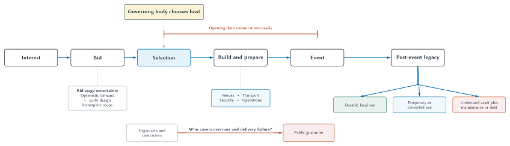
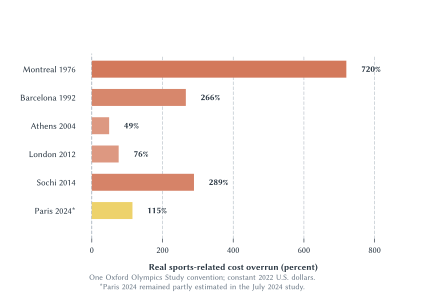

# The Olympics and Mega Sporting Events

The United States has won more Summer Olympic medals than any other national team. Brazil has won the men's World Cup five times. Germany has reached eight World Cup finals. Spain's 1-0 extra-time victory over Argentina in 2026 gave it a second title.[^world-cup-2026]

Those facts matter to people who receive no prize money, sell no television advertising, and never attend the event. A medal ceremony or World Cup final can become a shared national experience. Governments notice. Hosts speak about prestige, visibility, unity, tourism, investment, urban transformation, and proving that the country can deliver something difficult on a world stage.

Then the bills arrive.

The Olympics require venues for dozens of sports, athlete housing, transport, security, technology, ceremonies, volunteers, and years of preparation. A World Cup concentrates on one sport but spreads matches, teams, training sites, fans, and public services across many cities. The event owner—the International Olympic Committee or FIFA—receives valuable global media and sponsorship rights. Host governments make many of the costly location-specific investments and guarantees.

This creates an unusual economic bargain. Cities and nations compete for the right to host a temporary event whose global owner can choose among locations. The host commits before final demand, construction cost, and security needs are known. Once selected, it faces an opening date that is extraordinarily difficult to move.

Chapter 10 developed the basic ledger: define the counterfactual, separate new spending from substitution, remove leakages and crowding out, distinguish gross activity from net benefit, include opportunity cost, and value civic benefits without calling them GDP. This chapter applies that framework to events whose distinctive products are international attention, national prestige, and a promised legacy.

The central question is not whether the Olympics or World Cup are exciting. It is whether the host arrangement creates enough incremental value to justify its incremental cost and risk—and whether another design could produce the spectacle with less irreversible investment.

## Learning Goals

After reading this chapter, you should be able to:

- explain why an international mega-event differs from a permanent team stadium
- identify the IOC's and FIFA's roles as event-rights holders
- explain how competitive bidding can create a winner's curse
- explain why a fixed opening date changes cost and bargaining risk
- distinguish sports-related event cost from operations, security, and wider urban infrastructure
- interpret real cost-overrun evidence without mixing incompatible definitions
- apply Chapter 10's substitution, crowding-out, leakage, multiplier, and opportunity-cost concepts to a mega-event
- distinguish an organizing-committee surplus from a complete public benefit-cost result
- evaluate legacy claims relative to what would have happened without the event
- compare new-build, existing-venue, temporary, distributed, and recurring-event models
- explain why Los Angeles 1984 was unusual
- explain why Barcelona 1992 cannot be evaluated without separating the event from the urban strategy
- compare the institutional risks of the Olympics, men's World Cup, and Super Bowl
- explain how national prestige can be a real nonmarket benefit
- explain how rule-governed institutions can channel status competition toward more or less socially valuable activities
- interpret historical medal and World Cup tables without claiming that hosting caused success
- use a reuse-first checklist to evaluate a proposed host plan

## Prestige Is Real—But It Is Not Revenue

When Spain won the 2026 World Cup, millions of people received utility from a result they did not produce and could not buy individually. The celebration, identity, memory, and international recognition are real benefits in the ordinary economic sense: people value them.

They are not the same as revenue.

**National prestige** is the nonmarket value citizens or governments place on international sporting achievement, successful hosting, global visibility, or symbolic status. It can include pride, unity, diplomatic visibility, and the belief that the event demonstrates national competence or modernity.

::: quickconcept
**National Prestige**

National prestige is a potential benefit from international recognition, shared identity, sporting success, or successful delivery. Because it is not ordinarily sold in a market, it must be evaluated with evidence about willingness to pay, public priorities, and opportunity cost rather than counted as ticket or tourism revenue.
:::

Calling prestige nonmarket does not make it imaginary. Chapter 10 treated civic value from a local team in the same way. The problem begins when hosts use prestige as a vague residual large enough to cover any cost.

If citizens knowingly prefer an Olympics to an equal-cost alternative, their preference belongs in a welfare analysis. But the alternative must be visible. A billion dollars spent on event security, venue conversion, or debt service cannot also be spent on schools, health, housing, transport, tax relief, or a different cultural event.

::: warning
**Prestige Is Not The Same As Economic Return**

A memorable event can create national pride even if it does not raise long-run income. Report the prestige claim honestly, then compare it with the public cost. Do not convert applause, medals, television audiences, or favorable images into GDP without a mechanism and evidence.
:::

This distinction makes the debate more serious, not less. It allows a supporter to say, “I know this may not pay for itself through tourism, but I value the experience.” It also allows an opponent to ask, “How much are we paying for that experience, and who made the choice?”

## Reuse The Stadium Ledger—Then Add The Event Institution

The Chapter 10 public ledger still applies.

Potential benefits include genuinely new visitor spending, tax revenue, useful infrastructure, urban improvements, civic experience, national prestige, international visibility, and durable post-event use. Potential costs include venues, operations, security, housing, transport, land, disruption, displacement, debt, maintenance, conversion, and the opportunity cost of public resources.

Mega-events add several complications.

First, the event owner is mobile. The IOC or FIFA can select another host. Many of the host's investments are immobile once built.

Second, the event is temporary. A team venue can generate decades of home dates. An Olympic facility may face a completely different demand environment after two weeks of competition.

Third, the delivery date is fixed. A city can delay an ordinary rail or housing project. It cannot casually postpone the opening ceremony after athletes, broadcasters, sponsors, and spectators have planned around it.

Fourth, the project is a system. The Summer Olympics are not one stadium. They combine specialized venues, villages, transport, security, technology, ceremonies, and thousands of workers and volunteers.

Fifth, the political scale is often national even when the fiscal burden is local. A host city can bear costs for a spectacle valued across the country. A national government can pursue soft power while residents near venues bear congestion or displacement.

| Institutional feature | Summer Olympics | Men's FIFA World Cup | Super Bowl |
| --- | --- | --- | --- |
| Event owner | IOC and Olympic movement institutions | FIFA | NFL |
| Basic product | multi-sport festival | one-sport international tournament | one championship game plus related events |
| Venue pattern | many specialized and general venues | multiple large football stadiums and training sites | principally one existing NFL stadium |
| Geographic pattern | city/region, increasingly flexible | multiple cities; sometimes multiple countries | one host market |
| Fixed-date exposure | extremely high | extremely high | high, but narrower physical system |
| Construction exposure | potentially extensive; depends on reuse | potentially extensive; lower when suitable stadiums exist | normally limited because main venue exists |
| Public obligations | guarantees, transport, security, public services, infrastructure | host commitments, security, transport, fan and team operations | security, transport, public space, fan events |
| Organizer's major revenue | media, sponsorship, ticketing and licensing arrangements | media, sponsorship, ticketing and licensing arrangements | league media, sponsorship, ticketing and hospitality |
| Central legacy problem | specialized venues and village use after event | stadium use and distributed infrastructure | short event legacy; promotional claims and service costs |

**Table 11.1: Three different event institutions.** The table compares the allocation of tasks and risk, not total costs. A reuse-heavy Olympics can require less construction than a new-build World Cup, while a Super Bowl can still impose significant host-service obligations.

The institutional comparison is why Chapter 11 should follow stadiums but remain a separate chapter. It uses the same economics, then adds temporary hosting, global governing bodies, national prestige, and legacy.

## The Host Does Not Own The Whole Product

A host city supplies the place, but it does not own the Olympics or World Cup. This is easy to miss because television coverage wraps the event in the host's landmarks, language, and national symbols.

The event-rights holder controls a scarce global product. It sets many competition and commercial conditions, selects the host, coordinates international sport bodies, and controls central media, sponsorship, licensing, and branding rights. The host supplies complementary inputs that cannot be moved after investment: venues, roads, public space, police, transport systems, local staff, and political guarantees.

This division creates bargaining asymmetry.

Before selection, several potential hosts may compete to offer attractive terms. After selection, the governing body still owns the event, while the chosen host has begun investing in a location-specific delivery system. The host's ability to threaten to walk away falls as construction and reputation commitments accumulate.

The arrangement does not mean the IOC or FIFA captures every dollar. Host organizing committees receive agreed revenue streams, ticket income, local sponsorship opportunities, or contributions under edition-specific contracts. Nor does it mean the event owner bears no risk. A failed event would damage its brand and future commercial value.

The point is comparative: the host often bears a large share of the marginal local delivery risk without owning the entire commercial product.

This helps explain a recurring rhetorical mismatch. A host announces global media audiences as evidence of local benefit, while the financial value of those audiences may belong substantially to the event owner and its partners. Exposure can still benefit the host through tourism, reputation, or business relationships, but that requires a second causal step:

$$
\text{global attention}
\rightarrow
\text{changed beliefs or behavior}
\rightarrow
\text{durable host benefit}.
$$

The first arrow is not automatic. A viewer can enjoy the final without remembering the host city, changing a travel plan, or investing there. The second arrow can also fade after the event. A useful evaluation identifies the audience, the message, the behavior expected to change, and the length of the effect.

::: quickconcept
**Attention Is An Input, Not The Final Benefit**

A mega-event can generate extraordinary attention. The host benefits only if that attention changes tourism, investment, trade, identity, or some other valued outcome relative to the counterfactual. Audience size alone does not measure the host's return.
:::

## From Greek *Agōn* To The Modern Olympics

The modern Olympics began in Athens in 1896. Early Games were smaller, less standardized, and less dependent on global broadcasting and specialized facilities. Over time the Olympics became a media product, a sponsorship platform, a diplomatic stage, and one of the world's largest planned events.

The name reaches back to the ancient Greek Games, first recorded in 776 BCE and held within a religious and civic institution. Ancient victors brought honor to themselves and their city-states. The modern event is not a continuous business organization from antiquity, but the comparison is useful: sporting contests created identity and political meaning long before broadcasting contracts. Economics enters because people value status and collective symbolism even when those benefits are not sold as ordinary output.

### *Agōn*: Where Does Status Competition Go?

The ancient Olympics were Greek before they were international. They were held at the sanctuary of Zeus at Olympia and belonged to a circuit of Panhellenic—literally “all-Greek”—religious festivals. Competitors and spectators arrived from politically independent communities across the Greek-speaking world. The gatherings did not create a Greek nation in the modern sense, but they provided one of the few settings in which people from many city-states performed a shared Greek identity.[^ancient-agon]

The Greek word *agōn*, often written *agon* in English, referred to an organized gathering or contest. Greek competitive culture extended well beyond running, wrestling, and chariot racing. Poetry, drama, music, public speaking, politics, and warfare could all become arenas for distinction. The central Olympic contests were principally a male status arena in which victory demonstrated *aretē*—excellence—and earned honor for the victor, his family, and often his *polis*.

This suggests an economic interpretation. The desire for distinction does not disappear when society becomes more orderly. Institutions can instead influence where competitive effort goes. A man seeking prestige might pursue it through conquest, political predation, or the extraction of favors. He might instead pursue it in a rule-governed athletic contest. Modern societies similarly award status through scientific discovery, entrepreneurship, artistic achievement, and sport.

The status prize itself remains positional: only one runner wins a race, and raising one person's rank necessarily lowers someone else's. But the process used to allocate that status need not be zero-sum. Training can produce extraordinary performance. Scientific rivalry can generate knowledge. Entrepreneurial rivalry can create products. Artistic competition can produce work valued even by people who never win a prize. A society can therefore redirect status competition toward activities that are productive—or at least less destructive—without eliminating the underlying desire to excel.

William Baumol made a closely related argument about entrepreneurship. Societies do not merely receive a fixed amount of “good” or “bad” entrepreneurial energy. Their rules and rewards help determine whether ambitious people pursue innovation and production or rent seeking, manipulation, and organized crime. The Olympics are not an example from Baumol's paper, but the analogy is useful: institutions shape the payoff to different ways of competing.[^baumol-entrepreneurship]

::: quickconcept
**Institutions Channel Competition**

Institutions need not eliminate ambition, rivalry, or the desire for status. They change the activities through which people can earn rewards and prestige. The social value of competition therefore depends not only on how intensely people compete, but also on the rules of the tournament and what those rules reward.
:::

This interpretation should remain modest. The Olympics did not pacify ancient Greece, substitute fully for warfare, or prevent cheating, political rivalry, and costly status seeking. Nor can we prove that the Games evolved to redirect a deep human impulse. The defensible claim is narrower: organized contests gave competitive ambition another institutional arena, and institutions can channel persistent rivalry into activities with very different social consequences.

Three developments changed the economic scale.

### National Competition

The Olympics became a visible comparison among political systems and nations. Medal tables compress hundreds of contests into a simple hierarchy. Berlin 1936 demonstrated the propaganda value a government could seek from hosting. Cold War competition turned Olympic success into evidence—often exaggerated—about national institutions. Boycotts in 1980 and 1984 showed that governments treated participation as foreign policy as well as sport.

National meaning creates demand for hosting and for elite-sport investment. It also makes ordinary benefit-cost discipline politically difficult. A rail project can be delayed; a promised global demonstration of national competence is harder to scale back publicly.

### Broadcasting And Sponsorship

Television converted the Olympics from an event experienced mainly by people in the host city into a global media product. The rights holder could sell access to an international audience, while sponsors could associate brands with the Games.

This revenue helped finance event operations and made the Olympics more valuable to the IOC. It did not automatically finance every host investment. The governing body can receive global commercial revenue while the host finances location-specific security, transport, venues, and guarantees.

That division resembles the stadium ledger. The party receiving a revenue stream and the party paying for the complementary asset need not be the same.

### Scale And Standardization

The number of sports, athletes, media personnel, technical requirements, and security needs increased. International federations have venue and competition standards. Hosts promise an athlete village, transport performance, technology, ceremonies, and public services.

Standardization can improve the event. It can also reduce the host's ability to adapt scope to local post-event demand. A velodrome or aquatics center designed for Olympic competition may be valuable later, but that must be established from ordinary use rather than assumed from Olympic quality.

## Why Bidding Can Produce A Winner's Curse

Suppose several cities want to host. Each estimates future tourism, sponsorship, construction cost, security, and prestige. The estimates contain error. The most optimistic city can offer the strongest guarantees or most ambitious plan.

Even if every city tries to forecast honestly, the winner may be the city with the largest positive forecasting error. This is the **winner's curse**: winning a competitive contest can reveal that the winner overestimated value or underestimated cost.

::: quickconcept
**Mega-Event Winner's Curse**

When uncertain hosts compete, the most optimistic estimate is more likely to win. The selected host can discover that it won partly because it valued the event too highly, forecast demand too generously, or underestimated delivery cost.
:::

The mechanism becomes stronger when officials receive political credit for winning the bid while much of the cost arrives years later. Consultants, construction interests, sport organizations, and civic boosters can have concentrated reasons to support the proposal. Future taxpayers and users of displaced public services are more diffuse.

Competition does not make every bid irrational. It means the winning forecast deserves more skepticism, not less.

## A Fixed Date Changes Everything

An ordinary project manager can trade among cost, scope, and schedule. If a problem appears, the project can delay, simplify, or spend more.

An Olympic host has much less flexibility. The opening date has been announced globally. Broadcasters sold advertising. Athletes planned training cycles. Sponsors activated campaigns. Tickets and travel were sold. National leaders promised delivery.

If an essential venue is unfinished, “open next year” is barely an option. The host can reduce some scope, but competition requirements and public commitments limit the adjustment. Spending more becomes the available margin.

Research on Olympic megaprojects emphasizes this fixed-deadline mechanism. Host governments are commonly required to guarantee delivery and cover shortfalls, while sports bodies specifying important requirements do not necessarily bear the marginal local overrun.[^olympic-tail-risk]

::: quickconcept
**A Fixed Deadline Changes Bargaining**

Before selection, a host can withdraw or redesign. As the opening date approaches, unfinished essential work gives contractors, suppliers, and governing bodies greater leverage because delay is extremely costly to the host.
:::

This is a form of **hold-up risk**. After the host makes location-specific commitments, its outside options deteriorate. A contractor's delay, security change, design requirement, or unexpected site problem can demand more resources when replacement or postponement is difficult.

The lesson is not that every contractor exploits the host. It is that contracts, contingencies, scope control, and public guarantees matter more when the deadline cannot move.

**Figure 11.1: Host risk changes across the event lifecycle.** Hosts bid before final scope and demand are known. Selection and a difficult-to-move opening date reduce the ability to delay or abandon essential work. The eventual legacy depends on durable post-event use and on who bears overruns, maintenance, conversion, and debt.

::: aifiguredescription
**Figure description: fig:ch11-host-risk-lifecycle**

The schematic contains six stages arranged from left to right: Interest, Bid, Selection, Build and prepare, Event, and Post-event legacy. Above Selection, a governing-body node points downward to show the choice of host. Below Bid, a box lists optimistic demand, early design, and incomplete scope as possible bid-stage risks rather than facts about every bid. A red horizontal bar runs from Selection to Event and is labeled “Opening date cannot move easily.” Under Build and prepare, a box lists venues, transport, security, and operations. Near the bottom, an arrow runs from organizers and contractors toward a public guarantor and asks, rather than assumes, “Who covers overruns and delivery failure?” The Post-event legacy stage branches to durable local use, temporary or converted use, and an underused asset with maintenance or debt. The figure is schematic. It does not assert that every event overruns, that every public guarantor bears the same contract, or that every specialized venue becomes a white elephant.
:::

## What Does “The Olympics Cost” Mean?

Cost comparisons often fail before the arithmetic begins. One source reports organizing-committee operations. Another adds venues. A third adds rail, airports, housing, security, and every urban project completed near the event.

At least four categories should be separated:

1. **Organizing costs:** administration, ceremonies, event staff, technology, temporary operations, and competition delivery.
2. **Sports-related capital costs:** competition venues, athlete villages when included under a defined convention, and directly required sports facilities.
3. **Security and public services:** policing, emergency services, border operations, crowd management, and host-city services.
4. **Wider infrastructure:** rail, roads, airports, housing, parks, waterfronts, and urban redevelopment.

The categories can all matter. They cannot be compared as if they were the same measure.

Wider infrastructure creates the hardest attribution question. A useful subway line does not become waste because it was completed before the Games. But the full value also should not be credited to the Olympics if the line was already needed and would have been built. The event's incremental effect may be acceleration, changed routing, higher cost from deadline pressure, or political coordination.

::: keypoint
**Legacy Claims Need Opportunity-Cost Analysis**

A venue, village, rail line, park, or waterfront can produce lasting value. The host must still ask whether the project would have occurred without the event, whether the event improved or distorted it, and whether a less costly design could have produced the same legacy.
:::

This is why a consistent narrow cost series can be more useful than an impressive “all-in” number. A narrow measure does not answer every question, but it allows a valid comparison across hosts.

## Comparable Olympic Cost Overruns

The Oxford Olympics Study 2024 compares sports-related Olympic costs in constant 2022 U.S. dollars and measures overruns from bid-stage estimates in real terms. It excludes wider roads, rail, airports, hotels, and much other urban infrastructure.[^oxford-2024]

For 23 Games with comparable data from 1960 through Paris 2024:

- every Games overran its bid budget in real terms
- the mean overrun was 159 percent
- the median overrun was 118 percent
- 13 of 23 exceeded their budgets by more than 100 percent

| Games | Real sports-related cost overrun |
| --- | ---: |
| Montreal 1976 | 720% |
| Barcelona 1992 | 266% |
| Athens 2004 | 49% |
| London 2012 | 76% |
| Sochi 2014 | 289% |
| Paris 2024 | 115%* |

**Table 11.2: Selected comparable Olympic cost overruns.** Values are from one study convention, measured in real terms from bid to outturn. Paris 2024 remained partly estimated when the July 2024 study was completed. The table covers sports-related costs, not every urban, security, or transport expenditure.

**Figure 11.2: Selected real sports-related Olympic cost overruns.** The bars use the Oxford Olympics Study 2024 convention and one constant-price basis. They compare bid-stage estimates with final sports-related outturn costs; they do not rank total urban cost, social waste, or net benefit. Paris 2024 remained partly estimated at the study date.

::: aifiguredescription
**Figure description: fig:ch11-olympic-cost-overruns**

The chart uses six horizontal bars and a common scale from zero to 800 percent. Montreal 1976 is 720 percent, Barcelona 1992 is 266 percent, Athens 2004 is 49 percent, London 2012 is 76 percent, Sochi 2014 is 289 percent, and Paris 2024 is 115 percent. Paris is shown in a contrasting gold bar with an asterisk because its outturn remained partly estimated in the July 2024 study. Every value uses the Oxford Olympics Study 2024 definition of real sports-related costs in constant 2022 U.S. dollars, comparing the bid-stage estimate with outturn. The chart excludes much wider urban infrastructure, transport, and security spending and therefore is neither an all-in cost ranking nor a benefit-cost analysis. A larger bar indicates a larger percentage forecasting gap under this convention; it does not establish that every included asset was worthless.
:::

The data show risk, not automatic waste. A 49 percent overrun can accompany useful venues; a 266 percent overrun can occur within a broader urban transformation. But a bid budget that repeatedly understates real outturn cost is not a reliable decision price.

::: warning
**Do Not Mix Cost Definitions To Create A Ranking**

Montreal's sports-related outturn, a newspaper's total public debt figure, and a World Cup host's all-in infrastructure estimate cannot be placed in one column without reconciling scope, price year, and accounting boundary.
:::

The most important number for a prospective host is not the historical average alone. It is the distribution of outcomes and who bears the tail. A guarantee can leave taxpayers exposed precisely when construction, security, or revenue conditions turn out worse than expected.

## Five Olympic Cases That Should Not Be Reduced To One Verdict

The most useful host cases illustrate different mechanisms. Calling each one a “success” or “failure” discards the economics.

### Montreal 1976: The Overrun And Debt Case

Montreal is remembered for the “Big Owe,” the Olympic Stadium whose financing burden lasted for decades. Under the Oxford study's consistent sports-cost definition, Montreal had a 720 percent real overrun—the largest Summer Games overrun in the dataset.[^oxford-2024]

The case shows how ambitious architecture, incomplete early estimates, construction problems, and public guarantees can outlive the festival. It also shows why a final operating statement is not the same as the public ledger. Ticket and broadcasting revenue can cover part of event operations while capital debt remains with public entities.

Montreal should not be used to claim that every Olympic facility remains empty. The narrower lesson is strong enough: a temporary event can create a long-lived financing obligation when venue risk is allocated to the host.

### Los Angeles 1984: Existing Capacity And Bargaining Leverage

Los Angeles 1984 is the famous financial exception. The organizing committee generated a large surplus, used extensive existing facilities, relied heavily on broadcasting and exclusive sponsorship, and built little new permanent capacity. The resulting foundation continued to support youth sports in Southern California.[^la-1984]

Those facts are important. So are the conditions behind them.

Los Angeles already possessed the Coliseum, Rose Bowl, university venues, professional-sports facilities, hotel capacity, media infrastructure, and a large regional economy. The city also gained unusual leverage after other bidders withdrew. Voters restricted uncompensated city capital spending. New permanent venues were limited and supported by corporate partners.

::: casestudy
**Los Angeles 1984 And The Value Of Existing Capacity**

Los Angeles did not discover a management trick that any city can copy. It combined a large stock of useful venues with bargaining leverage, commercial revenue, limited new construction, and political limits on public exposure.

The transferable lesson is **reuse capacity you already want**. The nontransferable assumption is that every aspiring host has Los Angeles's venue stock, media market, sponsor demand, climate, and bargaining position.
:::

An organizing surplus is still not identical to a total regional net benefit. Public services, congestion, and visitor displacement remain relevant. But Los Angeles demonstrates that an event can be structured with much lower irreversible investment when the host begins with valuable capacity.

### Barcelona 1992: Event Or Urban Strategy?

Barcelona is often presented as the Olympics that transformed a city. The Games were connected to waterfront redevelopment, roads, public space, communications, and a larger strategy of opening the city to the sea.

That creates an identification problem. Did the Olympics produce the transformation? Did they accelerate a plan that already made sense? Did a fixed deadline improve coordination, or did it raise cost? Would the city have chosen the same projects, locations, and schedule without the Games?

The Oxford data report a 266 percent real sports-cost overrun for Barcelona. That does not erase the value of an improved waterfront. It prevents the chapter from treating attractive urban results as proof that the event itself paid for them.

::: casestudy
**Barcelona 1992: Event Or Urban Strategy?**

The strongest case for Barcelona is not “tourists paid for the Olympics.” It is that the event helped coordinate and accelerate a broader urban strategy.

The evaluation must therefore compare the Olympic plan with the best non-Olympic urban plan. Credit the event only for incremental coordination, timing, visibility, or investment—and count any deadline pressure, altered priorities, and sports costs.
:::

Barcelona offers a valuable but dangerous model. Later hosts can imitate the language of transformation without possessing a coherent pre-existing plan.

### Athens 2004: Post-Event Demand Matters Before Construction

Athens combined event delivery, major security needs, new and renovated venues, and infrastructure in a country with limited fiscal flexibility. Some facilities found later uses; others became symbols of weak legacy planning.

It is too strong to claim that the Olympics caused the Greek sovereign-debt crisis. Greece's later crisis had much larger fiscal, financial, and institutional causes. It is fair to say that Olympic liabilities, hurried delivery, and later maintenance added pressure and illustrated the cost of specialized assets without durable demand.[^olympic-economics]

The economic error occurs when post-event use is treated as a future problem. Expected ordinary demand belongs in the original investment decision. If local clubs, schools, residents, and events will not cover a facility's operating and maintenance cost, the white-elephant risk exists before ground is broken.

### Sochi 2014: Sport, Regional Development, And Political Purpose

Sochi was more than a Winter Olympics. It was a national political project, a regional-development program, and a display of Russian capability. The Oxford study reports $28.9 billion in sports-related outturn cost in constant 2022 dollars and a 289 percent real overrun.[^oxford-2024]

Other sources report larger all-in figures by including rail, roads, hotels, and regional infrastructure. Those numbers can be appropriate for a different question, but they should not be mixed with the narrower Oxford measure in the same chart.

Sochi reveals why prestige can expand scope. If the objective includes transforming a region and demonstrating state capacity, the chosen project may be much larger than the least-cost plan for staging competitions. That may reflect government preferences, but the extra political objective should be named and priced rather than hidden inside “Olympic cost.”

## Corruption, Scarce Rights, And Governance

The right to host or commercially exploit a global event is valuable and scarce. Decisions are made by sport officials acting on behalf of organizations, athletes, and fans. Governments and firms can gain enormously from selection or a marketing contract. That combination creates a principal-agent problem: the person influencing the award may not bear the cost of a bad choice and may have opportunities to receive private benefits.

The major FIFA prosecutions beginning in 2015 made the risk concrete. The U.S. Department of Justice charged officials and marketing executives in a long-running corruption case involving more than $150 million in alleged bribes and kickbacks connected to media, marketing, and tournament rights.[^fifa-corruption] The charges did not prove that every FIFA decision or host award was corrupt. They demonstrated that valuable global rights, opaque processes, and weak accountability can support systematic rent seeking and criminal conduct.

The economic damage extends beyond the payment itself.

- A corrupt award may select a less suitable host or contractor.
- Firms spend resources seeking influence rather than improving delivery.
- Officials can favor ambitious commitments that benefit private parties while taxpayers bear risk.
- Public distrust can reduce support for otherwise defensible events.
- Secrecy makes independent cost and benefit review harder.

Governance reforms can include published criteria, independent ethics and audit bodies, conflict disclosures, transparent contracts, whistleblower protection, competitive procurement, and public reporting of guarantees. None eliminates every incentive problem. They make decisions easier to verify and raise the cost of misconduct.

::: warning
**A Corruption Risk Is Not Proof About A Particular Bid**

Scarce rights and weak transparency create opportunities for bribery and favoritism. A claim that a named host, official, or vote was corrupt still requires case-specific evidence. Use governance failures to improve institutions, not to replace proof with suspicion.
:::

## The IOC's Response: Flexibility And Reuse

After costly Games and multiple bid withdrawals, the IOC changed its host process and promoted more flexible venue planning. Olympic Agenda 2020 and the New Norm emphasize alignment with long-term plans, existing and temporary venues, and the ability to distribute events across a region or beyond traditional city boundaries.[^ioc-reform]

The direction makes economic sense. Reuse can reduce:

- irreversible event-specific construction
- post-event maintenance obligations
- specialized white-elephant risk
- construction schedules exposed to the opening deadline
- pressure to invent future demand for a venue

Temporary capacity can also help. A host can build seating or competition space for peak event demand and remove it afterward rather than maintaining it for decades.

Distribution across cities or countries expands the set of existing venues. It also creates tradeoffs:

- more travel for athletes, staff, and spectators
- more security and border coordination
- a less compact fan experience
- complex allocation of costs and revenues
- greater dependence on transport networks

Official IOC material reported that 95 percent of Paris 2024 venues were existing or temporary.[^ioc-reform] That is meaningful evidence about the venue plan. It does not establish that total Games cost was low. The Oxford study still estimated a 115 percent real sports-cost overrun at its July 2024 study date.

This is not necessarily a contradiction. Reuse can reduce the counterfactual cost relative to a new-build design while other costs, early estimates, inflation treatment, temporary overlay, operations, or scope still produce an overrun. A reform should be evaluated against what would have happened without it, not against a promise that every problem will disappear.

## Why The Supply Of Willing Hosts Declined

For much of the modern era, the IOC could organize a formal competition among candidate cities. Rising cost awareness and public opposition weakened that model, especially for the Winter Games.

The important pattern is not one dramatic withdrawal. It is a series of local decisions:

- Kraków's 2022 Winter proposal lost a municipal referendum.
- Oslo withdrew from the 2022 process when national political support for guarantees failed.
- Hamburg voters rejected a 2024 Summer bid.
- Boston ended its 2024 effort amid weak public and political support.
- Calgary voters rejected a 2026 Winter bid.

Academic reviews of the 2022 and 2026 Winter cycles describe numerous referenda, withdrawals, and political reversals.[^declining-bids] Democratic publics became less willing to sign an open-ended guarantee before final scope and cost were known.

The 2017 decision to award Paris 2024 and Los Angeles 2028 together was a revealing institutional response. Rather than risk losing one of two attractive remaining partners in a later contest, the IOC secured both editions. The later Future Host system uses continuing dialogue and more flexible timing instead of relying only on a dramatic one-cycle auction.[^ioc-future-host]

This changes bargaining in two directions.

With fewer bidders, the IOC loses some ability to make hosts compete through ever-larger promises. But it can focus on places with extensive capacity or governments especially willing to prioritize prestige. Potential hosts can also negotiate earlier and design around existing assets.

Climate makes the Winter problem sharper. Reliable snow and suitable terrain limit geography, while specialized sliding, ski-jump, and ice facilities have narrow post-event markets. Wealthy winter-sport regions can reuse capacity; other candidates face expensive construction for a smaller event.

The changing supply of hosts therefore supports two models:

1. **Reuse-first hosts** with deep existing sport, transport, hotel, and media capacity.
2. **Prestige-first hosts** willing to accept large public cost for political or strategic objectives.

The categories can overlap. The key is that a thinner bidder pool is not simply bad news for the Olympics. It is feedback from potential hosts about the old contract's cost and risk.

## A Reuse-First Host Test

A strong host plan starts with assets that residents already want.

For every proposed permanent venue, ask:

1. Who will use it in an ordinary year after the event?
2. At what price and frequency?
3. Who will cover operations, maintenance, renovation, and conversion?
4. Would the same facility be built without the event?
5. Can existing, temporary, smaller, or distributed capacity do the job?
6. Does the event deadline distort the location or timing?

A new facility can pass this test. A growing city may need an arena, pool, transit link, or housing. The event can coordinate delivery or provide commercial revenue. But “legacy” is not a magical future market. It is a forecast of actual users, services, costs, and alternative uses.

The strongest plan often looks less spectacular in the bid book. It promises less event-specific construction and more ordinary post-event usefulness.

## The FIFA World Cup: One Sport, A Different Scale

The men's World Cup shares several Olympic features. FIFA owns a scarce global event. Hosts compete for selection. Governments commit security, transport, venues, fan services, and guarantees. Media, sponsorship, ticketing, and licensing create substantial central commercial value.

The physical system differs. The World Cup needs many large football stadiums and training sites, but it does not require purpose-built venues for cycling, rowing, equestrian events, aquatics, gymnastics, and dozens of other sports. Existing football capacity can therefore change the capital problem dramatically.

The tournament also creates a geographic choice. A compact host can reduce travel but may require more construction. A distributed host can reuse stadiums but impose more travel, coordination, and uneven local obligations.

### Brazil 2014

Brazil used twelve host cities and invested heavily in stadiums and related infrastructure. Some venues were located in markets with limited ordinary demand after the tournament. A study of all twelve World Cup arenas from 2014 through 2019 found sharply uneven use, with some arenas hosting few matches and others used heavily.[^brazil-venue-use] The case is useful for the white-elephant problem: a world-class stadium can be technologically successful and economically mismatched with its later market.

Brazil also demonstrates why national totals conceal local incidence. A stadium may be a political symbol for a region while operating losses fall on a public authority and FIFA's global event revenue leaves the host system.

### Qatar 2022

Qatar combined a compact tournament, extensive new construction, national-branding and diplomatic objectives, and serious controversy over migrant labor and rights.[^qatar-labor] Its small size reduced some internal travel, while climate required an unusual calendar and major technical adaptation.

The chapter should not pretend that every input can be summarized in dollars. Labor conditions, rights, displacement, and political legitimacy are distributional and ethical concerns as well as possible economic costs. A host can deliver technically impressive venues while raising questions about who bore the human cost.

### Canada, Mexico, And The United States 2026

The completed 2026 tournament used 16 stadiums across three countries, expanded to 48 teams and 104 matches, and relied largely on existing major venues.[^world-cup-scale] Mexico City hosted the opener, while the final took place at New York New Jersey Stadium. Spain defeated Argentina 1-0 after extra time on July 19.[^world-cup-2026]

::: casestudy
**The 2026 World Cup: Three Countries, Existing Stadiums, New Scale**

The 2026 tournament succeeded in large part because the hosts did not have to build an entirely new network of 16 permanent stadiums. North America already possessed large, modern venues with established operators, transportation connections, premium facilities, and ordinary post-event uses. The tournament could therefore expand to unprecedented scale without making a comparable expansion in irreversible stadium construction.

It did not eliminate cost. Stadiums required conversion and event preparation. Forty-eight teams used base camps and training sites. Security, border operations, transport, fan events, scheduling, and public services stretched across a continent.

Existing capacity changed the risk bundle. It did not turn host inputs into free resources.

That caution should not obscure the outcome. By the tournament organizer's operational and commercial measures, 2026 was a striking success. FIFA reported 6.8 million spectators and 99.7 percent of available seats filled. The final averaged 38.9 million viewers on Fox alone and more than 60 million across the principal English- and Spanish-language U.S. broadcasts. FIFA described its worldwide media-rights program as record-breaking and expected revenue for the full 2023-2026 cycle to exceed $15 billion.[^world-cup-2026-success]
:::

::: quickconcept
**Ratings Are Not Rights Revenue**

A television rating measures audience demand. Rights revenue is the fee a broadcaster agreed to pay for access to that audience. If the fee is fixed before unexpectedly strong demand appears, the broadcaster can capture much of the upside through advertising.

The 2026 U.S. English-language rights illustrate the distinction. FIFA extended Fox's contract without a new auction after moving the 2022 Qatar tournament into the fall disrupted the original rights package. The enormous 2026 audience therefore demonstrated how valuable future U.S. rights may be without allowing FIFA to reprice the Fox contract after the fact. A competitive future auction could transfer more of that value from broadcasters to FIFA.[^world-cup-media-rights]
:::

The tournament is a strong example of modern mega-event design. Reuse was not a minor cost-saving detail; it was the foundation of the successful host model. Existing facilities removed much of the construction-overrun, completion-deadline, and post-event white-elephant risk that burdens other mega-events. Distribution then allowed FIFA to match an expanded tournament with North America's large stadiums, event-management capacity, and valuable commercial market. The correct comparison is not “costly” versus “free.” It is one bundle of risks versus another—and the reuse-based 2026 bundle worked exceptionally well for FIFA and its audiences.

That success makes a North American return plausible sooner than the old once-in-a-generation pattern might suggest. The 2030 and 2034 tournaments are already assigned elsewhere, but under FIFA's current confederation-rotation approach, a Concacaf bid could be eligible for 2038. Rules can change, other eligible bidders may emerge, and an attractive event for FIFA is not automatically a good fiscal deal for every host city. Still, 2026 strengthened the economic case for returning to regions that can supply large existing venues and a deep commercial market without building an entirely new stadium system.[^world-cup-future-host]

## Tourism, Security, And Who Bears The Event

Visitor spending is the most intuitive short-run benefit. International supporters buy rooms, meals, local transport, tickets, and entertainment. For a host with spare capacity and strong local supply chains, this can create meaningful new income.

The Chapter 10 filter still comes first.

Some spectators replace ordinary tourists who avoid crowds or high prices. Some residents leave during the event. Hotels can be full while the number of occupied rooms changes little; the main effect may be a transfer toward room owners through higher prices. Imported food, nonlocal event contractors, international airlines, and outside owners create leakages. Ticket payments may flow through the organizer rather than remaining in the host economy.

The time window matters too. A visitor who moves a planned vacation from May to July adds less annual tourism than a visitor who otherwise would have gone to another country. An event can produce a dramatic two-week spike with little effect on the year.

Security illustrates the opposite side of the ledger. A safe event is valuable and necessary, but security spending is a resource cost, not a benefit merely because it creates jobs. Police assigned to venues cannot simultaneously perform other duties. Overtime, equipment, intelligence, emergency preparation, and border operations can have benefits beyond the event, but those incremental benefits must be identified.

The distribution can matter even when total measured welfare is positive.

- Hotel owners may gain from higher prices while ordinary travelers and local firms lose access.
- Residents near venues may bear noise, checkpoints, congestion, or displacement.
- National taxpayers may finance an event concentrated in one region.
- Volunteers may receive experience and enjoyment while replacing some paid labor.
- Construction workers can gain income while future budgets bear debt and maintenance.
- Sponsors and rights holders can capture commercial value created partly by public services.

These are not reasons to reject an event automatically. They are reasons to report who gains, who pays, and when.

Environmental claims deserve the same discipline. Reusing venues can reduce embodied construction emissions. Distributed events can increase air and ground travel. A transit investment can produce long-run environmental benefits if residents use it later. Temporary structures avoid decades of underuse but require materials, assembly, and disposal. “Sustainable Games” is a hypothesis about the complete design and counterfactual, not a label created by one recycled venue.

::: warning
**A Full Hotel Is Not A Benefit-Cost Study**

High occupancy can reflect new visitors, displaced ordinary visitors, higher prices, or a shift in timing. Measure incremental annual demand, local income retained, public service cost, and the alternative use of scarce capacity.
:::

This distributional analysis also clarifies political consent. A national majority can value prestige while residents near a venue bear concentrated disruption. Compensation, consultation, housing protection, and transparent budgeting are part of event design, not distractions from economics.

## World Cup Finals And National Memory

World Cup titles are scarce. Only eight national teams have won the men's tournament through 2026.

| Team | Titles | Runner-up finishes | Final appearances |
| --- | ---: | ---: | ---: |
| Brazil | 5 | 2 | 7 |
| Germany | 4 | 4 | 8 |
| Italy | 4 | 2 | 6 |
| Argentina | 3 | 4 | 7 |
| France | 2 | 2 | 4 |
| Spain | 2 | 0 | 2 |
| Uruguay | 2 | 0 | 2 |
| England | 1 | 0 | 1 |
| Netherlands | 0 | 3 | 3 |
| Czechoslovakia | 0 | 2 | 2 |
| Hungary | 0 | 2 | 2 |
| Croatia | 0 | 1 | 1 |
| Sweden | 0 | 1 | 1 |

**Table 11.3: Men's World Cup titles and finals through 2026.** The table aggregates West Germany into Germany. The 1950 tournament used a final group rather than a knockout final; Uruguay's decisive victory over Brazil identifies champion and runner-up for this compact summary. Source rows and validation are in the Chapter 11 data package.[^world-cup-data]

The table measures sporting history, not host performance. Brazil's five titles do not establish that Brazil 2014 produced a positive public return. Spain's victory in a North American tournament does not show that any host city's spending caused Spanish success.

The prestige can still be valuable. A final appearance becomes part of national memory and can strengthen demand for participation, media, sponsorship, and future tournaments. The causal links must be studied rather than assumed.

## Olympic Medal Counts—And Their Traps

Olympic medal tables create an even greater temptation to overinterpret. Programs expanded. Team events award one medal in the table while many athletes receive medals. Countries formed, divided, merged, boycotted, and changed names. Women gained access to far more events. Some nations participated across nearly the entire modern history; others did not exist in their current form.

The table below aggregates only identical historical Olympedia NOC codes. It does not combine the Soviet Union with Russia, East Germany with Germany, the Unified Team with successor states, or mixed teams with a nation.

| Historical team or NOC | Gold | Silver | Bronze | Total |
| --- | ---: | ---: | ---: | ---: |
| United States | 1,110 | 885 | 788 | 2,783 |
| Soviet Union | 395 | 319 | 296 | 1,010 |
| Great Britain | 305 | 345 | 342 | 992 |
| People's Republic of China | 303 | 226 | 198 | 727 |
| Germany | 249 | 277 | 298 | 824 |
| France | 247 | 283 | 307 | 837 |
| Italy | 234 | 206 | 229 | 669 |
| Japan | 189 | 162 | 193 | 544 |
| Hungary | 188 | 163 | 183 | 534 |
| Australia | 180 | 189 | 225 | 594 |

**Table 11.4: Leading historical Summer Olympic teams through Paris 2024, ranked by gold medals and then total medals.** Totals aggregate identical Olympedia NOC codes across 30 Summer Games from 1896 through 2024. Historical entities remain separate. Program size, participation, boycotts, and political boundaries changed substantially.[^olympic-medal-data]

Notice that France has more total medals than China while China has more gold. Germany has more total medals than China but fewer gold. A ranking rule changes the order.

::: warning
**Medal Tables Do Not Prove That Hosting Pays**

Medal totals can describe sporting prestige. They do not establish that hosting caused medals, that medals increased national income, or that the value of prestige exceeded event cost.
:::

The table is best used to start questions:

- How much reflects population, income, history, sport institutions, and event specialization?
- How did boycotts and political change alter opportunity?
- Does hosting affect medal performance temporarily?
- Do citizens value medals enough to support elite-sport spending?
- Which outcomes persist after the event?

Those are empirical questions. The total itself is not an answer.

## Why The Super Bowl Is Different

The Super Bowl attracts visitors, media, sponsors, security, fan festivals, and promotional economic-impact studies. It still belongs in the chapter's framework.

But it is normally played in an existing NFL stadium. Las Vegas hosted the 2024 game at Allegiant Stadium, a venue already used by the Raiders and other events. The host did not construct a network of specialized facilities for a two-week multi-sport festival.

::: sideline
**A Super Bowl Is A Boundary Case**

A Super Bowl can create meaningful short-run visitor demand and public-service cost, but it usually avoids the central Olympic legacy problem: a large collection of event-specific permanent venues.

It still requires a counterfactual. Full hotels can reflect new visitors, higher prices, displaced ordinary travelers, or all three.
:::

The Super Bowl therefore sits near the reuse end of the mega-event spectrum. Its narrower physical requirement makes it easier to isolate event operations from venue construction. That does not make every impact claim correct; it makes the capital and legacy problem different.

## Can Hosting Still Be Worth It?

Yes—but the conditions are demanding.

A host has a stronger case when:

- most venues already exist and have ordinary demand
- temporary capacity serves the event peak
- new infrastructure passes a non-event benefit-cost test
- the host has bargaining leverage and avoids unnecessary promises
- public guarantees are capped and risks are assigned to parties able to manage them
- visitor demand is genuinely new and ordinary visitors are not heavily displaced
- security and operations are budgeted realistically
- post-event conversion and maintenance have responsible owners
- residents understand the public cost and still value the prestige and experience

A host has a weaker case when:

- the bid depends on optimistic tourism multipliers
- major specialized venues lack post-event users
- the event is used to justify unrelated projects without separate evaluation
- public guarantees are open-ended
- the opening deadline forces premature design and construction
- organizer revenue is highlighted while host obligations are hidden
- national benefits are used to justify concentrated local costs without compensation
- “legacy” is a slogan rather than a plan with users and budgets

The analysis can end in more than yes or no. A city can reject a new permanent venue but accept a temporary one. A country can distribute events across existing stadiums. A government can demand a cap, insurance, private contribution, conversion reserve, or independent cost forecast.

The highest-value improvement may be a smaller promise.

::: casestudy
**If Citizens Want The Spectacle, Is Hosting A Mistake?**

Suppose independent analysis finds little long-run income growth, but citizens understand the cost and still value the shared experience, national pride, and public celebration more than the alternatives. Hosting can then generate positive welfare without “paying for itself” through tourism.

That conclusion requires three things: informed preferences, a credible accounting of full public cost and risk, and a decision process that gives weight to the people who bear those costs. Prestige is a legitimate benefit; it is not permission to hide the price.
:::

## A Mega-Event Audit

Use this sequence for an Olympics, World Cup, championship, or other large event.

1. **Identify the rights holder.** Who owns media, sponsorship, ticketing, and licensing value?
2. **Define the host.** City, region, state, nation, or multiple countries?
3. **Set the counterfactual.** What would be built, visited, and spent without the event?
4. **Separate cost categories.** Operations, sports capital, security, and wider infrastructure.
5. **Apply the Chapter 10 spending filter.** New visitors, substitution, displacement, and leakage.
6. **Test the deadline.** What decisions become difficult to reverse after selection?
7. **Allocate the tail risk.** Who covers overruns, shortfalls, and essential delivery?
8. **Audit permanent assets.** Who uses and pays for them afterward?
9. **Value prestige honestly.** What evidence shows citizens value the shared experience?
10. **Compare a reuse-first design.** Can existing, temporary, distributed, or recurring venues produce most of the value at lower risk?

The checklist does not deny the spectacle. It asks the host to buy it at a transparent price.

## Big Picture

- The Greek institution of *agōn* illustrates how rules can channel status competition toward activities with very different social consequences.
- Olympics and World Cups combine a mobile global rights holder with location-specific host investment.
- Competitive selection can favor optimistic bids and create a winner's curse.
- A fixed opening date reduces the host's ability to delay and can shift adjustment toward higher cost.
- Organizing costs, sports capital, security, and wider urban infrastructure must remain separate.
- Comparable data show persistent real Olympic sports-cost overruns, but the measure is not total social cost.
- Los Angeles 1984 succeeded under unusual conditions: existing capacity, bargaining leverage, commercial revenue, and limited new permanent construction.
- Barcelona 1992 should be evaluated as an event within an urban strategy, not as proof that any Olympics transforms a city.
- Post-event demand belongs in the original decision, not in a legacy plan written after construction.
- Existing and temporary venues reduce irreversible investment but do not eliminate operations, security, conversion, or coordination costs.
- The 2026 World Cup demonstrates how a reuse-first host can stage an exceptionally large and successful event precisely because it does not need to construct a new stadium system.
- World Cup and medal tables describe sporting prestige, not the causal return to hosting.
- National prestige can be a real nonmarket benefit, but it must be compared with public cost and opportunity cost.
- A Super Bowl in an existing venue is a useful boundary case, not a miniature Olympics.

## Review Questions

1. What makes a mega-event institutionally different from a permanent team stadium?
2. Why can the IOC or FIFA have more bargaining leverage than a host city?
3. Define national prestige and explain why it is not revenue.
4. What is the winner's curse in a host-selection process?
5. Why can an honest bidding process still select an overly optimistic forecast?
6. How does a fixed opening date change the ordinary cost-scope-schedule tradeoff?
7. Distinguish organizing cost, sports-related capital cost, security, and wider infrastructure.
8. Why can a useful rail line be neither a complete Olympic benefit nor a complete Olympic waste?
9. What does the Oxford cost-overrun series include and exclude?
10. Why does a cost overrun not prove that every included asset is worthless?
11. What made Los Angeles 1984 unusual?
12. Why is an organizing-committee surplus not a complete public benefit-cost result?
13. What is the correct counterfactual for evaluating Barcelona's urban legacy?
14. Why is it too strong to say the Athens Olympics caused the Greek debt crisis?
15. How did political purpose affect the appropriate interpretation of Sochi?
16. What risks can existing and temporary venues reduce?
17. What new tradeoffs can a distributed host create?
18. How did the 2026 World Cup change construction risk without eliminating host cost?
19. Why does West Germany require a continuity rule in the World Cup table?
20. Why should the Soviet Union, East Germany, and successor states not be casually combined in an Olympic table?
21. Give four reasons historical medal totals are not measures of current athletic productivity.
22. Why is the Super Bowl a useful boundary case?
23. Under what conditions can hosting plausibly produce positive net value?
24. What was *agōn*, and how can a positional status prize be produced through activity that is positive-sum or socially valuable?

## Problems And Applications

1. A bid estimates sports-related cost at $4 billion. Final real cost is $8.6 billion. Calculate the real cost overrun as a percentage of the bid. Explain why the result still says nothing by itself about wider transport cost or social benefit.
2. A host projects $3 billion in visitor spending. Forty percent would have occurred in the region anyway, 15 percent displaces ordinary visitors, and much of the remainder pays outside airlines, owners, and workers. Construct a qualitative spending filter before any multiplier is applied.
3. Compare a new-build concentrated Olympics with a distributed reuse-heavy Olympics. Identify at least three risks reduced by reuse and three costs increased by distribution.
4. An organizing committee reports a $200 million surplus while the government spent $2 billion on security and capital projects. Explain why both figures can be correct and why neither alone is the public net benefit.
5. A proposed arena will be used for two weeks during the event and then by a local team for 35 years. List the evidence needed to decide whether the arena belongs mainly in the event ledger, the ordinary city investment plan, or both.
6. A minister argues that hosting is worth $5 billion because the nation will receive “global exposure.” Explain how prestige could enter welfare analysis and why the number requires evidence.
7. Use Table 11.3 to identify the team with the most World Cup final appearances and the team with the most titles. Explain why the two ranking criteria need not produce the same story.
8. Use Table 11.4 to identify two cases in which ranking by total medals changes the order implied by gold medals. Explain why a ranking convention should be stated.
9. A host plans to build a permanent velodrome without an identified post-event operator. Propose a reuse-first alternative and identify who should bear conversion or removal risk.

::: studyandlearn
**Audit A Host Proposal**

Choose an announced or completed Olympics, World Cup, or major championship. Ask an AI tutor to construct an evidence table with these columns:

`claim`, `cost category`, `geographic boundary`, `counterfactual`, `source`, `proponent or independent`, `risk bearer`, and `remaining uncertainty`.

Require the tutor to:

1. keep sports costs separate from urban infrastructure
2. identify spending that is shifted rather than new
3. report the host's guarantees
4. identify permanent facilities and post-event operators
5. distinguish organizer revenue from host fiscal effects
6. state the claimed prestige or legacy benefit without converting it into GDP
7. propose a reuse-heavy alternative

Then ask it to make the strongest case for hosting and the strongest case against hosting using the same verified facts.
:::

## Suggested Assignment

Write a 1,000-1,250 word host recommendation for a city, region, or country considering a mega-event.

Your recommendation must:

- identify the rights holder and host obligations
- define the counterfactual
- separate four cost categories
- apply the Chapter 10 economic-impact filter
- explain the fixed-deadline and winner's-curse risks
- evaluate at least two permanent assets under ordinary post-event demand
- include national or civic prestige as a bounded benefit
- propose a reuse-first alternative
- identify who bears overruns and legacy costs
- recommend hosting, declining, or renegotiating the event

Do not recommend a project solely because the host can point to a famous earlier “success.” Explain which institutional conditions actually transfer.

## Source Notes

[^fifa-corruption]: U.S. Department of Justice, “Nine FIFA Officials and Five Corporate Executives Indicted for Racketeering Conspiracy and Corruption,” May 27, 2015, <https://www.justice.gov/archives/opa/pr/nine-fifa-officials-and-five-corporate-executives-indicted-racketeering-conspiracy-and>. The release describes charges and alleged conduct, including more than $150 million in bribes and kickbacks. The chapter uses it as evidence of governance risk and does not infer guilt or corruption beyond documented proceedings.

[^declining-bids]: Thomas Könecke, Mathias Schubert, and Holger Preuss, “Does the Olympic Agenda 2020 Have the Power to Create a New Olympic Heritage? An Analysis for the 2026 Winter Olympic Games Bid,” *Sustainability* 11, no. 2 (2019): 442, <https://doi.org/10.3390/su11020442>; Stephan Wassong and Jörg Krieger, “Olympic History and Legacy: New Research in Bidding for and Hosting the Olympic Winter Games,” *International Journal of the History of Sport* (2022), <https://doi.org/10.1080/09523367.2021.2010928>. These sources document referenda, withdrawals, and the growing importance of public support; individual bid reasons differ.

[^ioc-future-host]: International Olympic Committee, *Future Host Questionnaire: Olympic Games*, current official host-process material, <https://library.olympics.com/default/digitalCollection/DigitalCollectionAttachmentDownloadHandler.ashx?documentId=619121&parentDocumentId=619119&skipCopyright=true&skipWatermark=true>. The process uses continuous dialogue and can change; recheck immediately before publication.

[^world-cup-2026]: FIFA, “FIFA World Cup 2026: Final Tournament Standings,” July 20, 2026, <https://www.fifa.com/en/tournaments/mens/worldcup/canadamexicousa2026/articles/final-tournament-standings>. Spain defeated Argentina 1-0 after extra time on July 19, 2026, and won its second men's title.

[^ancient-agon]: David J. Lunt, *The Crown Games of Ancient Greece: Archaeology, Athletes, and Heroes* (University of Arkansas Press, 2022), <https://doi.org/10.2307/j.ctv2ckjpsv>; Thomas Heine Nielsen, “A Brief Essay on Sport and Greek Unity in the Late Archaic and Early Classical Period,” *Classica et Mediaevalia*, supplement 1 (2024): 67-90, <https://doi.org/10.7146/classicaetmediaevalia.vi1.145229>; Sofie Remijsen, “Only Greeks at the Olympics? Reconsidering the Rule against Non-Greeks at ‘Panhellenic’ Games,” *Classica et Mediaevalia* 67 (2019): 1-61, <https://doi.org/10.7146/classicaetmediaevalia.v67i0.111033>. Lunt documents the competitive, religious, and status-bearing character of the Crown Games; Nielsen analyzes their role in Greek unity; Remijsen cautions that Greek identity was flexible and that a simple formal exclusion rule is not well established.

[^baumol-entrepreneurship]: William J. Baumol, “Entrepreneurship: Productive, Unproductive, and Destructive,” *Journal of Political Economy* 98, no. 5 (1990): 893-921, <https://doi.org/10.1086/261712>. Baumol's claim concerns the institutional allocation of entrepreneurial effort. Applying it to ancient athletics is an analogy about incentives and competition, not a historical claim made in the article.

[^world-cup-2026-success]: FIFA, “FIFA World Cup 2026's Legacy in North America—Winning Hearts and Minds,” July 2026, <https://inside.fifa.com/organisation/news/world-cup-2026-legacy-usa-canada-messi-mls-griezmann-garber>; Associated Press, “World Cup Final between Spain and Argentina Watched by Roughly 60 Million on Fox and Telemundo,” July 21, 2026, <https://apnews.com/article/444951fd3ad6a19a8a1e1fabed868181>; FIFA, “FIFA President Gianni Infantino Aims to ‘Unleash the Commercial Potential and Opportunity That FIFA Has’ after FIFA World Cup 2026 Success,” July 2026, <https://inside.fifa.com/organisation/president/news/gianni-infantino-world-cup-usd-15-billion-revenue-members>. Attendance and cycle-revenue figures are FIFA's post-tournament reports; the latter is an anticipated full-cycle total rather than an audited host-economy benefit.

[^world-cup-media-rights]: FIFA, “FIFA World Cup 2026 Broadcast Partnerships Set New Global Benchmark with Record Reach and Innovation,” June 2026, <https://inside.fifa.com/tournament-organisation/commercial/fifa-tv/media-releases/world-cup-2026-broadcast-partnerships-global-benchmark-record-reach-innovation>; Matt Hughes, “Could the World Cup Be Back in the US as Soon as 2038? Absolutely,” *The Guardian*, July 21, 2026, <https://www.theguardian.com/football/2026/jul/21/world-cup-back-usa-2038-donald-trump-fifa-football>. FIFA describes record global media-rights revenue; the reporting explains why Fox's U.S. contract was not repriced through a competitive 2026 auction. The chapter therefore distinguishes FIFA's global rights performance from the unusually favorable position of the U.S. rights holder.

[^world-cup-future-host]: Hughes, “Could the World Cup Be Back in the US as Soon as 2038?” Under the current rotation approach, Concacaf and Oceania would be eligible for 2038 after the multi-confederation 2030 tournament and the Asian 2034 tournament. This is a current institutional possibility, not a forecast or an announced bid.

[^olympic-tail-risk]: Bent Flyvbjerg, Alexander Budzier, and Daniel Lunn, “Regression to the Tail: Why the Olympics Blow Up,” *Environment and Planning A: Economy and Space* 53, no. 2 (2021): 233-260, <https://doi.org/10.1177/0308518X20958724>. The fixed-deadline and guarantee mechanisms are general risk explanations; exact contractual exposure varies by host edition.

[^oxford-2024]: Alexander Budzier and Bent Flyvbjerg, *The Oxford Olympics Study 2024: Are Cost and Cost Overrun at the Games Coming Down?*, July 2024, <https://arxiv.org/abs/2406.01714>. Costs are sports-related, in constant 2022 U.S. dollars, and exclude wider road, rail, airport, hotel, and other urban infrastructure. Paris 2024 remained partly estimated. The selected data are reproduced and validated in `data/ch11/olympic-cost-overruns.csv`.

[^la-1984]: California Legislative Analyst's Office, *Los Angeles' Bid for the 2024 Olympics and Paralympics*, November 10, 2016, historical section on Los Angeles 1984, <https://lao.ca.gov/Publications/Report/3506>. The source describes extensive existing and temporary venue use, commercial revenue, public taxes and services, and a surplus supporting youth athletics. The chapter treats the case as institutionally unusual rather than universally replicable.

[^olympic-economics]: Robert A. Baade and Victor A. Matheson, “Going for the Gold: The Economics of the Olympics,” *Journal of Economic Perspectives* 30, no. 2 (2016): 201-218, <https://doi.org/10.1257/jep.30.2.201>. The review separates infrastructure, sports facilities, operations, visitor spending, legacy, and intangible benefits and concludes that positive net outcomes arise under unusual conditions.

[^ioc-reform]: International Olympic Committee, *Olympic Agenda 2020: The New Norm*, February 2018, <https://library.olympics.com/digitalCollection/DigitalCollectionAttachmentDownloadHandler.ashx?documentId=174086&parentDocumentId=174084&skipCopyright=true&skipWatermark=true>; IOC venue-reuse summary for upcoming Games, including the statement that 95 percent of Paris 2024 venues were existing or temporary, <https://library.olympics.com/digitalCollection/DigitalCollectionAttachmentDownloadHandler.ashx?documentId=2288181&parentDocumentId=2288179&skipCopyright=true&skipWatermark=true>. These are official policy and implementation claims, not independent proof that reforms eliminated cost risk.

[^world-cup-scale]: FIFA, “FIFA World Cup 2026 Set to Break Historic Attendance Record as Final Stadium Capacities Confirmed,” June 10, 2026, <https://inside.fifa.com/organisation/news/fifa-world-cup-stadium-capacities-confirmed>; FIFA, “FIFA World Cup 2026 Team Base Camps Finalised,” May 25, 2026, <https://www.fifa.com/en/articles/team-base-camps-finalised>. The sources establish 16 match venues, 48 teams, and the distributed training-site system; they are FIFA descriptions of event scale rather than independent benefit-cost evidence.

[^world-cup-data]: FIFA, “All FIFA World Cup Finals,” historical records through 2022, <https://www.fifa.com/es/tournaments/mens/worldcup/articles/todas-las-finales-de-la-copa-mundial-de-la-fifa>; FIFA, 2026 final standings, <https://www.fifa.com/en/tournaments/mens/worldcup/canadamexicousa2026/articles/final-tournament-standings>. The repository file `data/ch11/mens-world-cup-finals-1930-2026.csv` records one row per tournament and the script `scripts/ch11-build-sports-history-data.R` validates the display totals and continuity rule.

[^olympic-medal-data]: Olympedia, Summer Games edition medal tables, 1896-2024, entry point at <https://www.olympedia.org/editions/results>. The script `scripts/ch11-build-sports-history-data.R` retrieved 1,435 team-edition rows across 30 Summer Games on August 28, 2026 and aggregates only identical historical NOC codes. Olympedia is used for reproducible descriptive history, not causal inference.

[^brazil-venue-use]: Rômulo Meira Reis, Lamartine Pereira DaCosta, and Silvio de Cassio Costa Telles, “Measuring the Legacy of Mega-Events: Sportive Usage Index of the Brazil 2014 FIFA World Cup,” *Motriz: Revista de Educação Física* 27 (2021), <https://doi.org/10.1590/S1980-657420210002421>. The study follows the twelve arenas from 2014 through 2019 and finds substantial variation in match use. It measures sporting use rather than financial return or total social value.

[^qatar-labor]: International Labour Organization, *Labour Reforms in Qatar: Coming Together Around a Shared Vision*, October 31, 2022, <https://www.ilo.org/publications/labour-reforms-qatar-coming-together-around-shared-vision>. The ILO reports major reforms since 2018 that improved conditions for hundreds of thousands of migrant workers while also identifying remaining implementation challenges. The chapter uses this bounded institutional assessment and does not repeat disputed aggregate death estimates.
