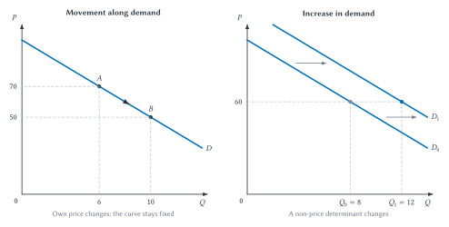
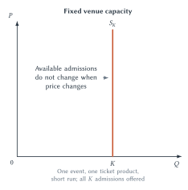
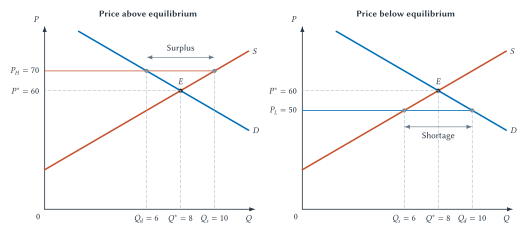
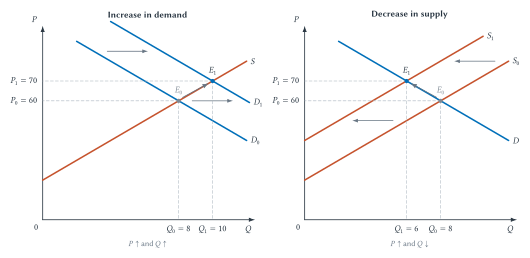
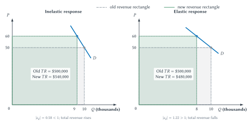

# The Supply and Demand Playbook

A team signs a superstar. Interest surges. Ticket prices rise, and more fans attend.

Did the higher ticket price cause attendance to increase? That would contradict the law of demand. Did the player somehow increase the physical supply of seats? Usually not. The likely explanation is that the signing changed demand: at every possible ticket price, more people wanted to attend. The higher price and larger crowd were both results of that shift.

Sports markets constantly produce stories like this. A playoff race increases interest. A rainy forecast discourages attendance. A factory interruption makes jerseys more expensive to produce. A stadium sells out even though resale prices remain high. Each story contains many details, but supply and demand give us a disciplined way to identify the mechanism underneath them.

The method is simple enough to summarize: define the market, hold other things fixed, identify which curve changes, find the direction of adjustment, and then ask how responsive buyers or sellers are. Learning to perform those steps carefully is more valuable than memorizing a list of sports anecdotes.

## Learning Goals

After reading this chapter, you should be able to:

- explain scarcity, opportunity cost, incentives, marginal thinking, substitution, and *ceteris paribus*
- distinguish demand from quantity demanded and supply from quantity supplied
- identify the standard determinants of demand and supply
- distinguish a movement along a curve from a shift of the curve
- find market equilibrium and explain shortages and excess supply
- use comparative statics to predict changes in equilibrium price and quantity
- define and calculate price elasticity of demand using percentage changes
- connect own-price elasticity to total revenue without confusing revenue with profit
- define price elasticity of supply and explain the importance of time and capacity
- interpret income elasticity and cross-price elasticity
- explain intuitively how a team could learn about ticket-demand responsiveness

## The Economic Toolkit Before The Curves

Supply and demand are not merely two lines on a graph. They summarize choices made by people who face limits, compare alternatives, and respond to changing benefits and costs. Six ideas establish the logic.

### Scarcity And Constraints

Scarcity means that available resources are not sufficient to satisfy every possible use. Fans have limited income and time. Teams have limited roster spots, stadium space, staff, and capital. A broadcast has limited minutes. Even a wealthy organization must decide which player, facility, or marketing project receives the next dollar.

Scarcity does not mean that something is rare in an absolute sense. It means that using a resource one way prevents it from being used another way. That constraint creates choice.

### Opportunity Cost

The opportunity cost of a choice is the value of the best alternative forgone. The money price of attending a game is only part of its cost. A fan may also give up an evening, travel time, parking money, or another form of entertainment. A team that uses a roster spot on one player gives up the best available alternative use of that spot.

Opportunity cost is forward-looking. A stadium construction expense that has already been incurred cannot be recovered by changing today's attendance decision. The relevant question is what the decision maker must give up now by choosing one option rather than the next-best alternative.

### Incentives And Marginal Thinking

An incentive changes the benefit or cost associated with a choice. A lower ticket price may make attendance attractive to another group of fans. Higher overtime pay may encourage workers to supply another hour. A league rule can alter the value of carrying a particular type of player.

Economists often analyze such adjustments at the margin. The marginal question is not necessarily “Should we have sports?” or “Should the stadium exist?” It may be “Should this fan buy one more ticket?” “Should this team offer one more seat for sale?” or “Should this player devote one more unit of effort to pitching rather than hitting?” Many market outcomes are built from those incremental decisions.

The **marginal benefit**, $MB$, is the additional benefit from one more unit or adjustment. The **marginal cost**, $MC$, is its additional cost. A decision maker continues an activity while $MB>MC$ and stops expanding when the next unit would cost more than it is worth. The same comparison later helps explain why filling another seat can be attractive when its added revenue exceeds its added cost, even though the stadium itself was expensive to build.

### Substitution And Adjustment

People can respond to incentives only when some adjustment is available. A fan may substitute a streamed broadcast for attending, a less expensive seat for a club seat, or a weekday game for a rivalry game. A merchandise producer may substitute machinery for labor or one material for another. More and better alternatives generally make adjustment easier.

Substitution need not mean abandoning sports. It can occur among sports products, purchase dates, seat locations, transportation options, or uses of time. Elasticity, introduced later in this chapter, measures the size of that response.

### Ceteris Paribus

Sports markets change in many ways at once. If price rises during a playoff race and attendance also rises, the raw comparison mixes the price change with the increase in team appeal. To isolate the relationship between a ticket's own price and quantity demanded, economists ask what would happen *ceteris paribus*—holding the other determinants fixed.

::: quickconcept
**Ceteris Paribus**

When economists isolate one relationship, they hold other relevant factors fixed so the effect of one change can be understood. This is a feature of the model, not a claim that the real world literally stops changing.
:::

### Rationality Without Perfection

Economic reasoning does not require people to possess complete information, calculate flawlessly, or ignore identity and emotion. A devoted fan can rationally value attendance more than an outsider does. The modest starting point is that people pursue goals subject to constraints and often adjust when incentives and alternatives change.

::: warning
**Rational Does Not Mean Perfect**

A rational choice can be emotional, mistaken, or based on limited information. Rationality means that choices reflect goals and constraints consistently enough for incentives and trade-offs to matter.
:::

::: historicalnote
**Ruth, Ohtani, And The Limits Of Specialization**

Babe Ruth creates an unusually good opportunity-cost puzzle. He was not a weak pitcher who escaped the mound by learning to hit. He was a leading pitcher who also became an extraordinary hitter. The Red Sox began moving him toward the outfield in 1918; that season he went 13-7 as a pitcher while leading the American League with 11 home runs. In 1919 he hit a then-record 29 home runs and still went 9-5 on the mound.[^ruth-transition]

Ruth possessed an **absolute advantage** over many players in both tasks: he could pitch and hit at an unusually high level. But the team's allocation problem depended on **comparative advantage**, which concerns opportunity cost. The relevant comparison was not simply whether Ruth was a good pitcher. It was how much the team gained by using him as a hitter relative to the next-best hitter, compared with how much it gained by using him as a pitcher relative to the next-best pitcher. Replacement quality mattered.

Shohei Ohtani shows why comparative advantage is not a command that every talented person must perform only one task. In 2021, he hit 46 home runs while making 23 pitching starts with a 3.18 ERA. After returning to the mound in 2025, he hit 55 home runs and made 14 starts with a 2.87 ERA.[^ohtani-two-way] His two-way role can create value through roster flexibility and through the unusual ability to combine elite contributions.

The efficient choice depends on relative productivity, available replacements, roster rules, recovery and injury costs, playing time, and any additional value created by combining roles. Ruth's career does not mechanically prove that Ohtani should specialize, and Ohtani's success does not disprove comparative advantage. Both cases ask the same economic question: where does this athlete create the greatest value once the alternatives and constraints are included?
:::

The same logic now leads into markets. A demand curve organizes buyers' marginal choices at alternative prices. A supply curve organizes sellers' marginal choices. *Ceteris paribus* allows each relationship to be studied before the two sides are brought together.

## Demand: The Buyer's Side Of The Market

**Demand** is the relationship between the price of a product and the quantity buyers are willing and able to purchase during a defined period, holding other determinants fixed. **Quantity demanded** is one particular amount at one particular price.

Those definitions require a market. “Sports tickets” is too vague. Demand for upper-level tickets to one Bills home game, sold to individual buyers during a specified week, is a more useful market definition. A different game, seat type, purchase date, or buyer group may have a different demand relationship.

Consider a hypothetical schedule for a clearly defined ticket product:

| Price per ticket | Quantity demanded |
| ---: | ---: |
| \$100 | 4,000 |
| \$75 | 8,000 |
| \$50 | 12,000 |
| \$25 | 16,000 |

**Table 2.1: A hypothetical ticket-demand schedule.** Lower prices are associated with larger quantities demanded when income, tastes, related-product prices, expectations, and the number of buyers are held fixed.

The schedule illustrates the **law of demand**: holding other factors fixed, a higher price reduces quantity demanded and a lower price increases it. A lower price can attract buyers who were previously unwilling to purchase, encourage some buyers to purchase more tickets, or induce substitution away from other entertainment options.

### The Standard Demand Determinants

A product's own price determines a location on its demand curve. Other factors determine where the entire curve lies. The standard demand determinants are:

1. **Income:** A change in purchasing power can change demand, although the direction depends on whether the defined product is normal or inferior for the relevant buyers.
2. **Prices of related goods:** A higher price for a substitute can increase demand; a higher price for a complement can decrease demand.
3. **Tastes and preferences:** Team loyalty, player appeal, rivalry, perceived quality, and social experience can alter willingness to buy.
4. **Expectations:** Expectations about future prices, team performance, availability, or playoff importance can affect current purchases.
5. **Number of buyers:** Population, tourism, market reach, and the size of an interested fan base affect market demand.

The list is general. Sports provide applications. A star signing may change tastes or expected team quality. A higher parking price may reduce ticket demand if parking and attendance are complements. An influx of visitors may increase the number of potential buyers. The sports story matters because it identifies a determinant—not because sports require a different definition of demand.

### Movement Along Demand Versus A Demand Shift

When the product's own price changes, quantity demanded changes along an unchanged demand curve. When income, related-good prices, preferences, expectations, or the number of buyers changes, the demand curve shifts.

**Figure 2.1: Movement along demand versus an increase in demand.** A change in the product's own price creates a movement along demand. A change in another demand determinant shifts the curve.

::: aifiguredescription
**Figure description: `fig:ch02-demand-movement-shift`**

Both panels place price $P$ on the vertical axis and quantity $Q$ on the horizontal axis. In the left panel, one downward-sloping curve labeled $D$ contains point $A$ at $(Q,P)=(6,70)$ and point $B$ at $(10,50)$. An arrow from $A$ toward $B$ shows that a price decrease raises quantity demanded through a movement along the unchanged curve. In the right panel, the downward-sloping curve $D_0$, defined by $P=100-5Q$, shifts rightward to the parallel curve $D_1$, defined by $P=120-5Q$. At the common reference price $P=60$, quantity demanded rises from $Q_0=8$ to $Q_1=12$. The shift arrow sits between the curves rather than along either curve. The figure's conclusion is that own price changes quantity demanded along a curve, whereas another determinant changes demand by shifting the entire curve. The values are hypothetical and have no empirical units.
:::

::: warning
**Demand Is Not Quantity Demanded**

Saying “higher ticket prices reduced demand” is usually incorrect when only the ticket's own price changed. The higher price reduced **quantity demanded**. Demand changed only if another determinant shifted the entire relationship.
:::

::: quickconcept
**Shifts Versus Movements**

A product's own price causes a movement along its demand or supply curve. A change in another determinant shifts the entire curve. Ask what changed before moving any line.
:::

Return to the opening superstar example. The signing makes attendance more attractive at many possible prices, shifting demand to the right. At the old price, more tickets are wanted. After the market adjusts, both the observed ticket price and quantity sold may be higher. This does not overturn the law of demand because the comparison is between two different demand curves.

## Supply: The Seller's Side Of The Market

**Supply** is the relationship between the price of a product and the quantity sellers are willing and able to provide during a defined period, holding other determinants fixed. **Quantity supplied** is one amount offered at one price.

The **law of supply** says that, holding other factors fixed, a higher price generally increases quantity supplied. A higher price can make additional units worthwhile because sellers can cover the rising opportunity cost of labor, materials, equipment, and alternative uses of capacity.

A standard hypothetical schedule makes the relationship concrete:

| Price per unit | Quantity supplied |
| ---: | ---: |
| \$30 | 2,000 |
| \$40 | 4,000 |
| \$50 | 6,000 |
| \$60 | 8,000 |

**Table 2.2: A hypothetical supply schedule.** Higher prices support larger quantities supplied when input prices, technology, policy, expectations, operating conditions, and the number of sellers are held fixed.

As with demand, sports do not replace the standard determinants. Important supply determinants include:

1. **Input prices:** Higher wages, materials prices, rent, or energy costs tend to reduce supply at any given output price.
2. **Technology and productivity:** Better production methods can increase the amount sellers can provide from available inputs.
3. **Taxes, subsidies, and regulations:** These can change the marginal benefit or cost of supplying a unit.
4. **Expectations:** Sellers may adjust current production or inventory when they expect future prices or costs to change.
5. **Number of sellers:** Entry expands market supply; exit contracts it.
6. **Natural and operating conditions:** Weather, transportation interruptions, injuries, or facility availability can constrain production in particular markets.

Suppose the material needed to produce an officially licensed jersey becomes more expensive. At every possible jersey price, producing a given quantity is now less attractive. Supply shifts left. By contrast, if the jersey's own price rises while material cost and other determinants remain fixed, producers move upward along the same supply curve and offer a larger quantity.

### Capacity Changes The Short-Run Response

Supply responsiveness depends on what is being produced and how much time sellers have to adjust. A merchandise producer may add a shift, order more material, or contract with another factory. The quantity supplied can increase when price rises.

Admissions to one event are different. Once the venue configuration, safety rules, and ticket inventory are fixed, the number of sellable admissions may not respond to price. Under the simplifying assumption that all of those admissions are offered, short-run supply is vertical at capacity $K$.

**Figure 2.2: Ordinary supply response and fixed venue capacity.** Sellers may expand output along an ordinary supply curve, while available admissions to one defined event may be fixed over the short run.

::: aifiguredescription
**Figure description: `fig:ch02-supply-and-capacity`**

Both panels place price $P$ on the vertical axis and quantity $Q$ on the horizontal axis. The left panel contains the upward-sloping supply curve $S$, defined by $P=20+5Q$. Point $A$ is at $(Q,P)=(4,40)$ and point $B$ is at $(8,60)$. A compact black arrowhead on the curve shows movement from $A$ toward $B$ when the product's own price rises. The right panel, titled `Fixed venue capacity`, contains a solid red vertical supply line at $Q=K$ labeled $S_K$. A three-line annotation to its left states that available admissions do not change when price changes. It represents one defined event, venue configuration, ticket product, and short time horizon under the assumption that all $K$ sellable admissions are offered. It does not imply that future capacity can never change, that a team must offer every physical seat, or that the vertical line by itself determines the price selected by a team with market power. Chapter 4 supplies that pricing model.
:::

Calling event capacity “perfectly inelastic supply” therefore requires a careful market definition. A team can change future stadium capacity, standing-room inventory, seat configuration, or the number of tickets it withholds. The vertical curve is a useful short-run model, not a universal physical law.

## Equilibrium And Market Adjustment

Demand describes planned purchases. Supply describes planned sales. **Market equilibrium** occurs at the price where quantity demanded equals quantity supplied:

$$
Q_d=Q_s.
$$

At that price, buyers can purchase the amount they plan to buy and sellers can sell the amount they plan to offer. There is no shortage or excess supply pushing the market price to change. If demand or supply shifts, the equilibrium changes with it.

Consider the hypothetical curves

$$
D: P=100-5Q
$$

and

$$
S: P=20+5Q.
$$

Setting the two price expressions equal gives

$$
100-5Q=20+5Q,
$$

Subtracting 20 from both sides and adding $5Q$ to both sides gives

$$
80=10Q,
$$

so

$$
Q^*=8.
$$

Substituting 8 into either original curve gives

$$
P^*=100-5(8)=60.
$$

The algebra locates the same market-clearing point shown by the intersection of the two curves.

### Prices Above And Below Equilibrium

At a price above equilibrium, sellers want to provide more than buyers want to purchase. The result is **excess supply**, sometimes called a market surplus. Unsold tickets, unsold merchandise, or accumulating sneaker inventory can pressure sellers to reduce price, cut production, improve the offer, or search for additional buyers.

At a price below equilibrium, buyers want to purchase more than sellers provide. The result is a **shortage**, or excess demand. Buyers may queue, search, enter lotteries, turn to resale markets, or go without the product. The posted money price may remain fixed while the full cost of obtaining the product rises through time, uncertainty, or secondary-market payments.

A limited-edition sneaker offered below the market-clearing price provides a familiar example. The shoe can sell out immediately even though many buyers remain willing to purchase at the posted price. Resale listings are evidence that the initial allocation did not satisfy all demand at that price, although asking prices alone do not measure the exact shortage.

**Figure 2.3: Equilibrium, excess supply, and shortage.** At \$60, planned buying and selling agree. At \$70, quantity supplied exceeds quantity demanded. At \$50, quantity demanded exceeds quantity supplied.

::: aifiguredescription
**Figure description: `fig:ch02-equilibrium-shortage-surplus`**

Both panels place price $P$ on the vertical axis and quantity $Q$ on the horizontal axis. They use the downward-sloping demand curve $D: P=100-5Q$ and upward-sloping supply curve $S: P=20+5Q$, which intersect at equilibrium $(Q^*,P^*)=(8,60)$. In the left panel, a horizontal line at the high price $P_H=70$ intersects demand at $Q_d=6$ and supply at $Q_s=10$. A horizontal bracket from 6 to 10 is labeled `Surplus`. In the right panel, a horizontal line at the low price $P_L=50$ intersects supply at $Q_s=6$ and demand at $Q_d=10$. A bracket from 6 to 10 is labeled `Shortage`. Both gaps equal four quantity units. The word surplus in the left panel means excess quantity supplied, not consumer surplus or producer surplus. The latter are welfare measures introduced in Chapter 3.
:::

::: warning
**Two Meanings Of Surplus**

In this chapter, a ticket surplus means $Q_s>Q_d$: some offered tickets remain unsold at the current price. In Chapter 3, **consumer surplus** and **producer surplus** measure gains from trade. The ideas share a word but are not the same concept.
:::

The adjustment process depends on institutions. A competitive merchandise market may respond through prices and production. A team may post prices in advance and allow quantity, queues, or resale activity to adjust. Supply-and-demand equilibrium is a benchmark. It is not, by itself, the profit-maximizing pricing rule for a team with market power. Chapter 4 adds marginal revenue, marginal cost, ticket menus, and capacity to that problem.

## Comparative Statics: From A Story To A Prediction

**Comparative statics** compares one equilibrium with another after a determinant changes. The term sounds technical, but the method is a short checklist:

1. Define the market and time horizon.
2. Identify the event that changed.
3. Decide whether the event affects demand, supply, or both.
4. Shift only the affected curve in the appropriate direction.
5. Find the new intersection.
6. Compare the old and new equilibrium price and quantity separately.

Suppose a hypothetical star signing increases ticket demand while ticket-market supply remains unchanged. Demand shifts right. Equilibrium price rises and equilibrium quantity rises. The result differs from a movement along demand: a higher own price alone would reduce quantity demanded.

Now suppose a production interruption increases the cost of making jerseys. Supply shifts left while demand remains fixed. Equilibrium price rises, but equilibrium quantity falls. Observing a price increase therefore does not identify the cause. Price can rise because demand increased or because supply decreased, and the quantity prediction distinguishes the two stories.

**Figure 2.4: Two comparative-statics results.** A demand increase raises both equilibrium price and quantity. A supply decrease raises equilibrium price while reducing equilibrium quantity.

::: aifiguredescription
**Figure description: `fig:ch02-comparative-statics`**

Both panels place price $P$ on the vertical axis and quantity $Q$ on the horizontal axis. In the left panel, the upward-sloping supply curve $S: P=20+5Q$ remains fixed while demand shifts right from $D_0: P=100-5Q$ to $D_1: P=120-5Q$. Equilibrium moves from $(Q_0,P_0)=(8,60)$ to $(Q_1,P_1)=(10,70)$, so both price and quantity rise. In the right panel, the downward-sloping demand curve $D: P=100-5Q$ remains fixed while supply shifts left or upward from $S_0: P=20+5Q$ to $S_1: P=40+5Q$. Equilibrium moves from $(Q_0,P_0)=(8,60)$ to $(Q_1,P_1)=(6,70)$, so price rises and quantity falls. Shift arrows run between curves, while equilibrium arrows connect old and new intersections. The figure is an exact illustration of a competitive benchmark using hypothetical equations, not an observed sports market or a monopoly pricing model.
:::

When both curves shift, one result may be ambiguous. If demand increases and supply decreases, both changes raise price, so price must rise. Demand growth raises quantity while the supply contraction lowers it, so the quantity change depends on the relative shift sizes. “Ambiguous” does not mean economics has nothing to say. It means the model identifies which outcome requires additional evidence.

::: studyandlearn
**Diagnose The Market Change**

For each claim, define the market, identify the changed determinant, and predict the direction of equilibrium price and quantity. If one prediction is ambiguous, explain why.

1. A playoff berth makes fans more interested in a team's remaining home games.
2. A shipping interruption raises the input cost of licensed jerseys.
3. A new production technology lowers jersey costs while a championship increases demand.
4. Heavy rain reduces interest in an outdoor game and also raises the venue's operating cost.

Do not begin by guessing what happens to price. Begin with the curves.
:::

## Elasticity: Measuring Responsiveness

Curve shifts and movements identify direction. Managers, consumers, and policymakers also need magnitude. A team deciding whether to change a ticket price cares not only that a higher price reduces quantity demanded, but by how much.

**Price elasticity of demand** measures the percentage change in quantity demanded associated with a one-percent change in the product's own price, holding other demand determinants fixed:

$$
\epsilon_d=\frac{\%\Delta Q_d}{\%\Delta P}.
$$

For ordinary downward-sloping demand, $\epsilon_d$ is negative because price and quantity demanded move in opposite directions. Economists usually classify responsiveness using the absolute value:

- **elastic demand:** $|\epsilon_d|>1$
- **unit-elastic demand:** $|\epsilon_d|=1$
- **inelastic demand:** $|\epsilon_d|<1$

If a 10 percent price increase reduces quantity demanded by 15 percent, then

$$
\epsilon_d=\frac{-15\%}{10\%}=-1.5.
$$

Demand is elastic because $|-1.5|>1$. The negative sign records the inverse direction; the magnitude records the strength of the response.

### What Makes Demand More Responsive?

Elasticity is not a permanent label attached to “sports tickets.” It depends on the defined product, buyers, price range, and time horizon. Several recurring factors help predict responsiveness:

- **Available substitutes:** Demand tends to be more elastic when fans can readily switch to another game, seat, sport, broadcast, or entertainment option.
- **Market definition:** Demand for one precisely defined game and seating section usually has more substitutes than demand for live sports entertainment as a broad category.
- **Budget share:** Buyers generally pay closer attention when the purchase absorbs a larger share of their available income.
- **Time to adjust:** Fans may have limited alternatives after traveling to a city on game day but many alternatives when planning months in advance.
- **Commitment and perceived necessity:** A devoted season-ticket holder may initially respond less than a casual buyer, although loyalty does not make demand perfectly inelastic.

These are hypotheses about likely responsiveness, not substitutes for evidence. The same fan can have inelastic demand for one playoff game and elastic demand for an ordinary game. Teams therefore care about elasticity over a particular range and for a particular ticket product rather than one universal number.

::: quickconcept
**Elasticity Measures Responsiveness**

Demand and supply predict direction. Elasticity uses percentage changes to measure how strongly buyers or sellers respond.
:::

### Why Percentages?

Suppose a price rises by \$10. That change is large if the initial price was \$20 and small if it was \$500. A reduction of 1,000 tickets is large in a 5,000-seat arena and small in a season containing millions of admissions. Percentage changes put the response and the cause on comparable scales.

This feature also separates elasticity from slope. Slope measures a change in price units per quantity unit, or the reverse depending on how the equation is written. Changing dollars to cents or tickets to thousands of tickets changes the numerical slope. Elasticity is unit-free.

::: warning
**Elasticity Is Not Slope**

A flatter-looking demand curve is not automatically more elastic at every point. Elasticity depends on percentage changes and on the location along the curve, not only on visual steepness or measurement units.
:::

### The Midpoint Method

When a problem gives beginning and ending prices and quantities, using the initial value as the percentage-change base produces a different answer depending on which direction the comparison runs. The midpoint method uses the average of the two values as the common base:

$$
\%\Delta Q_d=
\frac{Q_2-Q_1}{(Q_1+Q_2)/2}
$$

and

$$
\%\Delta P=
\frac{P_2-P_1}{(P_1+P_2)/2}.
$$

Suppose a team compares otherwise similar ticket offers. Price rises from \$50 to \$60 and quantity sold falls from 10,000 to 9,000. The quantity change is

$$
\frac{9{,}000-10{,}000}{(10{,}000+9{,}000)/2}
=\frac{-1{,}000}{9{,}500}
\approx -10.53\%.
$$

The price change is

$$
\frac{60-50}{(50+60)/2}
=\frac{10}{55}
\approx 18.18\%.
$$

Therefore,

$$
\epsilon_d=\frac{-10.53\%}{18.18\%}\approx -0.58.
$$

Demand is inelastic over this comparison. The calculation is transparent, but the interpretation still requires *ceteris paribus*. If one observation is a rivalry game and the other is a low-interest weekday game, the comparison does not isolate the price response.

If a problem already supplies the relevant percentage changes, use them directly. The midpoint method is a convention for constructing percentage changes from two raw observations, not an additional economic theory.

### Elasticity And Total Revenue

Total revenue is price multiplied by quantity sold:

$$
TR=P\times Q.
$$

In the midpoint example, initial revenue is

$$
TR_1=50\times10{,}000=500{,}000\ \text{dollars},
$$

while revenue after the price increase is

$$
TR_2=60\times9{,}000=540{,}000\ \text{dollars}.
$$

The higher price more than offsets the smaller number of tickets because demand is inelastic. If the same price increase caused sales to fall to 8,000, the midpoint elasticity would be approximately $-1.22$ and revenue would fall to \$480,000. Demand would be elastic.

**Figure 2.5: Elasticity and the total-revenue response.** A price increase raises total revenue when demand is inelastic over the comparison and lowers total revenue when demand is elastic.

::: aifiguredescription
**Figure description: `fig:ch02-elasticity-revenue`**

Both panels place ticket price in dollars on the vertical axis and ticket quantity in thousands on the horizontal axis. Both begin at price $P_1=\$50$ and quantity $Q_1=10{,}000$, represented by an initial price-times-quantity rectangle with total revenue of \$500,000. Both then raise price to $P_2=\$60$. In the left panel, quantity falls only to 9,000. Midpoint elasticity is approximately $-0.58$, so demand is inelastic, and the new rectangle has area \$540,000. In the right panel, quantity falls to 8,000. Midpoint elasticity is approximately $-1.22$, so demand is elastic, and the new rectangle has area \$480,000. Different outline and hatch styles distinguish old and new rectangles without relying on color. The signed elasticities record that price and quantity move in opposite directions; their absolute values determine classification. The examples are hypothetical comparisons that hold other demand conditions fixed. The rectangles show ticket revenue, not profit, and the paired curves should not be interpreted as saying that slope and elasticity are the same.
:::

The total-revenue rule works in both directions:

- With elastic demand, a price increase lowers total revenue and a price cut raises it.
- With inelastic demand, a price increase raises total revenue and a price cut lowers it.
- With unit-elastic demand, the opposing percentage changes leave total revenue unchanged.

Revenue is not profit. A larger crowd may create additional concessions, parking, merchandise, staffing costs, or future fan value. Chapter 4 puts the elasticity result inside the team's broader pricing decision.

## Other Elasticities

Own-price elasticity is not the only form of responsiveness. Supply, income, and related-product prices matter throughout sports economics.

### Price Elasticity Of Supply

**Price elasticity of supply** measures the percentage change in quantity supplied associated with a percentage change in the product's price:

$$
\epsilon_s=\frac{\%\Delta Q_s}{\%\Delta P}.
$$

Supply elasticity is generally positive. A larger value means sellers can adjust quantity more strongly. Time is often crucial. A merchandise producer may have limited inventory today but expand production over several months. Admissions to one fixed event may have $\epsilon_s=0$ under the vertical-capacity assumption, while a team can alter future seating products or a league can add games over a much longer horizon.

### Income Elasticity Of Demand

**Income elasticity of demand** measures the percentage change in quantity demanded associated with a percentage change in buyer income:

$$
\epsilon_I=\frac{\%\Delta Q_d}{\%\Delta I}.
$$

A positive value indicates a normal good; a negative value indicates an inferior good. The classification belongs to a defined product and buyer group. Premium seating, ordinary single-game tickets, and low-price promotional products need not have the same income elasticity. We should not label every sports ticket a luxury merely because some seats are expensive.

### Cross-Price Elasticity Of Demand

**Cross-price elasticity of demand** measures how demand for product $x$ responds to the price of product $y$:

$$
\epsilon_{xy}=\frac{\%\Delta Q_{d,x}}{\%\Delta P_y}.
$$

A positive value indicates substitutes. A negative value indicates complements. Tickets and separately purchased venue parking can behave as complements: a higher parking price raises the full cost of attendance and may reduce ticket demand. At-home viewing and attendance could be substitutes, but media exposure can also deepen interest and support future attendance. The sign is an empirical property, not something the sports label settles in advance.

| Measure | Formula | Sign and interpretation | Bounded sports application |
| --- | --- | --- | --- |
| Own-price demand elasticity | $\epsilon_d=\%\Delta Q_d/\%\Delta P$ | Normally negative; classify with $\lvert\epsilon_d\rvert$: elastic above one, unit elastic at one, and inelastic below one. | Response of ticket purchases to the ticket's own price, holding other demand conditions fixed. |
| Price elasticity of supply | $\epsilon_s=\%\Delta Q_s/\%\Delta P$ | Generally nonnegative; larger values mean sellers adjust quantity more strongly. | Flexible merchandise production versus fixed available admissions to one event in the short run. |
| Income elasticity of demand | $\epsilon_I=\%\Delta Q_d/\%\Delta I$ | Positive for a normal good and negative for an inferior good. | Premium and value ticket products may respond differently to income; the sign requires evidence. |
| Cross-price elasticity of demand | $\epsilon_{xy}=\%\Delta Q_{d,x}/\%\Delta P_y$ | Positive for substitutes and negative for complements. | Tickets and parking may be complements; viewing and attendance can have a context-dependent relationship. |

**Table 2.3: The elasticity family.** Every measure requires a defined market and a *ceteris paribus* interpretation.

## How Could A Team Estimate Elasticity?

The formula makes elasticity look as though a team needs only two prices and two attendance figures. Real estimation is harder because teams do not select prices randomly. They tend to charge more when opponent quality, team performance, timing, seat location, remaining inventory, or expected demand is also high.

Suppose Bills tickets are more expensive for a rivalry game than for an ordinary game and the rivalry game also sells more tickets. The comparison does not show that the higher price increased demand or that fans ignore price. The game itself is different.

Better evidence tries to compare observations that are alike in other important ways. A team could examine similar seats across similar games, account for opponent and timing, study a narrowly targeted promotion, or test modest price differences among otherwise comparable offers. With enough observations, regression analysis can help hold measured demand conditions fixed. Chapter 1's appendix explains that tool at an introductory level.

::: sideline
**How Could The Bills Estimate Elasticity?**

The Bills do not need to write a textbook formula before every pricing decision, but they must form a view about fan responsiveness. Useful evidence could come from comparable seats and games, controlled promotions, modest price tests, purchase timing, and remaining inventory. A simple price-attendance correlation is not enough because expected demand affects both the price selected and the quantity sold.

The managerial question and the textbook question are the same: what would quantity demanded have been at a different price, holding the other demand conditions fixed? Do not claim that the Bills use a particular method without evidence about their internal process.
:::

Elasticity estimates therefore belong to a product, price range, group, period, and research design. Chapter 2 establishes the measurement logic. Chapter 4 returns to the team's application: different fans, games, seats, and purchase conditions can produce different responsiveness and support a menu of prices.

## Big Picture

Supply and demand are a procedure for disciplined reasoning:

1. Define the market precisely.
2. Separate the product's own price from the other determinants.
3. Decide whether the event creates a movement or a shift.
4. If a curve shifts, identify which curve and in which direction.
5. Compare the old and new equilibrium price and quantity.
6. Use elasticity when the magnitude of the response matters.
7. Check the time horizon, capacity, alternatives, and market institution before carrying the conclusion into a real sports setting.

The framework also establishes the book's next two steps. Chapter 3 asks whether market outcomes are efficient and how taxes, price controls, externalities, and public goods change the benchmark. Chapter 4 asks how a team with market power actually chooses ticket prices, seating products, and sales rules. Those chapters apply this toolkit rather than starting over.

## Review Questions

1. Why does scarcity create opportunity cost?
2. What does *ceteris paribus* mean, and why is it necessary for the law of demand?
3. Distinguish demand from quantity demanded.
4. Name the standard demand determinants and give one sports application of each.
5. Distinguish supply from quantity supplied.
6. Why is fixed venue capacity a short-run model rather than a universal supply curve?
7. What creates a shortage? What creates excess supply?
8. How does a demand increase affect equilibrium price and quantity when supply is unchanged?
9. How does a supply decrease affect equilibrium price and quantity when demand is unchanged?
10. Why is elasticity different from slope?
11. Explain the total-revenue rule for elastic and inelastic demand.
12. Distinguish own-price, supply, income, and cross-price elasticity.
13. Why can a simple comparison of ticket price and attendance fail to estimate demand elasticity?

## Problems And Applications

1. A hypothetical team reduces the price of an upper-level ticket from \$80 to \$70, and quantity demanded rises from 6,000 to 7,500. Is this a movement or shift? Calculate midpoint price elasticity of demand, classify it, and determine what happens to ticket revenue.
2. A popular player joins a team. At the same time, the ticket price rises and attendance increases. Explain why this observation does not violate the law of demand. Draw the relevant curve change.
3. A licensed-jersey producer experiences a 15 percent increase in material cost. Identify the affected curve and predict the direction of equilibrium price and quantity.
4. Demand is $P=140-4Q$ and supply is $P=20+2Q$, with $Q$ measured in thousands. Find equilibrium price and quantity. Then suppose demand changes to $P=164-4Q$. Find the new equilibrium and identify both changes.
5. At a posted price of \$75, quantity demanded is 8,000 and quantity supplied is 11,000. Identify the imbalance and its size. Give two ways the market could adjust besides an immediate posted-price change.
6. Ticket price rises by 8 percent and quantity demanded falls by 4 percent. Calculate $\epsilon_d$, classify demand, and predict the direction of ticket revenue.
7. The price of parking rises by 20 percent and ticket demand falls by 5 percent. Calculate $\epsilon_{xy}$. How would you classify the two products in this example, and what caution would you attach to the conclusion?
8. Household income rises by 10 percent and demand for one premium ticket product rises by 15 percent. Calculate $\epsilon_I$. Why would that result not prove that every ticket sold by the team has the same income elasticity?
9. Admissions to tomorrow's game are fixed at 50,000, while licensed-jersey output can expand over several months. Compare the price elasticity of supply in the two markets and explain the role of time.
10. Demand increases while supply decreases. What can you conclude unambiguously about equilibrium price? Why is the quantity result ambiguous?

## Evidence Activity

Find a current article claiming that a player signing, winning streak, promotion, or stadium change caused ticket demand or attendance to rise. Provide the link and access date. Then answer:

1. What market and time period does the claim concern?
2. Is the article describing quantity demanded, attendance, price, revenue, or demand itself?
3. Which demand or supply determinant supposedly changed?
4. What is the relevant counterfactual—what would have happened without the event?
5. Does the evidence establish a causal shift, show only an association, or merely offer a plausible story?

Rewrite the claim so it says no more than the evidence supports.

## Source Notes

[^ruth-transition]: National Baseball Hall of Fame and Museum, “Babe Ruth,” accessed August 2, 2026, <https://baseballhall.org/hall-of-famers/ruth-babe>; National Baseball Hall of Fame and Museum, “Babe Ruth: His Life and Legend,” accessed August 2, 2026, <https://baseballhall.org/discover/museum/babe-ruth-his-life-and-legend>. The chapter uses the documented 1918–19 transition and playing record to establish elite performance in both roles; comparative advantage remains an economic interpretation that also depends on replacement quality.
[^ohtani-two-way]: Major League Baseball, “Shohei Ohtani Honored with Commissioner's Historic Achievement Award,” October 26, 2021, <https://www.mlb.com/press-release/shohei-ohtani-honored-with-commissioners-historic-achievement-award>; Sonja Chen, “Unanimous for 4th Time, Ohtani Owns 2nd-Most MVPs in MLB History,” MLB.com, November 14, 2025, <https://www.mlb.com/news/shohei-ohtani-wins-2025-nl-mvp-award>. Statistics and the two-way comparison are current through the completed 2025 season. Current MLB roster and designated-hitter rules may add institutional value to combining roles; see Major League Baseball, “What Are the Rules for Two-Way Players? Common Questions, Answered,” April 29, 2026, <https://www.mlb.com/news/mlb-two-way-player-rules>.
