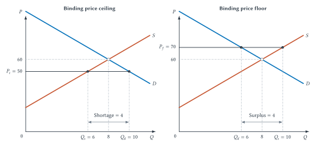
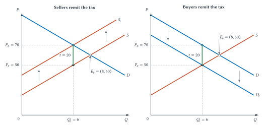
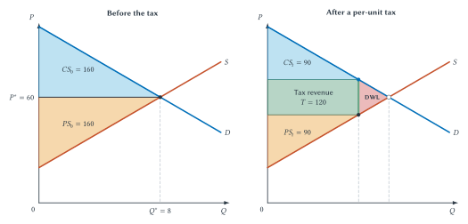
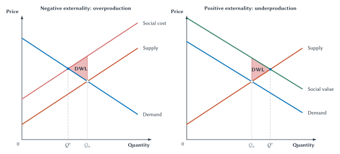

<!-- Goal-first draft and V1 coverage review completed 2026-08-03. Figure production and final review remain pending. -->

# Market Outcomes and Policy

In March 2026, Premier League clubs extended their £30 cap on away-ticket prices for another two seasons. The rule had begun in 2016, so the extension would take it through twelve consecutive seasons. The league also reported that away attendance had increased from 82 percent to 91 percent since the cap began.[^premier-league-away-cap]

The immediate appeal is easy to understand. Away supporters already spend money traveling across England, and a price cap keeps the ticket itself from becoming even more expensive. But the economic questions begin where the posted price ends. Would clubs have charged more without the cap? Are there enough tickets for everyone who wants one at £30? If not, who receives them? Can that person resell the ticket? Does the rule increase attendance, or does it mainly transfer money from clubs to supporters who would have attended anyway? Could a larger and livelier away section benefit other people watching the match?

These questions do not reduce to “price caps are good” or “price caps are bad.” They require a benchmark, a prediction about behavioral responses, and attention to allocation as well as price. The relevant **counterfactual** is the plausible outcome that would have occurred without the policy. Without that comparison, seeing a £30 ticket tells us the rule exists but not what it changed.

Chapter 2 explained how demand and supply coordinate buyers' and sellers' plans. This chapter uses that market outcome as a comparison point. We will ask what happens when a policy prevents the posted price from adjusting, creates a difference between what buyers pay and sellers receive, or attempts to correct costs and benefits that fall on other people. The recurring lesson is that a policy changes more than the number written into the rule.

## Learning Goals

After reading this chapter, you should be able to:

- use competitive equilibrium as a benchmark without assuming that every equilibrium is fair or socially desirable
- explain price ceilings and price floors and identify resulting shortages or surpluses
- distinguish a regulated money price from non-price allocation mechanisms and from the full price buyers face
- solve simple linear demand and supply equations after following a worked example
- distinguish legal tax incidence from economic incidence
- explain how relative responsiveness affects tax burdens
- distinguish consumer surplus, producer surplus, government revenue, total surplus, and deadweight loss
- identify negative externalities, positive externalities, and public goods without treating them as synonyms
- evaluate a sports policy by asking about its counterfactual, behavioral effects, allocation, efficiency, distribution, and evidence

## Equilibrium As A Policy Benchmark

An economic evaluation needs a comparison. If a league caps ticket prices at £30, comparing £30 with zero does not tell us the effect of the policy. We need to compare the capped market with a plausible version of the same market without the cap. The competitive equilibrium from Chapter 2 provides one useful benchmark.

Recall the hypothetical market described by

$$
D: P=100-5Q
$$

and

$$
S: P=20+5Q.
$$

The demand curve records buyers' willingness to purchase at alternative prices. The supply curve records sellers' willingness to provide the product at alternative prices. Their intersection is

$$
(Q^*,P^*)=(8,60).
$$

At a price of 60, quantity demanded and quantity supplied both equal 8. Buyers and sellers have plans that can be carried out together. A higher price would leave excess supply; a lower price would create a shortage.

This benchmark does not claim that the outcome is morally ideal, equally distributed, or institutionally realistic in every sports market. A team may possess market power. A stadium may have fixed capacity. A transaction may affect nearby residents who are not represented by either curve. Those complications matter, and the rest of the book studies them. The competitive benchmark is useful because it makes the comparison explicit: it identifies the outcome that the policy or market imperfection changes.

::: quickconcept
**A Benchmark Is Not An Endorsement**

A benchmark is a disciplined comparison point. Economists can use competitive equilibrium to measure what a policy changes without claiming that the unregulated outcome is fair, perfect, or appropriate in every setting.
:::

### Algebra Extension: Finding The Benchmark

The graph shows the equilibrium where demand and supply intersect. Algebra finds the same point by setting the two price expressions equal:

$$
100-5Q=20+5Q.
$$

Subtracting 20 from both sides and adding $5Q$ to both sides gives

$$
80=10Q,
$$

so

$$
Q^*=8.
$$

Substitute 8 into either original equation:

$$
P^*=100-5(8)=60.
$$

The calculation is not a separate economic theory. It is another way of locating the intersection already shown by the graph. If a problem supplies the equilibrium, students can begin with the economic interpretation. If it supplies only the equations, these steps recover the benchmark.

## Price Controls

A **price control** places a legal or institutional limit on a market price. A **price ceiling** sets a maximum price. A **price floor** sets a minimum price. Either rule can exist without affecting the market. What matters is whether the control is **binding**—whether it prevents the price that would otherwise emerge.

A price ceiling above the equilibrium price is nonbinding. The market-clearing price was already below the maximum, so the rule changes nothing under the model. A price ceiling below equilibrium is binding. Buyers want more than sellers provide at the controlled price, creating a shortage.

A price floor below equilibrium is likewise nonbinding. A floor above equilibrium is binding. Sellers want to provide more than buyers purchase, creating excess supply, also called a surplus.

The size of the shortage or surplus depends on responsiveness. When buyers or sellers adjust strongly to the controlled price, the gap is larger. Fixed event capacity is a special case because short-run quantity supplied may not respond at all.

::: warning
**The Rule's Name Does Not Tell You Its Effect**

A price ceiling does not automatically create a shortage, and a price floor does not automatically create a surplus. First compare the controlled price with the equilibrium price. Only a binding control changes the market outcome.
:::

### A Binding Price Ceiling

Return to the hypothetical market with an equilibrium price of 60. Suppose a policy sets a maximum price of

$$
P_c=50.
$$

Because 50 is below 60, the ceiling is binding. At the controlled price, quantity demanded is 10 while quantity supplied is 6. The shortage is therefore

$$
Q_d-Q_s=10-6=4.
$$

The subtraction is easy. The interpretation matters more: buyers seek four more units than sellers offer at the legal price. The control prevents the posted price from performing its usual rationing function, but it does not eliminate scarcity. Some other mechanism must determine which buyers receive the six available units.

That mechanism might be a line, a lottery, a priority rule, a membership requirement, purchase history, personal connections, search effort, or a secondary market. These methods do not all have the same effects. A lottery rewards luck. A queue rewards time and the ability to wait. A loyalty rule favors established customers. Resale may move tickets toward buyers willing to pay more, but it may also undo some of the affordability created by the original cap. The policy analysis must therefore ask not only “What is the legal price?” but also “Who actually gets the product, and what must they do to obtain it?”

### Algebra Extension: Recovering The Controlled Quantities

The controlled price can be substituted into each original curve. On the demand side,

$$
50=100-5Q_d.
$$

Rearranging gives

$$
5Q_d=50,
$$

so

$$
Q_d=10.
$$

On the supply side,

$$
50=20+5Q_s.
$$

Therefore,

$$
5Q_s=30
$$

and

$$
Q_s=6.
$$

Once those two quantities are known, calculating the shortage requires only subtraction. Keeping the labels $Q_d$ and $Q_s$ attached to the work helps prevent the most common error: subtracting correctly but describing the result as a surplus.

**Figure 3.1: Binding price controls and market imbalance.** A ceiling below equilibrium produces excess demand, while a floor above equilibrium produces excess supply. The controlled money price does not by itself determine how scarce tickets, jobs, or other opportunities are allocated.

::: aifiguredescription
**Figure description: `fig:ch03-price-controls`**

Both panels place price $P$ on the vertical axis and quantity $Q$ on the horizontal axis. They use demand $D:P=100-5Q$ and supply $S:P=20+5Q$, which intersect at the unregulated equilibrium $(Q^*,P^*)=(8,60)$. The left panel imposes a binding price ceiling at $P_c=50$. Substitution into supply gives $50=20+5Q_s$, so $Q_s=6$; substitution into demand gives $50=100-5Q_d$, so $Q_d=10$. The horizontal gap is a shortage of $Q_d-Q_s=4$. The right panel imposes a binding price floor at $P_f=70$. Demand gives $Q_d=6$, supply gives $Q_s=10$, and the gap is a surplus of $Q_s-Q_d=4$. These are exact results for the stated linear model. For one fixed-capacity event, a ticket-price ceiling need not reduce the physical number of seats offered; it can instead create excess demand and shift allocation toward waiting, eligibility rules, lotteries, search, relationships, or controlled and uncontrolled resale. The diagram omits enforcement, quality changes, market power, longer-run supply responses, and the details of secondary-market rules. An AI tutor should distinguish three possible tasks: reading the displayed graph, calculating a gap from supplied prices and quantities, and solving the two equations from scratch.
:::

### Fixed Capacity Changes The Practical Story

The upward-sloping supply curve is a useful general model, but Chapter 2 emphasized that admissions to one event can be fixed in the short run. Suppose a stadium has $K$ sellable seats and every one of those seats remains available under the cap. Lowering the ticket price does not physically remove rows from the stadium. Quantity supplied remains $K$.

A binding ceiling can still create excess demand. At the capped price, the number of fans who want tickets may exceed $K$. The difference is that the main short-run effect may appear in **allocation** rather than in the number of admissions offered. The event sells the same fixed inventory, but a larger group competes for it through rules other than the posted price.

This distinction is especially important in sports. A standard diagram with upward-sloping supply predicts that a ceiling reduces quantity supplied. A fixed-event model predicts that all available admissions may still be offered. Neither model should be applied automatically. Define the product and time horizon, then decide which supply assumption fits.

The same caution applies to market power. A team or league may set prices rather than passively accept a competitive market price. In that setting, “binding” means the control prevents the seller from charging the price it would otherwise choose. Chapter 4 develops that pricing decision in detail. Here the central point remains: when the money price cannot adjust, scarcity and competition for access do not disappear.

::: quickconcept
**The Full Price Can Exceed The Money Price**

The **full price** includes the money price plus waiting, search, risk, inconvenience, and other nonmoney costs a buyer faces. A capped ticket can cost £30 in money while still requiring scarce time, eligibility, luck, or considerable effort to obtain. A lower posted price can improve affordability for successful buyers without guaranteeing access for everyone who wants a ticket.
:::

### A Binding Price Floor

Now suppose the same hypothetical market has a minimum price of

$$
P_f=70.
$$

Because 70 is above the equilibrium price of 60, the floor is binding. At that price, quantity demanded is 6 and quantity supplied is 10. Excess supply is

$$
Q_s-Q_d=10-6=4.
$$

The four-unit surplus means that sellers would like to provide more than buyers want to purchase at the required price. In a product market, this may appear as unsold inventory. Sellers may respond through changes in quality, bundles, waiting time, or production if the rule permits those adjustments. Once again, preventing one price adjustment redirects behavior rather than freezing the rest of the market.

A wage is the price of labor, so a minimum wage can be modeled as a price floor. Consider an explicitly hypothetical competitive market for stadium-worker hours. A binding wage floor increases the quantity of labor people want to supply while reducing the quantity employers want to hire. The result is excess labor supply: more people seek the covered work than employers offer at that wage.

That simple diagram is a benchmark, not a conclusion about every labor policy. Actual sports labor markets can involve employer market power, unions, contracts, job-search frictions, differences in worker productivity, and adjustments in hours or working conditions. Chapters 10 and 11 examine those institutions. The immediate lesson is narrower: in the competitive model, a binding floor creates a surplus, and the scarce jobs must then be allocated somehow.

## Case Study: The Premier League's £30 Away-Ticket Cap

::: casestudy
**Affordable Tickets, Scarce Access**

At a March 2026 shareholders' meeting, Premier League clubs unanimously agreed to extend the £30 cap on away-ticket prices for two additional seasons. The league explained that away supporters contribute to match atmosphere and also face substantial travel costs. It reported that away attendance had increased from 82 percent to 91 percent since the cap began in 2016.

The policy creates a much better classroom question than “Are inexpensive tickets good?” Begin with the counterfactual. What would clubs charge for away tickets without the rule? If the unconstrained price for a particular match would be £25, the £30 ceiling is nonbinding and changes nothing. If the price would be £50, the cap is binding and changes both the money paid and the way scarce tickets are allocated.

Next define supply. If the number of away tickets made available for a match is fixed, the £30 cap need not reduce the physical number offered. It can instead increase the gap between the number of supporters seeking tickets and the number available. Access may then depend on whatever eligibility, priority, lottery, queue, or resale arrangements govern that match. The economic effect cannot be inferred from the capped price alone.

Now add a secondary market. Suppose an initial buyer receives a ticket for £30 and can freely resell it for £80. The ticket can flow toward a buyer with greater monetary willingness to pay, while the initial buyer captures a £50 resale gain. The final spectator still pays £80. Under frictionless resale, the cap changes who receives the revenue, but it may do little to keep the final user's price at £30. Initial allocation matters mainly because it awards a valuable right to resell.

Premier League away tickets do not operate in that frictionless environment. The league warns that tickets bought through unauthorized sellers may be voided, and its digital-ticketing system assigns home and away tickets to registered supporters while strengthening anti-touting controls. Authorized transfer arrangements are determined through club systems, and unauthorized resale of designated football tickets is also legally restricted in England and Wales.[^premier-league-resale-controls] Illegal resale can still occur, but cancellation risk, identity assignment, restricted transfer, enforcement, and search costs make that secondary market incomplete.

Nottingham Forest's 2025–26 Away Ticket Scheme provides one club-level illustration. Access depended on season-card eligibility, recent away attendance, priority tiers, and a ballot. Tickets were assigned to named supporters. A holder who could not attend had to request a club-controlled transfer to another supporter enrolled in the scheme, while passing a ticket outside the authorized process could cost the holder future eligibility. The club also linked booking history to whether a ticket was actually scanned.[^nottingham-forest-away-scheme] These rules do more than stop resale profits. They try to ensure that scarce access and future priority go to supporters who actually travel. Other clubs can use different systems, so the example demonstrates the mechanism rather than a uniform league rule.

These **market frictions**—rules, costs, and risks that impede exchange—are not merely side effects of the cap. They help make the intended allocation possible. A £30 ceiling creates an arbitrage opportunity; resale controls try to prevent that opportunity from pulling the ticket toward whoever will pay the most. Priority based on past attendance or supporter status can instead steer tickets toward committed traveling fans.

That allocation may be part of the product design. The league explicitly emphasizes the atmosphere created by away supporters. A wealthier or more corporate buyer could have a higher monetary willingness to pay than a longstanding traveling supporter while contributing less to the singing, rivalry, and collective match experience. Intensity of fandom and willingness to pay can overlap, but they are not the same thing. If clubs value the type of supporter in the away section, a pure price auction may not produce their preferred crowd.

The resulting policy is therefore a package: the cap limits the primary price, eligibility rules select the initial buyers, and resale restrictions help preserve that selection. The package has a cost. It can prevent a mutually beneficial resale, leave a seat unused when an eligible supporter cannot attend, or exclude a new supporter who values the ticket highly. A controlled face-value transfer system can reduce some of that waste without opening unrestricted resale. The trade-off is between easy reallocation and maintaining affordability, supporter access, and the desired fan mix.

The distributional effects are also more complicated than “fans win and clubs lose.” A supporter who obtains a ticket that otherwise would have cost £50 saves £20. A supporter who cannot obtain one receives no such benefit. Clubs give up some potential ticket revenue when the ceiling binds, but they may value fuller away sections, stronger atmosphere, repeat attendance, or other effects associated with traveling supporters. The cap can therefore change who receives the financial benefit and can also change the product experienced by other spectators.

Finally, evidence must be separated from mechanism. The increase from 82 percent to 91 percent is a descriptive comparison reported by the league. It does not by itself establish that the cap caused the increase. Team performance, match selection, ticket allocation, travel conditions, scheduling, and other changes could also affect away attendance. A causal claim requires a credible estimate of the counterfactual: what away attendance would have been over the same period without the cap.

The policy may still be defensible even without a complete causal estimate. Distribution, supporter culture, and match atmosphere are legitimate considerations. The disciplined conclusion is that each consideration should be named rather than smuggled into a single claim that the cap simply “worked.”
:::

::: quickconcept
**A Primary Price Cap May Require Secondary-Market Controls**

If a capped ticket can be freely resold at the market price, the initial recipient may capture the price difference while the final user still pays the higher price. Transfer restrictions and authorized exchanges determine whether the cap controls final-user affordability, reallocates resale gains, or changes who attends.
:::

::: studyandlearn
**Analyze The Away-Ticket Cap**

Work through the case in five passes:

1. What information would show whether the £30 ceiling is binding for a particular match?
2. If 3,000 away tickets are available and 5,000 supporters want them at £30, what is the shortage? Does that calculation tell you which supporters receive tickets?
3. Suppose a ticket obtained for £30 can be freely resold for £80. Who receives the £50 difference, and what does the final spectator pay?
4. Why might a league prefer an allocation rule favoring committed away supporters over an unrestricted auction to the highest bidder? What is lost when resale is restricted?
5. Why does an increase in away attendance after 2016 not, by itself, prove that the cap caused the increase?

A complete answer should include the calculation where requested and then interpret the result in economic language.
:::

## What Price Controls Teach Us

Price controls reveal a general policy lesson. Changing the legal price does not stop people from responding to scarcity and incentives. A binding ceiling creates excess demand and pushes competition into non-price forms. A binding floor creates excess supply and requires some adjustment in sales, production, hiring, quality, or allocation.

The first questions for any price-control proposal are therefore:

1. Compared with what unregulated price and quantity?
2. Is the control binding?
3. How do quantity demanded and quantity supplied respond?
4. If the market does not clear through price, how is the product or opportunity allocated?
5. Who gains, who loses, and what evidence supports those conclusions?

Those questions take us beyond the visible rule. Taxation makes the same point in a different way: the person legally instructed to make a payment need not be the person who ultimately bears its economic burden.

## Taxes Create A Wedge

Suppose a government places a per-unit tax on tickets, parking, merchandise, or another sports product. The tax creates a **wedge** between the gross price buyers pay and the net price sellers receive. If the tax is $t$, then

$$
P_B-P_S=t,
$$

where $P_B$ is the buyer price and $P_S$ is the seller price after the tax payment has been accounted for.

The law must name someone responsible for sending the money to the government. That is **legal incidence**. It does not settle **economic incidence**—the division of the burden after buyers and sellers adjust their behavior and market prices change.

::: quickconcept
**Economic Incidence**

Economic incidence asks who actually bears the burden of a tax after prices adjust, not who legally sends the payment.
:::

### Seller Remittance And Buyer Remittance

Return to the common market:

$$
D: P=100-5Q
$$

and

$$
S: P=20+5Q.
$$

Without a tax, equilibrium is $(Q^*,P^*)=(8,60)$. Now impose a per-unit tax of

$$
t=20.
$$

If sellers remit the tax, they must receive 20 more from the buyer at each quantity to keep the same net amount. The tax-inclusive supply relationship becomes

$$
S_t: P_B=40+5Q.
$$

The new outcome is

$$
Q_t=6, \qquad P_B=70, \qquad P_S=50.
$$

Buyers pay 10 more than before, sellers receive 10 less, and quantity falls from 8 to 6.

Now write the law so buyers remit the same tax. Buyers subtract the 20-unit tax from what they are willing to deliver to sellers, producing

$$
D_t: P_S=80-5Q.
$$

The result is again

$$
Q_t=6, \qquad P_B=70, \qquad P_S=50.
$$

The paperwork changes; the economic outcome does not. In both versions, a 20-unit wedge separates the buyer and seller prices at six units.

**Figure 3.2: A tax wedge and legal incidence.** Changing which side remits an equivalent tax changes the statutory curve shift but not the competitive market outcome. In both panels, buyers pay 70, sellers receive 50, and quantity falls to 6.

::: aifiguredescription
**Figure description: `fig:ch03-tax-wedge-incidence`**

Both panels use original demand $D:P=100-5Q$, original supply $S:P=20+5Q$, and the no-tax equilibrium $(Q^*,P^*)=(8,60)$. The tax is $t=20$ per unit. In the left panel, sellers legally remit the tax, so the tax-inclusive supply relationship shifts upward to $S_t:P_B=40+5Q$. Setting $100-5Q=40+5Q$ gives $Q_t=6$ and the buyer price $P_B=70$; the original supply curve gives the net seller price $P_S=20+5(6)=50$. In the right panel, buyers legally remit the tax, so demand expressed in the price delivered to sellers shifts downward to $D_t:P_S=80-5Q$. Setting $80-5Q=20+5Q$ again gives $Q_t=6$ and $P_S=50$; original demand gives the gross buyer price $P_B=70$. In both panels, the vertical wedge is $P_B-P_S=20$, buyers bear 10 relative to the original price, sellers bear 10, and quantity falls from 8 to 6. The equal split is caused by the symmetric slopes chosen for this example and is not a general rule. The competitive diagram omits market power, evasion, enforcement costs, fixed-capacity primary ticket pricing, and other institutions. An AI tutor may ask students to solve either statutory system and verify that legal incidence does not determine economic incidence.
:::

::: warning
**Legal Incidence Is Not Economic Incidence**

The side of the market that writes the check to the government is not necessarily the side that bears the real burden. Equivalent buyer- and seller-remitted taxes produce the same wedge under the competitive benchmark.
:::

### Algebra Extension: Solving The Taxed Market

With seller remittance, set demand equal to the tax-inclusive supply relationship:

$$
100-5Q=40+5Q.
$$

Therefore,

$$
60=10Q
$$

and

$$
Q_t=6.
$$

The buyer price comes from demand:

$$
P_B=100-5(6)=70.
$$

The seller keeps the buyer price minus the tax:

$$
P_S=70-20=50.
$$

As a check, the original supply curve gives the same net seller price:

$$
P_S=20+5(6)=50.
$$

The buyer-remittance version can be solved by setting $80-5Q=20+5Q$. It produces the same three values. Students do not need to memorize two unrelated procedures. Find the quantity at which the buyer's willingness to pay exceeds the seller's required net price by exactly the tax.

### Responsiveness Determines The Burden

The equal 10-unit burdens in this example are not a general rule. They result from the symmetric demand and supply slopes selected for a simple classroom model.

The less responsive side of the market bears more of a tax because it changes behavior less readily. If buyers have few substitutes and continue purchasing after the gross price rises, sellers can pass more of the tax toward them. If sellers have few alternative uses and continue offering the product even when their net price falls, sellers bear more.

Chapter 2 measured responsiveness with elasticity. We do not need to repeat those calculations here. The qualitative incidence rule is enough: the side with fewer practical alternatives tends to bear more of the burden. In a real ticket market, capacity, market power, resale, complementary spending, and the time horizon can make the competitive benchmark incomplete. The model establishes the mechanism before those complications are added.

## Surplus And The Gains From Trade

Tax incidence tells us who bears a burden. **Welfare economics** asks a different question: how does the policy change the gains people receive from exchange?

The height of the demand curve represents willingness to pay for another unit. The height of the supply curve represents the marginal cost of providing it. Whenever willingness to pay exceeds marginal cost, a trade can create gains. The difference between those values is the potential gain from that unit.

**Consumer surplus**, $CS$, is the difference between what buyers are willing to pay and what they actually pay. On a standard diagram, it is the area below demand and above the buyer price.

**Producer surplus**, $PS$, is the difference between what sellers receive and their marginal cost. It is the area above supply and below the seller price. Producer surplus is not the same as accounting profit because it does not subtract every fixed or implicit cost.

At the competitive benchmark $(8,60)$, consumer surplus is

$$
CS_0=\tfrac{1}{2}(100-60)(8)=160,
$$

and producer surplus is

$$
PS_0=\tfrac{1}{2}(60-20)(8)=160.
$$

Total surplus is

$$
TS_0=CS_0+PS_0=320.
$$

The triangle formula is simply one-half times base times height. The economic meaning matters more than the geometry: total surplus measures the gains from the trades that occur.

### Efficient Quantity And Efficient Allocation

Under the competitive benchmark, with no external effects and the usual assumptions, equilibrium maximizes total surplus. Units from zero through eight are worth more to buyers than they cost sellers to provide. Beyond eight, marginal cost exceeds willingness to pay.

Efficiency also concerns **who** receives and supplies the units. Among otherwise identical tickets, allocating them toward buyers with higher willingness to pay creates more measured consumer value. Allocating production toward lower-cost sellers conserves resources. The correct quantity with a poor allocation can leave gains unrealized.

That principle complicates the Premier League case. Loyalty rules may not send every ticket to the person with the highest monetary willingness to pay. Yet a committed away supporter may contribute to atmosphere in a way that the private willingness-to-pay ranking omits. Once one attendee affects the value experienced by others, the simple private-surplus benchmark no longer contains every relevant benefit. We will return to that issue when we introduce externalities.

::: warning
**Efficiency Is Not The Same As Fairness**

Total surplus adds measured gains without deciding whether their distribution is fair. A policy can increase total surplus while harming a particular group, or redistribute surplus while leaving the total nearly unchanged. Good policy analysis reports efficiency and distribution separately.
:::

## Tax Revenue And Deadweight Loss

The tax reduces quantity from eight units to six. At that outcome, consumer surplus is

$$
CS_t=\tfrac{1}{2}(100-70)(6)=90,
$$

and producer surplus is

$$
PS_t=\tfrac{1}{2}(50-20)(6)=90.
$$

Government revenue is the per-unit tax multiplied by the number of taxed units:

$$
T=tQ_t=20(6)=120.
$$

The standard total-surplus calculation includes that revenue:

$$
TS_t=CS_t+PS_t+T=90+90+120=300.
$$

Compared with the original total surplus of 320, the market loses 20 units of surplus. That loss is **deadweight loss**:

$$
DWL=TS_0-TS_t=320-300=20.
$$

The same value appears as the triangle created by the tax wedge and the reduction in quantity:

$$
DWL=\tfrac{1}{2}t(Q^*-Q_t)=\tfrac{1}{2}(20)(8-6)=20.
$$

**Figure 3.3: Tax revenue is a transfer; deadweight loss is lost surplus.** The tax transfers part of the original gains from trade to government and eliminates another part by reducing quantity. Only the missing gains from trades between $Q_t$ and $Q^*$ are deadweight loss.

::: aifiguredescription
**Figure description: `fig:ch03-surplus-tax-dwl`**

Both panels use demand $D:P=100-5Q$ and supply $S:P=20+5Q$. Before the tax, equilibrium is $(Q^*,P^*)=(8,60)$. Consumer surplus is the upper triangle, $CS_0=\tfrac{1}{2}(100-60)(8)=160$; producer surplus is the lower triangle, $PS_0=\tfrac{1}{2}(60-20)(8)=160$; total surplus is $TS_0=320$. After a per-unit tax of $t=20$, quantity is $Q_t=6$, buyers pay $P_B=70$, and sellers receive $P_S=50$. The upper triangle is $CS_t=\tfrac{1}{2}(100-70)(6)=90$. The lower triangle is $PS_t=\tfrac{1}{2}(50-20)(6)=90$. The rectangle between buyer and seller prices from zero through six units is tax revenue, $T=tQ_t=20(6)=120$. The small triangle between demand and supply over quantities six through eight is deadweight loss, $DWL=\tfrac{1}{2}(20)(8-6)=20$. Thus $CS_t+PS_t+T=300$ and $300+20=TS_0=320$. The combined decline in consumer and producer surplus is 140; 120 becomes government revenue, while 20 disappears as lost gains from trade. Revenue is therefore a transfer within total-surplus accounting, not deadweight loss. The calculation does not include externalities, administrative costs, distributional weights, or a claim that the outcome is fair. An AI tutor should ask for one area at a time before asking for the complete decomposition and should require students to interpret transfer versus loss.
:::

::: quickconcept
**Deadweight Loss**

Deadweight loss is the reduction in total surplus when quantity or allocation differs from the efficient benchmark. It can arise because mutually beneficial trades do not occur or because trades occur even though their social cost exceeds their social benefit.
:::

### Revenue Is A Transfer, Not Deadweight Loss

Before the tax, consumer and producer surplus totaled 320. After the tax, they total only 180, a reduction of 140. It would be wrong to label that entire reduction as deadweight loss. Of the 140-unit reduction, 120 becomes government revenue and 20 disappears as lost gains from trade:

$$
140=120+20.
$$

Revenue moves purchasing power from buyers and sellers to government. Deadweight loss is the missing value that no participant receives. Confusing the two makes nearly every policy look more inefficient than it is.

This accounting does not prove that collecting and spending revenue is costless or wise. Administration uses resources, and public spending can be valuable or wasteful. A broader evaluation should examine those uses and costs. The narrower point is that the tax payment itself does not vanish merely because it changes hands.

Responsiveness matters again. For a given tax wedge, a larger reduction in quantity creates a larger deadweight-loss triangle. More elastic demand or supply generally produces a larger quantity response and therefore more deadweight loss, holding the other conditions fixed. The less responsive side may bear more of the tax burden, while the total quantity response determines how many gains from trade disappear. Incidence and efficiency are related but distinct questions.

## When Private Markets Omit Effects On Others

The competitive benchmark treats the relevant benefits as belonging to buyers and the relevant costs as belonging to sellers. Sometimes a transaction affects people outside the exchange. An **externality** is a benefit or cost imposed on a third party that is not fully reflected in the private market decision.

### Negative Externalities

A **negative externality** exists when private decisions impose an uncompensated cost on others. Stadium traffic can delay nearby residents. Noise can disturb a neighborhood. Pollution from game-day travel can affect people who did not attend.

The familiar **Supply** curve reflects the private cost faced by sellers. **Social cost** adds the external cost imposed on everyone else, so it lies above Supply. The private market follows Demand and Supply and reaches the market quantity $Q_m$. Once the external cost is included, Demand intersects Social cost at the smaller efficient quantity $Q^*$. For the units between $Q^*$ and $Q_m$, the full social cost exceeds buyers' value, so the market produces too much.

A tax tied to the external cost can sometimes align private and social incentives, but “there is an externality” does not prove that any proposed tax is well designed. Policymakers still need evidence about the harm, the behavioral response, administrative cost, and available alternatives.

Taxation is not the only possible response. Ronald Coase emphasized that externality problems also depend on rights and the costs of arranging exchange.[^coase-social-cost] When the affected parties can identify one another, negotiate, monitor, and enforce an agreement cheaply, bargaining may internalize part of the harm. A stadium might pay for traffic management, sound mitigation, or neighborhood improvements rather than face one fixed policy formula. When thousands of residents are affected, rights are disputed, or enforcement is costly, those **transaction costs** can make bargaining difficult. The initial assignment of rights can also affect who pays and who is compensated even when bargaining changes behavior.

### Positive Externalities

A **positive externality** exists when private decisions create an uncompensated benefit for others. A youth sports program may benefit participants directly while also contributing to community health, social connection, or safer recreation. If those broader benefits are omitted from the family's private decision, participation can be lower than the efficient level.

The private benefit appears in **Demand**. **Social value** adds the external benefit received by others, so it lies above Demand. The private market follows Demand and Supply and reaches $Q_m$. Once the external benefit is included, Social value intersects Supply at the larger efficient quantity $Q^*$. The units between $Q_m$ and $Q^*$ create more total social value than they cost, but the private market does not provide them.

A well-designed subsidy may encourage those additional units. Direct provision, partnerships, or changes in property rights and bargaining arrangements may sometimes work better. Again, the existence of a plausible benefit does not establish its magnitude or prove that a particular policy passes a benefit-cost test.

**Figure 3.4: External costs and external benefits.** When Social cost lies above Supply, the private market produces too much. When Social value lies above Demand, it produces too little.

::: aifiguredescription
**Figure description: `fig:ch03-externality-wedge`**

Both panels place Price on the vertical axis and Quantity on the horizontal axis. In the negative-externality panel, a downward-sloping Demand curve intersects the upward-sloping Supply curve at the market quantity $Q_m$. A second upward-sloping curve labeled Social cost lies above Supply and intersects Demand at the smaller efficient quantity $Q^*$. The triangle between Demand and Social cost from $Q^*$ to $Q_m$ is labeled DWL because those additional market units cost society more than buyers value them. In the positive-externality panel, Demand again intersects Supply at $Q_m$. A second downward-sloping curve labeled Social value lies above Demand and intersects Supply at the larger efficient quantity $Q^*$. The triangle between Social value and Supply from $Q_m$ to $Q^*$ is labeled DWL because the omitted units would create more social value than they cost. The curves are qualitative teaching constructions rather than numerical estimates. An externality is an uncompensated effect on a third party; it is not the same as a public good, which is defined by nonrivalry and nonexcludability. The figure does not prove that every corrective tax or subsidy improves welfare because measurement, enforcement, administrative cost, bargaining, market power, and policy design still matter. An AI tutor should use this figure for classification, curve identification, graph reading, and verbal welfare interpretation rather than numerical calculation.
:::

## Externalities Are Not Public Goods

A **public good** has two characteristics. It is **nonrival**, meaning one person's use does not substantially reduce what remains for another person. It is also **nonexcludable**, meaning preventing nonpayers from benefiting is difficult.

These characteristics create a free-rider problem. People may hope to benefit without paying, making private provision difficult even when the total value exceeds the cost.

A ticketed stadium event is not therefore a pure public good. Admission is excludable: the venue can require a valid ticket. Attendance can also be rival at capacity: one person's seat cannot simultaneously be occupied by someone else. Public funding does not change those characteristics.

Some effects associated with sports can nevertheless have public-good or externality features. Residents might experience civic pride without attending. A publicly accessible celebration might be difficult to exclude people from enjoying. A youth league can produce community benefits beyond enrolled families. Those possibilities require evidence; they do not transform every stadium, team, or event into a public good.

::: warning
**Public Funding Does Not Make A Stadium A Public Good**

Public funding describes who pays. Public-good status depends on rivalry and excludability. A project can be publicly funded yet excludable and rival, or privately funded while generating external benefits or costs.
:::

## Market Power Changes The Benchmark

The competitive benchmark also assumes that individual buyers and sellers take the market price as given. Many sports organizations have discretion over price, quantity, product design, eligibility, and access. A team selling tickets is better modeled as a **price searcher** choosing among price-quantity combinations on its demand curve.

Market power can allow a seller to restrict quantity and charge a price above marginal cost. That can redistribute surplus toward the seller and eliminate trades that would have occurred under the competitive benchmark. But Chapter 3 does not need a survey of every market structure. Chapter 4 develops ticket pricing and capacity; Chapters 6 and 7 examine teams, leagues, coordination, governance, and antitrust.

The short lesson is methodological. Before using a competitive policy diagram, ask whether the institution behaves like a price-taking market. If not, the diagram may remain a useful benchmark, but the relevant counterfactual must incorporate market power.

## A Policy Analysis Checklist

The examples in this chapter can be organized into one repeatable sequence.

| Step | Question |
| --- | --- |
| Counterfactual | Compared with what plausible alternative? |
| Behavior | How will buyers, sellers, workers, teams, or governments respond? |
| Allocation | Who receives the tickets, jobs, access, or resources after adjustment? |
| Incidence | Who bears the economic burden or receives the benefit? |
| Efficiency | Which mutually beneficial trades or external effects change? |
| Distribution | Who gains and loses, and is that considered fair? |
| Evidence | Which claims are theoretical, descriptive, or causal? |

**Table 3.1: A checklist for sports-policy analysis.** A visible legal rule is the beginning of the analysis, not the conclusion.

The checklist prevents several common errors. It stops us from calling a policy effective merely because the regulated price changed. It separates the person named in a tax law from the person bearing the burden. It keeps government revenue distinct from deadweight loss. It also forces claims about atmosphere, civic pride, congestion, or community health to confront evidence and a counterfactual.

::: studyandlearn
**Use The Chapter As An AI Tutor**

Upload the chapter Markdown and begin with this prompt:

> Quiz me on Chapter 3 one question at a time. Let me choose conceptual, graph-reading, arithmetic, algebra, or mixed practice. Wait for my attempt. If I am wrong, give one hint before showing the answer. Require me to interpret every numerical result in economic language.

Begin with conceptual or graph-reading practice. Move to supplied-value arithmetic before asking the tutor to generate solve-from-equations problems.
:::

## Big Picture

Sports policies operate through institutions, incentives, and adjustment—not through labels alone.

A binding price ceiling lowers the legal money price but creates excess demand. Its real effect depends on supply, eligibility, resale, enforcement, and other allocation rules. A tax creates a wedge between buyer and seller prices; the less responsive side tends to bear more, regardless of who remits the payment. Tax revenue is transferred surplus, while deadweight loss is the value of trades that disappear. Externalities require us to compare private and social marginal values. Public goods require a separate test based on rivalry and excludability. Market power can change the counterfactual underlying all of these comparisons.

The durable habit is to follow the adjustment. Ask compared with what, who changes behavior, who receives access, who bears the burden, which gains from trade change, who gains and loses, and what the evidence actually establishes.

## Review Questions

1. What makes a price ceiling or price floor binding?
2. Why can the full price of a capped ticket exceed its money price?
3. Under unrestricted resale, who captures the difference between a capped primary price and a higher secondary-market price?
4. Distinguish legal tax incidence from economic tax incidence.
5. Why does an equivalent tax produce the same competitive outcome whether buyers or sellers remit it?
6. How does relative responsiveness affect the division of a tax burden?
7. Define consumer surplus, producer surplus, total surplus, and deadweight loss.
8. Why is government revenue not deadweight loss?
9. Why are efficiency and fairness different questions?
10. Distinguish a negative externality from a positive externality.
11. What two characteristics define a public good?
12. Why is a ticketed stadium event not a pure public good?
13. Why can market power change the appropriate policy counterfactual?

## Problems And Applications

1. A market has demand $P=100-5Q$ and supply $P=20+5Q$. Confirm the equilibrium. Then calculate quantity demanded, quantity supplied, and the imbalance at a price ceiling of 40. Interpret the result.
2. A capped ticket costs £30 in the primary market and can be freely resold for £90. Calculate the resale gain received by the initial buyer. Who ultimately benefits from the affordability rule, and what additional restriction would be needed to keep the final-user price near £30?
3. In the common market, impose a per-unit tax of 20 on sellers. Solve for $Q_t$, $P_B$, and $P_S$. Repeat with buyer remittance and explain why the outcomes match.
4. Suppose a tax is 12 per unit and reduces quantity from 50 to 44. Calculate tax revenue and triangular deadweight loss using the supplied values. Explain why the two amounts have different economic meanings.
5. In the chapter's common taxed market, consumer surplus falls from 160 to 90 and producer surplus falls from 160 to 90. Calculate the combined reduction. Then separate it into government revenue and deadweight loss.
6. A proposed stadium parking fee is defended as a response to congestion. Identify the possible externality, the affected third parties, the relevant counterfactual, and the evidence needed to choose the fee.
7. A city official says, “The stadium is publicly funded, so it is a public good.” Evaluate the claim using rivalry and excludability.
8. A community youth league produces benefits for participating families and possible health benefits for the broader community. Separate the private benefit from the claimed external benefit. What evidence would be needed before recommending a subsidy?

## Evidence Activity

Find a current sports-policy claim involving a ticket rule, tax, public subsidy, congestion charge, labor standard, or participation program. Provide the source and access date. Then answer:

1. What is the policy, market, and relevant counterfactual?
2. Is the policy binding or behaviorally important?
3. What adjustments in price, quantity, quality, eligibility, or resale are plausible?
4. Who bears the burden or receives the benefit?
5. Is the source making a theoretical, descriptive, or causal claim?
6. What important effect might the source be omitting?

Rewrite the policy claim so that it says no more than the evidence supports.

## Source Notes

[^premier-league-away-cap]: Premier League, “Premier League Statement on £30 Cap on Away Tickets,” March 19, 2026, <https://www.premierleague.com/en/news/4617247/premier-league-statement-on-30-pounds-cap-on-away-tickets>, accessed August 3, 2026. The statement supports the cap, extension, duration, league rationale, and reported change in away attendance. The attendance comparison is descriptive and does not independently identify the cap's causal effect.

[^premier-league-resale-controls]: Premier League, “Premier League Tickets—Safe Buying Tickets,” accessed August 3, 2026, <https://www.premierleague.com/en/tickets/safe-buying-tickets>; Premier League, “Digital Ticketing,” August 2, 2024, <https://www.premierleague.com/en/news/4071456>; Criminal Justice and Public Order Act 1994, sec. 166, <https://www.legislation.gov.uk/ukpga/1994/33/pdfs/ukpga_19940033_en.pdf>, accessed August 3, 2026. The league sources support the risks of unauthorized purchases, supporter assignment, anti-touting purpose, and club-specific authorized transfer arrangements. The statute establishes legal restrictions on unauthorized sales of designated football tickets in England and Wales. These sources do not imply that illegal resale never occurs or that every club uses identical transfer rules.

[^nottingham-forest-away-scheme]: Nottingham Forest Ticketing Team, “2025/26 Away Ticket Scheme Renewals Open This Morning,” July 8, 2025, hosted by the Premier League, <https://www.premierleague.com/en/news/4350300>, accessed August 3, 2026. The page documents eligibility, attendance requirements, priority tiers, balloting, named-user restrictions, authorized transfers within the scheme, scan-based booking history, and sanctions for misuse. It is a club-specific example, not a description of every Premier League club.

[^coase-social-cost]: R. H. Coase, “The Problem of Social Cost,” *Journal of Law and Economics* 3 (1960): 1–44, <https://doi.org/10.1086/466560>. The chapter uses Coase for the importance of reciprocal effects, institutional rights, and the real costs of negotiation and enforcement—not for the claim that private bargaining is always feasible or distributionally neutral.
