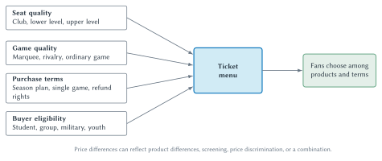
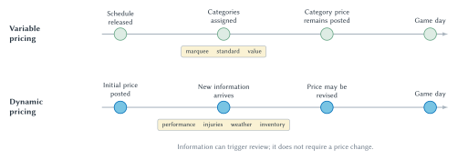
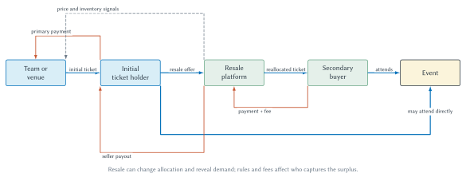

# Ticket Pricing and Attendance

A stadium can be enormously expensive to build and operate. Yet once the gates are open and the event is staffed, admitting one more spectator to an otherwise empty seat may add relatively little to the team's operating cost. If cost determined price in a simple mechanical way, this combination would seem to produce a puzzle: high total cost but a low price for the next ticket.

Sports organizations do not solve the puzzle by dividing the stadium bill by the number of seats. They face demand. Fans differ in what they are willing to pay, games differ in appeal, seats differ in quality, and the number of seats is fixed on game day. A team with market power must decide which ticket products to offer, how many tickets to sell, and how much to charge for each part of the menu.

That decision also extends beyond the primary box office. Prices can change as information arrives. Tickets can be resold. Attendance depends on the team and opponent, but also on timing, weather, viewing alternatives, loyalty, and the full cost of attending. Ticket pricing is therefore an unusually rich application of demand, elasticity, market power, and information.

## Learning Goals

After reading this chapter, you should be able to:

- distinguish fixed cost, marginal cost, and capacity scarcity in a stadium
- explain why low marginal cost does not imply a low ticket price
- explain why stadium construction costs and player payroll do not mechanically pass through to ticket prices
- analyze ticket pricing when stadium capacity is slack or binding
- connect elasticity to ticket revenue without confusing revenue with profit
- use income and cross-price elasticity to explain shifts in ticket demand
- distinguish product differentiation, market segmentation, and price discrimination
- explain first-, second-, and third-degree price discrimination
- explain two-part tariffs and personal seat licenses
- distinguish variable pricing from dynamic pricing by examining the pricing rule
- explain how primary and secondary ticket markets allocate tickets and surplus
- evaluate attendance evidence without treating correlation as causation

## The Cost Puzzle

Suppose a team has already built or leased its stadium and committed to the staff, security, lighting, and other services needed for a game. Many of those expenses do not change when one additional fan occupies an otherwise empty seat. They are fixed for the relevant decision.

Other costs do change. An additional spectator may require more cleaning, ticket processing, security attention, or other services. Those are marginal costs. The practical distinction is not that marginal cost is always zero. It is that the cost of serving one more spectator can be small relative to the average cost created by the stadium and the event.

::: quickconcept
**Marginal Cost In A Stadium**

Marginal cost is the additional cost created by serving one more spectator. Fixed stadium and event costs matter for the organization's overall viability, but they do not automatically determine the price of the next ticket.
:::

This distinction changes the pricing question. Once the event is going forward, the team does not ask, “What ticket price makes every seat pay an equal share of the stadium?” It asks, “How do price and quantity affect the additional revenue and cost associated with this event and ticket product?”

Fixed cost still matters. It affects whether a stadium should be built, whether the team can cover its obligations over time, and whether the business is sustainable. It simply does not enter the short-run pricing rule in the same way as marginal cost.

::: warning
**Costs Do Not Automatically Set Prices**

High fixed cost does not prove that a high ticket price is profit maximizing. Nor does low marginal cost prove that tickets should be inexpensive. A larger stadium bill or player payroll may explain why an organization wants more revenue, but it cannot make fans willing to pay more. The team can raise ticket prices only when demand, capacity, market power, and the design of the ticket menu allow it. **Costs may explain why the seller wants a higher price. Demand explains whether the seller can charge it.**
:::

## What Exactly Is The Product?

Before drawing a demand curve, we need to define what consumers are buying. “A ticket to the team” is usually too broad. A ticket is attached to a particular event, date, seat or section, purchase arrangement, and set of rules. A seat behind home plate for a rivalry game is not the same product as an upper-level seat for an ordinary weekday game.

This matters because a team rarely chooses one price for all spectators. It constructs a menu. The menu can vary along several dimensions:

- **seat quality:** location, view, comfort, club access, or included services
- **event quality:** opponent, expected team quality, star players, rivalry, or playoff importance
- **timing:** advance purchase, last-minute purchase, or a price that can be revised before game day
- **purchase terms:** single-game ticket, season plan, partial plan, group package, or refund rights
- **buyer eligibility:** student, youth, military, local resident, or another identifiable group

The demand curve in the basic model should therefore be interpreted as demand for a defined ticket product at a defined event, holding the rest of the menu fixed.

### Three Ideas That Are Easy To Confuse

**Product differentiation** means that the products themselves differ. A premium club seat may include a better view and additional services. A higher price may partly reflect those differences.

**Market segmentation** means that the seller identifies groups of buyers or purchasing situations that differ in willingness to pay or responsiveness to price. The seller may use eligibility rules, timing, purchase history, or product design to keep those groups partly separate.

**Price discrimination** means charging different markups for the same or sufficiently similar product in ways not fully explained by differences in marginal cost. It requires some market power and some ability to limit arbitrage between buyers.

These concepts can operate together, but they are not synonyms. Observing different prices for a club seat and an upper-level seat is not enough to prove price discrimination because the products differ. At the same time, teams can design differences among seats, bundles, and purchase rules partly to encourage fans with different willingness to pay to select different options. A good analysis identifies the product difference, the segmentation device, and the pricing mechanism instead of applying one label to the entire menu.

## Market Power And The Capacity Constraint

A team with market power faces a downward-sloping demand curve for a ticket product. To sell more tickets, it generally must offer a lower price, improve the product, or reach additional buyers. If we write inverse demand as

$$
P(Q)=a-bQ,
$$

then price falls as the number of tickets sold rises. Total ticket revenue is

$$
TR(Q)=P(Q)Q.
$$

Marginal revenue, $MR$, is the additional revenue generated by selling one more ticket. Because a lower price may be needed to expand sales, marginal revenue lies below the demand curve for positive quantities. In the linear example,

$$
MR(Q)=a-2bQ.
$$

The familiar monopoly rule is to expand ticket sales while marginal revenue exceeds marginal cost. If capacity does not interfere, the profit-maximizing quantity $Q^m$ occurs where

$$
MR=MC.
$$

The team then reads the price $P^m$ from the demand curve at that quantity. The price does not come from the marginal-revenue curve.

Stadium capacity adds the constraint

$$
Q \le K,
$$

where $K$ is the number of tickets that can be supplied for the relevant event and product.

**Figure 4.1: Pricing with slack and binding capacity.** When capacity is slack, the team chooses $Q^m$ where $MR=MC$ and reads price from demand. When capacity binds at $K_B<Q^m$, sales cannot expand to the unconstrained quantity, so quantity equals capacity and price is read from demand at $K_B$.

::: aifiguredescription
**Figure description: `fig:ch04-capacity-pricing`**

Both panels place ticket price $P$ on the vertical axis and ticket quantity $Q$ on the horizontal axis. Each uses the same downward-sloping demand curve $D$, a steeper dashed marginal-revenue curve $MR$, and a horizontal marginal-cost curve $MC$. The unconstrained monopoly quantity $Q^m$ occurs where $MR=MC$, and the corresponding price $P^m$ is read from the demand curve rather than the marginal-revenue curve. In the left panel, the vertical capacity line $K_S$ lies to the right of $Q^m$, so capacity is slack and some seats remain unused. In the right panel, the vertical capacity line $K_B$ lies to the left of $Q^m$. At $K_B$, marginal revenue remains above marginal cost, so the team would sell more if seats were available; capacity binds and the price $P(K_B)$ is read from demand at $K_B$. The figure holds demand and marginal cost fixed across panels. It does not show fixed stadium cost, prove that a smaller venue will sell out, or imply that every team always charges the market-clearing price.
:::

### Slack Capacity

In the left panel of Figure 4.1, capacity $K_S$ lies to the right of $Q^m$. The stadium has more seats than the team wants to sell at the profit-maximizing price. The team chooses $Q^m$, charges $P^m$, and leaves some capacity unused.

An unsold seat does not by itself prove that the team made a pricing mistake. Filling it may require lowering the price on other seats, changing purchase rules, or weakening the value of a package sold to other buyers. The relevant comparison is not “some revenue versus no revenue” for one isolated seat. It is the effect of a pricing change on the entire set of buyers affected by that change.

### Binding Capacity

In the right panel, capacity $K_B$ lies to the left of $Q^m$. The team would like to sell more tickets at the margin because $MR(K_B)>MC$, but no additional seats are available. Quantity is fixed at capacity. The associated market-clearing price is $P(K_B)$ on the demand curve.

Binding capacity creates scarcity. That scarcity can support a higher price, but the capacity line does not replace demand. A small stadium does not guarantee a sellout, and a large stadium does not guarantee empty seats. Demand determines whether the constraint actually binds.

### A Worked Pricing Example

Suppose demand for a game's tickets is

$$
P(Q)=120-Q,
$$

where $P$ is the ticket price in dollars and $Q$ is measured in thousands of tickets. Marginal revenue is

$$
MR(Q)=120-2Q.
$$

Assume that the marginal cost of admitting and serving another spectator is \$20. If the stadium holds 60,000 spectators, capacity is slack. Setting $MR=MC$ gives

$$
120-2Q=20,
$$

so $Q^m=50$ thousand tickets. Reading from demand, the team charges \$70. It leaves 10,000 seats unsold. Cutting the price to \$60 would fill the stadium and raise ticket revenue from \$3.5 million to \$3.6 million, but serving the additional 10,000 spectators would add \$200,000 in variable cost. Contribution toward fixed cost and profit would fall from \$2.5 million to \$2.4 million. The example shows why maximizing attendance, ticket revenue, and profit are three different objectives.

Now suppose the same game is played in a 40,000-seat stadium. At $Q=40$, marginal revenue is \$40, which still exceeds the \$20 marginal cost, but the team cannot sell another seat. Capacity binds. The market-clearing price at that capacity is \$80. The smaller stadium changes the constraint, not the demand curve. Whether the team can actually charge \$80 still depends on fans' willingness to pay.

::: sideline
**Why Would The Bills Build A Smaller Stadium?**

The stadium transition in Orchard Park turns the capacity diagram into a current local decision. The NFL listed the former Highmark Stadium's capacity as 71,621. The Bills list the new stadium, whose first regular-season game is scheduled for September 17, 2026, at 60,108. That is about 11,500 fewer seats, a reduction of roughly 16 percent.[^bills-capacity]

Why would a team with strong fan support reduce capacity? The Bills' stated explanation was not simply that fewer seats create scarcity. During planning, the team said that lower capacity made room for bigger seats, larger concourses, a more intimate setting, temperature-controlled areas, more food-and-beverage options, and gathering spaces. Later design materials emphasized canopy coverage, seats closer to the field, improved sightlines, and a wider range of premium products.[^bills-capacity]

Economically, the team was choosing more than the number of admissions. It was choosing the quality and composition of the stadium product. Space devoted to wider seats, circulation, clubs, concessions, and covered gathering areas cannot also be used for additional rows of ordinary seating. The relevant comparison therefore includes expected ticket revenue, premium revenue, complementary spending, construction and operating costs, and the value fans place on the experience.

Reducing capacity can also make sellouts more likely and tickets scarcer, which may support higher prices or resale values. But capacity alone does not prove that price elevation was the only objective, and it does not settle whether the change benefits fans as a group. Some fans may value comfort, sightlines, and weather protection; others may care more about the number and affordability of available seats. That distributional question is part of the economic trade-off. The separate question of who paid for the stadium belongs in Chapter 9.

Early resale asking prices for the stadium's first regular-season game illustrate the distinction. Some upper-level listings exceeded \$600 months before the game.[^bills-resale-prices] It is tempting to say that tickets became expensive because the stadium cost more than \$2 billion. That reverses the economic logic. The construction bill does not itself raise willingness to pay. A more attractive stadium experience, the novelty of opening a new venue, an appealing team, and the historic first game can shift demand outward. Roughly 11,500 fewer seats can make the capacity constraint tighter. Those demand and scarcity effects can support higher prices. Moreover, a resale listing is an asking price, not proof that a transaction occurred at that price.

The Los Angeles Lakers provide an older version of the same lesson. In 1996, the Lakers announced substantial ticket-price increases while pursuing elite free agents and then signed Shaquille O'Neal to a seven-year, \$121 million contract. The cheapest seats were scheduled to rise from \$9.50 to \$21, while courtside seats rose from \$500 to \$600. Yet the increases had been announced before the O'Neal signing. After the signing, the Lakers reportedly sold about 2,000 season tickets in three hours.[^lakers-cost-demand]

The Lakers did not acquire the ability to charge more merely because they had a large new bill to pay. They could charge more because a team featuring O'Neal was more valuable to customers. His salary and the higher ticket prices were both connected to the same underlying fact: star talent increased expected demand. When costs and prices rise together, ask what changed willingness to pay or scarcity before concluding that costs caused the price increase.
:::

## Elasticity In The Pricing Decision

Chapter 2 introduced the elasticity formulas, classifications, midpoint method, and total-revenue rule. Here elasticity becomes a decision tool. Over an inelastic range of demand, a price increase raises ticket revenue; over an elastic range, it lowers ticket revenue. A price cut reverses those revenue effects.

A team does not need to publish a textbook elasticity calculation to face this problem. Every proposed price embodies a forecast: how many tickets will sell at that price rather than at the alternatives? Historical sales, resale prices, experiments, surveys, and statistical demand models can inform the forecast. When the Bills choose prices across seats and games, for example, they must form some view of fan responsiveness even though we should not claim to know their undocumented internal method.

### There Is No Single Team Elasticity

Elasticity belongs to a particular product, group, price range, and time. Demand for a rivalry game may be less price responsive than demand for an ordinary game. Students may be more responsive than corporate buyers. Club seats and promotional upper-level seats may face different demand. A fan deciding months in advance may have different alternatives than a visitor shopping on game day.

This is one reason teams build ticket menus rather than rely on a single teamwide estimate. Expected responsiveness can inform seat tiers, game tiers, discounts, and the timing of price changes. The useful question is not “What is the Bills' elasticity?” but “How responsive is demand for this ticket product, among these buyers, over the price change being considered?”

An observed sellout does not answer that question. It tells us that quantity demanded at the posted terms was at least as large as available capacity. It does not reveal how many buyers would have appeared at a lower price or how much more current buyers would have paid. When sales are capped by stadium capacity, the observed quantity conceals some of the underlying demand curve.

### Income And Related Products

Own-price elasticity concerns a movement along a demand curve. Income and the prices of related products can shift the entire curve. Premium seating, ordinary single-game tickets, and low-price promotions need not respond to an income change in the same way. Teams should not assume that every sports ticket is a luxury good merely because some seats are expensive.

Related products are equally important. Parking and tickets may be complements, so an increase in parking prices can reduce ticket demand. Watching at home may substitute for attending a game, but media exposure can also deepen interest and make future attendance more attractive. A partial season plan may substitute for single-game tickets while complementing concessions or merchandise. The relevant relationship is an empirical question about defined products, buyers, and time horizons—not something the team can infer from the labels alone.

::: sideline
**Ticket Revenue Is Not Total Event Profit**

An additional spectator may buy concessions, parking, or merchandise and may become more valuable to the organization over time. A team may also care about the atmosphere created by a full stadium. These considerations do not overturn the demand model; they change the marginal benefit of attendance and the objective the organization is trying to maximize.
:::

## From One Price To A Ticket Menu

The single-price model isolates the main trade-off, but actual ticketing looks more like menu design. Teams offer combinations of seats, games, eligibility rules, and purchase commitments. Economists use the language of price discrimination to study how firms capture different amounts of surplus from buyers with different willingness to pay.

### First-Degree Price Discrimination

Under first-degree price discrimination, the seller charges each buyer approximately that buyer's maximum willingness to pay. Perfect first-degree discrimination is a benchmark rather than a realistic description of most sports ticket markets. Teams do not know every fan's willingness to pay with precision, and resale, privacy, fairness concerns, and transaction costs limit individualized extraction.

Data and personalized offers may move pricing in this direction, but a price that varies across time or seats is not automatically first-degree discrimination.

### Second-Degree Price Discrimination

Under second-degree price discrimination, the seller offers a menu and lets buyers sort themselves. Season plans, partial plans, premium packages, refund terms, and seat-service combinations can induce fans with different preferences to choose different options.

This is where product differentiation and screening overlap. The products may genuinely differ, but the menu may also be designed so that buyers reveal something about their willingness to pay through their choices.

### Third-Degree Price Discrimination

Under third-degree price discrimination, the seller charges different prices to identifiable groups whose demand differs. Student or youth discounts are familiar examples. The strategy works only if the seller can identify eligibility and limit resale from the discounted group to other buyers.

The economic prediction is about relative elasticities, not about whether one group is more deserving. Holding other factors constant, a profit-seeking seller tends to charge a lower markup to a group with more elastic demand.

**Figure 4.2: Constructing a ticket menu.** Teams build ticket menus across product characteristics and screening rules. A price difference may reflect product differentiation, market segmentation, price discrimination, or a combination.

::: aifiguredescription
**Figure description: `fig:ch04-seat-and-segment-pricing`**

Four boxes feed into a central ticket menu. Seat quality includes club, lower-level, and upper-level seating. Game quality includes marquee, rivalry, and ordinary games. Purchase terms include season plans, single-game purchases, and refund rights. Buyer eligibility includes student, group, military, and youth categories. An arrow then leads from the ticket menu to fans choosing among products and terms. The main inference is that a team normally designs a menu rather than selecting one price for every fan and seat. Some differences reflect genuinely different products, while others screen buyers or support price discrimination. The diagram is schematic: it does not identify actual prices, prove that every dimension is price discrimination, or imply that the team knows each fan's exact willingness to pay.
:::

## Two-Part Tariffs And Seat Licenses

A two-part tariff divides payment into an access charge and a usage charge. A fan might pay an initial fee for the right to buy tickets and then pay separately for the tickets themselves. This structure can transfer more consumer surplus to the seller while also creating a longer-term commitment between the buyer and the team.

The acronym **PSL** is not expanded uniformly. Carolina uses *Permanent Seat License*, while Buffalo uses *Personal Seat License*. Both can resemble a two-part tariff, but the controlling contract matters more than the label. As of August 2026, the Buffalo Bills describe a PSL for new Highmark Stadium as a one-time purchase giving the licensee the right and obligation to purchase season tickets; the team requires the PSL for season-ticket purchases.[^bills-psl] The license payment and the later season-ticket payment are economically distinct.

::: casestudy
**The PSL: A Ticket, An Asset, Or A Financing Contract?**

The modern NFL history of PSLs begins in Charlotte. Sports marketer Max Muhleman developed the Panthers' program while founder Jerry Richardson was trying to secure an expansion franchise and finance a new stadium. Fans placed deposits before the team had played a game in Charlotte. The program demonstrated committed demand, generated upfront capital, and became the first large-scale PSL system in the NFL. It is safer to make that qualified claim than to call Charlotte the inventor of every seat-license arrangement; colleges and other venues had used related licensing ideas earlier.[^psl-history]

The Panthers' program also shows why the word *license* matters. A PSL holder does not buy the game ticket once and for all. The holder buys a contractual right to purchase season tickets associated with specified seats and must still pay the annual ticket price. The Panthers currently advertise annual season-ticket purchase rights, payment plans, playoff access, and the ability to transfer PSL ownership. They also operate an official marketplace on which licenses can be bought, sold, or privately transferred.[^panthers-psl]

The license therefore combines several economic relationships.

**A two-part tariff.** The one-time PSL payment is an access charge. Annual season tickets are the usage charge. Separating the payments allows the team to collect some of the value devoted fans expect to receive over multiple seasons without placing the entire charge into one year's ticket price.

**A financing instrument.** PSL sales bring future fan payments forward. The team receives capital during stadium development rather than waiting to collect all revenue through later ticket sales. This can finance part of the team's stadium contribution, but the money is not free: fans provide it, often before receiving the future stream of games.

**A commitment device.** A PSL can create a durable relationship between a fan and a seat. That commitment may help the team forecast demand and may give the fan continuity, priority, and a sense of ownership. It can also become a burden if the holder's income, location, interest, or ability to attend changes.

**A risky asset-like contract.** A transferable PSL may have resale value, but it is not equivalent to a risk-free investment or ownership of part of the team. Its value depends on future team demand, annual ticket prices, stadium terms, transfer rules, remaining contract life, and the availability of comparable seats. If annual ticket prices rise enough, the resale value of the license can fall because the future right becomes more expensive to exercise.

Economists and lawyers describe a right that can be transferred to someone else as **alienable**. In plainer language, an alienable PSL can be resold, given away, or passed to another holder, subject to the contract's rules. The original Carolina licenses were not freely alienable. Until June 1997, the Panthers retained the right to repurchase at the original price a PSL that its holder wanted to transfer outside the family.[^psl-alienability] Modern PSL programs may permit resale, although team approval, transfer windows, fees, and other restrictions can still make alienability incomplete.

Alienability can raise what a buyer is willing to pay at the initial sale. A new-car buyer may pay more when a dependable used-car market preserves some future resale value. Similarly, a fan may pay more for a PSL that can later be sold than for an otherwise identical right that must simply be surrendered. This does not guarantee a high resale price. It gives the holder an *option* to recover part of the initial payment if another buyer values the license.

| Perspective | Potential benefits | Potential costs or risks |
| --- | --- | --- |
| Team | Upfront capital, demand information, a committed season-ticket base, and greater capture of long-run fan surplus. | Sales risk, administrative and transfer costs, and backlash if fans view the charge as exclusionary or inconsistent with loyalty. |
| Fan | Seat continuity, purchase priority, playoff or event access, possible transferability, and possible resale value. | Large upfront payment, continuing ticket obligations, financing cost, forfeiture or contract risk, and uncertain resale value. |
| Public | A source of private capital for the team's share and evidence of committed market demand. | No automatic reduction in public subsidy; access may become more unequal, and public financing questions remain separate. |

Economists call the relevant alternative a **counterfactual**: what would likely have happened under a different choice, policy, or set of conditions. This comparison reveals why “pro” and “con” depend on the counterfactual. Relative to ordinary annual season tickets, a PSL may give a fan more durable and transferable rights. Relative to buying only the games the fan wants, it imposes an upfront charge and a longer commitment. Relative to team borrowing, it supplies capital from customers. Relative to a larger public contribution, it may finance more of the private share—but only if the stadium agreement actually changes that contribution.

Buffalo now provides a current version of the same experiment. The Bills require PSLs for season tickets in the new Highmark Stadium and reported that available PSL inventory sold out in December 2025.[^bills-psl] The sellout demonstrates demand at the offered terms; it does not prove that every license will appreciate, that every prior season-ticket holder is better off, or that the public contribution was reduced.

The cleanest economic description is therefore not “a PSL is good” or “a PSL is a fee with no value.” A PSL is a two-part pricing instrument, an upfront financing mechanism, and a contract allocating future rights and risks between a team and its fans. Its value depends on the specific terms.
:::

## Variable And Dynamic Pricing

Prices can differ across games even when the seat is physically identical. A weekend rivalry game and an ordinary weekday game may face different demand. The seller can recognize those differences in advance or revise prices as information arrives.

For this chapter, the useful operational distinction is:

- **variable pricing:** prices differ across preassigned games, seats, or categories
- **dynamic pricing:** a price can be revised over time in response to new information, remaining inventory, or observed demand

The terminology used by organizations is not perfectly uniform. Students should therefore inspect the rule itself. Can the price change after the initial schedule is announced? What information triggers a revision? How often can it change? Is the process automatic, discretionary, or both?

::: casestudy
**Variable And Dynamic Pricing**

FIFA's ticketing guidance for the 2026 World Cup said that it applied variable pricing and could adapt prices across sales phases after reviewing demand and availability. The same guidance denied using a dynamic-pricing model because prices were not automatically modified.[^fifa-pricing]

The St. Louis Cardinals describe a different rule. Their ticket page says that single-game prices may be adjusted upward or downward daily in response to factors including team performance, pitching matchups, weather, and ticket demand.[^cardinals-pricing]

The examples are useful because they reveal more than two labels. Under this chapter's operational distinction, FIFA's policy contained a dynamic element: the price could be revised after the initial sale in response to demand and availability, even if the revision was periodic and discretionary rather than automatic. The Cardinals explicitly call their repeated revisions dynamic. The economic questions are the timing of commitment, the information used, and the way the price responds—not merely the seller's preferred label.

Historical MLB evidence also supports treating ticket products separately. Using data from eleven teams, Paul and Weinbach found that factors associated with the highest- and lowest-priced dynamically priced tickets differed with team quality, uncertainty of outcome, key opponents, weekends, opening day, and temperature.[^paul-weinbach] The study does not supply one universal pricing formula. It shows why a seller may learn more by examining demand for defined ticket products than by estimating one average response for the entire stadium.
:::

Dynamic pricing can improve the match between price and current demand. It can also create uncertainty for buyers, change the value of purchasing early, and raise concerns about transparency or fairness. Those reactions are part of demand. A pricing system that extracts more revenue from one transaction may weaken trust or alter future purchase behavior.

**Figure 4.3: Variable versus dynamic pricing.** Variable pricing assigns different prices to categories in advance. Dynamic pricing permits revision as information and demand conditions evolve, although new information need not trigger a change.

::: aifiguredescription
**Figure description: `fig:ch04-variable-dynamic-pricing`**

Two aligned timelines run from an early pricing decision to game day. The upper timeline represents variable pricing. After the schedule is released, games or seats are assigned in advance to categories such as marquee, standard, and value, and the category price remains posted. The lower timeline represents dynamic pricing. An initial price is posted, new information arrives, and the price may be revised before game day. The information examples are team performance, injuries, weather, and remaining inventory. The main inference is that variable pricing differentiates preset categories, whereas dynamic pricing permits later revision as conditions change. The figure does not claim that terminology is perfectly uniform across sellers, that every new signal changes the price, or that dynamic pricing is fully automatic.
:::

## Primary And Secondary Ticket Markets

The **primary market** creates the initial allocation. The team, venue, league, or authorized seller determines the original ticket products, prices, and purchase rules. The **secondary market** reallocates some of those tickets after the initial sale.

Resale exists because information and circumstances change. A buyer may learn that a ticket is more valuable than expected, while another buyer may become unable to attend. A secondary market can move the ticket toward the buyer with the higher willingness to pay.

That does not mean resale has only benefits. Transactions can involve search costs, platform fees, fraud risk, restrictions, and uncertainty about ticket validity. Resale also changes who captures the surplus. If a ticket is initially sold below the amount some buyers are willing to pay, part of the resulting resale value may go to the initial buyer or an intermediary rather than to the team.

Economists therefore separate at least three questions:

1. **Allocation:** Does resale move tickets toward people who value attendance more highly?
2. **Distribution:** Do the team, initial buyer, reseller, platform, or final buyer capture the resulting surplus?
3. **Transaction design:** How do fees, refund options, release timing, transfer restrictions, and price disclosure affect the market?

Consider a ticket originally sold for \$60. The first buyer later cannot attend and resells it for \$110. If a platform retains a \$10 fee, the original buyer receives \$100 and nets \$40 relative to the original purchase price. A final buyer willing to pay \$140 receives \$30 of consumer surplus, while the platform receives \$10. The ticket reaches someone who values attending more highly, but the team does not capture the resale markup in this simple example. Different fees, refund rights, resale restrictions, or revenue-sharing rules would change the distribution and could also affect whether the reallocation occurs.

The welfare answer is not automatic. A flexible resale market may improve allocation, but high transaction costs or deceptive price presentation can absorb some of that gain. A centralized refund or exchange system may reduce flexibility while improving control or lowering certain risks. Courty's economic analysis of ticket resale and later work comparing resale with centralized partial refunds illustrate these competing effects.[^courty-resale] [^vollmer-resale]

Price transparency is now part of the institutional setting. The Federal Trade Commission's rule on unfair or deceptive fees took effect in May 2025 and applies upfront total-price requirements to live-event ticketing, including secondary markets.[^ftc-fees] The rule does not determine the economically correct fee. It changes how mandatory fees must be disclosed when sellers advertise a price.

**Figure 4.4: Primary and secondary ticket markets.** The primary market creates the initial allocation. Resale can reallocate a ticket and reveal willingness to pay, while platform fees and market rules affect the distribution of surplus.

::: aifiguredescription
**Figure description: `fig:ch04-primary-secondary-market`**

The main left-to-right flow begins with the team or venue, which sends an initial ticket to an initial ticket holder in exchange for a primary payment. The holder may attend the event directly or offer the ticket to a resale platform. The platform can send a reallocated ticket to a secondary buyer, who pays the resale price plus any fee and then attends the event. A separate payment arrow shows the platform remitting a seller payout to the initial holder. A dashed arrow from the resale platform back to the team represents price and inventory information revealed by resale activity. Blue arrows represent ticket allocation or attendance, orange arrows represent payments, and the dashed gray arrow represents information. The figure separates allocation from distribution: resale may move a ticket to a buyer with higher willingness to pay while fees and rules determine who captures the surplus. It does not prove that resale always raises welfare, that the team receives no resale revenue under every arrangement, or that every platform uses the same fee and information-sharing rules.
:::

## What Determines Attendance?

Attendance is an observed outcome after price, capacity, and the other features of the event interact. It is not a pure measure of underlying demand, and it is not generated by ticket price alone.

The dependent variable itself requires care. A reported attendance figure may count tickets sold or distributed, while a turnstile measure counts people who entered the venue. A ticket holder who does not attend appears in the first measure but not the second. A no-show for a paid ticket does not change primary ticket revenue, but it can matter greatly for concessions, stadium atmosphere, staffing, and any attempt to estimate the demand to be physically present.

The research literature identifies several recurring categories of demand shifters, but it does not produce one universal attendance equation for every sport and market. Borland and Macdonald's review emphasizes contest quality, viewing quality, and uncertainty of outcome while warning that the evidence does not yield simple conclusions that apply everywhere.[^borland-macdonald] A later scoping review documents a large literature but also finds important gaps, including limited work on women's and niche sports, emerging markets, and disaggregated attendance behavior.[^schreyer-ansari]

| Factor | Economic mechanism | Typical evidence | Important caveat |
| --- | --- | --- | --- |
| Ticket price | A higher own price reduces quantity demanded, holding other factors fixed. | Ticket-price measures enter attendance-demand models. | Teams often raise prices for games expected to have high demand, making simple price-attendance correlations misleading. |
| Related-product prices and full trip cost | Parking, travel, media access, and competing entertainment can change the relative cost of attending. | Studies may include travel cost, time, or available viewing alternatives. | The products may be substitutes or complements, and the sign should not be assumed without evidence. |
| Consumer income | Income changes the feasible set of purchases and may shift demand differently across ticket products. | Local or household income measures may enter demand models. | Aggregate income is an imperfect proxy for the income of actual buyers; the sign and magnitude may vary by seat and buyer segment. |
| Home-team and contest quality | Better expected play can increase the value of attending. | Team records, rankings, or expected performance often enter attendance models. | Quality may also affect prices, media attention, and opponent interest. |
| Opponent and star players | A prominent opponent or star can raise expected entertainment value. | Opponent indicators, star measures, or matchup characteristics are used. | Injuries, selection effects, and the definition of star quality complicate interpretation. |
| Uncertainty of outcome | A closer contest may be more suspenseful. | Betting odds or differences in team strength can proxy for uncertainty. | Fans may also value a likely home win, elite quality, rivalries, or dynasties; the expected effect is not universally positive. |
| Day, time, and weather | Scheduling and comfort change the opportunity cost of attending. | Weekend, start-time, temperature, and precipitation controls are common. | Effects vary by sport, stadium design, climate, and local routines. |
| Viewing alternatives | Broadcasts and streaming can substitute for attendance or deepen interest in the team. | Availability and quality of media coverage may enter demand studies. | Media exposure and fan demand are jointly determined, so causation can run in both directions. |
| Loyalty and brand attachment | Habit, identity, and community attachment can make demand persistent. | Past attendance, season-ticket status, or local-market indicators may capture persistence. | These variables are imperfect measures of loyalty and may absorb other omitted factors. |

**Table 4.1: A framework for attendance evidence.** The table identifies mechanisms and empirical cautions rather than asserting one effect size for every sport.

### Association, Prediction, And Causation

Suppose high-priced games also have high attendance. It would be a mistake to conclude that raising price causes attendance to rise. Teams may charge more precisely when a rivalry, star opponent, or playoff race has shifted demand outward. The common demand shift raises both the price selected by the team and the number of tickets fans want to buy.

That is an **association**: price and attendance move together in the observed data.

A model may still use price, opponent, weather, and team quality to **predict** attendance. Good prediction means the model performs well on observations it did not simply memorize. It does not by itself tell us what would happen if the team changed price while everything else remained the same.

A **causal** claim asks that counterfactual question. How would attendance change if the price changed but the other determinants of demand did not? Answering it requires a research design that separates the price change from the demand conditions that caused the team to choose that price.

Capacity creates another complication. At a sellout, recorded attendance is capped. Demand may rise substantially without producing any increase in tickets sold. A dataset containing many sellouts can therefore hide changes in underlying demand.

These distinctions matter for management and policy. A variable can improve forecasts without being a useful policy lever, and a strong correlation can disappear once the underlying selection process is considered.

## The Connected Pricing Decision

The chapter began with a simple question about one ticket price. The real decision is connected:

1. Define the ticket products and the market for each one.
2. Estimate how different buyers respond to price and product features.
3. Determine whether capacity is likely to bind.
4. Build a menu that balances revenue, marginal cost, complementary spending, and longer-run demand.
5. Decide which prices are committed in advance and which may change as information arrives.
6. Anticipate how resale, fees, and transfer rules affect allocation and surplus.
7. Evaluate attendance evidence without confusing observed correlations with causal effects.

This connected view also explains why the same team may use several pricing strategies at once. It may sell season plans through an access commitment, offer differentiated seat products, discount to an identifiable group, adjust some single-game prices over time, and permit resale through a platform. Each part addresses a different economic problem.

## Big Picture

The central lesson is not that teams always charge the highest imaginable price. It is that ticket prices emerge from a constrained choice.

- Fixed costs affect long-run viability, but marginal decisions depend on marginal revenue and marginal cost.
- Capacity matters when it prevents the team from selling the unconstrained profit-maximizing quantity.
- Elasticity determines how a price change affects ticket revenue over a particular range.
- Different prices may reflect product differences, segmentation, price discrimination, or a combination of the three.
- Variable and dynamic pricing differ in how the pricing rule responds to categories, time, and new information.
- Secondary markets can improve allocation while changing transaction costs and the distribution of surplus.
- Attendance evidence must separate demand mechanisms from prediction and causal claims.

Ticket markets lead naturally to the next chapter. A fan can attend in person, watch through a media platform, follow highlights, or divide attention across several products. Once the market extends beyond the stadium, the scarce resource is no longer only seating capacity. It is also attention.

## Review Questions

1. Why can a team face high fixed stadium costs and still have a low marginal cost for an additional spectator?
2. Under what condition does stadium capacity bind? Why does a small stadium not guarantee a sellout?
3. Why can an unsold seat be consistent with profit maximization under single-price monopoly pricing?
4. How does own-price elasticity determine the direction of the total-revenue response to a price change?
5. How could income and the price of a related product change a team's ticket menu even if its own ticket price has not changed?
6. Distinguish product differentiation, market segmentation, and price discrimination.
7. Why is a PSL a two-part tariff? What does alienability add to the contract?
8. What feature of the pricing rule distinguishes variable pricing from dynamic pricing?
9. How can resale improve ticket allocation while leaving its welfare effect ambiguous?
10. Why can a positive association between ticket prices and attendance fail to identify the causal effect of price?

## Problems And Applications

1. A team estimates demand as $P(Q)=150-2Q$, where $P$ is dollars and $Q$ is thousands of tickets. Marginal cost is \$30 and stadium capacity is 40,000. Derive marginal revenue, find the unconstrained monopoly quantity and price, and determine whether capacity binds.
2. A club estimates that the own-price elasticity of demand for an upper-level ticket product is $-1.4$ over the price range it is considering. If the club raises the price by 5 percent, approximate the percentage change in quantity demanded and predict the direction of the ticket-revenue effect. Why is this estimate alone insufficient to determine what happens to total profit?
3. A team's demand analysis estimates the cross-price elasticity between stadium parking and tickets at $-0.25$. Are the products behaving as substitutes or complements? Explain why raising the parking price could reduce total event profit even if parking revenue increases.
4. A PSL costs \$4,000, gives the holder the right and obligation to purchase season tickets for \$1,200 per year, and can be resold subject to team approval. Identify the access and usage charges. Then explain how transferability, future ticket-price increases, and expected team quality could affect the PSL's initial and resale values.
5. A ticket is sold by a team for \$75, resold for \$160, and purchased by a fan willing to pay \$190. The platform keeps \$15 and remits the rest to the reseller. Calculate the final buyer's consumer surplus, the reseller's net gain before other costs, and the platform's revenue. Which party does not capture the resale markup under these assumptions?
6. A dataset shows that games with higher ticket prices also draw larger crowds. Give a plausible omitted demand shifter that could produce this association. Then describe what additional evidence would be needed to estimate the causal effect of price on attendance.

::: studyandlearn
**Audit A Ticket-Pricing Claim**

Choose a current team, venue, or authorized ticket seller and record the date you accessed its pricing page. Then answer:

1. What precisely is the ticket product: game, seat, package, eligibility rule, and purchase date?
2. Does the seller describe the system as variable, dynamic, personalized, or something else?
3. What can actually change, when can it change, and what information appears to matter?
4. Does the displayed total price include mandatory fees? Which permitted exclusions or optional charges, if any, appear later?
5. Does the evidence support a descriptive, predictive, or causal claim?
6. Which conclusion can you defend, and which tempting conclusion goes beyond the evidence?

Provide the source link and distinguish the seller's description from your economic interpretation.
:::

## Suggested Assignment

Choose one team and one future home game. Record the access date and compare the same ticket product in the team's primary market and one authorized secondary market. Define the seat, purchase terms, advertised total price, and applicable fees carefully. In 500-750 words, explain what the price difference can reveal about demand and allocation, what it cannot establish, and how the conclusion could change before game day. Include links or screenshots and separate factual observations from your economic interpretation.

## Source Notes

[^bills-psl]: Buffalo Bills, “Highmark Stadium,” accessed August 11, 2026, <https://www.buffalobills.com/stadium/>. The team's December 26, 2025 inventory update reported that available new-stadium PSL inventory had sold out: <https://www.buffalobills.com/news/bills-announce-seating-availability-update-for-new-highmark-stadium>.
[^psl-history]: The Carolina Panthers describe their PSL plan as brand-new to the NFL and central to the franchise's early ticketing strategy: <https://www.panthers.com/news/ticketing-leader-phil-youtsey-calls-it-a-career>. The Associated Press credits Charlotte marketer Max Muhleman with developing the professional-sports PSL concept used to help finance the Panthers' stadium: <https://apnews.com/article/8fe7baf40fbf346676a42bf47a470772>. For an early industry analysis, see Larry M. McCarthy and Richard Irwin, “Permanent Seat Licenses (PSLs) as an Emerging Source of Revenue Production,” *Sport Marketing Quarterly* 7, no. 3 (1998): 41–46, <https://doi.org/10.1177/106169349800700305>.
[^panthers-psl]: Carolina Panthers, “Permanent Seat Licenses,” accessed August 11, 2026, <https://www.panthers.com/tickets/psls-ab>; Carolina Panthers Official PSL Marketplace, accessed August 11, 2026, <https://panthers.strmarketplace.com/>.
[^psl-alienability]: Mark Asher, “New Technique Saves a Seat, Collects a Fortune,” *Washington Post*, May 3, 1995, <https://www.washingtonpost.com/archive/sports/1995/05/04/new-technique-saves-a-seat-collects-a-fortune/4c643233-ea12-45bc-91a7-8c144f241686/>. The restriction was a team repurchase right rather than an absolute prohibition on every transfer.
[^bills-capacity]: The NFL's *2024 Record and Fact Book* lists the former Highmark Stadium at 71,621 seats: <https://operations.nfl.com/media/hfjn4oid/2024-record-fact-book-incl-supplemental.pdf>. The Bills report a final capacity of 60,108 and a first regular-season game on September 17, 2026: <https://www.buffalobills.com/news/impressed-by-every-aspect-of-it-bills-officially-open-highmark-stadium-with-ribbon-cutting-ceremony>. For the team's explanation of the reduced capacity and subsequent design details, see <https://www.buffalobills.com/news/what-bills-fans-need-to-know-about-the-new-bills-stadium-project> and <https://www.buffalobills.com/news/updates-on-bills-2024-season-ticket-member-renewals-and-opening-of-bills-stadium-experience>. Current details rechecked August 11, 2026.
[^bills-resale-prices]: Brian Mazurowski, “Many Unknowns as Fans Prepare for Bills Tickets to Go On Sale,” *WBEN*, May 12, 2026, <https://www.audacy.com/wben/news/local/bills-tickets>. For the stadium cost and capacity, see John Wawrow, “Bills' New Stadium Costs Balloon to \$2.1 Billion,” Associated Press, November 22, 2024, <https://apnews.com/article/bills-stadium-cost-pegula-8c56fad9d970f2b17429d3ae779f70ba>.
[^lakers-cost-demand]: Scott Howard-Cooper, “Most Laker Ticket Prices Will Increase,” *Los Angeles Times*, July 19, 1996, <https://www.latimes.com/archives/la-xpm-1996-07-19-sp-25835-story.html>; George Solomon, “O'Neal Receives a Record Deal from the Lakers,” *Washington Post*, July 18, 1996, <https://www.washingtonpost.com/archive/sports/1996/07/19/oneal-receives-a-record-deal-from-the-lakers/d451b845-63c3-4511-bb17-5b2f72492703/>.
[^fifa-pricing]: FIFA, “How does FIFA determine ticket prices for the FIFA World Cup 26?”, accessed August 11, 2026, <https://gpcustomersupportfwc2026.tickets.fifa.com/hc/en-gb/articles/30201776314397-9-How-does-FIFA-determine-ticket-prices-for-the-FIFA-World-Cup-26>.
[^cardinals-pricing]: St. Louis Cardinals, “Dynamic Pricing,” accessed August 11, 2026, <https://www.mlb.com/cardinals/tickets/dynamic-pricing>.
[^paul-weinbach]: Rodney J. Paul and Andrew P. Weinbach, “Using Prediction Market Prices to Differentiate Factors that Influence the Highest and Lowest Priced Tickets in Dynamic Pricing for Major League Baseball,” *Journal of Prediction Markets* 9, no. 2 (2015): 43–63, <https://doi.org/10.5750/jpm.v9i2.1081>.
[^courty-resale]: Pascal Courty, “Some Economics of Ticket Resale,” *Journal of Economic Perspectives* 17, no. 2 (2003): 85–97, <https://pubs.aeaweb.org/doi/10.1257/089533003765888449>.
[^vollmer-resale]: Drew Vollmer, “Is Resale Needed in Markets with Refunds? Evidence from College Football Ticket Sales,” *RAND Journal of Economics* 56, no. 3 (2025): 251–268, <https://doi.org/10.1111/1756-2171.12501>.
[^ftc-fees]: Federal Trade Commission, “The Rule on Unfair or Deceptive Fees: Frequently Asked Questions,” accessed August 11, 2026, <https://www.ftc.gov/business-guidance/resources/rule-unfair-or-deceptive-fees-frequently-asked-questions>.
[^borland-macdonald]: Jeffery Borland and Robert Macdonald, “Demand for Sport,” *Oxford Review of Economic Policy* 19, no. 4 (2003): 478–502, <https://doi.org/10.1093/oxrep/19.4.478>.
[^schreyer-ansari]: Dominik Schreyer and Payam Ansari, “Stadium Attendance Demand Research: A Scoping Review,” *Journal of Sports Economics* 23, no. 6 (2022): 749–788, <https://doi.org/10.1177/15270025211000404>.
