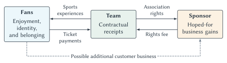

# Fan Behavior, Branding, and Sponsorship

If a restaurant disappoints you seventeen years in a row, you probably find another restaurant. A sports team can disappoint you for just as long and still be your team.

Buffalo Bills fans have some experience with this distinction. The Bills ended a seventeen-season playoff absence in the 2017 season.[^bills-drought] Many students in Western New York grew up in families for whom following the Bills was part of ordinary life, even when January football usually involved watching somebody else. Ask a longtime fan why that attachment survived and the answer is unlikely to be a comparison of the team's recent winning percentage with every available alternative.

The history gives us a question, not a statistical result. It does not establish that losing had no effect on attendance, viewing, or spending. The question is why a disappointing team can retain an important place in people's lives at all. What are its fans getting that the standings do not measure?

Chapter 4 considered the prices fans pay to attend games. This chapter looks behind and beyond that transaction. Fans may value entertainment, family traditions, local identity, friendships, or the feeling of participating in something larger than themselves. Those relationships can support ticket demand, but they can also make a logo valuable, help an athlete sell products, or persuade a company to pay for an association with a team.

That last step deserves careful attention. A fan's enjoyment, a team's sponsorship revenue, and a sponsor's business gains are three different things. Understanding how they connect—and where the connections can fail—is the economics of this chapter.

## Learning Goals

After reading this chapter, you should be able to:

- explain why sports fandom can persist through disappointing seasons
- distinguish fan attachment from attendance, viewing, and spending
- use switching costs, complements, and opportunity cost to analyze loyalty
- explain brand capital and distinguish it from annual revenue and franchise value
- identify the different rights associated with teams, athletes, leagues, and events
- distinguish merchandise sales, licensing payments, sponsorship, and endorsements
- explain what a sponsor buys and why using those rights requires additional resources
- assess audience fit, commercial risk, and the opportunity cost of a sponsorship
- distinguish digital attention from paying customers and incremental business
- evaluate a sponsorship claim using an appropriate counterfactual

## What Are Fans Consuming?

### A Game Is A Bundle Of Benefits

A basketball game supplies a contest, but the contest is not the entire product. One spectator is studying defensive adjustments. Another is spending an evening with friends. A parent is introducing a child to a family tradition. Someone watching from another state is reconnecting with home. The same game supplies different combinations of benefits to different people.

Economics has room for all of these motives. Recall that **utility** means satisfaction or well-being, not usefulness in a narrow practical sense. A person can receive utility from an exciting finish, a familiar ritual, or the chance to talk about the game the next morning. None requires a cash payoff. Nor must we personally enjoy an activity to recognize why another person values it.

Sports also provide occasions for shared attention. A game gives people something to anticipate, experience, and discuss together. The conversation can begin days before kickoff and continue long after the final score. From the fan's perspective, two hours of television may support a much larger set of social activities.

These activities are often **complements**: enjoying one makes another more attractive. Knowing that friends will watch can increase your interest in watching. Following a team can make a podcast more enjoyable, and the podcast can make the next game more interesting. A jersey can be clothing, a souvenir, and an invitation to a conversation with another supporter.

This helps explain why a team's product extends beyond the game itself. It does not mean every extension is valuable. A fan may enjoy the sport while finding constant promotional messages irritating. The relevant question is what a particular person gains from the entire experience, relative to its money and time costs.

::: keypoint
**Fans Buy More Than Games**

Sports consumers often buy identity, belonging, status, memory, and affiliation, not only entertainment minutes. Some of these benefits also arise without a purchase. A ticket transaction captures only one part of the relationship.
:::

### Identity And Belonging

**Identity-based consumption** occurs when an activity or product helps express who a person is or the groups to which that person belongs. A team can represent a hometown, a university, a family, or a community encountered later in life. Wearing its colors may communicate that connection even on a day when no game takes place.

George Akerlof and Rachel Kranton helped bring identity explicitly into economic analysis. Their central contribution was to show how a person's sense of self and social categories can affect choices and interactions.[^identity] Applied to sports, the idea is straightforward: a fan may care about being a particular kind of supporter, not simply about selecting the most successful available team.

Imagine telling a lifelong Bills fan that switching to whichever team has the best championship odds would increase the expected number of victories they could celebrate. The suggestion misses part of the choice. Celebrating *their team's* victory and celebrating the victory of a newly selected team may not provide the same satisfaction. The history of the relationship changes the product.

Identity can also involve status. Fans may take pride in having followed a team before it became successful, knowing obscure facts, or attending games in difficult conditions. Those rewards help explain why people sometimes emphasize loyalty itself. The status benefit need not be monetary, and it need not be available to everyone in equal measure.

There is no reason to assume all fandom works this way. Some people follow individual athletes, enjoy several teams, or watch only major events. Some lose interest after a bad season. A useful explanation should accommodate these differences instead of dividing people into “real fans” and everyone else.

### Fans Help Produce The Experience

The team organizes the game, but fans contribute to the surrounding experience. A lively crowd, a supporters' group, a shared chant, or a good discussion can make participation more enjoyable for others. This is a possible **network effect**: the value of participating depends partly on who else participates and how they behave.

The effect is not always positive. Hostility, harassment, or a crowd that makes newcomers feel unwelcome can reduce the experience's value. The relevant variable is not merely the number of fans. It is the kind of interaction they create.

This creates a management problem. A team may control its trademarks and sell tickets, but it cannot manufacture a meaningful community simply by announcing that one exists. Fans supply part of what later makes the team commercially attractive. Their cooperation matters, even though they do not thereby acquire legal ownership of the franchise. We return to the distinction between private ownership and community attachment in the stadium chapter.

## Loyalty Does Not Eliminate Economic Choices

### Why Switching Can Be Costly

Suppose someone has followed a team for years. They understand its history, recognize its players, share memories with friends, and know where to find good discussion. Following a different team would require learning, finding a new community, and perhaps giving up activities organized around the old one.

These are **switching costs**: costs of changing from one relationship or alternative to another. They do not have to be contractual fees. Time, learning, inconvenience, and lost social connections can all matter. Acquired knowledge can also make an existing relationship more rewarding. A detailed tactical discussion is easier to enjoy when you already understand the sport and the people involved.

The key distinction is between a past expenditure and a continuing benefit. Money spent on an old jersey is a sunk cost; it cannot be recovered by watching another disappointing game. But the friendships associated with following the team may still produce benefits next week. Staying because of those future benefits is different from staying solely because leaving would make past spending feel wasted.

Consider two explanations for keeping season tickets. “I have already spent too much to stop now” treats past spending as a reason for another purchase. “This is the main way I spend time with my siblings, and we still enjoy it” identifies a future benefit. The decisions might look identical from the outside, but the economic reasoning differs.

::: quickconcept
**Loyalty And Sunk Costs**

Past spending alone is not a reason to spend again. A continuing relationship can nevertheless provide future benefits through knowledge, habits, memories, and social connections. Evaluate those future benefits against future costs.
:::

### Remaining A Fan Is Not The Same As Buying A Ticket

There are several separate decisions here: which team to support, whether to watch, whether to attend, and how much merchandise to buy. Strong attachment on the first margin does not determine the others.

A fan can remain fiercely loyal while deciding that tickets are too expensive. Watching at home may substitute for attending. An old jersey may substitute for a new one. A household facing a tighter budget may continue discussing the team every day while reducing nearly every related purchase.

This is why we should be cautious about the statement that a team has “captive fans.” It may have few close substitutes as an object of emotional attachment. It still competes with many uses of a household's income and time. Even someone who will never support a rival can go hiking on Sunday or decide that one game a year is enough.

Chapter 2's demand concepts therefore remain relevant. Income affects what people can afford. The prices of substitutes and complements affect how they participate. A rise in the cost of travel can reduce attendance without changing the fan's preferred team. Easier access to a good broadcast can change the attendance decision even if attachment remains strong.

Loyalty also does not give us a numerical price elasticity. It might make some consumers less willing to switch teams, but ticket-price responsiveness depends on the available ways to follow, the price range, and the people considering the purchase. A team must learn about those margins rather than infer them from enthusiastic social-media comments.

### Winning Still Matters

Explaining persistent attachment does not require claiming that fans are indifferent to performance. Winning can make games more enjoyable, increase the stakes of the season, and attract people who were only casually interested before. A losing season can reduce attendance or viewing even when many people continue to identify with the team.

There is also a difference between wanting your team to win and wanting the competition to remain interesting. A supporter might prefer a comfortable victory tonight yet lose interest in a league whose champion seems predetermined every year. Chapter 9 develops the uncertainty-of-outcome hypothesis and the evidence on competitive balance. Here, the important point is that loyalty, interest in winning, and interest in meaningful competition can coexist.

For a team, the practical implication is to distinguish its established supporters from prospective and occasional customers. The first group may maintain an attachment through a downturn; the second may be easier to attract during a successful season. Even within those groups, spending responses can differ. One slogan about “the fan base” will rarely describe all the relevant demand decisions.

## Brand Capital: A Relationship That Can Last

A **brand** is more than a name or logo. It also includes the expectations and associations people attach to that name. A logo is a recognizable marker of the relationship; it is not the relationship itself.

Imagine two otherwise similar sweatshirts. One carries a team logo that matters to you; the other carries an unfamiliar symbol. If you value them differently, something beyond the physical garment is affecting the choice. Marketing research calls attention to this difference through the concept of customer-based brand equity: consumers respond differently because of what they know and associate with the brand.[^brand-equity]

We will use **brand capital** to emphasize the durable economic resource behind those responses.

::: quickconcept
**Brand Capital**

Brand capital is the accumulated recognition, loyalty, reputation, and emotional attachment that can support future demand for a team, league, event, or athlete. It is a stock of relationships and associations, not this year's revenue or a directly observable dollar balance.
:::

### Building And Drawing On The Stock

The word *capital* is useful because the benefits can continue over time. A positive first experience can make another visit more attractive. A reputation for treating fans well can make unfamiliar offers less risky. A meaningful family tradition can introduce a new generation to the team.

These relationships take resources to maintain. Useful information, convenient access, dependable service, and opportunities for young people to become interested all require effort. Winning can help, but a team cannot choose a championship with the certainty that it can choose to answer customer questions competently.

Some actions generate revenue immediately while affecting future relationships. Adding another advertisement may earn a payment but make the experience less pleasant. A promotional event may cost money now but introduce families who return later. A confusing purchase process may lose a customer before the team ever observes a ticket sale.

The trade-off is intertemporal: it involves different points in time. A profit-seeking organization should consider future consequences as well as current receipts. That does not imply that every cheap ticket, giveaway, or community program is a good investment. Some people would have attended anyway, and some recipients will never return. The question is whether the additional future benefits justify the resources used and the alternatives forgone.

Consider a hypothetical team deciding whether to replace a modestly priced family area with a more lucrative premium section. Chapter 4 supplies the immediate pricing analysis. This chapter adds a question about the relationship over time: does the change affect the formation of future fans, and are there other affordable ways for those families to participate? The answer could favor either design. Simply observing higher revenue per occupied seat would not settle the entire decision.

### Reputation Is Part Of The Product

Brand capital can weaken. Poor service may make an organization seem unreliable. A sponsor can become associated with conduct that customers dislike. Fans may interpret a series of changes as evidence that their participation matters only when they spend heavily.

The response need not be immediate abandonment. People can keep supporting a team while becoming less willing to attend, recommend its products, or introduce others to it. For that reason, a full stadium today is not conclusive evidence that every commercial decision is strengthening the relationship.

The reverse is also possible. A team can face temporary revenue difficulties while making investments that improve its longer-run prospects. Evaluating brand capital requires attention to the durability and quality of relationships, not just one season's financial outcome.

### Brand Capital, Revenue, And Franchise Value

These terms refer to different objects. Brand capital is a stock that may help generate demand. Revenue is a flow of receipts over a period. A franchise's market value concerns what a buyer will pay for the business, taking account of expected future financial returns and other benefits of ownership.

A valuable brand can contribute to a valuable franchise, but it is not the whole explanation. League membership, media agreements, stadium arrangements, costs, liabilities, and expectations about future competition also matter. Nor can we take a published “brand value” estimate and add it mechanically to a franchise valuation: the expected revenue associated with the brand may already be included. Chapter 7 develops the broader valuation logic.

For now, keep the intuition simple. A relationship can be economically valuable before it produces this year's sale. Its value depends on what it can support in the future, and those expectations can be wrong.

## Whose Brand And Whose Rights?

A fan watching a game encounters several brands at once. There is the team, the league, the event, and the athletes. Their appeal overlaps, but their commercial rights are not automatically held by the same party.

| Brand | Possible source of appeal | One important risk |
| --- | --- | --- |
| Team | Place, history, shared loyalties | Alienating an established community |
| Athlete | Performance, personality, credibility | Injury, departure, or reputational damage |
| League | Recognizable competition and standards | Loss of trust in the competition |
| Event | Tradition, scarcity, shared occasion | Weakening the event's distinctiveness |

**Table 5.1. Different brands can contribute to the same sports experience.** These are possible mechanisms and risks, not rankings of brand strength.

A star athlete can attract customers who care little about the team. A team can retain supporters through many generations of players. A major event can attract viewers who rarely watch the regular season. These differences matter when an organization tries to convert temporary attention into a durable relationship.

Suppose a team signs a famous player. New supporters may buy tickets and jerseys, but some are primarily attached to the player. If the player leaves, part of that demand may leave too. The team has an opportunity to introduce those people to other reasons to stay. It does not automatically acquire their permanent loyalty along with the employment contract.

The distinction also matters for permission. A manufacturer might need rights to a team logo, an athlete's identity, or both. Permission to use one does not establish permission to use the other. Similarly, sponsoring a team does not automatically purchase an individual player's endorsement or the right to sponsor the entire league.

Coordinating rights can reduce the cost of negotiating many separate agreements. It can also limit the independent choices of individual participants. Those institutional trade-offs belong in Chapters 7 and 8. Here, the first step is simply to identify the right before deciding who can sell it.

## Merchandise: Why A Logo Can Change A Product's Value

### The Product And The Permission

A team shirt is useful clothing, but supporters may pay for more than its fabric and construction. The design can express affiliation, commemorate a season, or connect the wearer to a particular player. Someone buying a gift may choose the logo precisely because it has meaning to the recipient.

The economic role of the brand is to change willingness to pay for a differentiated product. That does not mean the buyer is being tricked. A souvenir can be more satisfying because of the memories attached to it, just as a family photograph can matter more than an otherwise similar piece of paper.

**Licensing** is permission to use specified intellectual property under agreed conditions. In sports, the licensed property might include names, logos, or player images. A **royalty** is a payment for that use, often linked to a defined sales measure. Agreements can also include fixed payments, guarantees, and conditions governing products, territories, and quality. There is no single royalty rate that applies to all sports merchandise.

The licensee still has a business to run. Someone must design, manufacture, distribute, market, and sell the product. Inventory that remains unsold is costly. A popular logo creates an opportunity; it does not remove production costs or demand risk.

The NFL Players Association's group-licensing program illustrates another layer. Its official explanation describes the collective licensing of participating players' identities for programs involving six or more players.[^nflpa-licensing] That is a different permission from a team's trademark rights. The example is useful because one jersey can sit at the intersection of several relationships even when the customer sees a single product.

::: keypoint
**The Price On The Jersey Is Not The Team's Income**

Retail sales, licensing payments, and economic profit are different measures. To learn how much a team or athlete gains from merchandise, identify the relevant contracts, receipts, costs, and alternatives. A large retail-sales figure does not supply those answers by itself.
:::

### Messi And The Jersey-Sales Headline

Lionel Messi's arrival at Inter Miami provides a clear example of athlete appeal attached to team merchandise. In its September 29, 2023 release, MLS ranked Messi first in sales of adidas MLS jerseys on MLSstore.com. The measurement period ran from January 1 through September 12, 2023.[^messi-jerseys]

Notice what this tells us. A product combining Messi's identity, Inter Miami's identity, and adidas's production and distribution attracted substantial interest within the stated retail channel. It is evidence of a commercially important response around a star's arrival.

The ranking does not tell us the number of additional jerseys caused by the signing, the division of receipts, or whether the resulting gains covered the full cost of employing the player. It also does not measure every merchandise outlet. A headline about jersey sales cannot establish that a player “paid for himself.”

To assess that claim, we would need the team's additional receipts across relevant activities, the payments and costs associated with the player, and what would have happened under a realistic alternative. Some jersey purchases might replace other team merchandise. Some buyers might already have been customers. Other gains might arrive through tickets or sponsorship rather than jerseys. The accounting boundary matters as much as the headline number.

### Scarcity And Authenticity

A licensed product can also offer assurance about what the buyer is getting. The purchaser may care about quality, an authentic design, or whether the purchase supports an approved seller. A limited release may add scarcity or commemorative appeal.

Scarcity is not automatically a successful strategy. Restricting availability can increase some buyers' willingness to pay while sending others to substitutes or leaving them frustrated. Producing too much can leave costly inventory. The manufacturer and rights holder must balance those effects under uncertainty.

For fans, merchandise also competes with other purchases. Someone can value a new jersey highly and still decide that its opportunity cost is too large. Identity changes the benefits in the decision; it does not suspend the budget constraint.

## Sponsorship: Buying An Association

A company does not need to sell jerseys to benefit from sports. It can pay for a connection between its own business and a team, athlete, or event.

**Sponsorship** is an agreement in which a business provides money or other resources in return for specified association and promotional rights. A package might include use of a team mark, signs at the venue, recognition in team communications, hospitality, or opportunities to conduct promotions. Exactly what is included is a matter of contract.

Sponsorship overlaps with advertising, but the two are not identical. Buying a commercial during a game gives an advertiser time or space in a media product. Becoming an official partner can add an ongoing association and permissions beyond that individual advertisement. A business might purchase both, but paying for one does not automatically supply the other.

The sponsor's demand for these rights is **derived demand**. Its willingness to pay depends on what the rights may help it achieve in another market: selling products, retaining customers, reaching business buyers, or strengthening a valuable reputation. The fans need not be customers of the team in order to be relevant to the sponsor.

**Figure 5.1. Three parties, three different returns.** The solid arrows show selected exchanges: sports experiences for fans, ticket payments to the team, association rights for the sponsor, and a rights fee to the team. The dashed route represents a hoped-for customer response, not a contractual guarantee. Many fans never buy tickets; licensing and media contracts are additional relationships summarized in Table 5.2.

::: aifiguredescription
**Figure description: `fig:ch05-fan-brand-sponsor`**

This is a qualitative transaction schematic with no axes, numerical values, accounting identity, or estimated causal effect. Three boxes run from left to right. Fans are associated with enjoyment, identity, and belonging. The team receives contractual receipts. The sponsor seeks hoped-for business gains. An upper solid arrow points from team to fans and is labeled sports experiences. A lower solid arrow points from fans to team and is labeled ticket payments. An upper solid arrow points from team to sponsor and is labeled association rights. A lower solid arrow points from sponsor to team and is labeled rights fee. A separate dashed arrow runs from the fans beneath the team to the sponsor and is labeled possible additional customer business. Dashed means uncertain response, not a guaranteed payment or established causal effect. The same fan can participate without attending or paying the team. Sponsor gains may also involve business buyers or retention; the diagram isolates one possible customer route. It omits licensees, retailers, media platforms, and athlete endorsement contracts, which the chapter explains separately. The teaching conclusion is that fan utility, team revenue, and sponsor incremental returns are distinct outcomes and one does not measure another.
:::

### What Can A Sponsor Gain?

First, sports can supply **attention**. A name that appears repeatedly in a setting people follow may become more familiar. Familiarity may help a company enter a customer's set of options, although recognition alone does not establish a favorable opinion or a purchase.

Second, the sponsor may seek **association**. A company can hope that affection for a team, admiration for an athlete, or confidence in an event will influence how people view its own brand. The relevant connection might be local commitment, reliability, achievement, or enjoyment. This is a hypothesis about a response, not a guarantee that every fan transfers the same feelings.

Third, a sponsorship can create **access to relationships**. Hospitality or joint events might give a firm opportunities to meet business customers. The audience relevant to a sale may include a small number of decision makers rather than a huge number of television viewers. Such arrangements still require evidence of business value; an enjoyable afternoon for executives is not sufficient by itself.

Finally, some packages include opportunities for **product use**: demonstrations, samples, services, or joint promotions. These can give the sponsor a way to connect an association to an actual customer experience. A useful service is easier to evaluate than an abstract promise that a logo will “create engagement.”

### Audience Fit And Exclusivity

The largest audience is not necessarily the most valuable audience for a particular sponsor. A regional business may care intensely about customers in its service area and very little about additional exposure where it cannot sell. Another company may value an international audience. The same sports property can therefore be worth different amounts to different firms.

**Audience fit** concerns whether the people reached, the setting, and the associated message match the sponsor's objectives. Fit can involve geography, interests, purchasing roles, and the nature of the product. A campaign might reach people who like the team but have no reason or opportunity to buy what the sponsor sells.

A sponsor may also value **category exclusivity**: a promise that the rights holder will not sell an equivalent official designation to a direct competitor in a specified category. Exclusivity can make the association more distinctive. It also has an opportunity cost for the rights holder, which gives up other possible agreements.

The scope matters. An exclusive team sponsor is not necessarily the only business in its category that a viewer will see. Broadcast advertising, athlete agreements, visiting teams, and other venues can involve separate rights. We should ask what has actually been made exclusive rather than treating “official partner” as ownership of every relevant message.

::: casestudy
**Jerry Jones And The Right To Sell The Cowboys**

Can the NFL sell an exclusive sponsorship while one of its teams makes a deal with the sponsor's competitor? Jerry Jones turned that question into a very public business dispute.

In 1995, the Cowboys owner arranged sponsorships involving companies such as Pepsi and Nike through Texas Stadium, the team's home. NFL Properties, the league's licensing and marketing business, sued, alleging that the arrangements improperly used rights the Cowboys had assigned to the collective system. Jones responded with a \$750 million antitrust countersuit challenging the centralized arrangement.[^cowboys-litigation]

The distinction between the stadium and the team was central. Jones's side argued that it was selling stadium sponsorships, not rights controlled by NFL Properties. The league argued that the agreements and their promotion crossed that boundary. In February 1996, a federal judge allowed central contract and trademark claims against the Cowboys to proceed. That was an early-stage ruling, not a final finding that either side had won the overall dispute.[^cowboys-litigation]

The parties settled in December 1996, dropping their suits while Jones continued his stadium deals. According to the team's lawyer, stadium sponsorship revenue remained unshared.[^cowboys-settlement] A settlement is a negotiated resolution, not a judicial ruling that the league's system violated antitrust law.

The economics runs in both directions. A collective seller can offer sponsors a broad package and protect the exclusivity it promises. But a team may believe it can develop its own commercial relationships more effectively. Restricting those deals can protect the shared package while discouraging individual initiative. The question is which rights should be sold together and which should remain under team control.

A separate development followed in 2001. The NFL's new apparel agreement allowed teams to choose an independent merchandising operation for 2002; Dallas was the only team taking that option. It was available to other clubs, not reserved exclusively for Jones. Contemporary reporting described a guaranteed contribution to the league's merchandise pool, with Dallas retaining revenue above its benchmark. The team gained control and additional upside but also had to meet the guarantee if sales disappointed.[^cowboys-merchandise]

That is different from saying the Cowboys were excused from all revenue sharing. The historical agreement explains the incentive; it does not establish today's precise formula. The Cowboys' own description of their business confirms that they continue to operate Dallas Cowboys Merchandising, with manufacturing, distribution, and retail operations.[^cowboys-business]

The broader lesson is that popularity and commercial control can reinforce each other. A strong brand creates demand; the rights to develop and sell it affect how much income the team can earn. Neither popularity alone nor a special arrangement supplies a complete explanation of franchise value. Chapter 7 returns to retained revenue and valuation; Chapter 8 examines the legal limits on collective licensing.

**Discuss:** Why might a team prefer control over its own merchandise business even with a guaranteed payment to the league? Why might another club prefer the collective arrangement?
:::

### Buying Rights And Using Them

The fee buys the permission. **Activation** is the additional work and spending used to turn that permission into a campaign or customer experience: creating advertisements, staffing events, designing offers, producing content, or following up with prospective customers.

A sponsor that purchases rights without a practical plan to use them may gain less than it expects. Conversely, an effective program may require substantial expenditure beyond the announced fee. The economic question concerns the full package of resources and expected benefits, not merely whether the contract price seems low relative to another deal.

The research literature reinforces the need to distinguish these steps. Cornwell, Weeks, and Roy emphasize how people process sponsorship messages; Cornwell and Kwon's later review identifies a relative shortage of research on management of the sponsorship process compared with audience responses.[^sponsorship-research] These are reasons to examine the mechanism and the decision carefully, not evidence that sponsorship generally works or generally fails.

## Case Study: What Is Highmark Buying From The Bills?

::: casestudy
**A Stadium Name Is A Business Decision**

In June 2023, the Bills announced an agreement continuing Highmark Blue Cross Blue Shield of Western New York's naming-rights relationship at the new stadium. The announcement also described joint community health activities, including fitness, mental-health, and CPR programs.[^highmark] The public release establishes the relationship and some associated activities. It does not provide the evidence needed to calculate Highmark's financial return.

Why might a health insurer want its name attached to a football stadium? More specifically, what could make this association worth more than spending the same resources elsewhere?

Start with geography. For a business seeking customers in Western New York, the Bills offer a connection to a relevant regional audience. National exposure might add recognition, but an audience inside the business's potential customer market can be especially important. Counting every distant viewer as equally valuable would miss that distinction.

Next consider the decision being influenced. Health insurance is not an impulse purchase at halftime. A household's choice can depend on the plans available to it, prices, coverage, and provider networks. Employers can also be important decision makers. A recognizable name may enter consideration without determining the eventual selection. This makes a simple “fans saw the sign, so they bought the product” story inadequate.

The community activities provide another possible mechanism. A sponsor can use its relationship with a team to organize useful experiences and make an association more concrete. Whether this changes customer perceptions, improves relationships, or produces other benefits requires evidence. These are plausible channels for analysis, not a report of Highmark's internal calculations.

Now consider the Bills' side. Naming rights supply a revenue opportunity, but a partner also becomes part of the setting fans encounter. The team should care about the partner's reliability, the work needed to deliver the agreement, and the effect on its own reputation. A larger promised fee need not be the best offer if its collection is uncertain or its other costs are high.

Both parties also face uncertainty about the future. The team's visibility can change. The sponsor's priorities can change. Fans may adopt a commercial name readily, use an older name, or pay little attention to either. The contract can allocate some risks; it cannot require a favorable audience response.

Finally, consider the alternative. Highmark could use resources for other forms of advertising, customer service, community activity, or business development. The team could sell a different package or choose a different partner. The right comparison is with a feasible alternative for each party, not with an imaginary world in which the money has no other use.

**For discussion:** If you were asked to evaluate this relationship, identify the customer or decision maker the sponsor hopes to influence, explain a plausible mechanism, and name the evidence you would want. Which observations would show that the purchased rights were delivered? Which would show a change in awareness? Which would actually help establish additional business? You do not need an undisclosed contract price to distinguish these questions.
:::

The case also illustrates why “the sponsorship was worth millions” can be ambiguous. Does the speaker mean the price of the rights, the resources used by the sponsor, the team's receipts, an estimate of publicity, or additional business gains? Those measures answer different questions.

If the Bills receive the agreed payment and provide the promised rights, that alone does not tell us whether Highmark made a good investment. If Highmark gains valuable business, that does not establish that every community member benefits or that public stadium financing is justified. Chapter 10 asks the latter question using a different set of benefits, costs, and alternatives.

## Endorsements And The Athlete's Own Brand

An **endorsement** connects a person's identity or expressed support to a product or business. In sports, an agreement might include appearances, advertising, social posts, product development, or permission to use an athlete's image. The athlete's employment and endorsement relationships can overlap, but they are different contracts.

Athletic performance can help create recognition and credibility. Yet the commercial value of an endorsement need not move one-for-one with current performance. A sponsor may care about the audience an athlete reaches, the message they convey, their ability to communicate, and the length of the likely relationship.

Roger Federer's relationship with UNIQLO illustrates the distinction. The company announced him as a global brand ambassador in July 2018, linking the agreement to both on-court and broader activities. In March 2023 it announced an educational event project and an accompanying travel-video series with Federer.[^federer] The documented activities extend beyond wearing clothing in tournament play. They do not, by themselves, measure additional apparel sales.

The economic question for such a sponsor is what the athlete can add relative to other ways of reaching its customers. A reputation acquired through sport may remain useful in a different setting. A former star may communicate familiarity and continuity; an emerging athlete may offer access to an audience the business has struggled to reach. Neither is automatically the better investment.

### Credibility And Risk

An athlete's association can be valuable because an audience regards it as credible or meaningful. That creates a limit to simply adding more endorsements. Promoting many unrelated products may weaken the distinctiveness or credibility of each relationship. Time spent meeting promotional obligations also has an opportunity cost.

Risks run in both directions. A sponsor may worry about an athlete's conduct, injury, or changing public appeal. An athlete may worry about the sponsor's products, reputation, or treatment of customers. A fee compensates for work and rights supplied, but it may also have to compensate for risks to the athlete's own future opportunities.

An audience is not a commodity that can be transferred with certainty. An athlete can promise an appearance or an agreed post; they cannot promise that every follower will believe a message or buy a product. Good analysis separates the deliverable under the athlete's control from the response that both sides hope it produces.

The same basic distinction applies when college athletes earn money from commercial use of their **name, image, and likeness**, commonly abbreviated **NIL**. An audience or credible association can have value apart from the athlete's contribution to wins. Chapter 15 examines the much larger college-sports questions about compensation arrangements, recruiting incentives, and institutional rules. We need only the general endorsement mechanism here.

## Following The Payments

Several businesses can earn receipts from the same fan relationship. To keep them straight, begin each analysis with three questions: who pays, who receives, and what changes hands?

| Transaction | Who pays whom? | What is purchased? |
| --- | --- | --- |
| Ticket purchase | Fan pays ticket seller | Admission under stated conditions |
| Merchandise license | Licensee pays relevant rights holder | Permission to use specified intellectual property |
| Sponsorship | Sponsor pays team, league, or event rights holder | Defined association and promotional rights |
| Athlete endorsement | Business pays athlete or representative | Agreed services or use of the athlete's identity |
| Media-rights agreement | Media company pays relevant rights holder | Permission to distribute defined sports content |

**Table 5.2. A shared audience supports distinct transactions.** Actual arrangements can combine payments, guarantees, revenue shares, and services. Buying a shirt from a retailer is separate from the retailer's or manufacturer's licensing arrangement.

These payments should not be added casually to produce a measure of “new value.” The rights fee is revenue to the seller and a cost to the buyer. A consumer's retail payment can support several firms' receipts along the supply chain. Adding all those receipts counts some of the same underlying spending at multiple stages.

Nor should we confuse a contractual payment with economic profit. Economic profit accounts for costs, including the opportunity cost of resources. A team can collect a fee while incurring costs to provide the rights. A manufacturer can sell popular merchandise but earn little after production, distribution, and licensing costs. A sponsor can attract some new customers and still find that the resources would have earned more elsewhere.

The same care applies to consumer benefits. A fan's willingness to pay may exceed what the fan actually pays, creating consumer surplus. The full enjoyment of a tradition is not recorded in the team's accounts. Conversely, a large corporate payment does not prove that the associated activity creates an equally large net benefit for society. Different questions require different accounts.

## Global Fans And Digital Attention

### A Club's Market Can Extend Beyond Its Stadium

A person does not have to live near a club to develop an attachment. Games, stories, athletes, relatives, and online communities can introduce people to teams elsewhere. The physical attendance market remains geographically constrained; the audience for a club's identity need not be.

That difference can change the opportunities available to a small-city team. Supporters abroad might purchase merchandise, follow its content, or make it more attractive to a business seeking an international audience. They might also enjoy following without purchasing anything. Both outcomes are possible, and the distinction matters when forecasting revenue.

Distance does not remove every barrier. Language, time zones, shipping costs, access to games, and local alternatives can all affect participation. Attracting attention is only part of making a relationship practical to sustain. A supporter who cannot conveniently watch or obtain merchandise may be valuable in a different way from a regular local customer.

### Wrexham: Attention And Club Revenue Are Not The Same Stream

Wrexham offers an unusually visible example. Its report for the year ended June 30, 2025 credits sporting success, international exposure, and its ownership profile as parts of its commercial strategy. Importantly, the directors describe *Welcome to Wrexham* as a promotional platform that does not generate direct income for the club.[^wrexham]

| Wrexham AFC Limited, £ millions | 2024 | 2025 |
| --- | ---: | ---: |
| Matchday admissions | 3.81 | 4.64 |
| Retail | 4.46 | 5.07 |
| Sponsorship and advertising | 13.18 | 17.34 |
| Total revenue, all categories | 26.73 | 33.34 |
| Operating loss | 2.02 | 14.85 |

**Table 5.3. Selected Wrexham revenues and reported operating loss.** Years ended June 30; rounded from the club's accounts. Selected revenue rows do not sum to total revenue. The loss row is separate and includes an exceptional charge in 2025. Source: profit-and-loss account and Note 3.[^wrexham]

The distinction is useful: content can promote a business without supplying it with direct media-rights income. The club's receipts still arrive through identifiable transactions. The table also shows why growing revenue and reported accounting profitability are separate questions.

Do not read the comparison as an estimate of the documentary's effect. On-field performance, investment, commercial arrangements, and exposure changed together. The accounts identify receipts and costs, not what each would have been without the program. Nor does the club's revenue measure the returns earned by its sponsors.

For another club considering a documentary or international campaign, the lesson is a set of questions. What would attract an audience? What relationship might persist after the initial curiosity? Which rights does the club control? Which purchases would be feasible for distant supporters? What resources would be needed to serve them? Copying the visible activity without understanding those conditions is not a business strategy.

### What Does An Online Follower Mean?

Digital platforms lower some costs of maintaining a relationship. A short video can introduce an athlete's personality. A post can remind supporters about a coming game. Online discussion can connect people who would otherwise have little opportunity to meet. These activities can complement watching or buying, but they can also remain the entire extent of a person's participation.

A **follower count** describes accounts associated with a page under a platform's rules. It does not directly count unique people, attentive viewers, or customers. One person can follow several accounts on several platforms. Some accounts are inactive. A popular post can reach people who never followed the account at all.

Similarly, impressions describe exposures under a particular measurement system, while engagement measures selected actions such as comments or shares. The exact definitions need to be checked. A comment can express enthusiasm, criticism, or amusement; its presence does not establish willingness to buy the advertised product.

This makes simple comparisons hazardous. An athlete with a larger following may be less useful to a regional sponsor if most followers live outside its market. Another athlete may have fewer followers but a stronger relationship with people who can use the product. Audience size is an input to the analysis, not a substitute for it.

Platform dependence introduces another risk. A team or athlete may develop a large presence on a service whose distribution rules, costs, or popularity can change. Direct relationships through a membership program or a voluntary mailing list can offer a different kind of access, though maintaining those relationships also takes work. The economic question is how reliable the channel is and what it costs to reach people through alternatives.

Sports betting provides one additional connection. A sportsbook may seek access to an engaged sports audience through advertising or sponsorship. That prospective commercial value does not settle questions about effects on fans or appropriate regulation. Chapter 16 treats those issues separately. Chapter 17 returns to the use of data to understand behavior; collecting more observations does not, by itself, answer a causal question.

## How Would We Know Whether A Sponsorship Worked?

### Start With The Outcome

Suppose a sponsor reports that a campaign generated millions of impressions. That might show that purchased exposure was delivered. It does not tell us whether people remembered the sponsor, thought differently about it, or changed a purchase.

The distinction is easier to see as a series of separate questions:

1. **Delivery:** Did the promised signs, appearances, messages, or events occur?
2. **Attention and awareness:** Did the relevant people notice and recognize the sponsor?
3. **Attitudes and consideration:** Did the association affect how they regarded the business or which options they considered?
4. **Behavior:** Did purchases, retention, or other relevant actions change?
5. **Economic return:** Were the additional gains worth the full resources used, relative to the alternative?

These are not a required sequence that every customer follows. Someone can purchase without remembering a stadium sign, or remember the sign without becoming a customer. The list is a way to avoid answering one question with a measure of something else.

The appropriate outcome also depends on the objective. A new firm may initially want recognition. A business serving organizations may care about qualified contacts and later agreements. A company with established customers may care about retention. Define the purpose before seeing the results; otherwise almost any favorable number can become the explanation for why the campaign succeeded.

### The Missing Comparison

Recall Chapter 1's **counterfactual**: what would have happened under the relevant alternative. A sponsorship's incremental effect is the difference it makes compared with that alternative, not everything that happens after the agreement begins.

Suppose a sporting-goods store sponsors a local team and sales rise. The increase could reflect the sponsorship. It could also reflect a new store location, better inventory, lower prices, a strong local economy, or a successful team season. Some sales might have occurred anyway. A before-and-after comparison cannot separate those possibilities on its own.

Comparing fans with nonfans can also mislead. Fans may differ in age, location, income, interests, or prior use of the product. If they were already more likely to buy it, their higher purchases after the sponsorship are not necessarily an effect of the agreement. Sponsors also choose properties partly because they expect growth. That selection makes a simple association between sponsorship and success difficult to interpret.

Better evidence tries to make the comparison more credible. A sponsor might compare similar markets, account for their earlier trends, or randomly offer an additional promotion to some eligible customers. None is a magic solution. A comparison market may experience a different shock. A local experiment may measure one activation rather than the entire naming-rights relationship. The claim must match the part of the decision the evidence actually tests.

For example, an experiment with a team-themed offer could help estimate whether that offer changes purchases among the customers tested. It would not automatically establish the value of years of stadium-name exposure. Careful analysis can be useful even when it answers a narrower question than the original business decision.

### Costs, Timing, And The Next Best Use

Additional sales are not additional economic profit. The sponsor must account for the cost of serving those customers, the rights fee, activation, staff time, and other resources. It must also consider whether some purchases merely shifted from another product it sells or from a later month.

Timing complicates evaluation. A relationship might help retain customers over several years, while a short campaign report captures only immediate purchases. On the other hand, describing a benefit as “long term” cannot make it immune to scrutiny. A credible account identifies why the effect should persist, what evidence would support that expectation, and what would cause the sponsor to reconsider.

The alternative matters as well. Suppose a sponsorship produces a positive financial contribution after its explicit costs. If another feasible use of the same resources would contribute more at comparable risk, the sponsorship can still be the weaker economic choice. Chapter 2's opportunity-cost principle applies just as much to a corporate agreement as to a student's weekend plans.

Managers also have their own interests. Prestige, access to athletes, and hospitality may make a sponsorship personally attractive to the people recommending it. Those benefits do not prove misconduct, but they create a reason to specify the organization's objective and evaluate the decision against it. “Our executives enjoyed it” and “it advanced the business's interests” are not interchangeable claims.

::: studyandlearn
**Evaluate A Sponsorship Without Inventing A Return**

Choose a real team sponsor or athlete endorsement. Use the original announcement to identify the parties and announced rights. Then separate three columns in your notes: documented facts, plausible mechanisms, and information still needed.

Explain who the sponsor wants to influence, why this sports relationship might help, what additional work it would require, and what the sponsor could do instead. Identify one useful outcome measure and one tempting but inadequate measure. No financial calculation is required when fees, costs, or causal effects are not known.
:::

## The Big Picture

Return to the fan who keeps supporting a disappointing team. The relationship can provide satisfaction through identity, knowledge, memories, and other people. Persistence is understandable once we recognize those benefits. It does not mean the fan will accept any price or buy every product carrying the team's logo.

Over time, these relationships can become brand capital. Different organizations use that capital in different ways: selling admissions, licensing merchandise, endorsing products, or offering sponsors an association with a community. Rights and contracts determine who can offer what and where the payments go.

The most important discipline is to keep the parties' outcomes separate. Fans receive consumption benefits. Rights holders receive agreed payments and bear the costs of providing what they promised. Sponsors and licensees seek returns in their own businesses. Large audiences and recognizable brands can help connect them, but no stage guarantees the next.

Chapter 6 now extends the analysis to the media market. A game can reach far more people than a stadium can hold. That reach creates opportunities for broadcasters, platforms, and advertisers, while raising new questions about access, pricing, and who bears the risk when audiences behave differently than expected.

## Key Terms

Utility; identity-based consumption; complements; network effect; switching costs; sunk cost; brand; brand capital; licensing; royalty; sponsorship; derived demand; audience fit; category exclusivity; activation; endorsement; counterfactual; incremental effect; economic profit.

## Review Questions

1. Why might supporting a losing team be consistent with purposeful economic choice? What would this explanation fail to tell us about the fan's ticket demand?
2. Give an example of a continuing benefit from fandom and distinguish it from a sunk-cost justification for another purchase.
3. How can fans help produce the experience other fans enjoy? Under what circumstances could their behavior reduce that value?
4. Distinguish brand capital, annual revenue, and franchise value. Why should an estimated brand value not automatically be added to an estimated franchise value?
5. How might a star signing benefit an athlete, a team, a manufacturer, and a retailer differently?
6. What is the difference between a merchandise license, a sponsorship, an endorsement, and an advertisement during a game?
7. Why can a smaller audience be more valuable to a particular sponsor? What does category exclusivity add, and what might it leave outside the agreement?
8. What is activation? Why is the rights fee an incomplete measure of the resources required for a sponsorship?
9. Explain the difference between delivering promised exposure and producing additional business. Why does a before-and-after sales increase not establish the latter?
10. How can global or digital fans matter economically without ever buying a ticket? Why does a follower count not measure their economic value?

## Application And Discussion

1. **A loyal fan stays home.** A longtime supporter gives up season tickets after a price increase but keeps watching, discussing games, and wearing the same old team sweatshirt. Analyze the separate choices. What can and cannot be inferred about loyalty and price responsiveness?
2. **Who follows the star?** A club gains many online followers after signing a famous athlete. Management forecasts that all the new followers will remain after the athlete leaves. Identify the assumption and propose evidence that would help assess it.
3. **Two sponsorship offers.** A regional firm can choose a large international sports audience or a smaller audience concentrated in its customer market. Explain the information needed to choose. Do not assume either offer must be better before considering objectives, rights, costs, and alternatives.
4. **The Highmark question.** Would stadium-name recognition, participation in a community event, and a new business contract measure the same outcome? Explain how each could help an evaluation and what each would leave unanswered.
5. **A misleading headline.** An article argues that strong jersey sales prove a star's signing paid for itself. Explain at least three missing pieces of the argument. Use the MLS example's stated measurement scope rather than inventing contract terms.
6. **Wrexham's accounts.** Explain how commercial revenue can grow while the club reports a larger operating loss. Why does neither observation identify the documentary's causal effect or the returns earned by sponsors? No calculation is required.
7. **More sponsors, more money?** A team proposes adding many new partner designations to raise revenue. Discuss exclusivity, audience attention, delivery costs, and the future value of existing relationships. What evidence would help determine when another agreement is worthwhile?
8. **A good-looking campaign report.** A sponsor reports increased sales and heavy social engagement after its first season. Describe one possible alternative explanation, one better comparison, and one cost that should be included before making a recommendation.
9. **Who should sell the Cowboys?** Explain one possible benefit of league-wide sponsorship exclusivity and one cost of restricting a team's independent deals. How did the later merchandising option change Dallas's control, potential return, and risk? Why does neither arrangement establish how much of the team's value it caused?

## Suggested Assignment

Write a short recommendation on a real sports sponsorship or athlete endorsement. Identify the rights holder, the sponsor, the intended audience, and what the public announcement actually establishes. Explain the economic mechanism, the resources needed to use the rights, one important risk, and a feasible alternative. Finish by identifying the evidence that would most affect your recommendation. Clearly label any assumptions; do not substitute an estimated publicity value or follower count for a demonstrated financial return.

::: aitutor
This chapter requires conceptual reasoning and evidence interpretation, not algebra, elasticity calculation, royalty arithmetic, or a numerical sponsorship-ROI formula. The Wrexham figures are descriptive evidence, not a calculation exercise. When generating practice questions, distinguish retrieval from application and ask one question at a time. Preserve the distinction among fan benefits, rights-holder receipts, and sponsor incremental returns. Treat hypothetical examples as hypothetical. Do not invent fees, royalty splits, causal estimates, platform metrics, or current NIL rules. Keep the Cowboys' 1995–1996 sponsorship dispute and settlement separate from the 2001 merchandising option for 2002. A settlement is not an antitrust verdict, and the historical guarantee is not a verified current sharing formula. Do not infer a blanket sharing exemption or a numerical valuation effect. NIL is only a short conceptual bridge to Chapter 15; do not generate a separate NIL law or recruiting quiz from this chapter. Use the adjacent figure description for Figure 5.1. Source Notes are included in this Markdown; if newer evidence is introduced, identify its date and distinguish it from the chapter's documented cases. Accept well-reasoned alternative recommendations when assumptions and evidence limitations are explicit.
:::

## Source Notes

[^bills-drought]: Buffalo Bills, “Pegula Pleased It All Came Together for His Team,” December 31, 2017, accessed September 12, 2026, <https://www.buffalobills.com/news/pegula-pleased-it-all-came-together-for-his-team-20176449>. The report documents the end of the seventeen-season playoff absence. It is not an attendance study or a measure of unchanged fan demand.
[^identity]: George A. Akerlof and Rachel E. Kranton, “Economics and Identity,” *Quarterly Journal of Economics* 115, no. 3 (2000): 715–753, <https://doi.org/10.1162/003355300554881>. The chapter applies the paper's general identity mechanism to a sports example; the paper is not presented as a test of Bills fandom.
[^brand-equity]: Kevin Lane Keller, “Conceptualizing, Measuring, and Managing Customer-Based Brand Equity,” *Journal of Marketing* 57, no. 1 (1993): 1–22, <https://doi.org/10.1177/002224299305700101>. The cited concept concerns consumer responses associated with brand knowledge. The chapter's brand-capital language emphasizes durability; it is not a monetary valuation reported by Keller.
[^nflpa-licensing]: NFL Players Association, “What Is the GLA?” and “Licensing,” accessed September 12, 2026, <https://nflpa.com/active-players/faq/what-is-the-gla> and <https://nflpa.com/partners/licensing>. These describe the group-licensing mechanism; no merchandise royalty rate or division of retail revenue is inferred.
[^messi-jerseys]: Major League Soccer, “MLS Announces Top 25 Selling Jerseys,” September 29, 2023, accessed September 12, 2026, <https://www.mlssoccer.com/news/mls-announces-top-25-selling-jerseys>. The ranking covers retail sales of adidas MLS jerseys on MLSstore.com from January 1 through September 12, 2023, not all outlets or the club's net receipts.
[^sponsorship-research]: T. Bettina Cornwell, Clinton S. Weeks, and Donald P. Roy, “Sponsorship-Linked Marketing: Opening the Black Box,” *Journal of Advertising* 34, no. 2 (2005): 21–42, <https://doi.org/10.1080/00913367.2005.10639194>; T. Bettina Cornwell and Youngbum Kwon, “Sponsorship-Linked Marketing: Research Surpluses and Shortages,” *Journal of the Academy of Marketing Science* 48, no. 4 (2020): 607–629, <https://doi.org/10.1007/s11747-019-00654-w>. The latter reviews research from 1996–2017. These sources motivate distinctions among mechanisms, audience responses, and management; they do not supply a universal return to sponsorship.
[^highmark]: Alec White, “‘The Future Is Bright’ | Bills and Highmark Announce Naming Rights Deal for New Bills Stadium,” Buffalo Bills, June 5, 2023, accessed September 12, 2026, <https://www.buffalobills.com/news/the-future-is-bright-bills-and-highmark-announce-naming-rights-deal-for-new-bill>. The case distinguishes announced activities from analytical hypotheses about the parties' incentives. The release does not establish the agreement's financial return.
[^federer]: UNIQLO/Fast Retailing, “UNIQLO Announces Unique Partnership with Roger Federer as Global Brand Ambassador,” July 2, 2018, <https://www.fastretailing.com/eng/group/news/1807022108.html>; “UNIQLO Launches Around the World with Roger Federer,” March 28, 2023, <https://www.fastretailing.com/eng/group/news/2303281100.html>, both accessed September 12, 2026. The announcements document the relationship and activities, not additional sales caused by the endorsement.
[^wrexham]: Wrexham AFC Limited, *Annual Report and Financial Statements for the Year Ended 30 June 2025*, strategic report pp. 2–3, profit-and-loss account p. 9, and Notes 3–4, pp. 20–21, accessed September 12, 2026, <https://images.gc.wrexhamafcservices.co.uk/5c5acf50-29e9-11f1-855d-ff156a5b91df.pdf>. Table 5.3 rounds sterling amounts to millions. The accounts include an exceptional 2025 charge for derecognition of a bank balance. Management's account of the documentary's role is not a causal evaluation.
[^cowboys-litigation]: *National Football League Properties, Inc. v. Dallas Cowboys Football Club, Ltd.*, 922 F. Supp. 849 (S.D.N.Y. 1996), February 20, 1996, especially pp. 851–855, <https://law.justia.com/cases/federal/district-courts/FSupp/922/849/1592458/>; Mike Rabun, “Cowboys Sue NFL for \$750 Million,” UPI, November 6, 1995, <https://www.upi.com/Archives/1995/11/06/Cowboys-sue-NFL-for-750-million/9949815634000/>, both accessed September 12, 2026. The opinion supplies the contractual background and partial dismissal ruling, not an antitrust merits judgment. UPI supplies the countersuit amount, which was a demand, not an award.
[^cowboys-settlement]: *Sports Business Daily*, “NFL/Jerry Jones Drop Legal Claims; Is Jones Winner in Deal?,” December 16, 1996 issue, <https://www.sportsbusinessjournal.com/Daily/Issues/1996/12/16/Leagues-Governing-Bodies/NFLJERRY-JONES-DROP-LEGAL-CLAIMS-IS-JONES-WINNER-IN-DEAL/>; Associated Press, “NFL, Cowboys' Jones Settle Lawsuits,” *Los Angeles Times*, December 14, 1996, <https://www.latimes.com/archives/la-xpm-1996-12-14-sp-9058-story.html>, both accessed September 12, 2026. Contemporary settlement reporting; the revenue-retention statement is attributed to Cowboys/Texas Stadium lawyer Dick Cass. These reports are not the settlement instrument or evidence of a blanket exemption from NFL rules.
[^cowboys-merchandise]: *Sports Business Daily*, “Cowboys' Effort Highlights Details of Clause in License Deal,” May 24, 2001 issue, reporting Rick Gosselin's *Dallas Morning News* account, <https://www.sportsbusinessjournal.com/Daily/Issues/2001/05/24/Sponsorships-Advertising-Marketing/Cowboys-Effort-Highlights-Details-Of-Clause-In-License-Deal/>, accessed September 12, 2026. The report describes the option for 2002, its availability to teams generally, and a minimum contribution with retained upside. No historical percentage is presented as a current rule.
[^cowboys-business]: Dallas Cowboys, “Jerry Jones, Jr.,” official executive biography, undated, <https://www.dallascowboys.com/team/front-office-roster/jerry-jones-jr>, accessed September 12, 2026. The team describes its ongoing merchandising, distribution, retail, and sponsorship operations. This is organizational evidence, not an independently audited profit estimate, a complete current league-sharing contract, or a causal explanation of franchise value.
