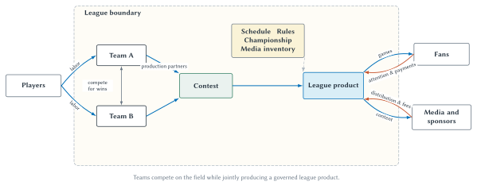
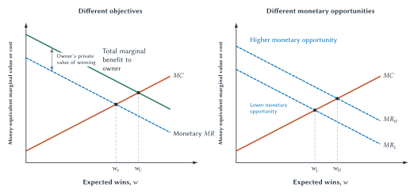

# Team and League Behavior

The Buffalo Bills cannot produce a football game by themselves. They need an opponent. The same is true of the New York Yankees, Manchester United, the Los Angeles Lakers, and every other team. A rival tries to defeat you, but it also helps create the product you sell.

That simple observation makes the business of sports unusual. Ford would prefer that consumers buy fewer Toyotas. The Bills do not want the Dolphins to disappear. They need Miami—and enough other credible opponents—to create a schedule, a championship race, media inventory, and a league that fans take seriously.

The cooperation goes well beyond agreeing to play. Teams accept common rules, share some revenue, coordinate schedules, regulate entry, organize drafts and player markets, and sell some media rights collectively. At the same time, they compete for wins, players, fans, sponsors, and local revenue. A league is therefore neither one ordinary firm nor a collection of completely independent firms. It is a system of **cooperative competition**.

That system raises several economic questions. What is a team trying to maximize? Why might an additional win be worth more to one team—or at one point in a season—than to another? Why do teams share some revenue while aggressively pursuing other revenue on their own? How can a club report an operating loss while its owners become wealthier? Why do some leagues use promotion and relegation while others control membership? And why can rules designed to improve competition change behavior in unexpected ways?

This chapter develops one connected answer: team choices depend on objectives, marginal incentives, and league institutions. The right question is rarely whether a rule is “good for competition” in the abstract. The useful questions are what the rule changes, whose margin it changes, and how teams are likely to respond.

## Learning Goals

After reading this chapter, you should be able to:

- explain why rival teams are also production partners
- distinguish profit maximization, win maximization subject to a financial constraint, and hybrid owner objectives
- explain the marginal revenue and marginal cost of expected wins
- identify why the value of improvement changes with market reach, standings position, capacity, and timing
- distinguish annual financial flows from franchise value and observed transaction prices
- separate shared or central revenue from locally generated revenue
- explain how revenue sharing can provide stability while changing marginal incentives
- distinguish sharing among teams from the division of revenue between owners and players
- compare closed membership, promotion and relegation, and single-entity organization
- analyze expansion, strategic rebuilding, and tanking as responses to league rules

## Your Rival Is Also An Input

Most production begins with inputs. A restaurant combines food, labor, equipment, and a location to produce meals. A football team combines players, coaches, a stadium, and organizational knowledge—but those inputs are not enough to produce a league game. It also needs another team willing and able to play under a shared set of rules.

Economist Walter Neale called attention to this peculiar feature of professional sports in 1964. Individual teams compete, but the league and its members jointly produce the championship race that gives individual games much of their meaning.[^neale-joint-production] A late-season Bills–Dolphins game matters partly because each team has a record, both belong to a division, and the outcome affects a larger contest. Without the schedule and standings, it would be an exhibition.

::: quickconcept
**Joint Production: Your Rival Is Also An Input**

A team cannot produce a league contest by itself. Opponents compete for wins, but they cooperate to create games, schedules, rules, championships, media inventory, and a credible league product.
:::

Joint production does not mean that every team decision should be centralized. The Bills can choose local sponsors and decide how to market premium seating. The Dolphins can organize their front office differently. Both teams still need common playing rules, an agreed schedule, eligible opponents, officials, and a process for determining a champion.

Nor does joint production prove that every collective league restriction is efficient or legal. A common schedule is necessary to produce a season. It does not follow that any restraint league members might adopt is also necessary. Chapter 8 will examine that boundary. For now, the economic point is narrower: some cooperation is part of producing the product, and the form of that cooperation changes team incentives.

**Figure 7.1: Rivals as joint producers.** Teams compete on the field while jointly producing contests and depending on league coordination to create a schedule, rules, a championship, and media inventory. The need for cooperation does not imply that every collective rule has the same economic purpose or effect.

::: aifiguredescription
**Figure description: `fig:ch07-joint-production-map`**

The schematic places Team A, Team B, Contest, Shared league functions, and League product inside a quiet league boundary. Team A and Team B each point toward Contest, showing that neither can produce it alone. A restrained two-way link between the teams is labeled “compete for wins.” The Shared league functions node lists Schedule, Rules, Championship, and Media inventory. Both Contest and Shared league functions point toward League product. Players, Fans, and Media and sponsors sit outside the league boundary and connect to the relevant teams or league product through short arrows representing labor, attention, distribution, or payments. The boundary does not imply that every decision or revenue source is centralized. The figure is schematic and makes no claim that a collective rule is legal, efficient, or necessary merely because some league coordination is required.
:::

The joint product creates interdependence. A team that weakens dramatically can reduce the attractiveness of some games, but a dominant team can also draw attention. A league that shares too little may leave some members financially fragile. A league that shares every locally generated dollar may weaken the reward for local investment. League governance is therefore partly the management of a common product whose members do not have identical interests.

## What Is A Team Trying To Maximize?

Introductory economics often models a firm as maximizing profit:

$$
\pi=R-C,
$$

where revenue is $R$ and cost is $C$. This remains a useful starting point for a sports team. Owners must pay players and staff, operate venues, sell tickets and sponsorships, and decide whether an investment is worth its cost.

Sports ownership can also provide benefits that do not appear as team revenue. An owner may enjoy winning, prestige, public visibility, civic influence, or the experience of participating in a championship. These benefits are real to the owner even though they are not ticket revenue, media revenue, or accounting profit.

Economists therefore use several models of team behavior.

**Profit maximization** asks which level of expected team quality produces the largest gap between monetary revenue and cost.

**Win maximization subject to a financial constraint** asks how much expected quality a team can pursue while satisfying a required financial floor. The floor might be break-even, a maximum acceptable loss, or a minimum return demanded by ownership.

A **hybrid owner-objective model** allows both monetary profit and a private value of winning to matter. An owner may be willing to sacrifice some profit for a better chance to win without being indifferent to financial results.

These are models, not personality diagnoses. A large payroll does not prove that an owner is a win maximizer. The spending could be an attempt to increase attendance, media value, sponsorships, future brand strength, or franchise value. A low payroll does not by itself prove that an owner cares only about profit. The team may be rebuilding, facing a weak talent market, or preserving flexibility for a later competitive window.

::: sideline
**Profit Maximizer, Win Maximizer, Or Owner Utility?**

Observed behavior can be consistent with more than one objective. High spending may reflect expected monetary returns, private enjoyment of winning, long-run investment, or some mixture. Good analysis separates these mechanisms instead of assigning an owner a label from one payroll observation.
:::

The classic alternative to simple profit maximization comes from Peter Sloane's model of the football club as a utility maximizer. Later empirical work by Pedro Garcia-del-Barrio and Stefan Szymanski found that English and Spanish clubs from 1994 through 2004 were better approximated by win maximization than by profit maximization within their model.[^team-objectives] That is useful evidence, but it is not a universal finding about every club, league, owner, or period.

The objective also has to be separated from the constraint. Two owners can value winning equally but face different debt obligations, venue revenues, payroll rules, or tolerance for short-run losses. They may choose different payrolls even with the same underlying preferences. Conversely, two teams can choose similar payrolls for different reasons: one expects a direct financial return, while the other accepts a smaller return because ownership receives private value from contending.

This creates an identification problem. Outsiders observe some decisions—payroll, trades, staffing, ticket prices, and occasionally financial statements—but do not observe an owner's utility directly. A quotation about wanting to win is weak evidence because nearly every owner has a reason to say it. A stronger analysis looks for repeated choices when the tradeoff changes: Does the team add talent near a meaningful competitive threshold? Does it invest in development that pays off after the current season? Does it keep spending when the likely monetary return falls? Even then, the conclusion should be stated as evidence consistent with an objective, not as a psychological fact.

## The Marginal Value And Cost Of Expected Wins

Teams do not literally purchase guaranteed wins. A front office purchases player contracts, coaching, scouting, health services, analytics, training, and organizational capacity. Those inputs change the distribution of possible outcomes. A talented roster may raise expected wins and postseason probability, but injuries, luck, opponent quality, and player development still affect realized results.

For that reason, **expected team quality** or **expected wins** is usually the cleaner unit of analysis.

::: quickconcept
**Marginal Revenue Of Expected Wins**

The marginal revenue of expected wins is the additional monetary revenue a team anticipates from a small improvement in expected team quality. The marginal cost is the additional cost of producing that improvement. Neither concept implies that a literal win can be purchased with certainty.
:::

The profit-oriented rule is familiar: improve the team while the expected additional monetary revenue exceeds the additional cost. Stop when the two are equal at the margin.

The revenue can arrive through several channels:

- greater ticket demand or premium-seat sales
- additional concessions, parking, or local sponsorship value
- postseason games and related distributions
- stronger merchandise or licensing demand
- local media and advertising opportunities
- longer-run effects on brand strength and future demand

The costs can include salary, acquisition price, surrendered draft or prospect assets, luxury-tax consequences, coaching and development resources, and the risk that the improvement does not materialize.

An owner who receives private value from winning has another benefit at the margin. That private value may support more spending than monetary marginal revenue alone would justify. It must not, however, be relabeled as team revenue merely to fit it on a graph.

**Figure 7.2: Different objectives and different monetary opportunities.** Panel A adds an owner's private value of winning to monetary marginal revenue; the higher curve is total marginal benefit to the owner, not team revenue. Panel B holds preferences and marginal cost fixed while comparing lower and higher monetary returns to improvement.

::: aifiguredescription
**Figure description: `fig:ch07-team-objectives-and-market-opportunity`**

The figure contains two aligned panels with expected team quality or expected wins, $w$, on the horizontal axis and money-equivalent marginal value or cost on the vertical axis. Panel A is titled “Different objectives.” It draws monetary marginal revenue $MR(w)=9-w$ downward and marginal cost $MC(w)=1+w$ upward. They intersect at the profit-oriented choice $w_{\pi}=4$. A higher curve labeled “Total marginal benefit to owner” equals monetary marginal revenue plus a constant money-equivalent private marginal value of winning, $V'(w)=2$. It intersects marginal cost at the hybrid choice $w_U=5$. The vertical gap between the two benefit curves is labeled “Owner's private value of winning.” The upper curve is never labeled revenue. Panel B is titled “Different monetary opportunities.” It holds marginal cost fixed at $MC(w)=1+w$ and draws $MR_L(w)=8-w$ and $MR_H(w)=10-w$, labeled lower and higher monetary opportunity. Their exact intersections with marginal cost are $w_L=3.5$ and $w_H=4.5$. Owner preferences do not change in Panel B. The schedules are illustrative rather than estimated, and the figure does not claim that expected wins are guaranteed or that every larger-market team earns more from every win.
:::

The two panels answer different questions. In the first, the monetary opportunity is unchanged but the owner's private value affects the choice. In the second, owner preferences are held fixed but the monetary return differs. Real teams can differ on both dimensions, which is why payroll alone cannot identify motives.

## Market Size Matters—But Not By Itself

The familiar Yankees–Royals comparison captures a real idea but is often stated too strongly. A team with a larger local market, a stronger national brand, greater sponsorship reach, or more unsatisfied ticket demand may earn more from improving expected quality. Holding other things constant, its monetary marginal-revenue curve can lie above that of a team with fewer revenue opportunities.

John Burger and Stephen Walters found that market size and expected contention interacted in MLB data from 1995 through 1999. In their model, the value of improved playing talent depended not only on market size but also on whether the improvement helped produce a contender.[^burger-market-size] This is more useful than the slogan “a Yankees win is worth more than a Royals win.”

The value of an additional expected win can depend on:

- current standings position
- the probability that the win changes postseason qualification or advancement
- venue capacity and unsold inventory
- national versus local brand reach
- the amount of locally retained revenue
- existing fan interest and recent performance
- the timing of the improvement

A September win that clinches a postseason position may be more valuable than an April win that leaves the team's forecast nearly unchanged. A Royals improvement that transforms the team into a contender may be worth more than a Yankees improvement during a season in which either team is far from a meaningful threshold. Market size shifts opportunity; it does not erase context.

::: casestudy
**Market Size And Winning Incentives**

Suppose the Yankees and Royals face the same marginal cost of improving expected team quality. The Yankees may have more local and national ways to monetize an improvement. That creates a reason for a higher monetary marginal return.

Now change the circumstances. Suppose the Royals are one win from a likely postseason berth while the Yankees are far from contention. The current Royals win may have the larger effect on postseason probability. The comparison therefore depends on market reach, brand strength, standings position, capacity, shared revenue, and the team's existing fan base—not city size alone.
:::

## When Is A Win Worth The Most?

The timing issue becomes especially visible at a trade deadline. A contender may consider acquiring a player who will become a free agent after the season. The buyer could receive only a few months of regular-season production, but those months arrive when a marginal improvement may change postseason probability.

The seller may prefer a prospect who is not yet as productive but could provide several future seasons at a relatively low salary. The clubs are not necessarily disagreeing about which player is “better.” They may be valuing different dates, competitive windows, risks, and contract rights.

This is an intertemporal choice: current production is exchanged for possible future production. Future benefits are discounted because they arrive later and are uncertain. Current help receives additional **postseason option value** when it creates a better chance to reach a valuable opportunity such as a playoff series. The acquisition does not guarantee that the team will reach or advance in the postseason; it changes the probability.

MLB makes the tradeoff unusually visible. Organizations maintain deep minor-league systems, players can remain under team control for years, and the deadline creates an active market in which contenders often seek current help from clubs focused on future seasons. Anthony Krautmann and James Ciecka's work on the postseason value of elite players helps explain why current production can be especially valuable to a contender.[^intertemporal-wins]

::: sideline
**Prospect Capital And Small-Market Teams**

A prospect is more than a player who might become good. Economically, the organization holds a claim on uncertain future production under team control. A collection of those claims can be called **prospect capital**.

Controlled talent may be particularly important to small-market or lower-revenue MLB clubs that cannot rely as heavily on expensive free-agent purchases. A successful development system can produce valuable seasons at salaries below free-agent prices and can create assets that are tradable for current help.

That does not make the mechanism unique to MLB. NBA draft picks, NFL rookie contracts, and NHL prospects create similar current-versus-future decisions. It also does not give small-market teams an automatic advantage. Wealthier teams can combine strong scouting and development with greater spending, and prospects remain uncertain.
:::

A current working paper by Mark Wilson and Rodney J. Paul treats deadline trades as an observable exchange of current production and prospect capital. Chapter 17 will examine its descriptive evidence and its limitations. The durable Chapter 7 lesson does not depend on one estimate: retaining every prospect is not proof of sophistication, and trading one is not proof of error. The decision depends on current postseason benefit, future contract value, acquisition cost, and the future assets surrendered.

## A Flow Is Not A Stock

Discussions of team finance often slide among revenue, profit, franchise value, and sale price as if they were interchangeable. They are not.

Revenue and income are measured over a period. They are **flows**. Franchise value is an estimate of what a long-lived asset is worth at a point in time. It is a **stock**. A transaction price is an observed exchange with its own terms, assets, and control rights.

::: quickconcept
**A Flow Is Not A Stock**

Annual revenue, expenses, operating income, and cash flow describe activity during a period. Franchise value describes an asset at a point in time. A transaction price records what particular parties agreed to exchange under particular terms. Large annual revenue does not automatically equal large profit, and neither number is a sale price.
:::

| Concept | Flow or stock? | Basic meaning | Common mistake |
| --- | --- | --- | --- |
| Revenue | Flow | Money recognized from operations during a period. | Treating revenue as profit. |
| Operating income | Flow | Operating revenue minus operating expenses under the applicable accounting definitions. | Treating it as cash flow or net income. |
| Net income | Flow | Income after operating and non-operating items recognized for the period. | Assuming every component came from team operations. |
| Cash flow | Flow | Cash received and paid during a period, classified by activity. | Assuming it must equal accounting income. |
| Franchise-value estimate | Stock estimate | An analyst's estimate of the value of specified ownership assets at a date. | Treating an estimate as an audited balance-sheet number or completed sale. |
| Transaction price | Observed exchange | The price attached to an actual transfer of specified ownership rights and assets. | Assuming the headline number is cash paid for 100 percent of a standalone team on one date. |

**Table 7.1: Financial concepts answer different questions.** The correct comparison depends on the period, accounting definition, assets included, debt, control rights, and transaction structure.

The distinction explains how a team can report a weak operating year while ownership wealth rises. A buyer cares about expected future benefits, not only the latest operating result. Those benefits may include future cash flows, scarcity of league membership, control, related real estate or media assets, brand capital, personal prestige, and the price another buyer might later pay.

In simplified form, an asset's value reflects discounted expected future benefits:

$$
V=\sum_{t=1}^{T}\frac{E(B_t)}{(1+r)^t}.
$$

Here, $E(B_t)$ is the expected benefit of ownership in future period $t$ and $r$ reflects time and risk. The expression is an organizing idea, not a complete franchise valuation model. Different buyers can form different expectations, face different financing terms, and receive different complementary benefits from the same asset.

This is also why a championship does not mechanically add a fixed amount to franchise value. Winning may strengthen demand, brand reach, sponsorships, and future revenue. The effect depends on persistence, cost, expectations, and what buyers believe. An owner can rationally accept lower current operating income in pursuit of winning, but current losses do not prove that the losses caused later appreciation.

## Two Current Financial Observations

The Green Bay Packers and Boston Celtics provide two unusually useful—but fundamentally different—observations. The Packers disclose annual financial results. The Celtics changed majority control through a completed transaction. One is a flow observation; the other is an asset-market observation.

| Observation | Reported fact | Economic use | Essential limitation |
| --- | --- | --- | --- |
| Packers fiscal year covering the 2025 season | \$453.2 million in shared national revenue, \$299.8 million in local revenue, a \$1.1 million operating loss, \$133.6 million in non-operating income, and \$132.5 million in net income | Separates national and local revenue and shows why operating income and net income can differ sharply. | Shared national revenue is not identical to media revenue; the unusual non-operating result included investment gains and the NFL–ESPN transaction. |
| Celtics ownership transaction completed in August 2025 | An investor group led by William Chisholm completed an acquisition of a majority-control position in a transaction reported at a value exceeding \$6.1 billion. | Shows an observed market transaction involving control of a scarce league asset. | Control was staged, and the headline value is not a one-date cash purchase of every share, asset, and related business. |

**Table 7.2: A financial statement and a transaction provide different evidence.** Neither observation is a league-wide valuation formula.

### The Packers: Operating Results Versus Net Income

Chapter 6 used the Packers' national and local revenue series to show how media and league distributions help stabilize team finances. The key chart does not need to be repeated here. Instead, consider the latest fiscal-year categories.[^packers-finances]

The Packers reported \$753.0 million in combined shared national and local revenue, yet they reported a \$1.1 million operating loss. That is possible because revenue is not profit. Player-related and other operating costs rose enough to absorb the operating revenue.

The organization also reported \$133.6 million in non-operating income. Subtracting the operating loss produces \$132.5 million in net income. Part of the unusual non-operating gain was associated with the NFL's transaction involving ESPN, through which the league received an equity interest that was shared equally among the 32 clubs.

Three lessons follow.

First, **shared national revenue is not a synonym for television revenue**. It can include media, sponsorship, licensing, and other shared sources.

Second, **operating income is not net income**. A team can lose money from the year's operations while reporting positive net income because of investments or other non-operating events.

Third, **one unusual year should not be treated as a normal profit margin**. The disclosure is valuable precisely because it shows why accounting categories must be read before the headline number is interpreted.

### The Celtics: An Observed Transaction Is Not A Ranking

In August 2025, the Celtics announced that the Chisholm group had completed its acquisition of a majority-control position after NBA approval. Public reporting attached a value exceeding \$6.1 billion to the transaction, with broader control staged over time.[^celtics-transaction]

This is stronger evidence of a market exchange than a publisher's annual franchise ranking, but it still requires care. The headline value does not tell students the cash paid on one date, the value of every included asset, the treatment of debt, the financing arrangements, or the private value the buyers attached to control. It does show that investors were willing to commit extraordinary resources to obtain control of a scarce NBA membership with a globally recognized brand and expected future benefits.

::: warning
**A Valuation Estimate Is Not A Sale Price**

A publisher's estimate is an analyst's model. A completed transaction is an observed agreement. Even the transaction must be read carefully: majority control, full ownership, related assets, debt, financing, and staged closings can all change what the headline number means.
:::

The initial Chapter 7 analysis therefore does not need a ranking of estimated team values. The Packers and Celtics already supply the economically important contrast: annual operations and asset-market value are different objects.

## Shared Revenue And Local Incentives

Teams jointly produce a league, so it is not surprising that they share some revenue. National media rights, licensing, and sponsorship can be created or sold collectively. Sharing can also give every member a financial base and reduce the risk that a locally concentrated shock threatens the common product.

Teams still generate local revenue. Ticketing, premium seating, local sponsorships, retail, venue events, and related businesses can depend on local demand and team investment. Letting teams retain at least part of that revenue preserves a reward for developing the local market.

This produces a basic tradeoff.

- More sharing can provide stability, cross-subsidize lower-revenue members, and reduce some financial differences.
- More sharing can also reduce the amount a team keeps from generating an additional local dollar.
- Less sharing preserves stronger local incentives but exposes teams to larger revenue differences and greater local risk.

The tradeoff is about the **marginal dollar**, not simply the total transfer a team receives. A team can receive a substantial distribution and still retain a reason to generate local revenue. Another formula could provide the same average transfer while producing a different marginal incentive.

### A Transparent Retained-Dollar Example

Suppose a hypothetical 30-team league requires each team to contribute 40 percent of local revenue to an equal pool. One team generates an additional \$100.

The team contributes:

$$
0.40\times100=40\text{ dollars}.
$$

Because the pool is divided equally among all 30 teams, including the team that generated the revenue, its own distribution from this increment is:

$$
\frac{40}{30}=1.33\text{ dollars}.
$$

The generating team therefore retains:

$$
100-40+1.33=61.33\text{ dollars}.
$$

The other 29 teams each receive about \$1.33. Together, their distributions account for the remaining \$38.67. The arithmetic preserves the full \$100; it changes who receives it.

This is a hypothetical designed to expose the mechanism. It is not a description of the current NFL formula. Actual league rules can use different definitions, exclusions, lags, transfers, and adjustments.

::: studyandlearn
**Who Keeps The Next Dollar?**

Compare two rules for a 30-team league:

1. The team keeps every additional local dollar.
2. Forty percent enters an equal pool that includes the generating team.

Before asking an AI tutor to calculate anything, identify the generating team's contribution, its own distribution from the pool, the net amount it retains, and the amount distributed to other teams. Then ask how the rule might affect local sponsorship, premium seating, venue investment, and risk sharing.

Do not jump from the transfer calculation to a prediction about competitive balance. State what else you would need to know about owner objectives, payroll rules, talent supply, and how receiving teams use the money.
:::

### Why Sharing Does Not Guarantee Competitive Balance

It is tempting to reason that transferring revenue from high-revenue teams to low-revenue teams must equalize playing strength. The conclusion does not follow automatically.

A transfer gives a recipient more resources, but the team might spend the money on player talent, facilities, debt, distributions to ownership, or other operations. A donor team might reduce local investment, change payroll, or continue spending because winning remains valuable. Salary caps, luxury taxes, drafts, and player-market rules can interact with the sharing system. If talent is fixed in the short run, bidding may change salaries more than the distribution of players.

Fort and Quirk's classic analysis of cross-subsidization emphasizes these interacting incentives.[^revenue-sharing] Chapter 9 will examine whether particular policies measurably improve competitive balance. The Chapter 7 job is to identify the mechanism and reject the promise of an automatic result.

It also matters whether a transfer is fixed or changes with a team's own behavior. Suppose every club receives an equal distribution from national media rights regardless of its local ticket sales. That distribution raises the team's financial base, but it does not directly reduce the amount the team retains from selling one more local sponsorship. A rule that pools a percentage of local sponsorship revenue does change that marginal return. The two rules could deliver the same average number of dollars to a team while creating different incentives for local sales and investment.

Receiving additional revenue does not reveal which margin a lower-revenue team will change. A financially constrained team might use it to acquire talent immediately. Another might invest in scouting, player development, training facilities, or business operations that affect later seasons. A team already constrained by a payroll cap may be unable to translate the transfer into additional covered payroll at all. An owner who places relatively little value on wins may choose distributions, debt reduction, or other uses. The transfer is real; the behavioral response remains conditional.

The donor's response matters too. If sharing lowers the retained payoff from premium seating or a local sponsorship, the team may make less of the investment that generates that revenue. It may instead pursue revenue categories treated differently by the rule. A league can therefore redistribute the existing pie while also changing efforts that determine the future size of the pie. That is why a complete evaluation needs the formula, the behavioral margins, and evidence after implementation—not merely the total amount transferred.

One more distinction is essential. **Sharing among teams** determines how club revenue is distributed across owners. The **owner-player revenue split** concerns how defined industry revenue is divided between clubs and labor under a collective bargaining agreement. A policy can change one without changing the other.

## Same Diagnosis, Different Remedies: MLB's 2026 CBA Negotiations

As of August 2026, MLB and the MLBPA were negotiating a replacement for the agreement scheduled to expire in December. Both sides offered proposals touching lower-revenue clubs and incentives to compete, but they disagreed sharply about the institutional remedy.[^mlb-cba-proposals]

::: casestudy
**Same Diagnosis, Different Remedies**

MLB's opening economic proposal included a salary cap and floor, a 50-50 division of defined baseball revenue between owners and players, and centralized local-media revenue shared equally among clubs.

The MLBPA's opening proposal also called for substantially greater sharing of local-media revenue from high- to low-revenue clubs. It proposed a guaranteed revenue minimum for small-market clubs and protections intended to encourage competitive spending. The union opposed the league's salary-cap proposal.

These were bargaining positions, not settled rules. The useful exercise is to separate what each component changes:

- Club-to-club revenue sharing changes resources and the return to local revenue generation.
- An owner-player split changes the division of defined industry revenue between labor and ownership.
- A salary cap places a ceiling on covered payroll.
- A salary floor places a minimum on covered payroll.
- Centralized local-media rights change control, risk, reach, and the allocation of media revenue.

Two proposals can invoke competitive balance while producing different effects on salaries, local investment, club profits, media strategy, and the distribution of talent. Economic analysis begins with those mechanisms rather than accepting either side's prediction as a result.
:::

The disagreement also shows why the phrase “small-market policy” is too vague. A guaranteed transfer, a spending requirement, a payroll ceiling, and centralized media sales all address different margins. Whether they improve fan welfare or competitive balance is an empirical question. Whether they redistribute bargaining power is central to Chapter 14.

## League Governance Manages Cooperative Competition

The joint product needs governance. Someone must determine membership, build the schedule, enforce playing rules, certify results, organize championships, and decide which decisions belong to individual teams and which belong to the league.

Governance is not only a legal question. It is an allocation of decision rights. Centralizing a choice can reduce coordination costs and create a common product. Decentralizing a choice can preserve experimentation, local knowledge, and a stronger reward for team-specific investment.

Consider media rights. Collective national sales can assemble a large package and share revenue across teams. Local rights can let a club exploit local demand and experiment with distribution. Chapter 6 showed that neither approach eliminates production, distribution, promotion, or risk. The league-design question is who controls those functions and who bears the consequences.

The same logic applies to membership, labor rules, sponsorship, data, scheduling, and venue standards. Different leagues draw the boundary in different places.

Those boundaries allocate **decision rights**. A local team may know more about its supporters, sponsors, and venue than a league office does, which favors local discretion. A league office may be better positioned to assemble a national schedule, protect common marks, negotiate a broad media package, or prevent one member's decision from imposing costs on everyone else. Centralization can capture gains from coordination; decentralization can use local knowledge and encourage experimentation.

The hard cases combine both forces. A team's preferred kickoff time may help its local attendance but reduce the value of a national television window. A lucrative local media arrangement may benefit one club while fragmenting access to the league product. An expansion team can add a market and an entry payment while diluting each incumbent's share of common revenue. These are not disputes between coordination and no coordination. They are disputes over which level should control a choice and how the resulting gains and costs should be distributed.

League governance also has to produce commitments that teams, players, media partners, sponsors, and fans can rely on. A schedule has less value if opponents can withdraw unpredictably. A long-term media agreement is harder to sell if clubs can remove attractive games after the contract is signed. Rules, voting procedures, contracts, and enforcement mechanisms make some promises credible enough for other parties to invest. The legal limits of those arrangements belong in Chapter 8; the Chapter 7 point is that governance helps turn interdependent team choices into a durable product.

| Organizational feature | How membership or control works | Main economic opportunity | Main economic risk |
| --- | --- | --- | --- |
| Closed membership | Existing league members govern expansion, relocation, and transfer of control. Sporting performance alone does not create entry. | Stable membership can support long-term investment, common media contracts, and scarce franchise rights. | Incumbents can restrict entry; weak teams do not face relegation and may redirect effort toward future seasons. |
| Promotion and relegation | Sporting results move clubs between governed divisions, subject to league, licensing, venue, and financial requirements. | Creates a performance-based path upward and keeps high stakes near promotion and relegation thresholds. | Division changes can create sharp revenue risk and encourage costly attempts to avoid relegation. |
| Single-entity features | A central league entity holds important rights, while local operators exercise specified club-level discretion. | Central control can coordinate player contracting, budgets, and league growth. | The label can conceal meaningful variation in local control and does not by itself answer legal or incentive questions. |

**Table 7.3: League organization allocates entry, control, upside, and risk.** Real leagues combine features, so the categories are analytical rather than exhaustive.

## Closed Leagues And Controlled Expansion

The major North American leagues use closed membership. A successful lower-level team does not enter the NFL, NBA, MLB, or NHL by winning its competition. Entry occurs through a governed expansion process, while movement of an existing team requires league approval under applicable rules.

Closed membership makes a league place scarce. That scarcity can support franchise value because ownership provides access to a protected schedule, shared revenue, league intellectual property, and a recurring championship product. It also means incumbents have an interest in the terms of expansion. A new team can bring an expansion payment, a new market, new viewers, and a new venue. It can also divide shared revenue among more members, alter conferences and schedules, and compete for players and attention.

In March 2026, the NBA Board of Governors voted to authorize formal exploration of potential expansion to Las Vegas and Seattle. The league said the process would evaluate markets, ownership groups, arena infrastructure, and broader economic implications.[^nba-expansion] This was not the award of two franchises. It was an incumbent-governed decision to investigate whether and how entry might benefit the joint product.

That distinction makes expansion a useful classroom example. Demand in Las Vegas or Seattle may be necessary for a successful team, but demand alone does not create NBA membership. Entry also depends on the existing league's decision rights.

## Promotion And Relegation

Many football leagues outside North America link divisions through promotion and relegation. Sporting performance can move a club upward or downward after a season. In England, three Premier League clubs are relegated and replaced by three promoted Championship clubs each year.[^premier-league]

This system changes the value of performance near both ends of the standings. A club near the top of a lower division may gain access to a much more valuable league. A club near the bottom of the top division may lose media distributions, sponsorship opportunities, attendance demand, and player appeal if it falls.

The result is a threshold. A point or win that changes division status can have much greater financial value than one that leaves status unchanged.

::: sideline
**Promotion And Relegation Put A Cliff In The Value Of Wins**

The marginal value of performance is not smooth near every threshold. A club close to promotion may gain a much richer schedule and media environment. A club close to relegation may avoid a large financial loss by surviving.

The size of the effect must be sourced for the specific league and season. The durable idea is the discontinuity: sporting results can change the market in which the club competes next year.
:::

Promotion and relegation do not create unrestricted entry. A promoted club must still satisfy league rules, licensing requirements, venue standards, and financial conditions. The Premier League's use of league share certificates illustrates the point: sporting qualification operates through a governed legal organization, not outside one.

The system also creates risk. A club may commit to player contracts and other costs while expecting top-division revenue, then be relegated. Some leagues use parachute payments or related mechanisms to soften the adjustment. Those policies can reduce financial distress while affecting competition for promotion in the lower division. The general lesson is familiar: insurance and incentives interact.

Closed and open systems therefore exchange different forms of stability and discipline. A closed league protects membership but may create incentives to rebuild once current contention is lost. Promotion and relegation preserve high short-run stakes near the bottom but expose clubs to sharper revenue changes. Neither structure removes strategic behavior.

## MLS And The Limits Of Simple Labels

Major League Soccer is commonly described as a single entity. That description captures important centralization, but it can be misunderstood.

MLS describes itself as a single limited liability company. Investor-operators hold financial interests in the league and operate local clubs. Player contracts are centralized, and league roster rules govern salary budgets, allocation mechanisms, roster categories, waivers, and other transactions.[^mls-structure]

It would be wrong to conclude that local operators have no meaningful discretion. Clubs make decisions about coaching, development, local business operations, supporters, sponsorships, and roster construction within the league system. It would also be wrong to treat the clubs as completely independent firms merely because fans and news coverage use familiar team language.

The useful questions are concrete:

- Who signs or holds the player contract?
- Which spending and roster decisions are centralized?
- Which revenues are shared or retained locally?
- Who owns the league interest and who operates the club?
- Which decisions require league approval?

“Single entity” is a starting description of governance, not a complete economic or legal conclusion. Chapter 8 will return to why that distinction matters for antitrust analysis.

## Strategic Rebuilding And Tanking

Teams respond to the payoff structure a league creates. When current postseason contention is unlikely, a team may trade veterans, reduce current payroll, give playing time to developing athletes, accumulate draft assets, or preserve salary-cap flexibility. These choices can lower current expected wins while increasing possible future wins.

That strategy is often called **tanking**, but the word combines several different claims. An organization can intentionally construct a weaker current roster. That does not prove that players or coaches intentionally fail to compete in a particular game.

::: warning
**Strategic Rebuilding Is Not The Same As Players Trying To Lose**

Management can trade productive veterans, emphasize development, preserve cap space, and accept a lower forecast of current wins in exchange for future assets. Players and coaches can still exert full effort with the roster they have. Accusations of game-level intentional losing require different evidence.
:::

The basic rebuilding problem is intertemporal. A current veteran may create more value for a contender than for a team far from the postseason. A draft pick or prospect may create more value for the rebuilding team because its payoff arrives in a later competitive window. A trade can make both sides better off even though one side acquires current wins and the other appears to surrender them.

Draft rules can add another payoff. Under the NBA system used for the 2026 draft, the three teams with the worst records each received a 14 percent chance at the first selection. The flattened odds reduced the extra lottery benefit of finishing last relative to earlier systems, but they did not remove the connection between record and draft position.[^nba-lottery]

The NBA has announced another lottery redesign beginning in 2027. Because forward-dated rules can change before implementation, the final text must be checked again before publication. The lasting lesson does not depend on one percentage: if league rules connect weaker current performance to more valuable future assets, teams will consider that connection when constructing rosters.

The league then faces a design problem. It may want weak teams to obtain new talent because that can support future competition. It may also want every late-season game to remain credible and attractive. A draft lottery, flattened odds, traded draft choices, play-in tournament, or relegation threat changes the costs and benefits of rebuilding in different ways.

The stated purpose of a rule is not its behavioral effect. To evaluate an anti-tanking policy, ask:

1. What future reward is linked to current performance?
2. Which decision-maker controls the relevant behavior—owners, executives, coaches, or players?
3. What alternative strategies remain available?
4. Does the rule change the expected return enough to change roster decisions?
5. What new risks or unintended margins does the rule create?

This checklist generalizes beyond tanking. Teams respond to rules at the margin, and they may respond through a choice the rule's designers did not emphasize.

## Relocation As An Outside Option

Closed membership does not make location permanent. A team can seek permission to move, and the possibility of an alternative city can affect bargaining even when no move occurs.

In negotiation language, relocation can serve as an **outside option**. A team seeking a new venue may argue that another market offers a better stadium, more premium revenue, public financing, or stronger local growth. A city may believe that the threat is credible, exaggerated, or designed to improve the team's bargaining position.

Credibility depends on more than an owner naming another city. The alternative needs a plausible venue, financing, market demand, ownership commitment, and league approval. The current city also has an outside option: it can refuse the requested terms and use public resources elsewhere.

This chapter stops at the incentive. Chapter 10 will examine stadium finance, subsidy evidence, economic-impact claims, bargaining, and the conditions under which relocation threats change public policy.

## The Connected Team And League Decision

The chapter began with a rival who is also an input. From that unusual production problem follows a connected economic system.

1. Teams need opponents and common rules to create a league product.
2. League members cooperate over some decisions while competing over others.
3. Owners may value profit, wins, prestige, and long-run asset value in different combinations.
4. Front offices choose expected team quality under uncertainty rather than purchasing guaranteed wins.
5. The marginal monetary return to improvement changes with market reach, capacity, standings position, and postseason or relegation thresholds.
6. Current and future wins are not perfect substitutes; contract control and timing matter.
7. Annual operations, franchise value, and transaction price are different economic objects.
8. Sharing can provide a common financial base while changing the return to local investment.
9. Salary rules, revenue sharing, media centralization, and the owner-player split affect different margins.
10. Closed membership, promotion and relegation, and single-entity organization allocate entry, control, risk, and upside differently.
11. Teams respond strategically through spending, development, trades, rebuilding, and location bargaining.

The durable conclusion is not that one objective or league structure is best. It is that team behavior cannot be separated from the institutions surrounding it. A policy changes incentives; teams respond; those responses determine much of the result.

## Big Picture

- Rivals jointly produce the sporting contest and depend on league coordination.
- Profit maximization, constrained win maximization, and hybrid owner utility are models, not labels that can be read directly from payroll.
- The relevant output is expected team quality, not a guaranteed literal win.
- Market size matters, but the marginal value of improvement also depends on contention, capacity, brand reach, timing, and revenue rules.
- Prospect capital makes current-versus-future allocation especially visible in MLB, though the mechanism exists in other sports.
- Revenue, operating income, net income, franchise value, and transaction price must not be used interchangeably.
- Revenue sharing provides stability and redistribution while changing how much of the next local dollar a team retains.
- Sharing among clubs is different from dividing revenue between owners and players.
- Closed membership makes entry an incumbent-governed decision; promotion and relegation tie membership to sporting results within a governed system.
- Strategic rebuilding is an organizational response to future rewards, not proof that players intentionally lose games.
- League rules should be evaluated through behavioral responses rather than stated intentions alone.

## Review Questions

1. Why is an opposing team both a rival and an input into production?
2. Which league functions require coordination, and which choices can remain local?
3. Distinguish profit maximization, win maximization subject to a financial constraint, and a hybrid owner objective.
4. Why can payroll spending fail to reveal an owner's true objective?
5. Why is expected team quality a better decision variable than realized wins?
6. Identify four reasons the marginal revenue of expected wins can differ across teams or across a season.
7. Why is “every Yankees win is worth more than every Royals win” too strong?
8. What is postseason option value?
9. Why might a contender and a rebuilding team value the same player-prospect package differently?
10. Distinguish revenue, operating income, net income, franchise-value estimate, and transaction price.
11. What did the Packers' fiscal 2026 results demonstrate about operating and non-operating income?
12. Why is the Celtics transaction more informative than a valuation estimate but still not self-explanatory?
13. How can revenue sharing provide stability while weakening a marginal local incentive?
14. Why does a transfer to a lower-revenue team not guarantee improved competitive balance?
15. Distinguish club-to-club revenue sharing from an owner-player revenue split.
16. What does NBA expansion exploration reveal about entry into a closed league?
17. Why is promotion and relegation not the same as unrestricted entry?
18. Why does the single-entity label provide an incomplete description of MLS?
19. Distinguish strategic rebuilding from players intentionally losing a game.
20. How can a relocation possibility change bargaining even if the team never moves?

## Problems And Applications

1. A hypothetical owner receives no private value from winning. Monetary marginal revenue is $MR(w)=9-w$ and marginal cost is $MC(w)=1+w$. Find the profit-oriented expected-quality choice. Now suppose the owner receives a constant money-equivalent private marginal benefit of 2. Find the hybrid choice. Explain why the added benefit is not team revenue.
2. Two teams face $MC(w)=1+w$. The lower-opportunity team's monetary marginal revenue is $MR_L(w)=8-w$; the higher-opportunity team's is $MR_H(w)=10-w$. Find both choices. Give two reasons other than population that the curves could differ.
3. A 30-team league pools 40 percent of local revenue and divides the pool equally, including a distribution to the team generating the revenue. If one team generates an additional \$300, calculate its contribution, its own pool distribution, the amount it retains, and the amount received by all other teams together.
4. An article says a team “made \$700 million” and is therefore worth \$7 billion. List the additional accounting and valuation information needed before evaluating the claim.
5. A contender can acquire a rental player by surrendering a prospect expected to provide several low-salary future seasons. Construct two columns labeled `current benefit` and `future cost`. Identify at least four items that belong in the comparison and explain how postseason position changes it.
6. Compare the following policies: greater club-to-club sharing, a 50-50 owner-player revenue split, a payroll cap, a payroll floor, and centralized local-media sales. For each, identify the margin it changes first. Do not predict competitive balance until you have stated a behavioral response.
7. A league is considering expansion. Identify the effects on shared revenue, schedule design, player demand, media reach, incumbent franchise scarcity, and league governance. Which effects are theoretically ambiguous?
8. A club is one point above a relegation position. Another is safely in the middle of the table. Explain why the same improvement in expected performance could have different values to the two clubs.
9. A rebuilding team trades a productive veteran and gives younger players more minutes. What evidence would distinguish strategic roster rebuilding from an accusation that players or coaches intentionally tried to lose?

::: studyandlearn
**Audit A Claim About Team Behavior**

Choose a current claim that an owner is “cheap,” “desperate to win,” or “only interested in franchise appreciation.” Record the original evidence and date. Then ask:

1. What behavior is actually observed?
2. Which objectives are consistent with that behavior?
3. What financial categories are being used?
4. What league rules or competitive circumstances affect the choice?
5. What evidence would distinguish the competing explanations?

Ask an AI tutor to construct the strongest alternative explanation for your conclusion. Do not let it infer an owner's private utility from one quotation or one season of payroll.
:::

## Suggested Assignment

You advise a league considering a reform intended to help lower-revenue teams compete. Choose one of these proposals: greater sharing of local revenue, a payroll floor, a salary cap, centralized local-media rights, or a change in draft incentives.

Write a 750–1,000 word memo that:

- defines the league's objective
- identifies the policy's immediate mechanical effect
- separates transfers among teams from the owner-player revenue split
- explains how high- and low-revenue teams may respond
- identifies one local-investment incentive and one competitive incentive
- distinguishes an expected effect from an established empirical result
- identifies the evidence needed to evaluate the policy after implementation
- recommends the policy, rejects it, or recommends a modified version

If you use MLB's 2026 bargaining proposals, label them by date and verify that their status has not changed.

## Source Notes

[^neale-joint-production]: Walter C. Neale, “The Peculiar Economics of Professional Sports,” *Quarterly Journal of Economics* 78, no. 1 (1964): 1–14, <https://doi.org/10.2307/1880543>. The chapter uses Neale for the joint-production insight, translated into modern league functions; it does not treat every collective league restraint as necessary.

[^team-objectives]: Peter J. Sloane, “The Economics of Professional Football: The Football Club as a Utility Maximiser,” *Scottish Journal of Political Economy* 18, no. 2 (1971): 121–146, <https://doi.org/10.1111/j.1467-9485.1971.tb00979.x>; Pedro Garcia-del-Barrio and Stefan Szymanski, “Goal! Profit Maximization Versus Win Maximization in Soccer,” *Review of Industrial Organization* 34 (2009): 45–68, <https://doi.org/10.1007/s11151-009-9203-6>. The empirical result applies to the authors' model and English and Spanish clubs from 1994 through 2004; it is not a universal classification of sports owners.

[^burger-market-size]: John D. Burger and Stephen J. K. Walters, “Market Size, Pay, and Performance: A General Model and Application to Major League Baseball,” *Journal of Sports Economics* 4, no. 2 (2003): 108–125, <https://doi.org/10.1177/1527002503004002002>. The study uses MLB data from 1995 through 1999 and supports interaction between market size and expected contention; the chapter does not carry its historical numerical magnitudes forward as current estimates.

[^intertemporal-wins]: Anthony C. Krautmann and James Ciecka, “The Postseason Value of an Elite Player to a Contending Team,” *Journal of Sports Economics* 10, no. 2 (2009): 168–179, <https://doi.org/10.1177/1527002508321457>; Mark Wilson and Rodney J. Paul, “Why Doesn’t Money Buy More Wins? Analytics, Payroll, and Prospect Capital in Major League Baseball,” working paper, August 4, 2026. The chapter uses these sources for postseason value and the current-versus-future mechanism. The working paper's descriptive deadline evidence, small ranked-prospect sample, omitted postseason option value, and noncausal interpretation are reserved for Chapter 17.

[^packers-finances]: Green Bay Packers, “Packers' Finances Remain Strong Amidst Changing NFL Landscape,” July 24, 2026, accessed August 16, 2026, <https://www.packers.com/news/packers-finances-remain-strong-amidst-changing-nfl-landscape-2026>. The reported fiscal year includes \$453.2 million in shared national revenue, \$299.8 million in local revenue, a \$1.1 million operating loss, \$133.6 million in non-operating income, and \$132.5 million in net income. The national category includes more than media revenue, and the unusual non-operating result should not be treated as recurring operating profit.

[^celtics-transaction]: Boston Celtics, “Chisholm Group Takes Control of the Boston Celtics,” August 19, 2025, <https://www.nba.com/celtics/news/081925-chisholm-group-takes-control-of-the-boston-celtics>; NBA.com, “NBA Approves Sale of Boston Celtics at Record Valuation,” August 13, 2025, <https://www.nba.com/news/nba-approves-sale-of-boston-celtics>. The team source confirms completed majority control; the NBA-hosted Associated Press report supplies the value exceeding \$6.1 billion and describes staged broader control. The chapter does not infer undisclosed transaction terms.

[^revenue-sharing]: Rodney Fort and James Quirk, “Cross-Subsidization, Incentives, and Outcomes in Professional Team Sports Leagues,” *Journal of Economic Literature* 33, no. 3 (1995): 1265–1299, <https://ideas.repec.org/a/aea/jeclit/v33y1995i3p1265-1299.html>. The chapter uses the article to establish that sharing, owner objectives, salary rules, and talent-market conditions interact; it does not treat a theoretical possibility as a measured effect of a current league rule.

[^mlb-cba-proposals]: Major League Baseball, “MLB Makes Initial CBA Proposal to Address Competitive Balance,” May 28, 2026, accessed August 16, 2026, <https://www.mlb.com/news/mlb-makes-initial-economic-proposal-for-new-cba>; Major League Baseball Players Association, “MLBPA Makes Opening Proposals to Benefit All Players and Build Upon Industry Momentum,” May 27, 2026, <https://www.mlbplayers.com/press-releases/mlbpa-makes-opening-proposals-to-benefit-all-players-and-build-upon-industry-momentum>; Major League Baseball Players Association, “Statement from Interim Executive Director Bruce Meyer,” May 28, 2026, <https://www.mlbplayers.com/press-releases/statement-from-interim-executive-director-bruce-meyer>. These are the parties' descriptions of contested bargaining proposals, not enacted rules or neutral estimates of policy effects. Status must be rechecked before publication.

[^nba-expansion]: NBA Communications, “NBA Board of Governors Approves Exploration of Expansion to Las Vegas and Seattle,” March 25, 2026, accessed August 16, 2026, <https://pr.nba.com/nba-board-of-governors-potential-expansion-las-vegas-seattle/>. The Board authorized formal exploration and retained an adviser; it did not award a franchise to either city.

[^premier-league]: Premier League, “Premier League Relegation: Your Questions Answered,” accessed August 16, 2026, <https://www.premierleague.com/en/news/4657245/202526-premier-league-relegation-faq>; Premier League, “The 2026/27 Premier League Season Officially Starts,” accessed August 16, 2026, <https://www.premierleague.com/en/news/4673099/the-202627-premier-league-season-officially-starts>. The sources establish three promotions and relegations and the governed exchange of league share certificates. They do not imply unrestricted entry.

[^mls-structure]: Major League Soccer, “About Major League Soccer,” accessed August 16, 2026, <https://www.mlssoccer.com/news/about-major-league-soccer-x8297>; Major League Soccer, “J. Todd Durbin,” accessed August 16, 2026, <https://www.mlssoccer.com/news/j-todd-durbin>; Major League Soccer, “2026 MLS Roster Rules and Regulations,” accessed August 16, 2026, <https://www.mlssoccer.com/news/2026-mls-roster-rules-and-regulations>. The sources establish central league organization and player-contract control alongside meaningful club-operator decisions; legal implications are reserved for Chapter 8.

[^nba-lottery]: NBA, “NBA Draft Lottery: Odds, History and How It Works,” accessed August 16, 2026, <https://www.nba.com/news/nba-draft-lottery-explainer>; NBA, “NBA Draft Lottery Changes Over the Years,” accessed August 16, 2026, <https://www.nba.com/news/nba-draft-lottery-changes-over-the-years>. The first source documents the 14 percent odds used for the three worst records in the 2026 lottery. The second describes an announced redesign beginning in 2027; implementation must be rechecked before publication.
