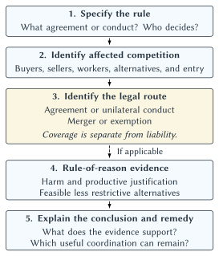

# Monopoly Power, Antitrust, and League Governance

The Buffalo Bills and Kansas City Chiefs need to agree on the rules of football. They need a schedule, officials, and a way to determine a champion. A league in which every team chooses its own rules would not offer much of a product.

Now change the question. Must those teams also agree to let only one company manufacture hats bearing their logos?

The first agreement helps create a football game. The second determines who can enter a merchandise business. There may be reasons to coordinate both activities, but the reasons are not identical. Explaining why the teams need a common rulebook does not tell us whether they need an exclusive hat supplier.

That distinction reached the Supreme Court in *American Needle v. NFL* in 2010. The case concerned an exclusive headwear license awarded to Reebok in 2000, not the identity of today's apparel suppliers. The Court concluded that the teams' licensing arrangement was subject to antitrust review; it did not decide that every exclusive sports license was unlawful.[^american-needle]

Chapter 7 explained why teams are both rivals and production partners. This chapter asks how far their cooperation should extend. Who benefits when a league controls entry, pools rights, or limits competition for players? Which restrictions help produce something valuable? Which protect existing businesses from competitors? The challenge is to answer those questions about a particular decision, rather than pronounce an entire league good or bad.

## Learning Goals

By the end of this chapter, you should be able to:

- identify the customers, workers, and alternatives relevant to a sports-market question
- distinguish monopoly deadweight loss from a transfer of surplus
- explain the differences among a joint venture, cartel behavior, and natural monopoly
- analyze competition between leagues and restrictions on entry within a league
- describe the basic antitrust framework and the limited scope of sports exemptions
- distinguish a court's decision to review an agreement from a finding that it is unlawful
- evaluate a league rule using its effects, justification, and feasible alternatives

The chapter requires economic reasoning, not new algebra or memorization of case dates.

## Where Is The Competition?

A fan sees the Bills competing against other teams on the field. An economist also sees competition for players, coaches, sponsors, viewers, merchandise customers, and places to locate franchises. The teams need each other to produce games, but that does not eliminate their separate interests in these other transactions.

**Market power** is the ability to sustain prices above competitive levels, or otherwise worsen terms, because customers or suppliers have limited alternatives. When employers exercise power over the terms offered to workers, we call it buyer power or monopsony power. Chapters 13 and 14 develop that labor-market side. Here, the important point is that the relevant alternatives depend on whose decision we are studying.

For a family choosing a Saturday outing, a game might compete with a concert, a restaurant, or staying home. For a broadcaster seeking a large live Sunday audience, those same activities are not necessarily close substitutes for a package of football rights. For an elite quarterback considering employment, a restaurant is plainly not a substitute employer offering a comparable use of his skills.

Even within one sport, the answer can differ. A casual buyer choosing a souvenir may be willing to switch between teams. A devoted supporter may want only one team's hat. A manufacturer seeking licenses must consider which marks it needs, what customers will buy without them, and whether other products offer a realistic business alternative. None of those observations alone settles the boundaries of a legal market.

::: quickconcept
**Market Power Depends On Alternatives**

To evaluate market power, ask who could switch, to what, and at what cost. A large organization need not have power in every market it enters, and a small organization can have power over customers with few good alternatives.
:::

Economists call the process of identifying the relevant set of competing products and locations **market definition**. The product question concerns substitutes; the geographic question concerns where buyers and sellers can realistically turn. A local ticket market and a national rights market need not have the same boundaries. Courts examine evidence about substitution rather than simply accept a league's preferred description of its business.[^fraser]

This is why “sports compete with all entertainment” is an incomplete answer. It identifies possible substitutes but does not establish how strongly they constrain a particular transaction. Saying “there is only one NFL” is incomplete too. A distinctive name is not a complete economic argument about market power.

The practical test is behavioral. Would customers switch after a sustained price increase? Could another supplier expand? Would a player accept work in another league? How long would those adjustments take? We do not need to calculate a numerical market boundary here, but we do need to identify the evidence that would make an answer persuasive.

## What Is Wrong With Monopoly?

Chapter 4 explained why a team facing downward-sloping demand may leave some seats unsold. Under a single ticket price, selling additional seats can require lowering the price on seats it would otherwise sell for more. An additional sale can therefore be worthwhile to the fan and inexpensive to provide without being worthwhile to the team under its pricing arrangement.

Chapter 3 supplies the welfare interpretation. Suppose a seat would otherwise remain empty, the fan values attending more than the additional cost of serving that fan, and accommodating the fan creates no offsetting cost for others. There is a potential gain from trade. If the pricing arrangement prevents the transaction, that gain is lost.

The important comparison is between the fan's willingness to pay and the additional resource cost, not between the fan's willingness to pay and the team's preferred price. The team chooses its price to advance its own objectives. That price need not admit everyone whose attendance would add to total surplus.

### A Transfer Is Different From A Lost Trade

When a fan buys a ticket at a higher price, part of the fan's surplus becomes revenue for the seller. In the simple surplus model, holding costs and quality fixed, that part changes hands rather than disappears. We can care about who receives the money, but we should describe the change correctly.

The **deadweight loss** comes from gains that nobody receives because beneficial trades do not occur. Some fans stay home even though their value from attending would exceed the cost of admitting them. The owner does not collect their money, and the fans do not receive the experience.

::: quickconcept
**Transfers And Lost Gains From Trade**

A higher payment on a trade that still occurs can transfer surplus from buyer to seller. Preventing a trade whose benefit exceeds its resource cost reduces total surplus. The two effects can occur together, but they are not the same effect.
:::

This distinction also helps explain why high profits are not themselves a measure of monopoly's social cost. Profits might reflect a desirable product, lower costs, scarce capacity, market power, or several of these at once. We need to identify what happens to output, quality, investment, and the opportunities available to other participants.

### Capacity Changes The Comparison

A sold-out stadium presents a different problem from an empty seat that could be filled at little additional cost. If every seat is occupied, admitting another fan requires displacing someone or expanding capacity. We cannot count the new fan's enjoyment while ignoring the displaced fan or the cost of additional seating.

A high price at a capacity-constrained event may allocate a genuinely scarce resource. It is not, by itself, evidence that the seller is withholding seats. The longer-run question is whether additional capacity, dates, franchises, or competing events would be worthwhile and what prevents them from appearing.

Nor does every empty seat establish avoidable monopoly loss. Buyers differ in timing and preferences, forecasts are imperfect, and selling an additional ticket can have costs. The model is a way to isolate a mechanism, not a license to classify every photograph of an empty stadium.

Market power can also affect quality and innovation. An organization insulated from rivalry may face less pressure to improve access, service, or product design. Conversely, a valuable new product or cost-saving innovation can earn a large return without reflecting exclusionary conduct. Antitrust distinguishes success through competition from conduct that unlawfully suppresses it.[^ftc-antitrust]

We can now see why the question “Does the league make a lot of money?” is less useful than “Which alternatives are constrained, and which gains from trade are lost?”

## Joint Ventures, Cartels, And Common Rules

Teams cannot respond to every concern about market power by abandoning cooperation. Two independently owned clubs still need to agree on when and where to play. A season requires a larger arrangement. The product fans purchase includes meaningful opponents, standings, and the possibility of a championship.

A **joint venture** is an arrangement in which otherwise separate businesses cooperate on an activity. It can combine complementary resources, reduce the cost of reaching agreements, and create products that the participants could not readily supply alone. Chapter 7's common schedule is a straightforward sports example.

Cooperation is not unique to sports. Businesses in other industries can jointly develop technology or agree on technical standards that make their products work together. The existence of useful cooperation does not settle the effects of every additional restriction the participants adopt.

::: quickconcept
**Cartel**

A cartel is an arrangement among otherwise competing firms to limit competition—for example, by coordinating prices, restricting output, or dividing customers or territories. A league can carry out productive joint activities while also adopting particular agreements with cartel-like effects. We must examine the activity, not rely on the label.
:::

Consider the difference between agreeing to play on Sunday and agreeing not to compete for a sponsor. The first can make the event possible. The second removes an option the sponsor might otherwise have. There could be additional facts that matter in either example, but “the teams need to cooperate” is not a complete explanation for both.

Collective agreements also create enforcement problems. A rule might increase the members' combined returns while leaving an individual member better off breaking it. If clubs agree to restrict some form of spending, a club might gain an advantage by finding an exception. If they pool a commercial opportunity, one club might prefer its own deal. The temptation to depart from an agreement helps explain why leagues adopt monitoring, penalties, voting procedures, and dispute-resolution systems.

Those enforcement tools can sustain a useful commitment or an anticompetitive restriction. The presence of a penalty does not tell us which. We first need to understand what behavior the rule encourages and what would happen without it.

::: keypoint
**Sports Require Coordinated Competition**

Teams need common arrangements to produce a league. That need gives them a reason to coordinate some decisions, not an unlimited justification for restricting every other kind of competition.
:::

Table 8.1 applies this distinction to several decisions. Its third column asks a question rather than supplies an automatic verdict.

| Decision | Possible productive purpose | Competition question |
| --- | --- | --- |
| Common playing rules | Make games recognizable and results comparable. | Does the restriction concern playing the game or unnecessarily limit another activity? |
| Shared season schedule | Coordinate opponents, venues, and media inventory. | Could the schedule be organized without excluding a competing event or supplier? |
| Exclusive headwear license | Coordinate quality, distribution, or investment. | Which benefit requires exclusivity rather than several qualified licensees? |
| Pooled broadcast rights | Assemble a coherent package and reduce negotiation costs. | How do the arrangement and its legal treatment affect output and alternatives? |
| Player-compensation rule | Support a claimed league objective or implement bargaining terms. | What competition is limited, what evidence supports the objective, and do labor-law protections apply? |

Table 8.1. Same league, different decisions. These are analytical questions, not findings that a particular agreement is lawful or unlawful. The headwear example is developed below using the historical American Needle dispute.

## Why Is It So Hard To Start A Rival League?

A would-be entrant needs more than a ball and a television camera. It must assemble teams, players, venues, financing, distribution, and enough audience interest to make participation worthwhile. Each partner may hesitate until the others are committed. A broadcaster wants recognizable talent; players want credible financing and exposure; investors want a plausible audience.

An established league has already solved many of those coordination problems. Its history, rivalries, records, and championship give fans reasons to care. These advantages can persist even when an entrant is legally free to try. Failure to attract an audience is different from being prevented from reaching one through an unlawful agreement.

### Natural Monopoly Has A Specific Meaning

The term **natural monopoly** concerns production costs. It describes a market in which one supplier can serve the relevant demand at lower total cost than multiple suppliers. Duplicating a costly system may waste resources. Whether that condition holds depends on costs and the scale of demand; it is not established merely by observing one dominant organization.

Sports leagues may share production costs and enjoy economies of scale. A common office, scheduling system, or media operation can avoid duplication. But three different explanations must remain separate:

- **Production economies:** one arrangement lowers the total resources needed to provide the output.
- **The value of a common competition:** audiences and participants value an established championship and its connections.
- **Restrictions on entry:** contracts or rules limit the ability of another organization to compete.

The mechanisms can coexist. They do not become the same mechanism because they help the same incumbent.

::: quickconcept
**Joint Production And Natural Monopoly**

Joint production means participants need to work together to create an output. Natural monopoly means one supplier can meet the relevant demand at lower total cost than several suppliers. Teams needing opponents establishes the first point, not necessarily the second.
:::

A common championship may itself be a valuable feature. Fans might prefer seeing the strongest teams eventually meet. Yet it is still worth asking whether a shared championship requires common ownership, a full merger, common employment restrictions, or some narrower agreement. Different organizational choices preserve different kinds of rivalry.

The useful counterfactual is therefore not always a world without leagues. It might be two competing leagues, a league with more open entry, or a shared competition with fewer restrictions on activities outside the playing field.

## When The NFL Had A Rival

::: historicalnote
**The AFL And The Value Of Another Offer**

The American Football League began play in 1960, creating competition for the established NFL. The NFLPA's institutional history emphasizes what this meant for players: another league could provide another place to sell their services. On June 8, 1966, the AFL and NFL announced their merger agreement. The agreement began a process of integration rather than instantly combining every operation.[^afl-nfl]

The players' union describes the merger as weakening leverage created by competition between the leagues. That is the union's historical interpretation, not a numerical estimate of the merger's effect on every player's salary. It points to an economic mechanism: an alternative employer can matter even to a worker who never takes its offer.
:::

Imagine a player deciding whether to accept a contract. If no comparable employer is interested, turning it down may mean giving up a professional career. If a credible rival league wants the player, refusing becomes less costly. The original employer must consider that alternative when deciding what to offer.

An entrant can consequently change the incumbent's behavior before capturing most of its business. The same reasoning applies to broadcasters seeking content or cities hoping to attract a team. An additional credible partner can change bargaining even when the eventual agreement remains with the incumbent.

Integration can also create benefits. A common championship can settle which team is best across formerly separate competitions. Scheduling and commercial arrangements can become easier to coordinate. But those gains must be distinguished from gains to owners from facing less competition for talent. Lower payroll is a private cost saving; it does not automatically represent a reduction in the resources society uses to produce football.

The NFL–AFL combination received specific statutory treatment. Federal law contains a limited professional-football league-combination provision, added in 1966. It is not a general rule that sports mergers escape antitrust scrutiny.[^sports-broadcasting-act]

The broader lesson does not require deciding that every merger is harmful or every challenger deserves to survive. **Competition within a league and competition between leagues are different things.** A championship can remain fiercely contested while the owners face fewer independent rivals in a commercial market.

## A Second Team In The City?

Chapter 7 explained why existing owners care about expansion. A new member can add customers, partners, and revenue, but also compete with incumbents and divide shared receipts among more teams. Antitrust adds a further question: which restrictions on entry are justified by producing the league, and which mainly protect members from rivalry?

**Territorial rights** give a team specified protection within a geographic area under a league's rules. Their scope varies by organization and activity. Protection against another member entering a territory should not be confused with a legal right to prohibit every independent rival from operating there.

::: casestudy
**A Second Team In The City?**

Consider a hypothetical metropolitan area with one established professional team. An investor proposes a second club with financing and a suitable venue. The league must decide whether to admit it.

The incumbent argues that it spent years building local interest, developing sponsors, and investing in its business. Another club could take some of those customers. The investor argues that the metropolitan area has grown and that many potential fans are poorly served by the existing team.

Both arguments can be sincere. They do not answer the same economic question. The incumbent's prospective revenue loss matters to its owners. The public-policy question is what happens to the overall value and cost of the available sports opportunities.
:::

First consider **business stealing**: some customers switch from the incumbent to the entrant. A loss to one firm is not necessarily a loss to society. Fans may prefer the new location, price, service, or identity. The entrant gains revenue, and the incumbent has a reason to improve its offer. Those are ordinary effects of competition.

Next consider investment. If participants reasonably expect a period of territorial protection, it may encourage spending to develop a market. Removing protection unexpectedly could alter future willingness to invest. That is a potential efficiency argument, but it needs specificity: which investment, which risk, and why would permanent exclusion be required? An existing firm's preference for less competition is not the same as evidence that entry would destroy valuable investment.

There may also be real resource costs. A second venue could duplicate facilities, and a new team could complicate scheduling or affect playing quality. The alternative is not necessarily costless. Compare the additional benefit to fans and partners with those costs rather than simply count the revenues lost by the first team.

An expansion fee illustrates the difference between distributing gains and creating them. A fee may compensate existing owners and purchase access to valuable league assets. It does not by itself establish that the selected number of teams maximizes total surplus. Owners deciding collectively may value franchise scarcity differently from potential entrants or fans.

Relocation introduces another distinction. Moving a team changes where an existing membership operates; expansion adds a member. Their effects on cities, schedules, and shared revenue differ. Both can involve decisions by owners who have a financial interest in protecting the value of existing franchises.

Chapter 10 connects scarce franchise opportunities to stadium bargaining. If a city has few realistic ways to obtain another team, the threat of losing its current one can carry more weight. Here, the essential point is narrower: league rules help determine the outside options available to teams, cities, and entrants. That makes the rules economically consequential even before a lawsuit is filed.

## A Small Antitrust Toolkit

Economics helps identify the consequences of a restriction. Antitrust law determines which kinds of conduct can be challenged, what must be demonstrated, and what remedies are available. The two inquiries inform each other, but a legal decision is not simply a judge reading the size of a deadweight-loss triangle.

::: quickconcept
**Antitrust**

Antitrust law addresses agreements, conduct, and mergers that unlawfully weaken competition. In sports, it can concern customers buying the product, businesses seeking access to commercial opportunities, or athletes selling their labor.
:::

### Agreements, Monopolization, And Mergers

Three categories are enough to organize most of the chapter's examples.

**Section 1 of the Sherman Act concerns agreements among separate economic actors.** The question is whether an agreement unreasonably restrains trade. An agreement to fix prices is different from independent businesses arriving at similar prices on their own. In a league, rules approved collectively by owners can raise Section 1 questions, even when they are administered by one league office.[^antitrust-statutes]

**Section 2 concerns monopolization and related conduct.** Having a successful or dominant business is not, by itself, unlawful monopolization. The inquiry concerns monopoly power together with conduct that unlawfully acquires or maintains that power. A rival's failure does not establish a violation. Customers might simply prefer the incumbent's product.[^ftc-antitrust]

**Merger review asks whether combining businesses threatens competition.** Section 7 of the Clayton Act addresses acquisitions whose effect may substantially lessen competition or tend to create a monopoly. Combining two organizations may produce efficiencies and also remove independent rivalry. This inquiry differs from reviewing an agreement between businesses that remain separate.[^antitrust-statutes]

The legal category matters. An argument that a particular activity is internal to one economic enterprise addresses a threshold issue under Section 1. It is not a universal exemption from every antitrust provision.

Enforcement is not limited to the league disciplining its own members. Government agencies can bring antitrust actions, and eligible private parties can seek damages or court orders against unlawful restraints. Those possibilities give rules consequences outside the commissioner's office. Whether a particular claimant can obtain relief depends on the legal requirements, not simply dissatisfaction with the result.[^ftc-antitrust]

### Per Se Treatment And The Rule Of Reason

Some categories of agreements, such as naked price fixing among competitors, receive **per se** treatment: the law condemns the kind of restraint without requiring a detailed demonstration of its effects in each instance. Here, *naked* means that the restriction is not part of a productive integration that could justify a different analysis.

Sports often require a more contextual inquiry because some agreements are necessary to create the competition. Under the **rule of reason**, courts examine a challenged restraint's competitive effects and justification. A simplified account asks whether the challenger establishes substantial anticompetitive harm; whether the defendant supplies a procompetitive rationale; and whether the legitimate objective could reasonably be achieved through less anticompetitive means. The details depend on the case, and courts do not have to redesign a business around every imaginable marginal improvement.[^alston]

For our purposes, translate that into three practical questions: What competition is lost? What productive benefit is claimed? Why does achieving that benefit require this restriction?

Suppose a league requires qualified officials. Consistent officiating helps create credible games. Now suppose it requires every official to purchase an unrelated product from an owner's company. The need for qualified officials does not explain that additional obligation. A broad appeal to “quality” must be connected to the specific conduct being challenged.

::: quickconcept
**Review Is Not A Verdict**

An agreement can be subject to antitrust review without being unlawful. A decision that permits a challenge to proceed is different from a final finding of liability. Likewise, an exemption from a particular claim is not proof that a rule maximizes economic welfare.
:::

### Follow The Decision, Not The Slogan

A useful sequence for reading a sports-antitrust controversy is:

1. **Specify the rule.** Identify the agreement or conduct and who controls it.
2. **Identify the affected competition.** Name the buyers, sellers, workers, alternatives, and entry conditions.
3. **Identify the legal route.** Distinguish an agreement, unilateral conduct, a merger, and any applicable exemption.
4. **Where the rule of reason applies, examine the evidence.** Consider competitive harm, productive justification, and reasonably feasible less restrictive alternatives.
5. **Explain the conclusion and remedy.** Identify what the evidence supports and which useful coordination can remain.

**Figure 8.1: A league rule under examination.** Antitrust coverage is separate from liability. The dashed arrow marks the conditional move to rule-of-reason analysis; not every legal route requires that inquiry. The final step asks what the evidence supports and which useful coordination can remain. This is an economic reading guide, not a complete litigation decision tree.

::: aifiguredescription
**Figure description: `fig:ch08-rule-evaluation`**

This schematic has no axes, curves, quantities, or numerical outcomes. Five numbered rectangular boxes form one vertical sequence. Boxes 1, 2, 4, and 5 have pale blue backgrounds; box 3 has a pale gold background to distinguish the legal-coverage question, not to indicate a favorable or unfavorable verdict. All boxes have dark outlines and text. Box 1, “Specify the rule,” asks what agreement or conduct is involved and who decides. Box 2, “Identify affected competition,” lists buyers, sellers, workers, alternatives, and entry. Box 3, “Identify the legal route,” lists agreement or unilateral conduct, merger or exemption, and explicitly states “Coverage is separate from liability.” Box 4, “Rule-of-reason evidence,” lists harm and productive justification, followed by feasible less restrictive alternatives. Box 5, “Explain the conclusion and remedy,” asks what the evidence supports and which useful coordination can remain. Short black downward arrows connect adjacent boxes. The arrow from box 3 to box 4 is dashed and labeled “If applicable”; the other three arrows are solid. The arrows organize an inquiry rather than represent causal effects. The figure does not imply that every claim follows the rule of reason, that an efficiency claim automatically defeats evidence of harm, or that an exemption makes a rule economically desirable. It deliberately omits a legal/illegal verdict and is not a complete litigation decision tree.
:::

The sequence is a reading guide, not a complete litigation decision tree. It keeps us from treating a headline such as “league sued over new rule” as an economic finding. It also encourages a better counterfactual. The choice is rarely just the challenged restriction or the disappearance of the sport.

## One Rulebook, One Hat Supplier?

Return to the opening puzzle. In *American Needle*, the NFL teams had pooled trademark licensing through NFL Properties. Before the disputed change, multiple vendors received nonexclusive licenses. In 2000, Reebok received an exclusive ten-year license to make and sell trademarked headwear for the teams. American Needle, whose license was not renewed, challenged the arrangement.[^american-needle]

The NFL's threshold argument was that the relevant operations should be treated as those of a single economic enterprise, not an agreement among competitors. The Supreme Court rejected that categorical protection for the challenged licensing conduct. The teams could have separate interests as suppliers of intellectual property even while cooperating to produce football. The Court sent the case back for rule-of-reason treatment.

This was a decision about **coverage**, not a final calculation of the license's effects on hat prices, variety, or investment. That limit makes the case useful for economics: students can identify what still needs to be shown rather than memorize a simplified story in which exclusivity automatically loses.

::: casestudy
**Does Centralized Licensing Require Exclusivity?**

Imagine advising a sports league choosing a licensing arrangement. You are comparing three possibilities: teams negotiate separately; a common office offers licenses to multiple qualified manufacturers; or a common office chooses one exclusive manufacturer.

Central administration could reduce the number of negotiations, simplify brand standards, and make a broad merchandise assortment easier to arrange. Those benefits might be available with several licensees. Exclusivity would therefore need an additional explanation—for example, an investment that the chosen manufacturer would be less willing to undertake without some protection from rivals.

The question is not whether someone can describe a benefit. It is whether evidence supports the benefit, whether it requires the restriction, and what competition is sacrificed to obtain it. These are hypothetical possibilities to investigate, not factual findings about the Reebok agreement.
:::

Consider an exclusive supplier's proposed investment in distribution. A long contract might make that investment easier to recover. But we would also want to know whether several suppliers could make comparable investments, whether the investment is specific to the licensed product, and whether a shorter or narrower agreement would work. The word *investment* cannot end the analysis any more than the word *exclusive* can.

The lost rivalry might concern manufacturers competing to serve consumers, teams offering alternative licensing opportunities, or both. A manufacturer losing a contract is not sufficient evidence of harm to competition; selection processes necessarily produce winners and losers. The important question is how the arrangement changes the available options and incentives beyond that individual firm's disappointment.

A bidding contest for an exclusive contract can itself create competition. But competition **for** a contract and competition **within** a market after the contract is awarded are different. A large payment to the rights holder does not alone establish lower prices, better quality, or wider choice for customers. We need to follow the effects through the arrangement rather than stop with the winning bid.

This is the chapter's central method in miniature: separate a useful joint activity from the additional restriction, then ask what each contributes.

## Broadcasting: Pooling Rights And Restricting Output

Chapter 6 showed why media companies value a coherent sports package. A common seller can organize a schedule, reduce negotiation costs, and offer a more predictable set of events. But centralized control also determines which games are offered, on what terms, and with what alternatives for buyers.

The economic distinction is between **assembling output** and **restricting output**. A package that makes games easier to distribute can increase the available product. An arrangement that prevents otherwise viable broadcasts can reduce it. Central selling is an organizational fact; its consequences depend on the accompanying terms.

### The NCAA Television Case

In *NCAA v. Board of Regents* in 1984, the Supreme Court considered an NCAA television plan that limited televised football appearances and constrained schools' ability to negotiate outside the plan. The Court recognized that college football needs some common rules but concluded that the challenged television restrictions violated antitrust law.[^board-regents]

The lesson was not that colleges must stop coordinating football. It was that producing college football did not justify the particular controls on its television output. Schools could share playing rules while having more freedom in commercial arrangements.

This example also separates a league's members from its customers. The challenge came from within the college-sports system, reflecting disagreement about who should control a valuable opportunity. Governance can impose costs on participants as well as outsiders.

### The Sports Broadcasting Act

Congress can change the legal treatment of a particular activity. The Sports Broadcasting Act of 1961 provides a limited antitrust exemption for specified joint arrangements involving sponsored telecasts in professional football, baseball, basketball, and hockey. It is not an exemption for every agreement a league makes, every sport, or every distribution technology.[^sports-broadcasting-act]

That limitation matters when translating older law into newer markets. In *Shaw v. Dallas Cowboys* in 1999, an appellate court held that the statutory exemption did not cover the subscription satellite arrangement at issue. The court distinguished that paid distribution from commercially sponsored free telecasting. Being outside the exemption meant that ordinary antitrust scrutiny remained relevant; it did not itself establish that every paid package was unlawful.[^shaw]

Nor should we assume that a ruling about a particular satellite package answers every question about streaming decades later. The contract, distribution method, challenged restraint, and applicable law all matter. The stable lesson is that a statutory exception has boundaries.

::: casestudy
**Does A Broadcast Exemption Still Fit The Product?**

Consider the access complaints discussed in Chapter 6. A fan may need several services to follow a team or watch particular nationally important games. That experience creates questions about distribution and willingness to pay. It also creates a policy question: how should rules written around an earlier broadcasting model apply to modern rights arrangements?

On June 10, 2026, a House Judiciary subcommittee held a hearing titled “Examining the Sports Broadcasting Act.” The hearing establishes that the issue was under congressional examination. It does not establish that a particular current contract was unlawful or that a proposed legislative change became law.[^broadcast-hearing]

The economic task is to identify which change would improve access, reduce costs, or create more competition, and which valuable coordination it might disturb. A promise of easier viewing is a hypothesis to evaluate, not a substitute for examining the rights arrangement.
:::

Several separate decisions can be hidden inside one complaint: selling rights collectively, dividing games into packages, awarding exclusivity, requiring a subscription, or determining local availability. Reforming one decision need not have the same effect as reforming another. Our analysis should be as specific as the proposed remedy.

## Why Baseball Is Different

Baseball's antitrust history is a reminder that legal institutions do not always emerge from a clean comparison of present-day benefits and costs. Earlier decisions can create a path that later courts hesitate to change.

::: historicalnote
**An Exception With A History**

In *Federal Baseball* in 1922, the Supreme Court treated the baseball business at issue as outside the reach of the federal antitrust law because it did not regard the exhibitions as interstate commerce in the relevant sense. *Toolson* in 1953 preserved the result. In *Flood v. Kuhn* in 1972, the Court acknowledged baseball's interstate character but retained the established exception, leaving a change to Congress.[^flood]

The sequence did not establish that baseball is economically incapable of competition or that every baseball restriction benefits fans. It reflected the development and persistence of a particular legal doctrine.
:::

Curt Flood's challenge concerned the reserve system, which constrained a player's ability to offer his services to another club. The economic issue was an athlete's outside options: competition among teams for a player's services could be sharply limited even while the teams competed vigorously for wins.

Flood lost his Supreme Court challenge. Congress later enacted the **Curt Flood Act of 1998**, changing antitrust treatment of specified conduct directly relating to the employment of major-league players. The statute did not abolish baseball's entire exception. It expressly left other listed areas unchanged and preserved the nonstatutory labor exemption.[^curt-flood-act]

Consequently, “baseball is exempt” is too broad to answer a particular question, while “the Curt Flood Act ended the exemption” is incorrect. We need to identify the activity and the governing provision. Chapter 14 takes up the longer history of the reserve system, arbitration, and free agency.

This is also an example of **path dependence**: earlier institutional choices shape later possibilities. An arrangement can persist because people organized contracts and expectations around it, or because the authority to change it is contested. Persistence does not prove that it is the best arrangement today.

The policy question remains economic. What would change if the legal treatment changed? Would entry become easier, bargaining options improve, or productive coordination become more costly? Removing a protection would permit additional scrutiny; it would not automatically produce a rival league or resolve every dispute in the challenger's favor.

## Why Bargaining Changes The Legal Question

The AFL–NFL story showed why alternative employers matter. Professional athletes can also improve their position by bargaining collectively. The resulting institution is different from one in which employers alone agree on what they will pay.

Labor law permits workers to organize and bargain over employment terms. Collective bargaining often produces common wage rules and other restrictions that might look problematic if examined only as agreements limiting price competition. Reconciling labor law with antitrust therefore requires attention to who negotiated the agreement and the setting in which it operates.

The **nonstatutory labor exemption** is a court-developed protection for certain restraints arising from the collective-bargaining process. Its name distinguishes it from an express sports exception written by Congress. It is not a claim that collectively negotiated terms are economically harmless or that every action by a unionized league is protected.[^brown]

::: sideline
**Why A Bargained Salary Rule Can Receive Different Treatment**

Imagine two arrangements. In the first, owners simply agree among themselves to cap what they will offer workers. In the second, employers and a players' union negotiate a broader package involving compensation, benefits, mobility, and work rules.

Both could limit individual offers. But the second operates within a collective-bargaining institution in which workers have a representative and a means of negotiating the package. Labor-law protections can therefore change the antitrust analysis. Whether a particular rule falls within the protection still depends on its legal and bargaining context.
:::

In *Brown v. Pro Football* in 1996, the Supreme Court applied the exemption to the employers' implementation of their last best good-faith wage offer after bargaining reached an impasse. An **impasse** is a bargaining deadlock. The decision shows why the protection is not limited to the moment when both parties sign a final agreement. It does not grant immunity to every employment restriction forever.[^brown]

For economics, the distinction concerns both the procedure and the distribution of gains. A payroll rule might be part of a bargain over shared revenue, benefits, or other terms. To assess it, identify what workers receive, which choices remain available, and what the realistic alternative would be. Chapters 13 and 14 provide the tools to examine those effects in depth.

The legal protection and the economic evaluation remain separate. A bargained rule may be protected from a particular antitrust claim while still shifting rewards among veterans, rookies, stars, and marginal players. Agreement on a package does not mean every worker benefits equally from every provision.

## College Sports: Who Makes The Rules?

College sports bring the tension into especially sharp focus. Schools jointly maintain a competition but also seek athletes and commercial opportunities individually. In *NCAA v. Alston* in 2021, the Supreme Court upheld an injunction against specified limits on education-related benefits. The Court did not decide every NCAA compensation restriction. Its holding must also be distinguished from Justice Kavanaugh's separate concurrence, which expressed broader concerns.[^alston]

Suppose a school's roster decision improves its chances of winning but changes what audiences think college sports represents. The school captures much of the benefit of winning. If the decision reduces attachment to the shared college-sports product, some costs fall on other schools: a potential **negative reputation externality**. That supplies an economic reason to consider common rules, not evidence that fans necessarily dislike the practice or that a particular restriction is lawful. Better players might attract some fans, while others value a different connection to college life. Rules can also restrict athletes' opportunities. The question is which restrictions preserve something audiences value, what evidence supports that claim, and whether the purpose could be achieved with fewer limits on athletes.

In early September 2026, a television advertisement featuring Nick Saban and paid for by Saving College Sports urged fans to support the Protect College Sports Act. The SEC had endorsed the revised proposal.[^college-sports-campaign] The August 2026 draft combined national standards for eligibility, transfers, and name, image, and likeness (NIL) compensation with antitrust protection for specified rules and enforcement—not immunity from every lawsuit.[^college-sports-proposal] Sports organizations were asking Congress to change the legal framework within which they could coordinate. This is **political economy** in action: economic interests shape political choices, and those choices shape the rules governing markets. Common rules can protect a shared competition while limiting athletes' options. Which rules deserve protection, who gets to write them, and what safeguards do athletes receive? Chapter 15's “Who Makes the Rules?” discussion develops this debate through the advertising campaign, eligibility disputes, and efforts to establish national rules.

## Who Governs The Governors?

Legal limits operate alongside internal governance. As Chapter 7 explained, a commissioner and league office exercise delegated authority. Owners retain important decision rights, while collective bargaining can give players a role in particular areas. Governance is therefore more than the personal style of the commissioner.

Think about three decisions: disciplining a player, deciding whether to admit a franchise, and awarding a commercial contract. They can involve different procedures, interests, and constraints. A commissioner may be expected to protect the sport's reputation while also serving an organization whose members benefit from a disputed rule. Calling an official the guardian of the sport does not remove that conflict.

Clear procedures can help. Participants can know the standards in advance, understand who decides, and use an appeal or review process where one exists. These arrangements support credible commitments. They also impose costs and can be designed to favor incumbents. The economics concerns how the allocation of authority changes incentives, not whether centralization is always good or always bad.

### A Single-Entity Label Is Not The Whole Answer

Chapter 7 compared organizational forms, including the central control associated with single-entity arrangements. Legal analysis requires an additional step: examine how the relevant decision actually works.

In *Fraser v. Major League Soccer* in 2002, the appellate court described MLS and its operator-investors as a hybrid rather than simply equating the organization with one ordinary firm. The decision relied on the players' failure to establish the relevant market as alleged, and did not create blanket immunity for all MLS activities.[^fraser]

The comparison with American Needle is useful. A common office or corporate structure does not necessarily eliminate separate economic interests. Conversely, separate legal entities do not answer every question about economic integration. Students should ask who has control, which choices remain independent, and which competition the challenged arrangement removes.

This applies across the NFL, NBA, MLB, NHL, and MLS structures introduced in Chapter 7. We do not need another league-by-league survey here. The point is that governance rules, labor institutions, and specific statutes can produce different legal questions even when the organizations all call themselves leagues.

## What The Cases Actually Establish

The cases are easier to remember when each has a distinct teaching job. Table 8.2 organizes them by the question decided rather than presenting a list of who won and lost.

| Case and year | Economic issue | What the decision establishes |
| --- | --- | --- |
| *Flood v. Kuhn* (1972) | Baseball's reserve system and player alternatives. | Preserved the historical baseball exception; did not establish that the reserve system was efficient. |
| *NCAA v. Board of Regents* (1984) | Collective control of televised football output. | Necessary sporting cooperation did not justify the challenged television plan. |
| *Brown v. Pro Football* (1996) | Common wage action after bargaining deadlock. | Labor-law protection covered the specified postimpasse conduct, not every employment restraint. |
| *Fraser v. MLS* (2002) | League organization and competition for players. | Market definition mattered; the result was not blanket single-entity immunity. |
| *American Needle v. NFL* (2010) | Joint trademark licensing. | The challenged conduct was subject to Section 1 and rule-of-reason review, not automatically unlawful. |
| *NCAA v. Alston* (2021) | Limits on education-related benefits. | Upheld relief against specified limits, without resolving every compensation rule. |

Table 8.2. Selected antitrust cases and the limits of their holdings. Sources are the opinions discussed in the text and listed in Source Notes. The Curt Flood Act is a legislative change, not another judicial decision.

Notice that the table does not place organizations permanently into an exempt or nonexempt category. The activity, legal setting, and issue presented to the court matter. A case can change how a question must be examined without supplying a complete answer about economic effects.

## What Would A Better Rule Look Like?

Criticizing a restriction is easier than designing an alternative. A league still needs to schedule games, make commitments, and determine who can participate. A useful remedy should address the harmful conduct while preserving valuable coordination where possible.

Return to the hypothetical second team. One option is a permanent incumbent veto. Another is entry under published financing, venue, and scheduling standards. A third might include a limited transition period or an appropriately justified payment. Those arrangements differ in how they protect investment, constrain discretion, and allow new competition. We should compare them rather than assume that the only choices are unrestricted entry or permanent exclusion.

The same reasoning applies to licenses. Multiple qualified licensees might preserve brand standards; a narrower exclusive contract might support a particular investment. Either could fail if it does not address the real problem. Proposing an alternative is the beginning of a comparison, not proof that it would work.

Evidence must fit the claimed mechanism. A league arguing that a rule protects quality should identify how quality changes. A claim about investment should explain which investment becomes less likely. A claim about competitive balance should identify an effect on playing strength and ultimately on the product people value. Saving owners money is not a substitute for those explanations.

Nor can every gain somewhere in the sports business simply be placed against every loss elsewhere to declare a restraint lawful. For example, claiming that lower athlete compensation leaves more money for some other activity does not by itself answer a challenge to competition for those athletes. The relevant legal inquiry concerns the challenged restraint and the applicable framework.[^alston]

This does not require students to predict court judgments. It requires them to make a disciplined economic argument: identify the decision, specify the alternatives, trace the benefits and costs, and state what remains unknown.

The next chapter takes up a justification that appears throughout these disputes: **competitive balance**. We have seen why a league might care about keeping games and seasons attractive. We now need to examine what balance means, how to measure it, and whether the rules adopted in its name actually produce it.

## Big Picture

- Teams cooperate to create games and seasons while remaining rivals in important commercial and labor markets.
- Market power depends on alternatives, not simply an organization's size or a distinctive brand name.
- Monopoly can cause lost gains from trade; a higher payment on a remaining trade is a different effect. Binding capacity changes the relevant comparison.
- Productive joint activity, cartel behavior, and natural monopoly are distinct concepts.
- Rival-league entry can change bargaining opportunities. A merger can create integration benefits while removing independent competition.
- Territorial and entry rules affect fans, potential owners, workers, and cities as well as existing franchises.
- Antitrust distinguishes agreements, monopolization, mergers, and specific exemptions. Being subject to review is not the same as being found liable.
- Baseball's history, broadcasting legislation, and labor institutions provide different kinds of legal treatment with different boundaries.
- A convincing justification explains why a particular restriction is needed and examines reasonably feasible alternatives.

## Review Questions

1. Why does the need for a common football rulebook not settle whether a league needs an exclusive merchandise supplier?
2. How could a fan, a broadcaster, and an athlete face different relevant alternatives within the same sport?
3. Distinguish a transfer of surplus from deadweight loss. Why does an empty seat differ from a seat already occupied by another fan?
4. What distinguishes a joint venture, cartel behavior, and natural monopoly?
5. Why might one member want to depart from an agreement that benefits the members collectively?
6. How can the existence of a rival league affect a player who never joins it?
7. What integration benefits might a merger create, and which kinds of independent rivalry might it remove?
8. Why is a loss of incumbent revenue not enough to demonstrate that entry reduces total surplus?
9. Distinguish Sherman Act Section 1, Section 2, and merger review.
10. What is the difference between per se treatment and the rule of reason?
11. What did American Needle establish, and what did it leave unresolved?
12. Why do the Sports Broadcasting Act and the Shaw decision not establish that every streaming contract is either exempt or unlawful?
13. What did the Curt Flood Act change, and why is it incorrect to say it abolished baseball's entire exception?
14. Why can collective bargaining change the legal treatment of a common compensation rule?
15. What evidence would be needed to support a shared-reputation justification for a college eligibility rule?
16. Why must a proposed remedy be compared with a feasible alternative rather than a world in which no coordination is needed?

## Applications

These exercises require explanations, not calculations. Identify the affected parties, the mechanism, a plausible counterfactual, and the evidence needed. A label such as “monopoly” or “fair” is not a complete answer.

1. **The full stadium and the empty section.** One team sells every seat at a high price. Another charges the same price but leaves a section empty. Explain why neither observation alone measures deadweight loss. What additional facts would let you assess whether admitting another fan could increase total surplus?
2. **The common supplier.** A league says one exclusive uniform supplier guarantees quality. Several manufacturers offer to meet a common certification standard. Explain what benefit certification might preserve and what additional evidence would support exclusivity. Do not assume that the supplier losing a contract has necessarily demonstrated harm to competition.
3. **The new league's offer.** A player receives an offer from a new league. The incumbent team responds with better terms. The new league later fails. Explain why its failure does not establish that it never affected competition. What further evidence would distinguish business failure from unlawful exclusion?
4. **The second team.** Return to the hypothetical metropolitan area. The incumbent says entry will reduce its revenue; the entrant says it will attract previously underserved fans. Identify two possible social benefits, two possible resource or investment costs, and one narrower alternative to a permanent veto.
5. **The broadcast package.** A group of teams proposes joint selling with several nonexclusive distributors. Another proposal uses one exclusive distributor. Distinguish the effects of pooling from the effects of exclusivity. What must be checked before making a legal claim about either arrangement?
6. **The college roster rule.** A school proposes admitting athletes whom a conference currently excludes. The conference invokes the identity of college sports; the athletes invoke lost opportunities. Explain the potential reputation externality, identify an opposing demand hypothesis, and propose evidence that could distinguish them. Do not assume the existing restriction or the proposed change is automatically justified.

::: studyandlearn
**Examine A League Rule**

Choose one rule described in this chapter. Ask an AI tutor to play the role of a skeptical economist and question your explanation one step at a time:

1. What specific choice does the rule restrict?
2. Who would compete differently without it?
3. What useful activity might the rule support?
4. Could a narrower arrangement preserve that benefit?
5. What evidence would change your conclusion?

Keep three categories separate: facts supplied by the chapter, hypotheses you propose, and information you would need to research. If the AI invents a court holding or a numerical effect, require it to identify a source or withdraw the claim.
:::

## Suggested Assignment

Write a 600–800 word recommendation to a hypothetical league considering an exclusive license, a territorial restriction, or a new membership rule. Use the chapter's five-stage reading guide.

Your recommendation should identify the affected competition, distinguish private gains from broader gains or losses, explain the strongest productive justification, and evaluate one feasible alternative. Conclude by recommending the rule, rejecting it, or modifying it. Name the most important missing evidence and explain how it could alter your recommendation.

You are being assessed on economic reasoning, not your ability to forecast litigation. If you use a real dispute, record the source and date and distinguish allegations, temporary orders, and final decisions. Do not present proposed legislation as an enacted rule.

::: aitutor
**AI tutoring guidance: Chapter 8**

This is a conceptual chapter with no required arithmetic or algebra. Ask one question at a time, start with ordinary language, and increase difficulty by changing assumptions rather than adding calculations. Use the actual chapter and its Source Notes; do not invent current rules, quotations, legal outcomes, case dates, or empirical estimates. Treat the second-team case and proposed licensing efficiencies as hypothetical. Distinguish surplus transfers from deadweight loss, capacity from strategic withholding, joint production from natural monopoly, and a potential reputation externality from an established demand effect. Reward explanations of parties, incentives, alternatives, and evidence. Do not accept the claims that every league agreement is unlawful, every useful collaboration is exempt, or every failed entrant was excluded illegally. Separate antitrust coverage from liability; preserve the limits of American Needle, Fraser, Alston, Brown, and the Curt Flood Act. The September 2026 advertising example describes advocacy and a dated legislative proposal, not proof of enactment, blanket immunity, or the result of an eligibility lawsuit. Later college-sports developments belong in Chapter 15 and must not be assumed from this chapter. Do not require memorization of case dates. For exercises, first ask the student to attempt the analysis, offer a targeted hint if needed, and then explain the mechanism. These are educational economic exercises, not individualized legal advice.
:::

## Source Notes

[^american-needle]: *American Needle, Inc. v. National Football League*, 560 U.S. 183 (2010), decided May 24, 2010, especially pp. 186–187 and 195–204. Supreme Court opinion reproduced at <https://supreme.justia.com/cases/federal/us/560/183/>; official report at <https://www.govinfo.gov/content/pkg/USREPORTS-560/pdf/USREPORTS-560-183.pdf>. The opinion establishes the historical licensing facts and the concerted-action holding. The chapter's proposed efficiencies and alternative contracts are analytical hypotheses, not findings about actual price effects or the final merits of the agreement.

[^ftc-antitrust]: Federal Trade Commission, “The Antitrust Laws,” <https://www.ftc.gov/advice-guidance/competition-guidance/guide-antitrust-laws/antitrust-laws>, and “Monopolization Defined,” <https://www.ftc.gov/advice-guidance/competition-guidance/guide-antitrust-laws/single-firm-conduct/monopolization-defined>, accessed September 5, 2026. Official introductory explanations of the laws and the distinction between obtaining market power through competition and unlawful monopolization.

[^antitrust-statutes]: Sherman Act Sections 1 and 2, 15 U.S.C. 1–2, <https://www.law.cornell.edu/uscode/text/15/1> and <https://www.law.cornell.edu/uscode/text/15/2>; Clayton Act Section 7, 15 U.S.C. 18, <https://www.law.cornell.edu/uscode/text/15/18>, accessed September 5, 2026. These statutory provisions organize the chapter's basic categories; judicial interpretation supplies additional requirements.

[^afl-nfl]: National Football League Players Association, “1960s: AFL vs. NFL,” <https://nflpa.com/about/history/1960s-afl-vs-nfl>; Pro Football Hall of Fame, “Football Firsts,” American Football League Firsts section, <https://www.profootballhof.com/news/football-firsts>, both accessed September 5, 2026. The Hall of Fame dates the merger announcement to June 8, 1966. The union supplies a participant's account of the effect of interleague rivalry on player leverage. The chapter does not estimate a causal wage effect or treat the agreement date as completion of all integration.

[^sports-broadcasting-act]: Sports Broadcasting Act of 1961, as amended, 15 U.S.C. 1291 and 1294, <https://www.law.cornell.edu/uscode/text/15/1291> and <https://www.law.cornell.edu/uscode/text/15/1294>, accessed September 5, 2026. Section 1291 identifies covered sponsored-telecasting agreements and also contains a specific professional-football league-combination provision added in 1966. Section 1294 preserves the application of antitrust law beyond the specified exceptions. This is not blanket protection for sports broadcasting, streaming, or mergers.

[^board-regents]: *NCAA v. Board of Regents of the University of Oklahoma*, 468 U.S. 85 (1984), decided June 27, 1984, especially the majority opinion at pp. 98–120, <https://www.govinfo.gov/content/pkg/USREPORTS-468/pdf/USREPORTS-468-85.pdf>; reproduced opinion at <https://supreme.justia.com/cases/federal/us/468/85/>. The chapter uses the holding about the challenged television plan, not a claim that all collective college-sports activity is unlawful.

[^shaw]: *Shaw v. Dallas Cowboys Football Club, Ltd.*, 172 F.3d 299 (3d Cir. 1999), especially pp. 301–302, <https://law.justia.com/cases/federal/appellate-courts/F3/172/299/599656/>. The appellate opinion addresses the Sports Broadcasting Act's coverage of the subscription satellite arrangement at issue, not a final merits ruling on every later paid distribution arrangement.

[^broadcast-hearing]: U.S. House Judiciary Subcommittee on the Administrative State, Regulatory Reform, and Antitrust, “Examining the Sports Broadcasting Act,” hearing held June 10, 2026. Official committee record: <https://docs.house.gov/committee/Calendar/ByEvent.aspx?EventID=119369>; published hearing record, Serial No. 119–73: <https://www.govinfo.gov/app/details/CHRG-119hhrg63977>, accessed September 5, 2026. The hearing documents congressional examination, not enactment of a reform or a judicial finding about a current contract.

[^flood]: *Flood v. Kuhn*, 407 U.S. 258 (1972), decided June 19, 1972, especially pp. 282–285, <https://supreme.justia.com/cases/federal/us/407/258/>. The majority discusses the earlier *Federal Baseball* and *Toolson* decisions and preserves baseball's exceptional treatment. The legal history is not evidence that the reserve system maximized welfare.

[^curt-flood-act]: Curt Flood Act of 1998, Pub. L. 105–297, Section 3, codified at 15 U.S.C. 26b, <https://www.law.cornell.edu/uscode/text/15/26b>, accessed September 5, 2026. Read subsection (a), the limitations in subsection (b), and the preservation of the nonstatutory labor exemption in subsection (d)(4) together.

[^brown]: *Brown v. Pro Football, Inc.*, 518 U.S. 231 (1996), decided June 20, 1996, especially pp. 234–250. Official report: <https://tile.loc.gov/storage-services/service/ll/usrep/usrep518/usrep518231/usrep518231.pdf>; reproduced opinion at <https://supreme.justia.com/cases/federal/us/518/231/>. The chapter uses the bounded postimpasse holding to explain the interaction between collective bargaining and antitrust, not an unlimited employment exemption.

[^alston]: *NCAA v. Alston*, 594 U.S. 69 (2021), decided June 21, 2021, <https://www.supremecourt.gov/opinions/20pdf/20-512_gfbh.pdf>. Majority slip opinion pp. 14–15 defines the limited issue; pp. 24–25 discusses the rule-of-reason framework; pp. 35–36 states the result. Justice Kavanaugh's concurrence is separate from the majority holding. The chapter uses the decision on specified education-related benefits, not as a complete account of later college-sports compensation or eligibility rules.

[^college-sports-campaign]: Michael Brauner, “WATCH: Saban appears in commercial advocating for Protect College Sports Act,” *Yellowhammer News*, September 3, 2026, <https://yellowhammernews.com/watch-saban-appears-in-commercial-advocating-for-protect-college-sports-act/>; U.S. Senate Committee on Commerce, Science, and Transportation, “Committee Releases Revised Protect College Sports Act,” August 4, 2026, <https://www.commerce.senate.gov/press/rep/release/committee-releases-revised-protect-college-sports-act/>, both accessed September 6, 2026. The first identifies the advertisement and its sponsor; the second records SEC endorsement. These sources do not establish which spot aired during any particular game or that the SEC paid for this advertisement.

[^college-sports-proposal]: U.S. Senate Committee on Commerce, Science, and Transportation, *Protect College Sports Act*, revised draft MCC26E64 released August 4, 2026, <https://www.commerce.senate.gov/wp-content/uploads/2026/08/MCC26E64.pdf>, especially Sections 112–118 on transfers, eligibility, compensation, and specified antitrust protections, and Section 119 on private rights of action; accessed September 6, 2026. The passage describes that proposal, not enacted law or a prediction that all college-sports litigation would end.

[^fraser]: *Fraser v. Major League Soccer, L.L.C.*, 284 F.3d 47 (1st Cir. 2002), decided March 20, 2002, especially pp. 55–59, <https://caselaw.findlaw.com/court/us-1st-circuit/1441684.html>. The appellate opinion qualifies the single-entity characterization and relies on the plaintiffs' failure concerning the alleged market. It should not be reduced to a claim of blanket MLS immunity.
