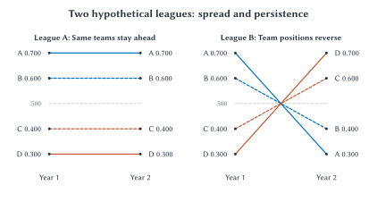
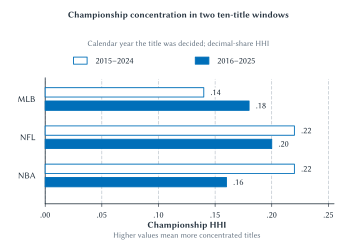

# Competitive Balance in Sports

Imagine offering a Bills fan two seasons. In the first, Buffalo is an overwhelming favorite almost every week. In the second, nearly every game is a toss-up. Which season would the fan prefer? Now ask a television viewer who has no particular attachment to the Bills. The answers need not be the same.

That difference sits at the center of competitive balance. Fans want meaningful competition, but they also want their teams to win. They may enjoy an upset, a close championship race, or the chance to watch an exceptional team. A dynasty can frustrate rival fans while giving the entire league a story people follow. Complete equality is therefore not an obvious description of the product a successful league should sell.

Nor is there one obvious way to measure equality. A league can have close regular-season standings but the same champion year after year. Another can have wide gaps between its best and worst teams while the identities of those teams change frequently. Equal payrolls would not necessarily eliminate either pattern.

Chapter 7 explained why teams cooperate to produce a league. Chapter 8 asked when that cooperation justifies restrictions on competition. This chapter examines one of the most common justifications: a rule is needed to improve competitive balance. The useful response is to ask which kind of balance, through what mechanism, and with what evidence.

## Learning Goals

After reading this chapter, you should be able to:

- distinguish competitive balance from uncertainty of outcome and equal spending
- interpret within-season dispersion, performance persistence, and championship concentration
- explain why season length and playoff design affect comparisons across sports
- connect financial resources to expected performance without treating wins as something a team can purchase with certainty
- explain the Rottenberg–Coase distinction between the allocation of talent and the distribution of income
- evaluate revenue sharing, salary caps, payroll floors, luxury taxes, and draft rules through incentives
- explain how rebuilding, expansion, relocation, and promotion and relegation complicate balance policy
- distinguish a league's commercial objectives from the broader benefits and costs of a rule

The main task is interpretation. The optional measurement appendix shows how selected statistics are calculated; understanding the chapter does not require calculating standard deviations by hand.

## What Do We Mean By Competitive Balance?

::: quickconcept
**Competitive Balance**

Competitive balance refers to how evenly teams' playing strength is distributed within a league. We cannot observe strength directly, so we use evidence such as records, predicted win probabilities, playoff appearances, and championships. These measures answer different questions.
:::

Start with three time horizons.

**Game uncertainty** concerns an individual contest. Before kickoff, how difficult is it to predict the winner? A game between evenly matched teams usually has more uncertainty than one between a strong favorite and a weak opponent. But a close final score is not the same thing as an uncertain game beforehand. An overwhelming favorite can win narrowly, and an evenly matched contest can become a blowout.

**Within-season balance** concerns the distribution of performance over a season. Are teams clustered near the middle of the standings, or are a few teams far ahead while others are effectively eliminated early? A championship race is related to this distribution, but the rules also matter. Division boundaries, playoff places, and tiebreakers determine which games retain importance.

**Across-season balance** concerns the persistence of success. Do the same teams remain near the top, or can weaker teams improve? Championship turnover is one part of this question. A team can repeatedly reach the playoffs without winning a title, while another can win once and then decline. Counting only champions misses much of what fans experience.

Economists sometimes use *parity* to describe a league in which teams have relatively similar chances or results. In ordinary sports discussion, the word is used more loosely. Someone may mean equal payrolls, frequent upsets, many plausible champions, or a different champion every year. Before evaluating the claim, translate it into something observable. The literature contains multiple measures because the underlying questions really are different.[^balance-measures]

Consider the standings in Table 9.1. These are hypothetical teams, not disguised estimates of an actual league. In both leagues, every season has exactly the same collection of win percentages. What differs is who gets which record.

| Team | League A, year 1 | League A, year 2 | League B, year 1 | League B, year 2 |
| --- | ---: | ---: | ---: | ---: |
| A | .700 | .700 | .700 | .300 |
| B | .600 | .600 | .600 | .400 |
| C | .400 | .400 | .400 | .600 |
| D | .300 | .300 | .300 | .700 |

**Table 9.1: The same annual spread can produce very different experiences across seasons.** In League A, strong and weak teams remain in place. In League B, their positions reverse. Both leagues have a mean win percentage of .500 and the same within-season dispersion in each year.

A supporter of Team D might regard League B as offering much more hope. Yet a statistic that measures only the spread of a single season's records would declare the leagues identical. Neither conclusion is a mathematical error. They concern different aspects of competition.

**Figure 9.1: The same spread, different prospects.** The lines connect each team's two season records from Table 9.1. League A preserves the ranking; League B reverses it. These are hypothetical observations, not estimated team trajectories within a season.

::: aifiguredescription
**Figure description: `fig:ch09-dispersion-and-persistence`**

Two side-by-side panels plot the same four hypothetical teams in Year 1 and Year 2. Higher vertical position means a larger win percentage. In both panels, Year 1 has Team A at .700, B at .600, C at .400, and D at .300. In League A, each team has the same percentage in Year 2, so all four connecting lines are horizontal. In League B, Year 2 has A at .300, B at .400, C at .600, and D at .700. The connecting lines cross as the rankings reverse. Direct endpoint labels identify the teams and exact values, with line styles as additional cues. A dashed horizontal guide marks .500 in each panel. Both leagues have the same mean and within-season dispersion in both years, but very different persistence. The lines connect annual observations; their interiors do not measure within-season performance or demonstrate a causal policy effect.
:::

The distinction also helps separate **equality of opportunity** from **equality of outcomes**. Fans might accept unequal results when they believe every club has a credible route to success. They may object more strongly when market size, inherited resources, or rules appear to make failure permanent. Equalizing the final standings would remove much of the point of competition. Preserving a plausible route to improvement is a different objective.

## Do Fans Always Want A Close Contest?

Chapter 6 introduced the **uncertainty of outcome hypothesis**: other things equal, greater uncertainty about a sporting outcome may increase interest in watching it. If the result were known with certainty, some of the attraction would disappear. That intuition is useful, but it does not establish that every fan prefers a 50–50 contest.

A home supporter may enjoy the prospect of victory. A neutral viewer choosing among several games may care more about suspense. A visitor may pay to see a famous opponent even when the home team's chances are poor. A long rivalry can make an otherwise ordinary game important. The demand for the contest depends on this combination, not only on the probability of an upset.

Quality and uncertainty are also different. Two weak teams can be evenly matched. Two outstanding teams can be evenly matched. Equal uncertainty does not make those games equally attractive. Chapter 5's discussion of loyalty and brand capital adds another complication: fans do not necessarily abandon an attachment when the team becomes weak, nor do all consumers want the same sporting experience.

The empirical literature does not establish one universal relationship between closeness and demand. Borland and Macdonald's review treats uncertainty alongside team quality, success, prices, income, and other determinants of sports demand. It is a starting point for asking what matters in a particular setting, not a warrant for assuming that maximum equality maximizes attendance everywhere.[^fan-demand]

How could we investigate the question? Suppose closer games have higher television audiences. Perhaps uncertainty attracts viewers. But perhaps the close games involve stronger teams, more stars, or a late-season race. Perhaps broadcasters selected those games for better time slots. Chapter 1's warning about correlation applies again. A useful study must try to separate uncertainty from the other reasons people watch.

Attendance and television viewing should not automatically be pooled into one outcome. A person who has already bought a ticket faces a different choice from someone deciding whether to keep watching a game. A sold-out stadium also conceals additional demand: attendance cannot increase beyond capacity even if more fans want to attend. Ticket prices, resale prices, viewing time, and repeat purchases can reveal information that the attendance total cannot.

::: sideline
**Would You Really Want Your Team To Be Average?**

Imagine a reform that makes every Bills game a toss-up but reduces Buffalo's chance of winning a championship because the team was previously stronger than average. Would a Bills supporter favor it? Would a neutral viewer? Would the owner of a currently weak team?

Explain the answers through the benefits each person receives. Then ask whether a rule could preserve a strong team's chance to excel while making persistent failure less likely for other teams.
:::

The economic case for league coordination is therefore more specific than “everyone likes parity.” A club choosing its roster considers its own benefits from winning. It may not fully account for how its choices affect the attractiveness of opponents' games or the league's championship race. Those effects can justify examining common rules. They do not tell us which rule works, how strong it should be, or whether its benefits exceed its costs.

## Reading The Standings Without Being Misled

### Win Percentages And Dispersion

A win percentage divides wins by games played. A team that wins 60 of 100 games has a win percentage of .600, or 60 percent. Comparing percentages rather than win totals lets us compare teams that have played different numbers of games, although it does not solve every comparison problem.

In a closed set of games with no ties, every win is another team's loss. When teams play the same number of games, the league's mean win percentage is .500. This is an accounting identity, not evidence of balance. A league with half its teams at .800 and half at .200 has the same mean as one in which every team finishes .500. We need to examine the **dispersion**, meaning the spread of records around the average.

The familiar statistical measure is the **standard deviation**. For our purposes, its main interpretation is simple: a larger standard deviation means the records are more spread out. It does not say why they are spread out, and it does not identify the quality of the league as a whole.

The completed 2025 MLB season provides a concrete example. Milwaukee finished 97–65, a .599 win percentage, while Colorado finished 43–119, or .265. Across all 30 teams, the population standard deviation of win percentages was about .071. Those figures describe a substantial spread in actual records; they are not a direct measurement of each team's underlying talent.[^mlb-standings]

Why make that qualification? Injuries, weather, opponent schedules, and the sequence of close games affect records. Strength itself can change during the season as players develop or rosters change. The standings combine persistent differences with events that would not necessarily repeat in another season.

### Why Season Length Matters

Suppose every game between two equally strong teams is like a fair coin toss. Even then, the teams will not all finish with the same record. Over a short season, luck can produce a large difference in win percentages. Over a long season, the random component is more likely to average out.

This makes a raw comparison between a 17-game schedule and a 162-game schedule misleading. Wider football win-percentage dispersion does not, by itself, establish that football teams are less evenly matched than baseball teams. The schedules give chance very different opportunities to influence the final records.

One standard response is to compare the observed standard deviation with the standard deviation expected under an **equal-strength benchmark** for that season length. The resulting relative-dispersion measure is often called the **Noll–Scully ratio**. A ratio near one is close to the model's reference spread; a ratio above one indicates more spread than that reference. It is not a test result proving why the spread occurred.

For the 162-game benchmark, the reference standard deviation is approximately .039. Dividing the 2025 MLB spread of .071 by that benchmark gives about 1.81. Read this as “roughly 1.8 times the equal-strength reference spread,” not “81 percent unfair,” and not “81 percent of the season was determined by money.” The appendix shows the calculation if you want to see it.

The adjustment is useful, but it is not a universal ranking machine. The basic benchmark assumes independent games with equal win probabilities and no ties. Actual schedules can be unbalanced, home advantage matters, and roster strength changes. The ratio can also respond differently to season length when teams truly differ in strength. Dividing by a short-season benchmark does not make all institutional differences disappear.[^season-length]

Ties and standings-point systems require additional care. A football tie can count as half a win in a win-percentage calculation. Hockey awards standings points under rules that distinguish some kinds of losses. Soccer uses wins, draws, and points. Simply placing each sport's published “percentage” into the same formula can compare unlike quantities. Define the outcome and its reference model first.

### Persistence And Regression Toward The Mean

To study whether success persists, follow the same teams through time. A simple approach is to compare each team's win percentage this year with its percentage next year. A positive association means that strong teams tend to remain relatively strong. We can also examine repeated playoff appearances, time spent near the bottom, or how often a club becomes a serious contender.

Be careful with the claim that a league's rules automatically pull everyone back toward the middle. Some movement is **regression toward the mean**. A spectacular record may combine a strong roster with unusually favorable luck. If the luck does not repeat, the next record can decline even when the roster remains strong. A poor team that was unusually unlucky can improve for the same reason.

That is not an explanation of every turnaround. Draft choices, coaching, financial resources, and roster decisions can matter greatly. It means only that “last year's worst teams improved” is incomplete evidence for a draft rule or a revenue-sharing policy. We need a counterfactual: how much improvement would have occurred without the change?

## Who Wins The Championships?

Championships offer a different measure of balance. Count how many franchises won a title during a specified period and how heavily the titles were concentrated among them. The calculation is accessible, and the outcome is one fans care about. But it throws away most of the regular season and much of the postseason.

The **Herfindahl–Hirschman Index**, or **HHI**, summarizes concentration by squaring each team's share of the championships and adding the results. Squaring gives more weight to large shares. Using decimal shares, a higher HHI means greater concentration. Here it measures titles, not market power; the antitrust meaning of a concentration measure should not be mechanically imported into a championship table.

If ten different teams win one title each, the ten-title HHI is .10. If one team wins all ten, it is 1.00. The lower limit in this particular ten-title exercise is .10 even if the league contains 30 teams: only ten franchises can possibly win one of those ten championships. A short window cannot establish that every team has had a fair opportunity.

Table 9.2 uses championships decided in the calendar years 2016 through 2025. This convention matters for football: the February 2025 Super Bowl completed the **2024 NFL season**. We use championship years consistently across all three leagues and stop before 2026 so every included calendar year contains a completed title in each league.[^champion-data]

| League | Different champions in ten titles | Largest title share | Championship HHI |
| --- | ---: | ---: | ---: |
| MLB | 7 | 30% | .18 |
| NFL | 6 | 30% | .20 |
| NBA | 8 | 30% | .16 |

**Table 9.2: Championship concentration, titles decided in 2016–2025.** Author calculations from league championship records. The measure uses decimal shares. This is a descriptive comparison of title outcomes, not an estimate of the effect of any salary rule.

The NFL has a salary cap, but it had fewer distinct champions and more concentrated titles than MLB in this window. That observation is enough to reject a simplistic claim that having a cap guarantees the most championship turnover. It is not evidence that the cap made football less balanced. Football and baseball differ in many other ways, and we do not observe the same NFL without its cap.

The NBA result also illustrates how quickly a familiar reputation can become an unreliable guide to a particular statistic. But look what happens when we move the window back just one year. For titles decided in 2015–2024, the HHI is .14 for MLB, .22 for the NFL, and .22 for the NBA. Moving the window changes which dynasty years are included and alters the ranking.[^champion-data]

That sensitivity is worth teaching rather than hiding. A ten-year window is transparent and memorable, but ten championships are still only ten observations. Longer windows include more information while mixing different rules, team populations, and eras. There is no window that makes judgment unnecessary.

**Figure 9.2: Moving the window changes the comparison.** Open bars represent titles decided in 2015–2024; filled bars represent 2016–2025. A higher decimal-share HHI means more concentrated championships. The calendar-year convention is the same as in Table 9.2. Source: author calculations from league championship records.[^champion-data]

::: aifiguredescription
**Figure description: `fig:ch09-championship-concentration`**

A grouped horizontal bar chart compares three leagues across two overlapping ten-title windows. The horizontal axis begins at zero and measures decimal-share championship HHI. Open bars show 2015–2024; filled bars show 2016–2025. MLB changes from .14 to .18, NFL from .22 to .20, and NBA from .22 to .16. Exact values appear beside every bar. NFL and NBA are tied for the highest concentration in the earlier window, while NBA has the lowest concentration in the later window. Only one title is replaced when the window moves forward. The chart demonstrates sensitivity to the chosen window, not a long-run trend, a change in underlying playing strength, or an effect caused by a salary cap. Years refer to when titles were decided, so the February 2025 Super Bowl belongs to the 2025 championship-year observation even though it ended the 2024 NFL season.
:::

::: warning
**Different Champions Do Not Prove Equal Chances**

A league can have substantial financial advantages and still produce different champions. Strong teams can lose a short playoff series. Conversely, repeated champions can reflect outstanding management, an exceptional player, or advantages that a spending rule does not eliminate. Title counts tell us what happened, not the entire opportunity structure that produced it.
:::

### The Playoffs Are Part Of The Measurement

Consider a stronger team facing a weaker one. If their relative strength remains stable and games are sufficiently independent, a longer series gives the stronger team more opportunities to recover from an unlucky result. A single elimination game leaves more room for an upset. Neither format is inherently the right one; they offer different combinations of suspense, sporting selection, scheduling, and commercial opportunities.

A league can therefore increase championship turnover without substantially equalizing regular-season team strength. It might admit more teams to the playoffs or place greater weight on short elimination rounds. Fans of more clubs then have a postseason route, but regular-season excellence may become less decisive.

More playoff places can also keep additional teams in contention late in the season. That may sustain interest and encourage some clubs to invest rather than sell players. The countervailing possibility is that teams can qualify without being as strong, reducing the reward for additional regular-season improvement. The net effect depends on the format and the teams' positions. Counting playoff participants is not a substitute for examining those incentives.

## Does Money Buy Competitive Advantage?

Financial resources matter because they expand a team's choices. A team can pursue more players, absorb the cost of a disappointing contract, invest in scouting and development, and maintain depth when injuries occur. Chapter 7 explained why the financial return to improvement differs across teams. A larger market or a more valuable local media arrangement can make an additional expected win worth more.

But **payroll is a payment for labor, not a direct reading of current playing strength**. Two teams can spend the same amount and receive different contributions. Young players may produce substantial value while earning less than established free agents. An expensive contract may reflect expected performance when it was signed rather than performance today. Injured players can remain on the payroll. Development, roster fit, coaching, and information affect the return to spending.

These differences do not make money irrelevant. They explain why a wealthy team buys a better set of options rather than guaranteed victories. An organization can be both financially advantaged and well managed. A lower-revenue team can be resourceful without facing the same margin for error. Neither a single expensive failure nor a single inexpensive success settles the general relationship.

A payroll-versus-wins graph would be a useful descriptive start, provided “payroll” is defined consistently. Opening-day payroll, total cash payments, and payroll used for a tax calculation are not interchangeable. Contract deferrals and long-term commitments complicate comparisons further. Even with consistent data, an association would not isolate causality: a team expecting to contend may add payroll because it already has a promising roster.

### The Dodgers Question

Chapter 6 examined the Dodgers' local-media arrangement and the distinction between the headline value of a media contract and the revenue entering a sharing calculation. Here the question is what such a financial advantage allows a team to do. It can support sustained investment, make some risks easier to absorb, and increase the willingness to pay for an improvement. It does not reveal how many wins the team purchased or establish that a particular reform would improve the league.[^dodgers]

The championship evidence does not dispose of the concern. A financially advantaged club might repeatedly assemble a contender while a lower-revenue club has to get several decisions right at once. Short postseason series can generate enough upsets to conceal that difference if we look only at the final champion. A better evaluation would examine repeated playoff access, expected strength, roster depth, and the ability to recover from mistakes, alongside titles.

::: casestudy
**What Exactly Would A Dodgers Rule Fix?**

Suppose a fan proposes a hard payroll cap because some teams have much more local revenue. Another proposes greater sharing of local-media income. A third wants a payroll floor because some teams spend too little. These proposals target different margins.

A cap limits some spending at the top. Sharing changes financial resources and the retained payoff to generating revenue. A floor requires a minimum amount of spending under its accounting rules. None directly guarantees that the next group of players acquired by a weaker club will perform well.

Which diagnosis motivates your preferred rule: too much concentration of talent, too little investment by some owners, persistent differences in revenue opportunities, or restricted access to a championship? What observable result would persuade you that the rule worked? Identify an outcome other than the champion in one season.
:::

The example returns us to the distinction between team objectives and league objectives. A wealthy owner may value winning beyond its financial return. A recipient of shared revenue may still prefer a conservative payroll. A rule that would equalize choices among identical profit-maximizing owners need not equalize choices among owners with different resources, preferences, or expectations.

## Rottenberg, Coase, And Where Talent Ends Up

Sports leagues have long defended restrictions on player movement as protections for weaker teams. The intuition is straightforward: if strong clubs can acquire anyone, will they obtain all the best players? Simon Rottenberg's 1956 analysis challenged the assumption that restricting players necessarily changes the eventual allocation of talent. The right to receive payment and the destination of a player need not move together.[^rottenberg]

The logic resembles the bargaining argument associated with Ronald Coase in Chapter 3. If rights are clear, exchange is permitted, transaction costs are low, and valuations remain unchanged, parties have an incentive to move a resource to the use that creates the greatest combined value for them. Initial ownership of the right can still have a large effect on who receives that value.[^coase]

::: casestudy
**One Player, Two Teams, Different Recipients**

Consider a deliberately simplified example. A player's services would add \$6 million to Team A's revenue and \$4 million to Team B's revenue over the same period. Ignore other costs and effects, assume the player is equally willing to play for either team, and suppose neither club faces a binding spending constraint.

If the player can negotiate freely, Team A can offer more than Team B is willing to pay. Now suppose Team B initially controls a transferable right to the player's services. Keeping the player gives B value of \$4 million. A could offer a transfer payment between \$4 million and \$6 million, leaving both clubs better off than if B kept the player.

The player can end up at A under either arrangement. What changes is who receives the payment: the player, the club holding the right, or some combination under the applicable rules. The amounts are hypothetical; the teaching point is the distinction between allocation and distribution.
:::

This is often called an **invariance principle**. Under the specified conditions, changing who initially owns the right need not change where the resource is ultimately used. It is not a claim that all institutions are equivalent or that labor restrictions are harmless. Lower player compensation is a consequential distributional effect even if team rosters were unchanged.

The example also answers only a private allocation question. The clubs' financial valuations do not automatically include every effect on fans, players, or the league. A transfer that benefits two owners is not, by that fact alone, a complete welfare verdict.

Why would a large-market team not acquire every good player? Additional talent normally has diminishing value at a particular club. There are limited roster places and playing opportunities. Another improvement may add less revenue once a team is already very strong, while it could make a rival into a serious contender. The allocation depends on the value of talent at the margin, not on a rule that the largest city must employ everyone.

The assumptions tell us where the benchmark may fail. A binding salary cap can prevent A's offer. Restrictions on trades can block the transfer. A young player may be difficult to evaluate, and the clubs may disagree about future value. A financially constrained team may be unable to fund a worthwhile acquisition. A player may strongly prefer a location, coaching staff, or role. Investments in developing talent can depend on who expects to retain the return.

These are economically meaningful departures, not technical inconveniences. The principle tells us to identify them. It also explains why merely announcing a redistribution of initial rights is insufficient evidence of a lasting redistribution of playing strength. Chapters 13 and 14 return to the implications for athlete earnings and bargaining power.

## What Do Competitive-Balance Policies Actually Change?

### Revenue Sharing: Resources And Incentives

Sharing revenue can make a lower-revenue team more financially secure. It may help the club maintain a credible operation and fund investments it could not otherwise afford. That is a real potential benefit. But “receives money” and “buys more effective playing strength” are separate steps.

Chapter 7 distinguished a team's total revenue from what it keeps at the margin. That distinction is central here. A transfer that does not depend on the club's own decisions can relax a financial constraint without directly changing the return to one more win. Proportional sharing of locally generated revenue can change that return because the club retains less of each additional dollar. Both the donor and the recipient respond to the rule.

Suppose two owners have equal opportunities to borrow, maximize profit, and face no spending floor. Giving one a fixed payment increases its wealth, but does not by itself change which roster maximizes the difference between its own incremental benefits and costs. If the same club had been unable to finance a valuable investment, the payment could change its roster. The distinction is the constraint, not the label “small market.”

In some restrictive league models, revenue sharing changes compensation more than the distribution of talent. In others, the interaction of sharing, owner objectives, and spending constraints changes balance. Fort and Quirk's analysis emphasizes the need to examine these mechanisms together rather than infer outcomes from the amount redistributed.[^sharing]

This is not a reason to dismiss sharing. Financial stability, risk pooling, and the survival of credible opponents may be objectives in their own right. It is a reason to assess competitive-balance claims separately from those objectives. If a league wants recipients to invest, it also needs to consider how an investment requirement would be defined, monitored, and enforced.

### Salary Caps And Payroll Floors

A **salary cap** limits payroll under a specified set of accounting rules. A **hard cap** generally cannot be exceeded under those rules; a **soft cap** permits specified exceptions. A **payroll floor** requires a minimum level of spending. These rules concern payments. Their effect on playing strength depends on how salaries, movement, development, and roster choices respond.

A binding cap can prevent a team from assembling the roster it would otherwise choose. Some players may move to other clubs. But a league-wide restraint can also reduce bids for labor. Holding talent roughly fixed in the short run, some adjustment may occur through lower compensation rather than a more even allocation. This is why the bargaining context matters: a rule presented as balance policy can also change the owner-player division of income.

Equal allowed payrolls do not mean equal effective inputs. Teams may differ in the value obtained from a draft pick, their ability to develop players, and their willingness to invest in coaching or information. When a regulated margin becomes harder to use, competition can move toward less-regulated margins. A wealthy team may retain advantages in facilities, staff, or the ability to absorb mistakes, depending on the specific agreement.

::: sideline
**A Cap Cannot Manufacture Another Elite Quarterback**

A spending rule does not create additional players with rare abilities. A club that has an exceptional quarterback may retain an advantage even while complying with a cap. Basketball creates a related possibility: one outstanding player can influence a large share of possessions on a five-player lineup.

The relevant question is how the rule changes the allocation and price of scarce talent. It cannot make talent cease to be scarce. A dynasty under a cap is therefore a reason to examine the mechanism, not proof that the cap has no effect.
:::

A floor addresses a different concern: a team receiving league revenue might spend little on its roster. A floor can require spending, but not good decisions. If the supply of available talent is limited, additional spending may raise salaries. It can still benefit players while having a smaller effect on the recipient team's relative strength than supporters expect.

The institutional details prevent misleading comparisons. The NFL combines a cap with minimum cash-spending requirements assessed over specified multiyear periods; cap charges and current cash payments are different. The NBA combines cap exceptions with a tax and additional restrictions associated with payroll thresholds called *aprons*. Neither system is adequately described as “every team spends exactly the same amount.”[^nfl-payroll][^nba-payroll]

### Luxury Taxes

A **luxury tax** raises the cost of payroll above a threshold rather than simply forbidding it. MLB's Competitive Balance Tax is the familiar baseball example.[^mlb-tax] The economic mechanism resembles a tax wedge: a club evaluates the value of an additional player against the salary plus any additional tax and other applicable consequences.

For a hypothetical team facing a 50 percent tax on the entire additional dollar of payroll, another \$10 million of taxed salary costs \$15 million before other rules enter. This is a teaching example, not a statement of a league's current rate. A sufficiently valuable improvement can still be worth making. A team near a championship opportunity may respond differently from one expecting a losing season.

That variation is part of the design. A tax can discourage spending while preserving some flexibility. It can also create sharp incentives around thresholds, especially when additional penalties depend on repeated or larger exceedances. Students need the marginal-cost intuition, not a memorized schedule that may change with the next agreement.

Tax receipts create a second question. How are they used? Even if proceeds support other clubs, redistribution does not automatically create equivalent talent or wins. Assess the effect on the payer's choices and the effect on recipients separately.

### Drafts, Rebuilding, And Tanking

A reverse-order draft gives weaker teams earlier access to new players. The intended mechanism is to replenish their talent. It can be especially important when selected players are valuable relative to their early-career compensation. But the draft assigns initial rights; it does not guarantee good evaluation, successful development, retention, or future championships.

The rule can also create an uncomfortable incentive. If a worse record improves access to a valuable player, a win has a benefit today and a possible cost tomorrow. **Tanking** means deliberately reducing current competitiveness to improve future opportunities under the rules. It need not mean athletes intentionally losing a game. Management can alter roster quality, playing time, or the timing of investment while players still try to perform well.

Distinguish tanking from every form of rebuilding. A club that trades an established player for prospects may be making a sensible intertemporal choice even without a draft reward for losing. Chapter 7 explained why a win's value changes with the team's competitive window. The policy concern is whether league rules add an avoidable reward to making the current product worse.

Lotteries weaken the certainty that losing secures a particular pick. Eligibility restrictions can also limit repeated access to top selections. MLB's 2022–2026 agreement uses a lottery for its first six draft choices.[^mlb-draft] But uncertainty about the reward does not necessarily eliminate the reward. The relevant question is how a roster decision changes the expected value of future opportunities.

::: historicalnote
**A New Lottery Is An Incentive Change, Not Yet A Result**

In May 2026, the NBA approved a redesigned lottery for the 2027–2029 drafts.[^nba-lottery] The three worst teams receive lower first-pick odds than the next seven.[^nba-lottery-design]

That creates a useful question before the results arrive: if a rule reduces the reward for finishing last, could it change incentives somewhere else in the standings? Look at the marginal consequence of another win or loss near every important boundary, not only the worst record.

As of September 29, 2026, those draft lotteries have not occurred. We can analyze the announced incentives; we cannot claim the reform has already reduced tanking or improved competitive balance.
:::

Baseball adds a longer development horizon. Trading current production for prospects can move value toward a future competitive window. A rebuilding seller may obtain assets it could not easily acquire through the free-agent market. That is a plausible route to future contention, particularly for a financially constrained club. Whether the acquired players actually improve later balance is an empirical question, not something established by the existence of a trade. Analytics may improve evaluation while leaving considerable uncertainty.

## League Design Beyond Payroll Rules

### Expansion And Relocation

Expansion changes the number of competitors. With more teams, a franchise's championship share can fall even if nothing changes about the relative strength of incumbent teams. An expansion draft can redistribute some players, while entry increases demand for playing services. In the short run, a larger league may draw on a relatively fixed talent pool. Over time, development and entry into the sport can respond.

Where the new team plays also matters. A market with strong demand may support investment and become a credible competitor. Adding another club to an existing territory could divide local demand or stimulate interest; it does not mechanically create equal opportunities. Entry fees and territorial restrictions can serve incumbent financial interests as well as league-design objectives, connecting the issue to Chapter 8.

Relocation changes revenue opportunities without necessarily changing the number of teams. Moving a struggling club to a stronger market might improve its capacity to compete. But the fans left behind lose something that a standings statistic does not record. Chapter 10 considers those local benefits and losses when teams seek public support for stadiums. A proposal cannot be evaluated solely by whether the relocated franchise later wins more games.

### Promotion And Relegation

In an open league system, weak performance can move a team to a lower division, while strong performance can bring promotion. That creates stakes beyond the championship. A game between teams near the bottom may matter intensely because avoiding relegation is valuable. More meaningful contests do not require equal title probabilities at the top.

The system also changes incentives to invest. Relegation risk can encourage spending to survive, while the prospect of promotion can encourage investment below the top division. Large financial differences between divisions can make failure costly. The same system can therefore generate strong incentives and financial instability. Its existence does not establish either superior overall balance or inferior league management.

Do not confuse turnover in league membership with turnover in championship opportunities. A top division can replace its weakest members while the same powerful clubs keep challenging for the title. Nor should a comparison silently drop relegated teams from a long-run measure: the population being followed has changed.

::: historicalnote
**Bayern's Run And Leverkusen's Breakthrough**

Bayern Munich won eleven consecutive Bundesliga championships from 2012–13 through 2022–23. Bayer Leverkusen ended the run in 2023–24.[^bundesliga]

The sequence makes both sides of the argument visible. Promotion and relegation did not prevent a long concentration of titles. Yet a breakthrough was possible. Neither fact tells us what attendance would have been with different rules, nor proves that a particular spending restriction would have produced a better league. A ten-season window entirely inside Bayern's run would have a title HHI of 1.00; moving the window across its end changes the measurement.
:::

## Choosing A Rule Means Choosing A Trade-Off

Table 9.3 summarizes the mechanisms. The final column identifies a question to investigate, not a verdict that the policy is ineffective.

| Policy | Immediate change | What must be checked |
| --- | --- | --- |
| Revenue sharing | Redistributes income and may change retained marginal revenue | Does roster investment change, and are financial constraints relaxed? |
| Salary cap | Restricts payroll choices under its accounting rules | Does talent disperse, compensation fall, or competition move to other inputs? |
| Payroll floor | Requires minimum spending | Does spending buy improved quality or mainly raise payments? |
| Luxury tax | Raises the marginal cost of specified payroll | Which teams change behavior, and what happens to the proceeds? |
| Draft preference or lottery | Changes access to initial player rights | Does it improve future contention while avoiding rewards for current weakness? |
| Playoff expansion | Creates additional paths to a championship | Does it sustain races, change investment, or weaken regular-season rewards? |
| Expansion or relocation | Changes membership or local revenue opportunities | What happens to talent, demand, incumbent incentives, and affected fans? |

**Table 9.3: A policy's name does not identify its final effect.** Begin with the decision it changes, then follow the behavioral response.

Some rules can complement one another. Sharing may provide resources that make a floor feasible. A floor may change how shared income is used. A cap may limit one route by which a richer club responds. But combining rules can also create new constraints and avoidance opportunities. A package needs to be evaluated as a package, while still identifying the job of each component.

College sports raises an additional complication: institutions are trying to define and preserve the product while the rules governing compensation and eligibility are changing. Calling a restriction “competitive balance” does not resolve its effects or its legal status. Chapter 15 examines that setting. Here the general discipline is the same: specify the rule, the affected choices, the intended outcome, and the evidence.

## More Balance, More Revenue, Or More Welfare?

A league may seek the distribution of team quality that produces the most revenue. That need not mean every team should be equally strong. A larger audience for a prominent contender may create commercial benefits, while a credible range of challengers keeps other markets engaged. The commercially preferred distribution depends on demand across fans and places.

But league revenue is not the same as total welfare. Chapter 3 taught us to distinguish payments from gains created. A policy can transfer income from players to owners without producing a better competition. It can help weak teams while reducing the reward for effective development. It can increase audience interest while imposing substantial costs on athletes or supporters.

::: warning
**More Balance Is Not Always The Same As More Welfare**

Fans value uncertainty, but they can also value quality, stars, rivalries, dynasties, and local identity. Players value compensation and career choices. A rule that compresses standings is not automatically the rule that creates the greatest overall benefit.
:::

This is not an argument for letting every financial advantage grow unchecked. Persistent exclusion from meaningful contention can weaken the product and make a league less attractive to many supporters. It is an argument for stating the problem precisely. “Give every club a credible path to contention” is a different goal from “produce a different champion every season” or “reduce the players' share of revenue.” Evidence about one cannot silently establish the others.

The strongest policy evaluation follows a short chain. Identify a measurable problem. Explain how the proposed rule changes incentives or constraints. Predict the response while acknowledging plausible countereffects. Compare actual outcomes with a credible counterfactual. Finally, account for benefits and costs to the people affected, not only the party proposing the rule.

That is the connection running from Chapter 7 through this chapter. Teams need one another. Some cooperation is necessary. A particular restriction still needs its own explanation and evidence.

## Big Picture

- Competitive balance concerns the distribution of playing strength; uncertainty concerns what is known about an outcome.
- Within-season dispersion, across-season persistence, and championship concentration answer different questions.
- Season length, ties, league size, and playoff design matter for empirical comparisons.
- Financial resources expand opportunities but do not buy guaranteed wins.
- Changing who owns a player right can redistribute income without necessarily changing the player's destination; that result depends on restrictive assumptions.
- Sharing, caps, floors, taxes, and drafts affect different decisions. Their names do not establish their effects.
- A credible chance to improve can matter even when fans do not want equal results.
- The relevant goal must be stated before a statistic or a reform can be evaluated.

## Study And Learn

### Conceptual Questions

1. Why might a Bills season-ticket holder and a neutral television viewer prefer different win probabilities for the same game?
2. Can two leagues have identical annual standings dispersion but different across-season balance? Use Table 9.1.
3. Why does a league-wide mean win percentage of .500 tell us almost nothing about balance?
4. Explain why a short season can produce unequal records even when teams are equally strong.
5. What does an observed-to-reference dispersion ratio of 1.81 mean? Give one interpretation it does not support.
6. How could a league produce more different champions without reducing the regular-season gap between its strongest and weakest teams?
7. Why is a team's payroll not identical to its current playing strength?
8. In the two-team player example, why might the destination remain the same while the recipient of payment changes?
9. Identify two conditions that could prevent that transfer from occurring.
10. Why might a fixed revenue transfer change spending by a financially constrained club but not by an otherwise identical unconstrained profit maximizer?
11. Distinguish a cap, a floor, and a luxury tax by the decision each changes first.
12. How can a rule intended to help weak teams create a reward for fielding a weaker current roster?
13. Why is a new lottery announcement not evidence that tanking has already declined?
14. Can promotion and relegation make more games meaningful without making the championship race more balanced?
15. What costs or benefits would be missed by evaluating relocation only through the team's subsequent record?

### Applications

1. **The cap claim.** Someone uses Table 9.2 to argue that the NFL should eliminate its salary cap because its titles are more concentrated than baseball's. Explain both what the table establishes and why the proposed causal conclusion does not follow.
2. **The winning team.** A league proposes to redistribute an exceptional team's players until all clubs have nearly equal expected records. Identify a possible benefit and two possible costs. Do not assume that lower dispersion is itself a complete welfare measure.
3. **The recipient.** A club receives more shared revenue and leaves payroll unchanged. Give one explanation consistent with profit maximization and one circumstance in which you would have expected a different response. What information would distinguish them?
4. **The rebuild.** A club outside the playoff race trades a veteran for prospects. Explain why this need not show that its players are intentionally losing. Then identify how a draft rule could add a separate incentive to weaken the current team.
5. **The draft boundary.** Design a hypothetical lottery rule that discourages finishing last. Then look for another part of the standings where your rule might create an undesirable incentive. State the trade-off rather than claiming to have eliminated every problem.

::: studyandlearn
**Make A Competitive-Balance Recommendation**

Choose one proposed reform: greater local-media sharing, a hard cap, a payroll floor, a luxury-tax change, or a draft change. Write a short recommendation that identifies the problem, the behavioral mechanism, one possible unintended effect, and the evidence you would use to assess success.

Use at least two balance measures and explain why they fit the problem. A claim that “fans want fairness” or “owners are greedy” is not a substitute for tracing the choices the rule changes.
:::

## Optional Measurement Appendix

This appendix makes the calculations transparent. It is not necessary for following the main argument. Unless your instructor assigns it, practice interpreting the supplied statistics rather than computing a standard deviation or memorizing these formulas.

### A Season-Length Reference

In the simple equal-strength model, each team has a .500 chance of winning each independent game, with no ties. For a season of $G$ games, the reference standard deviation of win percentage is

$$
SD_{\text{reference}}=\frac{0.5}{\sqrt{G}}.
$$

It is approximately .121 for 17 games and .039 for 162 games. These are model benchmarks, not estimates of actual NFL or MLB balance. The model deliberately strips away differences in opponents, home advantage, injuries, and talent.

The relative-dispersion measure is

$$
RSD=\frac{SD_{\text{observed}}}{SD_{\text{reference}}}.
$$

For all 30 MLB teams in 2025, using the population standard deviation and unrounded values, this ratio is approximately 1.807, reported as 1.81. Software performs the calculation; students should be able to explain the numerator, denominator, and limitations. An estimate below one is possible in a finite sample. One is a reference value, not a universal lower bound.

### Championship Concentration

Let $s_i$ be franchise $i$'s share of the championships in the selected window. Then

$$
HHI=\sum_i s_i^2.
$$

In the NBA's ten championships decided during 2016–2025, one franchise won three and seven franchises won one each. The calculation is

$$
HHI=(0.3)^2+7(0.1)^2=0.16.
$$

Franchises with no titles contribute zero. The shares sum to one. Multiplying this decimal-share result by 10,000 gives 1,600 on the alternative percentage-share scale; do not mix the scales in a comparison. Neither scale imports antitrust policy thresholds into sports results.

The companion data preserve the individual championship rows, their sources, both time windows, and all 2025 MLB records. A spreadsheet, R, or an AI-assisted script can reproduce the calculations. Ask the software to show its year convention, team identities, inputs, and formulas. Getting a number quickly does not remove the responsibility to define the question correctly.

::: aitutor
This chapter's default assessment level is conceptual interpretation. Ask one question at a time and evaluate the explanation, not merely the chosen label. Do not require manual standard-deviation calculations, square roots, regression, or HHI arithmetic unless the student or instructor explicitly chooses the Optional Measurement Appendix. Supply numerical measures when testing interpretation. Hypothetical examples must be identified as hypothetical. Table 9.1 concerns identical annual distributions with different team persistence. Table 9.2 concerns championships decided in calendar years 2016–2025; the NFL entries correspond to the 2015–2024 seasons. The neighboring-window results are a sensitivity check, not evidence of a policy effect. Do not infer causal cap effects from cross-league comparisons, equality of opportunities from champion counts, an 81-percent fairness interpretation from RSD 1.81, or harmless labor restrictions from invariance. Do not describe the 2027–2029 NBA lottery as already observed as of this chapter's September 29, 2026 verification date. Keep NCAA details for Chapter 15 and future effects of prospect trades as hypotheses.
:::

## Source Notes

[^balance-measures]: Rodney Fort and Joel Maxcy, “Competitive Balance in Sports Leagues: An Introduction,” *Journal of Sports Economics* 4, no. 2 (2003): 154–160, <https://doi.org/10.1177/1527002503004002005>. The article motivates matching measures to questions rather than designating one measure as universally correct. The hypothetical persistence table and measurement examples here are constructed for teaching.

[^fan-demand]: Jeffery Borland and Robert Macdonald, “Demand for Sport,” *Oxford Review of Economic Policy* 19, no. 4 (2003): 478–502, <https://doi.org/10.1093/oxrep/19.4.478>. A foundational review of demand evidence, not a current estimate for every league. The chapter does not infer one universally optimal home-win probability or claim that every audience responds alike.

[^season-length]: P. Dorian Owen and Nicholas King, “Competitive Balance Measures in Sports Leagues: The Effects of Variation in Season Length,” *Economic Inquiry* 53, no. 1 (2015): 731–744, <https://doi.org/10.1111/ecin.12102>. Their simulation analysis examines the behavior of dispersion measures as season length and underlying team strengths vary. The chapter uses this as a qualification to treating the relative-dispersion measure as a complete cross-sport adjustment.

[^mlb-standings]: Major League Baseball, final 2025 regular-season standings, <https://www.mlb.com/standings/2025>, and MLB Stats API, <https://statsapi.mlb.com/api/v1/standings?leagueId=103,104&season=2025&standingsTypes=regularSeason&hydrate=team>, accessed September 29, 2026. Author calculations use all 30 clubs, 162 games per club, and the population standard deviation of unrounded win percentages. The source response and calculation script are preserved with the book's Chapter 9 data. These are descriptive records, not a payroll-effect estimate.

[^champion-data]: Major League Baseball, “Postseason History: World Series,” <https://www.mlb.com/postseason/history/world-series>; NBA, “List of NBA Champions,” <https://www.nba.com/news/history-nba-champions>; NFL, “The Super Bowl Rings,” <https://www.nfl.com/photos/the-super-bowl-rings-09000d5d82618287>, supplemented by the Minnesota Vikings' 2024 media guide, “All-Time Super Bowl Results,” <https://static.www.nfl.com/league/apps/league-site/media-guides/2024/MIN.pdf>, and Kansas City Chiefs' 2025 media guide, Super Bowl LIX recap, <https://static.www.nfl.com/image/upload/league/apps/league-site/media-guides/2025/KC.pdf>. Accessed September 29, 2026. Author counts and HHI calculations use the calendar year the championship was decided. The frozen 2015–2025 winner file supports the main 2016–2025 window and the neighboring 2015–2024 check. Team counts, season formats, and postseason structures are not identical across leagues; the table does not identify the effect of their institutions.

[^dodgers]: See Chapter 6's “The Dodgers' Television Deal” case and its source note, including Bill Shaikin, “The Dodgers Have a Massive TV Deal. Is MLB Giving Them a Break on Revenue Sharing?”, *Los Angeles Times*, January 26, 2026, <https://www.latimes.com/sports/dodgers/story/2026-01-26/dodgers-tv-deal-sportsnet-la-mlb-giving-them-break>. This chapter uses the verified historical arrangement as an example of financial capacity; it adds no estimate of incremental wins, current payroll, or a causal effect on league balance.

[^rottenberg]: Simon Rottenberg, “The Baseball Players' Labor Market,” *Journal of Political Economy* 64, no. 3 (1956): 242–258, <https://doi.org/10.1086/257790>. The classroom example isolates allocation versus distribution under transferable rights and frictionless bargaining; it is not a claim that contemporary player markets satisfy those assumptions.

[^coase]: R. H. Coase, “The Problem of Social Cost,” *Journal of Law and Economics* 3 (1960): 1–44, <https://doi.org/10.1086/466560>. The connection concerns how rights and transaction costs affect bargaining and allocation. Rottenberg's baseball article preceded Coase's article; the chapter does not claim Rottenberg borrowed a later result.

[^sharing]: Rodney Fort and James Quirk, “Cross-Subsidization, Incentives, and Outcomes in Professional Team Sports Leagues,” *Journal of Economic Literature* 33, no. 3 (1995): 1265–1299, <https://www.jstor.org/stable/2729122>. Also used in Chapter 7. The lesson is conditional: sharing, owner objectives, salary rules, and talent-market assumptions interact. The chapter offers no new causal estimate of a current revenue-sharing system.

[^nfl-payroll]: NFL Players Association, “How Is the Salary Cap Adjusted?”, <https://nflpa.com/faq/how-is-the-salary-cap-adjusted>, and “NFL Economics 101,” October 27, 2021, <https://nflpa.com/posts/nfl-economics-101>, accessed September 29, 2026. These explain the distinction between cap accounting and cash expenditure and the minimum-spending periods under the 2020 agreement. The chapter describes the mechanism without treating a multiyear cash requirement as an identical annual payroll for each club.

[^nba-payroll]: NBA, *CBA 101*, 2024–25 edition, especially the salary-cap, tax, and apron provisions, <https://cms.nba.com/wp-content/uploads/sites/4/2024/11/2024-25-CBA-101.pdf>; National Basketball Players Association, collective bargaining agreement resource page, <https://www.nbpa.com/cba>, accessed September 29, 2026. Used for the structure of the 2023 agreement, not for a current-season dollar threshold or an exhaustive account of exceptions.

[^mlb-tax]: Major League Baseball, “Competitive Balance Tax,” transactions glossary, <https://www.mlb.com/glossary/transactions/competitive-balance-tax>, accessed September 29, 2026. The 50-percent numerical illustration in the chapter is hypothetical and is not a reported MLB rate applicable to every club.

[^mlb-draft]: Major League Baseball, “Rule 4 Draft,” transactions glossary, <https://www.mlb.com/glossary/transactions/rule-4-draft>, accessed September 29, 2026. The six-choice lottery description concerns the 2022–2026 agreement, not proposed terms for a later agreement.

[^nba-lottery]: NBA, “NBA Board of Governors Approves New Draft Lottery System to Address Tanking,” May 28, 2026, <https://www.nba.com/news/nba-board-governors-approve-new-draft-lottery-system>, accessed September 29, 2026. Establishes adoption and the 2027–2029 implementation window, not an observed balance effect.

[^nba-lottery-design]: NBA, “Inside the NBA's Plan to Revamp the Draft Lottery,” <https://www.nba.com/news/what-nba-had-in-mind-with-draft-lottery-reform>, accessed September 29, 2026. Used for the announced relative first-pick odds of the bottom three and next seven teams. The questions about responses elsewhere in the standings are economic analysis, not reported outcomes of a completed reform.

[^bundesliga]: Bundesliga, “The Story of Bayern Munich's Record-Breaking 11-Year Reign as Bundesliga Champions,” <https://www.bundesliga.com/en/bundesliga/news/story-of-bayern-munich-record-breaking-11-year-reign-as-bundesliga-champions-27081>, and “Bayer Leverkusen Are 2023/24 Bundesliga Champions!”, <https://www.bundesliga.com/en/bundesliga/news/bayer-leverkusen-are-2023-24-bundesliga-champions-26930>, accessed September 29, 2026. Historical title sequence only; no causal claim about demand or the effect of promotion and relegation.
